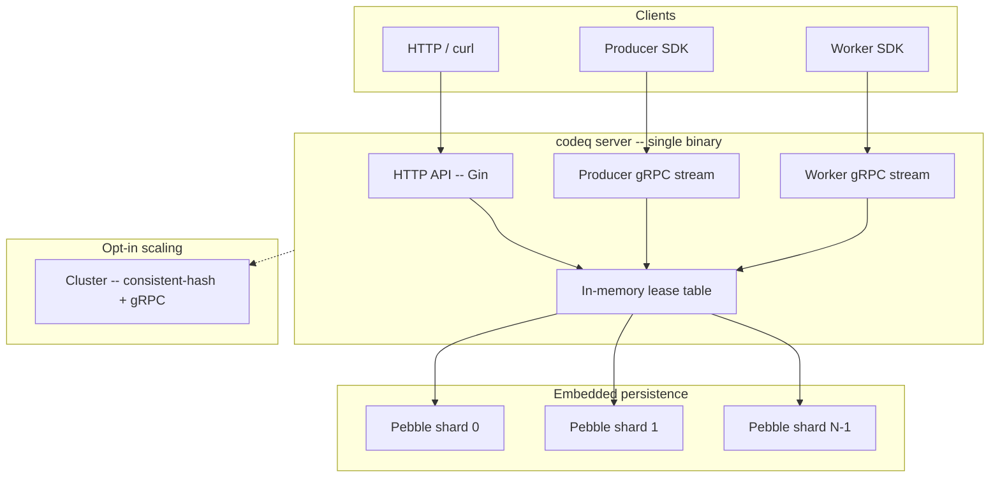

# codeq

> Embedded high-performance task queue. One Go binary, Pebble for
> storage, gRPC streams on the wire. 83k tasks/s on a single 12-core
> box with zero external dependencies.

[](https://pkg.go.dev/github.com/osvaldoandrade/codeq)
[](LICENSE)
[](https://github.com/osvaldoandrade/codeq/issues)

## What is codeq?

codeq is a task queue written in Go. The default deployment is a single
process: the server, the persistence layer (Pebble, the RocksDB-style
LSM from CockroachDB), the lease table, and the gRPC + HTTP API all
share one binary and one disk directory. There is no Redis to run, no
broker to babysit, no consensus to coordinate.

On a 12-core Linux box, that single binary sustains **83,420 tasks/s**
for the full create → claim → complete cycle and **136,392 creates/s**
for producer-only workloads — measured by the in-tree benchmarks in
`internal/bench/`. When one machine is no longer enough, cluster mode
(consistent-hash ring + gRPC routing between nodes) is opt-in.

## Architecture overview



Producers and workers connect over long-lived bidirectional gRPC
streams. Each request hits the in-memory lease table first, then commits
to a Pebble shard chosen by `hash(taskID) % N`. Each shard runs its own
commit pipeline and compaction loop, which is what lets a 4-shard
configuration roughly double the single-shard throughput on the same
hardware.

## Performance

All numbers measured on a 12-core Linux box, Go 1.25.0, loopback gRPC,
Pebble with `fsyncOnCommit=false`. Full bench harness lives in
`internal/bench/`.

| Workload | Throughput | Harness |
|---|---:|---|
| Full cycle (create + claim + complete), 4 Pebble shards | **83,420 tasks/s** | `internal/bench/profile_full_cycle_test.go::TestProfile_FullCycle` (`PHASE8_SHARDS=4 PHASE6_BATCH=32 PHASE6_PROD_BATCH=8`) |
| Producer-only, batched stream | **136,392 creates/s** | `internal/bench/producer_stream_vs_rest_test.go::TestProducerThroughput_StreamBatchPath` |
| Worker-only, batched claim+complete | **23,518 tasks/s** | `internal/bench/worker_stream_saturation_test.go::TestSaturation_StreamPath` (c=4, `PHASE6_BATCH=32`) |
| Shard sweep (full cycle, 1 / 2 / 4 / 6 / 8 shards) | 42k / 65k / **83k** / 68k / 67k tasks/s | same as full cycle harness with `PHASE8_SHARDS` swept |

Sweet spot is 4 shards on a 12-core box; past that, write
amplification and goroutine contention start to dominate. See
[docs/30-performance-baselines.md](docs/30-performance-baselines.md)
for raw output and per-release history.

## Why codeq vs alternatives

| Feature | codeq | Asynq | BullMQ | Celery | Kafka |
|---|---|---|---|---|---|
| External dependency | **None** (embedded Pebble) | Redis | Redis | Redis or RabbitMQ | ZooKeeper / KRaft cluster |
| Single-node full-cycle throughput | **83k tasks/s** | ~10k tasks/s | ~5k tasks/s | ~3k tasks/s | n/a (no task semantics) |
| Language affinity | Go server + Go SDK (gRPC) | Go only | Node only | Python only | Polyglot |
| Durability | Pebble batch + group-commit; optional fsync | Redis AOF / RDB | Redis AOF / RDB | Broker-dependent | Replicated log |
| Multi-tenant isolation | **Built in** (JWT tenantId namespacing) | DIY | DIY | DIY | DIY |
| Time-to-first-task | `docker run` + `curl` | Run Redis + Asynq | Run Redis + worker | Run broker + workers + result backend | Multi-step cluster bootstrap |

codeq is the right call when you want task-queue semantics (claims,
leases, retries, DLQ, results) without standing up a broker. It is the
wrong call if you need Kafka-scale event streaming or distributed
consensus by default — multi-node deployments rely on cluster mode and
the consistent-hash ring, not Paxos/Raft.

## Quick start (5 minutes)

```bash
git clone https://github.com/osvaldoandrade/codeq
cd codeq
docker compose \
  -f deploy/docker-compose/local-dev/compose.yaml \
  -f deploy/docker-compose/local-dev/compose.override.yaml \
  up -d
```

This brings up the codeq server on `http://localhost:8080` with the
embedded Pebble backend and seeds example tasks.

Create a task:

```bash
curl -X POST http://localhost:8080/v1/codeq/tasks \
  -H 'Authorization: Bearer <producer-token>' \
  -H 'Content-Type: application/json' \
  -d '{"command":"GENERATE_MASTER","payload":{"jobId":"j-123"},"priority":3}'
```

Claim a task (as a worker):

```bash
curl -X POST http://localhost:8080/v1/codeq/tasks/claim \
  -H 'Authorization: Bearer <worker-token>' \
  -H 'Content-Type: application/json' \
  -d '{"commands":["GENERATE_MASTER"],"leaseSeconds":120,"waitSeconds":10}'
```

Submit a result:

```bash
curl -X POST http://localhost:8080/v1/codeq/tasks/<id>/result \
  -H 'Authorization: Bearer <worker-token>' \
  -H 'Content-Type: application/json' \
  -d '{"status":"COMPLETED","result":{"ok":true}}'
```

For high-throughput producers and workers, use the gRPC streaming API
(2-3x the HTTP throughput, amortized auth, pipelined acks): see
[docs/34-streaming-api-guide.md](docs/34-streaming-api-guide.md).

## Where next

- [Getting started tutorial](docs/00-getting-started.md) — your first
  task, end to end.
- [Overview](docs/01-overview.md) — goals, non-goals, when (and when
  not) to pick codeq.
- [Architecture](docs/03-architecture.md) — package layout and request
  flows.
- [Performance tuning](docs/17-performance-tuning.md) — shard counts,
  batch sizes, fsync trade-offs.
- [Operational runbooks](docs/29-operational-runbooks.md) — on-call
  procedures for the common failure modes.
- [Streaming API guide](docs/34-streaming-api-guide.md) — gRPC
  producer and worker streams.
- [Cluster architecture](docs/05-cluster-architecture.md) — multi-node
  consistent-hash deployment.
- [Style guide](docs/_STYLE.md) — voice, numbers, diagrams, links.

## Go SDK

codeq ships a Go SDK that talks to the server over gRPC streams. It
lives inside the main module:

- `pkg/producerclient` — task creation (single + batched, streaming).
- `pkg/workerclient` — claim, heartbeat, result submission (streaming).

Install:

```bash
go get github.com/osvaldoandrade/codeq
```

Minimal producer:

```go
import (
    "context"
    "github.com/osvaldoandrade/codeq/pkg/producerclient"
)

cli, _ := producerclient.New(producerclient.Config{
    Addr:  "localhost:9092",
    Token: producerToken,
})
defer cli.Close()

sess, _ := cli.Connect(context.Background())
defer sess.Close()

taskID, _ := sess.Produce(ctx, producerclient.CreateRequest{
    Command:  "GENERATE_MASTER",
    Payload:  []byte(`{"jobId":"j-123"}`),
    Priority: 3,
})
```

See [docs/integrations/go-integration.md](docs/integrations/go-integration.md)
and [docs/34-streaming-api-guide.md](docs/34-streaming-api-guide.md) for the
full surface. For non-Go callers, use the HTTP API
([docs/04-http-api.md](docs/04-http-api.md)) directly.

## Repo layout

```text
cmd/                  CLI entrypoints (codeq install, server)
internal/             unexported packages
  bench/              throughput + latency benchmarks (source of truth for perf claims)
  cluster/            consistent-hash ring, gRPC router, bloom gossip
  controllers/        HTTP handlers (Gin)
  middleware/         auth, tracing, rate-limit, tenant extraction
  producer/           gRPC producer-stream server
  worker/             gRPC worker-stream server
  repository/         persistence implementations (Pebble)
  services/           scheduler, results, callbacks, subscriptions
pkg/                  public packages (app, auth, config, domain,
                      producerclient, workerclient — the Go SDK)
deploy/               docker-compose and Kubernetes config
helm/codeq/           Helm chart and size profiles
docs/                 specifications, runbooks, performance baselines
examples/             end-to-end example applications
```

## Install the CLI

macOS, Linux, or Windows via Git Bash:

```bash
curl -fsSL https://raw.githubusercontent.com/osvaldoandrade/codeq/main/install.sh | sh
```

Or via npm:

```bash
npm i -g @osvaldoandrade/codeq
codeq --help
```

To generate a Docker or Kubernetes install bundle (with embedded Pebble
by default, no Redis required):

```bash
codeq install
```

See [docs/15-cli-reference.md](docs/15-cli-reference.md) for the full
CLI surface.

## Contributing

Issues and PRs are welcome. Before opening a PR, read
[CONTRIBUTING.md](CONTRIBUTING.md) for the development workflow, and
[docs/_STYLE.md](docs/_STYLE.md) for the documentation style.

## License

MIT. See [LICENSE](LICENSE).
