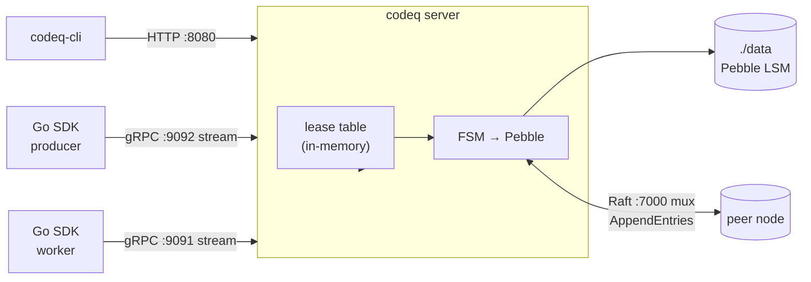

# codeq

codeq is a task queue server written in Go. It accepts tasks over an HTTP API
or a pair of bidirectional gRPC streams, persists them on an embedded LSM tree
([Pebble](https://github.com/cockroachdb/pebble), the engine CockroachDB runs
on), and hands them out to workers under a lease-based at-least-once contract.
One binary holds the storage, lease table, scheduler, HTTP API, and gRPC
streams, and writes to one disk directory. There is no external broker.

[](https://pkg.go.dev/github.com/osvaldoandrade/codeq)
[](LICENSE)
[](https://github.com/osvaldoandrade/codeq/issues)

## What is codeq?

codeq is a durable, multi-tenant task-queue server with at-least-once delivery
over HTTP and gRPC. One binary runs it as a single high-throughput process or a
Raft-replicated cluster — modes are mutually exclusive and set at config time
(`pkg/config/config.go:662-683`):

| Mode          | Topology                          | Durability                       | Failure model                               |
|---------------|-----------------------------------|----------------------------------|---------------------------------------------|
| Single node   | 1 process, 1 Pebble DB            | Pebble WAL + group commit        | Process death loses the unflushed batch     |
| Multi-shard   | 1 process, N Pebble DBs           | Per-shard WAL, FNV-1a routing    | Same as single node, N× write parallelism   |
| Raft cluster  | 3 (or 5) processes, replicated FSM| WAL + replicated log + snapshots | Tolerates `f = (N-1)/2` node failures       |

## Architecture



Ports and protocols:

- `:8080` — HTTP/JSON API (Gin), used by `codeq-cli`, curl, and dashboards.
- `:9092` — producer gRPC bidirectional stream (`internal/producer/server.go`).
- `:9091` — worker gRPC bidirectional stream (`internal/worker/server.go`).
- `:7000` — Raft transport, multiplexed across shards by a 4-byte big-endian
  group-ID prefix (`internal/raft/mux_transport.go`).

Every write passes through the in-memory lease table and is then committed to
Pebble. With Raft enabled, the write is first proposed to the replicated log;
once a majority quorum acks, the FSM applies it to Pebble — `SetRepr` then
`Commit(NoSync)` at `internal/raft/fsm.go:43-62`.

### Sharding

When `sharding.numShards > 1`, the repository routes each task to shard
`FNV-1a-64(taskID) % N`
(`internal/repository/pebble/sharded_task_repository.go:58-64`). Each shard
owns its own Pebble DB, its own WAL, and its own group-commit coalescer. This
buys write parallelism on multi-core hardware without crossing the network.

### Group commit

Both the Pebble layer and the Raft FSM batch concurrent writes before
fsync/apply:

- The Pebble coalescer merges up to **64** in-flight batches per commit
  (`maxMergeBatch`, `commitChanBuf = 1024`,
  `internal/repository/pebble/db.go:117-128`).
- The Raft apply loop is the single owner of `raft.Apply`; it drains up to
  **128** queued batches, merges them with `SetRepr`, and replays them in one
  `raft.Apply` call (`raftMergeBatch`, `internal/raft/db.go:142-154` and
  `:616-709`). This coalescing recovered 30–50% of Raft throughput.

Bigger batches raise tail latency for the first caller in a batch but lift
steady-state throughput.

## Deployment modes and measured throughput

All figures come from in-tree benchmarks on a twelve-core Linux box (loopback
network, single Pebble shard at `NoSync`, 32 producer goroutines, 128 worker
slots). Numbers are machine-dependent — re-run them yourself.

| Mode                          | Throughput (create + claim + complete)        | Bench source                                       |
|-------------------------------|-----------------------------------------------|----------------------------------------------------|
| Single node, gRPC stream      | **76,639 tasks/s**                            | `internal/bench/profile_full_cycle_test.go`        |
| 3-node Raft, gRPC stream      | **~9–10k cycles/s** (after the #595 coalescer)| `pkg/app/raft_grpc_bench_test.go`                  |
| 3-node Raft, HTTP REST        | **~3.9k cycles/s** (1-shard and 4-shard)      | `pkg/app/raft_smart_routing_bench_test.go`         |

Raft costs 7.5–9× the single-node throughput: every write pays one round-trip
across `:7000` plus a majority disk fsync. Pick Raft when you need fault
tolerance (`f = 1` with `N = 3`); pick single-node, optionally sharded, when
you need the most throughput on one box. The HTTP REST path against Raft tops
out lower than the gRPC path because of the Go `http.Transport` idle-connection
mutex on the client, not the cluster.

## When to use codeq

- You want claim/lease/retry/DLQ semantics, not a raw log.
- You want one binary and one disk directory, no broker.
- You need either single-node throughput **or** a small replicated cluster, not
  both at once.
- You speak Go, or are happy talking HTTP from any language.

## When not to use codeq

| If you need…                              | Pick…                                  |
|-------------------------------------------|----------------------------------------|
| Pub/sub at Kafka scale, retained log      | Kafka                                  |
| At-least-once delivery with cloud queueing| SQS                                    |
| A Python-native task framework            | Celery                                 |
| A Redis-backed Go task queue              | Asynq (needs Redis)                    |
| Cross-DC replication, geo-aware routing   | Build on Kafka or a managed system     |

codeq matches Asynq's API surface but stores tasks in an embedded LSM instead
of Redis. The storage is local to the process, so durability and HA come from
Pebble and Raft rather than a separately managed data store.

## Quick start

Install the CLI, then generate and launch a Pebble-backed stack:

```bash
curl -fsSL https://raw.githubusercontent.com/osvaldoandrade/codeq/main/install.sh | sh
codeq install --execute
```

`codeq install` writes a Docker bundle (defaulting to the prebuilt
`ghcr.io/osvaldoandrade/codeq-service` image), and `--execute` runs
`docker compose up` for you. The server comes up on `http://localhost:8080`
with Pebble at `./data`.

Create a task over HTTP:

```bash
curl -X POST http://localhost:8080/v1/codeq/tasks \
  -H 'Authorization: Bearer <producer-token>' \
  -H 'Content-Type: application/json' \
  -d '{"command":"GENERATE_MASTER","payload":{"jobId":"j-123"},"priority":3}'
```

Claim a task:

```bash
curl -X POST http://localhost:8080/v1/codeq/tasks/claim \
  -H 'Authorization: Bearer <worker-token>' \
  -H 'Content-Type: application/json' \
  -d '{"commands":["GENERATE_MASTER"],"leaseSeconds":120,"waitSeconds":10}'
```

Submit a result:

```bash
curl -X POST http://localhost:8080/v1/codeq/tasks/<id>/result \
  -H 'Authorization: Bearer <worker-token>' \
  -H 'Content-Type: application/json' \
  -d '{"status":"COMPLETED","result":{"ok":true}}'
```

For high-throughput producers and workers, use the gRPC streaming API — a
long-lived bidirectional stream amortizes auth and pipelines acks. See the
[Producer Stream](https://github.com/osvaldoandrade/codeq/wiki/IO-Producer-Stream)
and [Worker Stream](https://github.com/osvaldoandrade/codeq/wiki/IO-Worker-Stream)
wiki pages.

## Go SDK

The Go SDK ships inside the main module — there is no separate package to
install:

- `pkg/producerclient` — create tasks, single or batched, streaming on `:9092`.
- `pkg/workerclient` — claim, heartbeat, complete, streaming on `:9091`.

```bash
go get github.com/osvaldoandrade/codeq
```

Minimal producer:

```go
import (
    "context"
    "github.com/osvaldoandrade/codeq/pkg/producerclient"
)

cli, _ := producerclient.New(producerclient.Config{
    Addr:  "localhost:9092",
    Token: producerToken,
})
defer cli.Close()

sess, _ := cli.Connect(context.Background())
defer sess.Close()

taskID, _ := sess.Produce(ctx, producerclient.CreateRequest{
    Command:  "GENERATE_MASTER",
    Payload:  []byte(`{"jobId":"j-123"}`),
    Priority: 3,
})
```

The worker client runs a claim loop for you: pass a `Handler` to
`workerclient.Run`, and return `Completed`, `Failed`, `Nack`, or `Abandon` per
task. Callers outside Go talk to the HTTP API on `:8080`
([REST API reference](https://github.com/osvaldoandrade/codeq/wiki/IO-REST-API)).

## Comparison

| Property                            | codeq                          | Asynq             | BullMQ            | Celery            | Kafka                    |
|-------------------------------------|--------------------------------|-------------------|-------------------|-------------------|--------------------------|
| Storage                             | Pebble (LSM), embedded         | Redis             | Redis             | Redis/Rabbit      | Replicated log           |
| External dependency                 | **None**                       | Redis             | Redis             | Broker + RB       | KRaft / ZooKeeper        |
| Task semantics (claim/lease/DLQ)    | Yes                            | Yes               | Yes               | Yes               | No (log only)            |
| HA model                            | Raft consensus (f=1 with N=3)  | Redis repl        | Redis repl        | Broker-dep        | ISR + leader election    |
| Client surface                      | Go (HTTP + gRPC, Go SDK)       | Go only           | Node only         | Python only       | Polyglot                 |
| Single-node throughput (full cycle) | 76,639 tasks/s (gRPC)          | not measured here | not measured here | not measured here | n/a (no task semantics)  |

Only the codeq number is from an in-tree benchmark
(`internal/bench/profile_full_cycle_test.go`). The other rows describe storage
and topology, not throughput — measure each candidate on your own workload.

## Repo layout

```text
cmd/                  CLI entrypoints (codeq, codeq-cli, server)
internal/             unexported packages
  bench/              throughput + latency benchmarks (source of truth for perf claims)
  cluster/            consistent-hash ring + gRPC router (legacy; use raft for HA)
  controllers/        HTTP handlers (Gin)
  middleware/         auth, tracing, rate-limit, tenant extraction
  producer/           producer gRPC stream server (:9092)
  raft/               replicated log, FSM, mux transport (:7000)
  repository/         Pebble persistence + sharded repository
  services/           scheduler, results, callbacks, subscriptions
  worker/             worker gRPC stream server (:9091)
pkg/                  public packages
  app/                application bootstrap (single, sharded, raft)
  auth/               JWT + tenant scoping
  config/             config parsing, mode mutual-exclusion checks
  domain/             task model
  producerclient/     Go producer SDK
  workerclient/       Go worker SDK
deploy/               docker-compose and Kubernetes config
examples/             example applications and integration patterns
helm/codeq/           Helm chart and size profiles
npm/                  npm distribution wrapper for codeq-cli
```

Cluster mode (consistent-hash ring + gRPC routing) is preserved for reference.
For new HA deployments, use Raft replication — see
[Raft Replication](https://github.com/osvaldoandrade/codeq/wiki/IO-Raft-Replication)
and
[Cluster-Level Failover](https://github.com/osvaldoandrade/codeq/wiki/Concepts-Cluster-Level-Failover).

## Install the CLI

On macOS, Linux, or Windows via Git Bash:

```bash
curl -fsSL https://raw.githubusercontent.com/osvaldoandrade/codeq/main/install.sh | sh
```

The script downloads a prebuilt binary from GitHub Releases and falls back to
building from source if no binary matches your platform. You can also install
via npm, a thin wrapper that fetches the same binary:

```bash
npm i -g @osvaldoandrade/codeq
codeq --help
```

To generate a Docker or Kubernetes install bundle, run `codeq install`. It
defaults to the prebuilt `ghcr.io/osvaldoandrade/codeq-service` image — no
local build step — and accepts `--target docker|kubernetes`, `--size
dev|small|medium|large`, and `--execute` to launch immediately. See the
[Get Started](https://github.com/osvaldoandrade/codeq/wiki/Get-Started-Run-Locally)
wiki page for the full CLI surface.

## Documentation

The full documentation lives in the
[**codeQ wiki**](https://github.com/osvaldoandrade/codeq/wiki) — 43 pages across
six sections:

- [Get Started](https://github.com/osvaldoandrade/codeq/wiki/Get-Started-Overview) —
  install, run locally, run in Docker, Docker Compose, Kubernetes.
- [Concepts and Architecture](https://github.com/osvaldoandrade/codeq/wiki/Concepts-Overview) —
  tasks, queue model, sharding, leases, multi-tenancy, persistence engine,
  consensus, failover, deployment modes.
- [Sous Functions](https://github.com/osvaldoandrade/codeq/wiki/Sous-Functions-Overview) —
  the FaaS layer ([github.com/osvaldoandrade/sous](https://github.com/osvaldoandrade/sous))
  built on top of codeQ.
- [CodeQ IO](https://github.com/osvaldoandrade/codeq/wiki/IO-Overview) —
  gRPC producer/worker streams, REST API, persistence engine, group commit,
  Raft replication, mux transport.
- [Observability](https://github.com/osvaldoandrade/codeq/wiki/Observability-Overview) —
  distributed tracing (OpenTelemetry), Prometheus metrics, pprof profiling,
  structured logging.
- [Performance](https://github.com/osvaldoandrade/codeq/wiki/Performance-Overview) —
  measured throughput, the cost of HA, multi-shard scaling, tuning knobs, bench
  harness.

## Contributing

Issues and PRs are welcome. Before opening a PR, read
[CONTRIBUTING.md](CONTRIBUTING.md). The full documentation lives at
[github.com/osvaldoandrade/codeq/wiki](https://github.com/osvaldoandrade/codeq/wiki).

## License

MIT. See [LICENSE](LICENSE).
