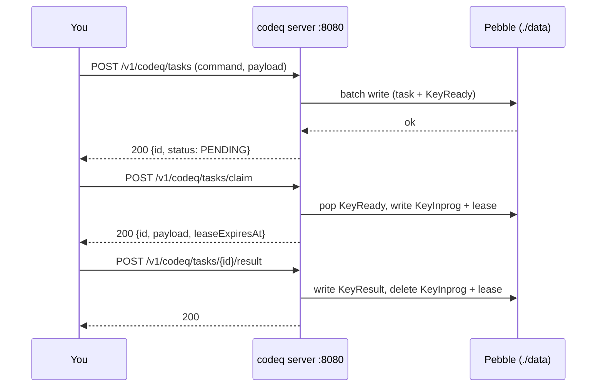

# Getting started

Goal: a single codeQ server running on your laptop, with one task created,
claimed, and completed end-to-end. 10 minutes if you have Go installed.

Single-node, embedded [Pebble](https://github.com/cockroachdb/pebble), no
external dependencies. Authentication is a static bearer token so
everything below is `curl` or the `codeq` CLI.

## 1. Install

Three ways. Pick one.

### Option A: Go install (fastest if you have Go 1.25+)

```bash
go install github.com/osvaldoandrade/codeq/cmd/codeq@latest
codeq --help
```

`go install` builds the `codeq` CLI binary. The server binary
(`cmd/server`) is built separately from a clone — see Option C if you
need to run a server locally without Docker.

### Option B: npm (CLI wrapper around the same binary)

```bash
npm install -g @osvaldoandrade/codeq
codeq --help
```

The npm package downloads a pre-built binary from the matching GitHub
Release (see `npm/scripts/postinstall.js`). Same `codeq` executable as
Option A.

### Option C: install script (clone + build)

```bash
curl -fsSL https://raw.githubusercontent.com/osvaldoandrade/codeq/main/install.sh | sh
```

Requires `git` and `go`. The script clones the repo, runs
`go build -o codeq ./cmd/codeq`, and drops the binary in the first
writable directory on `$PATH` (falls back to `~/.local/bin`). See
[`install.sh`](../install.sh) for the exact rules.

Verify:

```bash
codeq --help
```

## 2. Start a server

The CLI binary (`codeq`) is the *client*. The server lives in
`cmd/server`. The simplest way to run one is from a repo clone with Go
installed:

```bash
git clone https://github.com/osvaldoandrade/codeq
cd codeq

# Minimal Pebble + static-auth config.
cat > /tmp/codeq.yml <<'EOF'
port: 8080
persistenceProvider: pebble
persistenceConfig:
  path: ./data
  fsyncOnCommit: false
producerAuthProvider: static
producerAuthConfig:
  token: dev-token
  subject: producer-dev
  raw:
    role: ADMIN
    tenantId: dev-tenant
workerAuthProvider: static
workerAuthConfig:
  token: dev-token
  subject: worker-dev
  scopes:
    - codeq:claim
    - codeq:heartbeat
    - codeq:abandon
    - codeq:nack
    - codeq:result
    - codeq:subscribe
  eventTypes: ["*"]
  raw:
    tenantId: dev-tenant
EOF

CODEQ_CONFIG_PATH=/tmp/codeq.yml go run ./cmd/server
```

What you should see in the log:

- HTTP listener on `:8080`
- Pebble store opened under `./data/` (created if missing)
- No raft (`RAFT_ENABLED` unset → single-node)
- One shard (`numShards` defaults to 1; see
  [`docs/06-sharding.md`](./06-sharding.md))

If you prefer Docker, the `local-dev` compose template wires the same
config and adds a seed job:

```bash
docker compose \
  -f deploy/docker-compose/local-dev/compose.yaml \
  -f deploy/docker-compose/local-dev/compose.override.yaml \
  up -d
curl -sSf http://localhost:8080/metrics | head
```

> **Note**: the default `persistenceProvider` in `pkg/config/config.go`
> falls back to `redis` for backward compatibility. The example config
> above sets it explicitly to `pebble` — required for a zero-dependency
> single-node run.

## 3. Create a task

Two equivalent ways.

### curl

```bash
curl -s -X POST http://localhost:8080/v1/codeq/tasks \
  -H 'Authorization: Bearer dev-token' \
  -H 'Content-Type: application/json' \
  -d '{"command":"PROCESS_ORDER","payload":{"orderId":"42"},"priority":5}'
```

Response (truncated):

```json
{
  "id": "550e8400-e29b-41d4-a716-446655440000",
  "command": "PROCESS_ORDER",
  "status": "PENDING",
  "priority": 5,
  "createdAt": "2026-05-18T12:00:00Z"
}
```

### codeq CLI

```bash
codeq task create \
  --event PROCESS_ORDER \
  --payload '{"orderId":"42"}' \
  --priority 5 \
  --producer-token dev-token \
  --base-url http://localhost:8080
```

Same effect. The CLI flag is `--event`, but the HTTP wire field is
`command` — both refer to the routing key. See
[`cmd/codeq/main.go`](../cmd/codeq/main.go) and
[`docs/04-http-api.md`](./04-http-api.md) for the full surface.

## 4. Claim and complete

A worker claims the task with a lease, processes it, and submits the
result.

```bash
# Claim (long-poll up to 5s for a task in PROCESS_ORDER).
CLAIMED=$(curl -s -X POST http://localhost:8080/v1/codeq/tasks/claim \
  -H 'Authorization: Bearer dev-token' \
  -H 'Content-Type: application/json' \
  -d '{"commands":["PROCESS_ORDER"],"leaseSeconds":60,"waitSeconds":5}')

echo "$CLAIMED"
TASK_ID=$(echo "$CLAIMED" | jq -r '.id')
```

Response (truncated):

```json
{
  "id": "550e8400-...",
  "command": "PROCESS_ORDER",
  "payload": {"orderId":"42"},
  "status": "IN_PROGRESS",
  "leaseExpiresAt": "2026-05-18T12:01:00Z"
}
```

The lease is 60 seconds: if the worker does not submit a result or
heartbeat before it expires, the
[reaper](./06b-lease-management.md) returns the task to the queue with
an incremented attempt counter (at-least-once delivery).

Submit the result:

```bash
curl -s -X POST "http://localhost:8080/v1/codeq/tasks/${TASK_ID}/result" \
  -H 'Authorization: Bearer dev-token' \
  -H 'Content-Type: application/json' \
  -d '{"status":"COMPLETED","result":{"ok":true}}'
```

Verify it stuck:

```bash
curl -s "http://localhost:8080/v1/codeq/tasks/${TASK_ID}" \
  -H 'Authorization: Bearer dev-token' | jq '.status'
# "COMPLETED"
```

## What just happened



Everything lives in one process. The lease is in-memory (rebuilt from a
`KeyInprog` scan on restart) and the task body, queues, and results live
in Pebble under `./data/`. See
[`docs/07b-storage-pebble.md`](./07b-storage-pebble.md) for the on-disk
layout.

## Where to go next

- **HA + failover**: [3-node raft cluster tutorial](./43-tutorial-raft-cluster.md) —
  consensus-replicated writes, automatic leader election.
- **Deployment decision matrix**: [Deployment modes](./41-deployment-modes.md) —
  when to pick single-node, raft cluster, or sharded.
- **Go SDK**: [Go SDK tutorial](./44-tutorial-go-sdk.md) — typed
  producer + worker client.
- **HTTP API reference**: [HTTP API](./04-http-api.md) — every endpoint,
  every field.
- **CLI reference**: [CLI](./15-cli-reference.md) — all `codeq`
  subcommands.
- **Configuration**: [Configuration](./14-configuration.md) — every
  config key and env var.

## Troubleshooting

| Symptom | Likely cause |
|---|---|
| `401 unauthorized` | Token mismatch — config says `dev-token`, your `Authorization` header doesn't |
| `404` on claim | Worker `eventTypes` allowlist doesn't include the task's command |
| Server exits at startup with a Redis connection error | `persistenceProvider` defaulted to `redis` (see `pkg/config/config.go:511-514`) — set `persistenceProvider: pebble` in your config |
| `task lease expired` on result submit | Took longer than `leaseSeconds` — increase it, or call heartbeat |

## See also

- [Overview](./01-overview.md)
- [Architecture](./03-architecture.md)
- [Storage layout (Pebble)](./07b-storage-pebble.md)
- [Local development](./22-local-development.md)
- [Style guide](./_STYLE.md)
