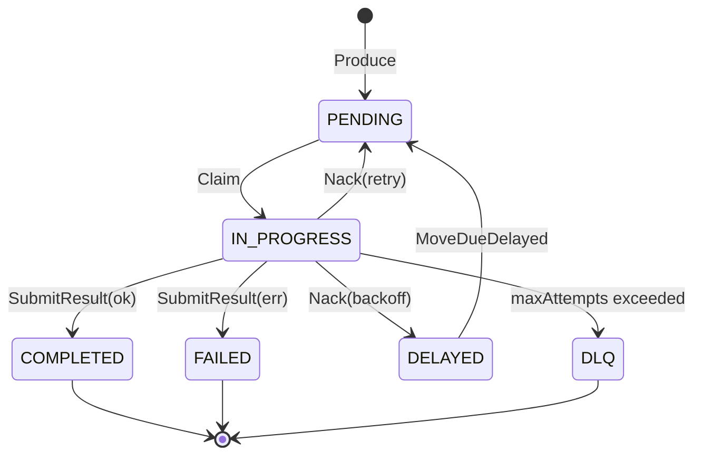
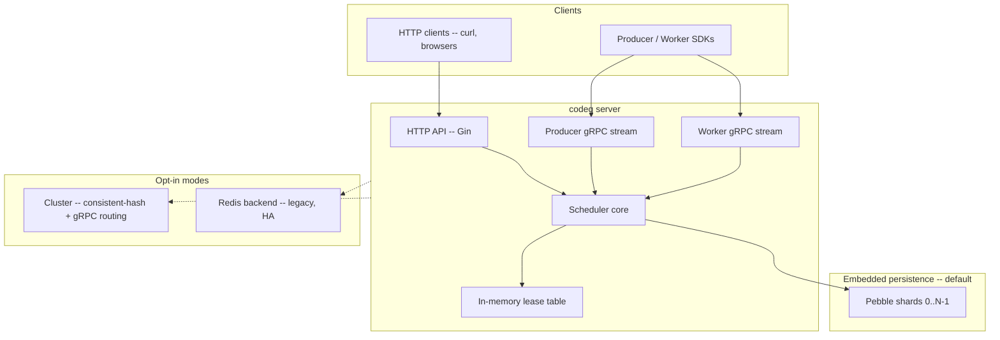

# Overview

> Source-of-truth for the value proposition lives in
> [_STYLE.md § Value proposition](./_STYLE.md#1-value-proposition).
> Other docs may cite this overview, but the style guide wins ties.

## What is codeq

codeq is a task queue written in Go that runs as a single process and
stores everything in an embedded LSM (Pebble, the RocksDB-style engine
from CockroachDB). The hot path is bidirectional gRPC streams from
producers and workers; under the streams sits an intra-process shard
table (up to N independent Pebble instances) and an in-memory lease
table. On a 12-core Linux box the single binary sustains
**83,420 tasks/s** for the full create → claim → complete cycle and
**136,392 creates/s** for producer-only workloads.

No Redis, no broker, no coordinator required in the default mode.
Cluster (consistent-hash ring + gRPC routing) and a legacy Redis backend
are opt-in for HA and multi-node deployments.

## Goals

- **Single binary.** Server, persistence, lease table, HTTP + gRPC API
  all in one process. One disk directory. One systemd unit. No external
  database required.
- **80k+ tasks/s on one machine.** Full create → claim → complete cycle
  measured by `internal/bench/profile_full_cycle_test.go` with 4 Pebble
  shards, batched producer + worker streams.
- **gRPC streaming as a first-class API.** Long-lived bidirectional
  streams amortize auth and middleware; multiple requests can be in
  flight before responses arrive.
- **Multi-tenant by construction.** Every queue key is namespaced by
  `tenantId` extracted from the JWT. Workers can only claim tasks from
  their own tenant. No application code required to keep tenants
  isolated.
- **Cluster opt-in.** When one machine is no longer enough, run a
  consistent-hash cluster (no consensus, no coordinator — static
  membership + gRPC routing).
- **Configurable durability.** `fsyncOnCommit` is a per-deployment knob.
  Off by default for throughput; turn it on when your SLO demands it.

## Non-goals

- **Kafka-scale event streaming.** codeq is a task queue, not a
  partitioned log. If you want millions of messages/s with consumer
  groups, use Kafka.
- **Distributed consensus by default.** Single-node and consistent-hash
  cluster modes ship without consensus — node membership is configured
  at startup. **Raft replication is opt-in** (see
  [40-raft-replication.md](./40-raft-replication.md)): when enabled,
  every Pebble write goes through `raft.Apply` and lands on every
  replica's local Pebble via the FSM. Mutually exclusive with the
  static-ring cluster mode.
- **HA without explicit setup.** A single Pebble process loses
  availability while it restarts. HA requires an opt-in configuration:
  either raft replication (3+ nodes, automatic failover) or a static
  consistent-hash cluster (no consensus, no replication). Each is a
  trade-off the operator picks consciously.
- **Exactly-once delivery.** Delivery is at-least-once. A worker that
  crashes between completion and ACK will see the task re-delivered
  after the lease expires.
- **Global FIFO across all commands.** Ordering is per-(command,
  tenant, priority) within a Pebble shard. Cross-shard ordering is not
  defined.
- **Worker discovery or scheduling.** codeq does not register workers
  or assign work; workers pull when they are ready.

## Data model summary

- **Task** — unit of work. Identified by UUID. Carries `command`
  (routing key), `payload` (opaque JSON bytes), `priority` (0-9),
  optional `webhook` URL, and lifecycle state.
- **Result** — completion record. Stored separately from the task body
  so completion can be GC'd on a different schedule than the task
  metadata.
- **Subscription** — webhook registration. A worker (or coordinator)
  registers a callback URL for one or more event types; codeq pings it
  when new work appears.

Task lifecycle:

Full schema and state semantics in
[02-domain-model.md](./02-domain-model.md).

## Architecture summary

Request flow at a glance:

1. Producer or worker opens a gRPC stream (or sends an HTTP request).
2. The middleware chain validates the JWT, extracts `tenantId`, and
   applies rate limits.
3. The scheduler routes the operation to its Pebble shard
   (`hash(taskID) % numShards`) and updates the in-memory lease table.
4. Pebble commits the batch; the group-commit coalescer (Phase 1.1)
   merges concurrent writers into one fsync.
5. On worker stream, ready tasks are pushed back through the same long-
   lived connection — no per-claim handshake.

Package-level breakdown in [03-architecture.md](./03-architecture.md).

## When to use codeq

- **Single-node task queue for a backend service.** You want claims,
  leases, retries, DLQ, and results without standing up Redis or a
  broker.
- **Embedded sidecar in your own Go binary.** Import `pkg/app` and run
  codeq in-process alongside your application.
- **Multi-tenant SaaS background jobs.** Per-tenant queue isolation is
  built in; you do not have to namespace keys yourself.
- **High-throughput producers with small payloads.** The batched
  producer stream sustains 100k+ creates/s on commodity hardware.
- **Polyglot worker fleets.** Workers in Go, Java, Node, or Python can
  all share the same queue via the official SDKs.
- **Local development without external services.** `docker run codeq`
  is enough; no Redis container, no compose dance.

## When NOT to use codeq

- **Kafka-scale event streaming.** Millions of events/s with consumer
  groups, replay, and a retention window measured in days — use Kafka.
- **Distributed transactions.** codeq has no two-phase commit and no
  cross-shard transactions. If your business logic needs atomic updates
  across multiple tasks, build it above codeq with an outbox pattern or
  pick a workflow engine.
- **HA without Redis or cluster mode.** A single Pebble process is
  unavailable during restart. If your SLO does not tolerate a few
  seconds of unavailability, you need the Redis backend (multi-node) or
  a Pebble cluster.
- **Workflow orchestration with branching, child tasks, timers, and
  long-running state.** Use Temporal, Cadence, or Step Functions — they
  are purpose-built for that. codeq is a queue.
- **Exactly-once delivery semantics.** codeq is at-least-once. Idempotent
  handlers are the operator's responsibility.

## Performance baselines

Measured on a 12-core Linux box, Go 1.25.0, loopback gRPC, Pebble with
`fsyncOnCommit=false`, 20s measurement window after a 2s warm-up.

| Workload | Throughput | Harness |
|---|---:|---|
| Full cycle, 4 shards, batched | **83,420 tasks/s** | `internal/bench/profile_full_cycle_test.go::TestProfile_FullCycle` (`PHASE8_SHARDS=4 PHASE6_BATCH=32 PHASE6_PROD_BATCH=8`) |
| Producer-only, batched stream | **136,392 creates/s** | `internal/bench/producer_stream_vs_rest_test.go::TestProducerThroughput_StreamBatchPath` (32 goroutines, batch=16) |
| Worker-only, batched stream | **23,518 tasks/s** | `internal/bench/worker_stream_saturation_test.go::TestSaturation_StreamPath` (c=4, `PHASE6_BATCH=32`) |
| Shard sweep | 1 shard: 42k; 2: 65k; **4: 83k**; 6: 68k; 8: 67k | same as full cycle, `PHASE8_SHARDS` swept |

Sweet spot is 4 shards on this hardware. Past that, the cost of more
commit pipelines + compaction loops outweighs the parallelism win. See
[30-performance-baselines.md](./30-performance-baselines.md) for raw
output, allocator stats, and the per-release history.

## Comparativos resumidos

| Dimension | codeq | Asynq | BullMQ | Kafka |
|---|---|---|---|---|
| External dependency | **None** | Redis | Redis | ZooKeeper / KRaft |
| Single-node full-cycle throughput | **83k tasks/s** | ~10k | ~5k | n/a (no task semantics) |
| Language | Go server, multi-language SDKs | Go | Node | Polyglot |
| Multi-tenant native | **Yes** | DIY | DIY | DIY |
| HA model | Cluster (consistent-hash ring, opt-in) | Redis | Redis | Replicated log |

Full table with Sidekiq, Celery, and Temporal lives in
[_STYLE.md § Comparativos](./_STYLE.md#comparativos-use-verbatim-or-as-a-base).

## What changed (Phases 1-8 summary)

codeq is built around an embedded Pebble store. The performance
evolution that got it to its current numbers:

| Phase | Theme | Effect |
|---|---|---|
| 1 | Pebble embedded backend | Single-binary deployment with an LSM-backed store. Single-shard throughput ~42k tasks/s. |
| 1.1 | Pebble fast-paths + group-commit coalescer | `MoveDueDelayed` fast-path; concurrent writers coalesce into one fsync. |
| 2 | Streaming groundwork | gRPC streaming surfaces designed. Auth amortized across stream lifetime. |
| 5 | Cluster mode | Consistent-hash ring + gRPC routing between Pebble nodes. No consensus; static membership. |
| 6 | Batched stream paths | Producer and worker streams gain batch APIs. `PHASE6_BATCH` / `PHASE6_PROD_BATCH` env knobs. |
| 8 | Intra-process Pebble sharding | `numShards` opens N independent Pebble instances under one process. 4 shards → ~83k tasks/s on a 12-core box. **Mutually exclusive with cluster mode.** |

PRs #527-#547 landed Phases 1.1, 6, and 8.

## See also

- [_STYLE.md](./_STYLE.md) — documentation voice, numbers, diagrams.
- [Architecture](./03-architecture.md) — package layout and request
  flows.
- [HTTP API](./04-http-api.md) — REST surface.
- [Streaming API guide](./34-streaming-api-guide.md) — gRPC producer
  and worker streams.
- [Performance baselines](./30-performance-baselines.md) — raw bench
  output and per-release history.
- [Performance tuning](./17-performance-tuning.md) — shard counts,
  batch sizes, fsync trade-offs.
- [Cluster architecture](./05-cluster-architecture.md) — multi-node
  consistent-hash deployment.
- [Storage layout (Pebble)](./07b-storage-pebble.md) — keyspace and
  sharding internals.
- [Persistence plugin system](./27-persistence-plugin-system.md) —
  choosing and configuring backends.
