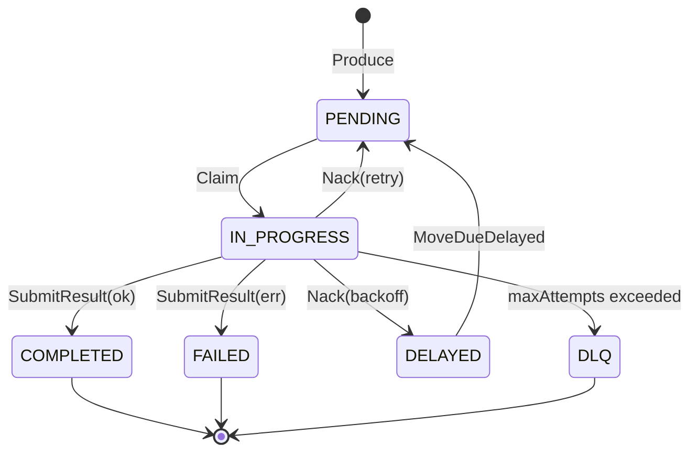
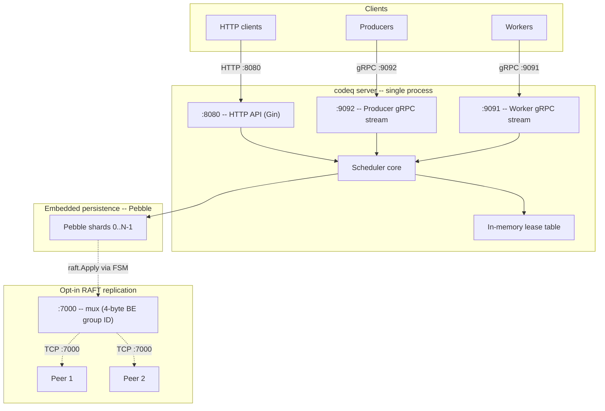

# Overview

> Source-of-truth for the value proposition lives in
> [_STYLE.md § Value proposition](./_STYLE.md#1-value-proposition).
> Other docs may cite this overview, but the style guide wins ties.

## What is codeq

codeq is a task queue written in Go. The server is a single process; the
state lives in an embedded LSM tree (Pebble, the RocksDB-style engine
from CockroachDB). The hot path is bidirectional gRPC streams from
producers and workers; under the streams sits an intra-process shard
table (up to N independent Pebble instances) and an in-memory lease
table.

Three modes share that core:

1. **Single-node** — one Pebble LSM, one process, one disk directory.
2. **Multi-shard single-node** — N independent Pebble LSMs in the same
   process, keyed by `FNV-1a(taskID) mod N`
   ([`internal/repository/pebble/sharded_task_repository.go:61`](../internal/repository/pebble/sharded_task_repository.go)).
3. **RAFT replication** — every write is wrapped as a `raft.Apply` log
   entry, replicated to a majority quorum, and applied by an FSM that
   commits to each replica's local Pebble
   ([`internal/raft/fsm.go:43`](../internal/raft/fsm.go)).

The Pebble (1) and RAFT (3) modes are mutually exclusive with the
historical consistent-hash cluster mode; the check lives in
[`pkg/config/config.go:662`](../pkg/config/config.go). Multi-shard (2)
can be combined with RAFT (3) for one raft group per shard.

## Deployment scenarios

| Mode | Storage | Replication | Parallelism | Measured throughput |
|---|---|---|---|---:|
| Single-node | Pebble (1 LSM) | none | 1 shard | 76,639 tasks/s |
| Multi-shard single-node | Pebble (N LSMs) | none | N shards in parallel | scales with N |
| RAFT (HA) | Pebble + raft log | majority quorum | 1 raft group | ~3.9k cycles/s (HTTP) |
| RAFT + multi-shard | Pebble × N + N raft groups | per-shard quorum | N groups in parallel | ~10k cycles/s |

Citations:

- Single-node 76,639 tasks/s for the full create → claim → complete
  cycle: [`internal/bench/profile_full_cycle_test.go`](../internal/bench/profile_full_cycle_test.go).
- RAFT 3-node, HTTP front-end, smart routing benchmark:
  [`pkg/app/raft_smart_routing_bench_test.go`](../pkg/app/raft_smart_routing_bench_test.go)
  (logs `cycles/s` for 1-shard and 4-shard runs).

The full decision guide — fault model, failover budget, fsync
trade-off, hardware sizing — lives in
[41-deployment-modes.md](./41-deployment-modes.md). This page does not
duplicate it. Picking the right mode: single-node when one machine has
enough disk and CPU headroom and short unavailability during restarts
is acceptable; multi-shard single-node when one Pebble LSM is the
bottleneck (CPU idle but `commitPipeline` hot, or compaction loops
serialized behind a single store); RAFT when an SLO requires automatic
failover with f=1 fault tolerance and you accept the per-write cost of
majority quorum replication.

## Why it goes fast (the CS, not the marketing)

Throughput claims have to point at a primitive. Three primitives carry
most of the budget:

1. **Group commit coalescer on the Pebble write path.** Phase 0
   profiling pinned Pebble's internal `commitPipeline` mutex at 96% of
   the mutex profile and 44% of the block profile around 26k req/s.
   `CommitBatch` now submits to a single coalescer goroutine that
   merges up to `maxMergeBatch = 64` concurrently-arriving batches into
   one Pebble `Commit` before unblocking submitters
   ([`internal/repository/pebble/db.go:71`](../internal/repository/pebble/db.go),
   [`internal/repository/pebble/db.go:341`](../internal/repository/pebble/db.go)).
   N batches → one lock acquisition → one fsync (when fsync is on).
   Tail latency cost is one merge cycle for a late joiner; the design
   trades latency for throughput on purpose.
2. **gRPC bidirectional streams.** Producers and workers open one
   long-lived stream and exchange many messages on it. JWT validation,
   tenant extraction, rate limiting, and TLS handshakes amortize across
   the stream lifetime instead of recurring per request. Multiple
   requests can be in flight before responses arrive (HTTP/2 pipelining
   in practice).
3. **Intra-process Pebble sharding.** `numShards` opens N independent
   Pebble instances under one process. Writes for different task IDs
   hit different `commitPipeline` mutexes; compaction loops run in
   parallel. The shard count is a tunable, not a topological change
   — same binary, same config file.

RAFT changes the math: when replication is attached, the Pebble
coalescer is bypassed and writes flow through `raft.Apply` instead
([`internal/repository/pebble/db.go:79`](../internal/repository/pebble/db.go)).
The raft library does its own log-entry batching, so layering another
coalescer on top would just add latency. Replication uses a 4-byte
big-endian group ID prefix per connection so every shard's raft group
multiplexes onto a single listener
([`internal/raft/mux_transport.go:15`](../internal/raft/mux_transport.go)).

## Goals

- **Single binary.** Server, persistence, lease table, HTTP + gRPC API
  all in one process. One disk directory. One systemd unit. No
  external database required for the single-node and multi-shard
  modes; RAFT mode adds peer connectivity but no extra process types.
- **Throughput on commodity hardware.** Full create → claim → complete
  cycle measured at 76,639 tasks/s on a 12-core Linux box, loopback
  gRPC, `fsyncOnCommit=false`, 4 Pebble shards, batched producer +
  worker streams
  ([`internal/bench/profile_full_cycle_test.go`](../internal/bench/profile_full_cycle_test.go)).
- **gRPC streaming as a first-class API.** Long-lived bidirectional
  streams amortize auth, tenant extraction, and middleware overhead
  over many requests. HTTP/REST exists but is the convenience surface,
  not the hot path.
- **Multi-tenant by construction.** Every queue key is namespaced by
  `tenantId` extracted from the JWT. Workers can only claim tasks
  whose tenant matches their JWT subject. Tenant isolation is a
  property of the keyspace, not a property of application code.
- **Configurable durability.** `fsyncOnCommit` is a per-deployment
  knob. Off by default (NoSync) for throughput; turn it on when your
  SLO demands fsync-per-batch.
- **HA via in-tree consensus.** RAFT replication is built in
  (`internal/raft/`), not bolted on. Three nodes survive one node
  failure (f=1 with N=3). Pebble is the state machine; raft is the
  replication log.

## Non-goals

- **Kafka-scale event streaming.** codeq is a task queue, not a
  partitioned log. No retention window measured in days, no consumer
  groups, no replay. If you want millions of events/s, use Kafka.
- **Cross-task transactions.** codeq is single-task atomic only. No
  two-phase commit, no SAGAs, no cross-shard transactions. Multi-step
  workflows must be composed above codeq with an outbox pattern or
  delegated to a workflow engine (Temporal, Cadence, Step Functions).
- **HA without explicit setup.** A single Pebble process loses
  availability while it restarts. HA requires opting into RAFT (3+
  nodes, majority quorum, automatic failover under leader lease).
  Static consistent-hash cluster mode is preserved for reference; use
  RAFT for HA.
- **Exactly-once delivery.** Delivery is at-least-once. A worker that
  crashes between completion and ACK will see the task re-delivered
  after the lease expires. Idempotency is the application's job.
- **Global FIFO across all commands.** Ordering is per-(command,
  tenant, priority) within a Pebble shard. Cross-shard ordering is not
  defined; the FNV-1a routing is uniform, not order-preserving.
- **Worker discovery or scheduling.** codeq does not register workers
  or assign work. Workers pull when they are ready; backpressure is
  implicit (an idle worker just doesn't issue a claim).

## Data model summary

- **Task** — unit of work. Identified by UUID. Carries `command`
  (routing key), `payload` (opaque JSON bytes), `priority` (0-9),
  optional `webhook` URL, and lifecycle state.
- **Result** — completion record. Stored separately from the task body
  so completion can be garbage-collected on a different schedule than
  the task metadata.
- **Subscription** — webhook registration. A worker or coordinator
  registers a callback URL for one or more event types; codeq calls it
  when matching work appears.

Task lifecycle:

Full schema and state semantics in
[02-domain-model.md](./02-domain-model.md).

## Architecture summary

Ports and protocols:

| Port | Protocol | Surface |
|---|---|---|
| `:8080` | HTTP/1.1 + HTTP/2 (Gin) | REST API, health, metrics, admin |
| `:9092` | gRPC | Producer stream (bidi) |
| `:9091` | gRPC | Worker stream (bidi) |
| `:7000+` | TCP (raft + mux prefix) | RAFT inter-node transport; one shared listener per node, 4-byte BE group ID prefix per connection |

Request flow at a glance:

1. Producer or worker opens a gRPC stream (or sends an HTTP request).
2. The middleware chain validates the JWT, extracts `tenantId`, and
   applies rate limits. Stream-level middleware runs once per stream.
3. The scheduler routes the operation to its Pebble shard
   (`FNV-1a(taskID) mod N`) and updates the in-memory lease table.
4. In single-node / multi-shard mode, the write enters the group commit
   coalescer; up to 64 concurrent batches merge into one Pebble
   `Commit`. In RAFT mode, the coalescer is bypassed and the write
   flows through `raft.Apply`; the FSM applies the committed log entry
   to each replica's local Pebble.
5. On the worker stream, ready tasks are pushed back through the same
   long-lived connection — no per-claim handshake.

Package-level breakdown in [03-architecture.md](./03-architecture.md).
RAFT details in [40-raft-replication.md](./40-raft-replication.md).

## When to use codeq

- **Single-node task queue for a backend service.** You want claims,
  leases, retries, DLQ, and results without a separate broker. One
  binary, one disk directory.
- **Embedded sidecar in your own Go binary.** Import `pkg/app` and run
  codeq in-process alongside your application. Same lifecycle, same
  process supervisor.
- **Multi-tenant SaaS background jobs.** Per-tenant queue isolation is
  enforced in the keyspace and the worker claim check, not by
  application code.
- **Throughput-bound producers with small payloads.** The batched
  producer stream and the group commit coalescer are designed for the
  case where N small writes arrive concurrently from different
  goroutines.
- **HA with f=1 fault tolerance.** Three RAFT nodes survive any one
  node failure; failover is automatic under the leader lease.

## When NOT to use codeq

- **Kafka-scale event streaming.** No retention window, no consumer
  groups, no replay window. Different problem, different tool.
- **Cross-task transactions.** codeq is single-task atomic only — no
  2PC, no SAGAs, no transactional outbox primitive. Compose above
  codeq if you need multi-task atomicity.
- **HA without explicit setup.** A single Pebble process is
  unavailable during restart. Enable RAFT (3+ nodes) before you put
  the queue in front of an SLO that doesn't tolerate a few seconds of
  downtime.
- **Workflow orchestration with branching, child tasks, timers, and
  long-running state.** Use Temporal, Cadence, or Step Functions.
  codeq is a queue, not a workflow engine.
- **Exactly-once delivery semantics.** Delivery is at-least-once.
  Idempotent handlers are the application's responsibility.
- **Order-preserving routing across shards.** Multi-shard mode routes
  by `FNV-1a(taskID) mod N`; the hash is uniform, not stable across
  shard counts and not order-preserving.

## Performance baselines

| Workload | Measured throughput | Harness |
|---|---:|---|
| Single-node, full cycle, batched | **76,639 tasks/s** | [`internal/bench/profile_full_cycle_test.go`](../internal/bench/profile_full_cycle_test.go) |
| 3-node RAFT + HTTP smart-routing | **~3.9k cycles/s** | [`pkg/app/raft_smart_routing_bench_test.go`](../pkg/app/raft_smart_routing_bench_test.go) |

Workload conditions, raw numbers, allocator stats, and per-release
history live in [30-performance-baselines.md](./30-performance-baselines.md).
Tuning knobs (shard counts, batch sizes, fsync trade-offs) are
documented in [17-performance-tuning.md](./17-performance-tuning.md).

## See also

- [_STYLE.md](./_STYLE.md) — documentation voice, numbers, diagrams.
- [Architecture](./03-architecture.md) — package layout and request
  flows.
- [Deployment modes](./41-deployment-modes.md) — decision guide.
- [RAFT replication](./40-raft-replication.md) — consensus, FSM,
  snapshot, mux transport.
- [HTTP API](./04-http-api.md) — REST surface.
- [Streaming API guide](./34-streaming-api-guide.md) — gRPC producer
  and worker streams.
- [Performance baselines](./30-performance-baselines.md) — raw bench
  output and per-release history.
- [Performance tuning](./17-performance-tuning.md) — shard counts,
  batch sizes, fsync trade-offs.
- [Storage layout (Pebble)](./07b-storage-pebble.md) — keyspace and
  sharding internals.
- [Persistence plugin system](./27-persistence-plugin-system.md) —
  backend selection.
