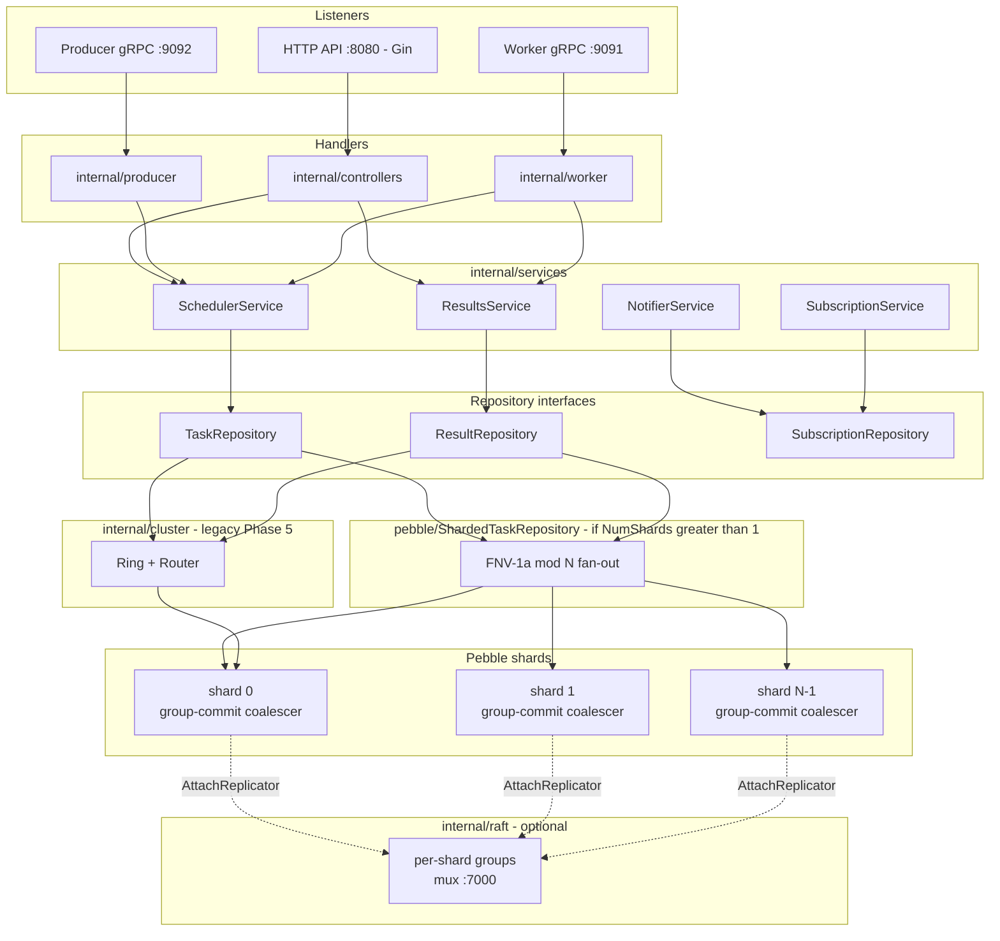
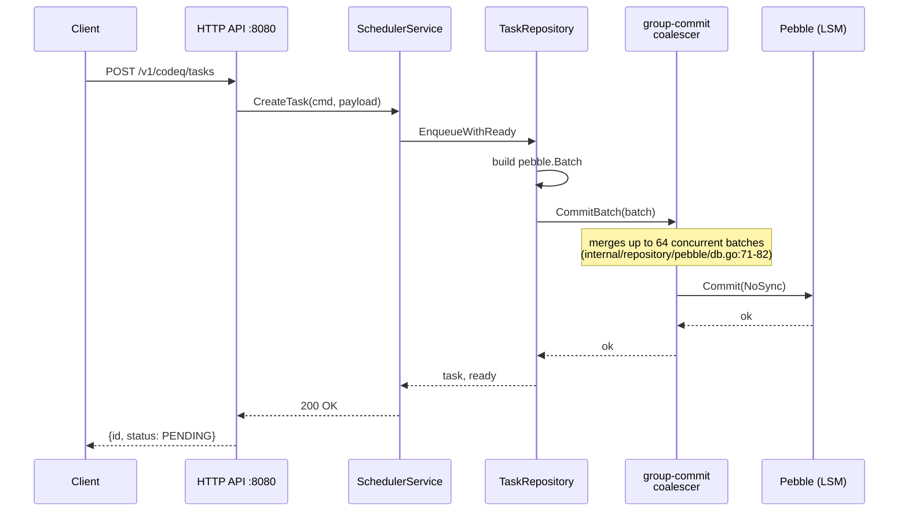
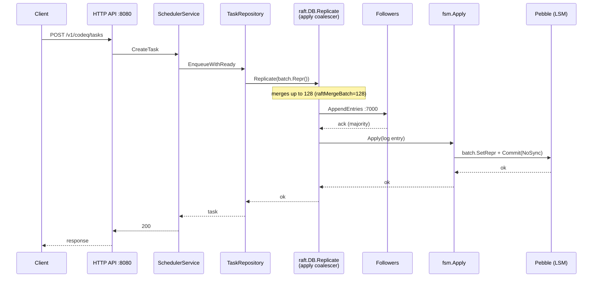
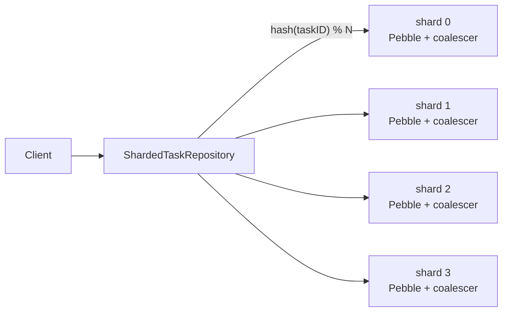
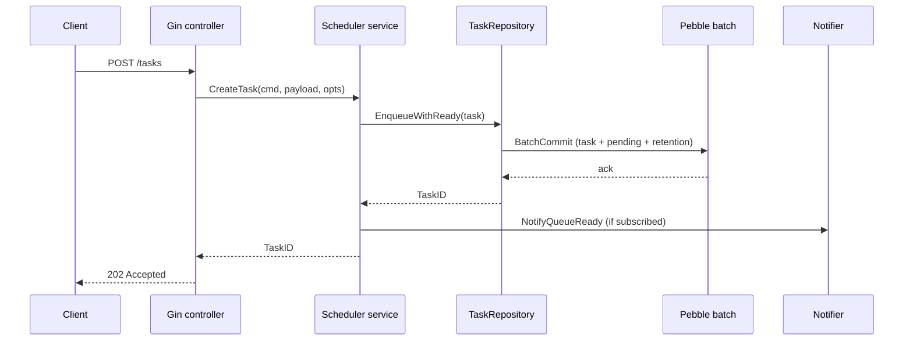
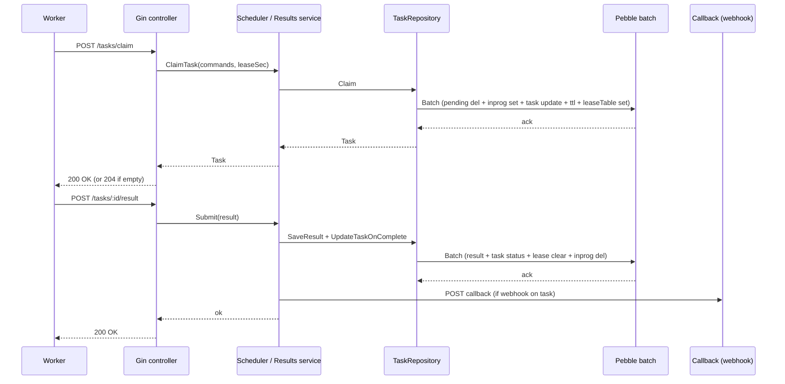

# Architecture and flow

## Package Structure

### Public Packages (`pkg/`)

- **`pkg/app`**: Application bootstrap and listener wireup
  - `application.go`: dispatch on `cfg.PersistenceProvider`
  - `application_pebble.go`: Pebble wireup root — opens shards, attaches replicators, builds repos, mounts controllers (see `pkg/app/application_pebble.go:100-440`)
  - `url_mappings.go`: HTTP route table
  - `worker_stream.go`: gRPC stream wireup on `:9091`
- **`pkg/auth`**: pluggable token validation (Validator/Claims interfaces, default JWKS plugin)
- **`pkg/config`**: YAML/env loading and validation (`config.go`)
- **`pkg/domain`**: core entities — `Task`, `Command`, `Result`, `Artifact`, `Subscription`, `QueueStats`
- **`pkg/persistence`**: persistence plugin registry plus in-memory test backend
- **`pkg/producerclient`**: Go gRPC client for the producer stream (`:9092`)
- **`pkg/workerclient`**: Go gRPC client for the worker stream (`:9091`)

### Internal Packages (`internal/`)

- **`internal/controllers`**: Gin HTTP handlers — create/get task, claim, submit, NACK, heartbeat, subscriptions, queue admin
- **`internal/middleware`**: auth (producer + worker JWKS plugins), tenant extraction, scope filter, request-id, tracing, rate limit, admin guard
- **`internal/services`**: business logic — `SchedulerService` (enqueue/claim/NACK/repair), `ResultsService`, `NotifierService`, `SubscriptionService`, `SubscriptionCleanupService`, `ResultCallbackService`
- **`internal/repository`**: data access
  - `repository/pebble/`: `TaskRepository`, `ResultRepository`, `SubscriptionRepository`, `ShardedTaskRepository`, `ShardedResultRepository`, in-memory lease table, `reaper.go`
  - `repository/pebble/db.go`: `*DB` wrapper holding the group-commit coalescer (`internal/repository/pebble/db.go:71-82`)
- **`internal/raft`**: opt-in raft replication via `hashicorp/raft`
  - `db.go`: `*DB` Replicator wrapping a `*pebble.DB`, `Replicate(repr)` apply path
  - `fsm.go`: `Apply(log)` — `SetRepr` + `Commit(NoSync)` on followers (`internal/raft/fsm.go:43-62`)
  - `mux_transport.go`: single-port `:7000` transport that demuxes per-shard groups
  - `log_store.go`, `stable_store.go`, `snapshot.go`: Pebble-backed raft storage
- **`internal/producer`**: producer-facing gRPC stream server (`server.go`) bound to `:9092`
- **`internal/worker`**: worker-facing gRPC stream server (`server.go`) bound to `:9091`
- **`internal/shard`**: shard supplier — `ClientMap`, `Key` hashing, static supplier, migrator, verifier
- **`internal/cluster`** (legacy — Phase 5): consistent-hash ring + gRPC routing
  - `ring.go`, `router.go`, `result_router.go`, `client.go`, `server.go`
  - `bloom.go`, `bloom_cache.go`: per-node ID Bloom plus gossiped peer snapshots
  - Superseded by raft replication for new deployments; kept for nodes that need horizontal scale without quorum.
- **`internal/identitymw`**: JWT identity helper used by the gRPC streams
- **`internal/providers`**: artifact uploader (local filesystem), Redis client for rate limiting
- **`internal/ratelimit`**: in-memory token bucket
- **`internal/backoff`**: backoff policies (fixed, linear, exponential, full-jitter)
- **`internal/metrics`**: Prometheus counters, histograms, queue-depth collector
- **`internal/tracing`**: OpenTelemetry setup (OTLP gRPC exporter, W3C propagation)
- **`internal/bench`**: throughput benchmarks for the Pebble write path

## Components

- HTTP API on `:8080`: Gin router with JSON binding.
- Worker gRPC stream on `:9091`: bidirectional stream for claim/heartbeat/result (`internal/worker/server.go`).
- Producer gRPC stream on `:9092`: bidirectional stream for enqueue/get (`internal/producer/server.go`).
- Auth: pluggable producer + worker token validators (default JWKS).
- Rate limiter: in-memory token bucket per bearer token (`internal/ratelimit`).
- Scheduler service: orchestrates queue and task state transitions.
- Results service: validates completion payloads, stores results, fires task-level webhooks.
- Storage: Pebble LSM. Single-DB by default; intra-process shards optional (`NumShards > 1` opens `Path/shard<i>/`). Subscriptions stay unsharded (shard 0).
- Group-commit coalescer: merges concurrent Pebble batches into one `Commit(NoSync)` per shard (`internal/repository/pebble/db.go:71-82`).
- Raft replication (`internal/raft/`): opt-in via `cfg.Raft.Enabled`. One raft group per Pebble shard, demuxed over a single port `:7000` when `MuxEnabled`. Bypasses the coalescer — raft does its own log-entry batching.
- Reaper: per-shard background sweeper for TTL, lease expiry, and DLQ promotion. Gated by `LeaderGate` when raft is enabled.
- Notifier: optional worker-availability webhook dispatcher.
- Metrics: Prometheus on `/metrics`, queue-depth gauges collected on scrape.
- Tracing: optional OpenTelemetry with W3C trace context propagation.
- Clustering (legacy, Phase 5): consistent-hash ring + inter-node gRPC routing (`internal/cluster/`). See [05-cluster-architecture.md](./05-cluster-architecture.md).

## Layered architecture

The server is organized in four layers plus the optional raft replicator and
the legacy cluster wrapper. The HTTP API on `:8080`, the worker gRPC stream on
`:9091`, and the producer gRPC stream on `:9092` share the same service layer;
services depend only on repository interfaces; the Pebble repos are wired in
by `pkg/app/application_pebble.go` and may be wrapped by a sharded fan-out
(`ShardedTaskRepository`) and/or routed via raft.

Edges into `internal/cluster` are mutually exclusive with the sharded fan-out:
cluster mode wraps a single local shard, sharded mode owns all local shards.
The raft attachment swaps each shard's coalescer for a raft replicator
(`pkg/app/application_pebble.go:289`). See
[05-cluster-architecture.md](./05-cluster-architecture.md),
[40-raft-replication.md](./40-raft-replication.md), and
[18-package-reference.md](./18-package-reference.md) for the package-level
breakdown.

## Component table

| Path | Role | Key types / functions |
|------|------|-----------------------|
| `pkg/app/application_pebble.go:100-440` | Wireup root | `newPebbleApplication` opens shards, attaches replicators, builds repos |
| `pkg/app/application.go` | Dispatch | `NewApplication` switches on `cfg.PersistenceProvider` |
| `pkg/config/config.go` | Configuration | `Config`, `RaftConfig`, `ClusterConfig`, `PersistenceConfig` |
| `pkg/domain` | Domain entities | `Task`, `Result`, `Subscription`, `ShardSupplier` |
| `pkg/producerclient` | Producer SDK | gRPC stream client (`:9092`) |
| `pkg/workerclient` | Worker SDK | gRPC stream client (`:9091`) |
| `pkg/auth` | Auth plugin contract | `Validator`, `Claims`, JWKS implementation |
| `internal/controllers` | HTTP handlers | `CreateTaskController`, `ClaimTaskController`, `SubmitResultController`, ... |
| `internal/services` | Business logic | `SchedulerService`, `ResultsService`, `NotifierService` |
| `internal/repository/pebble/db.go` | Pebble wrapper | `DB`, `CommitBatch` (coalescer), `AttachReplicator` |
| `internal/repository/pebble/task_repository.go` | Task CRUD | `EnqueueWithReady`, `Claim`, `Nack`, in-memory lease table |
| `internal/repository/pebble/result_repository.go` | Result CRUD | `SaveResult`, `UpdateTaskOnComplete` |
| `internal/repository/pebble/sharded_task_repository.go` | Intra-process fan-out | `ShardedTaskRepository`, FNV-1a 64-bit shard hash |
| `internal/repository/pebble/reaper.go` | Background sweeps | TTL, lease expiry, DLQ promotion (per-shard) |
| `internal/raft/db.go` | Replicator | `Replicate(repr)`, `IsLeader`, `CommitBatch` |
| `internal/raft/fsm.go:43-62` | FSM apply | `Apply` calls `SetRepr` + `Commit(NoSync)` |
| `internal/raft/mux_transport.go` | Single-port transport | `MuxAcceptor` demuxes shard groups on `:7000` |
| `internal/producer/server.go` | Producer stream | gRPC `:9092` |
| `internal/worker/server.go` | Worker stream | gRPC `:9091` |
| `internal/shard` | Shard plumbing | `ClientMap`, `Key`, `StaticSupplier`, `Migrator`, `Verifier` |
| `internal/cluster` | Legacy (Phase 5) | `Ring`, `TaskRouter`, `ResultRouter`, `Bloom`, gossiper |
| `internal/middleware` | Cross-cutting | auth, tenant, scope, rate-limit, request-id, tracing |
| `internal/metrics` | Prometheus | counters, histograms, queue-depth gauges |
| `internal/tracing` | OpenTelemetry | OTLP gRPC exporter, W3C propagation |

## Pluggable Persistence Layer

Persistence is selected at bootstrap via `cfg.PersistenceProvider`. Pebble is
the primary backend; an in-memory provider is registered for tests. The
provider exposes `TaskRepository`, `ResultRepository`, and
`SubscriptionRepository` to the service layer.

- **Pebble** (default): embedded LSM. Single-DB by default; intra-process shards parallelize commit pipelines and compaction (see [08b-pebble-sharding-internals.md](./08b-pebble-sharding-internals.md)).
- **In-memory** (`pkg/persistence/memory`): test-only, no durability.

For HA, pair Pebble with raft replication ([40-raft-replication.md](./40-raft-replication.md)) — each Pebble shard becomes its own raft group with its own quorum. The legacy cluster mode in `internal/cluster` is the alternative when quorum is undesirable.

See [27-persistence-plugin-system.md](./27-persistence-plugin-system.md) for plugin registration details.

## Data flow

### Single-node write path (no raft)

Direct path: HTTP/gRPC -> `SchedulerService` -> `ShardedTaskRepository` ->
`TaskRepository` -> `pebble.Batch` -> group-commit coalescer ->
`pebble.Commit(NoSync)`. The coalescer merges up to 64 concurrent batches into
one `Commit` to collapse the Pebble `commitPipeline` mutex acquisitions
(measured at 96% of the mutex profile pre-coalescer — see
`internal/repository/pebble/db.go:71-82`).

### RAFT-enabled write path

When `cfg.Raft.Enabled`, `AttachReplicator` swaps each shard's coalescer for
a raft delegate (`pkg/app/application_pebble.go:289`). Writes serialize the
`pebble.Batch` via `batch.Repr()` and call `raft.DB.Replicate`. Raft batches
log entries at the AppendEntries layer (merging up to 128 entries per RPC),
waits for majority ack, and applies on every replica's FSM via
`SetRepr` + `Commit(NoSync)` (`internal/raft/fsm.go:43-62`).

Replication details — leader lease, heartbeat cadence, snapshot install,
mux transport on `:7000`, and tuning knobs — live in
[40-raft-replication.md](./40-raft-replication.md). This document does not
duplicate them.

### Multi-shard routing (FNV-1a)

When `NumShards > 1`, `ShardedTaskRepository` hashes the task ID with FNV-1a
64-bit modulo `N` and dispatches to the owning shard's repository
(`internal/repository/pebble/sharded_task_repository.go:59-65`). Cross-shard
operations (claim with multiple commands, heartbeat fan-out) scatter-gather
across all shards. Subscriptions stay on shard 0 — they're never the
bottleneck.

## Enqueue flow

1. Producer submits `command`, `payload`, `priority`, and optional `webhook`.
2. Service validates fields and normalizes the payload to a JSON string.
3. If `idempotencyKey` is provided:
   - Bloom filter fast-path checks an in-process probabilistic filter. If the key is definitely absent, skip the backend GET.
   - Conditional batched write on the idempotency-key mapping ensures uniqueness; existing task returned on conflict.
4. Service writes the task record and inserts the task ID into the pending list within a single Pebble batch.
5. Service updates the retention index.
6. If any worker subscription matches the event type, the notifier dispatches an advisory signal.

## Claim and result flow (REST)

A worker pulls work with `POST /tasks/claim` and reports the outcome with
`POST /tasks/:id/result`. The claim is a single Pebble batch that deletes
the ID from pending, adds it to in-progress, updates task status, sets the
TTL, and writes the in-memory lease table entry. The result write is a
similarly atomic batch covering result storage and task completion.

The lease table is in-memory and rebuilt on startup from the in-progress
keyspace; see [06b-lease-management.md](./06b-lease-management.md) for the
recovery path and lease semantics.

### Claim flow (pull)

1. Worker submits claim request with `commands` and optional `leaseSeconds`.
2. Service validates the token and filters event types by token claims.
3. Service runs the requeue logic for each command (move-due-delayed fast-path).
4. Service atomically moves one ID from pending to in-progress in a single Pebble batch.
5. Ghost Bloom filter check: if the ID is in the ghost filter (admin-deleted), skip the task GET and clean up queue references.
6. Service loads the task record; if absent (ghost task), adds the ID to the ghost filter and retries.
7. Service sets a lease (in-memory lease table + TTL key) and updates task status to `IN_PROGRESS`.
8. Service returns the task record. If no task is available, returns `204`.

### Completion flow

1. Worker submits result with `COMPLETED` or `FAILED`.
2. Service verifies task ownership and status.
3. Service persists artifacts (optional), stores the result record, updates task status, and clears the lease — atomically batched.
4. Service removes the task from the in-progress set.
5. Service posts the task-level webhook if present.

## Distributed Tracing Flow

codeQ uses OpenTelemetry for end-to-end correlation across the task lifecycle.

### Trace Context Propagation

1. **HTTP request ingestion**: `TracingMiddleware` extracts W3C trace context from `traceparent` / `tracestate`, creates a root span for the handler chain, and injects context into the Gin request context.
2. **Task creation**: `task_repository.go` extracts trace context via `tracing.TraceContextStrings()` and stores `traceParent` / `traceState` in the task record.
3. **Task processing**: when a task is claimed, the trace context is available on the record; workers continue the trace via `tracing.ContextWithRemoteParent(ctx, task.TraceParent, task.TraceState)`.
4. **Webhook delivery**: result callbacks and worker notifications inject W3C headers via `tracing.InjectHeaders()` so downstream services participate in the trace.

### Span naming and attributes

- HTTP spans: `HTTP <METHOD> <ROUTE>` (e.g. `HTTP POST /v1/codeq/tasks`).
- Custom spans: `otel.Tracer("codeq/<component>")` for domain-specific work.
- Standard attributes: `http.method`, `http.path`, `http.route`, `http.status_code`, `http.host`.

### Sampling

- Parent-based sampling honors upstream sampling decisions.
- Configurable sample ratio via `tracingSampleRatio` (0.0 to 1.0).
- TraceID-based sampling for consistent trace completeness.

### Integration points

1. `pkg/app/application.go` calls `tracing.Setup()` to initialize the OTLP exporter and registers the global `TracerProvider` and `TextMapPropagator`.
2. `internal/middleware/tracing.go` is conditionally enabled via `cfg.TracingEnabled`, extracts context, creates spans, and marks 5xx responses as errors.
3. `internal/repository/pebble/task_repository.go` extracts trace context at task creation and stores it alongside task data.

For configuration details, see [14-configuration.md](./14-configuration.md) (Tracing section) and [10-operations.md](./10-operations.md) (Tracing setup).

## NACK flow

1. Worker submits `POST /tasks/:id/nack`.
2. Service verifies ownership and status.
3. Service computes backoff delay (`internal/backoff`) and moves the task to the delayed queue.
4. Service clears the lease and removes the task from in-progress.

## Multi-Tenant Architecture

codeQ isolates tenants at the queue level.

### Isolation guarantees

- **Queue isolation**: each tenant has dedicated queues for pending, in-progress, delayed, and dead-letter tasks.
- **Data isolation**: tasks, results, and leases are scoped to tenant IDs.
- **Worker isolation**: workers only claim tasks from their own tenant.
- **No cross-tenant visibility**: tenants cannot see or access tasks from other tenants.

### Tenant identification

The tenant ID is extracted from JWT claims during authentication:

1. Checks `tenantId`, `tenant_id`, `organizationId`, or `organization_id` claims.
2. Falls back to JWT `sub` (subject) for single-tenant deployments.
3. Injected into request context via middleware.
4. Used to namespace all queue operations.

### Queue key namespacing

Queue keys include the tenant ID segment:

- Multi-tenant: `codeq:q:{command}:{tenantID}:pending:{priority}`
- Single-tenant (backward compatible): `codeq:q:{command}:pending:{priority}`

### Performance considerations

- Queue operations remain O(1) or O(log n).
- Pebble disk usage scales linearly with tenant count.
- Each tenant's queues are independent — no cross-tenant contention.

For deployment guidance, see:
- Security configuration: [09-security.md](./09-security.md)
- Storage layout: [07b-storage-pebble.md](./07b-storage-pebble.md)
- Queue semantics: [05-queueing-model.md](./05-queueing-model.md)

## Repair flows

- Claim-time repair: requeue expired leases during claim operations and move due delayed tasks to pending (move-due-delayed fast-path).

## Push notifications

codeQ emits two independent webhook classes:

- **Worker availability notifications**: workers register a callback URL for event types. When new work becomes ready, codeQ sends an advisory signal containing the event type and a recommended claim URL. The worker must still claim. Delivery can be `fanout`, `group` (one per group), or `hash` (deterministic selection).
- **Result callbacks**: producers can set a task-level webhook URL. When a task completes or fails, codeQ posts a result payload and retries with backoff. This replaces polling `GET /tasks/:id/result`.

## Metrics Architecture

codeQ exposes Prometheus metrics on `/metrics` (unauthenticated by default).

### Standard metrics (`internal/metrics/metrics.go`)

- **Counters**: task lifecycle events (created, claimed, completed) at service/repository boundaries.
- **Histograms**: end-to-end task processing latency captured on completion.
- **Gauges**: queue depth gathered on scrape (see below).

Instrumentation points:
- `internal/repository/pebble/task_repository.go`: task creation counter, lease expiration counter.
- `internal/services/scheduler_service.go`: task claim counter.
- `internal/services/results_service.go`: completion counter and latency histogram.

### Queue-depth collector

Queue depth metrics are gathered on each Prometheus scrape rather than updated on every write, avoiding write-amplification on the metrics path.

- Registered once at application bootstrap (`pkg/app/application.go`).
- Iterates the Pebble pending / delayed / in-progress / DLQ indexes per command per priority on each scrape (short timeout).
- Exposed as gauges: `codeq_queue_depth`, `codeq_dlq_depth`, `codeq_subscriptions_active`.

In raft mode, all replicas report the same depths (the FSM is the single source of truth). Use `max by (...)` aggregation in PromQL to deduplicate.

See [10-operations.md](./10-operations.md) for the complete metric reference.

## See also

- [Raft replication](./40-raft-replication.md) — quorum, leader lease, mux transport on `:7000`, snapshot install.
- [Cluster architecture](./05-cluster-architecture.md) — legacy consistent-hash ring (Phase 5).
- [Package reference](./18-package-reference.md) — file-by-file map of the layers shown above.
- [Persistence plugin system](./27-persistence-plugin-system.md) — how providers plug into the repository interfaces.
- [Streaming API guide](./34-streaming-api-guide.md) — the gRPC bidirectional stream paths on `:9091` and `:9092`.
