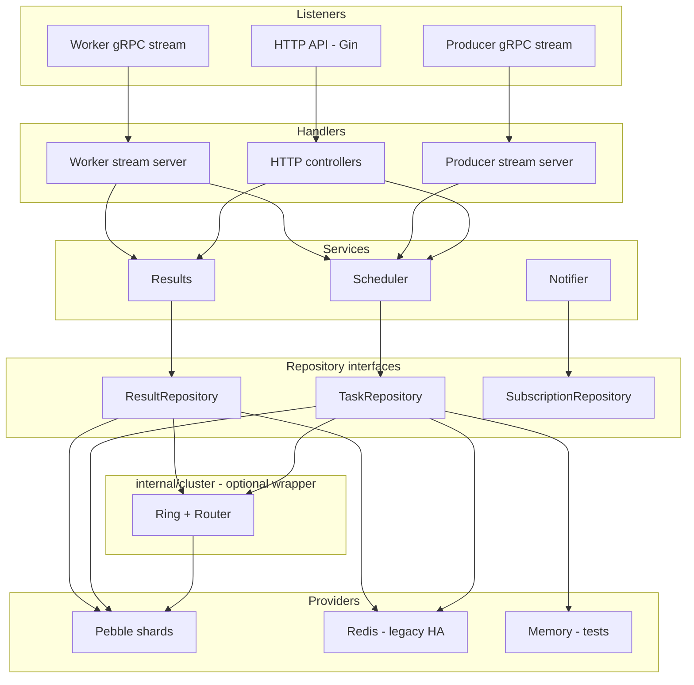
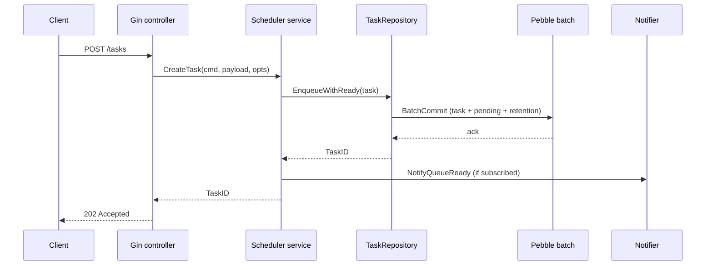
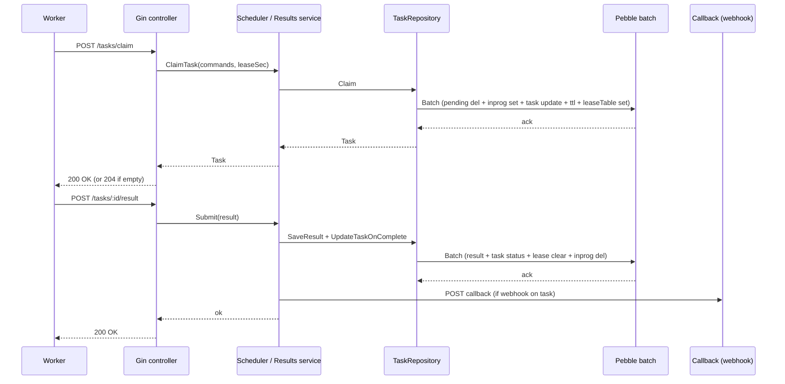

# Architecture and flow

## Package Structure

### Public Packages (`pkg/`)

- **`pkg/app`**: Application bootstrap and HTTP server setup
  - `application.go`: Main application struct, server initialization
  - `url_mappings.go`: HTTP route definitions
  - `integration_test.go`: End-to-end integration tests
- **`pkg/auth`**: Authentication plugin system
  - `interface.go`: Plugin interface definitions (Validator, Claims)
  - `jwks/`: Default JWKS-based authentication plugin
- **`pkg/config`**: Configuration loading and validation
  - `config.go`: Config struct, YAML/env parsing, defaults
- **`pkg/domain`**: Core domain entities
  - `task.go`: Task, Command types
  - `result.go`: Result, Artifact types
  - `subscription.go`: Subscription (webhook) types
  - `queue_stats.go`: QueueStats metrics

### Internal Packages (`internal/`)

- **`internal/controllers`**: HTTP handlers (Gin)
  - `create_task_controller.go`: Producer enqueue
  - `claim_task_controller.go`: Worker claim
  - `submit_result_controller.go`: Worker completion
  - `nack_task_controller.go`: Worker NACK
  - `heartbeat_controller.go`: Worker lease renewal
  - `get_task_controller.go`, `get_result_controller.go`: Read endpoints
  - `create_subscription_controller.go`, `heartbeat_subscription_controller.go`: Webhook subscription management
  - `queue_admin_controller.go`, `queue_stats_controller.go`, `cleanup_expired_controller.go`: Admin operations
- **`internal/middleware`**: Authentication and request processing
  - `auth.go`: Producer token validation (JWKS-based via plugin system)
  - `worker_auth.go`: Worker JWT validation (JWKS-based via plugin system)
  - `any_auth.go`: Accepts either producer OR worker tokens for read-only endpoints (GET `/tasks/:id`, GET `/tasks/:id/result`)
  - `rate_limit.go`: Token bucket rate limiting per bearer token (applies to producer enqueue, worker claim, admin cleanup)
  - `tenant.go`: Tenant ID extraction from JWT claims for multi-tenant isolation
  - `worker_scope.go`: Event type authorization filter (validates JWT scopes like `codeq:claim`, `codeq:result`)
  - `require_admin.go`: Admin endpoint protection (requires `admin:true` claim)
  - `logger.go`: Request logging middleware
  - `request_id.go`: Correlation ID injection via `X-Request-Id` header (generates 16-byte hex random ID if not provided by client)
  - `tracing.go`: OpenTelemetry distributed tracing middleware with W3C trace context propagation
- **`internal/services`**: Business logic layer
  - `scheduler_service.go`: Task claim, NACK, repair, requeue logic
  - `results_service.go`: Result storage and validation
  - `result_callback_service.go`: Task-level webhook delivery
  - `subscription_service.go`: Worker availability subscription management
  - `notifier_service.go`: Worker availability webhook dispatch
  - `subscription_cleanup_service.go`: Expired subscription removal
- **`internal/repository`**: Data access layer (pluggable persistence backends)
  - **Redis implementation** (`internal/repository/`):
    - `task_repository.go`: Task CRUD, queue operations (Lua claim move, delayed queue)
    - `result_repository.go`: Result storage and retrieval
    - `subscription_repository.go`: Subscription storage
  - **Pebble implementation** (`internal/repository/pebble/`):
    - `task_repository.go`: Task CRUD, queue operations (LSM-tree optimized)
    - `result_repository.go`: Result storage and retrieval
    - `subscription_repository.go`: Subscription storage
    - `reaper.go`: Background TTL and cleanup management
  - **Shared utilities**:
    - `idempotency_bloom.go`: In-process Bloom filters for optimization
      - **Idempotency Bloom**: Skips negative Redis GET on fresh idempotency keys (Enqueue fast-path)
      - **Cleanup Bloom**: Skips redundant removal work for already-deleted tasks (CleanupExpired fast-path)
      - **Ghost Bloom**: Skips Redis HGET for administratively deleted tasks (Claim fast-path)
- **`internal/providers`**: External integrations
  - `redis_provider.go`: Redis client initialization
  - `uploader.go`: Artifact storage (local filesystem)
- **`internal/backoff`**: Retry logic
  - `backoff.go`: Backoff policies (fixed, linear, exponential, jitter)
- **`internal/ratelimit`**: Rate limiting
  - `token_bucket.go`: Redis-backed token bucket rate limiter
- **`internal/metrics`**: Observability and monitoring
  - `metrics.go`: Prometheus metric definitions (counters, histograms, gauges)
  - `redis_collector.go`: Custom Prometheus collector for Redis-backed queue metrics
- **`internal/tracing`**: Distributed tracing
  - `tracing.go`: OpenTelemetry setup with OTLP gRPC exporter, W3C trace context propagation utilities
- **`internal/cluster`**: Horizontal scaling via consistent-hash ring and gRPC routing
  - `ring.go`: Consistent hash ring (virtual nodes, ID → owner resolution)
  - `router.go`: TaskRouter implementing repository.TaskRepository on top of local Pebble + gRPC client pool
  - `server.go`: gRPC server serving local Pebble shard to peer nodes
  - `bloom.go`: Per-node Bloom filter tracking stored task IDs
  - `bloom_cache.go`: Peer Bloom snapshots for negative lookup optimization
  - `result_router.go`: Route result operations to task owner node
  - `client.go`: gRPC client pool for inter-node communication
  - `proto/clusterpb.proto`: Internal inter-node protocol definition

## Components

- HTTP API: Gin-based router with JSON binding.
- Auth: Producer and worker token validation via pluggable authentication system (default: JWKS).
- Rate limiter: Optional Redis-backed token bucket rate limiting per bearer token.
- Scheduler core: orchestrates queue and task state transitions.
- Result processor: validates completion payloads and stores results.
- Storage: Pluggable persistence backends — Pebble (primary) or Redis (legacy HA).
- Artifact storage: local filesystem uploader.
- Notifier: optional webhook signal dispatcher.
- Requeue loop: claim-time repair during `Claim`.
- Metrics: Prometheus instrumentation with custom Redis collector.
- Tracing: Optional OpenTelemetry distributed tracing with W3C trace context propagation.
- Clustering: Optional horizontal scaling via consistent-hash ring and gRPC routing across multiple nodes (see [05-cluster-architecture.md](./05-cluster-architecture.md)).

## Layered architecture

The server is organized in four layers plus an optional cluster wrapper. The
HTTP API (Gin) and the two gRPC bidirectional stream listeners (producer and
worker) share the same service layer; services depend only on repository
interfaces; the active provider — Pebble shards, Redis, or in-memory — is
selected at bootstrap. When cluster mode is enabled, `internal/cluster` wraps
the repository interface and routes by ID owner over gRPC.

The wrapper edges from `TaskRepository` and `ResultRepository` into
`internal/cluster` are mutually exclusive with the direct provider edges:
cluster mode wraps the repository, single-node mode binds it directly. See
[05-cluster-architecture.md](./05-cluster-architecture.md) and
[18-package-reference.md](./18-package-reference.md) for the package-level
breakdown.

## Pluggable Persistence Layer

The storage layer is pluggable via the persistence plugin system. codeQ includes production-ready implementations:

### Storage Options

- **Pebble** (primary): Embedded key-value store with intra-process sharding. Default choice for single-node, throughput-critical deployments.
  - Throughput: 45k–83k tasks/sec (single-shard to 4-shard configuration)
  - HA: None (single process). Pair with `internal/cluster` (consistent-hash + gRPC routing) for multi-node.
  - Sharding: Intra-process only; parallelizes write commits and compaction across N shards (see [08b-pebble-sharding-internals.md](./08b-pebble-sharding-internals.md)).

- **Redis** (legacy HA): Network-based persistence using Redis protocol. Retained for deployments that already depend on Redis Sentinel or Cluster for HA.
  - Throughput: 1.5–2k tasks/sec (single instance, network latency)
  - HA: Native support with replication and Sentinel failover
  - Cluster: Full support via ShardSupplier (see [06-sharding.md](./06-sharding.md))

See [27-persistence-plugin-system.md](./27-persistence-plugin-system.md) for configuration details, performance characteristics, and use case guidance.

## Enqueue flow

The REST enqueue path (`POST /tasks`) goes through the Gin controller, the
scheduler service, the repository (under the active provider, typically
Pebble), and optionally the notifier when there are subscribed workers
waiting on the event type.

1. Producer submits `command`, `payload`, `priority`, and optional `webhook`.
2. Service validates fields and normalizes the payload to a JSON string.
3. If `idempotencyKey` is provided:
   - **Bloom filter fast-path**: Check in-process probabilistic filter; if key is definitely absent, skip the backend GET
   - **Backend deduplication**: SETNX (Redis) or batched conditional write (Pebble) on idempotency key mapping to ensure uniqueness
   - Return existing task if conflict detected
4. Service writes the task record and inserts the task ID into the pending list within a single batch commit (Pebble) or pipeline (Redis).
5. Service updates the retention index.
6. If any worker subscription matches the event type, the notifier dispatches an advisory signal so the worker pulls.

## Claim and result flow (REST)

A worker pulls work with `POST /tasks/claim` and reports the outcome with
`POST /tasks/:id/result`. On Pebble, the claim is a single batch that deletes
the ID from pending, adds it to in-progress, updates task status, sets the
TTL, and writes the in-memory lease table entry. The result write is a
similarly atomic batch covering result storage and task completion.

The lease table is in-memory and rebuilt on startup from the in-progress
keyspace; see [06b-lease-management.md](./06b-lease-management.md) for the
recovery path and lease semantics.

### Claim flow (pull)

1. Worker submits claim request with `commands` and optional `leaseSeconds`.
2. Service validates token and filters event types by token claims.
3. Service runs the requeue logic for each command (move-due-delayed fast-path on Pebble).
4. Service atomically moves one ID from pending to in-progress. On Pebble this is a single batch commit; on Redis it is a Lua script (`RPOP` + `SADD`).
5. **Ghost Bloom filter check**: If ID is in ghost filter (deleted by admin), skip the task GET and clean up queue references.
6. Service loads the task record; if absent (ghost task), adds ID to ghost filter and retries.
7. Service sets a lease (Pebble lease table + TTL key, or `SETEX` on Redis) and updates task status to `IN_PROGRESS`.
8. Service returns the task record. If no task is available, returns `204`.

### Completion flow

1. Worker submits result with `COMPLETED` or `FAILED`.
2. Service verifies task ownership and status.
3. Service persists artifacts (optional), stores the result record, updates task status, and clears the lease — atomically batched on Pebble.
4. Service removes the task from the in-progress set.
5. Service posts webhook if the task contains a webhook URL.

## Distributed Tracing Flow

codeQ implements OpenTelemetry distributed tracing to enable end-to-end observability across task lifecycles:

### Trace Context Propagation

1. **HTTP Request Ingestion**:
   - `TracingMiddleware` extracts W3C trace context from incoming HTTP headers (`traceparent`, `tracestate`)
   - Creates a root span for the HTTP handler chain
   - Injects context into Gin request context

2. **Task Creation**:
   - `task_repository.go` extracts trace context from request context using `tracing.TraceContextStrings()`
   - Stores `traceParent` and `traceState` fields in task JSON
   - Enables correlation between task creation and subsequent processing

3. **Task Processing**:
   - When task is claimed, trace context is available in task record
   - Worker services can extract and continue the trace
   - Example: `ctx := tracing.ContextWithRemoteParent(ctx, task.TraceParent, task.TraceState)`

4. **Webhook Delivery**:
   - Result callbacks and worker notifications include trace context headers
   - `tracing.InjectHeaders()` adds W3C headers to outgoing HTTP requests
   - Downstream services can participate in the distributed trace

### Span Naming Conventions

- **HTTP Spans**: `HTTP <METHOD> <ROUTE>` (e.g., `HTTP POST /v1/codeq/tasks`)
- **Custom Spans**: Use tracer from `otel.Tracer("codeq/<component>")` for domain-specific spans

### Trace Attributes

Standard HTTP attributes are automatically added:
- `http.method`: HTTP request method
- `http.path`: Request path
- `http.route`: Matched route pattern
- `http.status_code`: Response status code
- `http.host`: Request host header

### Sampling

- Parent-based sampling strategy (honors upstream sampling decisions)
- Configurable sample ratio via `tracingSampleRatio` (0.0 to 1.0)
- TraceID-based sampling for consistent trace completeness

### Integration Points

1. **Application Bootstrap** (`pkg/app/application.go`):
   - Calls `tracing.Setup()` to initialize OTLP exporter
   - Registers TracerProvider and TextMapPropagator globally
   - Returns shutdown function for graceful cleanup

2. **HTTP Middleware** (`internal/middleware/tracing.go`):
   - Conditionally enabled via `cfg.TracingEnabled`
   - Extracts trace context from request headers
   - Creates spans for all HTTP handlers
   - Sets error status for 5xx responses

3. **Repository Layer** (`internal/repository/task_repository.go`):
   - Extracts trace context at task creation
   - Stores in Redis alongside task data
   - Enables cross-service correlation

For configuration details, see [14-configuration.md](./14-configuration.md) (Tracing section) and [10-operations.md](./10-operations.md) (Tracing setup).

## NACK flow

1. Worker submits `POST /tasks/:id/nack`.
2. Service verifies ownership and status.
3. Service computes backoff delay and moves the task to the delayed queue.
4. Service clears lease and removes the task from in-progress.

## Multi-Tenant Architecture

CodeQ implements complete tenant isolation at the queue level to support multi-tenant deployments.

### Isolation Guarantees

- **Queue isolation**: Each tenant has dedicated queues for pending, in-progress, delayed, and dead-letter tasks
- **Data isolation**: Tasks, results, and leases are scoped to tenant IDs
- **Worker isolation**: Workers can only claim and process tasks from their own tenant
- **No cross-tenant visibility**: Tenants cannot see or access tasks from other tenants

### Tenant Identification

The tenant ID is automatically extracted from JWT claims during authentication:

1. Checks `tenantId`, `tenant_id`, `organizationId`, or `organization_id` claims
2. Falls back to JWT `sub` (subject) for single-tenant deployments
3. Injected into request context via middleware
4. Used to namespace all queue operations

### Queue Key Namespacing

Queue keys include the tenant ID segment:

- Multi-tenant: `codeq:q:{command}:{tenantID}:pending:{priority}`
- Single-tenant (backward compatible): `codeq:q:{command}:pending:{priority}`

### Performance Considerations

Tenant isolation does not significantly impact performance:

- Queue operations remain O(1) or O(log n)
- Redis memory scales linearly with tenant count
- Each tenant's queues are independent (no cross-tenant contention)

For deployment guidance and multi-tenant configuration, see:
- Security configuration: [09-security.md](./09-security.md)
- Storage layout: [07b-storage-pebble.md](./07b-storage-pebble.md) (primary) or [07-storage-kvrocks.md](./07-storage-kvrocks.md) (legacy Redis)
- Queue semantics: [05-queueing-model.md](./05-queueing-model.md)

## Repair flows

- Claim-time repair: requeue expired leases during claim operations and move due delayed tasks to pending.

## Push notifications

codeQ emits two independent webhook classes:

- **Worker availability notifications**: Workers register a callback URL for event types. When new work becomes ready, codeQ sends a signal containing the event type and a recommended claim URL. The signal is advisory; the worker must still claim. Delivery can be `fanout`, `group` (one per group), or `hash` (deterministic selection) to balance notification load across worker fleets.

- **Result callbacks**: Producers can set a task-level webhook URL. When a task completes or fails, codeQ posts a result payload and retries with backoff. This replaces polling `GET /tasks/:id/result`.

## Metrics Architecture

codeQ exposes Prometheus metrics via the `/metrics` endpoint (unauthenticated by default). The metrics subsystem consists of two components:

### Standard Metrics (`internal/metrics/metrics.go`)

Application-level metrics are instrumented throughout the codebase:

- **Counters**: Task lifecycle events (created, claimed, completed) incremented at service/repository boundaries
- **Histograms**: End-to-end task processing latency captured on completion
- **Custom collector**: Redis-backed queue depth gauges (see below)

Instrumentation points:
- `internal/repository/task_repository.go`: Task creation counter
- `internal/services/scheduler_service.go`: Task claim counter
- `internal/services/results_service.go`: Completion counter and latency histogram
- `internal/repository/task_repository.go`: Lease expiration counter

### Custom Redis Collector (`internal/metrics/redis_collector.go`)

Queue depth metrics are gathered dynamically during Prometheus scrapes rather than updated continuously. This design avoids high write volume to metrics storage.

**Collector behavior:**
- Registered once at application bootstrap (`pkg/app/application.go`)
- Executes Redis pipeline queries on each scrape (2-second timeout)
- Queries queue depths for all commands across all priority levels (0-9)
- Aggregates pending, delayed, in-progress, and DLQ counts
- Exposes as gauges: `codeq_queue_depth`, `codeq_dlq_depth`, `codeq_subscriptions_active`

**Multi-replica considerations:**
- All API replicas report the same queue depth values (Redis is the single source of truth)
- Use `max by (...)` aggregation in PromQL to deduplicate when multiple replicas are scraped

See [10-operations.md](./10-operations.md) for complete metric reference.

## See also

- [Cluster architecture](./05-cluster-architecture.md) — consistent-hash ring, gRPC routing, and how `internal/cluster` wraps the repository.
- [Package reference](./18-package-reference.md) — file-by-file map of the layers shown in the layered architecture diagram.
- [Persistence plugin system](./27-persistence-plugin-system.md) — how providers (Pebble, Redis, Memory) plug into the repository interfaces.
- [Streaming API guide](./34-streaming-api-guide.md) — the gRPC bidirectional stream paths that share the same service layer as the REST flows.
