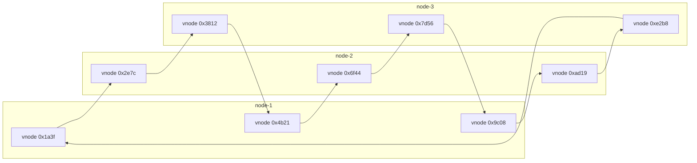
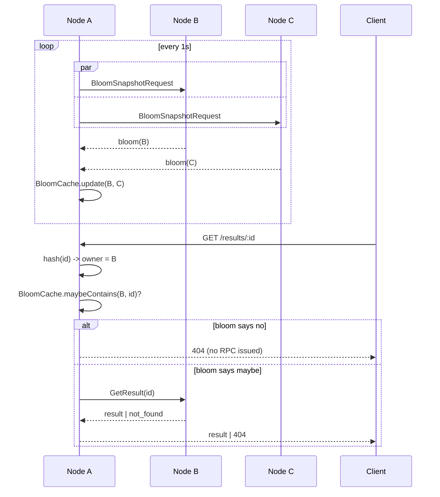
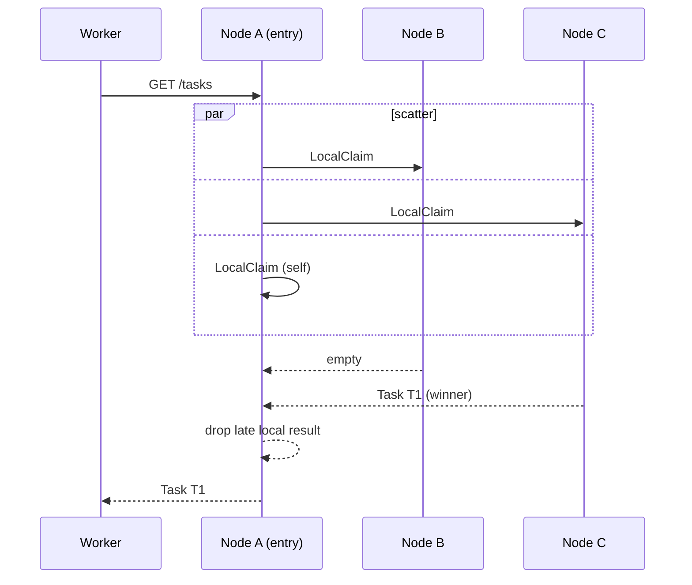

# Cluster Architecture

> **Status: Legacy (Phase 5).** This document describes the consistent-hash
> cluster mode that predates RAFT replication. For high availability and
> automatic failover in new deployments, use **RAFT** (see
> [40-raft-replication.md](40-raft-replication.md) and
> [41-deployment-modes.md](41-deployment-modes.md) for the decision guide).
> Cluster mode is preserved for existing deployments and reference; the
> mode is mutually exclusive with `raft.enabled`
> (`pkg/config/config.go:662-683`).

## Overview

codeQ supports horizontal scaling through a **consistent hash ring** cluster topology. Multiple nodes form a cluster where task ownership is determined by hashing the task ID to a node. This enables:

- **Horizontal scaling**: Add nodes to the cluster for higher throughput
- **Data locality**: Tasks stay on their owner node, reducing inter-node communication
- **Fault tolerance**: Tasks survive single node failures (no automatic recovery; external orchestration handles node bring-up)

## Key Concepts

### Consistent Hash Ring

The cluster uses a **consistent-hash ring** to determine which node owns each task:

1. **Node membership** is static and configured at startup (no dynamic join/leave)
2. **Virtual nodes** (256 per real node) ensure smooth load distribution
3. **Hash function**: SHA256 on task ID produces 64-bit hash, binary search finds owner in ring
4. **Load distribution**: Standard deviation typically <5% for 3-16 nodes



Each physical node contributes 256 virtual nodes (only 3 per node shown
above). Virtual nodes are interleaved around the ring by their hashed
position; when a task ID hashes to a position, the owner is the next
virtual node in clockwise order, which resolves to its parent physical
node.

### gRPC Routing Layer

Instead of centralizing all operations on one node, the cluster routes requests to the appropriate owner:

1. **ID-routed operations** (task ID known):
   - Enqueue, Get, Heartbeat, Abandon, Nack, SaveResult, GetResult, UpdateOnComplete
   - Hash ID → determine owner → local operation (if self) or gRPC call (if peer)

2. **Scatter-gather operations** (need to aggregate across all nodes):
   - LocalClaim: broadcast to all nodes, first non-empty response wins
   - PendingLength: broadcast to all nodes, sum results
   - QueueStats: broadcast to all nodes, aggregate counts
   - AdminQueues: broadcast to all nodes, merge queue snapshots

3. **Bloom gossip** (negative lookup optimization):
   - Each node maintains a Bloom filter of task IDs it holds
   - Peers query blooms before expensive ID-routed RPCs
   - If a peer's bloom says "definitely not here", skip the remote call

### Data Model on the Wire

The internal gRPC protocol (`clusterpb.proto`) carries a minimal wire format:

- **Task**: Subset of domain.Task; payload as raw bytes
- **ResultRecord**: Result with JSON, error, artifacts as JSON strings
- **Structured responses**: Non-fatal errors encoded as response flags (e.g., `not_found`, `not_owner`) instead of exceptions

This keeps the protocol independent of JSON shape changes and makes error handling deterministic.

### Local Storage: Pebble

Each node in a cluster runs **one local Pebble shard** (embedded RocksDB):

- Stores tasks that hash to this node
- No replication between shards (data loss on node crash)
- Delayed and DLQ buckets are local to each node (not replicated)
- Operations like MoveDueDelayed and CleanupExpired act only on local data

> **Note**: cluster mode and Phase 8 intra-process Pebble sharding (`numShards > 1`) are not currently compatible. Choose one — multi-node OR multi-shard per process. This is a wiring limitation: `cluster.Server` expects a single concrete TaskRepository.

### Bloom Gossip

Each node periodically pulls a snapshot of its peers' Bloom filters (1 Hz
by default) and caches them locally. Before issuing an ID-routed RPC for
a `Get` / `GetResult`, the entry node checks the cached bloom for the
target peer — if the bloom says "definitely not present", the RPC is
skipped and a 404 is returned without any network call.



The cache is best-effort: a stale bloom that misses a freshly enqueued
task degrades to a normal RPC (correctness preserved). The win is on the
~95% of negative lookups in typical workloads where the bloom short-
circuits the round-trip.

## Deployment Modes

### Single-Node Cluster (Default)

When no cluster configuration is provided, codeQ behaves as a single-node cluster:

- Ring contains one node (self)
- All operations route to local Pebble
- No inter-node gRPC traffic
- Suitable for development and small deployments

### Multi-Node Cluster

Configure the cluster in `config.yaml`:

```yaml
cluster:
  enabled: true
  nodes:
    - id: "node-1"
      grpc_addr: "codeq-1.internal:50051"
    - id: "node-2"
      grpc_addr: "codeq-2.internal:50051"
    - id: "node-3"
      grpc_addr: "codeq-3.internal:50051"
  
  # Optional: enable Bloom filter caching for negative lookups
  bloom:
    enabled: true
    capacity: 100000
    false_positive_rate: 0.01
```

Each node:
1. Initializes a local Pebble shard (stores only "owned" tasks)
2. Constructs the consistent hash ring with all configured nodes
3. Creates gRPC clients to all peers
4. Starts a gRPC server listening on the configured `grpc_addr`

Clients (producers, workers) continue using the REST API on HTTP; the gRPC layer is internal to the cluster.

## Request Flow

### Enqueue (Producer)

```
1. Producer → HTTP POST /tasks (to any node)
2. Node picks task ID locally (UUID v4)
3. Hash ID → determine owner
4. If owner == self:
     a. Local Pebble Enqueue
     b. Update local bloom filter
     c. Return task
   Else (owner is peer):
     a. gRPC Enqueue call to owner
     b. Owner stores in its Pebble, updates its bloom
     c. Return task
```

### Claim (Worker)

Without a shard-affinity header, claim is a scatter-gather: the receiving
node asks every peer for a `LocalClaim` in parallel and returns the first
non-empty response.



If the worker sends a shard-affinity header, the entry node skips the
scatter and serves the claim from its local Pebble only. If every node
reports empty, the entry node returns HTTP 404.

### Get Result

```
1. Client → HTTP GET /results/:id
2. Hash ID → determine owner
3. If owner == self:
     Local Pebble lookup
   Else:
     gRPC GetResult to owner
4. Return result (or 404)
```

## Failure Modes

### Node Crash

- **In-flight tasks on that node**: Lost (no replication)
- **Delayed tasks on that node**: Lost
- **Clients retry**: Producers retry enqueue; workers claim from remaining nodes
- **Recovery**: Operator must provision a new node with same ID; tasks start fresh

### Network Partition

- Nodes can still serve local operations (Get, local Claim)
- Cross-node operations (Enqueue to peer) fail with timeout
- Clients see errors and retry
- When partition heals, clusters resync via bloom gossip

### Bloom Filter Stale

- Bloom filters are updated asynchronously via gossip
- Negative lookups may be temporarily stale (cache misses when task was just created on peer)
- Not correctness-critical: if bloom says "not here", we do a gRPC call and discover it was wrong
- Reduces inter-node traffic for true negatives (~95% of lookups in typical workloads)

## Performance Implications

### Advantages

- **Local operations are fast**: ~99% of operations avoid inter-node hops
- **Throughput scales linearly** with cluster size (assuming even distribution)
- **Latency stays low**: Enqueue, Claim, Get all complete in single round-trip to owner

### Trade-offs

- **No global ordering**: Task visibility across shards requires scatter-gather (admin APIs)
- **No automatic recovery**: Node failures require external intervention
- **No data durability**: Tasks lost on node crash (use persistent storage like RocksDB with WAL if needed)

## Configuration Reference

See [14-configuration.md](14-configuration.md#cluster) for detailed cluster configuration options including:

- Node definitions
- Bloom filter tuning
- gRPC timeout settings
- Certificate configuration for mTLS

## Operational Runbooks

See [29-operational-runbooks.md](29-operational-runbooks.md#cluster-operations) for:

- Scaling up: adding new nodes
- Rolling upgrades: updating existing nodes
- Troubleshooting inter-node connectivity
- Monitoring cluster health

## See also

- [Sharding](./06-sharding.md) — tenant and command routing, orthogonal to clustering.
- [Pebble sharding internals](./08b-pebble-sharding-internals.md) — intra-process shard layout (incompatible with cluster mode; see Phase 8 note above).
- [Cluster gRPC protocol](./19b-cluster-grpc-protocol.md) — wire format for `clusterpb` (Enqueue, LocalClaim, GetResult, BloomSnapshot).
- [Queue sharding HLD](./24-queue-sharding-hld.md) — high-level design for sharding queues across nodes.
