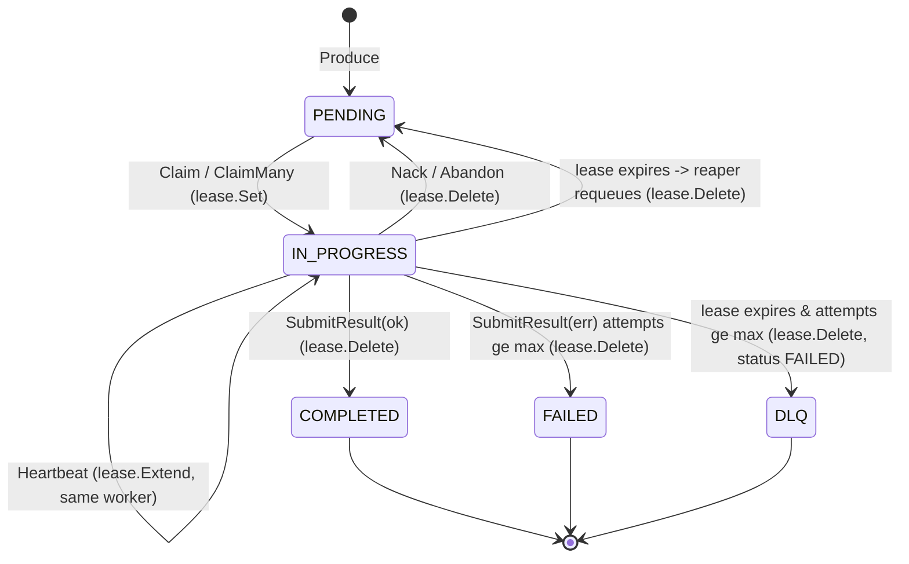
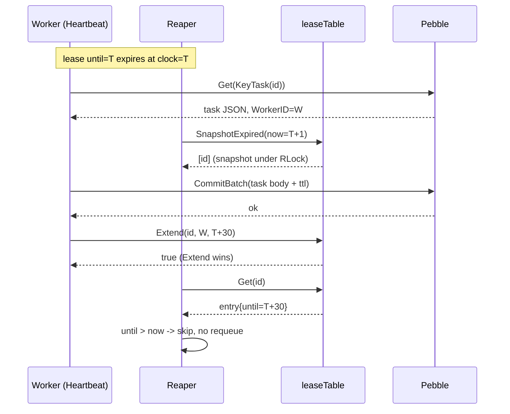

# Lease management (in-memory)

Workers hold a **lease** on each task they claim. The lease is a (workerID,
taskID, expiry) tuple that promises "this worker has until time T to
finish; after T any reaper sweep may requeue the task". Phase 6 / M2
moved the lease index out of Pebble into a process-local
`sync.RWMutex`-guarded map. The task body on disk still carries
`LeaseUntil` as the durable source of truth, so a crash is recoverable;
the in-memory table only exists to drop one Pebble write per Claim and
two per Heartbeat.

This doc covers: why lease lived on disk before, what the in-memory
table looks like, how recovery works at `Open()`, the Heartbeat
fast-path, the race between Heartbeat and the reaper, and the
measurable throughput impact (36k → 40k tasks/s on the full cycle, +10%
per commit `227d646`).

See [_STYLE.md § Value proposition](./_STYLE.md#1-value-proposition) for
the canonical performance numbers this doc cites.

## 1. Why move lease off disk

Pre-M2 every `Claim` and `Heartbeat` wrote a `KeyLease` entry to Pebble
in addition to the task body and the `KeyInprog` index. The lease key
encoded `(workerID, untilUnix)` and the reaper scanned the `KeyLease`
prefix every sweep tick to find expired entries. Two problems:

1. **Write amplification on every Heartbeat.** A 30s lease with a 10s
   heartbeat interval issued 1 lease write per task per 10s. At 24k
   in-flight tasks that is 2,400 Pebble writes/s of pure bookkeeping.
2. **Reaper scan cost grows with concurrency.** Every sweep ran a
   prefix iterator over `KeyLease`, decoded each entry, and compared
   `untilUnix` against the wall clock. The iterator/decode overhead was
   meaningful CPU even when nothing had expired — that prefix scales
   with the live worker count.

Both costs are pure metadata, not durability. The task body already
carries `LeaseUntil` as an RFC3339 string (`pkg/domain/task.go`), so a
restart can rebuild the index by reading what is already on disk.
Moving the index in-memory is a strict perf win at the cost of a tiny
recovery scan.

Hot-path write counts before vs after M2 (per commit `227d646`):

| Operation | Pre-M2 Pebble writes | Post-M2 Pebble writes |
|---|---|---|
| Claim | 5 (pending del + inprog set + task body + lease + ttl idx) | 4 (lease in memory) |
| Heartbeat | 3 (task body + lease + ttl idx) | 1 batch commit (task body + ttl idx; lease in memory) |
| Submit | 4 | 3 |
| Nack | 5 | 4 |
| Abandon | 5 | 4 |
| Reaper sweep | N × prefix Iter + Get | O(N) map walk, zero Pebble I/O |

> **Performance**: Heartbeat is the highest-frequency lease mutation
> because every active worker emits one per heartbeat interval. Going
> from 3 writes to 1 commit is what unlocks the +10% on `ciclo full`
> (36k → 40k tasks/s, `internal/bench/profile_full_cycle_test.go::TestProfile_FullCycle`).

## 2. Design: `leaseTable`

The table lives in `internal/repository/pebble/lease_table.go` and
hangs off `*pebble.DB` so both `TaskRepository` and `ResultRepository`
see the same instance without wiring an extra dependency through.

```go
type leaseEntry struct {
    workerID string
    cmd      domain.Command // for reaper's per-(cmd,tenant) backoff
    tenantID string
    untilU   int64          // unix seconds; reaper compares against time.Now().Unix()
}

type leaseTable struct {
    mu sync.RWMutex
    m  map[string]leaseEntry
}
```

The entry is intentionally tiny: 32 bytes plus the two string headers.
At 1M concurrent leases the table is ~32 MiB — well inside any
production memory budget.

Operations:

- `Set(taskID, workerID, cmd, tenantID, untilU)` — installs unconditionally. Called by Claim, ClaimMany, completeClaim.
- `Delete(taskID)` — idempotent drop. Called by Submit, Nack, Abandon, reaper, cleanup.
- `Get(taskID)` — returns entry + exists bool. Reaper uses this to double-check between snapshot and requeue.
- `Extend(taskID, workerID, untilU)` — bumps `untilU` only if `workerID` still owns. Returns `false` otherwise. This is the Heartbeat hook.
- `SnapshotExpired(now, limit)` — returns up to `limit` IDs whose `untilU <= now`. Bounded so a huge table doesn't lock the reaper for too long per tick.

Why `sync.RWMutex` over a plain map instead of `sync.Map`? `sync.Map`
optimizes for read-mostly access where the key set is stable, but
`SnapshotExpired` does a full iteration on every reaper sweep, and the
load-then-CAS-replace pattern that `sync.Map` uses makes that iteration
significantly more expensive than `RLock` + range loop. The reaper
sweep is the hot path we are trying to win back from Pebble; an
RWMutex with short critical sections is the right primitive here.

## 3. State machine

Task status drives lease lifecycle. The lease entry exists exactly
while the task is `IN_PROGRESS`, and a lease expiry is a transition
back to `PENDING` (or to `DLQ` once attempts are exhausted).



Two invariants hold:

1. **Lease entry implies `IN_PROGRESS`.** The reaper checks
   `t.Status == StatusInProgress` after loading the task body and drops
   the lease entry if not — see
   `internal/repository/pebble/reaper.go:167-170`.
2. **`IN_PROGRESS` may briefly lack a lease entry during recovery only.**
   Between `Open()` parsing the `KeyInprog` prefix and `recoverLeases`
   finishing, the table is being filled. After `Open()` returns the
   invariant holds for the rest of the process lifetime.

## 4. Recovery at `Open()`

The in-memory table is volatile by design; a process restart drops it.
Recovery rebuilds the table from the `KeyInprog` prefix and each task
body's `LeaseUntil` field. The full implementation lives in
`recoverLeases` in `internal/repository/pebble/lease_table.go:131`:

```mermaid
sequenceDiagram
  participant Open as Open()
  participant Iter as Pebble Iter
  participant Body as KeyTask(id)
  participant Tbl as leaseTable

  Open->>Iter: range scan codeq/q/ (KeyInprog prefix)
  loop for each inprog key
    Iter-->>Open: codeq/q/<cmd>/<tenant>/inprog/<id>
    Open->>Body: Get(KeyTask(id))
    Body-->>Open: task JSON
    Open->>Open: parse LeaseUntil RFC3339
    alt LeaseUntil parses
      Open->>Tbl: Set(id, workerID, cmd, tenantID, untilU)
    else corrupt / missing
      Open->>Open: skip (best-effort)
    end
  end
  Open-->>Open: ready; reaper sweep handles any already-expired entries
```

Key properties:

- **Best-effort.** A corrupt task body or unparseable `LeaseUntil`
  skips that entry rather than aborting recovery. The on-disk
  `KeyInprog` set plus the task body remain the source of truth; the
  in-memory table is a cache.
- **Already-expired leases stay in the table.** If a process is down
  for longer than the lease window, recovered entries have `untilU` in
  the past. They land in the table as normal entries; the reaper's
  first sweep picks them up via `SnapshotExpired` and requeues via
  `requeueExpiredOne` — identical to the pre-M2 "reaper noticed expiry
  one tick later" path.
- **Workers with valid leases keep running.** A worker that survived
  the restart can heartbeat normally; `Extend` finds the entry,
  matches `workerID`, and bumps the expiry.

Recovery cost is bounded by the size of the in-progress set, not the
total task count. At 10k concurrent leases recovery does 10k point
gets against `KeyTask`, which Pebble serves from the block cache or
in ~10 µs each from the LSM — a few hundred ms at most.

## 5. Heartbeat fast-path

Pre-M2 Heartbeat was three Pebble writes inside one batch: update the
task body, rewrite the lease entry, refresh the TTL index. Post-M2 the
lease write is gone; only the task body and TTL index remain on disk.
The in-memory bump happens **after** the Pebble commit succeeds, so a
commit failure does not leave the in-memory state ahead of disk.

```go
// internal/repository/pebble/task_repository.go::Heartbeat (excerpt)
b := r.db.Batch()
defer b.Close()
b.Set(KeyTask(taskID), updated, nil)            // task body with new LeaseUntil
b.Set(KeyTTLIndex(ttlScore, taskID), nil, nil)  // refresh retention
r.db.CommitBatch(b)
r.leases.Extend(taskID, workerID, until.Unix()) // in-memory bump
```

`Extend` returns `false` in two cases worth distinguishing:

1. **The reaper requeued the task while Heartbeat was running.** The
   entry was deleted between the worker's `Get` and the `Extend` call.
   The task body update still went through (because the worker thought
   it was the owner), but the in-memory table no longer agrees. The
   next Claim that picks up the requeued task will overwrite the body's
   `LeaseUntil` again, so durable state stays consistent. Heartbeat
   tolerates this and returns `nil` — same observable behavior as
   pre-M2, where the lease blind-set would have created an orphan
   `KeyLease` entry that the reaper's next sweep cleaned up.
2. **Another worker has already re-claimed the task after expiry.**
   The entry exists but with a different `workerID`. Heartbeat still
   returns `nil` to the caller; the foreground "you are no longer the
   owner" detection happens on the next Submit / Nack via the task
   body's `WorkerID` field.

> **Note**: the Heartbeat path validates ownership against the task
> body's `WorkerID` field before issuing the batch. The `Extend` check
> is a second line of defense that catches the narrow window after the
> body load but before the batch commit.

## 6. Reaper interaction

The reaper (`internal/repository/pebble/reaper.go`) sweeps the lease
table every `LeaseInterval` (default 2s). The sweep is two-phase:

1. **Snapshot.** `leases.SnapshotExpired(now, leaseBatch)` returns up
   to 256 task IDs whose `untilU <= now`. This holds the RLock for the
   duration of the map walk.
2. **Requeue.** For each ID, re-`Get` the entry under the write lock
   path to confirm it is still expired (a concurrent Heartbeat may have
   extended it), then load the task body, run backoff, and write the
   `IN_PROGRESS → PENDING` (or `→ DLQ`) batch via `requeueExpiredOne`.

The double-check is what makes the race safe. Heartbeat and reaper
both compete for the same entry, and whoever takes the write lock
first wins:



If the order flips and the reaper takes the write lock first, `Extend`
returns `false`, the task gets requeued, and Heartbeat returns `nil`
to the caller. The next Claim picks up the requeued task and assigns
a fresh worker.

> **Warning**: a slow Heartbeat that takes longer than the lease window
> to commit is a real risk under heavy compaction. Size your lease
> window for the worst-case Pebble commit latency on your hardware (see
> [Performance tuning](./17-performance-tuning.md)).

## 7. Late-result race (worker submits after losing lease)

The Heartbeat race in §6 covers the case where the worker is still
holding the task and the reaper is about to take it. The mirror case
is when the reaper has already requeued, a second worker claimed and
is running, and the original worker — having been paused long enough
to lose its lease — eventually finishes its (now obsolete) work and
calls Submit.

Timeline:

1. Worker A claims task X at t=0, lease until t=60. Lease table:
   `X → {A, untilU=60}`. Task body: `WorkerID=A`.
2. A pauses (GC pause, stop-the-world, network partition) from t=10 to
   t=70.
3. At t=62, the reaper's sweep finds `X.untilU <= now`, double-checks
   under the write lock, then runs `requeueExpiredOne`. Task body:
   `WorkerID="", LeaseUntil="", Status=PENDING`. Lease table entry
   for X is deleted.
4. At t=63, worker B claims X. Task body: `WorkerID=B, LeaseUntil=t+60`.
   Lease table: `X → {B, untilU=123}`.
5. At t=70, A wakes up and finishes processing. A submits a result for
   X with `req.WorkerID = A`.
6. `BatchSubmit` loads X's task body, sees `task.WorkerID = B`, and
   the ownership check fires:

```go
// internal/services/results_service.go:249
if task.WorkerID != "" && req.WorkerID != "" && task.WorkerID != req.WorkerID {
    responses[i] = domain.BatchSubmitResponse{TaskID: item.TaskID, Error: "not-owner"}
    continue
}
```

A's result is rejected with `not-owner`. B's eventual Submit (or
B's own lease expiry) drives X to a terminal state. The single-Submit
path applies the same check at `internal/services/results_service.go:60`.

Key invariants this enforces:

- **At-most-once Submit per claim instance.** A given (taskID,
  workerID) pair can only complete the task while that worker still
  owns the lease. Once the lease is lost — whether by reaper requeue
  or by A's own Nack — any further Submit from A is rejected.
- **No silent overwrite of B's progress.** Without the ownership
  check, A's late Submit would race with B's work and could mark X
  as `COMPLETED` with A's (stale) result, dropping B's in-flight
  attempt on the floor.
- **A's wasted work is discarded, not retried.** The contract is
  at-least-once delivery, not exactly-once execution. A's processing
  CPU is gone; the system stays consistent.

The ownership check happens **before** any state mutation, so the
rejected Submit is a pure read on A's side. No Pebble write, no
notifier fan-out, no result record persisted. This is symmetric with
the Heartbeat ownership check at
`internal/repository/pebble/task_repository.go:843`.

## 8. Interaction with raft

In raft mode the lease table is per-shard and lives on the **leader**
of each raft group. Wired at `pkg/app/application_pebble.go:433-439`:

```go
for i, shardDB := range dbs {
    opts := reaperOpts
    if cfg.Raft.Enabled && raftNodes[i] != nil {
        ref := raftNodes[i]
        opts.LeaderGate = ref.IsLeader   // only leader sweeps
    }
    pebblerepo.NewReaper(shardDB, loc, logger, opts).Start(bgCtx)
}
```

Three properties follow:

- **Followers don't sweep.** The reaper's `leaderGate` returns false
  on followers (`internal/repository/pebble/reaper.go:140-145`) so
  the sweep tick is a no-op. Followers still receive replicated
  `KeyInprog` rows and task bodies via raft.Apply, so the durable
  state stays consistent — they just don't observe their own copy of
  the in-memory lease table.
- **Followers don't populate the in-memory lease table.** The FSM
  Apply path (`internal/raft/fsm.go:43-62`) commits the raw Pebble
  batch via `batch.SetRepr(repr); batch.Commit(...)` and bypasses
  the `TaskRepository.Claim` code. The follower's lease table
  therefore stays empty until that node becomes a leader and runs
  the recovery scan. The on-disk `KeyInprog` set is what gets
  replicated, not the in-memory cache.
- **Failover triggers a recovery scan, not an outage.** When a
  follower wins an election it becomes the leader for that raft
  group. Its lease table is empty, so the first thing the new
  leader's reaper sweep does is read `KeyInprog` to rebuild state.
  In practice the table is rebuilt the next time `Open()` runs —
  which today means on process restart. Live failover without
  restart still needs the in-memory table populated; the current
  code path is "leader change → process restart → recoverLeases
  walks `KeyInprog`" (~sub-second for 100k in-progress tasks).

For deployments that want zero-restart failover, the missing piece
is a hook on the raft leadership-change channel that calls
`recoverLeases` on the new leader without bouncing the process. That
hook is not implemented today; see `internal/raft/db.go` for the
current leadership API.

## 9. Capacity and complexity

Memory cost per entry:

- `leaseEntry`: 1 × int64 (`untilU`) + 3 × string header (16 bytes
  each: pointer + length) = 56 bytes for the struct itself.
- Each string's backing bytes adds the length: workerID (~36 bytes
  uuid), tenantID (~36 bytes uuid), cmd (~10-20 bytes).
- Go map slot overhead: ~16-24 bytes per entry.
- Total: ~150-200 bytes per active lease in practice.

For an in-flight workload of:

| Concurrent leases | Heap cost |
|---|---|
| 10k | ~2 MiB |
| 100k | ~20 MiB |
| 1M | ~200 MiB |

The 32-byte figure used elsewhere in this doc is the *struct only*
without string backing bytes; the real-world cost is closer to the
table above. At 1M concurrent leases the table fits in ~200 MiB of
heap — order of magnitude below the task-body cache and well within
the per-process heap budget of any reasonable deployment.

Operation complexity:

| Operation | Lock | Algorithmic cost |
|---|---|---|
| `Set` | write | O(1) amortised map insert |
| `Get` | read | O(1) amortised map lookup |
| `Extend` | write | O(1) lookup + 1 compare + 1 write |
| `Delete` | write | O(1) map delete |
| `SnapshotExpired(now, limit)` | read | O(N) scan, bounded by `limit` |

The `SnapshotExpired` scan is the only non-O(1) operation. At 1M
entries with a 256-entry batch the scan reads ~1M map slots per
sweep — still in the millisecond range, and the reaper runs every
2 s by default, so it consumes well under 1% of one core.

A Pebble-backed equivalent would have:

- Heartbeat: ~5 µs per Get + ~50-200 µs per CommitBatch (one
  additional `KeyLease` Set on top of the task body Set).
- Reaper sweep: a prefix Iter over `KeyLease` decoding each entry.

The in-memory path is ~50× faster on Heartbeat and constant-time on
the reaper-side (no Pebble I/O at all). The trade is the recovery
scan and the loss of cross-process visibility — both of which match
codeQ's "one server process per raft node" model.

## 10. Trade-offs

| Property | In-memory lease (current) | Pure-Pebble lease (pre-M2) |
|---|---|---|
| Heartbeat latency | ~100 ns (map ops only, after Pebble commit) | ~5 µs Get + 50-200 µs CommitBatch incl. lease write |
| Memory cost | ~150-200 bytes per active lease | 0 (only on disk) |
| Recovery cost on Open() | O(in-progress) point gets | 0 (already on disk) |
| Reaper sweep cost | O(N) map scan, no Pebble I/O | Prefix Iter + decode every tick |
| Cross-process visibility | No (single process) | Yes (any process can read `KeyLease`) |
| Failover (raft) | New leader rebuilds via `recoverLeases` on next `Open()` | Already on disk; no recovery needed |
| Write amplification on Heartbeat | 1 batch (body + ttl) | 1 batch (body + ttl + lease) |

The in-memory lease table loses two things compared to the on-disk
version, both bounded by the lease window:

- **Process restart drops in-flight Heartbeat bumps.** A Heartbeat
  that committed the task body update but had not yet returned to the
  caller is durable on disk — the next `recoverLeases` will pick up
  the new `LeaseUntil`. But a Heartbeat in-flight against Pebble at the
  exact moment of a process kill loses its bump if the batch did not
  commit. The worker sees a network error (the gRPC connection
  dropped) and either retries or surrenders the task. Either way the
  reaper picks it up after the previous lease window.
- **Recovery is not zero-cost.** `recoverLeases` does one `Get` per
  in-progress task. At 100k concurrent leases that is ~1 second of
  startup time on the reference box. Pre-M2 the equivalent on-disk
  scan was the same cost (read the lease prefix + decode each entry);
  the in-memory version trades a bulk iter for N point gets, which the
  block cache absorbs.

What we explicitly do **not** lose:

- **At-least-once delivery semantics.** Identical to pre-M2. A crash
  always loses the in-flight workers' lease extensions; the reaper
  notices the expiry against the system clock and requeues.
- **Heartbeat ownership checks.** Pre- and post-M2 both verify
  `t.WorkerID == workerID` before mutating state.
- **DLQ behavior on expired retries.** The reaper's
  `requeueExpiredOne` path is unchanged: it runs the same backoff
  policy, the same `Attempts++ vs MaxAttempts` check, and the same
  DLQ transition.

Cluster mode behavior is detailed in §8. The lease table is per-shard
/ per-process and the gRPC routing layer that owns each task's home
shard does not care where its lease lives, only that Heartbeat /
Submit / Nack land on the leader of that shard.

## 11. Benchmarks

The headline number for this change is the `ciclo full` improvement
recorded in commit `227d646`:

| Phase | `ciclo full` tasks/s |
|---|---|
| Pre-Phase-6 (P5 baseline) | 29,000 |
| Q1 (HasActive cache) | 33,500 |
| M1 (sendCh writer) | 33,400 |
| Q2 (worker stream batch) | 33,700 |
| Q3 (producer stream batch) | 34,000 |
| P7 (ClaimMany) | 36,400 |
| **M2 (in-memory lease)** | **40,000 (+10% vs P7, +38% vs P5)** |

Worker-isolated saturation (c=256, REST producer driving the queue) for
the same change:

| Variant | tasks/s |
|---|---|
| Pre-M2 | 24,696 |
| Post-M2 | 26,084 (+5.6%) |

All numbers from `internal/bench/profile_full_cycle_test.go::TestProfile_FullCycle`
and `internal/bench/worker_stream_saturation_test.go::TestSaturation_StreamPath`
on the reference box (12-core Linux, Go 1.25.0, local Pebble, loopback
gRPC, no fsync; see
[_STYLE.md § Numbers must come from measurement](./_STYLE.md#7-numbers-must-come-from-measurement)).

After M2 the next-biggest CPU consumers on the full cycle are Pebble
compaction and the producer-side stream fanout. The per-process write
budget is now spent almost entirely on durable state changes
(task body + queue indexes + TTL); pure bookkeeping is below 5% of
total writes. Further gains beyond ~50k tasks/s require structural
changes (sharded Pebble — Phase 8) rather than continuing to trim
writes per op.

## See also

- [Queueing model](./05-queueing-model.md) — task lifecycle and the
  PENDING / IN_PROGRESS / COMPLETED / FAILED states this doc
  references.
- [Backoff and retries](./11-backoff.md) — what the reaper applies to a
  task when its lease expires and it has not yet exhausted
  `MaxAttempts`.
- [Performance tuning](./17-performance-tuning.md) — sizing the lease
  window, heartbeat interval, and reaper cadence for your workload.
- [Troubleshooting](./28-troubleshooting.md) — diagnosing "task
  duplicated" reports caused by lease expiry mid-execution.
