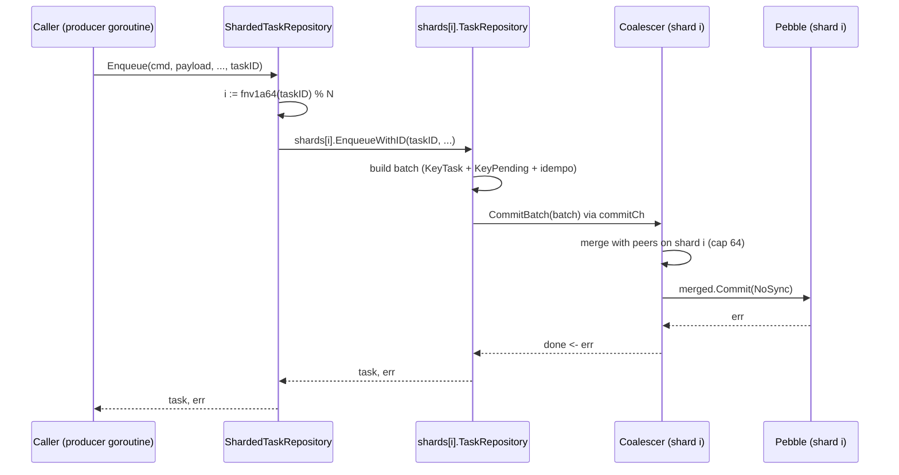

# Storage: Pebble

Pebble is the LSM-tree key-value engine used by CockroachDB. codeQ links
it in-process for two roles:

1. **Durable task store** — every task, every queue index, every
   idempotency mapping, every TTL record lives under the `codeq/`
   namespace (see [`internal/repository/pebble/keys.go:25-59`](../internal/repository/pebble/keys.go)).
2. **Raft state** — when raft replication is enabled, the same Pebble
   directory also stores the raft log, stable store, and snapshots
   under their own key prefixes. See
   [docs/40-raft-replication.md](./40-raft-replication.md) for the wire
   side; this doc covers the storage side.

There is no external database, no broker, no Redis. Pebble holds an
exclusive file lock on its data directory, so exactly one codeq
process can open a given store.

## Why Pebble

The codeQ workload is write-heavy: every Enqueue produces 2-3 Put
operations (KeyTask + KeyPending + optional KeyIdempo / KeyTTLIndex);
every Claim is a Delete + Put; every result is 2 Puts + 1 Delete.
Reads are mostly small range scans over pending priority buckets and
point lookups by task id. An LSM (log-structured merge) tree turns
every write into an append into a sorted in-memory buffer, which is
the cheapest write path on both rotational and SSD media. Pebble was
picked over RocksDB because it is pure Go (no cgo), and over BoltDB
because B+tree engines pay random I/O on every write.

## LSM tree fundamentals

A log-structured merge tree splits storage into one in-memory tier and
several on-disk tiers. The shape of the codeQ Pebble store at steady
state:

```
   write -->  +----------------+
              | memtable (mem) |    sorted skip list, append-only
              +----------------+
                     |
                     | flush when full
                     v
              +----------------+
              | L0   SSTables  |    overlapping key ranges allowed
              +----------------+
                     |
                     | leveled compaction
                     v
              +----------------+
              | L1   SSTables  |    non-overlapping ranges, ~10x L0
              +----------------+
                     |
                     v
                    ...
                     v
              +----------------+
              | L6   SSTables  |    largest tier, oldest data
              +----------------+
```

Definitions:

- **Memtable** — sorted in-memory skip list. Writes hit the memtable
  plus the WAL (write-ahead log) on disk for crash recovery. When the
  memtable fills (configurable, low MiB), Pebble flushes it as an
  **SST** (sorted string table) into L0.
- **SST** — immutable on-disk file, keys sorted, index + bloom filter
  block at the tail. Once written, an SST is never modified; it is
  only either kept or merged into a higher level and deleted.
- **Compaction** — background goroutines pick overlapping SSTs from
  adjacent levels, merge-sort them into a new SST one level deeper,
  and delete the inputs. This is how garbage (overwritten or deleted
  keys) is eventually reclaimed.
- **WAL** — a sequential file on disk; every batch is appended here
  before the memtable is updated. On Open, Pebble replays the WAL into
  a fresh memtable, so process crashes (panic, SIGKILL) lose no
  acknowledged data even with `NoSync` writes.

Reads check tiers in order: memtable, then L0 (newest SSTs first),
then L1, L2, etc. Bloom filters on each SST cheaply rule out levels
that cannot contain the key, so a point lookup on a key that exists
only in L6 still costs roughly one disk I/O on average. Range scans
build a merging iterator across tiers and stream sorted results.

Cost model: writes O(1) amortized (one append to memtable + one to
WAL); point reads O(levels) bloom checks + one SST read on hit; range
reads O(log N) seek + O(K) stream. This is the "writes cheap, reads
still cheap" tradeoff that makes LSMs the standard for queue-like
workloads.

## Write path inside codeQ

A single Enqueue lands in Pebble through this sequence:

1. The repository builds a `pebble.Batch` with every Put for the new
   task — KeyTask + KeyPending, optionally KeyIdempo + KeyTTLIndex.
2. Caller calls `d.CommitBatch(b)` ([`db.go:322-339`](../internal/repository/pebble/db.go)).
3. **Direct mode** (no replicator): the batch is sent to `commitCh`
   (buffered 1024). The coalescer goroutine pops it, merges any
   batches already queued (up to `maxMergeBatch=64`), and issues ONE
   `merged.Commit(pebbledb.NoSync)`. The shared error fans out via
   each caller's `done` channel.
4. **Replication mode** (`AttachReplicator()` called): coalescer
   bypassed. The batch's `.Repr()` goes through `repl.Replicate`.
   Raft does its own log-entry batching; coalescing on top would just
   add latency. See [docs/40-raft-replication.md](./40-raft-replication.md).

Inside Pebble, `Commit` walks the commitPipeline: serialize, acquire
a global pipeline mutex, append to WAL, insert into memtable, release.
With `NoSync` the WAL append skips `fsync`; with `Sync` it fsyncs
before Commit returns.

## Group commit — why and how

Pebble's `commitPipeline` acquires a global mutex on every `Commit()`.
Phase 0 profiling at 26k req/s pinned that mutex at **96% of mutex
profile** and **44% of block profile**
([`db.go:71-82`](../internal/repository/pebble/db.go)). Every
concurrent caller serialized on it. We could not parallelize the
mutex itself, so we collapsed N acquisitions into one.

The mechanism is the classic group commit pattern (MySQL, PostgreSQL):

```
caller G1 ----+
caller G2 ----+--> commitCh (buf 1024) --> coalescer goroutine --> Pebble.Commit
caller G3 ----+                                  |
caller G4 ----+                                  +-- merges up to 64 batches
   ...                                           +-- one Commit per merge
caller G64 ---+                                  +-- err fans out via done<-
```

Pseudocode of `commitLoop`
([`db.go:341-401`](../internal/repository/pebble/db.go)):

```go
for {
  first := <-d.commitCh                 // block until first work
  merged := d.db.NewBatch()
  merged.Apply(first.batch, nil)
  reqs := []*commitReq{first}

  // opportunistic drain — up to 63 more already in flight
  for len(reqs) < maxMergeBatch {
    select {
    case more := <-d.commitCh:
      merged.Apply(more.batch, nil)
      reqs = append(reqs, more)
    default:
      goto commit
    }
  }
commit:
  err := merged.Commit(pebbledb.NoSync) // ONE commitPipeline acquisition
  for _, r := range reqs { r.done <- err }
}
```

Constants ([`db.go:117-129`](../internal/repository/pebble/db.go)):

- `maxMergeBatch = 64` — merged batch cap. Higher amortizes the mutex
  over more ops but raises tail latency for the last joiner and the
  merged batch's memory footprint.
- `commitChanBuf = 1024` — producer queue depth. Sized for several
  commit cycles at peak (≈90k commits/s observed); 1024 has never
  blocked in practice.

Trade: each caller pays one extra channel hop of latency. On `-cpu 1`
this is net-neutral; on many cores it scales near-linearly with
concurrency until the merge cap. See `BenchmarkEnqueueParallel_*` in
[`internal/repository/pebble/bench_test.go`](../internal/repository/pebble/bench_test.go).

## Key prefix layout

All keys live under the `codeq/` namespace. Numeric components that
must sort lexicographically are big-endian fixed-width bytes (8 bytes
for unix-seconds / score / sequence, 1 byte for priority). Source of
truth: [`internal/repository/pebble/keys.go:25-59`](../internal/repository/pebble/keys.go).

| Prefix | Encodes | Role |
|---|---|---|
| `codeq/tasks/<id>` | JSON Task struct | Canonical task record. |
| `codeq/results/<id>` | JSON result record | SubmitResult target. |
| `codeq/idempo/<key>` | task id (raw bytes) | Idempotency lookup; replays return the original task. |
| `codeq/lease/<id>` | worker id \| until-unix | Worker lease record (also mirrored in-memory). |
| `codeq/ttl/<expire_unix_be8>/<id>` | empty value | TTL reaper index; range scan returns due tasks. |
| `codeq/q/<cmd>/<tenant>/pending/<prio_be1>/<seq_be8>/<id>` | empty | Priority FIFO queue. Lower `prio` byte = higher priority; `seq` orders within bucket. |
| `codeq/q/<cmd>/<tenant>/inprog/<id>` | empty | Claim lock. |
| `codeq/q/<cmd>/<tenant>/delayed/<score_be8>/<id>` | empty | Delayed delivery; `MoveDueDelayed` scans `[base, base+(now+1))`. |
| `codeq/q/<cmd>/<tenant>/dlq/<id>` | empty | Dead letter — task exceeded `maxAttempts`. |
| `codeq/subs/<event>/<id>` | webhook record | Subscription registry. |

`tenant==""` is encoded as the literal `_` so the key parser can split
on `/` without losing the empty position. Commands are lowercased.

Every key derived from one task ID — KeyTask, KeyPending, KeyInprog,
KeyDLQ, KeyDelayed, KeyTTLIndex — shares the task ID at the tail but
under different prefixes. A single task touches multiple keys per
operation; co-locating them in one Pebble batch makes the operation
atomic at the commit layer.

## fsync tradeoff

`fsyncOnCommit` in [`db.go:131-138`](../internal/repository/pebble/db.go):

| Setting | Per-commit cost | Process crash | Host crash |
|---|---|---|---|
| `false` (default, `NoSync`) | No syscall after WAL append | Nothing — WAL replay on Open restores it | Last few seconds (OS page cache contents) |
| `true` (`Sync`) | `fsync` per Commit | Nothing | Nothing |

Mechanism: with `NoSync`, WAL bytes go to the OS page cache, not the
disk device. A **process crash** (panic, SIGKILL) leaves the page
cache intact; Pebble's WAL replay rebuilds the memtable on Open. A
**host crash** (kernel panic, power loss) drops the page cache, so
unflushed WAL bytes are gone.

codeQ ships with `fsyncOnCommit=false` because the throughput
difference is large (an `fsync` is typically tens to hundreds of
microseconds even on NVMe) and lost tasks can be retried by the
producer. Workloads that cannot tolerate any host-crash loss flip
the knob.

## Recovery on Open

`Open` in [`db.go:140-173`](../internal/repository/pebble/db.go) does
two things beyond `pebbledb.Open`:

1. Pebble itself replays the WAL into a fresh memtable — automatic,
   bounded by the size of the unflushed memtable.
2. codeQ's `recoverSeq()` ([`db.go:200-230`](../internal/repository/pebble/db.go))
   scans every `codeq/q/.../pending/` key, parses the embedded
   `seq_be8`, and sets the in-memory `atomic.Uint64` counter to the
   high-water mark + 1. New enqueues then sort **after** anything
   restored from disk within the same priority bucket, preserving
   FIFO across restart.

The scan is linear in the pending-queue size; at the sizes codeQ
targets it completes in sub-second range and is off the hot path.

## Compaction overhead

Background compaction does work proportional to write throughput: for
every byte written, the LSM eventually rewrites it ~`fanout × levels`
times as it sinks from L0 to L6. This **write amplification** is the
price of being write-optimized; no LSM design avoids it.

At the measured saturation point of **76,639 tasks/s** on a single
node ([`internal/bench/profile_full_cycle_test.go`](../internal/bench/profile_full_cycle_test.go)),
compaction work runs around 18.6% of total CPU. The rest is in
producer goroutines, gRPC serialization, and the commitPipeline. If
compaction falls behind, L0 grows and reads touch more SSTs, which
self-throttles writes via Pebble's built-in stalls.

The main tuning knob is the block cache, set at
[`db.go:147`](../internal/repository/pebble/db.go) to **256 MiB**:

```go
pOpts := &pebbledb.Options{
    Cache: pebbledb.NewCache(256 << 20), // 256 MiB block cache
}
for i := range pOpts.Levels {
    pOpts.Levels[i].FilterPolicy = bloom.FilterPolicy(10) // 10 bits/key
    pOpts.Levels[i].FilterType  = pebbledb.TableFilter
}
```

The 10-bits-per-key bloom filter gives ~1% false positive rate per
level, which is the standard SSTable tuning. `TableFilter` puts the
bloom filter at table granularity (not block) so a single bloom check
rules out an entire SST.

## Atomicity

Pebble's commit unit is the batch. Every operation that mutates more
than one key — task finalization (result + inprog delete + lease
clear + TTL index), lease repair, bulk result submission — builds a
`pebble.Batch`, adds all Puts and Deletes, and submits via
`CommitBatch`. Either every op in the batch lands or none does;
readers never see a half-applied state. This is why the keyspace
co-locates all keys for one task under one logical task ID even when
the prefixes differ.

## When NOT to use Pebble

Pebble works for codeQ because the workload is many small, single-task
operations on a queue that fits on local disk. Three classes of
workload break that assumption:

1. **Billion-task backlogs exceeding local disk.** Pebble scales to
   the device under it. If the pending set outgrows the local NVMe
   budget, use intra-process sharding ([08b-pebble-sharding-internals.md](./08b-pebble-sharding-internals.md))
   or cluster mode ([05-cluster-architecture.md](./05-cluster-architecture.md)).
2. **Cross-task atomicity.** Every Pebble batch is atomic, but codeQ
   only batches keys for one task ID. There is no API to atomically
   claim ten tasks across ten producers in one commit, because they
   hash to different shards.
3. **Strong cross-shard consistency without raft.** Direct mode commits
   with `NoSync` and gives no cross-shard ordering guarantee. If you
   need it, enable raft ([docs/40-raft-replication.md](./40-raft-replication.md));
   the coalescer is bypassed and raft serializes log entries across
   the quorum.

## Phase 8 sharded routing

For workloads that saturate one Pebble store's commit pipeline,
[`ShardedTaskRepository`](../internal/repository/pebble/sharded_task_repository.go)
opens N independent Pebble stores under `path/shard<i>/`, each with
its own coalescer and compaction worker, and routes every task-keyed
call by `fnv1a64(taskID) % N`. Because every key derived from a task
ID hashes to the same shard, each task operation still commits in one
Pebble batch on one shard — no cross-shard transactions on the hot
path.

Cross-shard operations exist but are kept off the per-task fast path:
`Claim` / `ClaimMany` round-robin, `MoveDueDelayed` fans out per
shard, `AdminQueues` / `PendingLength` / `QueueStats` aggregate.
Idempotency lookups route on `hash(idempotencyKey) % N`, the same
shard the original Enqueue wrote into, so replays land back on the
right entry.



Cluster mode (`cluster.enabled=true`) and intra-process sharding
(`numShards > 1`) are mutually exclusive; startup panics if both are
on. Pick one: multi-node across machines, or multi-shard inside one
process.

## Scaling Pebble — at a glance

| Path | Mechanism | When |
|---|---|---|
| Intra-process (Phase 8) | `numShards: N` opens N Pebble stores under `path/shard<i>/`; routed by `hash(task_id) % N` | One box, hitting the commit pipeline ceiling. Measured sweet spot: 4 shards on 12 cores → 83,420 tasks/s. |
| Multi-node cluster | N codeq nodes joined by consistent-hash ring; each owns its own Pebble store | One box exhausted (CPU / RAM / disk); horizontal scale. |

## See also

- [Pebble sharding internals](./08b-pebble-sharding-internals.md) —
  per-shard component layout behind `ShardedTaskRepository`.
- [Persistence plugin system](./27-persistence-plugin-system.md) — how
  Pebble plugs into the repository interface.
- [Raft replication](./40-raft-replication.md) — what happens when
  `AttachReplicator` is called.
- [Performance tuning](./17-performance-tuning.md) — shard count,
  batch sizes, coalescer caps in the field.
