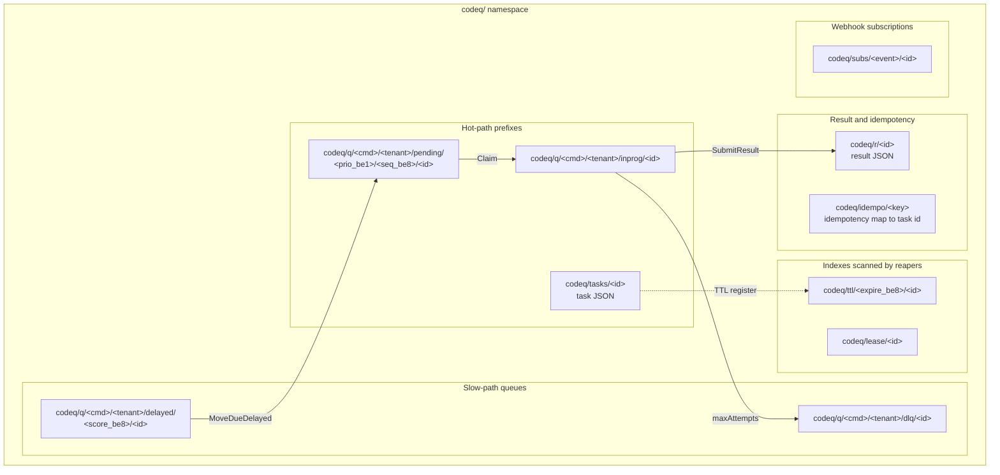
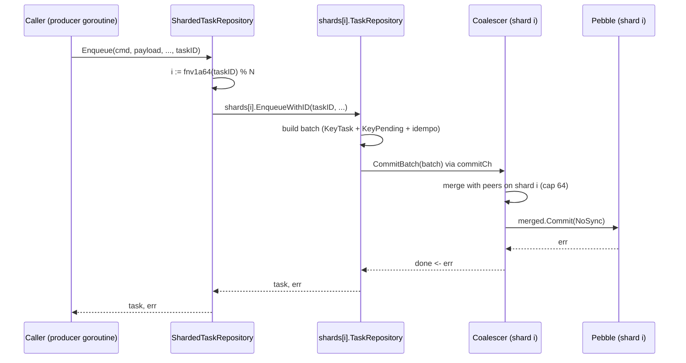

# Storage layout (Pebble)

Pebble is an embedded key-value store (CockroachDB's RocksDB-style LSM) that runs inside the codeq process. It requires no external dependencies — server, persistence, and lease state share one binary and one data directory.

## Keyspace

Pebble uses a hierarchical key structure with byte-prefixes. All keys follow the pattern:

- `codeq/{command}/{tenantID}/...` (hierarchical prefix organization)

Data structures stored:

- **Tasks hash**: Task metadata keyed by task ID
- **Results hash**: Task results keyed by task ID
- **Pending queues**: Priority-ordered lists per (command, tenantID, priority)
- **In-progress set**: Task IDs currently claimed for execution
- **Delayed queue**: ZSET for delayed task delivery with scores as epoch timestamps
- **Dead Letter Queue (DLQ)**: Set of task IDs exceeding `maxAttempts`
- **Leases**: Ephemeral records tracking worker ownership (key: `codeq/lease/{leaseID}`)
- **Idempotency cache**: Deduplication records (key: `codeq/idempo/{idempotencyKey}`)
- **Subscriptions**: Webhook registrations with TTL scores (key: `codeq/subs/{event}`)

### Key Organization

Pebble keys use a flat namespace with hierarchical prefixes optimized for LSM-tree range scans:

- **Pending queue**: `codeq/q/{command}/{tenantID}/pending/{priority}/{seq}/{id}`
  - `{seq}`: 8-byte big-endian sequence number (enables FIFO ordering within priority)
  - `{id}`: Task ID (unique per task)
- **In-progress tracking**: `codeq/q/{command}/{tenantID}/inprog/{id}`
- **Delayed tasks**: `codeq/q/{command}/{tenantID}/delayed/{score}/{id}` (sorted by big-endian unix-second score)
- **DLQ**: `codeq/q/{command}/{tenantID}/dlq/{id}`
- **Task data**: `codeq/tasks/{id}` (JSON-encoded task metadata)
- **Result data**: `codeq/results/{id}` (JSON-encoded result)
- **TTL tracking**: `codeq/ttl/{expire_unix}/{id}` (range-scan reaper)
- **Leases**: `codeq/lease/{id}`
- **Idempotency**: `codeq/idempo/{key}`
- **Subscriptions**: `codeq/subs/{event}/{id}`

### Keyspace map

The diagram below groups every byte-prefix under the `codeq/` namespace by
role. Three prefixes carry the bulk of the create → claim → complete
cycle and are marked **hot-path** — every Enqueue writes `codeq/tasks/`
plus `codeq/q/<cmd>/<tenant>/pending/`, and every Claim moves a key from
`pending/` into `codeq/q/<cmd>/<tenant>/inprog/`. The remaining prefixes
are written on slower paths (delayed delivery, DLQ promotion, TTL
reaping, webhook subscriptions). Source of truth:
[`internal/repository/pebble/keys.go`](../internal/repository/pebble/keys.go).



## Multi-tenancy

Like Redis storage, Pebble enforces tenant isolation via tenant ID inclusion in all queue keys. When `tenantID` is empty (legacy mode), it is omitted from keys for backward compatibility.

## Sequence Numbers

Pebble uses process-wide sequence counters (atomic 64-bit integers) to assign unique ordering to pending queue entries within a priority bucket. This ensures FIFO ordering even after restart.

On startup, Pebble:

1. Scans all pending queue keys
2. Extracts sequence numbers from keys
3. Recovers the high-water mark (max sequence seen)
4. Sets internal counter to max+1

This recovery is linear in the pending queue size; for extremely large queues (millions of entries), consider chunking.

## Atomicity

Pebble commits are atomic at the batch level. A batch can contain multiple puts, deletes, or range operations that commit as a single unit. codeQ uses batches for:

- Task finalization (save result + remove from in-progress + delete lease + update TTL)
- Lease repair (multiple TTL checks and requeue operations)
- Bulk operations (batch enqueue, batch result submission)

### Batch commit and the group-commit coalescer

Pre-Phase 1.1, every `CommitBatch` caller contended on Pebble's internal
commit pipeline mutex; under N concurrent goroutines this serialized N
commits and bounded throughput by the lock wait, not the disk. The
Phase 1.1 win replaces that contention with a single coalescer
goroutine that owns the write side: callers hand their batch to a
channel, the coalescer pops the first request, opportunistically drains
up to `maxMergeBatch=64` more requests already queued, merges them with
`Batch.Apply` into one large batch, issues a single `Commit`, and fans
the resulting error back to every joined caller through their per-call
`done` channel. From the caller's perspective the contract is
unchanged — `CommitBatch` is still synchronous, still atomic, still
returns the commit error if any — but the underlying Pebble commit
runs once for up to 64 logically independent batches.

Source: [`internal/repository/pebble/db.go`](../internal/repository/pebble/db.go)
(`commitLoop`, `CommitBatch`, `maxMergeBatch`).

```mermaid
sequenceDiagram
  participant G1 as Goroutine 1
  participant G2 as Goroutine 2
  participant GN as Goroutine N
  participant CH as commitCh (buffered)
  participant CO as Coalescer goroutine
  participant PB as Pebble

  G1->>CH: send commitReq{batch1, done1}
  G2->>CH: send commitReq{batch2, done2}
  GN->>CH: send commitReq{batchN, doneN}
  CO->>CH: recv first req (blocking)
  CO->>CO: merged := NewBatch; Apply(batch1)
  loop drain up to maxMergeBatch=64
    CO->>CH: non-blocking recv next req
    CO->>CO: merged.Apply(batchK)
  end
  CO->>PB: merged.Commit(NoSync)
  PB-->>CO: err (nil on success)
  CO-->>G1: done1 <- err
  CO-->>G2: done2 <- err
  CO-->>GN: doneN <- err
```

> **Performance**: the coalescer trades a single channel hop of latency
> for one Pebble commit shared across up to 64 callers. On `-cpu 1` the
> extra hop is net-neutral or slightly negative; on `-cpu high` it
> scales near-linearly until the merge cap. See
> `BenchmarkEnqueueParallel_*` in
> [`internal/repository/pebble/bench_test.go`](../internal/repository/pebble/bench_test.go).

## Bloom Filters and Caching

Pebble's LSM-tree is tuned for codeQ's workload:

- **Block cache**: 256 MiB (configurable) for hot data
- **Bloom filters**: 10 bits per key (~1% false positive rate) on all levels to speed up negative lookups
- **Compression**: Snappy (default) on lower levels

## Retention and Cleanup

Tasks are retained for 24 hours (configurable). The cleanup process:

1. Scans TTL index for expired entries
2. Removes task records, results, leases, and queue entries
3. Compacts the LSM tree to reclaim space

Cleanup runs periodically and can be triggered manually via admin API.

## Single-writer Property

Pebble's embedded design means only one process may hold the database lock at a time. This is enforced at the OS level (flock on the database directory). For multi-node deployments, run multiple codeq nodes joined by the consistent-hash ring (see [05-cluster-architecture.md](./05-cluster-architecture.md)); each node owns its own Pebble store.

## Performance Characteristics

- **Point lookups**: O(1) amortized, cached or single-level read
- **Range scans**: O(log N) for initial seek + O(K) for K results
- **Writes**: O(1) amortized with write batching
- **Compaction**: Background, ~10-15% slowdown during heavy merging

## Phase 8 sharded routing

The single-process bottleneck after Phase 1.1 was that one Pebble DB
still owned one commit pipeline and one compaction worker. Phase 8
splits the Pebble layer into N independent shards, each with its own
DB, own commit coalescer, and own compaction. The
[`ShardedTaskRepository`](../internal/repository/pebble/sharded_task_repository.go)
wraps the N per-shard `TaskRepository` instances and routes every
task-keyed call by `fnv1a64(taskID) % N`. Because every key derived
from a single task ID (`KeyTask`, `KeyPending`, `KeyInprog`, `KeyDLQ`,
`KeyDelayed`, `KeyTTLIndex`) hashes to the same shard, each individual
task operation still commits in one Pebble batch — there are no
cross-shard transactions on the hot path.

Cross-shard operations exist but are kept off the per-task fast path:
`Claim`/`ClaimMany` round-robin across shards, `MoveDueDelayed` fans
out per shard, and `AdminQueues`/`PendingLength`/`QueueStats` aggregate
results. Idempotency lookups route on `hash(idempotencyKey) % N`, the
same shard the original Enqueue wrote into, so replays land back on
the right entry.



> **Note**: cluster mode and intra-process sharding (`numShards > 1`)
> are mutually exclusive — startup panics if both are enabled. Pick
> one: multi-node across machines, or multi-shard inside one process.
> See [Pebble sharding internals](./08b-pebble-sharding-internals.md)
> for the per-shard component layout.

## Scaling Pebble

| Path | Mechanism | When |
|---|---|---|
| Intra-process (Phase 8) | `numShards: N` opens N independent Pebble stores under `path/shard<i>/`; routed by `hash(task_id) % N` | One box, hitting the commit pipeline ceiling. Sweet spot: 4 shards on 12 cores → 83,420 tasks/s. |
| Multi-node cluster | N codeq nodes joined by consistent-hash ring; each owns its own Pebble store | One box exhausted (CPU / RAM / disk); need horizontal scale. |

The two paths are mutually exclusive (the startup path panics if both
`numShards > 1` and `cluster.enabled=true`). See
[08b-pebble-sharding-internals.md](./08b-pebble-sharding-internals.md)
and [05-cluster-architecture.md](./05-cluster-architecture.md).

## See also

- [Pebble sharding internals](./08b-pebble-sharding-internals.md) —
  per-shard component layout behind `ShardedTaskRepository`.
- [Persistence plugin system](./27-persistence-plugin-system.md) — how
  Pebble plugs into the repository interface.
- [Performance tuning](./17-performance-tuning.md) — knobs for shard
  count, batch sizes, and the coalescer in the field.
