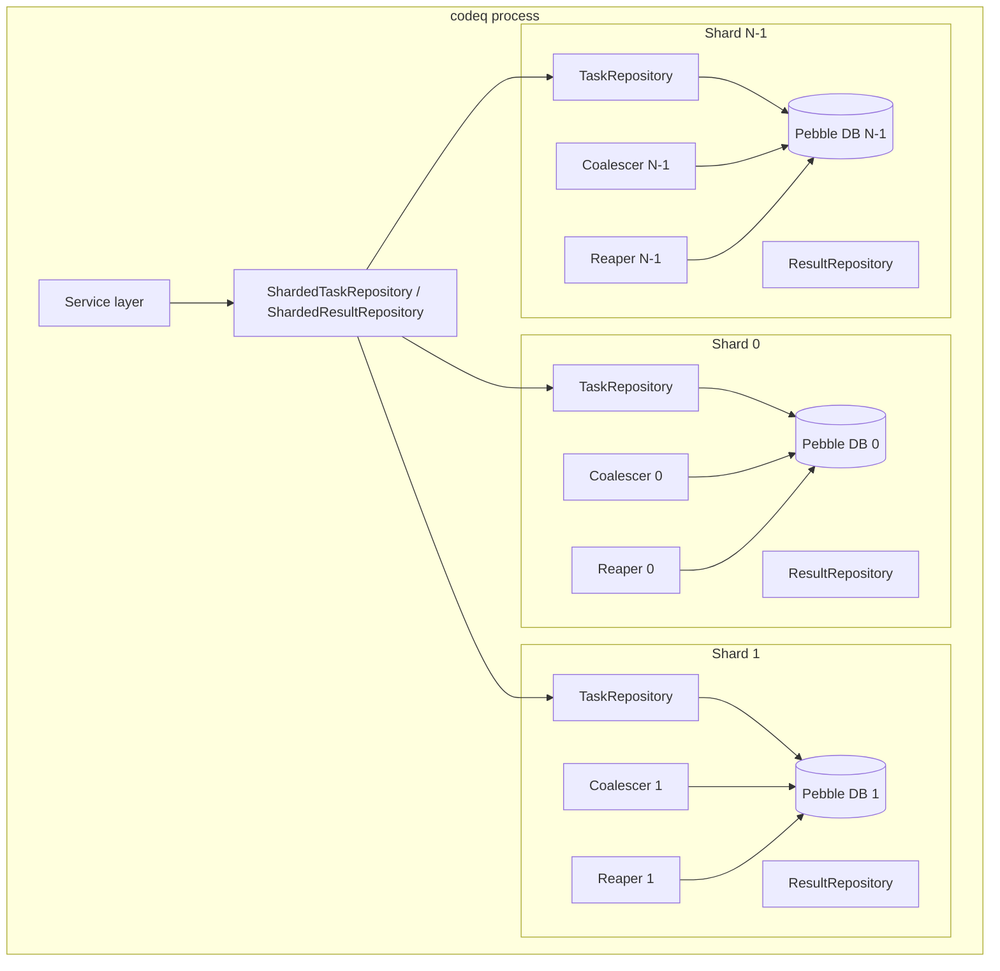
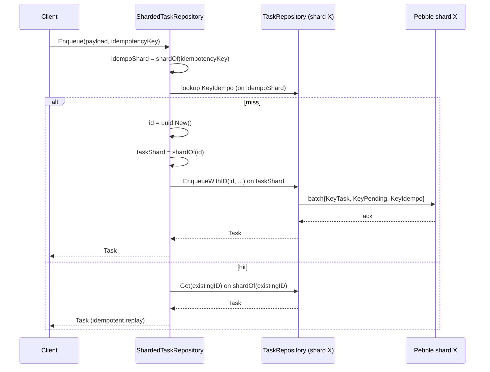
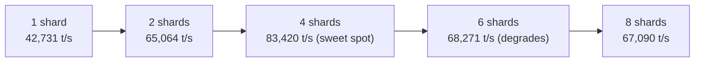

# Pebble sharding internals (Phase 8)

Phase 8 splits the single embedded Pebble database into `N` independent
Pebble instances inside the same process. Each shard has its own commit
pipeline, its own coalescer, its own reaper goroutines, and its own LSM
compaction. A thin wrapper (`ShardedTaskRepository`) routes every
operation by `fnv64a(task_id) % N` so all keys belonging to one task
land on one shard and stay there.

This doc covers the parts you only need if you are tuning, debugging,
or extending the sharding layer. For the user-facing knob and what to
set it to, see [Performance tuning](./17-performance-tuning.md). For
the keyspace itself, see [Storage layout (Pebble)](./07b-storage-pebble.md).

## 1. What and why

At ~42k tasks/s on the full create / claim / complete cycle, profiling
pinned three single-Pebble bottlenecks:

1. **Commit pipeline lock**: every `Commit()` acquires Pebble's internal
   `commitPipeline` mutex. The Phase 0 profile showed it as 96% of the
   mutex profile and 44% of the block profile at 26k req/s. Group
   commit (the coalescer) collapses `N` writes into one acquisition, but
   the lock is still single-DB.
2. **Compaction**: one LSM under sustained write pressure spends real
   CPU on L0 → L_n compaction. A single goroutine pool serialises
   compactions across the whole keyspace.
3. **Write throughput per DB**: one DB has one MemTable and one WAL,
   both of which become the contended resource at saturation.

Splitting into `N` independent Pebble DBs gives every shard its own
mutex, its own MemTable, its own WAL, and its own compaction workers.
On the reference 12-core Linux box (`internal/bench/profile_full_cycle_test.go::TestProfile_FullCycle`),
4 shards is **1.95×** the throughput of 1 shard (83,420 tasks/s vs
42,731 tasks/s) on the full cycle.

> **Performance**: shards are an intra-process parallelism trick. By
> themselves they do not give you HA — a process crash takes every
> shard with it. For HA, layer raft on top: `cfg.Raft.Enabled` with
> `numShards > 1` opens one raft group per shard (M2 mode, see §9 and
> [Raft replication](./40-raft-replication.md)). The legacy static-ring
> [cluster mode](./05-cluster-architecture.md) is mutually exclusive
> with `numShards > 1` (see §10).

## 2. Hash function and atomic invariant

Routing is FNV-1a 64-bit over the task ID, modulo `len(shards)`. From
`internal/repository/pebble/sharded_task_repository.go`:

```go
func (s *ShardedTaskRepository) shardOf(key string) int {
    h := fnv.New64a()
    _, _ = h.Write([]byte(key))
    return int(h.Sum64() % uint64(len(s.shards)))
}
```

FNV-1a is cheap (no allocations, ~6 ns) and uniform on the inputs we
care about. Task IDs are UUID v4 strings, so the high-entropy random
prefix gives near-uniform shard balance even at small `N`. We do not
need a cryptographic hash — there is no adversary, only entropy.

### Why one hash function for every key

Every key derived from a task uses the **same task ID** as the routing
key, so they all collide onto the same shard:

| Key family | Routing key |
|---|---|
| `KeyTask(id)` | `id` |
| `KeyPending(cmd, tenantID, prio, seq, id)` | `id` |
| `KeyInprog(cmd, tenantID, id)` | `id` |
| `KeyTTLIndex(expiresAt, id)` | `id` |
| `KeyDelayed(cmd, tenantID, visibleAt, id)` | `id` |
| `KeyDLQ(cmd, tenantID, id)` | `id` |

This is the atomic invariant: **all keys for one task live on one
shard**. Every individual task operation still commits as a single
Pebble batch on a single shard, so we keep the all-or-nothing semantics
the single-DB path always had. We never need a 2PC across shards.

Idempotency keys are the one exception. The mapping `idempo_key →
task_id` is stored on `shardOf(idempotency_key)`, which is usually a
different shard from `shardOf(task_id)`. The lookup is read-only and
the original Enqueue wrote both entries (idempo map on its shard, task
state on its shard) in two independent commits. A retried Enqueue with
the same idempotency key always lands on the same idempo shard, finds
the existing mapping, then redirects the read to the task's shard.

## 3. Architecture



There is exactly **one** wrapper instance. The wrapper holds `[]*TaskRepository`
and one `atomic.Uint64` round-robin counter. Each per-shard
`TaskRepository` is a full, normal `TaskRepository` over its own `*DB`
— it does not know it is sharded.

Wiring (from `pkg/app/application_pebble.go`):

```go
dbs := make([]*pebblerepo.DB, 0, numShards)
for i := range numShards {
    shardPath := fmt.Sprintf("%s/shard%d", pc.Path, i)
    shardDB, err := pebblerepo.Open(pebblerepo.Options{
        Path: shardPath, FsyncOnCommit: pc.FsyncOnCommit,
    })
    // ...
    dbs = append(dbs, shardDB)
}
// One TaskRepository per shard, then wrap.
taskShards := make([]*pebblerepo.TaskRepository, len(dbs))
// ... populate ...
taskRepo = pebblerepo.NewShardedTaskRepository(taskShards)
resultRepo = pebblerepo.NewShardedResultRepository(resultShards)
```

The on-disk layout is `Path/shard0/`, `Path/shard1/`, ..., each a
complete Pebble directory with its own lock file. `numShards = 1`
skips the subdir indirection entirely and writes to `Path/` directly,
so single-shard deployments don't get a gratuitous extra directory.

## 4. Routing

### Single-task ops (point lookups)

`Get`, `Heartbeat`, `Abandon`, `Nack`, `SaveResult`, `UpdateTaskOnComplete`
all take a task ID and route to `shards[shardOf(id)]`. One hash, one
shard, one call.

### Enqueue (write)

Enqueue picks a fresh UUID, hashes it, and dispatches to that shard.
The idempotency check runs first on `shardOf(idempotency_key)` to find
an existing mapping; if hit, the redirect goes to `shardOf(existing_id)`.



### Fan-out ops

Some operations can't be routed to one shard because the routing key
isn't known up front (Claim) or because they apply to every key
(MoveDueDelayed, AdminQueues). These fan out:

| Op | Strategy |
|---|---|
| `Claim` / `ClaimMany` | Round-robin starting shard (atomic counter), try each shard in turn until one yields a task |
| `MoveDueDelayed` | Iterate every shard, sum the `n` of moved entries |
| `PendingLength` | Iterate every shard, sum |
| `AdminQueues` | Iterate every shard, merge maps by key (sum int64 values) |
| `QueueStats` | Iterate every shard, accumulate Ready / InProgress / Delayed / DLQ |
| `CleanupExpired` | Iterate every shard with per-shard limit |

Round-robin for Claim uses an atomic counter (`rrCounter.Add(1)`) so
two concurrent claimers don't both stampede shard 0. The cost of the
fan-out scans is `O(N)` Pebble iterators per call, which is acceptable
for reaper-cadence ops (every few seconds) and admin endpoints.

`GetTasksBatch` and the two batch writers on the result side (`BatchUpdateTasksOnComplete`,
`BatchRemoveFromInprogAndClearLease`, from
`internal/repository/pebble/sharded_result_repository.go`) bucket their
input by shard and run each bucket in parallel. Each bucket commits
as one Pebble batch on its shard — atomic within a shard, parallel
across shards.

## 5. Per-shard state

Every `TaskRepository` keeps its own copy of all the in-memory state
that the single-DB path holds. There is **no shared state** across
shards besides the routing wrapper itself.

| Field | Per-shard | Purpose |
|---|---|---|
| `queues` (`sync.Map` of `*queueChan`) | yes | Per-(cmd, tenant, priority) pending-hint channel |
| `delayedCount` (`sync.Map` of `*atomic.Int64`) | yes | Cached count of delayed entries per (cmd, tenant) |
| `delayedMoveFlag` (`sync.Map` of `*atomic.Int32`) | yes | Single-flight CAS for `MoveDueDelayed` |
| `leases` (`*leaseTable`) | yes (on `*DB`) | In-memory lease table |
| `seq` (`atomic.Uint64`, on `*DB`) | yes | Monotonic sequence for pending keys |
| `commitCh` / coalescer goroutine | yes (on `*DB`) | Group commit |

A fast-path Claim only inspects the queue channels on its current
shard, so two shards' Claim paths never share a mutex, a channel, or
an atomic counter. This is the property that lets shards scale almost
linearly until the OS context-switch cost overtakes the win.

## 6. Per-shard reaper

The reaper sweeps expired leases and TTL entries on a fixed cadence.
Sharing one reaper across shards would serialise the sweeps and undo
the commit-pipeline parallelism. So we spawn one reaper per shard, from
`internal/repository/pebble/reaper.go`:

```go
// StartReapersForShards is the Phase 8 helper: spawns one Reaper per
// shard, each sweeping its own DB. Sharing one reaper across shards
// would serialise their sweeps and undo the parallelism, so we keep
// them independent.
func StartReapersForShards(ctx context.Context, dbs []*DB, tz *time.Location, logger *slog.Logger, opts ReaperOptions) {
    for _, db := range dbs {
        NewReaper(db, tz, logger, opts).Start(ctx)
    }
}
```

Each reaper runs two goroutines (lease sweep + TTL sweep), so with
`numShards = 4` you get 8 reaper goroutines. They wake on independent
tickers (no shared phase), so their commit bursts naturally jitter
across shards instead of stampeding all DBs at once.

### Leader gate (raft mode)

In raft mode, the reaper writes (Nack on expired lease, DLQ promotion)
have to go through `raft.Apply`. Followers can't apply on their own
without splitting the log, so each reaper takes a `LeaderGate func() bool`
and skips its tick whenever the gate returns false. From
`internal/repository/pebble/reaper.go`:

```go
case <-t.C:
    if r.leaderGate != nil && !r.leaderGate() {
        // Follower in raft mode: leader's reaper handles all sweeps.
        continue
    }
```

`pkg/app/application_pebble.go` wires each shard's `LeaderGate` to that
shard's own `raft.DB.IsLeader`. M2 multi-shard: a node that leads
shard 0 but follows shard 1 sweeps shard 0 only — the shard-1 reaper
ticks but immediately returns. After a failover the new leader's
reaper picks up on its next tick (default 2 s lease, 30 s TTL), so
expiry latency rises by at most one interval.

## 7. Sequence number recovery

Pending keys carry an 8-byte big-endian sequence number for FIFO
ordering within a priority bucket. The sequence is a process-local
counter on `*DB`:

```go
type DB struct {
    db   *pebbledb.DB
    seq  atomic.Uint64
    // ...
}
func (d *DB) NextSeq() uint64 { return d.seq.Add(1) }
```

At `Open`, each shard scans its own `KeyPending` range and sets `seq`
to the max it finds (so new enqueues sort after any survivor entries
from before the restart). Recovery is per-shard and independent —
shard 0 might recover `seq = 100_000`, shard 1 might recover `seq =
99_847`, and that is fine. **Order is preserved within a shard, not
across shards.**

> **Note**: codeq has never guaranteed cross-key global ordering — even
> the single-shard path orders within `(cmd, tenant, priority)` only,
> not across commands or tenants. Sharding does not weaken this; it
> just adds shard as another dimension that order doesn't cross.

## 8. Sweep curve

`internal/bench/profile_full_cycle_test.go::TestProfile_FullCycle` on
the 12-core reference box, full create → claim → complete cycle, fixed
producer / worker concurrency. Results vary `PHASE8_SHARDS`:

| `numShards` | Throughput (tasks/s) | Δ vs 1 shard |
|---|---|---|
| 1 | 42,731 | baseline |
| 2 | 65,064 | +52% |
| 4 | **83,420** | **+95%** |
| 6 | 68,271 | +60% |
| 8 | 67,090 | +57% |



The peak at 4 shards on a 12-core box matches roughly `cores/3`. Going
to 6 or 8 shards on the same machine costs more than it saves: the
reaper, coalescer, and compaction goroutines start contending for the
same physical cores as the producer / worker goroutines, and Go's
scheduler eats the difference in context switches. The curve is
machine-dependent — re-run the bench when you change hardware.

> **Performance**: `numShards = 4` is the default we recommend for any
> machine with 8 or more cores. Below that, set it equal to the core
> count divided by 3 (round down, minimum 1). Above 16 cores, run the
> sweep yourself — the optimum almost certainly is not 16.

## 9. Raft per shard (M2 mode)

Raft is **compatible** with intra-process sharding. When
`cfg.Raft.Enabled` and `numShards > 1`, each Pebble shard gets its own
raft group: independent log, independent FSM, independent leader
election. This is the M2 mode tracked in
[Raft replication](./40-raft-replication.md).

The wiring (from `pkg/app/application_pebble.go:195-296`):

```go
raftNodes := make([]*raftpkg.DB, len(dbs))
for i, shardDB := range dbs {
    raftCfg := raftpkg.Config{
        Path:    fmt.Sprintf("%s/shard%d", pc.Path, i),
        SelfID:  cfg.Raft.SelfID,
        // per-shard bind addr or mux'd group ID
        // ...
    }
    rdb, err := raftpkg.OpenWithPebble(bgCtx, raftCfg, shardDB.Raw())
    // ...
    shardDB.AttachReplicator(rdb)
    raftNodes[i] = rdb
}
```

Two transport modes:

- **Non-mux**: each shard binds `BindAddr + shardIdx` (shard 0 on
  `:7000`, shard 1 on `:7001`, ...). One TCP listener per shard per
  node, so `numShards × nodes` listeners cluster-wide.
- **Mux** (`raft.MuxEnabled`): one TCP listener at `BindAddr`, frames
  carry a 4-byte group ID, the `MuxAcceptor` demultiplexes. One
  listener per node regardless of `numShards`.

What stays intact across raft + multi-shard:

- **Atomic invariant**: still per shard. A single task operation
  commits as one Pebble batch on its owning shard, which means one
  raft `Apply` on that shard's group. No 2PC across shards.
- **Routing**: the `ShardedTaskRepository` wrapper is unchanged. It
  hashes the task ID, finds the shard, calls the shard's
  `TaskRepository`. The repo's `Commit` path delegates to
  `raft.Apply` (via `shardDB.AttachReplicator`) when raft is on, then
  to the local `commitPipeline` after the log entry is committed.
- **Reaper leader-gating**: each shard's reaper consults its own
  `raft.DB.IsLeader`. See §6.

What raft + multi-shard does *not* give you:

- **Cross-shard consistency**: each shard's raft log is independent.
  Two writes targeting different shards have no shared linearisation
  point. The application never needed cross-shard ordering (queues are
  per `(cmd, tenant, priority)`, all of which collide onto one shard
  via the task ID, see §3), so this is by construction, not a
  regression.
- **Fan-out atomicity**: `MoveDueDelayed` still iterates shards
  sequentially. If shard 0 returns `ErrNotLeader` while shard 1
  succeeds, the wrapper skips shard 0 and continues — the fan-out
  contract is "do what you can on whatever shards we lead". The
  Phase 0 `MoveDueDelayed` was already designed to be retried by the
  next reaper tick, so no behavioural change.

### Failover surface area

With M1 single-shard raft, a node either leads the only group or
follows it. With M2, leadership is per group, so cluster-wide
distribution looks like:

```text
Node A:  shard 0 = LEADER     shard 1 = follower    shard 2 = follower
Node B:  shard 0 = follower   shard 1 = LEADER      shard 2 = follower
Node C:  shard 0 = follower   shard 1 = follower    shard 2 = LEADER
```

Writes for a given task ID always land on its owning shard's current
leader. The cluster gRPC layer (when present) will need to route on
`(shard, leader)` instead of `(node)` — that bridge isn't built yet,
which is why **legacy cluster mode + multi-shard remains mutually
exclusive even though raft + multi-shard is supported** (see §10).
For now, M2 is per-node sharding with peer replication of each shard;
horizontal scale comes from running more leaders on more nodes, not
from cross-node fan-out.

## 10. Cluster compatibility (not)

Cluster mode (`cluster.enabled = true`) and intra-process sharding
(`numShards > 1`) are **mutually exclusive**. The process refuses to
start if both are set:

```go
if numShards > 1 {
    if cfg.Cluster.Enabled {
        // close DBs
        return nil, fmt.Errorf("pebble: cluster mode + intra-process shards not supported (pick one)")
    }
    taskRepo = pebblerepo.NewShardedTaskRepository(taskShards)
    // ...
}
```

Reason: `cluster.Server` (the internal gRPC handler that serves peer
requests) expects a concrete `*TaskRepository`, not the wrapper. The
wrapper is a `repository.TaskRepository` interface, but the cluster
RPC types need direct access to the per-task method set. A second-cut
sharded-cluster bridge would have to either teach the cluster layer to
route through the wrapper or hash on `(node, shard)` instead of `node`.
Neither is done.

Practical takeaway:

- **One machine, big**: use `numShards > 1`, no cluster.
- **Many machines**: use cluster mode, `numShards = 1` (default) on
  each node. Each node still has all the single-shard machinery; you
  just run more nodes.
- **Multi-tenant SaaS**: cluster, one node per region. Within a region,
  you cannot today combine intra-process sharding with cross-machine
  fan-out.

## 11. Choosing `numShards`

Empirical rule on x86 Linux, full-cycle workload:

```text
cores / 3  ≤  numShards  ≤  cores / 2
```

| Cores | Suggested range | Safe default |
|---|---|---|
| 4 | 1–2 | 1 |
| 8 | 2–4 | **4** |
| 12 | 4–6 | **4** |
| 16 | 5–8 | 4 (then re-run sweep) |
| 24+ | 8–12 | re-run sweep |

The lower bound (cores / 3) leaves cores for the producer / worker /
gRPC goroutines. The upper bound (cores / 2) is where compaction and
reaper goroutines start fighting the application threads.

This is a single-node throughput knob, not a correctness knob. You can
change it between restarts — Pebble keeps the on-disk format stable
across `numShards` only if the same value is used. **Changing
`numShards` across restarts is not supported**: tasks are keyed by
shard directory (`Path/shard<i>/`), so reducing `N` would orphan the
removed directories and increasing `N` would route lookups to empty
shards while the existing data sits unreached on the old layout. Use
[Shard migration guide](./32-shard-migration-guide.md) when you need
to change it on a production deployment.

## Source map

| File | Purpose |
|---|---|
| `internal/repository/pebble/sharded_task_repository.go` | Routing wrapper for task ops; round-robin Claim; fan-out scans |
| `internal/repository/pebble/sharded_result_repository.go` | Routing wrapper for result ops; bucketed parallel batch writes |
| `pkg/app/application_pebble.go` | `numShards` config; per-shard DB open; per-shard raft group; per-shard reaper `LeaderGate` wiring |
| `internal/repository/pebble/reaper.go` | `StartReapersForShards`: one reaper per shard; `LeaderGate` skips ticks on followers |
| `internal/repository/pebble/db.go` | Per-shard `seq` recovery; per-shard commit coalescer |
| `internal/bench/profile_full_cycle_test.go` | Sweep harness (`PHASE8_SHARDS=...`) |

## See also

- [Storage layout (Pebble)](./07b-storage-pebble.md) — keyspace and
  on-disk format for one shard.
- [Persistence plugin system](./27-persistence-plugin-system.md) — how
  Pebble is the supported persistence backend.
- [Cluster architecture](./05-cluster-architecture.md) — the legacy
  static-ring cross-machine path that intra-process sharding is
  mutually exclusive with.
- [Raft replication](./40-raft-replication.md) — M2 multi-shard raft,
  one consensus group per Pebble shard.
- [Performance tuning](./17-performance-tuning.md) — operator-facing
  knob and benchmark how-to.
