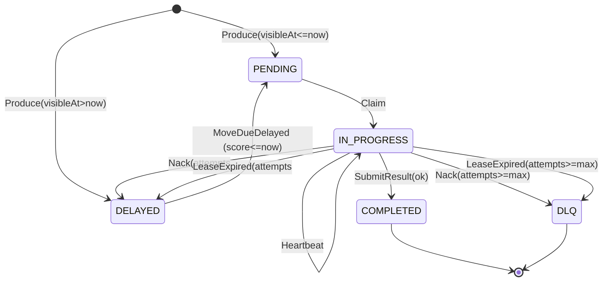
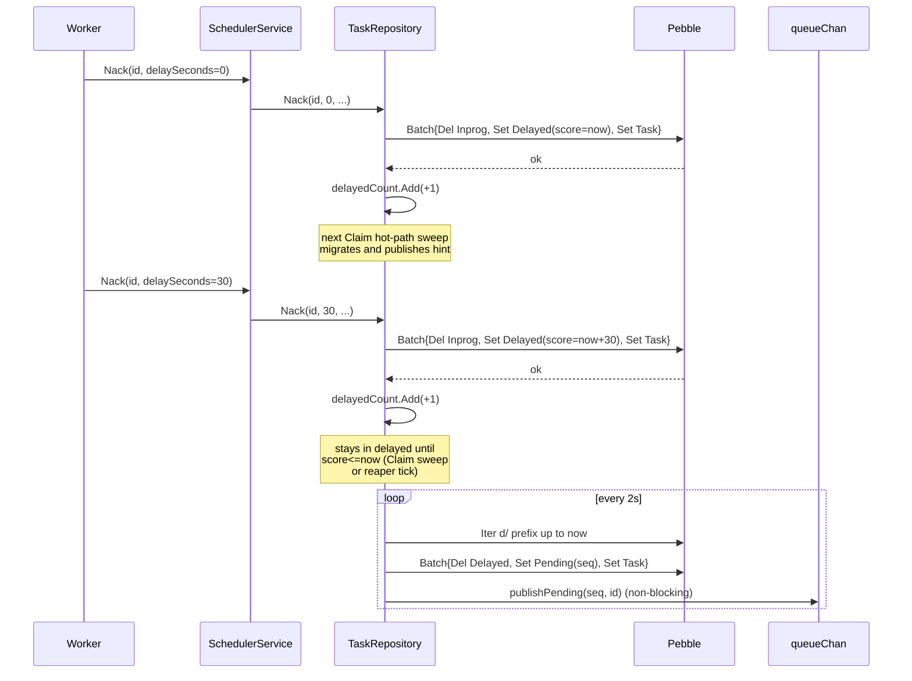

# Retry and backoff

codeq guarantees at-least-once delivery. Anything that can fail mid-flight
(worker crashes, lease expiries, explicit `Nack` calls) feeds back into the
same delayed queue, gets a backoff-computed wake-up time, and reappears in
the pending bucket once the score is due. After `maxAttempts` the task
lands in the DLQ marked `FAILED` with the originating reason; the system
never silently retries forever.

This page documents the Pebble-backed path; see
[Storage (Pebble)](./07b-storage-pebble.md) for the keyspace layout.

## Triggers

A retry fires when one of three things happens:

1. **Explicit Nack** — worker calls `POST /v1/codeq/tasks/:id/nack`. Body
   may carry `delaySeconds` (clamped to `backoffMaxSeconds`) and a free-text
   `reason`. Handler at
   [`internal/controllers/nack_task_controller.go`](../internal/controllers/nack_task_controller.go).
2. **Lease expiry, foreground** — `Claim` itself runs `requeueExpired`
   when its throttle (`reconcile.shouldRun`) fires.
   [`internal/repository/pebble/task_repository.go`](../internal/repository/pebble/task_repository.go)
   `requeueExpired`.
3. **Lease expiry, reaper** — background goroutine `sweepLeases` runs
   every 2s (default) per shard, snapshotting up to 256 expired entries
   from the in-memory lease table.
   [`internal/repository/pebble/reaper.go`](../internal/repository/pebble/reaper.go)
   `sweepLeases`.

All three paths funnel through `TaskRepository.Nack` (the reaper has its
own `requeueExpiredOne` that mirrors Nack but skips the ownership check —
see [Lease management](./06b-lease-management.md)). The `attempts` counter
increments on every Nack, not on every Claim, so a worker that
heartbeats and finishes a task only consumes one attempt.

## Task lifecycle



Transitions are labelled by the trigger, not the resulting state — see
[_STYLE.md § State machines](./_STYLE.md#state-machines). `Heartbeat` is a
self-loop on `IN_PROGRESS` that extends `leaseUntil` without touching
`attempts`.

## Delayed queue (Pebble)

The delayed bucket is a key range, not a literal ZSET. Each delayed task
writes one key under
`codeq/q/<cmd>/<tenant>/d/<be8 score>/<id>` where `score = visibleAt.Unix()`
encoded big-endian so byte-lexicographic iteration equals time order.
Constructor: `KeyDelayed` in
[`internal/repository/pebble/keys.go`](../internal/repository/pebble/keys.go).

Three pieces of in-memory state shadow this on-disk range:

| Field | Type | Purpose | Defined at |
|---|---|---|---|
| `delayedCount` | `sync.Map[string]*atomic.Int64` | Per-(cmd,tenant) counter; lets `MoveDueDelayed` skip the Pebble iter when there is nothing to move. | `task_repository.go:60` |
| `delayedMoveFlag` | `sync.Map[string]*atomic.Int32` | CAS single-flight for `moveDueDelayedForTenant`. Two concurrent claimers reading the same range would publish duplicate hints and race the in-progress bit. | `task_repository.go:70` |
| `queues` | `sync.Map[string]*queueChan` | Per-(cmd,tenant,prio) buffered channel of `pendingHint{seq,id}`. `MoveDueDelayed` publishes onto it after `CommitBatch`. | `task_repository.go:391` |

`delayedCount` is rebuilt at `Open` by `recoverDelayedCounts`
(`task_repository.go:500`) — a one-shot prefix scan of every `d/` segment
that increments the appropriate counter. Without this seed the first
post-restart claim would skip work that is already due.

`delayedMoveFlag` is a `CAS(0,1)` and not a mutex: concurrent claimers
that lose the CAS fall straight through to their channel pop instead of
blocking. The winner publishes hints; the losers consume them. Code
comment in `task_repository.go:1041-1051` explains the duplicate-claim
race the flag prevents.

## Nack with delaySeconds=0 vs >0

Both forms commit one batch (`Delete(KeyInprog)` + `Set(KeyDelayed)` +
`Set(KeyTask)`) and bump `delayedCount`. They differ only in whether the
next `Claim` finds the task immediately. With `delaySeconds=0` the score
equals `now`, so the next `Claim` (which calls `moveDueDelayedForTenant`
on its hot path, `task_repository.go:336`) migrates the task to pending
within microseconds. With `delaySeconds>0` the task waits in the delayed
bucket until either a `Claim` arrives after the score, or the reaper
ticks past it.



Note that the hot-path sweep is a property of the `Claim` call, not of
the producer. If there is no claimer, the task stays in the delayed
bucket forever — but the reaper goroutine in
[`reaper.go`](../internal/repository/pebble/reaper.go) only sweeps
**leases**, not the delayed bucket. There is currently no background
sweeper that promotes delayed→pending; promotion is driven by Claim. In
practice this is fine: a queue with no claimers has nothing to do.

## Reaper interaction

The reaper runs two independent loops per Pebble shard, both started by
`Reaper.Start` (`reaper.go:99`):

| Loop | Default interval | Default batch | Function |
|---|---|---|---|
| Lease sweep | 2s (`ReaperOptions.LeaseInterval`) | 256 (`LeaseBatch`) | `sweepLeases` — snapshots expired entries from the in-memory lease table, calls `requeueExpiredOne` per id. |
| TTL sweep | 30s (`TTLInterval`) | 512 (`TTLBatch`) | `sweepTTL` — drops aged-out `KeyTask` + `KeyTTLIndex` entries. |

`sweepLeases` only writes to the **delayed** bucket if `attempts <
maxAttempts`; otherwise it writes directly to DLQ with `error=LEASE_EXPIRED`.
The reaper is the only path that can move a task to DLQ without an
explicit Nack from the worker. Same backoff policy applies — see
[`reaper.go:172`](../internal/repository/pebble/reaper.go):

```go
delaySeconds := backoff.Compute(r.backoffPolicy, r.backoffBaseSeconds,
    r.backoffMaxSeconds, t.Attempts, nil)
```

The foreground `requeueExpired` (called from `Claim`) and the background
`sweepLeases` are not mutually exclusive. Either one can pick up a given
expired lease first; whoever loses observes the task already missing
from `KeyInprog` and drops the work silently.

Shards do not share a reaper. `StartReapersForShards` (`reaper.go:108`)
spawns one `Reaper` per `*DB`; sharing would serialise the sweeps and
undo the parallelism added in Phase 8.

## Backoff policies

`internal/backoff/backoff.go::Compute` returns a delay in seconds based
on `policy`, `baseSeconds`, `maxSeconds`, and the current `attempts`
counter:

| Policy | Formula | Notes |
|---|---|---|
| `fixed` | `min(base, max)` | Constant. |
| `linear` | `min(base * max(1, attempts), max)` | Linear ramp. |
| `exponential` | `min(base * 2^attempts, max)` | No jitter — thundering herd risk. |
| `exp_equal_jitter` | `half + rand(0..half+1)` where `half = min(base*2^attempts, max)/2` | Half the cap is always present, jitter on top. |
| `exp_full_jitter` (default) | `rand(0..min(base*2^attempts, max)+1)` | Full random in `[0, cap]`. Recommended. |

Defaults set in [`pkg/config/config.go`](../pkg/config/config.go) lines
382-390 and mirrored in `ReaperOptions` defaults
([`reaper.go:66`](../internal/repository/pebble/reaper.go)):

```yaml
backoffPolicy: exp_full_jitter
backoffBaseSeconds: 5
backoffMaxSeconds: 900
```

A request that supplies `delaySeconds > 0` skips the policy entirely; the
service clamps to `backoffMaxSeconds` and passes the value straight to
`Repo.Nack`. Service entry point: `schedulerService.NackTask`
([`internal/services/scheduler_service.go:243`](../internal/services/scheduler_service.go)).

> **Performance**: `exponential` (no jitter) saves a single `rand.Intn`
> call. The cost shows up as correlated retries — every task that nacked
> in the same millisecond will be due in the same millisecond and hit
> the next `Claim` together. Stick with `exp_full_jitter` unless you can
> prove the absence of correlation in your producers.

## MAX_ATTEMPTS → DLQ

`maxAttempts` is per task; if the task carries `0`, the repository falls
back to `maxAttemptsDefault` (config key `maxAttempts`, default 5 in
[`reaper.go:76`](../internal/repository/pebble/reaper.go) and config). On
every Nack:

1. `t.Attempts++` (`task_repository.go:952`).
2. Compare against `t.MaxAttempts`.
3. If `>=`, mark `Status=FAILED`, `LastKnownLocation=DLQ`,
   `Error=reason` (default `MAX_ATTEMPTS` if caller omitted it), write
   `KeyDLQ(cmd, tenant, id)`, delete `KeyInprog`, commit. Code path at
   `task_repository.go:955-987`.
4. Else compute `visibleAt = now + delaySeconds`, write
   `KeyDelayed(cmd, tenant, score, id)`, bump `delayedCount`. Code path
   at `task_repository.go:993-1019`.

The DLQ is terminal from the perspective of normal flow — there is no
automatic promotion back. Operators move DLQ tasks back to pending via
the admin endpoint (see [Operational runbooks](./29-operational-runbooks.md)).

## Tuning

For a queue with thousands of due-but-stale delayed tasks at any moment,
the per-Claim sweep can become a hot path. Two knobs:

- `inspectLimit` (default 200, passed to `Claim` by the controllers) caps
  how many delayed entries one `moveDueDelayedForTenant` call moves. The
  CAS flag means one in-flight sweep per (cmd, tenant), so increasing
  this value increases batch size but not concurrency.
- Reaper `LeaseInterval` — lower means faster requeue after a crashed
  worker, higher means less iteration overhead. 2s is the bench default;
  workloads with long-running tasks and long leases can go to 10s or 30s.

> **Note**: The reaper does not sweep the delayed bucket. If you set a
> long `delaySeconds` and there are no claimers, the task waits exactly
> that long — there is no early wake-up.

> **Warning**: Setting `backoffMaxSeconds` higher than your worker idle
> timeout means a re-driven task can re-enter the queue after every
> worker has unsubscribed. The task will sit in pending until a new
> claimer connects. This is at-least-once-as-designed, not a bug.

## See also

- [Queueing model](./05-queueing-model.md) — pending / delayed / inprog
  / DLQ bucket layout.
- [Lease management](./06b-lease-management.md) — in-memory lease table,
  heartbeats, expiry semantics.
- [Storage (Pebble)](./07b-storage-pebble.md) — key prefixes and batch
  commit path.
- [Configuration](./14-configuration.md) — `backoffPolicy`,
  `backoffBaseSeconds`, `backoffMaxSeconds`, `maxAttempts`.
- [Troubleshooting](./28-troubleshooting.md) — what to check when tasks
  stop being retried or get stuck in delayed.
