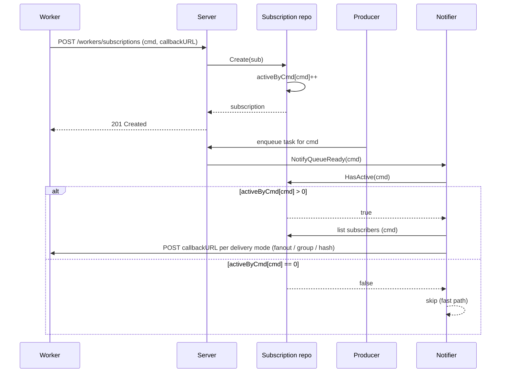
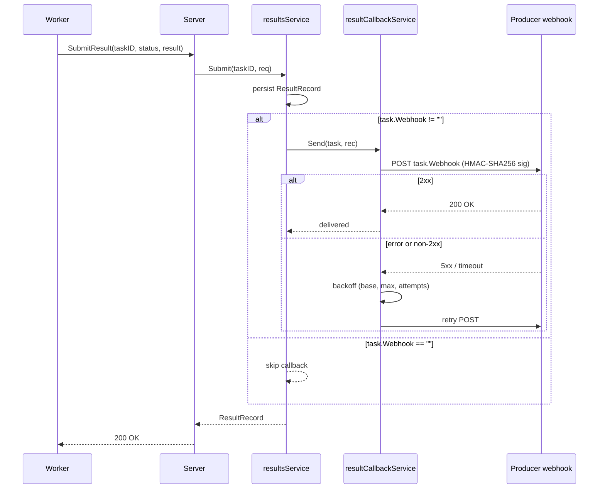
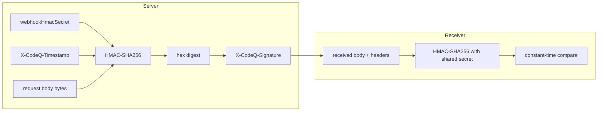

# Webhooks and push delivery

This document defines two independent webhook paths:

1. **Worker availability notifications** (push mode for workers)
2. **Result callbacks** (push mode for producers to avoid GET polling)

## 1) Worker availability notifications

Webhook notifications are advisory signals that work is available. They do not assign tasks and do not change task ownership. Workers must still claim tasks using the pull API.

### Subscription lifecycle

The producer hot path consults an in-memory `activeByCmd` atomic counter (`HasActive`) before scanning the subscription repo. When the counter is zero, `NotifyQueueReady` is a no-op — no Pebble iter, no HTTP fan-out. The diagram below maps the request flow end-to-end:



### Registration

Workers register a callback URL with an event type list. Registrations are stored with TTL and must be renewed. Registration is ephemeral and does not create a worker registry.

Recommended fields for subscriptions:

- `callbackUrl` (string, required)
- `eventTypes` (array, optional): subset of token `eventTypes`
- `ttlSeconds` (int, optional): default 300
- `deliveryMode` (string, optional): `fanout|group|hash`
- `groupId` (string, optional): required when `deliveryMode=group`. If the worker token includes `workerGroup`, the request `groupId` must match it.
- `minIntervalSeconds` (int, optional): rate limit per subscription, default 5

### Delivery modes

### fanout

Notify every active subscription that matches the event type. This maximizes wake-ups and is suitable for small worker fleets.

### group

Notify exactly one subscriber per `groupId` and event type. Selection uses round-robin over active subscribers in that group. This avoids thundering herd when multiple worker instances belong to the same service pool. If `workerGroup` is present in the token, it is the authoritative group id.

### hash

Notify a deterministic subscriber chosen by a time-bucketed index over the active subscription list. This provides simple routing without stateful round-robin, at the cost of uneven distribution when the subscriber set changes.

## Defaulting rules

- If the worker token includes `workerGroup`, `deliveryMode` defaults to `group` and `groupId` defaults to `workerGroup`.
- If `deliveryMode` is omitted, it defaults to `fanout`.
- If `deliveryMode=group` and `groupId` cannot be resolved, the request is rejected with `400`.

### Notification payload

```json
{
  "eventType": "generate_master",
  "available": true,
  "queueDepth": 42,
  "claimUrl": "/v1/codeq/tasks/claim",
  "sentAt": "2026-01-25T13:00:00Z",
  "notificationId": "ntf-2c6c3b2a"
}
```

`queueDepth` is advisory. Workers must rely on claim response for correctness.

### Trigger conditions

Notifications are sent when:

- a task transitions to ready in an empty queue
- a delayed task becomes ready
- a requeued task makes the queue non-empty

Notifications are best-effort and not retried by default.

### Multiple worker instances

Recommended patterns:

1. Load-balanced callback URL with `deliveryMode=fanout`. The worker fleet self-balances.
2. Per-instance subscriptions with the same `groupId` and `deliveryMode=group` for one wake-up per pool.

Because the notification is advisory, duplicate signals do not affect correctness. Use `minIntervalSeconds` to reduce bursty notifications.

### Security

Notifications include:

- `X-CodeQ-Timestamp`: Unix epoch seconds
- `X-CodeQ-Signature`: HMAC-SHA256 over `timestamp + '.' + body`

Workers must reject stale timestamps and invalid signatures.

When OpenTelemetry tracing is enabled, notifications also include W3C trace context headers:

- `traceparent`
- `tracestate` (optional)

## 2) Result callbacks

Result callbacks are used to avoid polling `GET /tasks/:id/result`. They are triggered when a task reaches a terminal state (`COMPLETED` or `FAILED`).

### Callback flow

After the worker submits a result, `resultsService.Submit` persists the record and then invokes `s.callback.Send(task, rec)` — if `task.Webhook` is non-empty. The callback service POSTs the JSON payload to the URL with the HMAC signature headers, then retries on transport or non-2xx errors.

Additionally, `BatchSubmit` (for batched result submissions), `NackTask` (when max attempts is exhausted), and the `Reaper` (on lease expiry leading to DLQ) also invoke callbacks to ensure producers receive terminal-state notifications across all result paths:



### Registration

Result callbacks are configured per task at creation time using the `webhook` field. The callback URL is stored in the task record. For applications that require streaming updates, a WebSocket or SSE gateway can consume these callbacks and forward them to clients.

### Payload

```json
{
  "taskId": "a5a4d2ad-5f7e-4a55-a070-29a9a4c2a8f4",
  "eventType": "render_video",
  "status": "COMPLETED",
  "result": {"ok": true},
  "error": "",
  "artifacts": [{"name":"out.json","url":"https://..."}],
  "completedAt": "2026-01-25T13:05:00Z"
}
```

### Delivery guarantees

Callbacks are best-effort and at-least-once. Consumers must de-duplicate by `taskId`.

### Retry policy

If the callback fails, codeQ retries using an exponential backoff:

- `resultWebhookMaxAttempts` (default 5)
- `resultWebhookBaseBackoffSeconds` (default 2)
- `resultWebhookMaxBackoffSeconds` (default 60)

### Security

Result callbacks include the same signature headers used by worker notifications:

- `X-CodeQ-Timestamp`
- `X-CodeQ-Signature` (HMAC-SHA256 over `timestamp + '.' + body`)

Producers must reject stale timestamps and invalid signatures.

When OpenTelemetry tracing is enabled, result callbacks also include W3C trace context headers:

- `traceparent`
- `tracestate` (optional)

## 3) HMAC signature pipeline

Both paths share the same signature scheme. The server is configured with a single `webhookHmacSecret` ([`pkg/config/config.go`](../pkg/config/config.go) — required when webhooks are enabled). For every outbound request, the server takes the raw JSON body, computes HMAC-SHA256 over `timestamp + "." + body`, hex-encodes the digest, and sets it as `X-CodeQ-Signature` alongside `X-CodeQ-Timestamp`. The receiver re-hashes the body with the same shared secret to verify.



The signed message is `timestamp + "." + body`, not the body alone — this prevents replay of a valid signature with a stale timestamp. Receivers must reject requests where `now - X-CodeQ-Timestamp` exceeds their tolerance window (typical: 5 minutes).

## See also

- [Result storage and callbacks](./38-result-storage-callbacks.md) — terminal-state persistence and the callback service in detail.
- [Security](./09-security.md) — token model, transport security, and signature verification.
- [HTTP API](./04-http-api.md) — subscription endpoints, task creation with `webhook`, and result submission.
- [Performance tuning](./17-performance-tuning.md) — rate-limit buckets and notifier fast-path behaviour.
