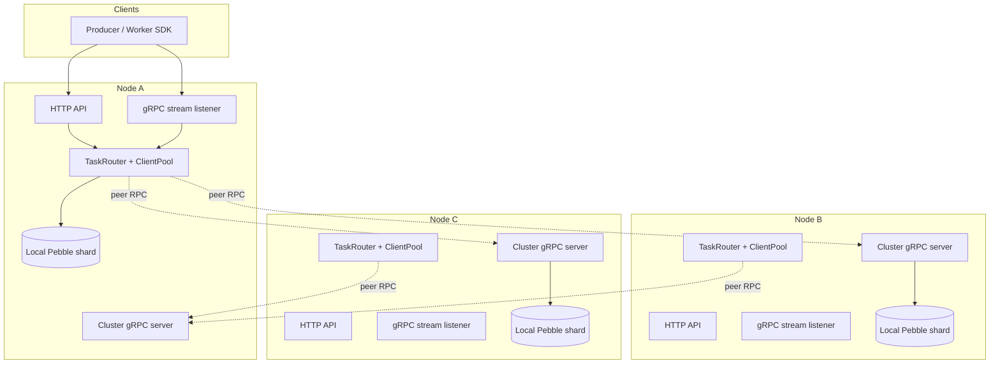
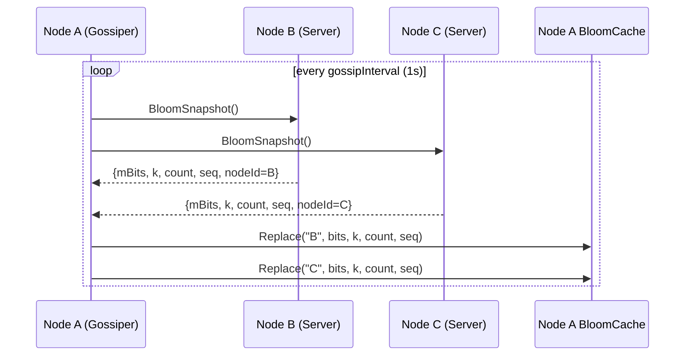
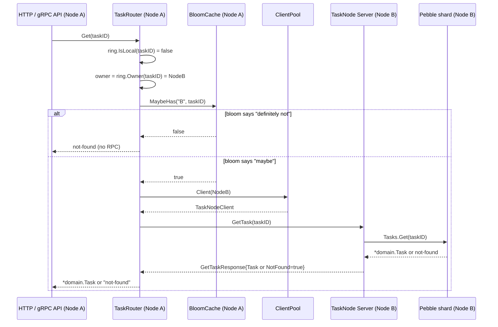

# Cluster gRPC protocol

This is the reference for `internal/cluster/proto/clusterpb.proto` — the
internal wire protocol codeq nodes speak to each other in cluster mode.

> **Note**: this is **not** a client SDK protocol. Producers and workers
> still speak the public HTTP and gRPC stream APIs documented in
> [04-http-api](./04-http-api.md) and [34-streaming-api-guide](./34-streaming-api-guide.md).
> The surface described here is only reachable on the cluster-internal
> network, between codeq nodes.

See [_STYLE.md § Value proposition](./_STYLE.md#1-value-proposition) for
the broader product context.

## 1. What this is

`clusterpb` is a single gRPC service — `TaskNode` — that lets one codeq
node delegate ID-routed work (Enqueue, GetTask, Heartbeat, SaveResult,
etc.) and fan-out aggregates (Claim, PendingLength, AdminQueues) to its
peers. Membership is static: every node knows the full peer list at
startup from config and dials lazily on first use.

The protocol is intentionally minimal:

- Operations that already know a task ID resolve the owner via consistent
  hash (`Ring.Owner(id)`) and call that one peer directly.
- Operations that do not (a worker asking "is there work for me?") get
  fanned out to every node by the caller — the server side handles only
  its own local shard.
- A separate `BloomSnapshot` RPC lets nodes gossip a bloom of locally-
  stored IDs so the router can skip the gRPC entirely for IDs that are
  definitely not on a given peer.

Source files cited throughout:

- [`internal/cluster/proto/clusterpb.proto`](../internal/cluster/proto/clusterpb.proto)
- [`internal/cluster/server.go`](../internal/cluster/server.go)
- [`internal/cluster/router.go`](../internal/cluster/router.go)
- [`internal/cluster/ring.go`](../internal/cluster/ring.go)
- [`internal/cluster/bloom.go`](../internal/cluster/bloom.go)
- [`internal/cluster/bloom_cache.go`](../internal/cluster/bloom_cache.go)
- [`internal/cluster/client.go`](../internal/cluster/client.go)

## 2. Topology

Every node runs three listeners on the wire and one `TaskNode` server
internally. The cluster-internal traffic is the bottom plane; client
SDKs never touch it.



Cluster mode and intra-process sharding (`numShards > 1`) are mutually
exclusive — startup panics if both are enabled. See
[05-cluster-architecture](./05-cluster-architecture.md) for the
deployment model.

## 3. RPC catalog

Every RPC is defined in
[`internal/cluster/proto/clusterpb.proto`](../internal/cluster/proto/clusterpb.proto).
Server handlers live in
[`internal/cluster/server.go`](../internal/cluster/server.go); the
router that decides local-vs-remote lives in
[`internal/cluster/router.go`](../internal/cluster/router.go).

### 3.1 ID-routed RPCs

The caller hashes the task ID, resolves the owner via `Ring.Owner`, and
either calls the local Pebble repo (if `IsLocal`) or dials the owner
peer via `ClientPool.Client(owner)`.

| RPC | Request | Response | When called | Caller code path |
|---|---|---|---|---|
| `Enqueue` | `EnqueueRequest` | `EnqueueResponse` | Producer hot path. The router pre-picks the ID via `LocalRing.GenerateLocalID` to bias toward local ownership (Phase 5). | `TaskRouter.EnqueueWithReady` |
| `GetTask` | `GetTaskRequest` | `GetTaskResponse{Task, NotFound}` | HTTP `GET /tasks/:id`, scheduler lookups, controllers. | `TaskRouter.Get`, `ResultRouter.GetTask` |
| `Heartbeat` | `HeartbeatRequest` | `HeartbeatResponse{NotFound, NotOwner}` | Worker keeping its lease alive. | `TaskRouter.Heartbeat` |
| `Abandon` | `AbandonRequest` | `AbandonResponse{NotFound, NotOwner, NotInProgress}` | Worker releases a task back to pending. | `TaskRouter.Abandon` |
| `Nack` | `NackRequest` | `NackResponse{AppliedDelaySeconds, Dlq, NotFound, NotOwner, NotInProgress}` | Worker reports a failure with optional retry delay. | `TaskRouter.Nack` |
| `SaveResult` | `SaveResultRequest{Record, Command, TenantId}` | `SaveResultResponse{NotFound}` | Worker submits a result; `UpdateOnComplete` follows. | `ResultRouter.SaveResult` |
| `GetResult` | `GetResultRequest` | `GetResultResponse{Record, NotFound}` | HTTP `GET /tasks/:id/result`. Cross-node routed if hash points away. | `ResultRouter.GetResult` |
| `UpdateOnComplete` | `UpdateOnCompleteRequest` | `UpdateOnCompleteResponse{NotFound}` | Worker finalises a task (COMPLETED / FAILED / DLQ). | `ResultRouter.UpdateTaskOnComplete` |

Owner-resolution is identical for all of them:

```go
if r.ring.IsLocal(taskID) {
    return r.local.<Op>(ctx, taskID, ...)
}
owner := r.ring.Owner(taskID)
if !r.peerHasLikely(owner.ID, taskID) {
    return errors.New("not-found")  // bloom short-circuit
}
c, _ := r.pool.Client(owner)
return c.<Op>(ctx, &clusterpb.<Op>Request{...})
```

Response flags (`NotFound`, `NotOwner`, `NotInProgress`) are translated
back into the same string sentinels (`"not-found"`, `"not-owner"`,
`"not-in-progress"`) the rest of the codebase already inspects. We
encode them as fields rather than gRPC status codes so callers can
distinguish them without unwrapping status messages.

### 3.2 Scatter-gather RPCs

The caller (`TaskRouter`) broadcasts to every peer in parallel via
`ClientPool.CallEach` and either picks the first non-empty winner
(Claim) or sums the responses (length / stats / admin).

| RPC | Request | Response | Aggregation | Caller code path |
|---|---|---|---|---|
| `LocalClaim` | `LocalClaimRequest{WorkerId, Commands, LeaseSeconds, InspectLimit, MaxAttemptsDefault, TenantId}` | `LocalClaimResponse{Task, Empty}` | First non-empty wins; remaining calls cancelled via `context.WithCancel`. | `TaskRouter.Claim` |
| `PendingLength` | `PendingLengthRequest{Command}` | `PendingLengthResponse{Length}` | Sum across nodes. | `TaskRouter.PendingLength` |
| `QueueStats` | `QueueStatsRequest{Command, TenantId}` | `QueueStatsResponse{Ready, Delayed, InProgress, Dlq}` | Field-wise sum. | `TaskRouter.QueueStats` |
| `AdminQueues` | `AdminQueuesRequest{}` | `AdminQueuesResponse{Counts map<string,int64>}` | Map merge: per-key sum. | `TaskRouter.AdminQueues` |

`Claim` queries the local Pebble shard first (synchronously, no gRPC)
and only fans out to peers when the local shard returns empty. With
producer-local IDs (see §6) the local shard is usually non-empty for
the worker pool co-located with the producers, so most claims never
touch the network.

### 3.3 Bloom gossip

| RPC | Request | Response | Purpose |
|---|---|---|---|
| `BloomSnapshot` | `BloomSnapshotRequest{}` | `BloomSnapshotResponse{MBits, NumHashes, NumItems, Sequence, NodeId}` | Polled by `Gossiper.pollAll` once per second; replaces the local `BloomCache` entry for the responding peer. |

See §4 for the gossip flow.

## 4. Bloom gossip

Each node maintains a local `*Bloom` of every task ID it currently holds
in its Pebble shard. `Bloom.Add` is called on the Enqueue success path
in both `Server.Enqueue` and `TaskRouter.EnqueueWithReady` (whichever
landed on the local node). The filter is concurrent-safe via
`atomic.OrUint64` on the bit-word slice and exposes a `Snapshot()`
method that serialises the bits to little-endian bytes plus the
parameters `(k, count, seq)`.

A `Gossiper` (one goroutine per node) polls every peer once per
`gossipInterval` (default 1s). The poll runs as a scatter-gather
`BloomSnapshot` call, and each response is restored into the
`BloomCache` keyed by `NodeId`.



Replace is no-op if the incoming `seq` is older than the cached one, so
out-of-order responses don't poison the cache. Bloom shape
(`expectedItems`, `fpRate`) is uniform across the cluster — mismatched
sizes are silently rejected by `Bloom.Restore`, which makes rolling
reconfigurations safe.

> **Note**: gossip is **purely an optimisation**. If a peer has not yet
> gossiped (`BloomCache.MaybeHas` returns `true` for an unknown peer),
> the router falls back to the gRPC call. The bloom never produces a
> false negative for the writer node — `Bloom.Add` is on the same code
> path as the local Pebble write — but a peer's bloom can lag by up to
> `gossipInterval` for IDs that were just enqueued elsewhere.

## 5. Routing rules: a cross-node GetTask

The router calls `r.ring.IsLocal(taskID)` first. If false, it consults
`BloomCache.MaybeHas(owner, taskID)` and short-circuits to `not-found`
when the bloom says definitely not. Otherwise it dials the owner.



The bloom is checked on **every** ID-routed RPC that has to leave the
local node — not just GetTask. Heartbeat, Abandon, Nack, GetResult, and
SaveResult-when-the-task-isn't-here all go through `peerHasLikely`.

## 6. Phase 5: producer-local IDs

In Phase 4 every Enqueue picked a UUID with random hash placement.
Across N nodes that meant `(N-1)/N` of all `Enqueue` calls forwarded to
a peer — for a 4-node cluster, 75% of creates paid a gRPC RTT before
hitting durable storage.

Phase 5 introduced `LocalRing.GenerateLocalID` ([`internal/cluster/ring.go`](../internal/cluster/ring.go)):

```go
func (l *LocalRing) GenerateLocalID(genID func() string) string {
    const maxTries = 64
    for range maxTries {
        id := genID()
        if l.IsLocal(id) {
            return id
        }
    }
    return genID()  // statistical fallback
}
```

With a uniformly distributed 256-vnode ring, the expected number of
candidate UUIDs before one hashes to the local node is `N` (one per
cluster node). On a 4-node cluster that's an average of ~4 calls to
`uuid.NewString` — negligible compared to the gRPC RTT it eliminates.

`TaskRouter.EnqueueWithReady` calls `GenerateLocalID` before deciding
local-vs-remote, so the local-branch is now hit on essentially every
producer call:

```go
id := r.ring.GenerateLocalID(uuid.NewString)
if r.ring.IsLocal(id) {
    // hot path: no gRPC
    return r.local.EnqueueWithID(ctx, id, ...)
}
// fallback: still correct, just rare
owner := r.ring.Owner(id)
c, _ := r.pool.Client(owner)
return c.Enqueue(ctx, &clusterpb.EnqueueRequest{Id: id, ...})
```

Net effect on the cluster profile: the cross-node `Enqueue` count went
from ~75% of creates to under 1% in our 4-node bench. The Claim fast
path (already local-first) benefits as well — work produced on a node
is overwhelmingly stored on the same node, so the same node's worker
pool finds it without scatter-gather.

## 7. Error handling

The cluster has three classes of failures and one each of corresponding
behaviour:

### 7.1 Dial failure

`ClientPool.Client(node)` calls `grpc.NewClient` lazily on first use. A
dial failure returns `fmt.Errorf("dial %s (%s): %w", node.ID, node.GRPCAddr, err)`
and the calling router propagates it to the caller. The connection is
**not** cached, so the next call retries.

ID-routed RPCs fail loud — the producer or worker sees the error and
applies its own retry policy. Scatter-gather RPCs swallow per-node
errors and continue with the remaining responses:

```go
for _, res := range results {
    if res.Err != nil {
        continue  // best-effort aggregate
    }
    // accumulate res.Value
}
```

### 7.2 Peer down (context timeout)

gRPC clients honour the caller's `context.Context` deadline. The HTTP
handler that invoked the router typically wraps a per-request timeout
(see [10-operations](./10-operations.md) for the timeout matrix).
A peer that stops responding shows up as a `context.DeadlineExceeded`
on the router side; same handling as a dial failure.

For scatter-gather, the router uses `context.WithCancel(ctx)` so that
once a winner is selected (Claim) the remaining in-flight RPCs get
their context cancelled and stop waiting. Without that, a slow peer
would block the response on the fastest one.

### 7.3 Serialization errors

The wire types in `clusterpb.proto` are intentionally narrow:

- Task payloads travel as `bytes` (the producer-side JSON, opaque to the
  proto layer).
- Result bodies travel as `bytes result_json` — same shape — and are
  unmarshalled lazily by `decodeResultJSON` on the receiver side.
  Malformed JSON yields an empty `Result` map and the rest of the
  record still propagates.
- Timestamps use `google.protobuf.Timestamp`; zero values map to nil on
  the wire and `time.Time{}` on the receiving side.

There is no schema versioning yet — the cluster assumes a uniform
binary across nodes. Rolling upgrades work as long as no proto field is
deleted between adjacent versions; new fields are additive and
proto3-default for older readers.

## 8. Adding a new RPC

The full path, in order:

1. Add the request/response messages and `rpc` line to
   [`internal/cluster/proto/clusterpb.proto`](../internal/cluster/proto/clusterpb.proto).
   Decide upfront whether it's ID-routed (one peer) or scatter-gather
   (every peer + aggregator).
2. Re-run codegen (`make proto` or the project's `buf generate`
   equivalent) to refresh `clusterpb.pb.go` and `clusterpb_grpc.pb.go`.
3. Implement the server-side handler on `*Server` in
   [`internal/cluster/server.go`](../internal/cluster/server.go) —
   purely against the local Pebble repo, no fan-out.
4. Implement the routing decision in
   [`internal/cluster/router.go`](../internal/cluster/router.go) (or
   `result_router.go` for the result side):
   - ID-routed: `IsLocal` check, bloom short-circuit, `pool.Client`,
     translate response flags to error sentinels.
   - Scatter-gather: `pool.CallEach`, aggregate results.
5. Cover both branches in `router_test.go` — there's a bufconn-based
   harness that spins up a fake peer.
6. Update this doc's catalog table.

## See also

- [Cluster architecture](./05-cluster-architecture.md) — deployment
  model, membership, failover.
- [Sharding](./06-sharding.md) — intra-process shards (the mutually
  exclusive alternative to cluster mode).
- [Pebble sharding internals](./08b-pebble-sharding-internals.md) —
  what each shard stores and how the local repo is structured.
- [Queue sharding HLD](./24-queue-sharding-hld.md) — the higher-level
  design doc this protocol implements.
