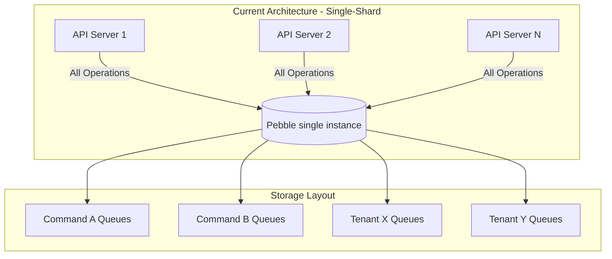
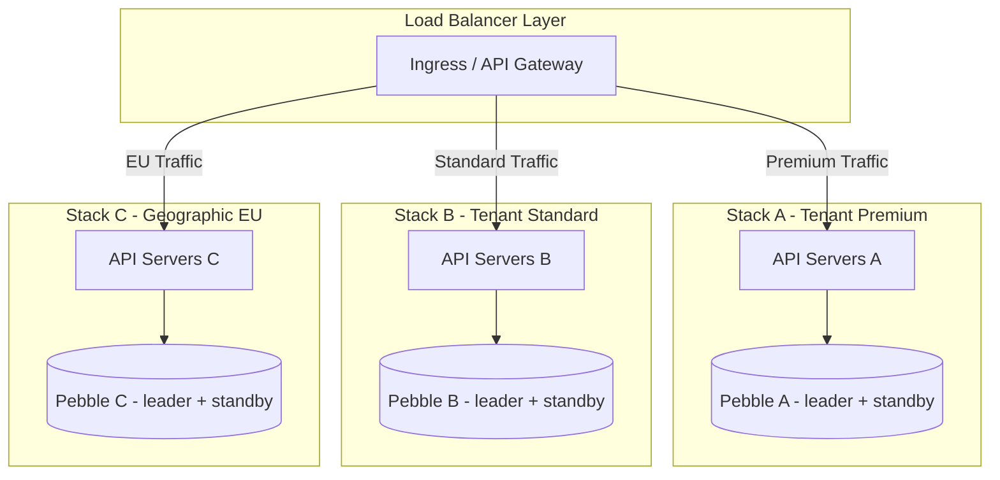
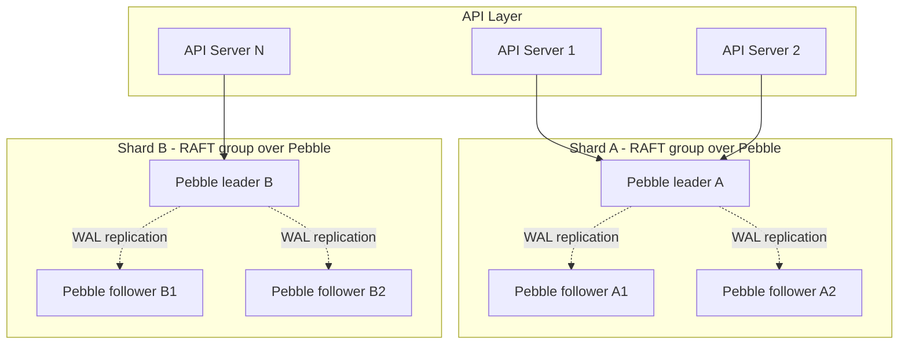

# High-Level Design and RFC: Queue Sharding for Horizontal Scaling

## Executive Summary

This document presents the design for implementing queue sharding in codeq to enable horizontal scaling beyond single-node Pebble deployments. The current single-process architecture creates a scaling ceiling; the system requires a mechanism to distribute queue data across multiple Pebble nodes while preserving task scheduling, lease management, and at-least-once delivery guarantees.

The design introduces explicit sharding through a pluggable ShardSupplier interface that maps commands to storage backends, balancing predictable routing with flexibility for evolving operational requirements. The design addresses Pebble batch atomicity, key colocation for atomic operations, and migration paths from the single-shard architecture.

**Design choice**: We've selected a combined approach that leverages explicit sharding (via ShardSupplier) on top of a consistent-hash ring across Pebble nodes, with a path toward RAFT-based consensus for strong consistency and automatic failover. This matches our requirements for horizontal scalability, operational flexibility, and high availability. The implementation follows a phased approach: near-term explicit sharding with independent Pebble backends (Phase 5 cluster mode, enabling immediate scaling), evolving toward RAFT-backed consensus storage as the primary persistence layer for production deployments requiring strong consistency guarantees.

We considered an alternative architectural path — evolving the plugin architecture to decouple persistence from any specific engine — and shipped the Pebble + consistent-hash ring design instead. That alternative is preserved at the end of the document as historical context for organizations with diverse storage requirements (Cassandra, HBase, TiKV).

## Problem Statement and Current Limitations

### Architecture Overview

The codeq service operates as a Go process orchestrating persistent queues in an embedded Pebble LSM (the RocksDB-style engine from CockroachDB). The system maintains four queue structures per command and tenant: pending list, delayed sorted set, in-progress set, and dead-letter set, materialized as keyspace prefixes inside Pebble.

The current implementation targets a single Pebble instance per process. Queue keys use tenant identifiers for isolation (`codeq:q:{command}:{tenantID}:{queue-type}:{priority}`), providing logical partitioning without physical distribution.


```mermaid
graph TB
  subgraph Current[Current Architecture - Single-Shard]
    API1[API Server 1]
    API2[API Server 2]
    API3[API Server N]
    PEB[(Pebble single instance)]

    API1 -->|All Operations| PEB
    API2 -->|All Operations| PEB
    API3 -->|All Operations| PEB
  end

  subgraph Layout[Storage Layout]
    PEB --> Q1[Command A Queues]
    PEB --> Q2[Command B Queues]
    PEB --> Q3[Tenant X Queues]
    PEB --> Q4[Tenant Y Queues]
  end
```

### Scaling Constraints

The single-process architecture encounters fundamental limitations:

**Storage Capacity**: A single Pebble instance is bounded by host disk capacity. Multi-billion task workloads with 30-day retention exhaust available storage on the largest instance types.

**CPU Saturation**: A single Pebble process saturates the cores on its host once the full create → claim → complete cycle drives the LSM hard. Within a process, intra-process sharding (`numShards > 1`) reclaims headroom (see [§ Performance baselines](./30-performance-baselines.md)), but across processes vertical scaling shows diminishing returns due to contention on the WAL and block cache.

**Memory Pressure**: Pebble block cache size impacts query latency. Growing working sets degrade cache hit ratios without proportional memory scaling.

**Network Bandwidth**: 10K req/sec at 5KB average payload requires ~400 Mbps sustained. Bursty traffic patterns consume available headroom.

**Operational Risk**: Single point of failure. A single Pebble process loses availability while it restarts; recovery is fast (in-memory lease table rebuilt from the `KeyInprog` scan at Open) but not instantaneous.

### Horizontal Scaling Requirements

Sharding must satisfy:

- **Deterministic routing**: Given command and tenant ID, consistently select the same Pebble node across all API servers and over time (consistent-hash ring).
- **Tenant isolation**: Maintain separation even when colocated on the same physical shard.
- **Atomic operations**: Preserve atomicity within a single command queue. The claim path relies on a single Pebble batch covering the pending-list pop and the in-progress write, which means all queue structures for a (command, tenant) pair must live on the same shard.
- **Backward compatibility**: Support single-process deployments as a single-shard configuration.

## Sharding Strategy Evaluation

### Hash-Based Sharding

Applies hash function to (command, tenant) composite key, mapping to one of N shards. Provides automatic load balancing and deterministic routing.

**Pros**: Automatic distribution, no manual assignment, consistent hashing minimizes rehashing.

**Cons**: Opaque distribution complicates troubleshooting, potential hotspots from unaware load distribution, complex rebalancing when adding/removing shards.

### Range-Based Sharding

Partitions key space into contiguous ranges (e.g., command names 'A-M' on shard 1, 'N-Z' on shard 2).

**Pros**: Predictable data locality, related commands can be colocated.

**Cons**: Risk of uneven distribution if keys aren't uniformly distributed, rigid coupling to key structure, disruptive rebalancing.

### Explicit Sharding (Chosen Approach)

Delegates routing to pluggable ShardSupplier component. Configuration maps commands/tenants to named shards.

**Pros**: Maximum operational control, deliberate placement of high-traffic commands, supports gradual rollout, flexible routing strategies without code changes.

**Cons**: Requires manual mapping maintenance, configuration synchronization across API servers.

**Why chosen**: Aligns with providing mechanisms rather than policies. Organizations start with simple static mappings, evolve toward sophisticated strategies as needed. Hash/range-based routing can be implemented as alternative ShardSupplier implementations.

## Proposed Architecture

### ShardSupplier Interface

The ShardSupplier interface defines the contract for shard resolution. It provides two methods: QueueShards returns the complete list of shard identifiers where a command's queues may exist, while CurrentShard returns the specific shard to use for new enqueue and claim operations.

```go
// ShardSupplier provides shard routing for queue operations.
// Implementations must be thread-safe and deterministic.
type ShardSupplier interface {
    // QueueShards returns all shard identifiers where queues for this command may exist.
    // Used for operations that must inspect multiple shards, such as queue stats aggregation.
    // Returns an empty slice if the command is not recognized, which should be treated as
    // routing to the default shard.
    QueueShards(ctx context.Context, command string, tenantID string) ([]string, error)
    
    // CurrentShard returns the shard identifier to use for enqueue and claim operations.
    // Must return a stable, deterministic value for a given command-tenant pair.
    // All API server instances must return identical values for the same input.
    CurrentShard(ctx context.Context, command string, tenantID string) (string, error)
}
```

The separation between QueueShards and CurrentShard addresses a critical operational requirement: the ability to migrate commands between shards without losing visibility of existing tasks. During a migration, QueueShards returns both the old and new shard identifiers, while CurrentShard returns only the new shard. This allows workers to continue processing tasks from the old shard while new enqueues flow to the new shard. Once the old shard drains, the operator updates the configuration to remove it from QueueShards.

Thread safety is essential because the ShardSupplier is shared across concurrent HTTP request handlers. Implementations must use appropriate synchronization primitives or immutable data structures. The interface does not define configuration reload behavior, leaving it to specific implementations to decide whether to support dynamic reconfiguration or require process restart.

### Static Configuration Implementation

The initial implementation provides a StaticShardSupplier that reads mappings from a YAML configuration file. This satisfies the majority of deployment scenarios without introducing dependencies on external configuration services.

```yaml
sharding:
  enabled: true
  defaultShard: "primary"
  
  # Explicit command-to-shard mapping
  commandMappings:
    GENERATE_MASTER: "workload-heavy"
    GENERATE_CREATIVE: "workload-heavy"
    SEND_EMAIL: "notification"
    PROCESS_WEBHOOK: "notification"
  
  # Tenant override: specific tenants can route to dedicated shards
  tenantOverrides:
    "tenant-premium-abc": "premium-shard"
    "tenant-premium-xyz": "premium-shard"
```

The configuration supports three layers of routing precedence. Tenant overrides take highest priority, allowing specific tenants to be isolated on dedicated shards regardless of command type. Command mappings apply when no tenant override exists, routing all tasks for a command to a designated shard. The default shard handles any command-tenant pair not covered by the previous rules.

This structure supports common deployment patterns. A premium tier customer might receive dedicated shard capacity, ensuring their workload does not compete with free tier users. Commands with dramatically different resource profiles can be separated: lightweight email notifications on one shard, compute-intensive model generation on another.

The StaticShardSupplier loads configuration at startup and treats it as immutable. Changes require a process restart or a rolling deployment. While this limits flexibility compared to dynamic configuration systems, it eliminates entire classes of failure modes related to configuration propagation and ensures all API server instances have a consistent view.

### Storage Backend Mapping

Each shard identifier maps to a distinct Pebble node (a codeq process owning its own embedded Pebble instance). Routing across nodes uses a consistent-hash ring keyed on (command, tenantID) — see [Cluster mode](./13-cluster.md). The mapping is defined in the service configuration:

```yaml
pebble:
  shards:
    primary:
      address: "codeq-primary.internal:7070"
      poolSize: 20

    workload-heavy:
      address: "codeq-heavy.internal:7070"
      poolSize: 30

    notification:
      address: "codeq-notification.internal:7070"
      poolSize: 15

    premium-shard:
      address: "codeq-premium.internal:7070"
      poolSize: 25
```

Each shard configuration includes connection parameters (gRPC endpoint) and a dedicated connection pool. The pool size can be tuned independently for each shard based on expected load. High-throughput shards receive larger pools to support greater concurrency.

The TaskRepository implementation maintains a map of shard identifiers to per-node gRPC client instances. Operations that require shard selection first invoke the ShardSupplier to determine the target shard, then retrieve the corresponding client from the map.

```go
type shardedTaskRepository struct {
    shardSupplier ShardSupplier
    nodeClients   map[string]*cluster.NodeClient
    // ... other fields
}

func (r *shardedTaskRepository) Enqueue(ctx context.Context, cmd domain.Command,
    tenantID string, payload string, priority int, ...) (*domain.Task, error) {

    // Determine target shard
    shardID, err := r.shardSupplier.CurrentShard(ctx, string(cmd), tenantID)
    if err != nil {
        return nil, fmt.Errorf("shard resolution: %w", err)
    }

    // Get gRPC client for the Pebble node hosting this shard
    client, ok := r.nodeClients[shardID]
    if !ok {
        return nil, fmt.Errorf("unknown shard: %s", shardID)
    }

    // Perform enqueue operation on the resolved shard
    // ... implementation continues
}
```

This architecture maintains the existing TaskRepository interface unchanged. The sharding logic is encapsulated within the repository implementation, leaving the service layer agnostic to the distribution strategy. This separation of concerns simplifies testing and allows the service logic to evolve independently of sharding concerns.

### Key Format Evolution

Queue key names must incorporate the shard identifier to support migration scenarios and operational visibility. The proposed format extends the existing pattern:

```
codeq:q:<command>:<tenantID>:s:<shardID>:<queue-type>:<priority>
```

The `:s:<shardID>` segment is inserted after the tenant identifier. For backward compatibility with single-shard deployments, the shard segment is omitted when the shard identifier is "default" or empty. This allows existing deployments to upgrade without data migration.

```text
# Legacy single-shard key (still supported)
codeq:q:GENERATE_MASTER:tenant-123:pending:5

# New multi-shard key
codeq:q:GENERATE_MASTER:tenant-123:s:workload-heavy:pending:5
```

The placement of the shard segment after the tenant identifier is deliberate. The consistent-hash router keys on the prefix `(command, tenantID)`, so all queue structures for a (command, tenant) pair land on the same Pebble node, and within that node share the same key prefix in the LSM. Iteration over the pending list and the in-progress set therefore stays cheap (locality on adjacent SSTable blocks) and a single Pebble batch covering both keys remains atomic at the engine level.

We considered Redis-style hash-tagged keys (forcing all keys for a tuple into the same hash slot on Redis Cluster) when we evaluated a Redis-protocol backend. We shipped Pebble + consistent-hash ring instead, so hash tags do not appear in the production key format. The shard segment alone is sufficient because Pebble batches cover any set of keys local to a single process; there is no cross-slot constraint to defend against.

### Atomicity and Pebble Batch Implications

The claim operation's atomicity relies on a single Pebble batch that pops the head of the pending list and writes the in-progress marker as one commit. Pebble guarantees that all writes in a batch are visible together or not at all; this is the engine-level analogue of an atomic CAS sequence. Atomicity is guaranteed within a single Pebble instance but cannot span multiple instances without distributed transaction coordination.

The proposed sharding architecture preserves atomicity by ensuring all queue structures for a single command-tenant pair reside on the same shard (the same Pebble node). The ShardSupplier returns a single shard identifier for CurrentShard, and all enqueue and claim operations for that command-tenant pair target the same shard. The batch continues to operate on keys within the same Pebble instance, maintaining atomicity.

```go
// Claim path (illustrative): single Pebble batch covers pop + in-progress write
batch := db.NewBatch()
defer batch.Close()

taskID, ok := popPendingHead(batch, pendingKey) // delete LSM entry
if !ok {
    return nil, nil
}
batch.Set(inprogressKey(taskID), inprogMeta, nil)
if err := batch.Commit(pebble.NoSync); err != nil {
    return nil, err
}
return taskID, nil
```

This approach imposes a constraint: a single command-tenant pair cannot be load-balanced across multiple shards simultaneously. All pending tasks for `GENERATE_MASTER:tenant-123` must reside on the same shard. The sharding granularity is at the command-tenant level, not the individual task level.

This constraint is acceptable for most workloads. Organizations with extremely high traffic for a single command-tenant pair can vertically scale the Pebble node hosting that pair or subdivide the command into multiple logical commands that shard independently. The trade-off favors simplicity and atomicity over fine-grained load balancing.

### High Availability per Shard

Each shard runs as an independent codeq process with its own embedded Pebble. To gain automatic failover and replication within a shard, we considered three paths:

1. **Redis-protocol backend + Redis Cluster**: keys colocated via hash tags, multi-key Lua scripts atomic on a single cluster node. We considered this when the persistence layer was Redis-protocol-compatible; we shipped Pebble + consistent-hash ring instead, so this path is preserved here as historical context only.
2. **Active/standby Pebble with log shipping**: the leader streams the WAL to one or more followers; on leader failure, a follower opens its Pebble and serves traffic. Simple operationally but failover is not instantaneous.
3. **RAFT-backed consensus per shard**: each shard is a small RAFT group; writes acknowledge after replication to quorum. This is the long-term target and is described in the chosen approach below.

In all three options, the outer sharding layer (ShardSupplier + consistent-hash ring) already distributes commands and tenants across multiple shards, providing coarse-grained scale-out. The inner HA mechanism primarily provides availability rather than additional scalability.

### Multi-Shard Operations

Certain operations must aggregate data across multiple shards. Queue statistics collection, for example, needs to report the total pending count across all shards where a command might have queues.

```go
func (r *shardedTaskRepository) QueueStats(ctx context.Context, cmd domain.Command, 
    tenantID string) (*domain.QueueStats, error) {
    
    // Get all shards that might contain queues for this command
    shardIDs, err := r.shardSupplier.QueueShards(ctx, string(cmd), tenantID)
    if err != nil {
        return nil, err
    }
    
    stats := &domain.QueueStats{Command: cmd}
    
    // Query each shard and aggregate results
    for _, shardID := range shardIDs {
        client := r.nodeClients[shardID]
        
        // Query this shard's queue depths
        shardStats, err := r.getQueueStatsForShard(ctx, client, cmd, tenantID)
        if err != nil {
            // Log error but continue aggregation
            log.Warn("failed to query shard", "shard", shardID, "error", err)
            continue
        }
        
        // Accumulate counts
        stats.Ready += shardStats.Ready
        stats.Delayed += shardStats.Delayed
        stats.InProgress += shardStats.InProgress
        stats.DLQ += shardStats.DLQ
    }
    
    return stats, nil
}
```

This approach accepts eventual consistency for monitoring and observability operations. If one shard is temporarily unavailable, the aggregated statistics may be incomplete, but the operation succeeds with a warning logged. This aligns with the system's availability-first philosophy: monitoring failures should not impact core task processing.

For the Claim operation, the system need only query the current shard, as new tasks enqueue to that shard. Workers claiming tasks will naturally drain tasks from the current shard first. If operators are migrating a command to a new shard, they must ensure workers continue claiming from the old shard until it drains. This operational procedure is documented in the migration guide.

## Migration Strategy and Backward Compatibility

### Zero-Downtime Migration Path

Organizations running codeq against a single Pebble process must be able to adopt sharding without service interruption. The migration path follows several phases:

**Phase 1: Single-Shard Default**

The initial sharding-aware release treats the absence of sharding configuration as a single-shard deployment. The default ShardSupplier implementation returns a constant shard identifier "default" for all commands and tenants. The node client map contains a single entry for "default" pointing to the existing Pebble process.

Existing deployments upgrade to this version without configuration changes. The system behaves identically to the previous single-shard implementation. Queue keys do not include the shard segment, maintaining compatibility with existing tasks in the queues.

**Phase 2: Multi-Shard Configuration**

Operators author a sharding configuration file identifying which commands should route to new shards. Initially, most commands continue routing to the "default" shard, while one or two low-risk commands route to a newly provisioned Pebble node for validation.

```yaml
sharding:
  enabled: true
  defaultShard: "default"
  commandMappings:
    TEST_COMMAND: "new-shard-1"
```

The system begins writing new tasks for TEST_COMMAND to the new Pebble node. Existing tasks for TEST_COMMAND on the default shard remain there, processed by workers claiming from that shard. Over time, as workers drain the old tasks, the TEST_COMMAND queues on the default shard empty naturally.

**Phase 3: Gradual Command Migration**

As confidence grows, operators progressively add more commands to the new shard mappings. High-traffic commands might move to dedicated shards with increased capacity provisioning. The migration is gradual and reversible: removing a command from the mappings causes it to revert to the default shard routing.

```yaml
commandMappings:
    GENERATE_MASTER: "compute-shard"
    GENERATE_CREATIVE: "compute-shard"
    SEND_EMAIL: "notification-shard"
    PROCESS_WEBHOOK: "notification-shard"
    TEST_COMMAND: "new-shard-1"
```

During this phase, QueueShards returns both the old and new shard identifiers for migrating commands. Queue statistics aggregate across both shards, giving operators visibility into the drain progress. Workers must be configured to claim from all relevant shards to ensure old tasks are not orphaned.

**Phase 4: Decommission Old Shard**

Once the default shard is empty or contains only archival data, operators can decommission it. The configuration is updated to remove the default shard from the backend mappings, and all commands route to explicitly assigned shards.

This phased approach minimizes risk and allows rollback at each stage. If issues emerge with the new shard configuration, operators revert the configuration change, and tasks resume flowing to the default shard within the configuration reload interval.

### Configuration Versioning and Validation

To prevent configuration errors from causing split-brain scenarios, the system validates shard mappings at startup:

```go
func (s *StaticShardSupplier) Validate() error {
    // Ensure all mapped shards exist in backend configuration
    for cmd, shardID := range s.commandMappings {
        if _, exists := s.nodeClients[shardID]; !exists {
            return fmt.Errorf("command %s maps to undefined shard %s", cmd, shardID)
        }
    }

    // Ensure default shard exists
    if _, exists := s.nodeClients[s.defaultShard]; !exists {
        return fmt.Errorf("default shard %s not found in pebble backends", s.defaultShard)
    }

    // Validate tenant overrides reference existing shards
    for tenant, shardID := range s.tenantOverrides {
        if _, exists := s.nodeClients[shardID]; !exists {
            return fmt.Errorf("tenant %s override maps to undefined shard %s", tenant, shardID)
        }
    }

    return nil
}
```

If validation fails, the service refuses to start, preventing inconsistent routing. This fail-fast approach is safer than allowing a misconfigured service to partially route traffic, which could cause tasks to be lost or stuck in inaccessible shards.

The configuration should be versioned in source control and deployed through a controlled pipeline. Operators test configuration changes in staging environments before promoting to production. A configuration diff tool can highlight routing changes between versions, making it explicit which commands are moving to different shards.

### Data Migration Tooling

While the phased migration approach relies on natural draining, some scenarios require active data migration. An administrative tool migrates tasks from one shard to another:

```bash
# Migrate all pending tasks for a command from one shard to another
codeq-admin migrate-shard \
    --command GENERATE_MASTER \
    --tenant tenant-123 \
    --from-shard default \
    --to-shard compute-shard \
    --dry-run

# Execute migration after validating dry-run output
codeq-admin migrate-shard \
    --command GENERATE_MASTER \
    --tenant tenant-123 \
    --from-shard default \
    --to-shard compute-shard \
    --batch-size 1000
```

The migration tool operates idempotently. It reads tasks from the source shard, writes them to the destination shard with the updated key format, and removes them from the source shard. If the migration is interrupted, rerunning the command resumes from where it left off, skipping tasks already migrated.

Leased tasks (in-progress) are not migrated automatically. The tool waits for leases to expire and tasks to return to pending or delayed queues before migrating them. This avoids conflicts with active workers. Operators can optionally force-expire leases if immediate migration is required, understanding the risk of duplicate processing.

## Alternative Approaches and Trade-Offs

### Option 1: Vertical Scaling Only

The simplest alternative is to continue scaling a single Pebble process vertically (more cores, more memory, faster disk, more intra-process shards via `numShards`) without implementing cross-node sharding. Modern cloud providers offer instance types with 96 vCPUs and 384 GB of memory. For many organizations, vertical scaling alone provides sufficient capacity for multiple years of growth.

**Advantages**: This approach requires no cross-node coordination in codeq. Scaling is operationally simple: provision a larger host, bump `numShards`, restart the process. There are no distributed system concerns, no configuration complexity, and no risk of shard misconfiguration. The single-process deployment model remains easy to reason about for troubleshooting and performance optimization.

**Disadvantages**: Vertical scaling encounters hard limits. The largest available instance types eventually saturate, and the next scaling step does not exist. The cost efficiency of vertical scaling degrades as instance size increases; doubling capacity may more than double cost. Maintenance operations like upgrades or backups impact the entire workload simultaneously, increasing blast radius.

Most critically, the single process remains a single point of failure. Recovery is fast (the lease table is rebuilt in memory from a `KeyInprog` scan at Open) but not instantaneous. Organizations with strict availability SLAs cannot accept this risk indefinitely.

**When to choose this option**: Organizations processing fewer than one million tasks per day with moderate payload sizes can comfortably operate on a single Pebble process for the foreseeable future. If operational simplicity is paramount and the workload growth is predictable and modest, deferring cross-node sharding avoids premature complexity.

### Option 2: Independent Stacks

Rather than implementing client-side sharding logic, deploy multiple independent codeq stacks, each with its own Pebble process (and optionally a hot standby for log-shipping replication). Route traffic at the ingress layer based on tenant, command, or geographic region.


```mermaid
graph TB
  subgraph LB[Load Balancer Layer]
    LBN[Ingress / API Gateway]
  end

  subgraph StackA[Stack A - Tenant Premium]
    API_A[API Servers A]
    PEB_A[(Pebble A - leader + standby)]
    API_A --> PEB_A
  end

  subgraph StackB[Stack B - Tenant Standard]
    API_B[API Servers B]
    PEB_B[(Pebble B - leader + standby)]
    API_B --> PEB_B
  end

  subgraph StackC[Stack C - Geographic EU]
    API_C[API Servers C]
    PEB_C[(Pebble C - leader + standby)]
    API_C --> PEB_C
  end

  LBN -->|Premium Traffic| API_A
  LBN -->|Standard Traffic| API_B
  LBN -->|EU Traffic| API_C
```

**Advantages**: This approach achieves horizontal scaling without modifying codeq's codebase. Each stack is operationally independent, simplifying failure domains and blast radius containment. Teams can deploy different codeq versions or configurations to different stacks, enabling gradual rollout and A/B testing. Capacity planning is straightforward: add a new stack when existing stacks approach saturation.

The routing decision moves to the infrastructure layer (API gateway, service mesh, DNS). Many organizations already have sophisticated traffic management infrastructure that can route based on tenant, geography, or custom headers. Leveraging this existing investment avoids building routing logic into the application.

**Disadvantages**: Cross-stack operations become impossible. Queue statistics cannot aggregate across stacks. Workers claiming from Stack A cannot see tasks in Stack B. If tenant assignments change, migrating a tenant from one stack to another requires data migration at the infrastructure level, including task queues, results, and idempotency keys.

The operational burden multiplies with the number of stacks. Each stack requires separate monitoring, alerting, capacity planning, and upgrades. Inconsistent configurations between stacks can cause subtle behavioral differences. Troubleshooting issues that span stacks is challenging without centralized observability.

Cost efficiency may suffer from underutilization. If tenant workloads vary significantly over time, some stacks may run hot while others remain underutilized. Resource pooling within a single sharded system could better absorb variance. However, this depends heavily on workload characteristics and could also favor independent stacks if workloads are naturally partitioned.

**When to choose this option**: Organizations with natural partitioning boundaries (geographic regions, customer tiers, business units) benefit from independent stacks. If cross-partition operations are not required, or can be handled at a higher orchestration layer, the operational simplicity of independent stacks may outweigh the benefits of unified sharding. This approach is particularly attractive as a near-term pragmatic solution while the engineering team develops confidence in sharding implementations.

### Option 3: Sharding with RAFT-Backed Pebble (Chosen Approach)

**This is our chosen long-term design.** We leverage explicit sharding (via ShardSupplier) on top of a consistent-hash ring across Pebble nodes, with an evolution path toward RAFT-backed consensus per shard for strong consistency and automatic failover.

The architecture uses ShardSupplier for horizontal distribution across Pebble nodes. Near-term, each node is an independent Pebble process (Phase 5 cluster mode); long-term, each shard becomes a small RAFT group of Pebble nodes that replicate the WAL to quorum before acknowledging writes. This combines the scalability benefits of sharding with the availability guarantees of distributed consensus.


```mermaid
graph TB
  subgraph APILayer[API Layer]
    API1[API Server 1]
    API2[API Server 2]
    API3[API Server N]
  end

  subgraph ShardA[Shard A - RAFT group over Pebble]
    RAFT_A_L[Pebble leader A]
    RAFT_A_F1[Pebble follower A1]
    RAFT_A_F2[Pebble follower A2]

    RAFT_A_L -.->|WAL replication| RAFT_A_F1
    RAFT_A_L -.->|WAL replication| RAFT_A_F2
  end

  subgraph ShardB[Shard B - RAFT group over Pebble]
    RAFT_B_L[Pebble leader B]
    RAFT_B_F1[Pebble follower B1]
    RAFT_B_F2[Pebble follower B2]

    RAFT_B_L -.->|WAL replication| RAFT_B_F1
    RAFT_B_L -.->|WAL replication| RAFT_B_F2
  end

  API1 --> RAFT_A_L
  API2 --> RAFT_A_L
  API3 --> RAFT_B_L
```

**Advantages**:
- Horizontal scaling via sharding + strong consistency per shard via RAFT.
- Automatic leader election and failover (no manual intervention).
- Tolerates minority node failures while serving requests.
- Queue operations replicate to quorum before acknowledging (durability guarantees).

**Implementation Path**:
- **Near-term**: ShardSupplier with independent Pebble nodes behind a consistent-hash ring (Phase 5 cluster mode — enables immediate scaling).
- **Long-term**: Migrate each shard to a RAFT group over Pebble, replicating the WAL to quorum.
- The ShardSupplier abstraction remains unchanged; only the per-shard backend configuration changes.

**Performance Considerations**:
RAFT consensus adds network round-trip latency (synchronous replication to quorum). Within a single availability zone, expect modest throughput reduction compared to unreplicated Pebble nodes. This trade-off is acceptable for the availability guarantees provided.

**Why this matches our requirements**:
- Enables horizontal scaling (multiple Pebble nodes behind the ring).
- Provides high availability (RAFT consensus per shard).
- Maintains operational flexibility (ShardSupplier supports various routing strategies).
- Allows phased adoption (start with independent Pebble nodes, evolve to RAFT-backed groups).

### Trade-Off Analysis

**For small to mid-scale deployments** (under 1M tasks/day): Option 1 (vertical scaling only) remains pragmatic. Transition to Option 2 (independent stacks) when approaching limits.

**For large-scale multi-tenant SaaS platforms**: The proposed explicit sharding design (evolving to Option 3) offers the best balance. ShardSupplier provides routing flexibility, enables tenant isolation, and supports evolution toward RAFT-backed storage.

**For organizations with strict availability SLAs**: Option 3 (sharding + RAFT over Pebble) is the target architecture. Near-term implementation uses Phase 5 cluster mode (consistent-hash ring across independent Pebble nodes) as a stepping stone.

The explicit sharding design with RAFT-backed Pebble is our **chosen implementation path** because it enables gradual adoption, supports horizontal scaling, and provides strong consistency guarantees for production deployments.

## Alternative: Plugin Architecture Evolution

We considered an alternative architectural path that evolves the plugin system to decouple persistence from any specific engine. This recognizes that sharding + RAFT addresses horizontal scaling and availability, but organizations may have diverse persistence requirements that extend beyond Pebble. We shipped Pebble + consistent-hash ring as the primary design; the plugin path below is preserved as historical context for those organizations.

### Separation of Concerns

The current architecture tightly couples the repository layer to Pebble. The TaskRepository and ResultRepository implementations target Pebble's batch and iterator APIs directly. This provides a simple integration path and predictable performance, but it limits flexibility for organizations with existing investments in other storage systems.

A plugin-based architecture would separate concerns through well-defined interfaces:

**Authentication Plugin**: Already partially implemented via `pkg/auth/Validator` interface. Supports JWKS, static tokens, and can be extended for OAuth2, SAML, or custom authentication providers.

**Persistence Plugin**: New abstraction layer that decouples queue operations from engine-specific calls. Define interfaces for queue primitives (enqueue, claim, complete, etc.) that can be implemented against various backends.

### Proposed Plugin Interface Structure

```go
// pkg/persistence/interface.go

// QueueBackend defines the contract for persistent queue storage
type QueueBackend interface {
    // Queue operations
    Enqueue(ctx context.Context, req EnqueueRequest) (*EnqueueResult, error)
    Claim(ctx context.Context, req ClaimRequest) (*Task, error)
    Complete(ctx context.Context, taskID string, result *Result) error
    Fail(ctx context.Context, taskID string, reason string) error
    
    // Queue inspection
    GetTaskStatus(ctx context.Context, taskID string) (*TaskStatus, error)
    ListPending(ctx context.Context, command, tenantID string, limit int) ([]*Task, error)
    
    // Lifecycle
    Close() error
}

// EnqueueRequest encapsulates task submission parameters
type EnqueueRequest struct {
    Command   string
    TenantID  string
    Priority  int
    Payload   []byte
    DelayUntil *time.Time
    IdempotencyKey *string
}

// Implementation factory
type BackendFactory func(config map[string]interface{}) (QueueBackend, error)

// Registry pattern for pluggable backends
var backends = make(map[string]BackendFactory)

func RegisterBackend(name string, factory BackendFactory) {
    backends[name] = factory
}
```

### Supported Backend Implementations

With this abstraction, codeq could support multiple persistence backends:

**Pebble Backend** (the shipped implementation, wrapped behind the interface):
- Implements QueueBackend using Pebble batches and iterators.
- No behavioral changes, purely an interface wrapper.
- Remains the default and recommended backend for all deployments.

**Cassandra Backend**:
- Uses Cassandra's lightweight transactions (LWT) for atomic claim operations.
- Queue partitioned by (command, tenant_id, priority).
- Pending tasks stored with TTL for automatic expiry.
- Suitable for organizations with existing Cassandra infrastructure.

**HBase Backend**:
- Leverages HBase's strong consistency within row operations.
- Row key design: `{command}:{tenantID}:{priority}:{taskID}`.
- Uses CheckAndPut for atomic claim operations.
- Integrates with existing Hadoop ecosystem deployments.

**TiKV Backend** (RAFT-backed):
- Uses TiKV's native transactions for atomic queue operations.
- Benefits from built-in RAFT consensus (high availability out-of-the-box).
- Provides both horizontal scaling and strong consistency.

### Benefits of Plugin Architecture

**Flexibility**: Organizations choose persistence based on existing infrastructure investments, operational expertise, and compliance requirements.

**Incremental Migration**: Existing deployments on Pebble continue unchanged. New deployments can select alternative backends without rewriting codeq core logic.

**Vendor Independence**: Reduces lock-in to any single storage engine. If a different engine becomes the better fit, alternative backends remain viable.

**Testing and Development**: Plugin architecture enables lightweight in-memory backends for unit tests, reducing test suite dependencies on Docker or external services.

### Trade-Offs

**Increased Complexity**: Abstraction layer adds indirection. Each backend requires separate testing, documentation, and operational runbooks.

**Feature Parity Challenges**: Advanced features (Bloom filters for idempotency, Lua scripts for atomicity) may not translate directly to all backends. Either limit features to lowest common denominator or accept feature availability varies by backend.

**Maintenance Burden**: Supporting multiple backends multiplies maintenance surface area. Bug fixes and performance optimizations may need backend-specific implementations.

**Performance Overhead**: Abstraction layer introduces function call overhead. For latency-sensitive deployments, direct Pebble calls outperform generic interface calls.

### Recommendation

The plugin architecture is a **complementary approach** to sharding + RAFT, not a replacement. Near-term priorities focus on implementing ShardSupplier and RAFT-backed storage within the Pebble-based architecture. The plugin abstraction can be introduced in a later phase if demand for alternative backends materializes.

Key decision point: If three or more customers request non-Pebble persistence within 12 months, prioritize plugin architecture refactoring. Until then, optimize the Pebble-based implementation for horizontal scaling and high availability.

## Implementation Phases

### Phase 1: Interface Definition and Single-Shard Implementation

The initial phase introduces the ShardSupplier interface and a DefaultShardSupplier implementation that always returns a constant shard identifier. This phase requires no configuration changes and produces no behavioral changes, making it a safe starting point.

```go
// pkg/domain/shard_supplier.go
type ShardSupplier interface {
    QueueShards(ctx context.Context, command string, tenantID string) ([]string, error)
    CurrentShard(ctx context.Context, command string, tenantID string) (string, error)
}

type DefaultShardSupplier struct{}

func (s *DefaultShardSupplier) QueueShards(ctx context.Context, command string, 
    tenantID string) ([]string, error) {
    return []string{"default"}, nil
}

func (s *DefaultShardSupplier) CurrentShard(ctx context.Context, command string, 
    tenantID string) (string, error) {
    return "default", nil
}
```

The TaskRepository constructor accepts an optional ShardSupplier parameter. If nil, it defaults to DefaultShardSupplier. The repository implementation routes all operations through the shard supplier, but since all calls return "default", behavior is identical to the current implementation.

This phase includes comprehensive unit tests for the ShardSupplier interface contract, integration tests verifying that the DefaultShardSupplier maintains existing behavior, and documentation updates explaining the interface.

**Success criteria**: All existing tests pass without modification. Deployment to production shows no behavior change, no performance regression, and no errors in logs.

### Phase 2: Static Configuration ShardSupplier

The second phase implements StaticShardSupplier that reads command-to-shard mappings from configuration. The feature flag `sharding.enabled` controls whether the static mappings are used or the default shard supplier is used.

```yaml
# config.yaml
sharding:
  enabled: false  # Initially disabled for safety
  defaultShard: "default"
  commandMappings: {}
  tenantOverrides: {}

pebble:
  shards:
    default:
      address: "${CODEQ_PEBBLE_NODE_ADDRESS}"
      poolSize: 20
```

With `sharding.enabled: false`, the system uses DefaultShardSupplier and ignores the mappings. This provides a safe deployment path: the code ships to production with sharding disabled, and operators enable it through configuration after validating in non-production environments.

The TaskRepository maintains a map of shard identifiers to per-node gRPC clients. Initially, the map contains only the "default" shard. As operators add new shards to the configuration and enable sharding, the repository begins routing according to the mappings.

This phase includes integration tests with multiple Pebble nodes, configuration validation logic to prevent misconfiguration, and operational documentation covering the sharding configuration format and best practices.

**Success criteria**: Operators can enable sharding in a staging environment, route a test command to a secondary Pebble node, enqueue and claim tasks successfully, and disable sharding without service disruption.

### Phase 3: Key Format Evolution

The third phase modifies queue key generation to include the shard identifier when using multi-shard configurations. The key format adapts based on whether sharding is enabled:

```go
func (r *taskPebbleRepo) keyQueuePending(cmd domain.Command, tenantID string, 
    priority int) string {
    
    shardID, _ := r.shardSupplier.CurrentShard(context.Background(), string(cmd), tenantID)
    
    // Backward-compatible: omit shard segment if using default shard and sharding disabled
    if shardID == "default" && !r.shardingEnabled {
        if tenantID == "" {
            return fmt.Sprintf("codeq:q:%s:pending:%d", strings.ToLower(string(cmd)), priority)
        }
        return fmt.Sprintf("codeq:q:%s:%s:pending:%d", 
            strings.ToLower(string(cmd)), tenantID, priority)
    }
    
    // New multi-shard format
    if tenantID == "" {
        return fmt.Sprintf("codeq:q:%s:s:%s:pending:%d", 
            strings.ToLower(string(cmd)), shardID, priority)
    }
    return fmt.Sprintf("codeq:q:%s:%s:s:%s:pending:%d", 
        strings.ToLower(string(cmd)), tenantID, shardID, priority)
}
```

This phase requires careful testing to ensure both key formats coexist during migration. Tasks enqueued with the old format remain accessible. New tasks use the new format when routed to non-default shards. The system reads from both formats during the transition period.

**Success criteria**: A command migrated to a new shard generates keys with the shard segment. Workers successfully claim tasks from both old and new key formats. Queue statistics correctly aggregate across both formats.

### Phase 4: Multi-Shard Aggregation

The fourth phase implements cross-shard aggregation for operations like queue statistics and admin cleanup. These operations query multiple shards and combine results.

```go
func (r *shardedTaskRepository) QueueStats(ctx context.Context, cmd domain.Command, 
    tenantID string) (*domain.QueueStats, error) {
    
    shardIDs, err := r.shardSupplier.QueueShards(ctx, string(cmd), tenantID)
    if err != nil {
        return nil, err
    }
    
    var wg sync.WaitGroup
    results := make(chan *domain.QueueStats, len(shardIDs))
    errors := make(chan error, len(shardIDs))
    
    for _, shardID := range shardIDs {
        wg.Add(1)
        go func(sid string) {
            defer wg.Done()
            client := r.nodeClients[sid]
            stats, err := r.getStatsForShard(ctx, client, cmd, tenantID, sid)
            if err != nil {
                errors <- err
                return
            }
            results <- stats
        }(shardID)
    }
    
    wg.Wait()
    close(results)
    close(errors)
    
    // Aggregate results
    aggregated := &domain.QueueStats{Command: cmd}
    for stats := range results {
        aggregated.Ready += stats.Ready
        aggregated.Delayed += stats.Delayed
        aggregated.InProgress += stats.InProgress
        aggregated.DLQ += stats.DLQ
    }
    
    return aggregated, nil
}
```

This phase includes timeout handling for slow shards, partial result handling when some shards are unavailable, and metrics to track cross-shard query performance.

**Success criteria**: Queue statistics API returns aggregated counts across all configured shards. If one shard is unresponsive, the API returns partial results with a warning rather than failing completely.

### Phase 5: Migration Tooling

The final phase delivers administrative tooling to support command migration between shards. The tool reads tasks from a source shard, writes them to a destination shard, and verifies the migration.

```bash
codeq-admin migrate-shard \
    --command GENERATE_MASTER \
    --from-shard default \
    --to-shard compute-shard \
    --batch-size 1000 \
    --verify
```

The tool includes dry-run mode to preview the migration without executing it, progress reporting to track migration status, rollback capability in case of errors, and verification logic to compare task counts before and after migration.

**Success criteria**: Operators successfully migrate a low-traffic command from the default shard to a new shard in a production environment. Post-migration, tasks continue processing without interruption. No tasks are lost or duplicated during migration.

## Operational Considerations

### Monitoring and Observability

Sharded deployments require enhanced monitoring to detect issues across multiple storage backends. The metrics subsystem extends to track per-shard queue depths and operation latencies:

```
# Per-shard queue depth gauges
codeq_queue_depth{command="GENERATE_MASTER",shard="compute-shard",type="pending"} 1523
codeq_queue_depth{command="GENERATE_MASTER",shard="compute-shard",type="inprogress"} 47
codeq_queue_depth{command="SEND_EMAIL",shard="notification-shard",type="pending"} 892

# Shard operation latency histograms
codeq_shard_operation_duration_seconds{shard="compute-shard",operation="enqueue"} 0.015
codeq_shard_operation_duration_seconds{shard="notification-shard",operation="claim"} 0.023

# Shard health indicators
codeq_shard_available{shard="compute-shard"} 1
codeq_shard_available{shard="notification-shard"} 1
```

Dashboard templates visualize queue depths across shards, allowing operators to detect imbalances. If one shard accumulates pending tasks while others drain, the configuration may route too many commands to that shard. Operators adjust the configuration and redeploy to rebalance.

Alerts trigger when a shard becomes unavailable or when cross-shard operations fail repeatedly. The alerting strategy must distinguish between partial degradation (one shard down, others operational) and total failure (all shards down or configuration invalid).

### Capacity Planning

Each shard requires independent capacity planning based on the commands routed to it. High-throughput commands like GENERATE_MASTER may require shards backed by larger Pebble nodes (more cores, faster disk, more intra-process shards via `numShards`), while low-latency commands like SEND_EMAIL might share a shard with modest capacity.

Capacity planning metrics track shard utilization over time:

```text
# Per-shard resource utilization
pebble_cpu_usage{shard="compute-shard"} 78
pebble_memory_usage_bytes{shard="compute-shard"} 12884901888
pebble_disk_usage_bytes{shard="notification-shard"} 5368709120
```

When a shard consistently operates above 80% CPU utilization, operators have several options: vertically scale the Pebble node hosting that shard (more cores, more `numShards`), redistribute commands to other shards by updating the configuration, or provision a new shard and migrate a subset of commands.

The capacity planning documentation provides decision trees to guide these choices based on workload characteristics and organizational constraints.

### Security and Isolation

Each shard may require different security controls. Premium tier customers might receive dedicated shards with stricter access controls, encryption at rest, and isolated network segments. The per-node client configuration supports per-shard credentials and TLS settings:

```yaml
pebble:
  shards:
    premium-shard:
      address: "codeq-premium.internal:7070"
      authToken: "${CODEQ_PREMIUM_TOKEN}"
      tlsEnabled: true
      tlsCertFile: "/etc/codeq/certs/premium-client.crt"
      tlsKeyFile: "/etc/codeq/certs/premium-client.key"
      tlsCAFile: "/etc/codeq/certs/premium-ca.crt"
```

Audit logging captures shard routing decisions for compliance purposes. When a task is enqueued, the audit log records which shard was selected and based on what criteria. This supports investigations when data residency or isolation requirements are questioned.

Network policies restrict traffic between shards. The API servers need connectivity to all shards, but shards do not need connectivity to each other. Firewall rules enforce this isolation, reducing attack surface.

### Configuration Management

The sharding configuration is treated as code and versioned in source control. Changes go through code review, where teammates can scrutinize routing changes before they reach production. The review checklist includes:

- Does the new mapping reference a shard that exists in the backend configuration?
- Are there any commands moving from one shard to another that will require migration?
- Do the capacity estimates for the destination shard account for the incoming load?
- Is there a rollback plan if the change causes issues?

Configuration validation runs in CI pipelines. The validation tool loads the configuration and checks for common errors: undefined shards, circular references, conflicting tenant overrides. If validation fails, the pipeline blocks deployment.

A staged rollout deploys configuration changes to staging before production. Synthetic load tests run against staging to verify that routing works as expected and performance remains acceptable. Only after successful staging validation does the change promote to production.

## Performance Implications

### Latency Considerations

Sharding introduces minimal latency overhead for single-shard operations. The shard resolution call to ShardSupplier.CurrentShard is a local function call to read from an in-memory map, adding microseconds. The per-node client selection from the client map is similarly fast.

Multi-shard operations like queue statistics aggregation have higher latency because they query multiple Pebble nodes in parallel. A three-shard deployment queries three nodes concurrently, with total latency bounded by the slowest node plus aggregation overhead. In testing, cross-shard stats queries complete in under 50ms for typical queue sizes.

Network topology impacts latency. If shards deploy in different availability zones, cross-AZ latency adds 1-2ms per operation. Deploying all shards in the same AZ minimizes this overhead at the cost of availability guarantees. Organizations must balance latency requirements against fault tolerance needs.

### Throughput Impact

Sharding increases aggregate throughput by distributing load across multiple Pebble nodes. A single-node deployment saturating on its host can scale roughly linearly by adding more nodes and distributing commands evenly. Reference numbers for the full create → claim → complete cycle on a single 12-core box are catalogued in [_STYLE.md § Numbers must come from measurement](./_STYLE.md#7-numbers-must-come-from-measurement); cross-node scale-out multiplies that baseline subject to the caveats below.

However, throughput gains are sublinear if the command distribution is uneven. If 80% of traffic routes to one shard while the others sit idle, throughput is constrained by the hottest shard. The StaticShardSupplier intentionally provides explicit control to allow operators to balance load based on observed traffic patterns rather than relying on automatic hashing that might create hotspots.

Connection pool sizing impacts throughput. Each API server maintains a gRPC connection pool to each Pebble node. A deployment with three API servers and three nodes requires nine pools total. Operators must size pools so the aggregate concurrency does not exhaust the worker goroutines on the target nodes.

### Memory Footprint

Each per-node gRPC client maintains connection state and internal buffers. Adding shards increases memory usage on the API servers proportional to the connection pool size per shard. For typical pool sizes of 10-20 connections per shard, the per-API-server overhead is 50-100MB per shard.

The ShardSupplier configuration itself is negligible, typically under 1MB even for configurations with hundreds of command mappings. The configuration loads once at startup and remains immutable, avoiding memory churn.

## Conclusion and Recommendations

The explicit sharding design through ShardSupplier, combined with a consistent-hash ring across Pebble nodes (and a long-term path to RAFT-backed Pebble groups per shard), provides the path to horizontal scaling and high availability for codeq.

**Next steps**: Implementation phases track to issue #31. Phase 1 (interface definition) begins immediately. Subsequent phases gate on production validation. Complete ETA: Aug/26.

**Alternative considerations**: The plugin architecture section outlines a complementary approach for organizations with requirements beyond Pebble.

## See also

- [Architecture](./03-architecture.md) — System design overview
- [Sharding](./06-sharding.md) — Sharding configuration and implementation
- [Configuration](./14-configuration.md) — Shard configuration options
- [Performance Tuning](./17-performance-tuning.md) — Throughput optimization
- [Plugin Architecture HLD](./25-plugin-architecture-hld.md) — Plugin design patterns
