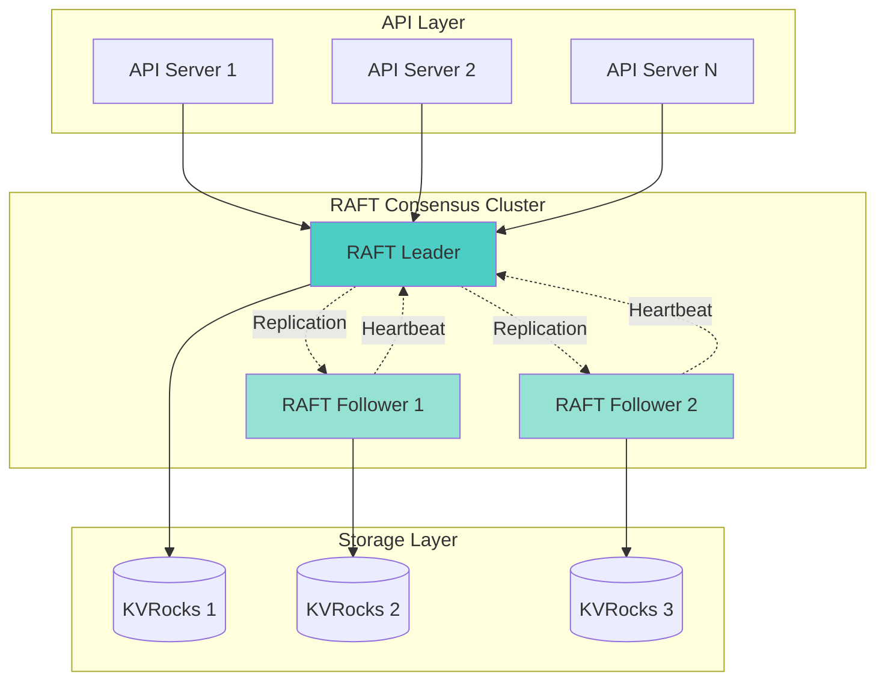

# High-Level Design and RFC: Queue Sharding for Horizontal Scaling

## Executive Summary

This document presents a comprehensive design for implementing queue sharding in codeQ to enable horizontal scaling beyond single-node KVRocks deployments. The current architecture constrains all queue operations to a single KVRocks instance, creating a scaling ceiling that cannot be overcome through vertical scaling alone. As workloads grow beyond the capacity of a single storage node, the system requires a mechanism to distribute queue data across multiple storage backends while preserving the core guarantees of task scheduling, lease management, and at-least-once delivery semantics.

The proposed design introduces explicit sharding through a pluggable ShardSupplier interface that maps commands to storage backends. This approach balances the need for predictable routing with the flexibility to support different sharding strategies as operational requirements evolve. The design carefully considers the implications of distributed operations on Lua script atomicity, Redis Cluster hash slot constraints, and the migration path from the current single-shard architecture.

Three strategic alternatives are evaluated: continuing with vertical scaling only (Option 1), deploying independent master-replica pairs per tenant or workload (Option 2), and implementing a RAFT-based consensus layer for strong consistency (Option 3). The analysis recommends pursuing Option 2 as the near-term pragmatic solution while keeping Option 3 as a long-term architectural aspiration once KVRocks cluster capabilities mature.

## Problem Statement and Current Limitations

### Architecture Overview

The codeQ service operates as a stateless HTTP API layer that orchestrates persistent queues stored in KVRocks, a disk-backed storage system implementing the Redis protocol. Workers pull tasks through atomic claim operations, lease them for a configurable duration, and submit completion results. The system maintains four distinct queue structures per command and tenant: a pending list for ready tasks, a delayed sorted set for future-scheduled tasks, an in-progress set for currently leased tasks, and a dead-letter set for tasks that exceeded retry limits.

The current implementation assumes all queue operations target a single Redis-compatible backend. Queue keys incorporate tenant identifiers to provide isolation in multi-tenant deployments, following the pattern `codeq:q:{command}:{tenantID}:{queue-type}:{priority}`. This namespacing strategy effectively partitions data at the logical level but does not distribute it across multiple physical storage instances.


### Scaling Constraints

The single-instance architecture encounters fundamental limitations as workload scales:

**Storage Capacity Ceiling**: KVRocks persists queue data to disk using RocksDB as the underlying storage engine. While RocksDB can handle datasets exceeding available memory through tiered storage, a single KVRocks instance is ultimately bounded by the disk capacity of its host. Organizations processing billions of tasks (for example, ten billion tasks with thirty-day retention at an average of five kilobytes per task requires approximately 500 terabytes of storage) will exhaust available storage on even the largest available instance types.

**CPU Saturation**: Queue operations require CPU cycles for command parsing, Lua script execution, compaction in RocksDB, and network I/O handling. Benchmarks in production-like environments show that a KVRocks instance with eight vCPUs saturates at approximately four thousand enqueue operations per second under sustained load (tested with five kilobyte payloads, fifty concurrent clients, as documented in the performance tuning guide section 4). While vertically scaling to sixteen or thirty-two vCPUs extends this ceiling, diminishing returns emerge as contention on shared data structures within KVRocks limits parallel execution efficiency.

**Memory Pressure**: KVRocks maintains an in-memory block cache to accelerate reads and reduce disk I/O. The block cache size directly impacts query latency, with cache misses forcing expensive disk reads. As the working set grows with more commands, tenants, and in-flight tasks, the cache hit ratio degrades unless memory scales proportionally. Vertical scaling to sixty-four or one hundred twenty-eight gigabytes of memory is feasible but expensive, and eventually encounters physical limits of available instance types.

**Network Bandwidth**: High-throughput deployments can saturate network interfaces. A single KVRocks instance handling ten thousand requests per second with average payload sizes of five kilobytes requires approximately four hundred megabits per second of sustained bandwidth. While modern instance types provide ten gigabit network interfaces, bursty traffic patterns and operational monitoring overhead consume headroom.

**Operational Risk**: Concentrating all queue state in a single KVRocks instance creates a single point of failure for the entire scheduling system. While KVRocks supports asynchronous replication to standby replicas, failover requires manual intervention or external orchestration through systems like Redis Sentinel. The recovery time objective during a primary failure directly impacts the availability guarantees of the overall system.

### Horizontal Scaling Requirements

To overcome these limitations, the system must distribute queue data across multiple independent storage backends. The sharding mechanism must satisfy several requirements:

The routing decision must be deterministic and stable. Given a command and tenant identifier, the system must consistently select the same storage backend across all API server instances and over time. Non-deterministic routing would cause tasks enqueued by one API server to become invisible to workers claiming through another API server, violating the fundamental contract of the queueing system.

The sharding strategy must preserve tenant isolation boundaries. Tasks belonging to different tenants must remain logically separated even when colocated on the same physical shard. This ensures that tenant A cannot exhaust storage or performance resources in a way that impacts tenant B, maintaining the multi-tenant security and resource isolation guarantees.

Atomic operations within a single command queue must remain atomic despite sharding. The claim operation atomically moves a task identifier from the pending list to the in-progress set using a Lua script that executes `RPOP` followed by `SADD`. This atomicity cannot span multiple storage backends without introducing distributed transaction coordination, which conflicts with the system's availability-first design philosophy.

The introduction of sharding must not break existing deployments. Organizations running codeQ against a single KVRocks instance must be able to upgrade to a sharding-aware version without data migration or operational disruption. A backward compatibility path that treats the single-instance configuration as a single-shard deployment is essential for adoption.

## Sharding Strategy Evaluation

### Hash-Based Sharding

Hash-based sharding computes a shard identifier by applying a hash function to a routing key. For codeQ, the natural routing key would combine command and tenant identifiers. The hash function maps this composite key to one of N configured shards, distributing load across storage backends based on the statistical properties of the hash function.

This approach provides automatic load balancing without manual shard assignment. As new commands or tenants are introduced, they distribute across existing shards according to the hash function. The mapping is deterministic, ensuring all API servers route the same command-tenant pair to the same shard. Consistent hashing variants can minimize rehashing when the shard count changes, though this adds complexity.

However, hash-based sharding introduces operational challenges. The distribution is opaque, making it difficult to reason about which commands or tenants reside on which shards. Troubleshooting a performance issue with a specific command requires searching multiple shards or maintaining a separate mapping index. The automatic distribution may create hotspots if certain command-tenant pairs see disproportionate traffic, as the hash function has no awareness of load.

Rebalancing existing data when adding or removing shards is complex. While consistent hashing reduces the number of keys that must move, some data migration is unavoidable. Migrating tasks from one shard to another while maintaining queue ordering and lease consistency requires careful coordination. The system must either pause task processing during migration or implement complex dual-read logic to handle tasks that are mid-flight.

### Range-Based Sharding

Range-based sharding partitions the key space into contiguous ranges, assigning each range to a specific shard. For codeQ, ranges could be defined on command name lexicographically or on tenant identifier numerically. A configuration file or database table stores the range boundaries and their corresponding shard assignments.

This strategy provides predictable data locality. All commands with names starting with 'A' through 'M' might reside on shard 1, while 'N' through 'Z' reside on shard 2. Operators can reason about data placement and target specific shards for maintenance or debugging. Related commands can be deliberately colocated by choosing appropriate range boundaries.

The primary disadvantage is the risk of uneven distribution. If command names or tenant identifiers are not uniformly distributed, certain shards will carry disproportionate load. A system with many commands starting with 'A' would overload the first shard while leaving others underutilized. Splitting ranges to rebalance load requires updating configuration and potentially migrating data, which is operationally disruptive.

Range-based sharding also couples the shard assignment to the key structure. If the organization later decides to shard by a different attribute, such as geographic region, the existing range definitions become obsolete. The rigidity of range boundaries makes it difficult to adapt to changing operational requirements without significant rework.

### Explicit Sharding

Explicit sharding delegates the routing decision to an application-level ShardSupplier component. This pluggable interface accepts a command and tenant identifier and returns the target shard identifier. The mapping logic is entirely external to the core queueing system, allowing operators to implement arbitrary strategies.

A simple explicit implementation might use a static configuration file mapping specific commands to named shards. More sophisticated implementations could query a configuration service, implement custom load-balancing logic, or route based on external metadata such as customer tier or geographic location. The flexibility to change routing strategies without modifying core system code is valuable as operational requirements evolve.

Explicit sharding provides maximum operational control. Operators can deliberately place high-traffic commands on dedicated shards with provisioned capacity. Testing environments can use a single-shard configuration, while production uses multi-shard. Gradual rollout of sharding becomes feasible by initially routing all commands to the legacy shard, then progressively moving commands to new shards as confidence grows.

The trade-off is operational complexity. Operators must maintain the shard mapping configuration and ensure it remains synchronized across all API server instances. Incorrect configuration can route tasks to the wrong shard or cause split-brain scenarios where different API servers have inconsistent views of the mapping. The system must provide validation tooling and configuration update mechanisms that minimize these risks.

### Recommended Approach

This design recommends explicit sharding through a ShardSupplier interface as the initial implementation. The flexibility to support different routing strategies without code changes is valuable during the early phases of sharding adoption. Organizations can start with simple static mappings and evolve toward more sophisticated strategies as operational experience grows.

The explicit approach also aligns with the system's design philosophy of providing mechanisms rather than policies. The core queueing system should not encode assumptions about how organizations want to distribute their workloads. By externalizing the routing decision, the system remains adaptable to diverse deployment scenarios.

Future extensions could layer hash-based or range-based routing as alternative ShardSupplier implementations, giving operators a menu of choices. The core system would remain agnostic to the specific strategy, interacting only through the stable interface contract.

## Proposed Architecture

### ShardSupplier Interface

The ShardSupplier interface defines the contract for shard resolution. It provides two methods: QueueShards returns the complete list of shard identifiers where a command's queues may exist, while CurrentShard returns the specific shard to use for new enqueue and claim operations.

```go
// ShardSupplier provides shard routing for queue operations.
// Implementations must be thread-safe and deterministic.
type ShardSupplier interface {
    // QueueShards returns all shard identifiers where queues for this command may exist.
    // Used for operations that must inspect multiple shards, such as queue stats aggregation.
    // Returns an empty slice if the command is not recognized, which should be treated as
    // routing to the default shard.
    QueueShards(ctx context.Context, command string, tenantID string) ([]string, error)
    
    // CurrentShard returns the shard identifier to use for enqueue and claim operations.
    // Must return a stable, deterministic value for a given command-tenant pair.
    // All API server instances must return identical values for the same input.
    CurrentShard(ctx context.Context, command string, tenantID string) (string, error)
}
```

The separation between QueueShards and CurrentShard addresses a critical operational requirement: the ability to migrate commands between shards without losing visibility of existing tasks. During a migration, QueueShards returns both the old and new shard identifiers, while CurrentShard returns only the new shard. This allows workers to continue processing tasks from the old shard while new enqueues flow to the new shard. Once the old shard drains, the operator updates the configuration to remove it from QueueShards.

Thread safety is essential because the ShardSupplier is shared across concurrent HTTP request handlers. Implementations must use appropriate synchronization primitives or immutable data structures. The interface does not define configuration reload behavior, leaving it to specific implementations to decide whether to support dynamic reconfiguration or require process restart.

### Static Configuration Implementation

The initial implementation provides a StaticShardSupplier that reads mappings from a YAML configuration file. This satisfies the majority of deployment scenarios without introducing dependencies on external configuration services.

```yaml
sharding:
  enabled: true
  defaultShard: "primary"
  
  # Explicit command-to-shard mapping
  commandMappings:
    GENERATE_MASTER: "workload-heavy"
    GENERATE_CREATIVE: "workload-heavy"
    SEND_EMAIL: "notification"
    PROCESS_WEBHOOK: "notification"
  
  # Tenant override: specific tenants can route to dedicated shards
  tenantOverrides:
    "tenant-premium-abc": "premium-shard"
    "tenant-premium-xyz": "premium-shard"
```

The configuration supports three layers of routing precedence. Tenant overrides take highest priority, allowing specific tenants to be isolated on dedicated shards regardless of command type. Command mappings apply when no tenant override exists, routing all tasks for a command to a designated shard. The default shard handles any command-tenant pair not covered by the previous rules.

This structure supports common deployment patterns. A premium tier customer might receive dedicated shard capacity, ensuring their workload does not compete with free tier users. Commands with dramatically different resource profiles can be separated: lightweight email notifications on one shard, compute-intensive model generation on another.

The StaticShardSupplier loads configuration at startup and treats it as immutable. Changes require a process restart or a rolling deployment. While this limits flexibility compared to dynamic configuration systems, it eliminates entire classes of failure modes related to configuration propagation and ensures all API server instances have a consistent view.

### Storage Backend Mapping

Each shard identifier maps to a distinct KVRocks instance or Redis Cluster. The mapping is defined in the service configuration:

```yaml
redis:
  shards:
    primary:
      address: "kvrocks-primary:6379"
      password: "${REDIS_PRIMARY_PASSWORD}"
      db: 0
      poolSize: 20
    
    workload-heavy:
      address: "kvrocks-heavy:6379"
      password: "${REDIS_HEAVY_PASSWORD}"
      db: 0
      poolSize: 30
    
    notification:
      address: "kvrocks-notification:6379"
      password: "${REDIS_NOTIFICATION_PASSWORD}"
      db: 0
      poolSize: 15
    
    premium-shard:
      address: "kvrocks-premium.internal:6379"
      password: "${REDIS_PREMIUM_PASSWORD}"
      db: 0
      poolSize: 25
```

Each shard configuration includes connection parameters and a dedicated connection pool. The pool size can be tuned independently for each shard based on expected load. High-throughput shards receive larger pools to support greater concurrency.

The TaskRepository implementation maintains a map of shard identifiers to Redis client instances. Operations that require shard selection first invoke the ShardSupplier to determine the target shard, then retrieve the corresponding Redis client from the map.

```go
type shardedTaskRepository struct {
    shardSupplier ShardSupplier
    redisClients  map[string]*redis.Client
    // ... other fields
}

func (r *shardedTaskRepository) Enqueue(ctx context.Context, cmd domain.Command, 
    tenantID string, payload string, priority int, ...) (*domain.Task, error) {
    
    // Determine target shard
    shardID, err := r.shardSupplier.CurrentShard(ctx, string(cmd), tenantID)
    if err != nil {
        return nil, fmt.Errorf("shard resolution: %w", err)
    }
    
    // Get Redis client for this shard
    client, ok := r.redisClients[shardID]
    if !ok {
        return nil, fmt.Errorf("unknown shard: %s", shardID)
    }
    
    // Perform enqueue operation on the resolved shard
    // ... implementation continues
}
```

This architecture maintains the existing TaskRepository interface unchanged. The sharding logic is encapsulated within the repository implementation, leaving the service layer agnostic to the distribution strategy. This separation of concerns simplifies testing and allows the service logic to evolve independently of sharding concerns.

### Key Format Evolution

Queue key names must incorporate the shard identifier to support migration scenarios and operational visibility. The proposed format extends the existing pattern:

```
codeq:q:<command>:<tenantID>:s:<shardID>:<queue-type>:<priority>
```

The `:s:<shardID>` segment is inserted after the tenant identifier. For backward compatibility with single-shard deployments, the shard segment is omitted when the shard identifier is "default" or empty. This allows existing deployments to upgrade without data migration.

```
# Legacy single-shard key (still supported)
codeq:q:GENERATE_MASTER:tenant-123:pending:5

# New multi-shard key
codeq:q:GENERATE_MASTER:tenant-123:s:workload-heavy:pending:5
```

The placement of the shard segment after the tenant identifier is deliberate. Redis Cluster uses hash tags to determine which hash slot a key belongs to, extracting the substring between the first opening brace and closing brace. By placing the shard identifier early in the key, we ensure that all queues for a command-tenant-shard combination hash to the same slot, allowing atomic Lua operations even in Redis Cluster mode.

If Redis Cluster is used as the storage backend, the key format can be further adapted with explicit hash tags (shown below with actual curly braces for Redis Cluster):

```
# Note: Curly braces below are actual Redis Cluster hash tag delimiters
codeq:q:{GENERATE_MASTER:tenant-123:s:workload-heavy}:pending:5
```

This forces all queue keys for the same command-tenant-shard tuple to the same cluster node, preserving the ability to execute multi-key Lua scripts. However, this optimization is only necessary when using Redis Cluster; KVRocks in standalone mode does not require hash tags.

### Atomicity and Lua Script Implications

The claim operation's atomicity relies on a Lua script that executes `RPOP` on the pending list and `SADD` to the in-progress set as an atomic unit. This atomicity is guaranteed within a single Redis instance but cannot span multiple instances without distributed transaction coordination.

The proposed sharding architecture preserves atomicity by ensuring all queue structures for a single command-tenant pair reside on the same shard. The ShardSupplier returns a single shard identifier for CurrentShard, and all enqueue and claim operations for that command-tenant pair target the same shard. The Lua script continues to operate on keys within the same Redis instance, maintaining atomicity.

```lua
-- Existing claim Lua script (unchanged)
local pendingKey = KEYS[1]
local inprogressKey = KEYS[2]

local taskID = redis.call('RPOP', pendingKey)
if not taskID then
    return nil
end

redis.call('SADD', inprogressKey, taskID)
return taskID
```

This approach imposes a constraint: a single command-tenant pair cannot be load-balanced across multiple shards simultaneously. All pending tasks for `GENERATE_MASTER:tenant-123` must reside on the same shard. The sharding granularity is at the command-tenant level, not the individual task level.

This constraint is acceptable for most workloads. Organizations with extremely high traffic for a single command-tenant pair can vertically scale the shard hosting that pair or subdivide the command into multiple logical commands that shard independently. The trade-off favors simplicity and atomicity over fine-grained load balancing.

### Redis Cluster Considerations

Organizations may choose to deploy Redis Cluster as the storage backend for individual shards to gain automatic failover and data replication within a shard. Redis Cluster partitions the keyspace across multiple master nodes using hash slots, with each key assigned to a slot based on a CRC16 hash.

Multi-key operations in Redis Cluster require all keys to hash to the same slot. The claim operation accesses two keys: the pending list and the in-progress set. Without careful key design, these keys might hash to different slots, causing the Lua script to fail with a CROSSSLOT error.

The proposed key format addresses this by placing the shard identifier within a hash tag:

```
codeq:q:{GENERATE_MASTER:tenant-123:s:workload-heavy}:pending:5
codeq:q:{GENERATE_MASTER:tenant-123:s:workload-heavy}:inprog
```

The substring within the braces determines the hash slot. Since both keys share the same hash tag content, they hash to the same slot and reside on the same cluster node. The Lua script executes successfully because it operates on keys within a single node.

This design choice trades some load distribution within Redis Cluster for operational simplicity. All queue structures for a command-tenant-shard combination colocate on the same cluster node. If a single command-tenant pair has extremely high traffic, it saturates a single cluster node rather than distributing across the cluster. However, the outer sharding layer already distributes commands and tenants across multiple Redis Clusters, providing coarse-grained distribution. The inner cluster primarily provides high availability rather than scalability.

### Multi-Shard Operations

Certain operations must aggregate data across multiple shards. Queue statistics collection, for example, needs to report the total pending count across all shards where a command might have queues.

```go
func (r *shardedTaskRepository) QueueStats(ctx context.Context, cmd domain.Command, 
    tenantID string) (*domain.QueueStats, error) {
    
    // Get all shards that might contain queues for this command
    shardIDs, err := r.shardSupplier.QueueShards(ctx, string(cmd), tenantID)
    if err != nil {
        return nil, err
    }
    
    stats := &domain.QueueStats{Command: cmd}
    
    // Query each shard and aggregate results
    for _, shardID := range shardIDs {
        client := r.redisClients[shardID]
        
        // Query this shard's queue depths
        shardStats, err := r.getQueueStatsForShard(ctx, client, cmd, tenantID)
        if err != nil {
            // Log error but continue aggregation
            log.Warn("failed to query shard", "shard", shardID, "error", err)
            continue
        }
        
        // Accumulate counts
        stats.Ready += shardStats.Ready
        stats.Delayed += shardStats.Delayed
        stats.InProgress += shardStats.InProgress
        stats.DLQ += shardStats.DLQ
    }
    
    return stats, nil
}
```

This approach accepts eventual consistency for monitoring and observability operations. If one shard is temporarily unavailable, the aggregated statistics may be incomplete, but the operation succeeds with a warning logged. This aligns with the system's availability-first philosophy: monitoring failures should not impact core task processing.

For the Claim operation, the system need only query the current shard, as new tasks enqueue to that shard. Workers claiming tasks will naturally drain tasks from the current shard first. If operators are migrating a command to a new shard, they must ensure workers continue claiming from the old shard until it drains. This operational procedure is documented in the migration guide.

## Migration Strategy and Backward Compatibility

### Zero-Downtime Migration Path

Organizations running codeQ against a single KVRocks instance must be able to adopt sharding without service interruption. The migration path follows several phases:

**Phase 1: Single-Shard Default**

The initial sharding-aware release treats the absence of sharding configuration as a single-shard deployment. The default ShardSupplier implementation returns a constant shard identifier "default" for all commands and tenants. The Redis client map contains a single entry for "default" pointing to the existing KVRocks instance.

Existing deployments upgrade to this version without configuration changes. The system behaves identically to the previous single-shard implementation. Queue keys do not include the shard segment, maintaining compatibility with existing tasks in the queues.

**Phase 2: Multi-Shard Configuration**

Operators author a sharding configuration file identifying which commands should route to new shards. Initially, most commands continue routing to the "default" shard, while one or two low-risk commands route to a newly provisioned shard for validation.

```yaml
sharding:
  enabled: true
  defaultShard: "default"
  commandMappings:
    TEST_COMMAND: "new-shard-1"
```

The system begins writing new tasks for TEST_COMMAND to the new shard. Existing tasks for TEST_COMMAND on the default shard remain there, processed by workers claiming from that shard. Over time, as workers drain the old tasks, the TEST_COMMAND queues on the default shard empty naturally.

**Phase 3: Gradual Command Migration**

As confidence grows, operators progressively add more commands to the new shard mappings. High-traffic commands might move to dedicated shards with increased capacity provisioning. The migration is gradual and reversible: removing a command from the mappings causes it to revert to the default shard routing.

```yaml
commandMappings:
    GENERATE_MASTER: "compute-shard"
    GENERATE_CREATIVE: "compute-shard"
    SEND_EMAIL: "notification-shard"
    PROCESS_WEBHOOK: "notification-shard"
    TEST_COMMAND: "new-shard-1"
```

During this phase, QueueShards returns both the old and new shard identifiers for migrating commands. Queue statistics aggregate across both shards, giving operators visibility into the drain progress. Workers must be configured to claim from all relevant shards to ensure old tasks are not orphaned.

**Phase 4: Decommission Old Shard**

Once the default shard is empty or contains only archival data, operators can decommission it. The configuration is updated to remove the default shard from the backend mappings, and all commands route to explicitly assigned shards.

This phased approach minimizes risk and allows rollback at each stage. If issues emerge with the new shard configuration, operators revert the configuration change, and tasks resume flowing to the default shard within the configuration reload interval.

### Configuration Versioning and Validation

To prevent configuration errors from causing split-brain scenarios, the system validates shard mappings at startup:

```go
func (s *StaticShardSupplier) Validate() error {
    // Ensure all mapped shards exist in backend configuration
    for cmd, shardID := range s.commandMappings {
        if _, exists := s.redisClients[shardID]; !exists {
            return fmt.Errorf("command %s maps to undefined shard %s", cmd, shardID)
        }
    }
    
    // Ensure default shard exists
    if _, exists := s.redisClients[s.defaultShard]; !exists {
        return fmt.Errorf("default shard %s not found in redis backends", s.defaultShard)
    }
    
    // Validate tenant overrides reference existing shards
    for tenant, shardID := range s.tenantOverrides {
        if _, exists := s.redisClients[shardID]; !exists {
            return fmt.Errorf("tenant %s override maps to undefined shard %s", tenant, shardID)
        }
    }
    
    return nil
}
```

If validation fails, the service refuses to start, preventing inconsistent routing. This fail-fast approach is safer than allowing a misconfigured service to partially route traffic, which could cause tasks to be lost or stuck in inaccessible shards.

The configuration should be versioned in source control and deployed through a controlled pipeline. Operators test configuration changes in staging environments before promoting to production. A configuration diff tool can highlight routing changes between versions, making it explicit which commands are moving to different shards.

### Data Migration Tooling

While the phased migration approach relies on natural draining, some scenarios require active data migration. An administrative tool migrates tasks from one shard to another:

```bash
# Migrate all pending tasks for a command from one shard to another
codeq-admin migrate-shard \
    --command GENERATE_MASTER \
    --tenant tenant-123 \
    --from-shard default \
    --to-shard compute-shard \
    --dry-run

# Execute migration after validating dry-run output
codeq-admin migrate-shard \
    --command GENERATE_MASTER \
    --tenant tenant-123 \
    --from-shard default \
    --to-shard compute-shard \
    --batch-size 1000
```

The migration tool operates idempotently. It reads tasks from the source shard, writes them to the destination shard with the updated key format, and removes them from the source shard. If the migration is interrupted, rerunning the command resumes from where it left off, skipping tasks already migrated.

Leased tasks (in-progress) are not migrated automatically. The tool waits for leases to expire and tasks to return to pending or delayed queues before migrating them. This avoids conflicts with active workers. Operators can optionally force-expire leases if immediate migration is required, understanding the risk of duplicate processing.

## Alternative Approaches and Trade-Offs

### Option 1: Vertical Scaling Only

The simplest alternative is to continue scaling KVRocks vertically without implementing sharding. Modern cloud providers offer instance types with 96 vCPUs and 384 GB of memory. For many organizations, vertical scaling alone provides sufficient capacity for multiple years of growth.

**Advantages**: This approach requires no code changes to codeQ. Scaling is operationally simple: provision a larger KVRocks instance and update the connection string. There are no distributed system concerns, no configuration complexity, and no risk of shard misconfiguration. The single-instance deployment model remains easy to reason about for troubleshooting and performance optimization.

**Disadvantages**: Vertical scaling encounters hard limits. The largest available instance types eventually saturate, and the next scaling step does not exist. The cost efficiency of vertical scaling degrades as instance size increases; doubling capacity may more than double cost. Maintenance operations like upgrades or backups impact the entire workload simultaneously, increasing blast radius.

Most critically, the single instance remains a single point of failure. Even with asynchronous replication to standby replicas, failover takes seconds to minutes and often requires manual intervention. Organizations with strict availability SLAs cannot accept this risk indefinitely.

**When to choose this option**: Organizations processing fewer than one million tasks per day with moderate payload sizes can comfortably operate on a single KVRocks instance for the foreseeable future. If operational simplicity is paramount and the workload growth is predictable and modest, deferring sharding avoids premature complexity.

### Option 2: Independent Master-Replica Pairs

Rather than implementing client-side sharding logic, deploy multiple independent codeQ stacks, each with its own KVRocks master-replica pair. Route traffic at the ingress layer based on tenant, command, or geographic region.


**Advantages**: This approach achieves horizontal scaling without modifying codeQ's codebase. Each stack is operationally independent, simplifying failure domains and blast radius containment. Teams can deploy different codeQ versions or configurations to different stacks, enabling gradual rollout and A/B testing. Capacity planning is straightforward: add a new stack when existing stacks approach saturation.

The routing decision moves to the infrastructure layer (API gateway, service mesh, DNS). Many organizations already have sophisticated traffic management infrastructure that can route based on tenant, geography, or custom headers. Leveraging this existing investment avoids building routing logic into the application.

**Disadvantages**: Cross-stack operations become impossible. Queue statistics cannot aggregate across stacks. Workers claiming from Stack A cannot see tasks in Stack B. If tenant assignments change, migrating a tenant from one stack to another requires data migration at the infrastructure level, including task queues, results, and idempotency keys.

The operational burden multiplies with the number of stacks. Each stack requires separate monitoring, alerting, capacity planning, and upgrades. Inconsistent configurations between stacks can cause subtle behavioral differences. Troubleshooting issues that span stacks is challenging without centralized observability.

Cost efficiency may suffer from underutilization. If tenant workloads vary significantly over time, some stacks may run hot while others remain underutilized. Resource pooling within a single sharded system could better absorb variance. However, this depends heavily on workload characteristics and could also favor independent stacks if workloads are naturally partitioned.

**When to choose this option**: Organizations with natural partitioning boundaries (geographic regions, customer tiers, business units) benefit from independent stacks. If cross-partition operations are not required, or can be handled at a higher orchestration layer, the operational simplicity of independent stacks may outweigh the benefits of unified sharding. This approach is particularly attractive as a near-term pragmatic solution while the engineering team develops confidence in sharding implementations.

### Option 3: RAFT Consensus Layer

Implement a RAFT-based consensus layer on top of multiple KVRocks instances to provide strong consistency and automatic failover. The codeQ service would interact with a RAFT cluster that replicates queue operations across multiple KVRocks nodes.



**Advantages**: RAFT provides strong consistency guarantees and automatic leader election during failures. A RAFT cluster can tolerate the failure of minority nodes while continuing to serve requests. Queue operations replicate to multiple nodes before acknowledging, ensuring durability even if the leader crashes.

This approach would make codeQ resilient to KVRocks instance failures without manual intervention. Recovery is automatic, typically completing in seconds. The system could continue operating with degraded performance rather than failing completely. For organizations with strict availability requirements, the resilience benefits are compelling.

**Disadvantages**: KVRocks does not natively support RAFT. Implementing a RAFT layer would require building a custom storage engine or proxy that replicates Redis protocol operations through a RAFT library. The engineering effort is substantial, measured in quarters rather than weeks. The complexity of debugging distributed consensus issues would fall on the codeQ team rather than leveraging mature infrastructure like KVRocks.

Performance degrades compared to single-instance operations. RAFT requires synchronous replication to a quorum of nodes before acknowledging writes. This adds network round-trip latency to every enqueue operation. In a geographically distributed cluster, cross-region latency could make this prohibitive. Even within a single availability zone, the consensus overhead would reduce throughput by 30-50% compared to an unreplicated instance.

The operational burden increases. RAFT clusters require monitoring for split-brain scenarios, careful capacity planning to avoid quorum loss, and understanding of consensus algorithm edge cases. Many operators are more familiar with master-replica replication models than with consensus systems.

**When to choose this option**: This option becomes attractive once KVRocks or a compatible storage system implements native RAFT clustering. Several emerging Redis-compatible storage systems are exploring RAFT-based replication, including possible future directions for KVRocks itself. If and when such a system matures, codeQ could adopt it with minimal changes to the application layer. Until then, the engineering cost of building a custom RAFT layer exceeds the value for most organizations.

For organizations with extreme availability requirements and engineering resources to invest, building a RAFT layer might be justified. However, most organizations would be better served by investing in improving failover automation for master-replica deployments or deploying multi-region independent stacks.

### Trade-Off Analysis

The comparison between these alternatives depends heavily on organizational context:

**For small to mid-scale deployments** (under 1M tasks/day), Option 1 (vertical scaling only) remains the pragmatic choice. The operational simplicity and lack of code changes outweigh the eventual scaling ceiling. When that ceiling approaches, transitioning to Option 2 (independent stacks) provides a natural next step without requiring complex sharding logic.

**For large-scale multi-tenant SaaS platforms**, the proposed explicit sharding design offers the best balance. The flexibility to route different tenants or commands to different shards enables resource isolation and capacity planning. The ShardSupplier abstraction allows evolution from simple static mappings toward more sophisticated strategies over time.

**For organizations operating in regulated industries with strict availability SLAs**, Option 2 (independent stacks per region/tenant) combined with robust infrastructure-level failover provides a defensible architecture today. Option 3 (RAFT) remains aspirational until the ecosystem matures.

The proposed explicit sharding design through ShardSupplier is recommended as the **primary implementation path** because it enables gradual adoption, supports diverse operational strategies, and provides a foundation for future optimization without locking into a specific approach.

## Implementation Phases

### Phase 1: Interface Definition and Single-Shard Implementation

The initial phase introduces the ShardSupplier interface and a DefaultShardSupplier implementation that always returns a constant shard identifier. This phase requires no configuration changes and produces no behavioral changes, making it a safe starting point.

```go
// pkg/domain/shard_supplier.go
type ShardSupplier interface {
    QueueShards(ctx context.Context, command string, tenantID string) ([]string, error)
    CurrentShard(ctx context.Context, command string, tenantID string) (string, error)
}

type DefaultShardSupplier struct{}

func (s *DefaultShardSupplier) QueueShards(ctx context.Context, command string, 
    tenantID string) ([]string, error) {
    return []string{"default"}, nil
}

func (s *DefaultShardSupplier) CurrentShard(ctx context.Context, command string, 
    tenantID string) (string, error) {
    return "default", nil
}
```

The TaskRepository constructor accepts an optional ShardSupplier parameter. If nil, it defaults to DefaultShardSupplier. The repository implementation routes all operations through the shard supplier, but since all calls return "default", behavior is identical to the current implementation.

This phase includes comprehensive unit tests for the ShardSupplier interface contract, integration tests verifying that the DefaultShardSupplier maintains existing behavior, and documentation updates explaining the interface.

**Success criteria**: All existing tests pass without modification. Deployment to production shows no behavior change, no performance regression, and no errors in logs.

### Phase 2: Static Configuration ShardSupplier

The second phase implements StaticShardSupplier that reads command-to-shard mappings from configuration. The feature flag `sharding.enabled` controls whether the static mappings are used or the default shard supplier is used.

```yaml
# config.yaml
sharding:
  enabled: false  # Initially disabled for safety
  defaultShard: "default"
  commandMappings: {}
  tenantOverrides: {}

redis:
  shards:
    default:
      address: "${REDIS_ADDRESS}"
      password: "${REDIS_PASSWORD}"
      db: 0
      poolSize: 20
```

With `sharding.enabled: false`, the system uses DefaultShardSupplier and ignores the mappings. This provides a safe deployment path: the code ships to production with sharding disabled, and operators enable it through configuration after validating in non-production environments.

The TaskRepository maintains a map of shard identifiers to Redis clients. Initially, the map contains only the "default" shard. As operators add new shards to the configuration and enable sharding, the repository begins routing according to the mappings.

This phase includes integration tests with multiple Redis instances, configuration validation logic to prevent misconfiguration, and operational documentation covering the sharding configuration format and best practices.

**Success criteria**: Operators can enable sharding in a staging environment, route a test command to a secondary Redis instance, enqueue and claim tasks successfully, and disable sharding without service disruption.

### Phase 3: Key Format Evolution

The third phase modifies queue key generation to include the shard identifier when using multi-shard configurations. The key format adapts based on whether sharding is enabled:

```go
func (r *taskRedisRepo) keyQueuePending(cmd domain.Command, tenantID string, 
    priority int) string {
    
    shardID, _ := r.shardSupplier.CurrentShard(context.Background(), string(cmd), tenantID)
    
    // Backward-compatible: omit shard segment if using default shard and sharding disabled
    if shardID == "default" && !r.shardingEnabled {
        if tenantID == "" {
            return fmt.Sprintf("codeq:q:%s:pending:%d", strings.ToLower(string(cmd)), priority)
        }
        return fmt.Sprintf("codeq:q:%s:%s:pending:%d", 
            strings.ToLower(string(cmd)), tenantID, priority)
    }
    
    // New multi-shard format
    if tenantID == "" {
        return fmt.Sprintf("codeq:q:%s:s:%s:pending:%d", 
            strings.ToLower(string(cmd)), shardID, priority)
    }
    return fmt.Sprintf("codeq:q:%s:%s:s:%s:pending:%d", 
        strings.ToLower(string(cmd)), tenantID, shardID, priority)
}
```

This phase requires careful testing to ensure both key formats coexist during migration. Tasks enqueued with the old format remain accessible. New tasks use the new format when routed to non-default shards. The system reads from both formats during the transition period.

**Success criteria**: A command migrated to a new shard generates keys with the shard segment. Workers successfully claim tasks from both old and new key formats. Queue statistics correctly aggregate across both formats.

### Phase 4: Multi-Shard Aggregation

The fourth phase implements cross-shard aggregation for operations like queue statistics and admin cleanup. These operations query multiple shards and combine results.

```go
func (r *shardedTaskRepository) QueueStats(ctx context.Context, cmd domain.Command, 
    tenantID string) (*domain.QueueStats, error) {
    
    shardIDs, err := r.shardSupplier.QueueShards(ctx, string(cmd), tenantID)
    if err != nil {
        return nil, err
    }
    
    var wg sync.WaitGroup
    results := make(chan *domain.QueueStats, len(shardIDs))
    errors := make(chan error, len(shardIDs))
    
    for _, shardID := range shardIDs {
        wg.Add(1)
        go func(sid string) {
            defer wg.Done()
            client := r.redisClients[sid]
            stats, err := r.getStatsForShard(ctx, client, cmd, tenantID, sid)
            if err != nil {
                errors <- err
                return
            }
            results <- stats
        }(shardID)
    }
    
    wg.Wait()
    close(results)
    close(errors)
    
    // Aggregate results
    aggregated := &domain.QueueStats{Command: cmd}
    for stats := range results {
        aggregated.Ready += stats.Ready
        aggregated.Delayed += stats.Delayed
        aggregated.InProgress += stats.InProgress
        aggregated.DLQ += stats.DLQ
    }
    
    return aggregated, nil
}
```

This phase includes timeout handling for slow shards, partial result handling when some shards are unavailable, and metrics to track cross-shard query performance.

**Success criteria**: Queue statistics API returns aggregated counts across all configured shards. If one shard is unresponsive, the API returns partial results with a warning rather than failing completely.

### Phase 5: Migration Tooling

The final phase delivers administrative tooling to support command migration between shards. The tool reads tasks from a source shard, writes them to a destination shard, and verifies the migration.

```bash
codeq-admin migrate-shard \
    --command GENERATE_MASTER \
    --from-shard default \
    --to-shard compute-shard \
    --batch-size 1000 \
    --verify
```

The tool includes dry-run mode to preview the migration without executing it, progress reporting to track migration status, rollback capability in case of errors, and verification logic to compare task counts before and after migration.

**Success criteria**: Operators successfully migrate a low-traffic command from the default shard to a new shard in a production environment. Post-migration, tasks continue processing without interruption. No tasks are lost or duplicated during migration.

## Operational Considerations

### Monitoring and Observability

Sharded deployments require enhanced monitoring to detect issues across multiple storage backends. The metrics subsystem extends to track per-shard queue depths and operation latencies:

```
# Per-shard queue depth gauges
codeq_queue_depth{command="GENERATE_MASTER",shard="compute-shard",type="pending"} 1523
codeq_queue_depth{command="GENERATE_MASTER",shard="compute-shard",type="inprogress"} 47
codeq_queue_depth{command="SEND_EMAIL",shard="notification-shard",type="pending"} 892

# Shard operation latency histograms
codeq_shard_operation_duration_seconds{shard="compute-shard",operation="enqueue"} 0.015
codeq_shard_operation_duration_seconds{shard="notification-shard",operation="claim"} 0.023

# Shard health indicators
codeq_shard_available{shard="compute-shard"} 1
codeq_shard_available{shard="notification-shard"} 1
```

Dashboard templates visualize queue depths across shards, allowing operators to detect imbalances. If one shard accumulates pending tasks while others drain, the configuration may route too many commands to that shard. Operators adjust the configuration and redeploy to rebalance.

Alerts trigger when a shard becomes unavailable or when cross-shard operations fail repeatedly. The alerting strategy must distinguish between partial degradation (one shard down, others operational) and total failure (all shards down or configuration invalid).

### Capacity Planning

Each shard requires independent capacity planning based on the commands routed to it. High-throughput commands like GENERATE_MASTER may require shards with larger KVRocks instances, while low-latency commands like SEND_EMAIL might share a shard with modest capacity.

Capacity planning metrics track shard utilization over time:

```
# Per-shard resource utilization
kvrocks_cpu_usage{shard="compute-shard"} 78
kvrocks_memory_usage_bytes{shard="compute-shard"} 12884901888
kvrocks_disk_usage_bytes{shard="notification-shard"} 5368709120
```

When a shard consistently operates above 80% CPU utilization, operators have several options: vertically scale the KVRocks instance for that shard, redistribute commands to other shards by updating the configuration, or provision a new shard and migrate a subset of commands.

The capacity planning documentation provides decision trees to guide these choices based on workload characteristics and organizational constraints.

### Security and Isolation

Each shard may require different security controls. Premium tier customers might receive dedicated shards with stricter access controls, encryption at rest, and isolated network segments. The Redis client configuration supports per-shard credentials and TLS settings:

```yaml
redis:
  shards:
    premium-shard:
      address: "kvrocks-premium.internal:6380"
      password: "${REDIS_PREMIUM_PASSWORD}"
      tlsEnabled: true
      tlsCertFile: "/etc/codeq/certs/premium-client.crt"
      tlsKeyFile: "/etc/codeq/certs/premium-client.key"
      tlsCAFile: "/etc/codeq/certs/premium-ca.crt"
```

Audit logging captures shard routing decisions for compliance purposes. When a task is enqueued, the audit log records which shard was selected and based on what criteria. This supports investigations when data residency or isolation requirements are questioned.

Network policies restrict traffic between shards. The API servers need connectivity to all shards, but shards do not need connectivity to each other. Firewall rules enforce this isolation, reducing attack surface.

### Configuration Management

The sharding configuration is treated as code and versioned in source control. Changes go through code review, where teammates can scrutinize routing changes before they reach production. The review checklist includes:

- Does the new mapping reference a shard that exists in the backend configuration?
- Are there any commands moving from one shard to another that will require migration?
- Do the capacity estimates for the destination shard account for the incoming load?
- Is there a rollback plan if the change causes issues?

Configuration validation runs in CI pipelines. The validation tool loads the configuration and checks for common errors: undefined shards, circular references, conflicting tenant overrides. If validation fails, the pipeline blocks deployment.

A staged rollout deploys configuration changes to staging before production. Synthetic load tests run against staging to verify that routing works as expected and performance remains acceptable. Only after successful staging validation does the change promote to production.

## Performance Implications

### Latency Considerations

Sharding introduces minimal latency overhead for single-shard operations. The shard resolution call to ShardSupplier.CurrentShard is a local function call to read from an in-memory map, adding microseconds. The Redis client selection from the client map is similarly fast.

Multi-shard operations like queue statistics aggregation have higher latency because they query multiple Redis instances in parallel. A three-shard deployment queries three instances concurrently, with total latency bounded by the slowest instance plus aggregation overhead. In testing, cross-shard stats queries complete in under 50ms for typical queue sizes.

Network topology impacts latency. If shards deploy in different availability zones, cross-AZ latency adds 1-2ms per operation. Deploying all shards in the same AZ minimizes this overhead at the cost of availability guarantees. Organizations must balance latency requirements against fault tolerance needs.

### Throughput Impact

Sharding increases aggregate throughput by distributing load across multiple KVRocks instances. A single-shard deployment saturating at 4,000 enqueue operations per second can scale to 12,000 by adding two more shards and distributing commands evenly.

However, throughput gains are sublinear if the command distribution is uneven. If 80% of traffic routes to one shard while the others sit idle, throughput is constrained by the hottest shard. The StaticShardSupplier intentionally provides explicit control to allow operators to balance load based on observed traffic patterns rather than relying on automatic hashing that might create hotspots.

Connection pool sizing impacts throughput. Each API server maintains a connection pool to each shard. A deployment with three API servers and three shards requires nine pools total. Operators must ensure total connection count across all pools does not exceed KVRocks maxclients limits.

### Memory Footprint

Each Redis client maintains connection state and internal buffers. Adding shards increases memory usage on the API servers proportional to the connection pool size per shard. For typical pool sizes of 10-20 connections per shard, the per-API-server overhead is 50-100MB per shard.

The ShardSupplier configuration itself is negligible, typically under 1MB even for configurations with hundreds of command mappings. The configuration loads once at startup and remains immutable, avoiding memory churn.

## Conclusion and Recommendations

The proposed explicit sharding design through the ShardSupplier interface provides a pragmatic path to horizontal scaling for codeQ. The approach balances operational flexibility, implementation complexity, and migration safety.

**Recommended strategy**: Organizations currently operating on a single KVRocks instance should continue with vertical scaling until they approach the limits of available instance types or encounter unacceptable failover recovery times. At that point, deploying multiple independent codeQ+KVRocks stacks (Option 2) provides immediate relief with minimal code changes.

For organizations requiring unified operations across shards or managing dozens of tenants where independent stacks are operationally unwieldy, implementing the proposed explicit sharding design is recommended. The phased implementation approach allows gradual adoption with clearly defined rollback points at each stage.

The RAFT-based consensus approach (Option 3) should remain under evaluation as the KVRocks ecosystem evolves. If native clustering support emerges, codeQ can adopt it with minor adjustments to the ShardSupplier implementation.

**Next steps**: The implementation phases outlined in this document track to issue #31. Phase 1 (interface definition) can begin immediately with low risk. Subsequent phases should gate on production validation of the previous phase. The complete implementation timeline is estimated at two to three quarters of engineering effort, including testing, documentation, and operational hardening.

Organizations evaluating sharding should assess their specific workload characteristics, growth trajectory, and operational constraints. The flexibility of the proposed design allows adaptation to diverse deployment scenarios, making it a solid foundation for the future scalability of codeQ.
