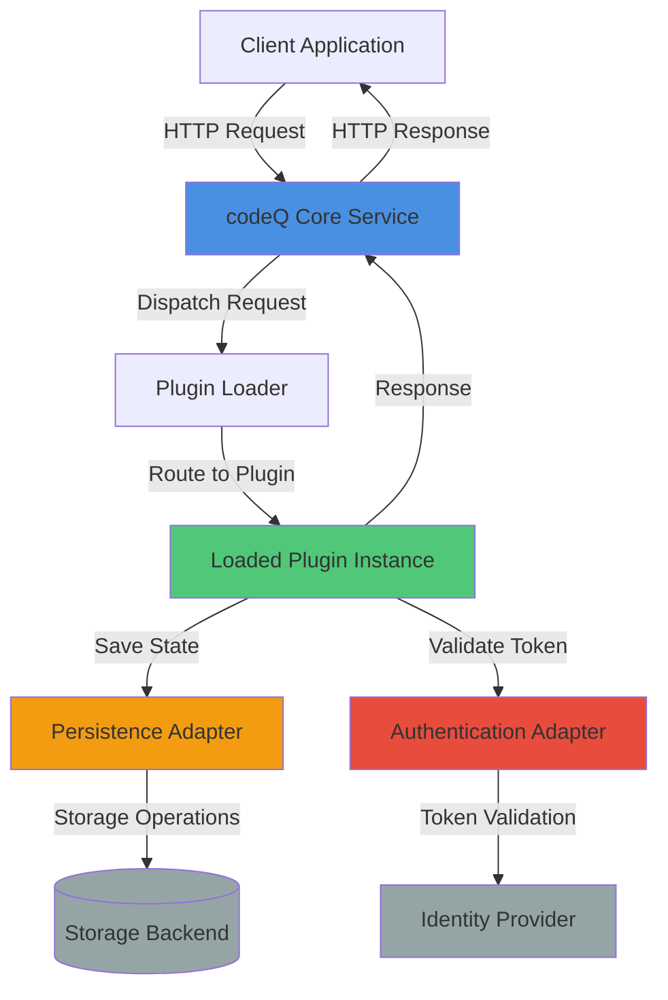
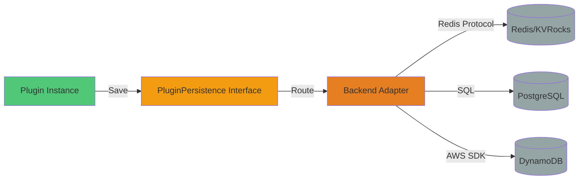
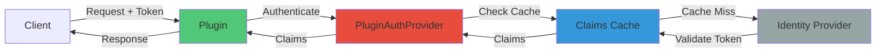

# High-Level Design: Plugin Architecture for Persistence and Authentication

## Executive Summary

This document defines the plugin architecture for codeQ, enabling independent development, deployment, and management of plugins that integrate with the core platform. The architecture establishes clear contracts for state management (persistence) and identity validation (authentication). Organizations deploy plugins without modifying core codeQ code, reducing coupling and enabling faster iteration.

The design separates concerns into three layers: Plugin Loader (discovery and initialization), Plugin Interface (lifecycle contracts), and Service Adapters (persistence and authentication backends). Plugins register through a factory pattern, receive typed configuration at startup, and interact with core services through well-defined interfaces that enforce security boundaries.

The authentication plugin system already exists in production (`pkg/auth/Validator`). This document extends that pattern to persistence, documenting both systems comprehensively to provide a unified plugin development model.

## Problem Statement and Motivation

### Current State

codeQ currently couples persistence directly to Redis/KVRocks through concrete implementations in `internal/repository/`. The TaskRepository and ResultRepository access `redis.Client` directly, embedding storage-specific operations throughout the codebase. While this approach delivers simplicity for the common case, it creates constraints for organizations with existing infrastructure investments.

Authentication follows a plugin model through the `pkg/auth/Validator` interface. Implementations exist for JWKS, static tokens, and OAuth2 introspection. The application loads validators from configuration, enabling operators to select authentication mechanisms without code changes.

### Constraints of Tight Coupling

**Infrastructure Lock-In**: Organizations standardized on Apache Cassandra, HBase, or PostgreSQL must operate separate Redis infrastructure solely for codeQ, increasing operational complexity and data governance friction.

**Testing Friction**: Integration tests depend on Docker containers running Redis. Test suites that manage multiple backend processes increase flakiness and execution time.

**Feature Parity**: Storage-specific optimizations (Bloom filters, Lua atomicity) embed assumptions about Redis data structures. Alternative backends cannot leverage equivalent capabilities in their native systems.

**Deployment Flexibility**: Cloud environments with managed database services (Amazon DynamoDB, Azure Cosmos DB, Google Cloud Datastore) force customers into unmanaged Redis infrastructure or accept higher latency from managed Redis offerings.

### Requirements

A plugin architecture must satisfy:

- **Backward Compatibility**: Existing Redis-based deployments continue unchanged. No migration effort for current users.
- **Interface Stability**: Plugin contracts remain stable across codeQ versions. Breaking changes follow semantic versioning.
- **Security Isolation**: Plugins cannot bypass authorization checks or access tenant data outside their scope.
- **Configuration-Driven**: Operators select persistence backends through configuration files, not code recompilation.
- **Testing Support**: Provide in-memory implementations for unit tests, eliminating external dependencies.

## Architectural Overview

### Component Breakdown

The plugin architecture comprises four layers:

**Plugin Loader**: Discovers available plugins through package imports or dynamic loading. Maintains a registry mapping plugin identifiers to factory functions. Instantiates plugins using configuration provided by operators. Manages plugin lifecycle (initialization, shutdown).

**Plugin Interface**: Defines contracts that plugins implement. Specifies initialization parameters (context, configuration). Declares methods for request handling and lifecycle hooks. Separates optional capabilities (persistence, authentication) from required methods.

**Persistence Service**: Provides storage operations to plugins through a common interface. Maps high-level operations (save, load, delete) to backend-specific implementations. Handles connection pooling, retry logic, and error translation. Enforces tenant isolation through namespacing.

**Authentication Layer**: Validates credentials and produces claims representing user identity. Integrates with external identity providers (OAuth2, SAML, LDAP). Caches validation results to reduce latency. Provides authorization decisions for resource access.

### System Interaction



The core service receives requests and consults the plugin loader to identify the responsible plugin. The loader maintains a routing table mapping request types (commands, webhooks) to plugin instances. The selected plugin processes the request, invoking persistence operations to save or load state. If the request requires authentication, the plugin validates credentials through the authentication adapter. The plugin returns a response to the core service, which serializes it to the client.

### Deployment Model

Plugins deploy through three mechanisms:

**Compiled-In**: Import plugin packages in `cmd/server/main.go`. Plugins register via `init()` functions. Operators select plugins through configuration. Produces a single binary containing all plugins. Suitable for controlled deployments with known plugin sets.

**Dynamic Loading**: Load plugin shared objects (`.so` files) at runtime. Requires Go plugin system constraints (matching Go version, no version skew). Plugins implement standard interfaces exported by core. Enables plugin updates without recompiling core. Suitable for environments with frequent plugin changes.

**Sidecar Process**: Run plugins as separate processes communicating via gRPC. Core service acts as gRPC client. Plugins implement gRPC service definitions. Enables plugins in different languages (Python, Java). Introduces network hop latency. Suitable for polyglot environments.

The compiled-in approach offers the lowest latency and simplest deployment. Dynamic loading adds flexibility at the cost of version management complexity. Sidecar processes enable language diversity but increase operational overhead. Most deployments use compiled-in plugins, reserving dynamic loading and sidecars for specialized requirements.

## Plugin Interface

### Core Contract

```go
// Plugin defines the lifecycle and capabilities of a plugin.
// Plugins implement this interface to integrate with codeQ core.
type Plugin interface {
    // ID returns a unique identifier for this plugin.
    // The ID namespaces storage keys and appears in logs.
    ID() string
    
    // Init prepares the plugin for handling requests.
    // Context provides access to configuration and core services.
    // Returns an error if initialization fails.
    Init(ctx PluginContext) error
    
    // HandleRequest processes a single request.
    // Returns a response or an error.
    HandleRequest(req PluginRequest) (PluginResponse, error)
    
    // Shutdown releases resources held by the plugin.
    // Called when the application terminates.
    Shutdown() error
    
    // Persistence returns the plugin's persistence implementation.
    // Returns nil if the plugin does not require persistence.
    Persistence() PluginPersistence
    
    // AuthProvider returns the plugin's authentication provider.
    // Returns nil if the plugin relies on core authentication.
    AuthProvider() PluginAuthProvider
}
```

### Plugin Context

The plugin context supplies configuration and access to core services:

```go
// PluginContext provides environment and services to plugins.
type PluginContext struct {
    // Config contains plugin-specific configuration.
    // Unmarshaled from the operator's config file.
    Config json.RawMessage
    
    // Logger writes structured logs.
    // Automatically includes plugin ID in log entries.
    Logger Logger
    
    // Metrics records counters, gauges, and histograms.
    // Metrics include plugin ID label.
    Metrics MetricsRecorder
    
    // CoreAuth provides access to core authentication.
    // Plugins can delegate authentication to core.
    CoreAuth AuthValidator
    
    // CorePersistence provides access to core persistence.
    // Plugins can use core storage instead of custom backends.
    CorePersistence PersistenceAdapter
}
```

### Request and Response

Requests carry payloads and metadata:

```go
// PluginRequest encapsulates a single request to a plugin.
type PluginRequest struct {
    // ID uniquely identifies this request for tracing.
    ID string
    
    // Type indicates the request operation (e.g., "enqueue", "claim").
    Type string
    
    // Payload contains request-specific data.
    Payload json.RawMessage
    
    // Headers contains HTTP headers from the original request.
    Headers map[string][]string
    
    // Auth contains authentication credentials.
    // Empty if the request does not include credentials.
    Auth AuthCredentials
    
    // TenantID identifies the tenant making the request.
    TenantID string
    
    // Metadata carries additional context.
    Metadata map[string]interface{}
}

// PluginResponse encapsulates a plugin's response.
type PluginResponse struct {
    // Status indicates success or failure.
    Status ResponseStatus
    
    // Payload contains response data.
    Payload json.RawMessage
    
    // Error provides failure details if Status is not Success.
    Error string
    
    // Metadata carries additional response context.
    Metadata map[string]interface{}
}
```

### Plugin Registry

The registry manages plugin factories:

```go
// PluginFactory constructs a plugin from configuration.
type PluginFactory func(config json.RawMessage) (Plugin, error)

// RegisterPlugin adds a plugin factory to the registry.
// Call from init() functions to make plugins discoverable.
func RegisterPlugin(pluginType string, factory PluginFactory) {
    pluginRegistry.Lock()
    defer pluginRegistry.Unlock()
    pluginRegistry.factories[pluginType] = factory
}

// NewPlugin creates a plugin instance from configuration.
func NewPlugin(pluginType string, config json.RawMessage) (Plugin, error) {
    pluginRegistry.RLock()
    factory, exists := pluginRegistry.factories[pluginType]
    pluginRegistry.RUnlock()
    
    if !exists {
        return nil, fmt.Errorf("unknown plugin type: %s", pluginType)
    }
    
    return factory(config)
}

// ListPlugins returns all registered plugin types.
func ListPlugins() []string {
    pluginRegistry.RLock()
    defer pluginRegistry.RUnlock()
    
    types := make([]string, 0, len(pluginRegistry.factories))
    for pluginType := range pluginRegistry.factories {
        types = append(types, pluginType)
    }
    sort.Strings(types)
    return types
}
```

## Persistence Layer

### Interface Definition

The persistence interface abstracts storage operations:

```go
// PluginPersistence provides storage operations for plugins.
type PluginPersistence interface {
    // Save stores a value under a key.
    // Overwrites existing values.
    Save(ctx context.Context, key string, value interface{}) error
    
    // Load retrieves a value by key.
    // Returns ErrNotFound if the key does not exist.
    Load(ctx context.Context, key string, dest interface{}) error
    
    // Delete removes a key.
    // No error if the key does not exist.
    Delete(ctx context.Context, key string) error
    
    // Exists checks if a key exists.
    Exists(ctx context.Context, key string) (bool, error)
    
    // List returns keys matching a prefix.
    // Returns empty slice if no keys match.
    List(ctx context.Context, prefix string, limit int) ([]string, error)
    
    // Batch executes multiple operations atomically.
    // Returns an error if any operation fails.
    // All operations either commit or roll back together.
    Batch(ctx context.Context, ops []BatchOp) error
}

// BatchOp represents a single operation in a batch.
type BatchOp struct {
    Type  BatchOpType  // Save, Delete
    Key   string
    Value interface{}  // Only for Save operations
}
```

### Storage Flow



Plugins invoke persistence methods on the interface. The interface routes requests to the backend adapter selected by configuration. Adapters translate operations to backend-specific commands. Redis adapters use Redis protocol commands. PostgreSQL adapters generate SQL statements. DynamoDB adapters use AWS SDK calls. Responses flow back through the adapter to the interface to the plugin.

### Namespacing

Plugins must not access data from other plugins or core services. The persistence layer enforces isolation through key prefixes:

```
codeq:plugin:<plugin-id>:<tenant-id>:<key>
```

The persistence implementation prepends this prefix to all keys automatically. Plugins work with logical keys (`session:user123`). The backend stores the fully qualified key (`codeq:plugin:analytics:tenant-x:session:user123`). This prevents key collisions and enables tenant data segregation.

### Backend Implementations

**Redis Adapter**:

```go
type RedisPersistence struct {
    client redis.Client
    pluginID string
    tenantID string
}

func (r *RedisPersistence) Save(ctx context.Context, key string, value interface{}) error {
    data, err := json.Marshal(value)
    if err != nil {
        return err
    }
    
    fullKey := r.makeKey(key)
    return r.client.Set(ctx, fullKey, data, 0).Err()
}

func (r *RedisPersistence) Load(ctx context.Context, key string, dest interface{}) error {
    fullKey := r.makeKey(key)
    data, err := r.client.Get(ctx, fullKey).Bytes()
    if err == redis.Nil {
        return ErrNotFound
    }
    if err != nil {
        return err
    }
    
    return json.Unmarshal(data, dest)
}

func (r *RedisPersistence) makeKey(key string) string {
    return fmt.Sprintf("codeq:plugin:%s:%s:%s", r.pluginID, r.tenantID, key)
}
```

**PostgreSQL Adapter**:

```go
type PostgresPersistence struct {
    db *sql.DB
    pluginID string
    tenantID string
}

func (p *PostgresPersistence) Save(ctx context.Context, key string, value interface{}) error {
    data, err := json.Marshal(value)
    if err != nil {
        return err
    }
    
    query := `
        INSERT INTO plugin_storage (plugin_id, tenant_id, key, value, updated_at)
        VALUES ($1, $2, $3, $4, NOW())
        ON CONFLICT (plugin_id, tenant_id, key)
        DO UPDATE SET value = EXCLUDED.value, updated_at = NOW()
    `
    
    _, err = p.db.ExecContext(ctx, query, p.pluginID, p.tenantID, key, data)
    return err
}

func (p *PostgresPersistence) Load(ctx context.Context, key string, dest interface{}) error {
    query := `
        SELECT value FROM plugin_storage
        WHERE plugin_id = $1 AND tenant_id = $2 AND key = $3
    `
    
    var data []byte
    err := p.db.QueryRowContext(ctx, query, p.pluginID, p.tenantID, key).Scan(&data)
    if err == sql.ErrNoRows {
        return ErrNotFound
    }
    if err != nil {
        return err
    }
    
    return json.Unmarshal(data, dest)
}
```

**In-Memory Adapter** (for testing):

```go
type MemoryPersistence struct {
    mu sync.RWMutex
    data map[string][]byte
    pluginID string
    tenantID string
}

func (m *MemoryPersistence) Save(ctx context.Context, key string, value interface{}) error {
    data, err := json.Marshal(value)
    if err != nil {
        return err
    }
    
    m.mu.Lock()
    defer m.mu.Unlock()
    
    fullKey := m.makeKey(key)
    m.data[fullKey] = data
    return nil
}

func (m *MemoryPersistence) Load(ctx context.Context, key string, dest interface{}) error {
    m.mu.RLock()
    defer m.mu.RUnlock()
    
    fullKey := m.makeKey(key)
    data, exists := m.data[fullKey]
    if !exists {
        return ErrNotFound
    }
    
    return json.Unmarshal(data, dest)
}
```

### Transaction Support

Backends that support transactions expose batch operations:

```go
func (p *PostgresPersistence) Batch(ctx context.Context, ops []BatchOp) error {
    tx, err := p.db.BeginTx(ctx, nil)
    if err != nil {
        return err
    }
    defer tx.Rollback()
    
    for _, op := range ops {
        switch op.Type {
        case BatchOpSave:
            data, err := json.Marshal(op.Value)
            if err != nil {
                return err
            }
            _, err = tx.ExecContext(ctx,
                "INSERT INTO plugin_storage (...) VALUES (...) ON CONFLICT (...) DO UPDATE ...",
                p.pluginID, p.tenantID, op.Key, data)
            if err != nil {
                return err
            }
            
        case BatchOpDelete:
            _, err := tx.ExecContext(ctx,
                "DELETE FROM plugin_storage WHERE plugin_id=$1 AND tenant_id=$2 AND key=$3",
                p.pluginID, p.tenantID, op.Key)
            if err != nil {
                return err
            }
        }
    }
    
    return tx.Commit()
}
```

Redis implements batch operations using Lua scripts or MULTI/EXEC transactions. Backends without native transaction support emulate atomicity through versioning or execute operations sequentially with rollback on failure.

### Schema Management

PostgreSQL and other RDBMS backends require schema definitions:

```sql
CREATE TABLE plugin_storage (
    plugin_id TEXT NOT NULL,
    tenant_id TEXT NOT NULL,
    key TEXT NOT NULL,
    value JSONB NOT NULL,
    created_at TIMESTAMP NOT NULL DEFAULT NOW(),
    updated_at TIMESTAMP NOT NULL DEFAULT NOW(),
    PRIMARY KEY (plugin_id, tenant_id, key)
);

CREATE INDEX idx_plugin_storage_plugin_tenant 
    ON plugin_storage (plugin_id, tenant_id);
CREATE INDEX idx_plugin_storage_updated 
    ON plugin_storage (updated_at);
```

The application runs schema migrations at startup using tools like `golang-migrate`. Plugins register migrations with the core system. The migration framework executes plugin migrations after core migrations complete.

## Authentication Layer

### Interface Definition

The authentication interface validates credentials and produces claims:

```go
// PluginAuthProvider validates authentication credentials.
// Implementations integrate with identity providers.
type PluginAuthProvider interface {
    // Authenticate validates credentials and returns claims.
    // Returns an error if authentication fails.
    Authenticate(ctx context.Context, credentials AuthCredentials) (*Claims, error)
    
    // Authorize checks if a subject can perform an action on a resource.
    // Returns true if authorized, false otherwise.
    Authorize(ctx context.Context, subject string, resource string, action string) (bool, error)
    
    // Refresh renews credentials without re-authentication.
    // Returns new credentials or an error.
    Refresh(ctx context.Context, credentials AuthCredentials) (AuthCredentials, error)
}

// AuthCredentials carries authentication information.
type AuthCredentials struct {
    // Type indicates the credential type (bearer, basic, apikey).
    Type CredentialType
    
    // Token contains the credential value.
    Token string
    
    // Additional contains provider-specific data.
    Additional map[string]string
}

// Claims represents authenticated identity information.
type Claims struct {
    Subject    string
    Email      string
    Issuer     string
    Audience   []string
    ExpiresAt  time.Time
    IssuedAt   time.Time
    Scopes     []string
    EventTypes []string
    Raw        map[string]interface{}
}
```

### Authentication Flow



Clients include credentials in requests. Plugins extract credentials and invoke the authentication provider. The provider checks a claims cache. On cache miss, the provider validates the token against the identity provider. The identity provider returns claims or an error. The provider caches valid claims and returns them to the plugin. The plugin uses claims to make authorization decisions.

### Provider Implementations

**JWKS Provider** (already exists):

```go
type JWKSValidator struct {
    jwksURL    string
    issuer     string
    audience   string
    cache      *jwks.Cache
}

func (j *JWKSValidator) Authenticate(ctx context.Context, creds AuthCredentials) (*Claims, error) {
    if creds.Type != CredentialTypeBearer {
        return nil, errors.New("expected bearer token")
    }
    
    token, err := jwt.Parse(creds.Token, func(token *jwt.Token) (interface{}, error) {
        kid := token.Header["kid"].(string)
        return j.cache.GetKey(kid)
    })
    
    if err != nil {
        return nil, err
    }
    
    claims := token.Claims.(jwt.MapClaims)
    
    if claims["iss"] != j.issuer {
        return nil, errors.New("invalid issuer")
    }
    
    return &Claims{
        Subject:   claims["sub"].(string),
        Email:     claims["email"].(string),
        Issuer:    claims["iss"].(string),
        ExpiresAt: time.Unix(int64(claims["exp"].(float64)), 0),
        Scopes:    parseScopes(claims["scope"]),
        Raw:       claims,
    }, nil
}
```

**OAuth2 Introspection Provider**:

```go
type OAuth2IntrospectionValidator struct {
    introspectionURL string
    clientID         string
    clientSecret     string
    httpClient       *http.Client
}

func (o *OAuth2IntrospectionValidator) Authenticate(ctx context.Context, creds AuthCredentials) (*Claims, error) {
    resp, err := o.httpClient.PostForm(o.introspectionURL, url.Values{
        "token":         {creds.Token},
        "client_id":     {o.clientID},
        "client_secret": {o.clientSecret},
    })
    if err != nil {
        return nil, err
    }
    defer resp.Body.Close()
    
    var introspection struct {
        Active    bool     `json:"active"`
        Subject   string   `json:"sub"`
        Scope     string   `json:"scope"`
        ExpiresAt int64    `json:"exp"`
        ClientID  string   `json:"client_id"`
    }
    
    if err := json.NewDecoder(resp.Body).Decode(&introspection); err != nil {
        return nil, err
    }
    
    if !introspection.Active {
        return nil, errors.New("token not active")
    }
    
    return &Claims{
        Subject:   introspection.Subject,
        Scopes:    strings.Fields(introspection.Scope),
        ExpiresAt: time.Unix(introspection.ExpiresAt, 0),
    }, nil
}
```

**Static Token Provider** (for testing):

```go
type StaticValidator struct {
    tokens map[string]*Claims
}

func (s *StaticValidator) Authenticate(ctx context.Context, creds AuthCredentials) (*Claims, error) {
    claims, exists := s.tokens[creds.Token]
    if !exists {
        return nil, errors.New("invalid token")
    }
    
    if time.Now().After(claims.ExpiresAt) {
        return nil, errors.New("token expired")
    }
    
    return claims, nil
}
```

### Authorization

Authorization decisions use claims to determine resource access:

```go
func (p *Plugin) HandleRequest(req PluginRequest) (PluginResponse, error) {
    // Authenticate the request
    claims, err := p.authProvider.Authenticate(req.Context, req.Auth)
    if err != nil {
        return PluginResponse{}, err
    }
    
    // Check authorization
    authorized, err := p.authProvider.Authorize(req.Context, claims.Subject, req.Type, "execute")
    if err != nil {
        return PluginResponse{}, err
    }
    if !authorized {
        return PluginResponse{
            Status: ResponseStatusForbidden,
            Error:  "insufficient permissions",
        }, nil
    }
    
    // Process request
    // ...
}
```

Authorization providers map subjects to permissions:

```go
func (a *RBACAuthProvider) Authorize(ctx context.Context, subject string, resource string, action string) (bool, error) {
    // Look up user roles
    roles, err := a.userRoles(ctx, subject)
    if err != nil {
        return false, err
    }
    
    // Check if any role grants permission
    for _, role := range roles {
        permissions := a.rolePermissions[role]
        for _, perm := range permissions {
            if perm.Resource == resource && perm.Action == action {
                return true, nil
            }
        }
    }
    
    return false, nil
}
```

### Claims Caching

Validating tokens against external identity providers introduces latency. Claims caches reduce repeated validation:

```go
type ClaimsCache struct {
    cache *lru.Cache
    ttl   time.Duration
}

func (c *ClaimsCache) Get(token string) (*Claims, bool) {
    if entry, ok := c.cache.Get(token); ok {
        cached := entry.(cachedClaims)
        if time.Now().Before(cached.expiresAt) {
            return cached.claims, true
        }
        c.cache.Remove(token)
    }
    return nil, false
}

func (c *ClaimsCache) Set(token string, claims *Claims) {
    expiresAt := time.Now().Add(c.ttl)
    if !claims.ExpiresAt.IsZero() && claims.ExpiresAt.Before(expiresAt) {
        expiresAt = claims.ExpiresAt
    }
    
    c.cache.Add(token, cachedClaims{
        claims:    claims,
        expiresAt: expiresAt,
    })
}
```

Caches use LRU eviction to bound memory consumption. Cache entries expire based on token expiration or a configured TTL, whichever is shorter.

## Example Plugin Implementation

### Analytics Plugin

This plugin tracks usage metrics and stores them in persistent storage:

```go
package analytics

import (
    "context"
    "encoding/json"
    "time"
    
    "github.com/osvaldoandrade/codeq/pkg/plugin"
)

type Config struct {
    StorageBackend string `json:"storageBackend"`
    RetentionDays  int    `json:"retentionDays"`
}

type AnalyticsPlugin struct {
    config      Config
    persistence plugin.PluginPersistence
    auth        plugin.PluginAuthProvider
    logger      plugin.Logger
}

func init() {
    plugin.RegisterPlugin("analytics", NewAnalyticsPlugin)
}

func NewAnalyticsPlugin(configJSON json.RawMessage) (plugin.Plugin, error) {
    var cfg Config
    if err := json.Unmarshal(configJSON, &cfg); err != nil {
        return nil, err
    }
    
    return &AnalyticsPlugin{
        config: cfg,
    }, nil
}

func (a *AnalyticsPlugin) ID() string {
    return "analytics"
}

func (a *AnalyticsPlugin) Init(ctx plugin.PluginContext) error {
    a.logger = ctx.Logger
    a.persistence = ctx.CorePersistence
    a.auth = ctx.CoreAuth
    
    a.logger.Info("Analytics plugin initialized",
        "backend", a.config.StorageBackend,
        "retention", a.config.RetentionDays)
    
    return nil
}

func (a *AnalyticsPlugin) HandleRequest(req plugin.PluginRequest) (plugin.PluginResponse, error) {
    // Authenticate request
    claims, err := a.auth.Authenticate(req.Context, req.Auth)
    if err != nil {
        return plugin.PluginResponse{
            Status: plugin.ResponseStatusUnauthorized,
            Error:  "authentication failed",
        }, nil
    }
    
    // Check authorization
    authorized, err := a.auth.Authorize(req.Context, claims.Subject, "analytics", "write")
    if err != nil {
        return plugin.PluginResponse{}, err
    }
    if !authorized {
        return plugin.PluginResponse{
            Status: plugin.ResponseStatusForbidden,
            Error:  "insufficient permissions",
        }, nil
    }
    
    // Process analytics event
    var event AnalyticsEvent
    if err := json.Unmarshal(req.Payload, &event); err != nil {
        return plugin.PluginResponse{
            Status: plugin.ResponseStatusBadRequest,
            Error:  "invalid event payload",
        }, nil
    }
    
    // Store event
    eventKey := fmt.Sprintf("event:%s:%d", event.Type, time.Now().UnixNano())
    if err := a.persistence.Save(req.Context, eventKey, event); err != nil {
        a.logger.Error("Failed to store event", "error", err)
        return plugin.PluginResponse{
            Status: plugin.ResponseStatusInternalError,
            Error:  "storage failure",
        }, nil
    }
    
    // Update counters
    counterKey := fmt.Sprintf("counter:%s:%s", event.Type, time.Now().Format("2006-01-02"))
    var counter EventCounter
    if err := a.persistence.Load(req.Context, counterKey, &counter); err != nil && err != plugin.ErrNotFound {
        a.logger.Error("Failed to load counter", "error", err)
    }
    counter.Count++
    counter.LastUpdated = time.Now()
    
    if err := a.persistence.Save(req.Context, counterKey, counter); err != nil {
        a.logger.Error("Failed to update counter", "error", err)
    }
    
    return plugin.PluginResponse{
        Status: plugin.ResponseStatusSuccess,
        Payload: json.RawMessage(`{"recorded": true}`),
    }, nil
}

func (a *AnalyticsPlugin) Shutdown() error {
    a.logger.Info("Analytics plugin shutting down")
    return nil
}

func (a *AnalyticsPlugin) Persistence() plugin.PluginPersistence {
    return a.persistence
}

func (a *AnalyticsPlugin) AuthProvider() plugin.PluginAuthProvider {
    return a.auth
}

type AnalyticsEvent struct {
    Type      string                 `json:"type"`
    UserID    string                 `json:"userId"`
    Timestamp time.Time              `json:"timestamp"`
    Data      map[string]interface{} `json:"data"`
}

type EventCounter struct {
    Count       int       `json:"count"`
    LastUpdated time.Time `json:"lastUpdated"`
}
```

### Configuration

Operators configure the plugin through YAML:

```yaml
plugins:
  - type: analytics
    enabled: true
    config:
      storageBackend: postgresql
      retentionDays: 90

persistence:
  type: postgresql
  config:
    host: postgres.example.com
    port: 5432
    database: codeq_plugins
    user: codeq
    password: ${POSTGRES_PASSWORD}
    ssl_mode: require
```

### Usage

Applications invoke the plugin through the core API:

```bash
curl -X POST https://codeq.example.com/plugin/analytics/event \
  -H "Authorization: Bearer $TOKEN" \
  -H "Content-Type: application/json" \
  -d '{
    "type": "task_completed",
    "userId": "user123",
    "timestamp": "2026-02-15T16:00:00Z",
    "data": {
      "taskId": "task-456",
      "duration": 1234
    }
  }'
```

## Security Considerations

### Isolation Boundaries

Plugins operate with restricted privileges:

**Storage Isolation**: Plugins access storage only through the persistence interface. The interface enforces key prefixes preventing cross-plugin or cross-tenant access. Attempts to read or write keys outside the plugin's namespace return errors.

**Network Access**: Plugins cannot open arbitrary network connections. Authentication providers validate tokens through configured endpoints only. Plugins requiring external API access must declare endpoints in configuration. Operators whitelist allowed destinations.

**Resource Limits**: The plugin loader enforces CPU and memory limits per plugin. Plugins exceeding limits trigger automatic shutdown. Limits prevent runaway plugins from degrading core service performance.

**API Surface**: Plugins cannot invoke core service internal APIs. Plugins interact with core through the plugin context interface only. The context exposes safe operations (logging, metrics) while hiding sensitive functions (database connections, internal state).

### Authentication Security

**Token Handling**: Plugins must not log or persist authentication tokens. Tokens pass through plugin code only long enough for validation. Claims caches store hashed tokens as keys, never plaintext.

**Credential Storage**: Plugins requiring stored credentials (API keys, client secrets) load them from secure sources. Configuration files contain references to secret managers (HashiCorp Vault, AWS Secrets Manager). The plugin loader resolves references before passing configuration to plugins.

**Session Management**: Plugins establishing sessions store session identifiers only. Session data resides in core storage or external session stores. Plugins cannot reconstruct authentication credentials from session identifiers.

### Vulnerability Mitigation

**Input Validation**: Plugins validate all request payloads before processing. Validation checks data types, ranges, and formats. Malformed requests return errors without processing.

**SQL Injection Prevention**: Persistence adapters use parameterized queries exclusively. Plugins pass values as parameters, not concatenated strings. Query builders escape identifiers and values automatically.

**Cross-Tenant Data Leakage**: All persistence operations include tenant identifiers. Adapters append tenant IDs to keys automatically. Plugins cannot specify tenant IDs in persistence calls, eliminating the risk of accessing other tenants' data.

**Denial of Service**: Rate limiting applies per plugin, per tenant. Plugins exceeding rate limits receive backpressure. Slow plugins do not affect other plugins or core service responsiveness.

### Audit Logging

All plugin operations generate audit logs:

```json
{
  "timestamp": "2026-02-15T16:00:00Z",
  "plugin_id": "analytics",
  "tenant_id": "tenant-123",
  "operation": "HandleRequest",
  "request_id": "req-789",
  "user": "user@example.com",
  "outcome": "success",
  "duration_ms": 45
}
```

Logs include plugin identity, tenant, operation, user, and outcome. Security teams monitor logs for suspicious activity (repeated authentication failures, cross-tenant access attempts, unusual request patterns).

## Extensibility Patterns

### Lifecycle Hooks

Plugins register hooks for lifecycle events:

```go
type PluginWithHealthCheck interface {
    Plugin
    HealthCheck(ctx context.Context) error
}

type PluginWithMetrics interface {
    Plugin
    CollectMetrics(ctx context.Context) (map[string]float64, error)
}

type PluginWithCleanup interface {
    Plugin
    Cleanup(ctx context.Context, olderThan time.Time) error
}
```

The plugin loader detects interfaces at initialization. The core service invokes hooks at appropriate times. Health checks run every 30 seconds. Metrics collection runs every 60 seconds. Cleanup runs daily.

### Event Subscriptions

Plugins subscribe to core events:

```go
type PluginWithEventHandler interface {
    Plugin
    HandleEvent(ctx context.Context, event Event) error
    EventTypes() []string
}
```

Plugins declare event types in `EventTypes()`. The core service publishes events to subscribed plugins. Events include task state changes, configuration updates, and administrative actions.

### Middleware

Plugins register middleware in the request processing pipeline:

```go
type PluginMiddleware interface {
    Process(ctx context.Context, req PluginRequest, next Handler) (PluginResponse, error)
}
```

Middleware intercepts requests before they reach the main plugin handler. Use cases include request logging, metrics collection, input validation, and rate limiting. Multiple middleware compose into a chain.

### Schema Evolution

Plugins manage schema versions:

```go
func (p *Plugin) Init(ctx PluginContext) error {
    currentVersion := p.getSchemaVersion(ctx)
    
    if currentVersion < 2 {
        p.migrateV1ToV2(ctx)
    }
    if currentVersion < 3 {
        p.migrateV2ToV3(ctx)
    }
    
    p.setSchemaVersion(ctx, 3)
    return nil
}
```

Migration functions transform data from old schemas to new schemas. Migrations run automatically at plugin initialization. The persistence layer stores schema versions per plugin.

## Operational Considerations

### Deployment

**Binary Distribution**: Compile core service with selected plugins. Distribute single binary to nodes. Update plugins by recompiling and redeploying binary. Simple deployment model with version consistency guarantees.

**Container Images**: Package core and plugins in container images. Use base images with core service. Layer plugins in derived images. Update plugins by publishing new image tags. Suitable for Kubernetes deployments.

**Sidecar Pattern**: Deploy plugins as separate containers. Core service communicates via gRPC. Update plugins independently of core. Higher complexity but maximum flexibility.

### Configuration Management

Configuration flows from multiple sources:

1. Default values embedded in plugin code
2. Configuration files (`config.yaml`)
3. Environment variables (`PLUGIN_ANALYTICS_RETENTION_DAYS=90`)
4. External configuration services (Consul, etcd)

Plugins access merged configuration through the plugin context. Operators override defaults without changing code. Sensitive values (passwords, API keys) load from secret managers.

### Monitoring

Plugins expose metrics through the plugin context:

```go
func (p *Plugin) HandleRequest(req PluginRequest) (PluginResponse, error) {
    start := time.Now()
    defer func() {
        duration := time.Since(start)
        p.metrics.Histogram("plugin.request.duration", duration, map[string]string{
            "plugin": p.ID(),
            "type":   req.Type,
        })
    }()
    
    p.metrics.Counter("plugin.requests", 1, map[string]string{
        "plugin": p.ID(),
        "type":   req.Type,
    })
    
    // Process request...
}
```

Core service aggregates metrics from all plugins. Operators monitor plugin health through dashboards. Alerts trigger on error rate thresholds, latency percentiles, and resource consumption.

### Debugging

Plugins emit structured logs:

```go
func (p *Plugin) HandleRequest(req PluginRequest) (PluginResponse, error) {
    p.logger.Info("Processing request",
        "request_id", req.ID,
        "type", req.Type,
        "tenant", req.TenantID)
    
    // Process...
    
    if err != nil {
        p.logger.Error("Request failed",
            "request_id", req.ID,
            "error", err)
        return PluginResponse{}, err
    }
    
    p.logger.Info("Request completed",
        "request_id", req.ID,
        "duration_ms", duration.Milliseconds())
    
    return response, nil
}
```

Logs include request IDs for tracing requests through the system. Log levels adjust at runtime without restarting the service. Operators filter logs by plugin, tenant, or request ID.

### Upgrades

**Backward Compatibility**: Plugin interfaces follow semantic versioning. Minor version updates add features. Major version updates break compatibility. Core service version N supports plugins version N-1 and N.

**Rolling Upgrades**: Deploy new plugin versions to a subset of nodes. Monitor error rates and latency. Roll forward to remaining nodes or roll back on issues. Zero downtime upgrades for production systems.

**Deprecation Policy**: Deprecated plugin APIs remain functional for two major versions. Deprecation warnings appear in logs. Remove deprecated APIs in the third major version.

## Future Directions

### Plugin Marketplace

A centralized marketplace enables plugin discovery and distribution:

- Plugin authors publish packages with metadata (description, version, dependencies)
- Operators browse and install plugins through CLI or web UI
- Automated security scanning checks plugins for vulnerabilities
- Community ratings and reviews guide plugin selection

### Polyglot Plugins

Support plugins in multiple programming languages:

- Define plugin interfaces using Protocol Buffers or gRPC
- Implement core service as gRPC server
- Plugins connect as gRPC clients in any language
- Language SDKs handle serialization and communication

### Distributed State

Enable plugins to share state across multiple core service instances:

- Persistence layer supports distributed caches (Redis Cluster, Hazelcast)
- Plugins coordinate through distributed locks
- State changes propagate through event streams (Kafka, NATS)
- Consistency models balance latency and correctness

### Policy Enforcement

Define policies governing plugin behavior:

- Maximum memory consumption per plugin
- Allowed network destinations
- Required authentication methods
- Data retention periods
- Geographic restrictions

Policy engines evaluate rules before initializing plugins. Plugins violating policies fail to load. Operators define policies in configuration.

### Dynamic Plugin Loading

Load and unload plugins at runtime without restarting the core service:

- Plugin loader monitors a plugins directory
- New plugin files trigger automatic loading
- Deleted plugin files trigger graceful shutdown
- In-flight requests complete before shutdown

Dynamic loading enables faster iteration and testing.

## Open Decisions

### Plugin Versioning

**Decision Required**: How do plugins declare version compatibility with the core service?

**Options**:
1. Semantic versioning in plugin metadata (`core_version: ">=1.5.0, <2.0.0"`)
2. Interface version matching (core version 1.5 expects plugin interface version 1.5)
3. Runtime capability detection (plugins query core for feature availability)

**Trade-offs**: Semantic versioning provides flexibility but requires manual maintenance. Interface versioning enforces strict compatibility but limits flexibility. Capability detection enables gradual migration but increases complexity.

### Distributed State Synchronization

**Decision Required**: How do plugins synchronize state across multiple core service instances?

**Options**:
1. Shared persistence backend (all instances access same database)
2. Event streaming (state changes propagate through message queues)
3. Active-passive replication (one instance owns state, others subscribe)
4. Conflict-free replicated data types (CRDTs for eventual consistency)

**Trade-offs**: Shared persistence is simple but creates bottlenecks. Event streaming provides scalability but adds latency. Active-passive limits write throughput. CRDTs offer availability but constrain data models.

### Permission Model

**Decision Required**: How granular should plugin permissions be?

**Options**:
1. Binary permissions (all or nothing access to resources)
2. Resource-level permissions (plugin can access specific resources)
3. Attribute-based access control (ABAC with policies on attributes)
4. Capability-based security (plugins receive unforgeable capability tokens)

**Trade-offs**: Binary permissions are simple but inflexible. Resource-level provides moderate granularity. ABAC offers fine-grained control but increases complexity. Capability-based systems provide strong security but require infrastructure.

### Plugin Discovery

**Decision Required**: How do operators discover available plugins?

**Options**:
1. Static registry in documentation
2. `codeq plugins list` CLI command
3. Plugin marketplace with search and filtering
4. Plugin metadata API endpoint

**Trade-offs**: Static registry requires manual updates. CLI command provides programmatic access. Marketplace enables rich discovery but requires infrastructure. API endpoint integrates with automation.

### Testing Strategy

**Decision Required**: How should plugin developers test their plugins?

**Options**:
1. In-memory test backends for persistence and auth
2. Containerized test environment with real backends
3. Plugin test harness that simulates core service
4. Integration test suite provided by core

**Trade-offs**: In-memory backends are fast but may not match production behavior. Containers provide realism but slow tests. Test harness enables isolated testing. Integration suite ensures compatibility.

## Implementation Phases

### Phase 1: Foundation (Months 1-2)

- Define plugin interface contracts
- Implement plugin registry and loader
- Create in-memory persistence adapter for testing
- Document plugin development guide

**Deliverables**:
- `pkg/plugin/interface.go` with core types
- `pkg/plugin/registry.go` with registration functions
- `pkg/plugin/persistence/memory.go` for testing
- `docs/plugin-development-guide.md`

### Phase 2: Persistence Backends (Months 3-4)

- Implement Redis persistence adapter
- Implement PostgreSQL persistence adapter
- Add schema migration framework
- Write persistence adapter tests

**Deliverables**:
- `pkg/plugin/persistence/redis.go`
- `pkg/plugin/persistence/postgres.go`
- `pkg/plugin/persistence/migrate.go`
- Test coverage for all adapters

### Phase 3: Authentication Integration (Months 5-6)

- Document existing auth plugin system
- Extend auth system for plugin use
- Implement OAuth2 introspection provider
- Add claims caching layer

**Deliverables**:
- Updated `docs/20-authentication-plugins.md`
- `pkg/auth/introspection/validator.go`
- `pkg/auth/cache.go`
- Claims cache tests

### Phase 4: Example Plugins (Months 7-8)

- Develop analytics plugin
- Develop rate limiting plugin
- Develop audit logging plugin
- Package example plugins with documentation

**Deliverables**:
- `examples/plugins/analytics/`
- `examples/plugins/ratelimit/`
- `examples/plugins/audit/`
- README files for each plugin

### Phase 5: Production Readiness (Months 9-10)

- Add monitoring and metrics
- Implement health checks
- Write operational runbooks
- Conduct security review

**Deliverables**:
- Metrics instrumentation in all components
- Health check endpoints
- `docs/plugin-operations.md`
- Security audit report

## Conclusion

This design establishes a plugin architecture enabling organizations to extend codeQ with custom persistence and authentication implementations. The architecture separates concerns through well-defined interfaces, enabling plugins to integrate without modifying core code.

The authentication plugin system already exists in production, validating the plugin approach. Extending this pattern to persistence provides consistency across extensibility mechanisms.

Organizations gain flexibility to integrate codeQ with existing infrastructure investments while maintaining security boundaries. Plugin developers work within clear contracts that remain stable across codeQ versions. Operators configure plugins through standard configuration files without requiring code changes.

The phased implementation approach delivers incremental value, starting with foundational interfaces and progressing to production-ready backends and example plugins.
