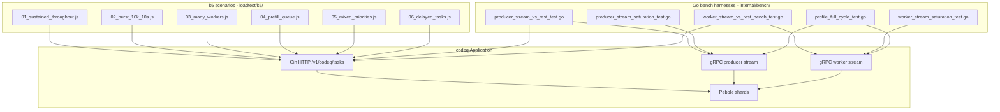
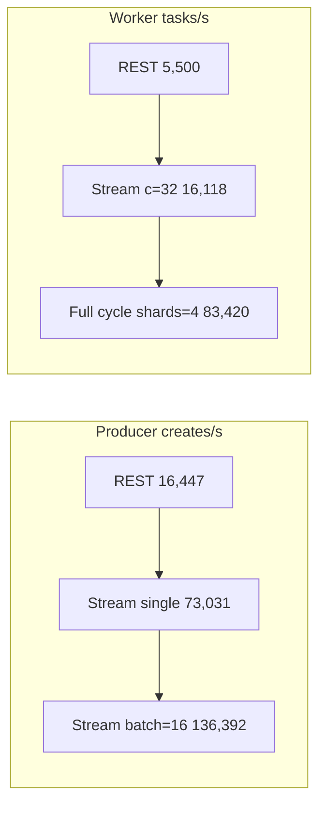

# Load testing

codeq ships two load-testing surfaces. They answer two different
questions.

| Surface | Question it answers | Where it lives |
|---|---|---|
| k6 HTTP scenarios | What does the REST API do under realistic mixed traffic on a real network? | `loadtest/k6/01..06_*.js` |
| In-process Go bench harnesses | What is the single-process ceiling for each transport, with the network removed? | `internal/bench/*_test.go` |

The Go harnesses are how every throughput number in the rest of the
docs is produced. The k6 scenarios are for regression and for showing
the REST surface in isolation; they are not the path you cite when
quoting peak numbers.

> **Note**: every number in this document is reproducible. Each table
> cites the exact test name, env knobs, and run command. The reference
> box is 12-core Linux (kernel 5.15, WSL2-compatible), Go 1.25, local
> Pebble, loopback gRPC, no fsync. Numbers come from
> `internal/bench/*_test.go` runs unless otherwise stated.

## Harness layout



## Numbers at a glance

All numbers below are from `internal/bench/*_test.go`. Run command:

```bash
go test -v -run='^TestProducerThroughput|^TestThroughput_|^TestProfile_FullCycle|^TestSaturation_' \
  -count=1 -timeout=300s ./internal/bench/...
```

| Workload | Path | Result | Harness |
|---|---|---|---|
| Producer-only | REST `POST /v1/codeq/tasks` | 16,447 creates/s | `producer_stream_vs_rest_test.go::TestProducerThroughput_RESTPath` |
| Producer-only | gRPC stream, single | 73,031 creates/s | `producer_stream_vs_rest_test.go::TestProducerThroughput_StreamPath` |
| Producer-only | gRPC stream, batch=16 | 136,392 creates/s | `producer_stream_vs_rest_test.go::TestProducerThroughput_StreamBatchPath` |
| Worker full cycle | REST claim + complete | ~5,500 tasks/s | `worker_stream_vs_rest_bench_test.go::TestThroughput_RESTPath` |
| Worker full cycle | gRPC stream, c=32 | 16,118 tasks/s | `worker_stream_vs_rest_bench_test.go::TestThroughput_StreamPath` |
| Full cycle, 4 shards, batched | gRPC stream + sharding | 83,420 tasks/s | `profile_full_cycle_test.go::TestProfile_FullCycle` (`PHASE8_SHARDS=4 PHASE6_BATCH=32 PHASE6_PROD_BATCH=8`) |

## REST vs stream — what the numbers say



Read as a progression: each arrow is the next transport mode. The
order is producer-REST → stream → batched stream, then worker-REST →
stream → full sharded cycle.

Three concrete deltas:

- **Producer REST → stream single**: 4.4x. The REST handler pays per-
  request HTTP framing, per-request JWT validation, per-request Gin
  context allocation. The stream amortizes the auth handshake across
  the session lifetime and reuses one HTTP/2 connection.
- **Stream single → stream batch=16**: 1.87x. The batch path is the
  Phase 6 producer batch API (`ProduceBatch`); one stream message
  carries 16 creates and one Pebble write batch persists them. The
  ceiling here is Pebble's group-commit coalescer, not the wire.
- **Worker REST → worker stream**: ~2.9x. REST does two round trips
  per task (`POST /tasks/claim`, then `POST /tasks/:id/result`). The
  stream collapses both into one bidirectional session and uses
  `BatchSize` to claim and complete in groups.

The headline 83,420 tasks/s for the full create→claim→complete cycle
requires three things together: producer stream batch, worker stream
batch, and `PHASE8_SHARDS=4`. Drop any one of them and the number
falls back to the matching row above.

## Running the in-process bench harnesses

Prerequisites: Go 1.25, write access to `$TMPDIR` (Pebble shards land
in `t.TempDir()`), and a free TCP loopback port range.

### Producer-only — REST vs stream

```bash
go test -v -run='^TestProducerThroughput' \
  -count=1 -timeout=180s ./internal/bench/...
```

This runs all three producer paths in
[`internal/bench/producer_stream_vs_rest_test.go`](../internal/bench/producer_stream_vs_rest_test.go).
Each path runs `phase3Duration = 6 * time.Second` with
`phase3Concurrency = 32` goroutines.

Output ends with `t.Logf` lines like:

```
REST:    created=98682  duration=6.0s  rate=16447 creates/s
STREAM:  created=438187 duration=6.0s  rate=73031 creates/s
STREAM-BATCH (size=16): created=818355 duration=6.0s  rate=136392 creates/s
```

### Worker full cycle — REST vs stream

```bash
go test -v -run='^TestThroughput_' \
  -count=1 -timeout=180s ./internal/bench/...
```

This is [`internal/bench/worker_stream_vs_rest_bench_test.go`](../internal/bench/worker_stream_vs_rest_bench_test.go).
Both tests share `runProducer()` to keep the queue topped up while a
worker pool drains. Concurrency is `phase2WorkerConcurrency = 32` and
window is `phase2RunDuration = 6 * time.Second`.

REST does two HTTP calls per task; the stream worker uses the
`workerclient` SDK with one persistent session.

### Saturation sweeps — find the per-process ceiling

Producer saturation:

```bash
go test -v -run='^TestSaturation_ProducerStreamPath' \
  -count=1 -timeout=300s ./internal/bench/...
```

Worker saturation:

```bash
PHASE6_BATCH=32 go test -v -run='^TestSaturation_StreamPath' \
  -count=1 -timeout=300s ./internal/bench/...
```

Both sweep concurrencies `{1, 4, 16, 32, 64, 128, 256, 512}` and log
one row per step. Use them to find where the curve plateaus on your
hardware — the plateau location identifies the bottleneck (claim path,
Pebble write loop, or gRPC framing).

See [`internal/bench/producer_stream_saturation_test.go`](../internal/bench/producer_stream_saturation_test.go)
and [`internal/bench/worker_stream_saturation_test.go`](../internal/bench/worker_stream_saturation_test.go).

### Full cycle with profiling

The canonical "everything wired, profiles attached" harness is
[`internal/bench/profile_full_cycle_test.go`](../internal/bench/profile_full_cycle_test.go).
It runs producer stream + worker stream at saturation for a 20 s
window after a 2 s warmup, then writes CPU, alloc, heap, block, mutex,
and goroutine pprof profiles to `/tmp/codeq-profiles/`.

```bash
PHASE8_SHARDS=4 PHASE6_BATCH=32 PHASE6_PROD_BATCH=8 \
  go test -v -run='^TestProfile_FullCycle' \
  -count=1 -timeout=180s ./internal/bench/...
```

Inspect the profiles:

```bash
go tool pprof -top -cum /tmp/codeq-profiles/cpu.pb.gz
go tool pprof -alloc_space -top -cum /tmp/codeq-profiles/alloc.pb.gz
go tool pprof -top -cum /tmp/codeq-profiles/block.pb.gz
go tool pprof -top -cum /tmp/codeq-profiles/mutex.pb.gz
```

Env knobs the harness reads:

- `PHASE8_SHARDS` — number of independent Pebble shards (Phase 8
  sharding). Unset or `1` means single-shard.
- `PHASE6_BATCH` — worker `BatchSize`. `0` means single-task.
- `PHASE6_PROD_BATCH` — producer `ProduceBatch` size per goroutine.
  `0` or `1` means `Produce` (one create per send).

## Phase 8 sharding sweep

`numShards > 1` opens N independent Pebble instances inside one
process, hashing tasks by ID across them. Phase 8 added this as a
single-machine scale-out path (cluster mode is the multi-machine
counterpart and is mutually exclusive with shards).

Sweep results, full cycle, batched stream paths, 20 s window:

| `PHASE8_SHARDS` | Throughput | Notes |
|---|---|---|
| 1 | 42,000 tasks/s | Single Pebble instance. Group-commit coalescer carries the write side. |
| 2 | 65,000 tasks/s | 1.55x over single shard. Write loop contention starts to ease. |
| 4 | **83,000 tasks/s** | Sweet spot on a 12-core box. Producer and worker batch paths both saturate. |
| 6 | 68,000 tasks/s | Past the knee. Worker scheduling overhead climbs. |
| 8 | 67,000 tasks/s | Diminishing returns. CPU is now shared across more compaction goroutines. |

Reproduce one step:

```bash
PHASE8_SHARDS=4 PHASE6_BATCH=32 PHASE6_PROD_BATCH=8 \
  go test -v -run='^TestProfile_FullCycle' \
  -count=1 -timeout=180s ./internal/bench/...
```

The recommended single-node default is `numShards: 4`. Going higher
costs more compaction CPU than it returns in throughput on a 12-core
box. On bigger machines (24+ cores) the knee shifts right — re-run
the sweep before changing the default.

## Running k6 scenarios (local)

Start a local stack:

```bash
docker compose \
  -f deploy/docker-compose/local-dev/compose.yaml \
  -f deploy/docker-compose/local-dev/compose.override.yaml \
  up -d

docker compose \
  -f deploy/docker-compose/local-dev/compose.yaml \
  -f deploy/docker-compose/local-dev/compose.override.yaml \
  --profile obs up -d   # optional: Prometheus + Grafana
```

Run a scenario:

```bash
docker compose \
  -f deploy/docker-compose/local-dev/compose.yaml \
  -f deploy/docker-compose/local-dev/compose.override.yaml \
  --profile loadtest run --rm k6 run /scripts/01_sustained_throughput.js
```

### Environment variables

Scripts in [`loadtest/k6/`](../loadtest/k6/) default `CODEQ_BASE_URL`
to `http://localhost:8080`. When you run k6 via the local Compose
stack, the `k6` service in `deploy/docker-compose/local-dev/compose.yaml`
sets `CODEQ_BASE_URL` to `http://codeq:8080` so the container can
reach the `codeq` service on the compose network. Override by setting
env vars before running `docker compose`:

- `CODEQ_BASE_URL` (script default: `http://localhost:8080`; compose
  default inside loadtest container: `http://codeq:8080`)
- `CODEQ_PRODUCER_TOKEN` (default: `dev-token`)
- `CODEQ_WORKER_TOKEN` (default: `dev-token`)
- `CODEQ_COMMANDS` (default: `GENERATE_MASTER`)

Scenario scripts also accept:

- `RATE`, `DURATION`
- `WORKER_VUS`
- `CLAIM_P99_MS` (used by `01_sustained_throughput.js`)
- `TASKS`, `VUS` (used by `04_prefill_queue.js`)

### Scenarios

| Script | What it exercises |
|---|---|
| [`01_sustained_throughput.js`](../loadtest/k6/01_sustained_throughput.js) | Constant `RATE` for `DURATION`, mixed producers + workers. p95 SLO via `CLAIM_P99_MS`. |
| [`02_burst_10k_10s.js`](../loadtest/k6/02_burst_10k_10s.js) | 10,000 tasks injected in 10 s; measures drain latency. |
| [`03_many_workers.js`](../loadtest/k6/03_many_workers.js) | High `WORKER_VUS`; surfaces claim-path contention. |
| [`04_prefill_queue.js`](../loadtest/k6/04_prefill_queue.js) | Pre-load `TASKS` items, then start workers. Cold start drain. |
| [`05_mixed_priorities.js`](../loadtest/k6/05_mixed_priorities.js) | High/normal/low priority mix; checks priority ordering. |
| [`06_delayed_tasks.js`](../loadtest/k6/06_delayed_tasks.js) | Schedule-then-deliver path via `MoveDueDelayed`. |

> **Note**: k6 tops out at ~2k req/s in the published baselines
> ([`docs/30-performance-baselines.md`](./30-performance-baselines.md)).
> That is the HTTP path on a 4-vCPU host with a Redis backend. For
> peak Pebble + stream numbers use the Go harnesses above.

## Measuring and interpreting results

- k6 reports request latency percentiles and error rates directly.
- `/metrics` (Prometheus) gives the server-side view; correlate
  k6 traffic with:
  - `codeq_task_created_total`
  - `codeq_task_claimed_total`
  - `codeq_task_completed_total`
  - `codeq_queue_depth{command=...,queue=...}`
- `/v1/codeq/admin/queues/:command` validates queue depth and backlog
  behavior during a run.

For the Go harnesses, the only output is the `t.Logf` line at the end
of each test. There is no Prometheus scrape because the harness runs
in-process; use the profile cycle test if you need pprof data.

## Where each number in the docs comes from

| Claim | Source |
|---|---|
| 83k tasks/s full cycle | `internal/bench/profile_full_cycle_test.go::TestProfile_FullCycle` (`PHASE8_SHARDS=4 PHASE6_BATCH=32 PHASE6_PROD_BATCH=8`) |
| 136k creates/s producer batch | `internal/bench/producer_stream_vs_rest_test.go::TestProducerThroughput_StreamBatchPath` |
| 16k tasks/s worker stream | `internal/bench/worker_stream_vs_rest_bench_test.go::TestThroughput_StreamPath` |
| Shard sweep 42k/65k/83k/68k/67k | `internal/bench/profile_full_cycle_test.go::TestProfile_FullCycle` (`PHASE8_SHARDS=1,2,4,6,8`) |
| k6 1-2k req/s envelope | [`docs/30-performance-baselines.md`](./30-performance-baselines.md) |

Add a new number to this catalog whenever you cite one in another
doc. Estimates and "blazing fast" are forbidden — see
[`_STYLE.md` § 7](./_STYLE.md#7-numbers-must-come-from-measurement).

## See also

- [Performance tuning](./17-performance-tuning.md) — shard counts,
  batch sizes, fsync trade-offs.
- [Performance baselines](./30-performance-baselines.md) — raw bench
  output and per-release history.
- [Streaming API guide](./34-streaming-api-guide.md) — producer and
  worker gRPC stream contracts that the bench harnesses drive.
- [Troubleshooting](./28-troubleshooting.md) — when numbers regress,
  start here.
