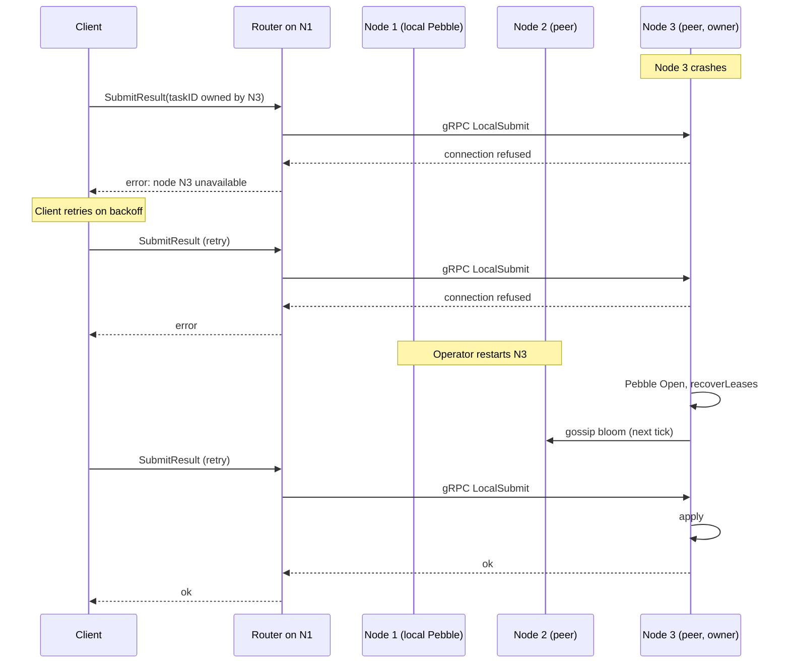
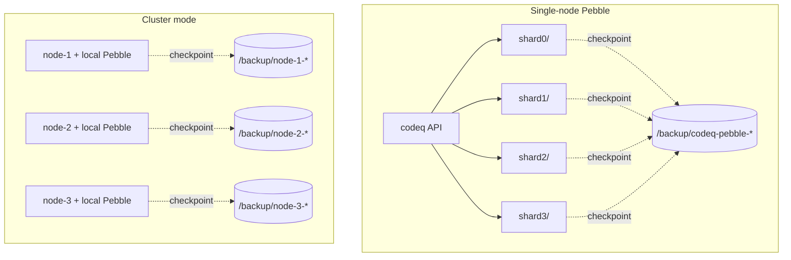

# Operational Runbooks

This document provides step-by-step operational runbooks for common tasks. Each
runbook is designed so that operators can follow the procedures during incidents,
maintenance windows, or routine operations without needing deep system knowledge.

For metric definitions see [Operations](10-operations.md). For troubleshooting
specific symptoms see [Troubleshooting](28-troubleshooting.md). For performance
optimization see [Performance Tuning](17-performance-tuning.md).

---

## 1. Incident Response Runbook

### 1.1 Queue Backup Triage (Pending Queue Growing)

**When to use:** `codeq_queue_depth{queue="ready"}` exceeds your threshold or
the `ReadyQueueBacklog` alert fires.

**Diagnosis:**

```promql
# Current ready queue depth by command
max by (command) (codeq_queue_depth{queue="ready"})

# Claim rate — are workers consuming tasks?
sum by (command) (rate(codeq_task_claimed_total[5m]))

# Creation rate — is the backlog growing faster than claims?
sum by (command) (rate(codeq_task_created_total[5m]))
```

**Procedure:**

1. Check if workers are running and claiming tasks:

   ```bash
   # Verify at least one worker is polling
   curl -s http://<api-host>:8080/metrics | grep codeq_task_claimed_total
   ```

2. Compare creation rate vs claim rate. If creation exceeds claims, the
   backlog will grow:

   ```promql
   sum by (command) (rate(codeq_task_created_total[5m]))
   -
   sum by (command) (rate(codeq_task_claimed_total[5m]))
   ```

3. If workers are running but not claiming, verify the `command` value
   matches between task creation and worker poll:

   ```bash
   # Check what commands have tasks in the ready queue
   curl -s http://<api-host>:8080/metrics | grep 'codeq_queue_depth{.*queue="ready"}'
   ```

4. If workers are claiming but backlog still grows, scale workers
   horizontally (see [§3.2 Worker Scaling](#32-worker-scaling-based-on-queue-depth)).

5. If the backlog is caused by a temporary spike, verify it drains once
   the spike ends. No action needed if the steady-state claim rate
   exceeds the creation rate.

**Escalation:** If the backlog does not decrease after adding workers,
investigate Pebble I/O performance ([§1.4](#14-lease-expiration-spike-response))
and worker processing times.

---

### 1.2 DLQ Overflow Handling

**When to use:** `codeq_dlq_depth` exceeds your threshold or the
`DLQGrowth` alert fires.

**Diagnosis:**

```promql
# DLQ depth by command
max by (command) (codeq_dlq_depth)

# Failure rate — how fast are tasks failing?
sum by (command) (rate(codeq_task_completed_total{status="FAILED"}[5m]))

# Failure ratio
sum by (command) (rate(codeq_task_completed_total{status="FAILED"}[5m]))
/
sum by (command) (rate(codeq_task_completed_total[5m]))
```

**Procedure:**

1. **Investigate** — Identify why tasks are failing:

   ```bash
   # List failed tasks
   curl -s http://<api-host>:8080/v1/codeq/admin/tasks?status=FAILED | jq .
   ```

2. **Inspect** individual failed tasks for error details:

   ```bash
   curl -s http://<api-host>:8080/v1/codeq/tasks/<task-id> | jq '{status, resultCode, resultPayload}'
   ```

3. **Fix** the root cause (worker bug, malformed payload, downstream
   service outage).

4. **Retry** — Requeue tasks from the DLQ after the root cause is
   resolved:

   ```bash
   # Requeue a specific failed task
   curl -X POST http://<api-host>:8080/v1/codeq/tasks/<task-id>/requeue \
     -H "Authorization: Bearer <token>"
   ```

5. **Purge** — If tasks are unrecoverable (e.g., malformed payloads),
   remove them:

   ```bash
   # Purge expired/unrecoverable tasks
   curl -X POST http://<api-host>:8080/v1/codeq/admin/tasks/cleanup \
     -H "Authorization: Bearer <token>" \
     -H "Content-Type: application/json" \
     -d '{"limit": 100}'
   ```

6. **Verify** DLQ depth is decreasing:

   ```promql
   max by (command) (codeq_dlq_depth)
   ```

**Escalation:** If failure rate remains high after the fix, check for
systemic issues in downstream services or review worker error handling
logic.

---

### 1.3 Worker Starvation Diagnosis

**When to use:** Tasks are in the ready queue but `codeq_task_claimed_total`
rate is zero or near zero.

**Diagnosis:**

```promql
# Ready queue has tasks but no claims
max by (command) (codeq_queue_depth{queue="ready"}) > 0
  and on (command)
sum by (command) (rate(codeq_task_claimed_total[5m])) == 0
```

**Procedure:**

1. Verify workers are running:

   ```bash
   # Check for active worker connections (from worker host)
   curl -s http://<api-host>:8080/healthz
   ```

2. Confirm workers are polling the correct `command`:

   ```bash
   # Check which commands have ready tasks
   curl -s http://<api-host>:8080/metrics | grep 'codeq_queue_depth{.*queue="ready"}'
   ```

3. Check worker logs for connection or authentication errors:

   ```bash
   # On the worker host, check recent logs
   journalctl -u codeq-worker --since "10 minutes ago" --no-pager
   ```

4. Verify network connectivity between workers and the API:

   ```bash
   # From the worker host
   curl -sf http://<api-host>:8080/healthz && echo "OK" || echo "UNREACHABLE"
   ```

5. Check for rate limiting rejections on the worker scope:

   ```promql
   sum by (operation) (rate(codeq_rate_limit_hits_total{scope="worker"}[5m]))
   ```

6. If workers are rate-limited, increase the worker rate limit
   configuration (see [Operations § Rate Limiting](10-operations.md#rate-limiting)).

**Escalation:** If workers are running, connected, polling the correct
command, and not rate-limited, investigate Pebble store health and
performance.

---

### 1.4 Lease Expiration Spike Response

**When to use:** `codeq_lease_expired_total` rate increases above baseline
or the `LeaseExpirySpiking` alert fires.

**Diagnosis:**

```promql
# Lease expiration rate
sum by (command) (rate(codeq_lease_expired_total[5m]))

# Compare with in-progress queue depth
max by (command) (codeq_queue_depth{queue="in_progress"})
```

**Procedure:**

1. Determine the affected command(s):

   ```bash
   curl -s http://<api-host>:8080/metrics | grep codeq_lease_expired_total
   ```

2. Check if workers are crashing or becoming unresponsive:

   ```bash
   # On the worker host, check for OOM kills or crashes
   dmesg | grep -i "oom\|killed" | tail -20
   journalctl -u codeq-worker --since "30 minutes ago" --no-pager | grep -i "panic\|fatal\|error"
   ```

3. If tasks take longer than the configured lease timeout, increase
   `leaseTimeout` in `config.yml`:

   ```yaml
   leaseTimeout: 120  # seconds — increase based on observed task duration
   ```

4. Restart the API to pick up the configuration change:

   ```bash
   systemctl restart codeq-api
   ```

5. Monitor lease expirations to confirm the spike subsides:

   ```promql
   sum by (command) (rate(codeq_lease_expired_total[5m]))
   ```

6. If workers are crashing due to resource exhaustion, add resource
   monitoring and consider scaling worker hosts.

**Escalation:** Persistent lease expirations despite configuration
changes indicate a deeper worker stability issue. Review worker
application logs and host-level resource metrics.

---

## 2. Maintenance Runbook

### 2.1 Rolling Upgrade with Zero Downtime

**When to use:** Deploying a new version of codeQ API.

**Prerequisites:**
- New binary or container image available
- Configuration validated against the new version
- At least 2 API instances running behind a load balancer

**Procedure:**

1. **Verify** current system health before starting:

   ```bash
   # Confirm all instances are healthy
   for host in api-1 api-2 api-3; do
     echo "$host: $(curl -sf http://$host:8080/healthz | jq -r .status)"
   done
   ```

2. **Drain** the first instance from the load balancer:

   ```bash
   # Remove instance from load balancer (example: nginx upstream)
   # Edit the upstream config to comment out api-1, then reload
   nginx -s reload
   ```

3. **Wait** for in-flight requests to complete (30-60 seconds):

   ```bash
   sleep 60
   ```

4. **Upgrade** the instance:

   ```bash
   # Stop the service
   systemctl stop codeq-api

   # Replace the binary (or pull new image)
   cp /path/to/new/codeq /usr/local/bin/codeq

   # Start the service
   systemctl start codeq-api
   ```

5. **Verify** the upgraded instance is healthy:

   ```bash
   curl -sf http://api-1:8080/healthz | jq .
   ```

6. **Re-add** the instance to the load balancer and reload:

   ```bash
   nginx -s reload
   ```

7. **Monitor** for errors after re-adding:

   ```promql
   # Watch for elevated error rates
   sum by (command, status) (rate(codeq_task_completed_total{status="FAILED"}[1m]))
   ```

8. **Repeat** steps 2-7 for each remaining instance.

9. **Verify** full cluster health after all instances upgraded:

   ```bash
   for host in api-1 api-2 api-3; do
     echo "$host: $(curl -sf http://$host:8080/healthz | jq -r .status)"
   done
   ```

**Rollback:** If the upgraded instance fails health checks, stop it,
restore the previous binary, and start it again. Do not proceed with
other instances until the issue is resolved.

---

### 2.2 Pebble Maintenance Window

For Pebble-store maintenance (binary upgrade, durability flag change,
compaction tuning, data-directory move), follow [§6 Pebble Single-Node
Runbook](#6-pebble-single-node-runbook). The procedures there cover
controlled restart, backup, and recovery — Pebble runs in-process, so
"maintenance" is always coupled to a codeq restart, with no separate
daemon to bounce.

---

### 2.3 Certificate Rotation for JWT / JWKS

**When to use:** JWT signing certificates are expiring or compromised and
need rotation.

**Prerequisites:**
- New signing key generated
- Updated JWKS endpoint or key file available
- See [Security](09-security.md) for authentication configuration

**Procedure:**

1. **Generate** a new signing key (if not already done):

   ```bash
   # Example: generate RSA key pair
   openssl genrsa -out new-signing-key.pem 2048
   openssl rsa -in new-signing-key.pem -pubout -o new-public-key.pem
   ```

2. **Update** the JWKS endpoint or key file to include both the old and
   new keys (overlap period):

   ```bash
   # Add the new public key to your JWKS endpoint or key file
   # Both old and new keys should be valid during the transition
   ```

3. **Update** codeQ configuration to reference the new key:

   ```yaml
   # config.yml
   auth:
     jwksUrl: "https://auth.example.com/.well-known/jwks.json"
     # Or for file-based keys:
     # jwtPublicKeyFile: "/etc/codeq/new-public-key.pem"
   ```

4. **Rolling restart** the API instances to pick up the new configuration
   (follow [§2.1 Rolling Upgrade](#21-rolling-upgrade-with-zero-downtime)).

5. **Verify** authentication still works:

   ```bash
   # Test with a token signed by the new key
   curl -sf -H "Authorization: Bearer <new-token>" \
     http://<api-host>:8080/v1/codeq/tasks?command=test | jq .
   ```

6. **Remove** the old key from the JWKS endpoint after all tokens signed
   with the old key have expired.

7. **Confirm** no authentication failures in logs or metrics.

---

### 2.4 Configuration Changes with Validation

**When to use:** Modifying `config.yml` in a running environment.

**Procedure:**

1. **Backup** the current configuration:

   ```bash
   cp /etc/codeq/config.yml /etc/codeq/config.yml.bak.$(date +%Y%m%d%H%M%S)
   ```

2. **Edit** the configuration file:

   ```bash
   vi /etc/codeq/config.yml
   ```

3. **Validate** YAML syntax:

   ```bash
   python3 -c "import yaml; yaml.safe_load(open('/etc/codeq/config.yml'))" && echo "Valid YAML"
   ```

4. **Apply** the configuration with a rolling restart
   (follow [§2.1 Rolling Upgrade](#21-rolling-upgrade-with-zero-downtime)).

5. **Verify** the API starts correctly with the new configuration:

   ```bash
   curl -sf http://<api-host>:8080/healthz | jq .
   ```

6. **Monitor** for any adverse effects:

   ```promql
   # Check for elevated error rates after config change
   sum(rate(codeq_task_completed_total{status="FAILED"}[5m]))
   ```

**Rollback:** Restore the backup and restart:

```bash
cp /etc/codeq/config.yml.bak.<timestamp> /etc/codeq/config.yml
systemctl restart codeq-api
```

---

## 3. Scaling Runbook

### 3.1 Horizontal Scaling (Add / Remove API Instances)

**When to use:** API response latency is high or you need to handle more
concurrent requests.

**Prerequisites:**
- Note: codeq nodes are stateful — each owns its local Pebble store. Use
  cluster mode ([§8](#8-cluster-multi-node-runbook)) to add nodes to the
  consistent-hash ring; the wire protocol routes requests by task ID.
- Load balancer in front of API instances

**Adding an instance:**

1. **Deploy** a new codeQ instance with the same configuration:

   ```bash
   # On the new host — copy config from an existing instance
   scp <existing-host>:/etc/codeq/config.yml /etc/codeq/config.yml
   systemctl start codeq-api
   ```

2. **Verify** the new instance is healthy:

   ```bash
   curl -sf http://<new-host>:8080/healthz | jq .
   ```

3. **Add** the instance to the load balancer:

   ```bash
   # Add new-host to the upstream config, then reload
   nginx -s reload
   ```

4. **Verify** traffic is flowing to the new instance:

   ```promql
   # Check that the new instance is being scraped
   up{instance="<new-host>:8080"}
   ```

**Removing an instance:**

1. **Drain** the instance from the load balancer:

   ```bash
   # Remove host from upstream config, then reload
   nginx -s reload
   ```

2. **Wait** for in-flight requests to complete:

   ```bash
   sleep 60
   ```

3. **Stop** the instance:

   ```bash
   systemctl stop codeq-api
   ```

4. **Verify** remaining instances are healthy and handling the load:

   ```promql
   # Confirm no increase in error rate
   sum(rate(codeq_task_completed_total{status="FAILED"}[5m]))
   ```

---

### 3.2 Worker Scaling Based on Queue Depth

**When to use:** Ready queue depth is consistently above your target
threshold.

**Decision metrics:**

```promql
# Current ready queue depth
max by (command) (codeq_queue_depth{queue="ready"})

# Current claim throughput
sum by (command) (rate(codeq_task_claimed_total[5m]))

# Average task processing time
sum by (command) (rate(codeq_task_processing_latency_seconds_sum{status="COMPLETED"}[5m]))
/
sum by (command) (rate(codeq_task_processing_latency_seconds_count{status="COMPLETED"}[5m]))
```

**Scaling guidelines:**

| Queue depth | Action |
|---|---|
| < 100 | Normal operations, no action |
| 100-1000 | Monitor trend; scale if sustained >10 min |
| 1000-10000 | Add 2-4 worker instances |
| > 10000 | Add 5+ worker instances; investigate root cause |

**Procedure:**

1. **Calculate** the required number of workers:

   ```
   required_workers = creation_rate / (1 / avg_processing_time)
   ```

2. **Deploy** additional worker instances:

   ```bash
   # On each new worker host
   systemctl start codeq-worker
   ```

3. **Verify** workers are claiming tasks:

   ```promql
   sum by (command) (rate(codeq_task_claimed_total[1m]))
   ```

4. **Monitor** queue depth to confirm it is decreasing:

   ```promql
   max by (command) (codeq_queue_depth{queue="ready"})
   ```

5. **Scale down** when queue depth stabilizes below threshold. Stop
   excess workers gracefully:

   ```bash
   systemctl stop codeq-worker
   ```

---

### 3.3 Scaling the Persistence Layer

codeq does not scale by adding replicas to a shared store — Pebble is
in-process and exclusively locked to one codeq node. Two scaling
paths exist:

- **Vertical / intra-process**: increase `persistenceConfig.numShards`
  (Phase 8) to parallelise the commit pipeline and compaction across N
  Pebble instances under one codeq process. Sweet spot on a 12-core
  box is 4 shards (`83,420 tasks/s`, `internal/bench/profile_full_cycle_test.go::TestProfile_FullCycle`).
  Detailed procedure in [§7 Phase 8 Intra-Process Sharding Runbook](#7-phase-8-intra-process-sharding-runbook).

- **Horizontal / cluster**: enable `cluster.enabled=true` to run N codeq
  nodes each with its own Pebble store, joined by a consistent-hash
  ring. Detailed procedure in [§8 Cluster Runbook](#8-cluster-multi-node-runbook).

Cluster mode and `numShards > 1` are mutually exclusive in the current
release; the startup path rejects the combination. Pick the one that
matches your bottleneck.

---

## 4. Monitoring & Alerting Runbook

### 4.1 Prometheus Alert Response Procedures

The alerting rules are defined in
`deploy/docker-compose/local-dev/alerting-rules.yml`. Below are
response procedures for each alert.

| Alert | Severity | Response |
|---|---|---|
| `DLQGrowthWarning` | warning | Investigate DLQ ([§1.2](#12-dlq-overflow-handling)) |
| `DLQGrowthCritical` | critical | Immediately investigate DLQ ([§1.2](#12-dlq-overflow-handling)) |
| `ReadyQueueBacklog` | warning | Triage queue backup ([§1.1](#11-queue-backup-triage-pending-queue-growing)) |
| `HighTaskFailureRate` | critical | Check worker logs, review failed tasks |
| `SlowTaskProcessing` | warning | Review [Performance Tuning](17-performance-tuning.md) |
| `LeaseExpirySpiking` | warning | Follow lease expiration procedure ([§1.4](#14-lease-expiration-spike-response)) |
| `NoClaimsDespiteReadyQueue` | critical | Diagnose worker starvation ([§1.3](#13-worker-starvation-diagnosis)) |
| `WebhookFailureRate` | warning | Check subscriber endpoints ([Webhooks](12-webhooks.md)) |
| `SustainedRateLimiting` | warning | Review rate limit config ([Operations](10-operations.md#rate-limiting)) |
| `TargetDown` | critical | Verify instance is running, check network |

**General alert response workflow:**

1. **Acknowledge** the alert in your alerting system.
2. **Diagnose** using the linked runbook section.
3. **Act** — follow the procedure to resolve.
4. **Verify** metrics return to normal.
5. **Document** the incident and any follow-up actions.

---

### 4.2 Grafana Dashboard Interpretation

Import the example dashboard from `docs/grafana/codeq-dashboard.json`.

**Key panels and what they show:**

| Panel | What to look for |
|---|---|
| Queue depth | Sustained growth indicates workers cannot keep up |
| Task throughput | Creation rate should roughly match claim + completion rates |
| DLQ depth | Any growth requires investigation |
| Processing latency (p95) | Spikes may indicate Pebble I/O slowness or worker issues |
| Webhook delivery success rate | Below 100% means subscribers are failing |
| Rate limit hits | Sustained hits may need config adjustment |

**Reading the dashboard during an incident:**

1. Open the Grafana dashboard and set the time range to cover the incident
   window.
2. Check the **Queue depth** panel first — this shows overall system health.
3. Look at **Task throughput** to understand if the issue is with creation,
   claiming, or completion.
4. Check **Processing latency** to identify if tasks are taking longer than
   expected.
5. Review **DLQ depth** for task failure patterns.

---

### 4.3 Key Metrics and Their Significance

| Metric | Significance | Healthy range |
|---|---|---|
| `codeq_queue_depth{queue="ready"}` | Tasks waiting for workers | < 100 (steady state) |
| `codeq_queue_depth{queue="in_progress"}` | Tasks being processed | Proportional to worker count |
| `codeq_dlq_depth` | Failed tasks requiring attention | 0 (ideal) |
| `codeq_task_claimed_total` rate | Worker throughput | Matches creation rate |
| `codeq_task_completed_total` rate | Task completion throughput | Matches claim rate |
| `codeq_lease_expired_total` rate | Workers failing mid-task | Near 0 |
| `codeq_webhook_deliveries_total{outcome="failure"}` rate | Webhook delivery failures | Near 0 |
| `codeq_rate_limit_hits_total` rate | Rate limit rejections | Near 0 (normal) |

**Health check PromQL queries:**

```promql
# System health snapshot — run these periodically
max by (command, queue) (codeq_queue_depth)
max by (command) (codeq_dlq_depth)
sum by (command) (rate(codeq_task_claimed_total[5m]))
sum by (command, status) (rate(codeq_task_completed_total[5m]))
sum by (command) (rate(codeq_lease_expired_total[5m]))
```

---

### 4.4 Escalation Procedures

| Level | Criteria | Action |
|---|---|---|
| L1 — On-call | Any warning alert | Follow runbook, resolve if possible |
| L2 — Engineering | Critical alert or L1 unable to resolve in 30 min | Page engineering team |
| L3 — Architecture | Systemic issue (multiple alerts, data loss risk) | Engage architecture team |

**Escalation checklist:**

- [ ] Alert acknowledged and time-stamped
- [ ] Initial diagnosis performed using relevant runbook section
- [ ] Current metric values captured (screenshot or PromQL results)
- [ ] Affected commands/queues identified
- [ ] Impact assessment (number of affected tasks, duration)
- [ ] Escalation communicated with context to the next level

---

## 5. Data Management Runbook

### 5.1 DLQ Inspection and Retry

**When to use:** Tasks are in the DLQ and need to be reviewed and
potentially retried.

**Procedure:**

1. **List** failed tasks:

   ```bash
   curl -s http://<api-host>:8080/v1/codeq/admin/tasks?status=FAILED | jq '.[] | {id, command, resultCode}'
   ```

2. **Inspect** a specific task for error details:

   ```bash
   curl -s http://<api-host>:8080/v1/codeq/tasks/<task-id> | jq .
   ```

3. **Decide** whether to retry or discard:
   - Retry if the root cause is fixed (transient error, downstream
     service restored).
   - Discard if the task payload is malformed or the task is no longer
     relevant.

4. **Retry** a task:

   ```bash
   curl -X POST http://<api-host>:8080/v1/codeq/tasks/<task-id>/requeue \
     -H "Authorization: Bearer <token>"
   ```

5. **Verify** the retried task progresses:

   ```bash
   curl -s http://<api-host>:8080/v1/codeq/tasks/<task-id> | jq .status
   ```

---

### 5.2 Task Purge Operations

**When to use:** Cleaning up old completed or failed tasks to reclaim
storage.

**Procedure:**

1. **Check** current task counts:

   ```promql
   max by (command, queue) (codeq_queue_depth)
   ```

2. **Run** cleanup with a bounded limit to control latency:

   ```bash
   curl -X POST http://<api-host>:8080/v1/codeq/admin/tasks/cleanup \
     -H "Authorization: Bearer <token>" \
     -H "Content-Type: application/json" \
     -d '{"limit": 500}'
   ```

3. **Repeat** as needed until the desired number of tasks are purged:

   ```bash
   # Loop cleanup in batches
   for i in $(seq 1 10); do
     curl -X POST http://<api-host>:8080/v1/codeq/admin/tasks/cleanup \
       -H "Authorization: Bearer <token>" \
       -H "Content-Type: application/json" \
       -d '{"limit": 500}'
     sleep 2  # Brief pause between batches
   done
   ```

4. **Verify** storage was reclaimed:

   ```bash
   # Pebble exposes per-shard stats via /debug/pebble (if enabled) and
   # via du(1) on persistenceConfig.path
   du -sh /var/lib/codeq/pebble/shard*
   ```

---

### 5.3 Backup and Restore

For the Pebble persistence path, backup is handled in [§6.1 Backup and
Restore (Pebble)](#61-backup-and-restore-pebble) — it covers online
checkpointing via `pebble.Checkpoint`, atomic directory snapshots, and
N-shard backup ordering. The procedure here would just duplicate that
content.

For multi-node cluster deployments, see [§8 Cluster Runbook](#8-cluster-multi-node-runbook)
for per-node backup considerations: each node owns its own slice of the
hash ring, so a full backup is the union of per-node snapshots taken at
roughly the same wall clock.

---

### 5.4 Data Migration Between Environments

**When to use:** Migrating task data from one environment to another
(e.g., staging to production, or between Pebble stores).

**Procedure:**

1. **Export** tasks from the source environment:

   ```bash
   # List tasks to export
   curl -s http://<source-host>:8080/v1/codeq/admin/tasks?status=COMPLETED \
     | jq . > tasks-export.json
   ```

2. **Validate** the exported data:

   ```bash
   jq 'length' tasks-export.json
   # Verify expected count
   ```

3. **Import** tasks into the target environment:

   ```bash
   # Recreate tasks in the target environment
   cat tasks-export.json | jq -c '.[]' | while read -r task; do
     curl -X POST http://<target-host>:8080/v1/codeq/tasks \
       -H "Authorization: Bearer <token>" \
       -H "Content-Type: application/json" \
       -d "$task"
   done
   ```

4. **Verify** task counts in the target environment:

   ```bash
   curl -s http://<target-host>:8080/metrics | grep codeq_queue_depth
   ```

**Note:** Bulk data movement bypassing the API isn't supported on the
Pebble path — there's no replication primitive on the LSM. For
production-scale migration, take a Pebble checkpoint of the source
node (see [§6.1](#61-backup-and-restore-pebble)) and start the target
node from that directory.

---

## 6. Pebble Single-Node Runbook

`persistenceProvider: pebble` is the only supported production backend.
Pebble is an embedded LSM that runs in-process under
`persistenceConfig.path` — operationally closer to SQLite or RocksDB
than to a database daemon: no separate process, no network port,
exclusive directory lock. See
[Storage layout (Pebble)](./07b-storage-pebble.md) for the key schema
and [Configuration](./14-configuration.md) for tunables. The runbooks
below assume `persistenceProvider: pebble`.

### 6.1 Backup and Restore (Pebble)

**When to use:** Before major maintenance, before binary upgrades that
touch the persistence schema, or as part of disaster-recovery drills.

**Backup strategies:** Pebble offers three valid options. Pick one
based on your downtime tolerance:

| Strategy | Downtime | Consistency | Tool |
|---|---|---|---|
| Pebble checkpoint (online) | None | Crash-consistent snapshot | `pebble.Checkpoint(destDir)` |
| Filesystem snapshot (online) | None | Filesystem-consistent | LVM, ZFS, EBS |
| Cold copy (offline) | Stop API | Byte-identical | `cp -a`, `rsync` |

`pebble.Checkpoint` is the recommended online path: it produces a
self-contained directory with hard-linked SSTs and a fresh `MANIFEST`.
Restore is `cp -a <checkpoint> <new-path>` and pointing
`persistenceConfig.path` at it. Concurrent writes do not invalidate
the snapshot.

**Online backup procedure (single-shard Pebble checkpoint):**

1. **Trigger** a checkpoint via the admin endpoint. The destination
   must be on the same filesystem as the live data so Pebble can
   hard-link SSTs:

   ```bash
   curl -X POST http://<api-host>:8080/v1/codeq/admin/pebble/checkpoint \
     -H "Authorization: Bearer <token>" \
     -H "Content-Type: application/json" \
     -d '{"destination": "/backup/codeq-pebble-checkpoint-'"$(date +%Y%m%d%H%M%S)"'"}'
   ```

2. **Archive** the checkpoint and the config to durable storage:

   ```bash
   tar -C /backup -czf codeq-pebble-$(date +%Y%m%d%H%M%S).tar.gz \
     codeq-pebble-checkpoint-<timestamp>/
   cp /etc/codeq/config.yml /backup/config-$(date +%Y%m%d%H%M%S).yml
   aws s3 cp codeq-pebble-*.tar.gz s3://codeq-backups/$(hostname)/
   ```

3. **Verify** the archive on a staging host monthly — backups you
   never restore are not backups. `tar -tzf` should show `OPTIONS-*`,
   `CURRENT`, `MANIFEST-*`, and `*.sst` entries.

**Offline backup (cold copy):** stop the API, `rsync -aHAX` the data
directory, restart. Do **not** copy a live Pebble directory with plain
`cp` outside of a checkpoint or filesystem snapshot — Pebble rewrites
the `MANIFEST` and active `*.sst` concurrently and a torn copy fails to
open with `corruption: missing files referenced by manifest`.

**Restore procedure:** stop the API, move the existing directory
aside (do not delete until restore is verified), extract the backup
into place, fix ownership, start the API. The log should show `pebble
open`, `recover seq`, and `recoverLeases` succeed in under a second.

```bash
systemctl stop codeq-api
mv /var/lib/codeq/pebble /var/lib/codeq/pebble.broken-$(date +%Y%m%d%H%M%S)
tar -C /var/lib/codeq -xzf /backup/codeq-pebble-<timestamp>.tar.gz
mv /var/lib/codeq/codeq-pebble-checkpoint-<timestamp> /var/lib/codeq/pebble
chown -R codeq:codeq /var/lib/codeq/pebble
systemctl start codeq-api
curl -s http://<api-host>:8080/metrics | grep codeq_queue_depth
```

**Rollback:** the original directory is at `pebble.broken-<timestamp>`.
Stop the API, swap them back, restart.

---

### 6.2 Disk Full and Corruption Recovery

**When to use:** the API logs `pebble: out of disk space`, `corruption:
...`, or refuses to start with `pebble open: ...`.

**Disk full (`no space left on device`):** Pebble blocks writes when
the volume fills — the memtable can't flush and compactions can't run.
Free space outside the Pebble directory first (journals, log archives,
cores — don't touch SSTs by hand), then grow the volume (`lvextend`,
`aws ec2 modify-volume`, `resize2fs`). Pebble has no shrink path —
reclaim only happens when compactions drop superseded SSTs. Restart
the API once headroom is available.

> **Performance**: provision Pebble volumes at 2x the steady-state
> on-disk size. Compaction needs room for the new SST before the old
> one is dropped, and a checkpoint hard-links every live SST into a
> second directory tree until you archive it.

**Corruption (symptom: `pebble open: corruption: ...`):**

Corruption comes from torn power-loss writes, a failing disk, or a
checkpoint copied while writes were in flight (see §6.1). Pebble
refuses to open in this state.

1. **Capture** the exact error: `journalctl -u codeq-api --no-pager |
   grep -A5 "pebble open"`.

2. **Run** `pebble db check /var/lib/codeq/pebble` if the pebble CLI is
   installed.

3. **Recover** from the most recent backup (§6.1 restore procedure).
   This is the supported path — there is no in-place repair for
   corruption the LSM cannot self-heal.

4. **WAL-only fallback (last resort, no backup):** if only the latest
   `*.log` is corrupt, move it aside (`mv .../000123.log /tmp/`) and
   restart. This loses every task in that WAL — usually the last few
   seconds of writes — and is **at-most-once for that window**.

> **Warning**: prefer restore-from-backup. WAL truncation creates tasks
> that producers believe succeeded but that codeq never persists.

---

### 6.3 Lease Recovery After Crash

**When to use:** the codeq process exited unexpectedly (panic, OOM,
kernel kill, host reboot) and you need to understand what happens to
tasks that were `IN_PROGRESS` at the time.

**Background:**

The Pebble backend keeps the lease table in memory only (see
[`internal/repository/pebble/lease_table.go`](../internal/repository/pebble/lease_table.go)).
Phase 6 / M2 dropped the `KeyLease` write per Claim and the `KeyLease`
Get per reaper tick. The trade-off is volatility — a crash empties
the table. The on-disk inprog index
(`codeq/q/<cmd>/<tenant>/inprog/`) plus each task body's `LeaseUntil`
timestamp are the source of truth.

On `Open()` the task repository runs `recoverLeases()`: scan every key
under `codeq/q/` for the `/inprog/` segment, fetch the task body,
parse `LeaseUntil`, and seed the in-memory lease table with
`(taskID, workerID, command, tenantID, untilUnix)`. Tasks whose
`LeaseUntil` is still in the future re-enter as live leases — the
original worker can submit results normally. Tasks past `LeaseUntil`
land as expired entries; the reaper's first sweep Nacks them through
the same path it uses in normal operation. From the worker's
perspective a crash is indistinguishable from "the reaper noticed the
expiry one tick later".

**Procedure (post-crash):**

1. **Restart** the process — lease rebuild is automatic. Confirm with
   `journalctl -u codeq-api | grep -E "pebble open|recover seq"`.

2. **Wait** one reaper tick (default 5s,
   `ReaperOptions.LeaseSweepInterval`). Expired leases are Nacked and
   re-queued for the next polling worker.

3. **Verify** `rate(codeq_lease_expired_total[1m])` normalises. A
   short spike right after restart is expected — it represents
   workers that crashed alongside the API.

**Recovery handles transparently:** worker still alive (lease
re-seeded), worker dead (lease re-seeded, reaper Nacks on expiry),
corrupt task body (entry skipped, TTL sweep trims later).

**Recovery does not handle:** Pebble itself failing to open (§6.2), a
panic mid-scan (idempotent — next restart re-runs from scratch).

> **Note**: recovery is linear in inprog queue size. ~10k inprog
> tasks recover in under 100ms on the reference box. Millions of
> inprog tasks add multi-second startup latency before the API
> accepts traffic.

---

### 6.4 Compaction Tuning

**When to use:** sustained write amplification is high, the on-disk
size grows faster than expected, or background compactions cause
visible latency spikes.

**Defaults:** codeq runs Pebble close to LevelDB defaults with two
overrides — a 256 MiB block cache and a per-level bloom filter (10
bits/key, `TableFilter`) so negative `KeyTask` lookups miss without
touching SSTs. Memtable size, level multiplier, compaction
concurrency, and target file sizes use Pebble defaults. This fits
codeq's workload (small values, high churn, frequent reaper deletes).

**Observability:** Pebble does not export Prometheus metrics directly.
Watch `du -sh /var/lib/codeq/pebble` over time, the SST count
(`ls .../*.sst | wc -l` — high means L0 backed up), the WAL count
(`*.log` — high means memtables aren't flushing), and
`codeq_task_create_latency_seconds` p99 (spikes correlate with stalls).

**Symptoms and tuning:**

| Symptom | Likely cause | Action |
|---|---|---|
| Steady on-disk growth, low write rate | Reaper not deleting completed tasks | Confirm TTL sweep is running; reduce `Tasks.TTL` |
| Spiky p99 every few minutes | Background compaction stalls writes | Enable `numShards > 1` to parallelise compactions |
| Disk usage 5x logical | Many tombstones not yet compacted | Wait — compactions will catch up; consider a manual checkpoint+restore to force a major compaction if growth is unbounded |
| High WAL count | Memtable flush trailing writes | Likely a slow disk; check `iostat -x 1` for `%util` |

**When to shard:** the biggest compaction lever is `numShards`.
Running 4 shards in one process parallelises 4 independent compaction
pipelines. On the reference box that's the difference between 42k
tasks/s single-shard and 83k tasks/s 4-shard for the full
create→claim→complete cycle
(`internal/bench/profile_full_cycle_test.go::TestProfile_FullCycle`,
`PHASE8_SHARDS=4`). See §7 for shard operations.

> **Performance**: do not enable `fsyncOnCommit` unless your durability
> requirement demands it. NoSync commit relies on the OS page cache
> and survives `kill -9` of the codeq process; only host power loss
> can lose the last in-flight commit. Enabling fsync costs ~20%
> throughput in the harness and pushes p99 latency from ~1ms to ~10ms.

---

## 7. Phase 8 Intra-Process Sharding Runbook

`numShards > 1` opens N independent Pebble instances under
`<path>/shard<i>/` and routes every key by `hash(taskID) % N`. The
sharded repositories fan reads across all shards (Claim is a parallel
scatter-gather) and write to exactly one (Produce, Complete). Reapers
are per-shard.

Design rationale: [Sharding](./06-sharding.md) and the
[intra-process sharding HLD](./24-queue-sharding-hld.md). This section
is operational only.

### 7.1 Changing `numShards` Safely

**When to use:** scaling up from `numShards: 1` to `numShards: 4`, or
adjusting the shard count after a hardware change.

> **Warning**: changing `numShards` is **destructive to in-flight
> data**. The key router (`hash(taskID) % N`) changes its output when
> N changes, so tasks written under N=1 are no longer addressable
> under N=4. There is no online resharding — codeq does not migrate
> existing data into the new shard layout.

**Three viable strategies:**

| Strategy | Downtime | Data loss | When to use |
|---|---|---|---|
| Drain then redeploy | Drain window (~minutes) | None | Production, low queue depth |
| Full restart with backup | API restart (~seconds) | None if backup restored | Production, manageable queue depth |
| Wipe and redeploy | API restart | All historical tasks | Dev, staging, recoverable workloads |

**Procedure (drain then redeploy — safest):**

1. **Stop** producers (gateway deny rule or sharp rate-limit cut).

2. **Wait** for ready + in-progress depth to reach zero:

   ```promql
   sum by (command) (codeq_queue_depth{queue=~"ready|in_progress"}) == 0
   ```

3. **Stop** the API, **back up** the old directory (§6.1), then move
   it aside and recreate:

   ```bash
   systemctl stop codeq-api
   mv /var/lib/codeq/pebble /var/lib/codeq/pebble.pre-resharding-$(date +%Y%m%d)
   mkdir -p /var/lib/codeq/pebble && chown codeq:codeq /var/lib/codeq/pebble
   ```

4. **Update** `config.yml` with the new shard count and **start** the
   API. Verify `ls /var/lib/codeq/pebble/` shows `shard0 … shardN-1`,
   then re-enable producer traffic.

   ```yaml
   persistenceProvider: pebble
   persistenceConfig:
     path: /var/lib/codeq/pebble
     numShards: 4         # was 1 (or absent)
     fsyncOnCommit: false
   ```

**Procedure (wipe and redeploy — dev only):** stop the API, `rm -rf`
the data directory, change `numShards` in config, restart. Only
appropriate when the queue holds no important state.

> **Warning**: shrinking `numShards` (e.g. 4 → 2) follows the same
> rules as growing it. Even though the source data exists across the
> 4 old shard directories, codeq does not read shards that the router
> would not route to. Always treat shard count change as a destructive
> migration unless you've drained first.

---

### 7.2 Per-Shard Reaper Monitoring

Each shard runs its own reaper. The reapers share no state — they read
and write only against their own DB. This isolates compaction stalls
on one shard from blocking expiry sweeps on another.

**Observability:**

Per-shard metric labels are a follow-up; until they land, watch:

| Signal | Healthy | Action if abnormal |
|---|---|---|
| Shard directory sizes | Within ~2x of each other | Large imbalance means hash routing is concentrated; consider salting non-random IDs |
| `codeq_lease_expired_total` rate | Near zero | Sudden spike on one command/tenant points to worker issues, not shard issues |
| Reaper tick log per shard | Every `LeaseSweepInterval` | Missing on one shard means its reaper goroutine is wedged |

**Goroutine dump for a wedged shard reaper** (requires pprof enabled
via `cfg.PprofAddr`):

```bash
curl -s "http://<api-host>:6060/debug/pprof/goroutine?debug=2" | \
  grep -A20 "pebble.Reaper"
```

Expect one `(*Reaper).loop` per shard. N-1 loops for N shards means
one reaper has exited — restart the API to re-spawn it.

---

### 7.3 Backup Considerations with N Shards

With `numShards > 1`, the on-disk layout is:

```text
/var/lib/codeq/pebble/
├── shard0/
│   ├── CURRENT
│   ├── MANIFEST-*
│   └── *.sst
├── shard1/
├── shard2/
└── shard3/
```

Each shard directory is a complete, independent Pebble database. Each
needs its own checkpoint. Mixing checkpoints from different
"as-of times" across shards produces an inconsistent restore — a task
might exist in shard0's checkpoint but not in shard2's because the
shards were snapshotted seconds apart and shard2's reaper deleted the
companion result entry in between.

**Procedure (consistent multi-shard backup):**

Pebble checkpoints are crash-consistent per-DB, not cross-DB. For
low-volume queues just issue the checkpoints back-to-back — sub-second
skew. For high-volume queues either pause producers briefly or accept
the skew (codeq's lease+reaper model requeues anything that looks
inconsistent on restore: a task body in one shard's checkpoint without
its inprog marker in another's will be requeued).

```bash
for i in 0 1 2 3; do
  curl -X POST http://<api-host>:8080/v1/codeq/admin/pebble/checkpoint \
    -H "Authorization: Bearer <token>" \
    -H "Content-Type: application/json" \
    -d "{\"shard\": $i, \"destination\": \"/backup/shard$i-$(date +%s)\"}"
done
tar -C /backup -czf codeq-pebble-sharded-$(date +%Y%m%d%H%M%S).tar.gz \
  shard0-* shard1-* shard2-* shard3-*
```

**Restore:** unpack into the parent path, ensure subdirectory names
match `shard0`, `shard1`, etc., and start the API with the same
`numShards` value as the backup.

> **Warning**: a backup taken at `numShards: 4` cannot be restored at
> `numShards: 2` (or any other count). The shard topology is encoded
> in the on-disk layout and the router math.

---

## 8. Cluster (Multi-Node) Runbook

Cluster mode (`cluster.enabled: true`) runs N codeq processes, each
with its own local Pebble, joined by a consistent-hash ring and gRPC
inter-node calls. ID-routed operations (Get, Submit, Complete) hash to
the owning node; Claim is scatter-gather across every node and takes
the first non-empty response. Each peer gossips its task-ID bloom
every second so the router can skip RPCs to peers that definitely do
not hold the requested ID.

See [Cluster architecture](./05-cluster-architecture.md) for design.
Runbooks below assume the cluster is deployed and healthy.

### 8.1 Add or Remove a Cluster Node

**When to use:** scaling out by adding a node, or decommissioning a
node.

**Important constraint:** the ring is **static**. Every node must have
the same `cluster.nodes` list. Adding or removing a node requires a
rolling restart of every node with the updated list — there is no
runtime membership change.

**Failover sequence (single node down):**



The router does not silently re-route writes for a failed peer
elsewhere — that would create split-brain because the data lives on a
specific node's disk. Submits and completions for a downed node's IDs
return errors and the SDK retries until the node is back. Claims
remain available across the surviving nodes because Claim is a
scatter-gather and the failed node simply contributes nothing to that
poll.

**Adding a node:**

1. **Update** every existing node's `cluster.nodes` to include the new
   node. **Do not** start the new node yet — peers must know about it
   first:

   ```yaml
   cluster:
     enabled: true
     selfId: node-1
     grpcAddr: 0.0.0.0:9090
     nodes:
       - id: node-1
         grpcAddr: 10.0.0.11:9090
       - id: node-2
         grpcAddr: 10.0.0.12:9090
       - id: node-3
         grpcAddr: 10.0.0.13:9090
       - id: node-4
         grpcAddr: 10.0.0.14:9090   # new
   ```

2. **Rolling restart** the existing nodes one at a time (§2.1
   pattern). They will fail to dial `node-4` until step 3; that's
   expected and does not affect existing traffic — the router only
   dials when it has work to send.

3. **Deploy and start** the new node with the same `cluster.nodes`
   and `selfId: node-4`. Verify each existing node sees `node-4` in
   its peer pool and bloom gossip is flowing (within ~1s).

**Removing a node:**

1. **Drain** the node by stopping producers and waiting for its
   `codeq_queue_depth` to reach zero.

2. **Stop** the node, then update every remaining node's
   `cluster.nodes` to omit it and rolling-restart the survivors.

> **Warning**: never remove a node from the config while its Pebble
> directory still holds undelivered tasks. The peers will stop
> routing to it and the data becomes unreachable until the node is
> re-added. Always drain first.

---

### 8.2 Bloom Gossip Troubleshooting

The bloom is sized at 1M expected items / 0.1% false-positive rate
(~1.7 MiB on the wire). Gossip cadence is 1s. Each peer's most recent
bloom is stored in the `BloomCache` (see
[`internal/cluster/bloom_cache.go`](../internal/cluster/bloom_cache.go)).

**Symptoms of broken or stale gossip:**

| Symptom | Likely cause |
|---|---|
| Every ID lookup is a network call | Bloom cache empty for that peer (gossip never arrived) |
| Lookups hit the right peer most of the time but occasionally miss | Bloom has filled past 1M items — false-positive rate has degraded |
| One peer never sends a bloom | Outbound gRPC firewall block, or that peer's gossiper goroutine died |
| Bloom snapshots have stale `seq` | That peer is not adding tasks (idle); the bloom is correct but stale |

**Diagnosis:**

1. **Confirm** the inbound gRPC channel from each peer works:

   ```bash
   for host in 10.0.0.11 10.0.0.12 10.0.0.13; do
     nc -zv $host 9090 && echo "$host: ok"
   done
   ```

2. **Inspect** the local bloom cache for each peer's last update
   sequence number (admin endpoint when wired):

   ```bash
   curl -s http://<api-host>:8080/v1/codeq/admin/cluster/bloom | jq .
   ```

3. **Check** for `cluster.bloom-gossiper` errors in the log:

   ```bash
   journalctl -u codeq-api --no-pager | \
     grep -E "bloom-gossiper|GossipBloom"
   ```

**Workarounds:** a missing or degraded bloom is never a correctness
issue — the router falls back to the actual gRPC call. The cost is
one extra round-trip per ID lookup that misses. Restart the affected
peer to reset bloom state; this is not a paging event.

---

### 8.3 Scatter-Gather Claim Performance

`Claim` fans `LocalClaim` out to every node in parallel and returns
the first non-empty response. The implementation is in
[`internal/cluster/router.go`](../internal/cluster/router.go) under the
`Claim` method. The local node is tried first synchronously — if the
local queue has a task, no gRPC call happens at all.

**Symptoms of scatter-gather problems:**

| Symptom | Likely cause | Action |
|---|---|---|
| Claim latency p99 grows with cluster size | Slow or hung peer | Identify the lagging peer and check its reaper / disk |
| Workers idle while peers report `ready` depth > 0 | One node's local queue is empty and the scatter-gather is returning empty before peers respond | Confirm with `codeq_queue_depth` per node; this is expected behaviour, not a bug |
| Claim returns `context deadline exceeded` | A peer is so slow it exceeds the gRPC deadline | Check the slow peer's `codeq_task_create_latency_seconds` p99 |

**Diagnosis:**

1. **Compare** per-node ready-queue depth. Imbalance > 10x indicates
   hash routing concentration (rare; only with non-random taskID
   spaces): `curl -s http://$host:8080/metrics | grep
   'codeq_queue_depth{.*queue="ready"}'`.

2. **Measure** per-node Claim latency. The slowest peer pins
   scatter-gather Claim latency:

   ```promql
   histogram_quantile(0.99,
     sum by (le, instance) (rate(codeq_claim_latency_seconds_bucket[5m]))
   )
   ```

3. **Restart** a peer whose Pebble is wedged on compaction. The
   in-progress queue drops to zero and recovers via the lease rebuild
   from §6.3.

> **Performance**: scatter-gather Claim does not parallelise infinitely
> — every additional node adds one parallel RPC per poll. At cluster
> sizes above ~8 nodes consider hashing workers to a subset of nodes
> (sticky polling) rather than fanning out to all of them.

---

### 8.4 Cluster + Sharding Are Mutually Exclusive

**Error you may see:**

```text
pebble: cluster mode + intra-process shards not supported (pick one)
```

This panic happens at startup when both `cluster.enabled: true` and
`persistenceConfig.numShards > 1` are set. The reason is architectural:
the `cluster.Server` exposes a single concrete `TaskRepository` over
gRPC, and the sharded wrapper would need its own per-shard cluster
bridge to be addressable from peers. That work is queued as a
follow-up; until it lands the two modes are mutually exclusive.

**Choose one:**

| Goal | Pick |
|---|---|
| Single physical box, more cores | `numShards: 4` (or 8 on bigger boxes), `cluster.enabled: false` |
| Multiple physical boxes, HA | `cluster.enabled: true`, omit `numShards` (or set to 1) |
| Both? | Not yet — multi-node sharded is on the roadmap |

**Procedure to fix the panic:** edit `config.yml` to either Option A
(`numShards: N`, `cluster.enabled: false`) or Option B
(`cluster.enabled: true`, omit `numShards`), then restart.

```yaml
# Option A — single-node sharded
persistenceProvider: pebble
persistenceConfig:
  path: /var/lib/codeq/pebble
  numShards: 4
cluster:
  enabled: false

# Option B — cluster (no intra-process shards)
persistenceProvider: pebble
persistenceConfig:
  path: /var/lib/codeq/pebble
cluster:
  enabled: true
  selfId: node-1
  grpcAddr: 0.0.0.0:9090
  nodes:
    - id: node-1
      grpcAddr: 10.0.0.11:9090
```

---

## 9. Backup Topology Reference

A consolidated view of the backup topologies for the two production
modes. Single-node Pebble produces one checkpoint directory per shard.
Cluster mode produces one set of checkpoints per node — and within
each node, one per shard if that node is sharded (which today means
one, because cluster + shards are mutually exclusive).



Key points:

- Backups are **per-DB**, never cluster-wide. Each node's checkpoint
  is independent — there is no global snapshot primitive.
- Restoring a single node is safe: peers treat it as one that came
  back from a crash. Bloom gossip resyncs within 1s. Tasks claimed
  before the backup snapshot come back as expired leases at restart
  (§6.3).
- Restoring the full cluster requires every node down before the
  restore so gossip doesn't mix stale and fresh blooms. Bring the
  cluster up node-by-node afterwards.

> **Note**: backup is not a substitute for replication. A restored
> backup loses every task created between the snapshot and the
> failure. For zero-RPO workloads, run cluster mode for redundancy
> and treat backups as last-resort recovery only.

---

## See also

- [Cluster architecture](./05-cluster-architecture.md) — design of
  the consistent-hash ring, gRPC routing, and bloom gossip referenced
  in §8.
- [Storage layout (Pebble)](./07b-storage-pebble.md) — key schema,
  recovery semantics, and the on-disk file layout that backup tooling
  operates on.
- [Troubleshooting](./28-troubleshooting.md) — symptom-driven
  diagnostics; complements the action-driven procedures here.
- [Lease management](./06b-lease-management.md) — deep dive on the
  in-memory lease table and the recovery scan; available after Wave 3.
