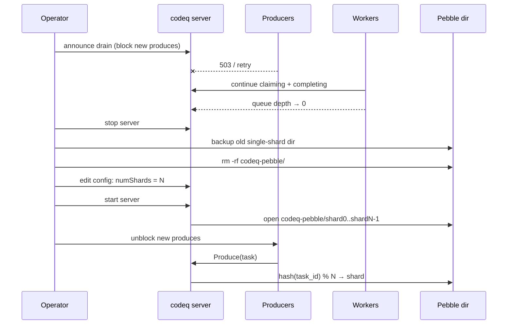
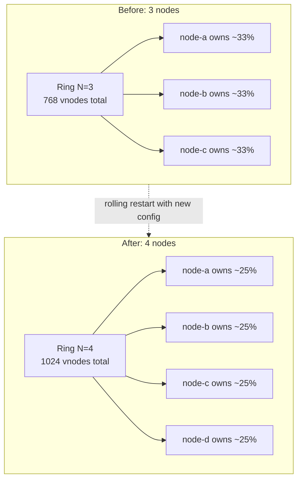

# Shard Migration Guide

This guide covers how to migrate tasks between shards in a codeQ multi-shard deployment using the built-in `migrate-shards` CLI command.

## Overview

When you reconfigure command-to-shard mappings (e.g., moving `GENERATE_MASTER` from the default shard to a dedicated `compute-shard`), existing tasks remain on the original shard. The `migrate-shards` command moves those tasks — including their data, ordering, and metadata — to the new shard so that workers begin processing them from the correct backend.

## Prerequisites

- codeQ CLI (`codeq`) built from source or installed
- A codeQ server configuration file (`config.yaml`) with sharding enabled and backends defined
- Network access to both source and destination Redis/KVRocks instances
- Low traffic on the command being migrated (recommended)

## Configuration

The migration tool reads the same `config.yaml` used by the codeQ server. Ensure your sharding section defines both the source and destination backends:

```yaml
# config.yaml
sharding:
  enabled: true
  defaultShard: "default"

  commandMappings:
    GENERATE_MASTER: "compute-shard"   # New target shard

  backends:
    default:
      address: "kvrocks-primary:6379"
      password: "${REDIS_PRIMARY_PASSWORD}"
      db: 0
      poolSize: 20

    compute-shard:
      address: "kvrocks-compute:6379"
      password: "${REDIS_COMPUTE_PASSWORD}"
      db: 0
      poolSize: 30
```

## Step-by-Step Migration

### Step 1: Preview with Dry-Run

Always start with a dry-run to see what would be migrated:

```bash
codeq migrate-shards \
    --config config.yaml \
    --command GENERATE_MASTER \
    --from-shard default \
    --to-shard compute-shard \
    --dry-run
```

Expected output:

```
Checking shard health...
  ✓ default
  ✓ compute-shard
[DRY-RUN] No changes will be made

Migration: default → compute-shard (command: GENERATE_MASTER)

Results
  Pending:     Would migrate 1523 tasks
  Delayed:     Would migrate 47 tasks
  In-Progress: Would migrate 12 tasks
  DLQ:         Would migrate 3 tasks
  Total: Would migrate 1585 tasks in 0s
```

Review the counts. This tells you exactly how many tasks exist on the source shard for this command.

### Step 2: Execute Migration

When ready, run without `--dry-run` and add `--verify` for post-migration validation:

```bash
codeq migrate-shards \
    --config config.yaml \
    --command GENERATE_MASTER \
    --from-shard default \
    --to-shard compute-shard \
    --verify
```

The command shows a progress bar during migration and prints results:

```
Checking shard health...
  ✓ default
  ✓ compute-shard

Migration: default → compute-shard (command: GENERATE_MASTER)

Results
  Pending:     Migrated 1523 tasks
  Delayed:     Migrated 47 tasks
  In-Progress: Migrated 12 tasks
  DLQ:         Migrated 3 tasks
  Total: Migrated 1585 tasks in 2.3s

Verifying migration...
  Source remaining:  pending=0 delayed=0 inprog=0 dlq=0
  Dest counts:       pending=1523 delayed=47 inprog=12 dlq=3
  Shard default: healthy
  Shard compute-shard: healthy

✓ Migration verified successfully
```

### Step 3: Tenant-Specific Migration (Optional)

To migrate tasks for a specific tenant:

```bash
codeq migrate-shards \
    --config config.yaml \
    --command GENERATE_MASTER \
    --tenant tenant-premium-abc \
    --from-shard default \
    --to-shard premium-shard \
    --verify
```

## CLI Reference

```
codeq migrate-shards [flags]

Flags:
  --config string       Path to codeQ server configuration file (required)
  --command string      Command to migrate (required)
  --from-shard string   Source shard identifier (required)
  --to-shard string     Destination shard identifier (required)
  --tenant string       Tenant ID (optional, for tenant-specific migration)
  --batch-size int      Number of tasks per batch (default 1000)
  --dry-run             Preview migration without making changes
  --verify              Run post-migration verification
```

## What Gets Migrated

The migration moves tasks across **all queue types**:

| Queue Type | Data Structure | What Happens |
|-----------|---------------|-------------|
| Pending (priorities 0-9) | LIST | Task IDs moved preserving FIFO order |
| Delayed | Sorted Set | Task IDs moved with delay scores preserved |
| In-Progress | SET | Task IDs moved (active tasks continue) |
| DLQ | SET | Dead-letter task IDs moved |

For each task ID moved, the tool also copies:
- **Task data**: The full JSON task record from `codeq:tasks` hash
- **TTL index**: The retention expiry score from `codeq:tasks:ttl`

## Batch Processing

The `--batch-size` flag controls how many tasks are moved per atomic batch. The default of 1000 balances throughput and memory:

- **Smaller batches** (100-500): Less memory pressure, safer for constrained environments
- **Larger batches** (2000-5000): Faster migration, higher peak memory usage

```bash
# Smaller batches for constrained environments
codeq migrate-shards --config config.yaml \
    --command SEND_EMAIL --from-shard default --to-shard notification \
    --batch-size 200
```

## Rollback Procedure

If a migration needs to be reversed, run the migration in the opposite direction:

```bash
# Rollback: move tasks back to original shard
codeq migrate-shards \
    --config config.yaml \
    --command GENERATE_MASTER \
    --from-shard compute-shard \
    --to-shard default \
    --verify
```

Also update the `commandMappings` in your server configuration to route new tasks back to the original shard, then restart the server.

### Partial Migration Recovery

If a migration fails partway through (e.g., network error), some tasks may already be on the destination while still present on the source. Pending queue migration is **not idempotent** — re-running could insert duplicate task IDs into the destination list. To recover safely:

1. **Run a dry-run** to see remaining tasks on the source:
   ```bash
   codeq migrate-shards --config config.yaml \
       --command GENERATE_MASTER --from-shard default \
       --to-shard compute-shard --dry-run
   ```

2. **Rollback first, then re-run** — move everything back to the source, then perform a clean migration:
   ```bash
   # Move any tasks already on the destination back to source
   codeq migrate-shards --config config.yaml \
       --command GENERATE_MASTER --from-shard compute-shard \
       --to-shard default --verify

   # Re-run the full migration
   codeq migrate-shards --config config.yaml \
       --command GENERATE_MASTER --from-shard default \
       --to-shard compute-shard --verify
   ```

3. **Or complete forward** — re-run the migration to move remaining tasks. Be aware that a small number of tasks may appear on both shards if the previous run was interrupted between writing to the destination and removing from the source. Use `--verify` to confirm counts:
   ```bash
   codeq migrate-shards --config config.yaml \
       --command GENERATE_MASTER --from-shard default \
       --to-shard compute-shard --verify
   ```

> **Note:** Delayed queues (sorted sets) and DLQ (sets) are safe from duplicates since their underlying data structures deduplicate members. Only pending queues (lists) are susceptible to duplicates after an interrupted migration.

## Performance Expectations

| Metric | Typical Range | Notes |
|--------|--------------|-------|
| Throughput | 5,000-20,000 tasks/sec | Depends on network latency and Redis instance performance |
| Latency per batch | 1-5ms | Dominated by Redis round-trip time |
| Memory overhead | ~1KB per task in batch | Batch size × average task JSON size |
| Network traffic | ~1KB per task | Task data copied between shards |

### Recommendations

- **Schedule during low traffic**: Migration reads from pending queues, which temporarily reduces available tasks for workers on the source shard
- **Monitor queue depths**: Watch Prometheus metrics during migration to ensure workers aren't starved
- **Use smaller batch sizes for large tasks**: If task payloads are large (>10KB), reduce batch size to limit memory pressure

## Verification Details

The `--verify` flag checks:

1. **Source emptiness**: All queue keys for the migrated command should have zero remaining tasks
2. **Destination counts**: The destination shard should have the migrated task counts
3. **Shard health**: All configured shards respond to PING

A successful verification shows `✓ Migration verified successfully`. If verification fails, review the printed counts to identify which queue type has discrepancies.

## Troubleshooting

### "sharding is not enabled or no backends configured"

Ensure your config file has `sharding.enabled: true` and at least one backend defined.

### "source shard not found in config backends"

The `--from-shard` value must match a key in `sharding.backends`.

### "one or more shards are unhealthy"

The tool performs a health check before migration. Ensure all Redis instances are running and reachable.

### Migration is slow

- Increase `--batch-size` (e.g., `--batch-size 5000`)
- Ensure network latency between the CLI and Redis is low
- Check Redis instance load (CPU, memory, connections)

### Tasks appear duplicated after interrupted migration

Re-run the migration. The tool processes remaining tasks on the source. Use `--verify` to confirm correct distribution afterward.

## Phase 8 — Intra-process Pebble shards

The sections above cover the KVRocks/Redis backend, where every shard is a
separate process (and therefore a separate database) and `migrate-shards`
moves tasks between them at the wire level. With the Pebble backend the
picture is different: shards are independent **LSM instances inside the
same Go process**, configured by `numShards` (default `1`). Each shard
opens a directory under the configured Pebble `path`, e.g.
`./codeq-pebble/shard0/`, `./codeq-pebble/shard1/`, ... and tasks are
routed by `hash(task_id) % N` (see
[`pkg/app/application_pebble.go`](../pkg/app/application_pebble.go),
function `newPebbleApplication`, around the `openShard` closure).

> **Note**: `migrate-shards` does **not** apply to the Pebble backend.
> Pebble shards share a process address space and have no Redis wire
> protocol; "migration" here means changing `numShards` and reseeding
> data, not running a CLI.

### Why pick `numShards > 1` at all

A single Pebble instance has one commit pipeline and one compaction
scheduler. With `numShards = 4` you get four parallel commit pipelines
and four parallel compactors, so write throughput scales nearly linearly
up to the point where context switches and host-side compaction CPU
saturate. The shard sweep harness measures the curve directly:

| `numShards` | Full-cycle tasks/s |
|---|---|
| 1 | 42,000 |
| 2 | 65,000 |
| 4 | 83,000 |
| 6 | 68,000 |
| 8 | 67,000 |

Source: `internal/bench/profile_full_cycle_test.go::TestProfile_FullCycle`
(env: `PHASE8_SHARDS=1,2,4,6,8 PHASE6_BATCH=32 PHASE6_PROD_BATCH=8`),
reference box 12-core Linux. See
[_STYLE.md § Catalog of canonical benchmarks](./_STYLE.md#7-numbers-must-come-from-measurement)
and [Performance baselines](./30-performance-baselines.md).

The sweet spot on a 12-core box is `numShards = 4`. Past that, per-shard
compaction CPU and fsync coalescer contention start eating the gains.

> **Performance**: For single-node deployments use Pebble with
> `numShards: 4`. Do not raise it past `cores / 2` without re-running
> the sweep on your own hardware — the curve flattens (then dips)
> quickly.

### Picking `numShards` for your box

1. Start at `numShards = 4`.
2. Run `internal/bench/profile_full_cycle_test.go::TestProfile_FullCycle`
   with `PHASE8_SHARDS=2,4,8` and your real `PHASE6_BATCH` /
   `PHASE6_PROD_BATCH` for the workload.
3. Pick the smallest `N` that gives you ≥95% of the peak — fewer shards
   means lower disk-space overhead and faster open/close.
4. Re-run after any kernel, disk, or Go upgrade — the curve is hardware-
   sensitive.

### Migration: `numShards = 0/1` → `numShards = N` (scale up)

The current Phase 8 implementation does **not** migrate existing data
between shards online. The routing function is fixed at process start;
there is no rebalancing goroutine, no merge-on-read, and no on-disk
shard manifest that would let the running process pick up a new layout.

> **Warning**: Changing `numShards` on a directory that already contains
> data from a different `numShards` value will silently route tasks to
> the wrong shard. Lookups for old task IDs will appear to "lose" data
> because the new hash sends them to a shard that does not contain
> them. Always drain and reseed.

The supported procedure is **drain and reseed**:



Concrete steps:

1. **Block new produces** at the load balancer or via an application-
   level feature flag. The server has no built-in "drain" endpoint yet;
   the recommended pattern is to make `/health` return 503 while still
   serving worker streams.
2. **Wait for queue depth to reach zero.** Workers continue claiming
   and completing tasks against the existing shard layout. Use
   `/admin/queues` (or the equivalent Prometheus metric) to confirm
   `pending = delayed = inprog = 0`.
3. **Stop the server** cleanly so Pebble flushes the WAL and writes its
   final manifest.
4. **Back up the existing data directory** (`tar czf ...`). If the
   reseed fails, this is your rollback. Do not skip this step.
5. **Edit the persistence config** to set `numShards: N` and **remove**
   the old shard directory so the new layout starts clean:
   ```yaml
   persistence:
     provider: pebble
     config:
       path: ./codeq-pebble
       numShards: 4
   ```
6. **Start the server.** It will create `./codeq-pebble/shard0/` through
   `./codeq-pebble/shard{N-1}/` on first open. The log line `pebble
   shards enabled shards=N` confirms the wiring.
7. **Unblock produces.** New tasks route through the sharded
   `pebblerepo.ShardedTaskRepository` from this point on.

> **Note**: If you cannot afford a drain window, the alternative is to
> stand up a second codeq process with the new `numShards` value, point
> producers at it, let workers finish the old process, and decommission
> it. This requires two data directories and a producer-facing routing
> shim, but avoids the queue-empty wait.

### Migration: `N → M < N` (scale down)

Resizing down requires merging the contents of multiple shard
directories into a smaller layout. There is no in-process tool for this
either — same constraint as scale-up. The supported procedure:

1. Drain to zero (steps 1-3 above).
2. Stop the server.
3. Back up every existing shard directory.
4. Delete `./codeq-pebble/shard*/` directories.
5. Set `numShards: M` in config.
6. Restart. The new layout is built from scratch.

> **Warning**: Do not attempt to manually merge Pebble shard directories
> by copying SSTables — the LSM levels, version numbers, and sequence
> counters are per-instance state. The result is corruption. Always
> drain first.

If your design needs online resharding (no drain), the Redis/KVRocks
backend already supports it via `migrate-shards` (sections above). The
Pebble backend trades that flexibility for ~8× the throughput of a
single-shard Redis deployment.

### Mutual exclusion: cluster mode and intra-process shards

`numShards > 1` and `cluster.enabled: true` are **mutually exclusive**.
Startup panics with `pebble: cluster mode + intra-process shards not
supported (pick one)` if both are set. The relevant check sits at the
top of
[`pkg/app/application_pebble.go`](../pkg/app/application_pebble.go)
inside the `if numShards > 1 { ... }` block — before the cluster
plumbing is wired, so the failure is fast and the data directory is
untouched.

Operationally this means: pick **one** axis of scaling.

- **Single host, vertical scale**: use Pebble with `numShards = 4` (or
  whatever your sweep recommends). No ring, no gRPC peer fanout, no
  bloom gossip overhead. This is the default and the documented
  baseline for the 83k tasks/s number.
- **Multi-host, horizontal scale**: use Pebble with `numShards = 1` and
  enable cluster mode. The consistent-hash ring (see
  [`internal/cluster/ring.go`](../internal/cluster/ring.go)) shards
  ownership across nodes; each node still runs a single Pebble
  instance.

The two cannot be combined today because `cluster.Server` expects a
single concrete `*pebblerepo.TaskRepository`, not the sharded wrapper.
A sharded-multinode mode would need a per-shard cluster bridge and is a
follow-up.

## Phase 5 — Cluster-level sharding

When cluster mode is enabled (`cluster.enabled: true`), ownership of
each task ID is determined by a consistent-hash ring with 256 virtual
nodes per real node. The ring lives in
[`internal/cluster/ring.go`](../internal/cluster/ring.go); the relevant
APIs are `NewRing`, `Owner(key)`, and `LocalRing.IsLocal(key)`. Lookups
are O(log V) where V = 256 × N.

### Adding a node

The static membership model means every node has the full peer list at
startup (config). Adding a node requires a **rolling restart** with the
new list deployed everywhere — there is no dynamic join/leave protocol.



Because consistent hashing redistributes only `1/N` of the keys when a
node is added, the resulting churn is bounded: with N going 3→4 about
25% of IDs change owner. The remaining 75% stay where they were.

Mechanics during the rolling restart:

1. **Update config on every node** to list the new node `node-d`.
   Nodes that haven't been restarted yet still see the old ring; this
   is fine — they will route some IDs to peers that have not yet
   restarted, which works because each running node still hosts its own
   data.
2. **Restart nodes one at a time.** As each node comes up with the new
   ring, its `Owner(id)` calls reflect the new layout. The bloom
   gossiper (see [`internal/cluster/bloom_cache.go`](../internal/cluster/bloom_cache.go))
   propagates each peer's bloom filter on a periodic interval; routers
   use peer blooms to short-circuit ID-routed RPCs when the bloom
   definitively says "not present" (see
   [`internal/cluster/router.go`](../internal/cluster/router.go)).
3. **No data movement.** Existing tasks stay on the node where they
   were produced. After the ring grows, lookups for those task IDs may
   resolve to a different "owner" — the router will gRPC-forward the
   request, the receiving node will check, the bloom there will say
   "not present", and the caller falls back to the historical owner.
   Over time, as old tasks complete and new tasks are produced under
   the new ring, the distribution converges to ~uniform.

> **Note**: The "no data movement" approach trades a brief period of
> elevated cross-node RPCs for zero downtime and zero migration tooling.
> If your queue depth is small relative to your throughput (the usual
> case), convergence happens within minutes.

### Removing a node

Same constraint: rolling restart with the node removed from every
peer's config. Before removing the node, **drain** it by stopping
producers from targeting it (typically by removing it from the load
balancer) and letting workers finish in-flight tasks.

If the removed node held undrained data, those tasks are lost — the
ring has no concept of replication; ownership is single-master. For
durability across node loss you need either:

- Storage-level replication beneath Pebble (host snapshot, ZFS,
  EBS-style replication), or
- The Redis/KVRocks backend with a replicated KVRocks deployment.

### Producer-local IDs bias new tasks to the local shard

To avoid paying the gRPC forward cost on every produce, the cluster
router asks the ring for a UUID whose hash falls on the local node:
`LocalRing.GenerateLocalID(uuid.NewString)` in
[`internal/cluster/ring.go`](../internal/cluster/ring.go) tries up to
64 candidates and returns the first one whose `Owner()` is `selfID`.
Expected attempts ≈ N (uniform distribution, 256 vnodes); for any
N ≤ 16 the loop almost always exits on the first or second try.

Effect: in steady state the producer's enqueue is **hash-local by
construction**. The cross-node forward disappears for produces that
the producer initiates. Worker claims still scatter-gather across all
nodes (`Ring.All()`), so workers see the full task population
regardless of which node owns the ID.

> **Performance**: producer-local IDs are why cluster mode's per-node
> throughput stays close to single-node Pebble throughput. The gRPC hop
> dominated the Phase 4 profile before this optimisation landed.

### Claim semantics during ring change

Claim does not depend on ID-hash ownership — it is a scatter-gather
across `Ring.All()`. A worker with a session on `node-a` will keep
receiving tasks from `node-b`, `node-c`, and `node-d` regardless of
how the ring is being reshaped. The only thing that changes during a
rolling restart is which node serves as the **owner** for ID-routed
operations like `GetResult(taskID)` — and that converges as soon as
every peer has the same ring config.

## See also

- [Cluster architecture](./05-cluster-architecture.md) — node membership,
  ring construction, scatter-gather Claim, bloom gossip.
- [Storage layout (Pebble)](./07b-storage-pebble.md) — per-shard
  key-space layout, commit pipeline, fsync behaviour.
- [Persistence plugin system](./27-persistence-plugin-system.md) —
  how `PersistenceProvider` selects Pebble vs Redis vs KVRocks.
- [Persistence migration guide](./31-persistence-migration-guide.md) —
  cross-backend migration (Redis → Pebble, etc.) — orthogonal to the
  intra-backend resharding covered here.
