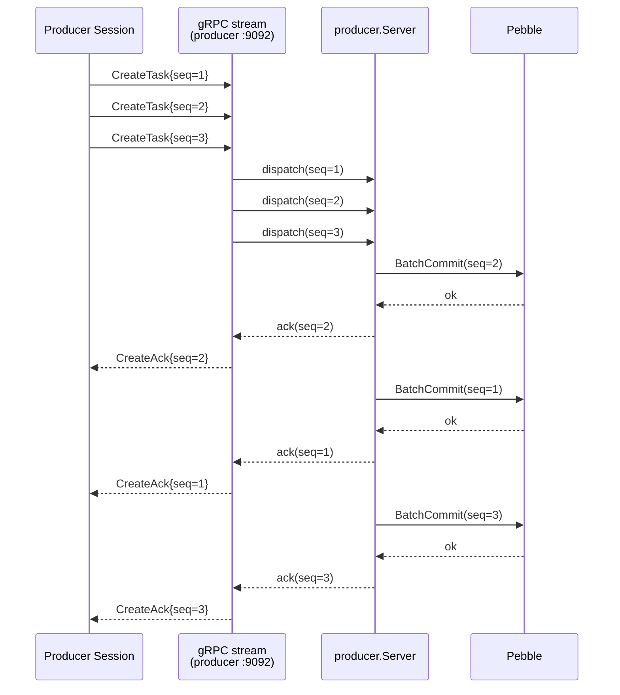
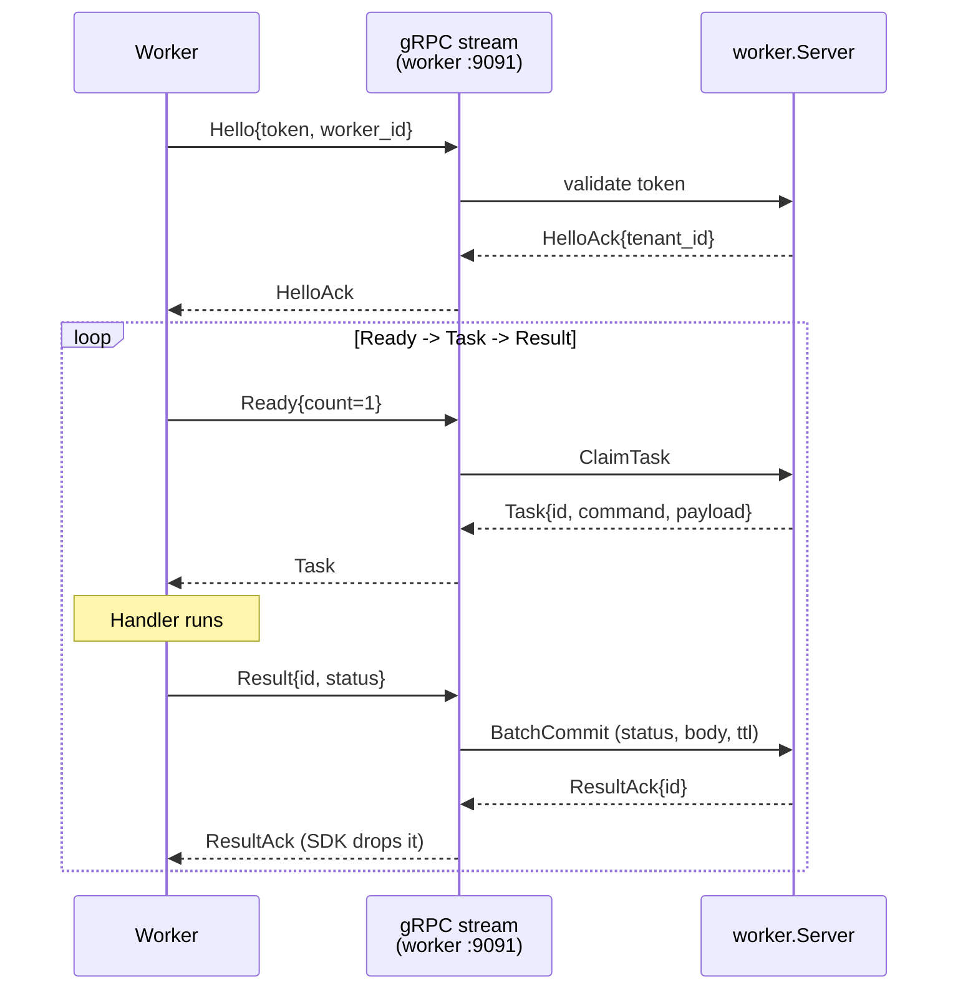
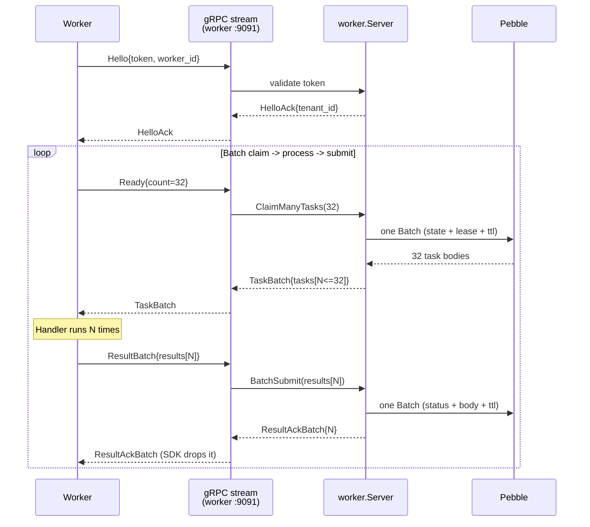

# gRPC streaming API guide

The streaming surface is the hot-path alternative to the REST API for
two flows: task creation (producer) and task claim/complete (worker).
Each is a separate gRPC bidirectional stream on its own port:

- Producer stream — `:9092` — `internal/producer/server.go`
- Worker stream   — `:9091` — `internal/worker/server.go`

A stream is one HTTP/2 connection, opened once per process and reused
for the life of the process. After a single `Hello` handshake, both
sides exchange events asynchronously over the same connection: the
producer pipelines `CreateTask` events and consumes `CreateAck`s; the
worker advertises capacity with `Ready`, receives `Task` or
`TaskBatch`, runs the handler, and sends `Result` or `ResultBatch`.

Where this differs from REST: there is no per-event TLS handshake, no
per-event JWT verify, no per-event tenant resolution. Authentication
happens once at `Hello`. All subsequent events on that stream inherit
the resolved tenant and subject. The wire is protobuf, framed by gRPC
on top of HTTP/2 multiplexing.

For the Go SDKs that sit on top of this protocol, see
[Producer streaming SDK](./35-producer-streaming-sdk.md) and
[Worker streaming SDK](./36-worker-streaming-sdk.md).

---

## 1. Why gRPC streams over HTTP

The REST surface is fine for one-off submissions and polyglot clients
without a Go SDK. The streaming surface exists because, under load, the
REST path is bounded by per-request overhead unrelated to the actual
task write.

### Measured numbers

Reference box: 12-core Linux, Go 1.25.0, loopback gRPC, Pebble
persistence, no fsync, 32 producer goroutines, 6 s measurement window.

| Path | Throughput | Harness |
|---|---|---|
| `POST /v1/codeq/tasks` (REST) | ~16,453 creates/s | `internal/bench/producer_stream_vs_rest_test.go::TestProducerThroughput_RESTPath` |
| `Session.Produce` (stream, single) | ~46,000 creates/s | `internal/bench/producer_stream_vs_rest_test.go::TestProducerThroughput_StreamPath` |
| `Session.ProduceBatch` (stream, batch=16) | 136,392 creates/s | `internal/bench/producer_stream_vs_rest_test.go::TestProducerThroughput_StreamBatchPath` |
| Full producer + worker cycle (stream both sides) | 76,639 tasks/s | `internal/bench/profile_full_cycle_test.go::TestProfile_FullCycle` |

### Where the REST headroom goes

Profiling the REST path under saturation found the dominant non-Pebble
cost was inside the HTTP client's connection pool, not codeQ:
`http.Transport.tryPutIdleConn` showed up at the top of the contention
profile because every request returned its connection to a single
shared idle pool guarded by `sync.Mutex`. On top of that, each request
pays for Gin routing, the auth middleware, tenant resolution, JSON
binding, response marshalling, and panic recovery — every one of these
runs once per task.

The streaming surface collapses all of that. One stream is one HTTP/2
connection; HTTP/2 frame multiplexing carries every event on it. One
`Hello` validates the token. Subsequent events skip the entire HTTP
middleware chain because there is no HTTP request — only protobuf
events on the open bidirectional stream.

### Honest tradeoffs

- A stream is stateful. A dead stream takes every in-flight call with
  it; the caller reconnects and retries at the application level. The
  REST path is stateless and recovers on the next request.
- Auth happens once. There is no per-call permission check after
  `Hello` — the tenant and subject resolved at handshake stay for the
  life of the stream. If you rotate tokens you must reopen the stream.
- The wire is protobuf, not JSON. Webhooks, idempotency keys, delays
  and trace context carry over verbatim from the REST body, but the
  encoding is different — debugging requires `grpcurl` or wire dumps,
  not `curl`.

---

## 2. Wire shape

### 2.1 Producer pipeline (`:9092`)

A producer `Session` keeps a bidirectional gRPC stream open and may
have N `CreateTask` events in flight before the first `CreateAck`
arrives. Each `CreateTask` carries a producer-assigned monotonically
increasing `seq`; the server echoes it on the matching `CreateAck` so
the client can correlate the reply to the originating `Produce` call.



Acks may arrive out of order relative to send order — the server fans
each `CreateTask` into its own goroutine
(`internal/producer/server.go:154`), so the order in which Pebble
commits land determines the ack order. The seq is what binds the reply
to the right caller.

For high-rate producers there is a batch form: `CreateTaskBatch` packs
N requests into one wire frame and the server replies with one
`CreateAckBatch`. The server processes the batch serially in a single
goroutine (`handleCreateBatch` in `internal/producer/server.go`) — N
goroutines per recv contended with the Pebble commit coalescer in
profile, so the batch path keeps one goroutine and one allocation per
recv.

### 2.2 Worker Ready → Task → Result loop (`:9091`, count=1)

A worker opens one stream, completes `Hello`/`HelloAck` once, then
loops: declare capacity with `Ready{count=1}`, receive one `Task`,
process it, send a `Result`, and on to the next `Ready`.



This is the path used when the worker SDK's `Config.BatchSize <= 1`.
The SDK does not block on `ResultAck` — slot loops resume immediately
after sending the `Result`. See
[Worker streaming SDK § Concurrency model](./36-worker-streaming-sdk.md#concurrency-model)
for why.

### 2.3 Worker batch loop (`:9091`, count=N)

When `Config.BatchSize > 1`, the worker advertises capacity with
`Ready{count=N}`. The server claims up to N tasks against a single
Pebble batch via `ClaimMany`, returns one `TaskBatch`, and the worker
processes all N before submitting one `ResultBatch`. Pebble commits
once on the way in and once on the way out.



The batched path measures 23,518 tasks/s at c=4 BatchSize=32 in
`internal/bench/worker_stream_saturation_test.go::TestSaturation_StreamPath`.
At c=1 BatchSize=32 the same harness reports ~16k tasks/s — the
client-side fan-out is already absorbed by the server's batched claim.

---

## 3. Connection lifecycle

A stream goes through three phases: handshake, in-flight, and close.

### 3.1 Open and handshake

Both client SDKs dial via `grpc.NewClient` (lazy — no TCP yet) and then
open the stream rpc. The first event on the wire must be `Hello`
carrying the bearer token. The server validates the token via the
configured `auth.Validator`, resolves the tenant, and replies with
`HelloAck{tenantId, subject}`. Until the handshake completes, no
domain events are accepted.

| Failure | gRPC status | What the SDK returns |
|---|---|---|
| Empty / malformed token | `Unauthenticated` | `Connect` (producer) or `Run` (worker) returns the error wrapping the auth message. |
| First event is not `Hello` | `FailedPrecondition` | Same — wrapped error. |
| TLS handshake / dial failure | `Unavailable` | Same. The underlying `grpc.ClientConn` is still reusable; the stream is not. |

The resolved `tenantID` and `subject` are stamped on the session and
available as `Session.TenantID()` / `Session.Subject()` on the
producer side. They are not exposed on the worker side because each
claim already includes them on the `Task`.

### 3.2 In-flight

After `HelloAck` the stream is in steady state. Both sides have one
writer goroutine that owns the `stream.Send` side and one reader
goroutine that owns `stream.Recv`. They are independent — sends and
receives interleave freely on the same HTTP/2 stream, which is what
makes pipelining work.

Application-level concurrency:

- **Producer**: many goroutines may call `Session.Produce` or
  `Session.ProduceBatch` concurrently. Each call allocates a new
  `seq`, registers a per-seq ack channel in `Session.pending`, and
  pushes the event onto `sendCh`.
- **Worker**: `Concurrency` slot goroutines each loop
  Ready → recv batch → handler → Result. There is no cross-slot
  coordination beyond the shared `batchCh` and `sendCh`.

### 3.3 Close

There are four ways a stream ends:

1. **Caller closes.** Producer: `Session.Close()` closes `sendCh`,
   waits for the writer to drain, calls `stream.CloseSend()`, and
   cancels the stream context so the reader exits. Worker: `Run`
   returns when the parent ctx fires; the deferred `closeWriter`
   drains the writer.
2. **Caller cancels ctx.** Same teardown, propagated through the
   derived stream context.
3. **Server crashes / restarts.** The reader's `stream.Recv()` returns
   a gRPC error (`codes.Unavailable` typically). The reader stores it,
   fans the error out to every pending seq (producer), and exits.
   In-flight `Produce` calls return `producerclient: stream closed: …`;
   in-flight worker slots see the error on their next `send` and exit.
4. **Network drop mid-stream.** Identical to (3) from the client's
   point of view — the gRPC runtime surfaces a transport error on
   `Recv` and/or `Send`.

The recovery pattern is the same for all of these: drop the dead
`Session`, dial a new one via `Client.Connect` (producer) or `Run`
(worker), and resume. The outer retry loop is application code; the
SDK does not paper over a dead stream.

---

## 4. Backpressure

The streaming surface combines two backpressure mechanisms.

### 4.1 gRPC HTTP/2 flow control

gRPC inherits HTTP/2's per-stream window. If the receiver is slow,
`stream.Send` on the sender side blocks until the receiver advances
the window. This is the wire-level backpressure and it operates
without any application involvement.

### 4.2 Channel-bounded send queues

On top of HTTP/2, every server-side `streamSession` and client-side
`session` runs its writes through a single writer goroutine that
drains a buffered channel of capacity 256:

| Side | Constant | Location |
|---|---|---|
| Producer server | `sendChanBuffer` | `internal/producer/server.go:70` |
| Worker server | `sendChanBuffer` | `internal/worker/server.go:98` |
| Producer client | `sendChanBufferClient` | `pkg/producerclient/client.go:136` |
| Worker client | `sendChanBufferClient` | `pkg/workerclient/client.go:169` |

The channel-based pattern replaces a mutex around `stream.Send` that
profiling showed contributed ~74% of the worker server's mutex
profile under 128-slot load (and ~26% of the matching client profile).
The fix: one writer per direction, every caller pushes events onto a
buffered channel, the writer drains it FIFO.

The buffer size (256) bounds how many events can queue between the
caller and the wire. When it fills:

- Producer server: per-event handler goroutines block on
  `sess.send(...)`, which pressures the read loop's per-event
  goroutine spawn rate (`internal/producer/server.go:101`). Since the
  read loop reads as fast as it can, the bound effectively backs into
  the producer client — `stream.Recv` on the producer client side
  blocks on HTTP/2 flow control, which blocks `stream.Send` on the
  client, which blocks the slot pushing onto its own `sendCh`.
- Worker server: same propagation in the other direction. Slow worker
  → server's `sendCh` fills → handlers block on `sess.send` → less new
  work is dispatched.

This is intentional. A slow consumer that does not drain its acks
must eventually slow its producer down rather than accumulate
unbounded memory. The bound is 256 events × the maximum event size,
which is small in practice because protobuf events are compact.

### 4.3 What you should and should not see

Healthy operation: the writer's channel has 0–2 events queued; the
slot loops process tasks at full handler rate; ack latency tracks
Pebble commit latency.

Saturation symptoms: rising ack latency, `ctx.Err()` returns from
slow callers, `sendCh` overflow logs (none today — overflow surfaces
as `ctx.Done()` falling through in `send`). If you see those, the
consumer is slower than the producer and either capacity needs to
grow or the producer needs to back off.

---

## 5. Authentication

Both producer and worker authenticate with a bearer token carried on
the first event of the stream:

```protobuf
// producerpb.Hello
message Hello { string token = 1; }

// workerpb.Hello
message Hello { string token = 1; string worker_id = 2; }
```

The server passes the token to the configured `auth.Validator`
(`pkg/auth/`) which returns `Claims{Subject, EventTypes, Audience,
TenantID, …}`. The session stores the resolved tenant and subject
once; every subsequent event inherits them. There is no way for a
client to override the tenant after the handshake.

### 5.1 Scopes

The worker server enforces per-event scope checks against the claims
(`internal/worker/server.go`):

| Event | Required scope |
|---|---|
| `Ready` | `codeq:claim` |
| `Result`, `ResultBatch` | `codeq:result` |
| `Nack` | `codeq:result` |
| `Heartbeat` | `codeq:result` |
| `Abandon` | `codeq:result` |

If the scope is missing, the event is silently ignored (the slot will
retry the Ready loop). The producer server does not currently scope-
check `CreateTask` separately — tenancy is established at `Hello` and
the event itself carries no scope-distinguishable variants.

### 5.2 Token rotation

There is no on-stream rotation. To swap tokens, the client must close
the session and reopen with the new token. Long-lived workers should
either pin a long-lived token (operationally simple) or wrap `Run` in
a retry loop that refreshes the token on disconnect.

---

## 6. Go SDK entry points

A minimal producer-and-worker pair against the protocol above:

```go
// Producer side
cli, _ := producerclient.New(producerclient.Config{
    Addr:  "localhost:9092",
    Token: os.Getenv("CODEQ_PRODUCER_TOKEN"),
})
defer cli.Close()
sess, _ := cli.Connect(ctx)
defer sess.Close()
taskID, err := sess.Produce(ctx, producerclient.CreateRequest{
    Command: "PROCESS_ORDER",
    Payload: []byte(`{"orderId":"123"}`),
})

// Worker side
w, _ := workerclient.New(workerclient.Config{
    Addr:        "localhost:9091",
    Token:       os.Getenv("CODEQ_WORKER_TOKEN"),
    Commands:    []string{"PROCESS_ORDER"},
    Concurrency: 4,
})
defer w.Close()
err = w.Run(ctx, func(ctx context.Context, t workerclient.Task) workerclient.Result {
    return workerclient.Completed(map[string]any{"ok": true})
})
```

Full SDK references — error handling, batching, TLS dial options,
retry patterns, and complete runnable programs — live in the dedicated
docs:

- [Producer streaming SDK](./35-producer-streaming-sdk.md) — covers
  `Config`, `Client.Connect`, `Session.Produce`, `Session.ProduceBatch`,
  the seq correlation model, and the batch-mode trade-offs.
- [Worker streaming SDK](./36-worker-streaming-sdk.md) — covers
  `Config`, `Client.Run`, the `Handler` contract, the four `Result`
  builders, slot concurrency, batch sizing guidance, and lease
  management.

For TLS/mTLS, both SDKs accept `[]grpc.DialOption` via
`Config.DialOptions`; with `DialOptions` empty the dial uses
`insecure.NewCredentials()` — appropriate for loopback only. The
server's matching TLS configuration is in `codeq.yml` under
`workerStreamTLS` / `producerStreamTLS`; see
[Configuration](./14-configuration.md).

---

## 7. Reference: events on the wire

The full protobuf definitions live at
`internal/producer/proto/producerpb.proto` and
`internal/worker/proto/workerpb.proto`. The subset below is the
behavioural contract — what each event means and which direction it
flows.

### 7.1 Producer (`:9092`)

| Event | Direction | Purpose |
|---|---|---|
| `Hello` | client → server | First message; bearer token. |
| `HelloAck` | server → client | Resolved `tenant_id` and `subject`. |
| `CreateTask` | client → server | One task; carries producer-assigned `seq`. |
| `CreateAck` | server → client | One reply; echoes `seq`, carries `task_id` or `error_message`. |
| `CreateTaskBatch` | client → server | N tasks in one frame; each carries its own `seq`. |
| `CreateAckBatch` | server → client | N acks in one frame, in input order. |
| `ServerError` | server → client | Protocol error; the stream may still be alive. |

`CreateTask` fields mirror the REST POST body: `command`, `payload`,
`priority`, `webhook`, `max_attempts`, `idempotency_key`, `run_at`,
`delay_seconds`, `trace_parent`, `trace_state`.

### 7.2 Worker (`:9091`)

| Event | Direction | Purpose |
|---|---|---|
| `Hello` | client → server | First message; bearer token + optional `worker_id`. |
| `HelloAck` | server → client | Resolved `tenant_id`, `worker_id`. |
| `Ready` | client → server | Declare capacity for `count` tasks; optional `commands` filter, `lease_seconds`. |
| `Task` | server → client | One task in response to `Ready{count=1}`. |
| `TaskBatch` | server → client | Up to `count` tasks in response to `Ready{count>1}`. |
| `Result` | client → server | Per-task completion (`COMPLETED` or `FAILED`). |
| `ResultBatch` | client → server | Per-batch completion; server runs `BatchSubmit`. |
| `Nack` | client → server | Requeue with `delay_seconds`. |
| `Abandon` | client → server | Release lease without writing a result. |
| `Heartbeat` | client → server | Extend the lease on an in-flight task. |
| `ResultAck`, `ResultAckBatch`, `NackAck`, `AbandonAck`, `HeartbeatAck` | server → client | Per-event acks. SDK drops them. |
| `ServerError` | server → client | Protocol error. |

`Ready.count` is the only knob that switches the single-task path
(`count<=1`) for the batch path (`count>1`).

### 7.3 Sequencing and ordering

**Producer:**
- `seq` is producer-assigned and strictly monotonic per session
  (`Session.seq.Add(1)` atomic).
- The server echoes `seq` on the matching `CreateAck`.
- Acks may arrive out of order — the server fans each `CreateTask`
  into its own goroutine.

**Worker:**
- Tasks within a single tenant + command are claimed in
  (priority desc, FIFO) order; see
  [Queueing model](./05-queueing-model.md).
- `ResultBatch` is applied atomically against Pebble — partial
  success is not exposed to the worker.

---

## 8. Glossary

| Term | Definition |
|---|---|
| **Stream** | One long-lived gRPC bidirectional rpc on one HTTP/2 connection. |
| **Session** | Producer-side wrapper over a stream; exposes `Produce`, `ProduceBatch`, `Close`. |
| **Slot** | Worker-side independent goroutine running `Ready → Task → Result`. There are `Config.Concurrency` of them per `Run`. |
| **Seq** | Producer-assigned monotonic uint64 carried on `CreateTask`; the correlation key for `CreateAck`. |
| **Backpressure** | Combined effect of gRPC HTTP/2 flow control and per-stream `sendCh` bounded channel. |
| **Fan-out** | The pattern of spawning one goroutine per event on the server side so a slow downstream call (Pebble commit) does not block the read loop. |
| **Lease** | Time window during which a worker exclusively owns a task. Kept in the server's in-memory `leaseTable`. |
| **Nack** | Worker rejection that requeues the task after a delay. |
| **Abandon** | Worker release of the lease without writing a result. |
| **Tenant** | Isolation boundary established at `Hello` from the validated token's claims. |

---

## See also

- [Producer streaming SDK](./35-producer-streaming-sdk.md) — Go client
  for the producer stream.
- [Worker streaming SDK](./36-worker-streaming-sdk.md) — Go client for
  the worker stream.
- [HTTP API](./04-http-api.md) — REST surface. The streaming surface
  is opt-in; REST stays available.
- [Performance tuning](./17-performance-tuning.md) — `Concurrency`,
  `BatchSize`, and the Pebble commit coalescer cited above.
- [Performance baselines](./30-performance-baselines.md) — raw bench
  output for every measured number cited here.
