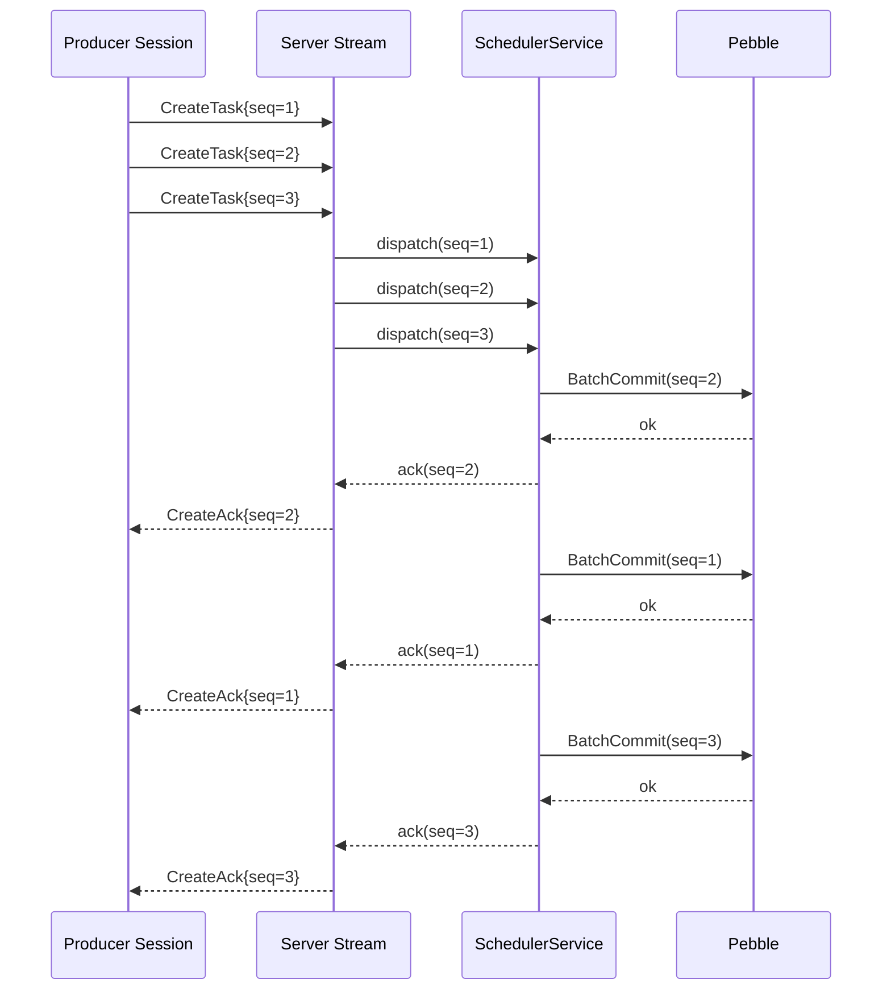
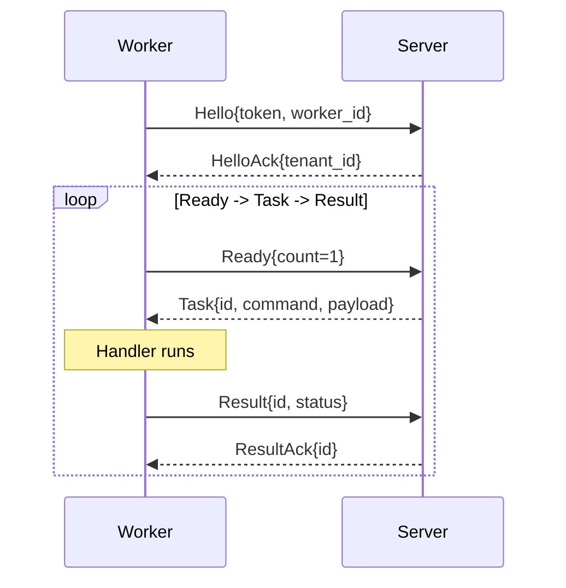
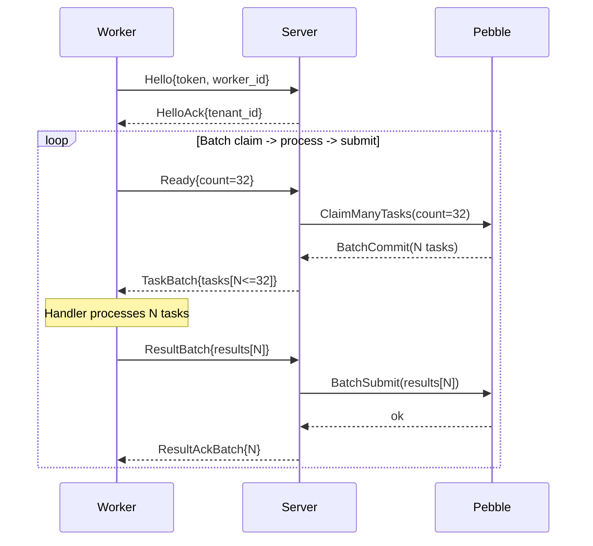

# gRPC Streaming API Guide

## Overview

The codeQ streaming API provides high-throughput alternatives to the HTTP API for task submission (producer) and task claiming (worker). By using long-lived bidirectional gRPC streams, the streaming API eliminates the per-call authentication and HTTP middleware overhead, achieving **2-3x higher throughput** than the REST API while maintaining the same semantics.

**Key benefits:**
- **Producer:** Pipelined task submission (~33k tasks/sec per stream)
- **Worker:** Concurrent task claiming with configurable parallelism
- **Protocol:** Fully asynchronous; multiple requests can be in flight before responses arrive
- **Authentication:** Single bearer token validation at stream open, amortized across all messages
- **Backward compatible:** REST APIs remain unchanged; streaming is optional

---

## Diagrams

The three sequence diagrams below summarise the streaming protocol at a
glance: how the producer pipelines `CreateTask` messages on a single
stream, how a single-mode worker loops Ready → Task → Result, and how a
batch-mode worker (Phase 6 Q2 + Phase 7) drains many tasks per round
trip. For the full SDK surfaces, see
[Producer streaming SDK](./35-producer-streaming-sdk.md) (U8) and
[Worker streaming SDK](./36-worker-streaming-sdk.md) (U9).

### Diagram 1: Producer pipeline (3 in-flight CreateTask)

A producer `Session` keeps a bidirectional gRPC stream open and can have
multiple `CreateTask` messages in flight before any `CreateAck` arrives.
The server fans each message into the `SchedulerService`, which writes
to Pebble; acknowledgments come back asynchronously and may arrive
out-of-order relative to submission.



The producer correlates each `CreateAck` to the originating `Produce`
call via `seq`, so callers see the right `taskID` even though the
acknowledgments are interleaved. See
[Producer streaming SDK](./35-producer-streaming-sdk.md) (U8) for the
matching client API.

### Diagram 2: Worker Ready → Task → Result loop (single mode, count=1)

A worker opens one stream, completes the `Hello` / `HelloAck` handshake
once, and then loops: declare capacity with `Ready{count=1}`, wait for
a `Task`, process it, send a `Result`, and read the `ResultAck` before
asking for the next task.



This is the path used when `Config.BatchSize <= 1`. See
[Worker streaming SDK](./36-worker-streaming-sdk.md) (U9) for the slot
model and reconnection rules.

### Diagram 3: Worker batch loop (Phase 6 Q2 + Phase 7)

When `Config.BatchSize > 1`, the worker advertises capacity with
`Ready{count=32}`. The server calls `ClaimManyTasks` against a single
Pebble batch, returns up to 32 tasks in one `TaskBatch`, and the worker
processes them locally before submitting a `ResultBatch`. Pebble commits
once for the whole batch on the way in and once on the way out.



The batch path is the one measured at 23,518 tasks/s in
`internal/bench/worker_stream_saturation_test.go::TestSaturation_StreamPath`
(c=4, `PHASE6_BATCH=32`). See
[Worker streaming SDK](./36-worker-streaming-sdk.md) (U9) for how
`Concurrency` and `BatchSize` combine to bound in-flight tasks.

---

## Part 1: Tutorials (Learning-Oriented)

### Producer Streaming Tutorial

#### Prerequisites
- A running codeQ server (see `docs/00-getting-started.md`)
- A valid bearer token with `producer` scope
- Go 1.21 or later with `github.com/osvaldoandrade/codeq/pkg/producerclient`

#### Step 1: Create a Session

```go
package main

import (
	"context"
	"log"
	"time"

	"github.com/osvaldoandrade/codeq/pkg/producerclient"
)

func main() {
	ctx := context.Background()

	// Create a producer session
	session, err := producerclient.Client{
		Config: producerclient.Config{
			Addr:  "localhost:9092",  // gRPC server address
			Token: "your-bearer-token",
		},
	}.Connect(ctx)
	if err != nil {
		log.Fatalf("Failed to connect: %v", err)
	}
	defer session.Close()

	log.Println("Connected to producer stream")
}
```

#### Step 2: Submit a Task

```go
// Inside the session context:
task := producerclient.CreateTask{
	Command: "send_email",
	Payload: []byte(`{"email": "user@example.com", "subject": "Hello"}`),
	Priority: 1,
}

taskID, err := session.Produce(ctx, &task)
if err != nil {
	log.Fatalf("Failed to produce task: %v", err)
}
log.Printf("Task created: %s\n", taskID)
```

#### Step 3: Submit Multiple Tasks Concurrently

The producer client supports pipelining: multiple `Produce` calls from different goroutines can be in flight simultaneously, waiting only for their individual acknowledgments.

```go
import "sync"

// Submit 100 tasks concurrently
var wg sync.WaitGroup
for i := 0; i < 100; i++ {
	wg.Add(1)
	go func(i int) {
		defer wg.Done()
		task := producerclient.CreateTask{
			Command: "process_data",
			Payload: []byte(`{"id": ` + string(rune(i)) + `}`),
		}
		taskID, err := session.Produce(ctx, &task)
		if err != nil {
			log.Printf("Task %d failed: %v\n", i, err)
		} else {
			log.Printf("Task %d created: %s\n", i, taskID)
		}
	}(i)
}
wg.Wait()
```

---

### Worker Streaming Tutorial

#### Prerequisites
- A running codeQ server with tasks available
- A valid bearer token with `worker` scope
- Go 1.21 or later with `github.com/osvaldoandrade/codeq/pkg/workerclient`

#### Step 1: Define a Task Handler

```go
package main

import (
	"context"
	"encoding/json"
	"log"

	"github.com/osvaldoandrade/codeq/pkg/workerclient"
)

func handleTask(ctx context.Context, task workerclient.Task) workerclient.Result {
	log.Printf("Processing task: %s (command: %s)\n", task.ID, task.Command)

	// Parse the payload
	var payload map[string]interface{}
	if err := json.Unmarshal(task.Payload, &payload); err != nil {
		return workerclient.Failed(task.ID, err.Error())
	}

	// Simulate processing
	result := map[string]interface{}{"processed": true}
	resultJSON, _ := json.Marshal(result)

	return workerclient.Completed(task.ID, resultJSON)
}

func main() {
	ctx := context.Background()

	// Create a worker session with concurrency
	client := workerclient.Client{
		Config: workerclient.Config{
			Addr:        "localhost:9091",  // gRPC server address
			Token:       "your-bearer-token",
			WorkerID:    "worker-1",
			Concurrency: 5,  // Process up to 5 tasks in parallel
		},
		Handler: handleTask,
	}

	// Run the worker (blocks until context is cancelled)
	if err := client.Run(ctx); err != nil {
		log.Fatalf("Worker error: %v", err)
	}
}
```

#### Step 2: Handle Task Completion Types

Workers can signal different completion states:

```go
import "github.com/osvaldoandrade/codeq/pkg/workerclient"

func advancedHandler(ctx context.Context, task workerclient.Task) workerclient.Result {
	switch task.Command {
	case "send_email":
		if err := sendEmail(task); err != nil {
			// Permanent failure - don't retry
			return workerclient.Failed(task.ID, err.Error())
		}
		return workerclient.Completed(task.ID, nil)

	case "long_operation":
		// Temporary failure - requeue after 30 seconds
		return workerclient.Nack(task.ID, 30, "service unavailable")

	case "cleanup":
		// Release task immediately without result
		return workerclient.Abandon(task.ID)

	default:
		return workerclient.Failed(task.ID, "unknown command")
	}
}
```

---

## Part 2: How-To Guides (Problem-Oriented)

### How to Enable TLS/mTLS

The producer and worker clients support custom gRPC dial options for TLS.

**Producer with TLS:**

```go
import (
	"crypto/tls"
	"google.golang.org/grpc"
	"google.golang.org/grpc/credentials"
)

tlsConfig := &tls.Config{
	InsecureSkipVerify: false,  // Enable certificate verification
}

session, err := producerclient.Client{
	Config: producerclient.Config{
		Addr:  "codeq.example.com:9092",
		Token: "your-token",
		DialOptions: []grpc.DialOption{
			grpc.WithTransportCredentials(credentials.NewTLS(tlsConfig)),
		},
	},
}.Connect(ctx)
```

**Worker with mTLS:**

```go
cert, err := tls.LoadX509KeyPair("/path/to/client.crt", "/path/to/client.key")
if err != nil {
	log.Fatal(err)
}

tlsConfig := &tls.Config{
	Certificates: []tls.Certificate{cert},
	ServerName:   "codeq.example.com",
}

err := workerclient.Client{
	Config: workerclient.Config{
		Addr:  "codeq.example.com:9091",
		Token: "your-token",
		DialOptions: []grpc.DialOption{
			grpc.WithTransportCredentials(credentials.NewTLS(tlsConfig)),
		},
	},
	Handler: handleTask,
}.Run(ctx)
```

### How to Configure Retry and Backoff

The worker client respects the task's `MaxAttempts` setting. Use `Nack` to request requeuing with a delay:

```go
func handleWithRetry(ctx context.Context, task workerclient.Task) workerclient.Result {
	// Check attempt count
	if task.Attempts >= task.MaxAttempts {
		return workerclient.Failed(task.ID, "max attempts exceeded")
	}

	// Try the operation with exponential backoff
	delaySeconds := 1 << uint(task.Attempts)  // 1, 2, 4, 8, ...
	if delaySeconds > 300 {
		delaySeconds = 300  // Cap at 5 minutes
	}

	if err := tryOperation(ctx); err != nil {
		if isTransient(err) {
			return workerclient.Nack(task.ID, delaySeconds, err.Error())
		}
		return workerclient.Failed(task.ID, err.Error())
	}

	return workerclient.Completed(task.ID, nil)
}
```

### How to Handle Streaming Disconnections

Both client types handle reconnections automatically. To implement custom reconnection logic:

**Producer:**

```go
session, err := producerclient.Client{...}.Connect(ctx)
if err != nil {
	// Implement exponential backoff and retry
	retries := 0
	for retries < maxRetries {
		time.Sleep(time.Duration(math.Pow(2, float64(retries))) * time.Second)
		session, err = producerclient.Client{...}.Connect(ctx)
		if err == nil {
			break
		}
		retries++
	}
}
```

**Worker:**

```go
for {
	err := workerclient.Client{...}.Run(ctx)
	if err != nil {
		log.Printf("Worker disconnected: %v", err)
		time.Sleep(5 * time.Second)
		// Reconnect on next loop iteration
	}
}
```

### How to Monitor Streaming Performance

Both clients emit structured logging events. Configure a custom logger:

```go
import "log/slog"

handler := slog.NewJSONHandler(os.Stderr, nil)
logger := slog.New(handler)

session, err := producerclient.Client{
	Config: producerclient.Config{
		Addr:   "localhost:9092",
		Token:  "your-token",
		Logger: logger,
	},
}.Connect(ctx)
```

The logger receives:
- `level=info msg="connected"` - Stream established
- `level=warn msg="ack_timeout"` - Acknowledgment delayed
- `level=error msg="stream_error"` - Protocol errors

### How to Use Batch Mode (Phase 6)

Phase 6 introduces batch submission and claiming for higher throughput:

**Producer batch mode:**

```go
batch := producerclient.CreateTaskBatch{
	Tasks: []producerclient.CreateTask{
		{Command: "task1", Payload: []byte(`{}`)},
		{Command: "task2", Payload: []byte(`{}`)},
		{Command: "task3", Payload: []byte(`{}`)},
	},
}

ackBatch, err := session.ProduceBatch(ctx, &batch)
if err != nil {
	log.Fatal(err)
}

for i, ack := range ackBatch.Acks {
	if !ack.Ok {
		log.Printf("Task %d failed: %s\n", i, ack.ErrorMessage)
	} else {
		log.Printf("Task %d created: %s\n", i, ack.TaskID)
	}
}
```

**Worker batch mode (automatic):**

```go
client := workerclient.Client{
	Config: workerclient.Config{
		Addr:        "localhost:9091",
		Token:       "your-token",
		Concurrency: 10,
		BatchSize:   5,  // Claim up to 5 tasks per batch
	},
	Handler: handleTask,
}

// Automatically uses batch mode when BatchSize > 1
client.Run(ctx)
```

---

## Part 3: Technical Reference (Information-Oriented)

### Producer Streaming API

#### Protocol Messages

**Client → Server:**

- `Hello` (first message): Bearer token for authentication
- `CreateTask`: Submit a single task
- `CreateTaskBatch`: Submit multiple tasks in one message

**Server → Client:**

- `HelloAck`: Confirms authentication; includes tenant_id and subject
- `CreateAck`: Acknowledges a single task; includes task_id or error_message
- `CreateAckBatch`: Acknowledges multiple tasks
- `ServerError`: Stream-level error

#### CreateTask Message

```protobuf
message CreateTask {
  uint64 seq = 1;                              // Monotonically increasing sequence
  string command = 2;                          // Task command (required)
  bytes payload = 3;                           // Opaque JSON payload
  int32 priority = 4;                          // Task priority (0-255)
  string webhook = 5;                          // Optional webhook URL
  int32 max_attempts = 6;                      // Max retry attempts
  string idempotency_key = 7;                  // Deduplication key
  google.protobuf.Timestamp run_at = 8;        // Scheduled run time
  int32 delay_seconds = 9;                     // Delay before claiming
  string trace_parent = 10;                    // W3C trace context
  string trace_state = 11;                     // W3C trace state
}
```

#### Session.Produce Method

```go
func (s *Session) Produce(ctx context.Context, task *CreateTask) (string, error)
```

- **Behavior:** Blocks until the matching `CreateAck` arrives or context cancels
- **Returns:** Task ID on success; error on failure or timeout
- **Concurrency:** Safe for concurrent calls from multiple goroutines (pipelining)

#### Session.ProduceBatch Method

```go
func (s *Session) ProduceBatch(ctx context.Context, batch *CreateTaskBatch) (*CreateAckBatch, error)
```

- **Behavior:** Submits multiple tasks in a single message; blocks until `CreateAckBatch` arrives
- **Returns:** Batch acknowledgments; order matches input order
- **Performance:** Lower latency and network overhead than individual `Produce` calls

#### Error Handling

Errors are returned in the `CreateAck.error_message` field:

| Error Message | Meaning | Retryable |
|:---|:---|:---:|
| `"invalid_command"` | Command not recognized | No |
| `"invalid_payload"` | Payload is not valid JSON | No |
| `"invalid_priority"` | Priority out of range | No |
| `"duplicate_key"` | Idempotency key already used | No |
| `"internal_error"` | Server-side error | Yes |
| `"unavailable"` | Server temporarily unavailable | Yes |

---

### Worker Streaming API

#### Protocol Messages

**Client → Server:**

- `Hello` (first message): Bearer token; includes optional worker_id
- `Ready`: Declare capacity for N tasks
- `Result`: Submit task completion (COMPLETED or FAILED)
- `Nack`: Requeue task with delay
- `Heartbeat`: Extend lease on in-flight task
- `Abandon`: Release task without result
- `ResultBatch`: Submit results for multiple tasks

**Server → Client:**

- `HelloAck`: Confirms authentication; includes tenant_id and scopes
- `TaskAssignment`: Single task assignment (legacy/single-task mode)
- `TaskBatch`: Multiple tasks (batch mode, Phase 6)
- `ResultAck`: Acknowledgment of result submission
- `ServerError`: Stream-level error

#### Ready Message

```protobuf
message Ready {
  repeated string commands = 1;    // Restrict to specific commands (empty = all)
  int32 lease_seconds = 2;         // Lease duration for assigned tasks
  int32 count = 3;                 // Max tasks to claim per Ready
}
```

- **count = 1 or 0:** Server responds with single `TaskAssignment`
- **count > 1:** Server responds with `TaskBatch` (up to `count` tasks)

#### Result Message

```protobuf
message Result {
  string task_id = 1;              // ID of completed task
  string status = 2;               // "COMPLETED" or "FAILED"
  bytes result_json = 3;           // Result payload (if COMPLETED)
  string error = 4;                // Error message (if FAILED)
}
```

#### Result Disposition Types

| Method | Purpose | Behavior |
|:---|:---|:---|
| `Completed(id, payload)` | Task succeeded | Task marked COMPLETED; payload stored |
| `Failed(id, error)` | Task failed permanently | Task marked FAILED; respects MaxAttempts |
| `Nack(id, delaySeconds, reason)` | Temporary failure | Task returned to queue; requeue after delay |
| `Abandon(id)` | Graceful shutdown | Task lease released; returns to PENDING |

#### Config.Concurrency

Controls how many tasks the worker claims in parallel:

```go
Config{
	Concurrency: 5,  // Up to 5 tasks claimed simultaneously
}
```

Each slot runs an independent `Ready → Task(s) → Result(s)` cycle:
- Slot 1: Ready → TaskAssignment → Result → Ready → ...
- Slot 2: Ready → TaskAssignment → Result → Ready → ...
- ...
- Slot 5: Ready → TaskAssignment → Result → Ready → ...

One slot's error does not block other slots.

#### Config.BatchSize

When `BatchSize > 1`, the worker requests multiple tasks per `Ready`:

```go
Config{
	Concurrency: 5,
	BatchSize:   10,  // Each slot claims up to 10 tasks per batch
}
```

The server responds with `TaskBatch` containing up to 10 tasks, which the worker processes sequentially before sending the next `Ready`.

#### Error Handling

Errors are returned in `ServerError` or cause stream closure:

| Condition | Handling |
|:---|:---|
| Invalid token | Stream closes with `Unauthenticated` status |
| Unknown command | `Ready` is ignored; server continues listening |
| Task not found | `Result` returns `NOT_FOUND` error |
| Worker not authorized | Stream closes with `PermissionDenied` status |

---

### Shared Concepts

#### Authentication

Both producer and worker use bearer tokens:

```go
Config{
	Token: "eyJhbGciOiJIUzI1NiIsInR5cCI6IkpXVCJ9...",
}
```

The token is validated exactly once when `Hello` is sent. All subsequent messages inherit the authenticated tenant and subject.

#### Sequencing and Ordering

**Producer:**
- Request seq numbers must be monotonically increasing per stream
- Server echoes seq in `CreateAck` for correlation
- No ordering guarantee on acknowledgments across concurrent `Produce` calls

**Worker:**
- Tasks are assigned in priority order (highest first)
- Within same priority, FIFO order
- Results are applied atomically; no ordering constraints

#### Throughput Characteristics

| Path | Throughput | Latency | Notes |
|:---|:---|:---|:---|
| REST POST /tasks | ~10k tasks/sec | 5-10ms | One HTTP round-trip per task |
| Producer stream (serial) | ~20k tasks/sec | 2-4ms | Pipelined; amortized auth |
| Producer stream (batch) | ~33k tasks/sec | 1-2ms | Batch message coalescing |
| Worker REST | ~2k tasks/sec | 10-20ms | Two HTTP round-trips per task |
| Worker stream (serial) | ~5k tasks/sec | 3-5ms | Single stream; concurrency=1 |
| Worker stream (batch) | ~15k tasks/sec | 2-4ms | Concurrency=5; BatchSize=10 |

---

## Part 4: Explanation (Understanding-Oriented)

### Why Streaming?

The HTTP REST API processes each request independently:

1. **Per-request overhead:** Each `POST /tasks` or `POST /tasks/{id}/result` incurs:
   - TLS handshake (if new connection)
   - Bearer token validation
   - Tenant lookup
   - Middleware execution (logging, instrumentation)
   - HTTP/2 frame overhead

2. **Ceiling:** The middleware tax and network stack latency create a practical throughput ceiling around 10k requests/sec per producer/worker.

The streaming API amortizes these costs across many messages on a single stream:

1. **Single auth:** Bearer token validated once at stream open
2. **Persistent connection:** No handshake or connection setup on each message
3. **Minimal overhead:** gRPC messages are binary; no HTTP middleware
4. **Pipelining:** Multiple requests in flight; acknowledgments arrive asynchronously

Result: **2-3x higher throughput** with **lower latency**.

### Concurrency Model (Worker)

The worker client uses a slot-based concurrency model:

```
config.Concurrency = 3  (three independent cycles running in parallel)

Slot 1:  Ready → TaskAssignment → Result → Ready → ...
Slot 2:  Ready → TaskAssignment → Result → Ready → ...
Slot 3:  Ready → TaskAssignment → Result → Ready → ...
```

Each slot:
- Sends a `Ready` message declaring capacity
- Receives one or more `TaskAssignment` messages (or a `TaskBatch` in batch mode)
- Processes tasks sequentially via the `Handler` callback
- Sends `Result` messages back
- Loops back to `Ready`

**Advantages:**
- Simple: each slot is a single goroutine; no complex synchronization
- Resilient: one slot's error doesn't block other slots
- Scalable: total in-flight tasks = `Concurrency * BatchSize`

### Batch Mode (Phase 6)

Phase 6 introduces batch submission and claiming:

**Producer batch mode:**
- Instead of `CreateTask` messages, send `CreateTaskBatch` with multiple tasks
- Server processes batch with one fan-out goroutine instead of per-task goroutines
- Pebble commit coalescer (Phase 1.1) merges batched writes into fewer commits
- Result: reduced gRPC framing, fewer context switches, better CPU cache locality
- **Improvement:** +4% throughput

**Worker batch mode:**
- Worker sends `Ready` with `count > 1`
- Server responds with `TaskBatch` containing up to `count` tasks
- Worker processes tasks sequentially, then sends `ResultBatch`
- **Improvement:** Reduced Ready→Task latency; better server-side load distribution

### Protocol Design Philosophy

1. **Simplicity:** Few message types; clear state machine
2. **Async-first:** No blocking on either side; multiple requests in flight
3. **Correlation:** Seq numbers allow producer to match responses to requests without round-tripping
4. **Streaming:** Long-lived bidirectional connections; no reconnect per message
5. **Compatibility:** Worker streaming phase is optional; REST APIs unchanged

---

## Part 5: Examples

### Example 1: Bulk Task Submission

```go
// Submit 10,000 tasks with pipelining
package main

import (
	"context"
	"log"
	"sync"
	"sync/atomic"
	"time"

	"github.com/osvaldoandrade/codeq/pkg/producerclient"
)

func main() {
	session, err := producerclient.Client{
		Config: producerclient.Config{
			Addr:  "localhost:9092",
			Token: "token",
		},
	}.Connect(context.Background())
	if err != nil {
		log.Fatal(err)
	}
	defer session.Close()

	ctx := context.Background()
	var produced int64
	start := time.Now()

	// Submit tasks from 10 goroutines concurrently
	var wg sync.WaitGroup
	for i := 0; i < 10; i++ {
		wg.Add(1)
		go func() {
			defer wg.Done()
			for j := 0; j < 1000; j++ {
				task := producerclient.CreateTask{
					Command: "process",
					Payload: []byte(`{"id": 123}`),
				}
				if _, err := session.Produce(ctx, &task); err == nil {
					atomic.AddInt64(&produced, 1)
				}
			}
		}()
	}

	wg.Wait()
	elapsed := time.Since(start)
	rate := float64(produced) / elapsed.Seconds()
	log.Printf("Produced %d tasks in %.2fs (%.0f tasks/sec)\n", produced, elapsed.Seconds(), rate)
}
```

### Example 2: Worker with Graceful Shutdown

```go
package main

import (
	"context"
	"log"
	"os"
	"os/signal"
	"syscall"

	"github.com/osvaldoandrade/codeq/pkg/workerclient"
)

func handleTask(ctx context.Context, task workerclient.Task) workerclient.Result {
	log.Printf("Task %s: %s\n", task.ID, task.Command)
	// Simulate work
	return workerclient.Completed(task.ID, nil)
}

func main() {
	ctx, cancel := context.WithCancel(context.Background())
	defer cancel()

	// Graceful shutdown on SIGTERM
	sigChan := make(chan os.Signal, 1)
	signal.Notify(sigChan, syscall.SIGTERM, syscall.SIGINT)
	go func() {
		sig := <-sigChan
		log.Printf("Received signal: %v. Shutting down...\n", sig)
		cancel()
	}()

	client := workerclient.Client{
		Config: workerclient.Config{
			Addr:        "localhost:9091",
			Token:       "token",
			Concurrency: 5,
		},
		Handler: handleTask,
	}

	if err := client.Run(ctx); err != nil {
		log.Printf("Worker stopped: %v\n", err)
	}
}
```

### Example 3: Error Handling and Retries

```go
package main

import (
	"context"
	"encoding/json"
	"errors"
	"log"
	"time"

	"github.com/osvaldoandrade/codeq/pkg/workerclient"
)

func handleEmailTask(ctx context.Context, task workerclient.Task) workerclient.Result {
	var payload struct {
		Email string `json:"email"`
	}
	if err := json.Unmarshal(task.Payload, &payload); err != nil {
		return workerclient.Failed(task.ID, "invalid payload: "+err.Error())
	}

	// Simulate email sending with transient failure
	if err := sendEmail(payload.Email); err != nil {
		if errors.Is(err, context.DeadlineExceeded) {
			// Transient: timeout, retry after 30s
			return workerclient.Nack(task.ID, 30, "timeout")
		}
		// Check if permanent
		if isPermanent(err) {
			return workerclient.Failed(task.ID, err.Error())
		}
		// Unknown: let retries decide
		return workerclient.Nack(task.ID, 10, err.Error())
	}

	return workerclient.Completed(task.ID, nil)
}

func sendEmail(email string) error {
	// Simulate flaky service
	return errors.New("service temporarily unavailable")
}

func isPermanent(err error) bool {
	return errors.Is(err, errors.New("invalid email"))
}
```

---

## Glossary

| Term | Definition |
|:---|:---|
| **Stream** | Long-lived bidirectional gRPC connection |
| **Session** | Producer-side wrapper around a stream; provides `Produce` and `ProduceBatch` methods |
| **Ready** | Worker message declaring capacity for tasks |
| **TaskAssignment** | Server response with a single task (legacy mode) |
| **TaskBatch** | Server response with multiple tasks (Phase 6, batch mode) |
| **Seq** | Producer-assigned monotonically-increasing sequence number for correlation |
| **Ack** | Server acknowledgment of task submission (includes task_id or error) |
| **Lease** | Time window during which a worker exclusively holds a task |
| **Nack** | Worker rejection of task with requeue request |
| **Abandon** | Worker release of task lease without result |
| **Slot** | Independent worker concurrency unit running Ready→Task→Result cycles |
| **Tenant** | Isolated namespace for tasks and workers; resolved from bearer token |
| **Pipelining** | Multiple requests in flight before first response arrives |

---

## See also

- [Producer streaming SDK](./35-producer-streaming-sdk.md) — client API
  behind Diagram 1 (U8).
- [Worker streaming SDK](./36-worker-streaming-sdk.md) — client API
  behind Diagrams 2 and 3 (U9).
- [HTTP API](./04-http-api.md) — REST surface; streaming is an opt-in
  alternative for hot paths.
- [Performance tuning](./17-performance-tuning.md) — knobs that govern
  `Concurrency`, `BatchSize`, and the Pebble commit coalescer cited in
  Diagram 3.
