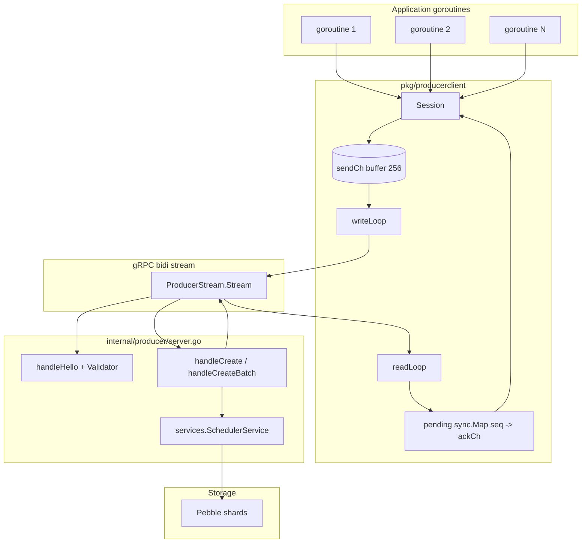
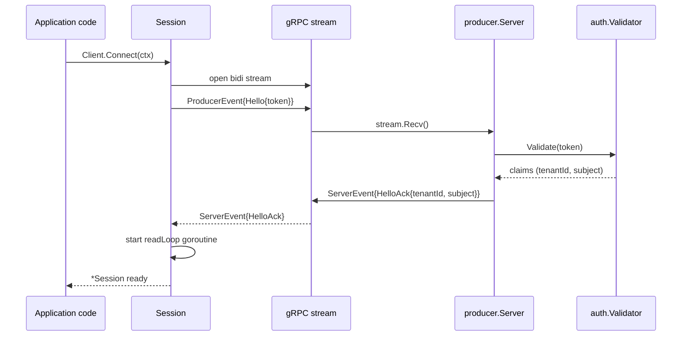
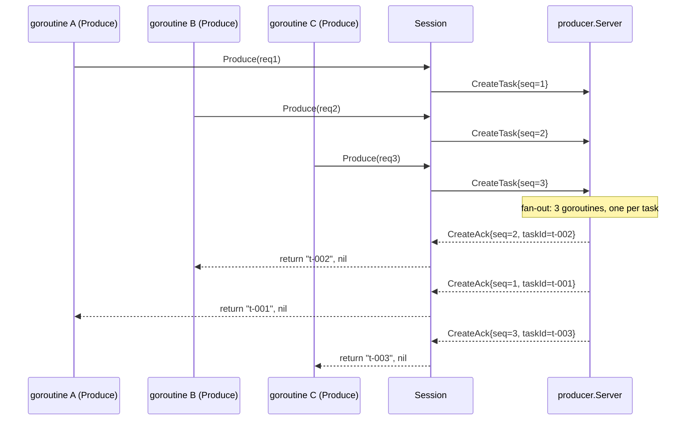
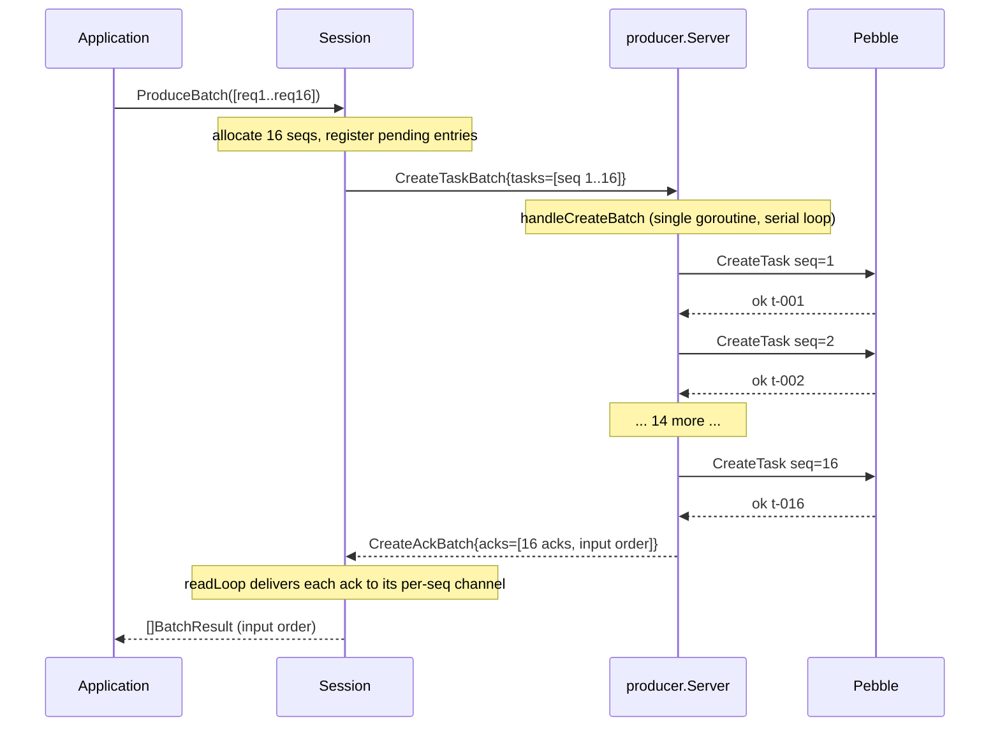

# Producer streaming SDK (Go)

This document is the reference for `pkg/producerclient`, the Go SDK that
talks the codeq producer streaming gRPC protocol. It covers the wire
shape, the API surface, the concurrency model, batch mode, error
handling, and a full working example.

If you have not yet read the protocol-level overview, start with
[gRPC streaming API guide](./34-streaming-api-guide.md). This doc dives
into the Go client and the server fan-out that backs it.

> codeq is an embedded high-performance task queue: a single Go binary,
> Pebble for persistence, gRPC streaming for the wire — 83k tasks/s on
> one machine with zero external dependencies. See
> [_STYLE.md § Value proposition](./_STYLE.md#1-value-proposition).

## 1. What and why

The producer streaming SDK exists for one reason: to remove the per-call
HTTP middleware tax that dominated CPU on the create hot path once Phase
2 had lifted the worker side. Every `POST /v1/codeq/tasks` request pays
for Gin routing, auth middleware, tenant resolution, JSON binding, and
response marshalling. None of that work is interesting on the second
request from the same producer — only the create itself is.

The streaming protocol amortises all of that to a single `Hello`
handshake at connect time. After that, producers pipeline `CreateTask`
events down a long-lived bidirectional gRPC stream and receive
`CreateAck` events back, correlated by a producer-assigned `seq`.

### Measured headroom

| Path | Throughput | Harness |
|---|---|---|
| `POST /v1/codeq/tasks` (REST, 32 goroutines) | ~16,453 creates/s | `internal/bench/producer_stream_vs_rest_test.go::TestProducerThroughput_RESTPath` |
| `Session.Produce` (stream, 32 goroutines, single) | ~46,000 creates/s | `internal/bench/producer_stream_vs_rest_test.go::TestProducerThroughput_StreamPath` |
| `Session.ProduceBatch` (stream, 32 × batch=16) | **136,392 creates/s** | `internal/bench/producer_stream_vs_rest_test.go::TestProducerThroughput_StreamBatchPath` |

That is 8.29× over REST for the batched stream path on the reference
box (12-core Linux, Go 1.25.0, loopback gRPC, Pebble persistence, no
fsync, 6 s measurement window). The reference number for the
[canonical performance baseline](./_STYLE.md#7-numbers-must-come-from-measurement)
is `136,392 creates/s`.

> **Performance**: the batched stream path is the only producer path
> that hits six-figure creates/s on a single node. If you need that
> throughput, you need `ProduceBatch`. `Produce` is for low-latency
> single-task submission with the same wire format.

The trade-off is honest:

- The stream replaces a stateless HTTP request with a stateful gRPC
  session. A dead stream takes every in-flight `Produce` with it; you
  reconnect and retry at the application level.
- Auth happens once at `Hello`. There is no per-call permission check —
  the tenant resolved at handshake stays for the life of the stream.
- The wire shape is protobuf, not JSON. Webhooks, idempotency keys, and
  delays carry over verbatim from the REST body, but the encoding is
  different.

## 2. Architecture

The SDK is one Go package on top of generated protobuf stubs. The
server side lives in `internal/producer/`; the wire definition is at
`internal/producer/proto/producerpb.proto`. The client itself is
`pkg/producerclient/client.go`.



Key invariants encoded in that diagram:

- **One writer per stream.** Every `Send` on the gRPC stream goes
  through `writeLoop`, a single goroutine reading from `sendCh`. This
  is the Phase 6 / M1 finding — `sendMu` mutex contention across
  pipelined `Produce` callers was the single largest source of delay in
  the producer profile, so the client mirrors the server pattern.
- **Async ack delivery.** `readLoop` consumes `ServerEvent` messages
  off the wire and looks up the producer-assigned `seq` in the
  `pending` map to wake the goroutine that called `Produce`.
- **Per-seq channel of capacity 1.** Each `Produce` call allocates one
  buffered ack channel and registers it in `pending`. The reader writes
  exactly once and deletes the entry; the producer goroutine reads once
  and returns.
- **Server-side fan-out for singles, inline for batches.** The server
  spawns one goroutine per `CreateTask` so a slow Pebble commit cannot
  head-of-line the read loop. For `CreateTaskBatch` the server
  processes the batch serially in one goroutine — the Phase 6 / F3
  finding showed that spawning N goroutines per Recv contended with
  the Pebble commit coalescer that already serialises commits.

## 3. Hello handshake

The first message on every stream must be `Hello`. The server
validates the bearer token, resolves the tenant, and replies with
`HelloAck`. Until that exchange completes, no `CreateTask` events are
accepted.



If the validator rejects the token, the server returns a gRPC
`Unauthenticated` status and the stream closes immediately. The SDK
surfaces that as the error returned from `Client.Connect`. If the first
event the server receives is not `Hello`, it returns
`FailedPrecondition` and likewise closes the stream.

The resolved `tenantID` and `subject` are stamped on the session and
are available as `Session.TenantID()` and `Session.Subject()`.
Subsequent `CreateTask` events inherit them — there is no way for a
client to override the tenant after the handshake.

## 4. Pipelining and seq correlation

The protocol is fully asynchronous. A producer may have N `CreateTask`
events in flight before the first `CreateAck` arrives, and the acks
may arrive out of order relative to the order the producer sent them
in. The `seq` field on `CreateTask` is the correlation key: the server
echoes it on the matching `CreateAck`, and the client uses it to wake
the right caller.

The `seq` is allocated by `Session.seq.Add(1)` (a `sync/atomic` uint64
counter), so two concurrent `Produce` goroutines always see distinct
strictly-monotonic values.



Two implications follow:

1. **Ordering is not guaranteed.** Do not assume that ack order matches
   send order. If your producer cares about ordering — say, for an
   idempotency key collision check — wait for each ack before sending
   the next, or use `ProduceBatch` (which acks in input order).
2. **Send and receive are independent.** `writeLoop` is the only
   goroutine that calls `stream.Send`. `readLoop` is the only goroutine
   that calls `stream.Recv`. They do not synchronise with each other or
   with caller goroutines except through `sendCh` and the `pending`
   map.

## 5. API reference

All types live in `pkg/producerclient`.

### Config

```go
type Config struct {
    Addr        string             // gRPC dial target, e.g. "localhost:9092". Required.
    Token       string             // Bearer token sent in Hello. Required.
    DialOptions []grpc.DialOption  // Forwarded to grpc.NewClient. Defaults to insecure.
    Logger      *slog.Logger       // Defaults to slog.Default().
}
```

- `Addr`: the producer stream server address (set via
  `producerStreamAddr` in `codeq.yml`, or the `ProducerStreamAddr`
  field on `config.Config`). Required — `New` returns an error if
  empty.
- `Token`: bearer token validated by the configured `auth.Validator`.
  Required.
- `DialOptions`: if you need TLS, pass
  `grpc.WithTransportCredentials(credentials.NewTLS(cfg))` here. If
  you leave it nil, the client uses `insecure.NewCredentials()` — fine
  for localhost, never for production over the public network.
- `Logger`: receives Debug-level `hello ok` events and Warn-level
  events for unknown acks or unhandled server messages. Defaults to
  `slog.Default()`.

### Client

```go
func New(cfg Config) (*Client, error)
func (c *Client) Connect(ctx context.Context) (*Session, error)
func (c *Client) Close() error
```

- `New` dials the gRPC target and returns a `Client`. It does not open
  any stream yet — the dial is lazy under `grpc.NewClient`.
- `Connect` opens a new bidirectional stream, completes the `Hello`
  handshake, and starts the writer and reader goroutines. The returned
  `Session` is bound to a derived context — when the caller's `ctx` is
  cancelled, or `Session.Close` is called, the stream is torn down.
  One `Client` can host many sequential `Session`s if you need to
  rotate streams (for example, every 10 minutes to keep load balancers
  happy).
- `Close` releases the underlying `grpc.ClientConn`. Safe to call
  multiple times. Sessions opened from this client become unusable
  after `Close`.

### CreateRequest

```go
type CreateRequest struct {
    Command        string    // Task command, e.g. "GENERATE_MASTER". Required.
    Payload        []byte    // Opaque JSON, stored as-is.
    Priority       int       // Higher integer = earlier claim within the same shard.
    Webhook        string    // Optional callback URL on completion.
    MaxAttempts    int       // Overrides MaxAttemptsDefault from config when > 0.
    IdempotencyKey string    // Server-side dedup over (tenant, key).
    RunAt          time.Time // Absolute schedule. Zero means "now".
    DelaySeconds   int       // Relative schedule. Must be >= 0. Mutually exclusive with RunAt.
    TraceParent    string    // W3C trace context (optional).
    TraceState     string    // W3C trace state (optional).
}
```

Field semantics match `POST /v1/codeq/tasks` (see
[HTTP API reference](./04-http-api.md)). `Command` is the only
required field; the rest default to zero. The server defaults
`Payload` to `null` if empty.

### Session.Produce

```go
func (s *Session) Produce(ctx context.Context, req CreateRequest) (taskID string, err error)
```

Sends one `CreateTask` event and blocks until the matching
`CreateAck` arrives, the caller's `ctx` fires, or the underlying
stream dies.

- On success, returns the server-assigned task id (the same string a
  REST `POST /v1/codeq/tasks` would return in `202 Accepted`).
- On `ctx` cancel, deletes the pending entry and returns `ctx.Err()`.
  A late ack is harmless — `readLoop` logs `ack for unknown seq` at
  Warn level and discards.
- On stream death, every in-flight `Produce` returns a
  `producerclient: stream closed: ...` error.
- On server-side validation failure (empty command, negative
  `DelaySeconds`, etc.) returns the error text the server put in
  `CreateAck.error_message`.

`Produce` is safe to call from many goroutines concurrently. The
`seq` allocator is atomic and the `sendCh` writer serialises the
actual `stream.Send` calls.

### Session.ProduceBatch

```go
type BatchResult struct {
    TaskID string
    Err    error
}

func (s *Session) ProduceBatch(ctx context.Context, reqs []CreateRequest) ([]BatchResult, error)
```

Pipelines N `CreateTask` events into one `CreateTaskBatch` message and
waits for the matching `CreateAckBatch`. Returns one `BatchResult` per
input request, in input order, where `Err` is non-nil for rejected
tasks and `TaskID` is set for accepted ones.

- The outer error is non-nil only when the batch could not even be
  sent (closed stream, dead writer) or when `ctx` fired before all
  acks arrived. Individual task failures are reported per-slot in the
  result.
- On partial cancellation (`ctx.Done()` while N of M acks have
  arrived) the function returns the first N filled `BatchResult`s and
  `ctx.Err()` as the outer error. Pending entries for the remaining
  seqs are dropped so late acks log a Warn and are discarded.

`ProduceBatch` is the Phase 6 / Q3 batch entry point. Use it whenever
the workload tolerates more than a few hundred microseconds of
batching latency — see § 6.

### Session metadata and lifecycle

```go
func (s *Session) TenantID() string
func (s *Session) Subject() string
func (s *Session) Close() error
```

- `TenantID` and `Subject` are the values the server resolved during
  `Hello`. Useful for logging and for asserting that a multi-tenant
  config actually routed your token to the right namespace.
- `Close` drains the writer first (closing `sendCh` and waiting for
  `writerDone`), then `CloseSend`s the stream, then cancels the
  derived stream context so the reader exits. Safe to call multiple
  times. Any pending `Produce` calls return `producerclient: stream
  closed`.

## 6. Batch mode (Phase 6 / Q3)

Single `Produce` calls top out at roughly 46k creates/s for 32
goroutines on the reference box. `ProduceBatch` with batch size 16
hits 136k. The gap is real, and it has three sources.

1. **Fewer stream Sends.** One `CreateTaskBatch` message replaces N
   `CreateTask` messages. The writer goroutine pushes 1/N as many
   protobuf-encoded frames through the gRPC framing layer, which
   reduces both CPU and wakeup count on the writer side.
2. **One server fan-out.** The server processes a batch serially in a
   single goroutine (`handleCreateBatch` in `internal/producer/server.go`).
   The Phase 6 / F3 profile showed that spawning one goroutine per
   `CreateTask` accumulated in `runtime.newstack` — ~8 goroutine spawns
   per Recv contending on the Pebble commit coalescer. The batch path
   keeps one goroutine and one allocation per Recv.
3. **One ack message back.** `CreateAckBatch` packs N acks into one
   `ServerEvent`. Same compression of wire frames in the other
   direction.

The wire shape:

```protobuf
message CreateTaskBatch { repeated CreateTask tasks = 1; }
message CreateAckBatch  { repeated CreateAck  acks  = 1; }
```



### When to batch

- **Yes, batch**: bulk ingestion (CSV import, replay of a backlog,
  fan-out from a single upstream event), workloads where the producer
  is producer-only and can buffer briefly to amortise the wire cost.
- **No, do not batch**: latency-critical paths where each task must
  ack within sub-millisecond bounds, low-rate workloads where the
  buffering delay exceeds the throughput benefit, or anywhere the
  producer cannot tolerate one slow task in a batch slowing the
  others. (The batch returns when all N have been processed.)

### Latency vs throughput trade-off

Single `Produce`: per-task latency is one round-trip plus one Pebble
commit. Throughput is bounded by `sendCh` contention and per-task
goroutine spawn cost.

`ProduceBatch(N)`: per-task latency is one round-trip plus N serial
Pebble commits *for that batch*. Throughput multiplies because the
wire-side overhead is amortised across N tasks.

A reasonable default is `N=16`. Larger batches push more amortisation
but increase tail latency for the last task in the batch.

## 7. Error handling

The stream is the trust boundary. Three failure modes matter:

### 7.1 Stream dead

Network drop, server restart, or `Close` from either side. The reader
goroutine receives an error on `stream.Recv` and:

1. Sets `Session.readErr` so future `Produce` calls fail fast via
   `peekReadErr`.
2. Walks the `pending` map and delivers `deadStreamErr(err)` to every
   waiting channel, so no goroutine blocks forever.
3. Exits.

Callers see a `producerclient: stream closed: <wrapped err>` error.
The recovery pattern is to `Close` the session, open a new one via
`Client.Connect`, and retry — same `Client`, same `grpc.ClientConn`,
new stream.

### 7.2 Server reject

The server returns `CreateAck{ok: false, error_message: "..."}` for
per-request validation failures. `Produce` returns
`errors.New(error_message)`; `ProduceBatch` reports it in
`BatchResult.Err`. These are not stream-fatal — the next `Produce`
on the same session works fine.

Examples surfaced through this path:

- `command is required` — empty `Command`.
- `delaySeconds must be >= 0` — negative `DelaySeconds`.
- Anything `services.SchedulerService.CreateTask` returns (idempotency
  conflict, tenant-mode violation, persistence error).

### 7.3 Handshake failure

`Client.Connect` returns an error if:

- The bearer token is empty or invalid (`Unauthenticated`).
- The server returns `ServerError` in place of `HelloAck`.
- The stream fails to open (network, TLS handshake, server not
  listening).

There is no retry inside the SDK. Callers decide whether to back off
and reconnect.

### 7.4 Retry strategy

Recommended pattern for production producers:

```go
for {
    sess, err := cli.Connect(ctx)
    if err != nil {
        // backoff before retry — could be auth or transient network
        time.Sleep(backoff.NextWith(err))
        continue
    }
    runProducerLoop(ctx, sess) // returns when stream dies or ctx fires
    _ = sess.Close()
    if ctx.Err() != nil {
        return
    }
}
```

The application owns the outer retry loop. The SDK keeps the inner
loop simple — fail fast, fail visibly, do not paper over a dead
stream.

## 8. Concurrency model

`Session` is designed for many goroutines calling `Produce`
concurrently. The contract:

| State | Owner | Synchronisation |
|---|---|---|
| `sendCh` | many producers write, `writeLoop` reads | buffered chan |
| `seq` | every `Produce` increments | `atomic.Uint64` |
| `pending` | producers register, `readLoop` deletes | `sync.Map` |
| `sendErr` | `writeLoop` sets once, all readers observe | `atomic.Pointer[error]` |
| `readErr` | `readLoop` sets, `peekReadErr` reads | `sync.Mutex` |
| `closed` | `Close` flips | `atomic.Bool` + `closeMu` |

The send path looks like this in
[`pkg/producerclient/client.go`](../pkg/producerclient/client.go):

```go
func (s *Session) send(ev *producerpb.ProducerEvent) error {
    if errPtr := s.sendErr.Load(); errPtr != nil {
        return *errPtr
    }
    select {
    case s.sendCh <- ev:
        return nil
    case <-s.streamCtx.Done():
        return s.streamCtx.Err()
    }
}
```

There is no mutex on the producer-facing send path. The buffered
channel absorbs short bursts, the writer goroutine drains it, and
`atomic.Pointer[error]` is the bound between "stream is dead" and "we
should stop trying". The Phase 6 / M1 profile is the reason this is
shaped the way it is — the previous mutex-based send had measurable
contention across pipelined callers.

`Close` is the only operation that races with everything else, and it
takes `closeMu` to serialise itself, then uses `closed.Swap(true)` so
double-close is a no-op.

## 9. Full working example

End-to-end: dial, pipeline 1000 creates concurrently, handle per-task
errors, then close cleanly.

```go
package main

import (
    "context"
    "errors"
    "fmt"
    "log"
    "log/slog"
    "os"
    "sync"
    "time"

    "github.com/osvaldoandrade/codeq/pkg/producerclient"
)

func main() {
    cli, err := producerclient.New(producerclient.Config{
        Addr:   "localhost:9092",
        Token:  os.Getenv("CODEQ_PRODUCER_TOKEN"),
        Logger: slog.New(slog.NewTextHandler(os.Stderr, nil)),
    })
    if err != nil {
        log.Fatalf("producerclient.New: %v", err)
    }
    defer cli.Close()

    ctx, cancel := context.WithTimeout(context.Background(), 30*time.Second)
    defer cancel()

    sess, err := cli.Connect(ctx)
    if err != nil {
        log.Fatalf("Connect: %v", err)
    }
    defer sess.Close()
    log.Printf("connected: tenant=%s subject=%s", sess.TenantID(), sess.Subject())

    const total = 1000
    const goroutines = 32

    payload := []byte(`{"source":"example","kind":"smoke"}`)
    work := make(chan int, total)
    for i := 0; i < total; i++ {
        work <- i
    }
    close(work)

    var ok, fail int64
    var wg sync.WaitGroup
    for w := 0; w < goroutines; w++ {
        wg.Add(1)
        go func() {
            defer wg.Done()
            for i := range work {
                _, err := sess.Produce(ctx, producerclient.CreateRequest{
                    Command:        "GENERATE_MASTER",
                    Payload:        payload,
                    Priority:       5,
                    MaxAttempts:    3,
                    IdempotencyKey: fmt.Sprintf("example-%d", i),
                })
                switch {
                case err == nil:
                    atomicAdd(&ok)
                case errors.Is(err, context.Canceled),
                    errors.Is(err, context.DeadlineExceeded):
                    return
                default:
                    log.Printf("Produce %d failed: %v", i, err)
                    atomicAdd(&fail)
                }
            }
        }()
    }
    wg.Wait()

    log.Printf("done: ok=%d fail=%d", ok, fail)
}
```

(`atomicAdd` is a stand-in for `sync/atomic.AddInt64` on a `*int64`;
the real example would declare those as `atomic.Int64` for the same
result without the helper.)

For the batch variant, replace the inner `for i := range work` body
with a buffered slice of `CreateRequest` of size 16 and call
`sess.ProduceBatch(ctx, reqs)` per batch. Same error handling pattern;
inspect `BatchResult.Err` per slot.

## 10. Comparison: REST vs Stream vs StreamBatch

| Dimension | `POST /v1/codeq/tasks` | `Session.Produce` | `Session.ProduceBatch` |
|---|---|---|---|
| Wire | HTTP/1.1 + JSON | gRPC bidi + protobuf | gRPC bidi + protobuf |
| Auth | every request | once at Hello | once at Hello |
| Throughput (32g, reference box) | ~16,453 creates/s | ~46,000 creates/s | **136,392 creates/s** |
| Per-task latency floor | one HTTP RTT + 1 Pebble commit | one stream RTT + 1 Pebble commit | one stream RTT + N serial Pebble commits |
| Back-pressure | TCP + `http.Server` limits | `sendCh` buffer (256) + stream flow control | `sendCh` buffer + stream flow control |
| Failure unit | one request | one Produce call | one batch (atomic at wire level) |
| Connection model | short-lived | long-lived, recoverable | long-lived, recoverable |
| Idempotency key | yes (body field) | yes (`CreateRequest.IdempotencyKey`) | yes (per-request) |
| Best for | one-off CLI tools, polyglot clients without an SDK | low-latency producer in Go | bulk ingestion, high-rate producers |
| Reference harness | `TestProducerThroughput_RESTPath` | `TestProducerThroughput_StreamPath` | `TestProducerThroughput_StreamBatchPath` |

The numbers come from
`internal/bench/producer_stream_vs_rest_test.go` on the reference box
(12-core Linux, Go 1.25.0, Pebble persistence, no fsync, 32 goroutines,
6 s measurement window). See
[Performance baselines](./30-performance-baselines.md) for raw output
and historical numbers.

## 11. Source map

- `pkg/producerclient/client.go` — the SDK itself: `Config`, `Client`,
  `Session`, `Produce`, `ProduceBatch`.
- `internal/producer/server.go` — server-side stream handler, `Hello`
  validation, fan-out, `handleCreateBatch`.
- `internal/producer/proto/producerpb.proto` — wire definition for
  `Hello`, `CreateTask`, `CreateTaskBatch`, `CreateAck`,
  `CreateAckBatch`, `ServerError`, `ServerEvent`.
- `internal/bench/producer_stream_vs_rest_test.go` — the harness
  behind every throughput number in this doc.

## See also

- [gRPC streaming API guide](./34-streaming-api-guide.md) — protocol
  overview and wire-level walkthrough.
- [Worker streaming SDK](./36-worker-streaming-sdk.md) — the symmetric
  consumer-side SDK for claiming and completing tasks.
- [HTTP API reference](./04-http-api.md) — the REST path the streaming
  SDK replaces on the hot path.
- [Performance baselines](./30-performance-baselines.md) — raw bench
  output and historical numbers for every claim cited here.
