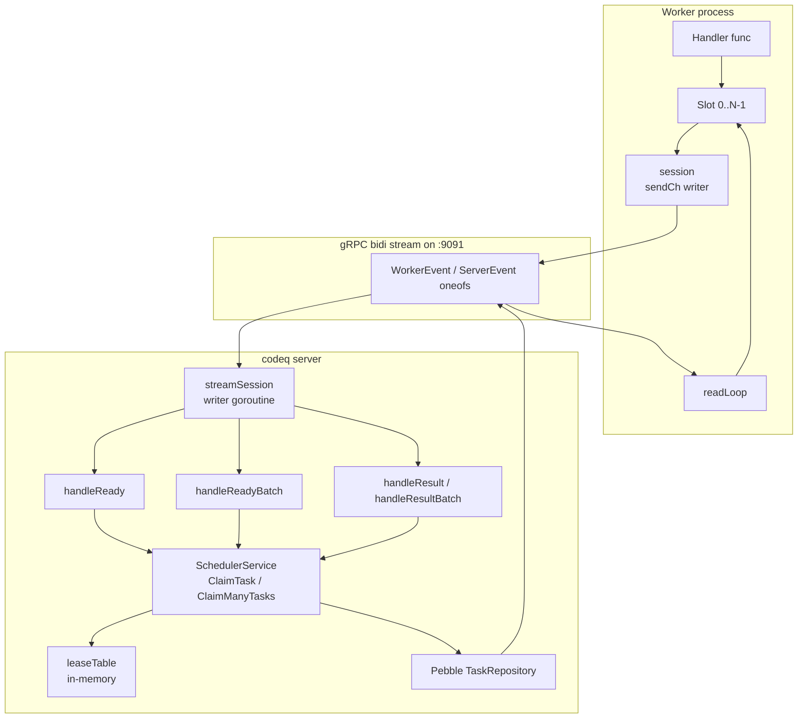
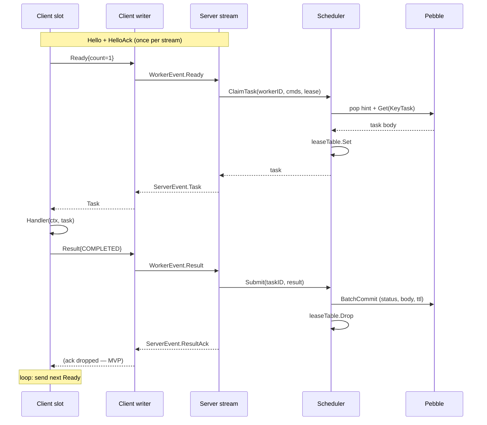
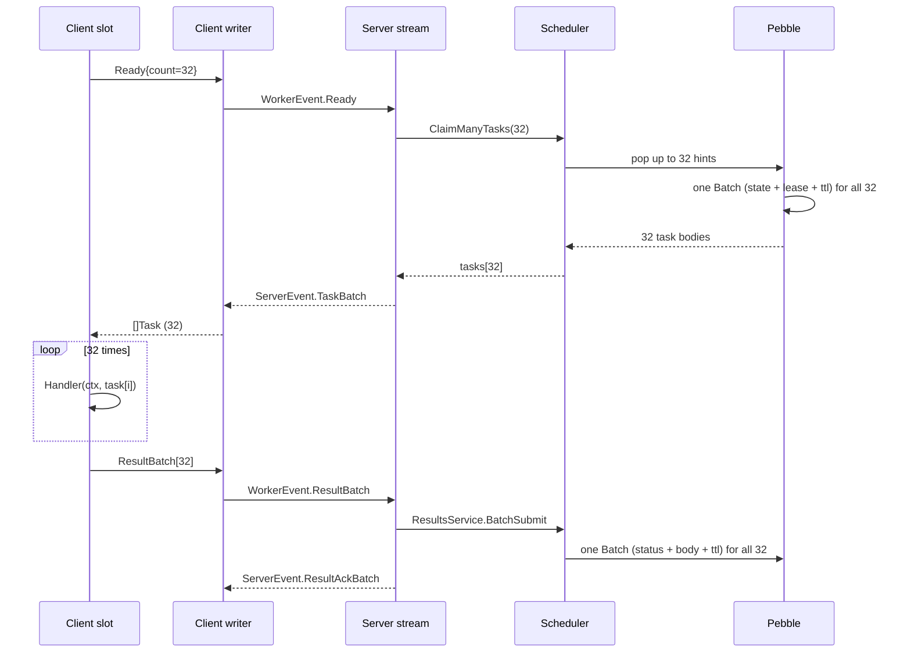

# Worker streaming SDK (Go)

The Go worker SDK at [`pkg/workerclient/`](../pkg/workerclient/client.go)
is the recommended way to consume tasks from a codeq server. It opens
**one** long-lived bidirectional gRPC stream per process, authenticates
once, and dispatches claimed tasks to a user-supplied handler running on
a configurable number of concurrent slots.

For the wider streaming protocol see
[gRPC streaming API guide](./34-streaming-api-guide.md). For the
producer-side equivalent see
[Producer streaming SDK](./35-producer-streaming-sdk.md). The value
proposition for streaming versus REST is in
[_STYLE.md § Value proposition](./_STYLE.md#1-value-proposition).

## What and why

The worker streaming SDK is the Go client for the worker stream on
`:9091`. It opens one long-lived bidirectional gRPC stream per
process, sends `Hello` once for authentication, and dispatches each
`Task` it receives to a user-provided handler running on
`Config.Concurrency` slot goroutines.

The REST worker path requires three separate round-trips per task —
`POST /claim`, `POST /tasks/<id>/result`, and the optional
`POST /tasks/<id>/heartbeat` — each paying the full HTTP middleware
chain. The streaming SDK collapses all three into one stream:
`Ready` / `Task` / `Result` / (`Heartbeat`) flow as oneof events on
the same connection, and N slot goroutines keep the wire saturated.
For the cross-path rationale and connection-pool details, see
[gRPC streaming API guide § Why gRPC streams over HTTP](./34-streaming-api-guide.md#1-why-grpc-streams-over-http).

Measured speedup on the reference 12-core Linux box:

| Path | Test | Rate |
|---|---|---|
| REST `/claim` + `/result` | `internal/bench/worker_stream_vs_rest_bench_test.go::TestThroughput_RESTPath` | 5,500 tasks/s |
| Stream, c=32, batch=0 | `internal/bench/worker_stream_vs_rest_bench_test.go::TestThroughput_StreamPath` | 16,000 tasks/s |

That is **2.9x at c=32 with no batching**. Enabling `BatchSize >= 16`
(see [Batch mode](#batch-mode-q2)) extends the ratio further — the
saturation harness reports up to 9.5x speedup at c=1 with `BatchSize=32`
versus c=1 unbatched.

> **Note**: rates are full claim → handle → complete cycles, not just
> claims. The handler in the benchmark returns `Completed(nil)` with no
> business logic; real workloads will be bounded by handler latency
> first, SDK overhead second.

## Architecture

The SDK is a thin client over [`internal/worker/server.go`](../internal/worker/server.go).
One stream maps to one [`streamSession`](../internal/worker/server.go).
The client's [`session`](../pkg/workerclient/client.go) holds the
mirror state.



Key invariants the diagram encodes:

- **One writer per direction**: the client's `writeLoop` is the only
  goroutine calling `stream.Send`; same on the server side. Profile
  (Phase 6 / M1) showed the previous mutex-around-Send accounted for
  ~74% of the server's mutex profile under 128-slot load.
- **Lease lives in memory**: the server's `leaseTable` is the source
  of truth for claim ownership; the Pebble `KeyLease` index was
  retired in Phase 6 / M2. See [Lease management](#lease-management).
- **Slots fan out, single sendCh writer**: N goroutines on the client
  push events into the same buffered channel; the writer drains it
  in FIFO order.

## Ready / Task / Result loop

The unbatched path is the lifecycle of one task:



`ResultAck` is intentionally dropped on the client side
([`session.readLoop`](../pkg/workerclient/client.go) drops
`ResultAck`/`HeartbeatAck`/`NackAck`/`AbandonAck`). The slot doesn't
block on confirmation; correlation would add overhead with no
measurable benefit at the throughputs we care about. If you need
per-task durability guarantees beyond at-least-once, use the
synchronous REST path.

## Batch mode (Q2)

Setting `Config.BatchSize > 1` flips the slot loop from "one Ready, one
Task" to "one Ready, up to N Tasks". Each slot pulls a `TaskBatch`,
runs the handler N times serially, and submits one `ResultBatch`.



The server collapses N `Submit` calls into one `BatchSubmit` —
internally one `GetTasksBatch` followed by
`BatchUpdateTasksOnComplete`, one Pebble batch, one commit. On the
claim side the Phase 7 swap in
[`internal/repository/pebble/task_repository.go::ClaimMany`](../internal/repository/pebble/task_repository.go)
drains the per-(cmd, tenant, priority) channels in one pop loop, writes
all state transitions into a single Pebble batch, and commits once. The
asymptotic win is the elimination of (N-1) batch.Close + (N-1) commit
trips through the coalescer.

The amortised costs are illustrated by
`internal/bench/worker_stream_saturation_test.go::TestSaturation_StreamPath`:

| Config | Result on reference box |
|---|---|
| c=1, BatchSize=0 | ~1,700 tasks/s |
| c=1, BatchSize=32 | ~16,000 tasks/s |
| c=4, BatchSize=32 | 23,518 tasks/s |
| c=32, BatchSize=0 | ~16,000 tasks/s |

The single-slot batched run matches a 32-slot unbatched run because the
client-side fan-out is already absorbed by the server's claim path
inside `ClaimMany`. See [Batch sizing guidance](#batch-sizing-guidance)
for picking a value.

> **Performance**: `Nack` and `Abandon` are **not** routed through
> `BatchSubmit`. The client (`dispatchBatch`) falls back to per-message
> sends for non-`Completed`/`Failed` results inside a batch — these are
> rare paths under load and the batched server handler only supports
> Submit.

## API reference

The full surface is four types plus four constructors.

### `Config`

Defined in [`pkg/workerclient/client.go`](../pkg/workerclient/client.go):

```go
type Config struct {
    Addr         string         // required, gRPC dial target e.g. "localhost:9091"
    Token        string         // required, bearer token sent in Hello
    WorkerID     string         // optional, defaults to JWT subject
    Commands     []string       // optional, defaults to claims.eventTypes
    Concurrency  int            // slot count, default 1
    LeaseSeconds int            // lease per Ready, 0 = server default
    BatchSize    int            // 0/1 = legacy single-task, >1 = Q2 batch
    IdleBackoff  time.Duration  // unused on the hot path; default 50ms
    DialOptions  []grpc.DialOption
    Logger       *slog.Logger
}
```

Required fields are checked in `New`; everything else takes a
documented default via `Config.defaults()`.

### `Client`

```go
type Client struct { /* unexported */ }
func New(cfg Config) (*Client, error)
func (c *Client) Run(ctx context.Context, h Handler) error
func (c *Client) Close() error
```

- `New` dials the server (`grpc.NewClient`, insecure by default — set
  `DialOptions` for TLS/mTLS) and returns immediately. The TCP/HTTP/2
  handshake is lazy; the actual stream opens in `Run`.
- `Run` opens the stream, completes the Hello handshake, then fans out
  `Concurrency` slot goroutines. It blocks until ctx is cancelled, the
  stream errors, or the server cleanly closes.
- `Close` releases the underlying connection. Safe to call multiple
  times; safe to defer.

### `Handler`

```go
type Handler func(ctx context.Context, t Task) Result
```

Must be safe for concurrent invocation — up to `Concurrency` instances
run in parallel. The `ctx` passed in is derived from the `Run` ctx;
when the parent cancels, in-flight handlers receive cancellation but
the SDK waits for them to return before exiting.

### `Task`

```go
type Task struct {
    ID          string
    Command     string
    Payload     []byte
    Priority    int
    Attempts    int
    MaxAttempts int
    TenantID    string
    Webhook     string
    LeaseUntil  string  // RFC3339
}
```

`Payload` is whatever bytes the producer enqueued — codeq does not
interpret it.

### `Result` builders

```go
func Completed(body map[string]any) Result
func Failed(err string) Result
func Nack(delaySeconds int, reason string) Result
func Abandon() Result
```

- `Completed(nil)` is the no-payload success case (most common).
  Non-nil body is JSON-encoded by the SDK with `sonic.Marshal` and
  stored as the task's `result_json`.
- `Failed(err)` records a permanent failure. The scheduler respects
  `MaxAttempts`; failures past the limit go to the DLQ.
- `Nack(delay, reason)` returns the task to the queue. `delay=0` means
  "re-claimable immediately"; `delay>0` writes a delayed entry that the
  Pebble fast-path `MoveDueDelayed` will promote when due.
- `Abandon()` drops the lease without nacking. The task goes straight
  back to pending and another worker can grab it immediately. Use this
  when the worker is shutting down cleanly mid-task.

The zero `Result` value is invalid — the SDK returns an error rather
than guessing. Always return one of the four builders from your
handler.

## Concurrency model

Inside one `Run` call:

1. The reader goroutine owns `stream.Recv()`. It dispatches Tasks /
   TaskBatches into `batchCh`, drops acks, and forwards
   `ServerEvent_Error` to the logger.
2. `Concurrency` slot goroutines loop `Ready → recv batch → handle →
   Result`. Each slot is independent — there is no cross-slot
   coordination beyond the shared `batchCh` and `sendCh`.
3. One writer goroutine owns `stream.Send()`. All slot goroutines push
   `WorkerEvent`s into the buffered `sendCh` (capacity 256); the
   writer drains it in FIFO order.

The single-writer pattern is intentional. Before Phase 6 / M1, slots
acquired a mutex around `stream.Send`. Under 128-slot load the lock
showed up at the top of the mutex profile; replacing it with a channel
+ dedicated writer dropped contention to negligible and freed about
8% of CPU on the worker host.

When the writer hits a send error, it stores the error in
`sendErr atomic.Pointer[error]` and drains the remaining channel
without sending. Subsequent calls to `send` short-circuit on the
atomic load. The slots notice via `ctx.Err()` or the next failed
`send` and exit cleanly.

## Lease management

Lease state lives in an in-memory `leaseTable` on the server (Phase 6
/ M2 — see commits in
[`internal/repository/pebble/task_repository.go`](../internal/repository/pebble/task_repository.go)).
The retired `KeyLease` index is gone; the table is rebuilt at startup
by scanning `KeyInprog` once during Open.

Consequences for the SDK consumer:

- **Heartbeat is cheap**. The SDK's heartbeat path (sent for long-
  running handlers via the rare `Heartbeat` event) writes the in-memory
  table and one Pebble row for the task body — there is no separate
  `KeyLease` to update. Heartbeating every 5 seconds for a 5-minute
  lease costs essentially nothing.
- **Lease expiry is detected by the reaper**, not the SDK. The
  server's reaper scans `leaseTable` for expired entries and requeues
  them (writes a new pending hint, drops the in-progress state). If
  your handler exceeds the lease, expect the task to be re-delivered.
- **Stream death drops the lease conceptually but not immediately**.
  The lease entry survives until its TTL expires. If a worker crashes
  mid-handler, the task is unavailable to other workers until the
  reaper runs.
- **Result ownership is enforced server-side**. If your handler
  exceeds the lease, the reaper requeues the task and another worker
  may claim it. When the original handler finally returns and the SDK
  sends `Result`, the server's `ResultsService` checks
  `task.WorkerID == req.WorkerID`
  ([`internal/services/results_service.go:60`](../internal/services/results_service.go))
  and rejects the late result with `not-owner`. The same check exists
  on the batch path
  ([`internal/services/results_service.go:248`](../internal/services/results_service.go)).
  This means a re-claimed task is safe: the second worker's result
  wins, the first worker's late result is dropped.

> **Warning**: do not assume Heartbeat will save you from a stuck
> handler. If your handler can hang, set a watchdog ctx and call
> `Abandon` on timeout. Heartbeat extends the lease only — it does
> not detect that the handler is wedged.

## Error handling

The SDK distinguishes three failure modes:

1. **Stream dead**: `grpc.NewClient` reconnects on its own, but the
   active `Stream` rpc is gone. `Run` returns the underlying gRPC
   error (`codes.Unavailable`, `codes.Canceled`, etc). Callers should
   re-call `Run` with a fresh ctx; the existing `Client` is reusable
   (the gRPC connection persists).
2. **Lease expired**: the SDK doesn't observe lease expiry directly.
   The reaper requeues the task and another worker picks it up. If you
   need to detect this from inside your handler, watch `ctx.Done()`
   (the SDK does not currently cancel the handler ctx on lease
   expiry — future work).
3. **Result rejected**: if `Submit` fails on the server (not-found,
   not-owner, not-in-progress), the server sends `ResultAck{ok=false}`
   with an error message. The SDK currently logs nothing at warn for
   acks; downgrade the logger to debug in development if you want to
   see them.

There is **no built-in retry budget** in the SDK. Retries are the
scheduler's job — every time a worker `Nack`s or fails to
`SubmitResult` before the lease expires, the task's `Attempts`
counter advances. Once `Attempts >= MaxAttempts` the task moves to
the DLQ. See [Backoff and retries](./11-backoff.md) for the policy.

## Full working example

This is a minimal worker that processes `send_email` tasks with 32
concurrent slots and a batch of 16:

```go
package main

import (
    "context"
    "errors"
    "log"
    "log/slog"
    "os"
    "os/signal"
    "syscall"
    "time"

    "github.com/osvaldoandrade/codeq/pkg/workerclient"
)

type payload struct {
    To      string `json:"to"`
    Subject string `json:"subject"`
}

func main() {
    logger := slog.New(slog.NewJSONHandler(os.Stdout, nil))

    cli, err := workerclient.New(workerclient.Config{
        Addr:         "codeq.internal:9091",
        Token:        os.Getenv("CODEQ_WORKER_TOKEN"),
        WorkerID:     "mail-worker-" + os.Getenv("HOSTNAME"),
        Commands:     []string{"send_email"},
        Concurrency:  32,
        BatchSize:    16,
        LeaseSeconds: 60,
        Logger:       logger,
    })
    if err != nil {
        log.Fatalf("workerclient.New: %v", err)
    }
    defer cli.Close()

    handler := func(ctx context.Context, t workerclient.Task) workerclient.Result {
        if t.Attempts > t.MaxAttempts/2 {
            logger.Warn("retrying task", "id", t.ID, "attempts", t.Attempts)
        }
        ctx, cancel := context.WithTimeout(ctx, 30*time.Second)
        defer cancel()

        if err := sendEmail(ctx, t.Payload); err != nil {
            if errors.Is(err, context.DeadlineExceeded) {
                // SMTP hung. Hand back so another worker can try.
                return workerclient.Nack(5, "smtp timeout")
            }
            if isPermanent(err) {
                return workerclient.Failed(err.Error())
            }
            return workerclient.Nack(10, err.Error())
        }
        return workerclient.Completed(map[string]any{
            "queued_at": time.Now().UTC().Format(time.RFC3339),
        })
    }

    ctx, stop := signal.NotifyContext(context.Background(),
        syscall.SIGINT, syscall.SIGTERM)
    defer stop()

    if err := cli.Run(ctx, handler); err != nil && !errors.Is(err, context.Canceled) {
        log.Fatalf("worker run: %v", err)
    }
    logger.Info("worker shut down cleanly")
}

func sendEmail(ctx context.Context, p []byte) error  { /* ... */ return nil }
func isPermanent(err error) bool                      { /* ... */ return false }
```

Operational notes for this example:

- The 30 s handler timeout sits well under the 60 s `LeaseSeconds`. A
  handler that exceeds the timeout returns `Nack` and the lease
  expires naturally; the reaper requeues. Do not set the handler
  timeout above the lease.
- `signal.NotifyContext` gives clean shutdown: on SIGTERM the slot
  loops see `ctx.Done()` after their current handler returns and the
  SDK waits for them via `sync.WaitGroup` before `Run` exits.
- `BatchSize=16` is conservative; production workloads with cheap
  handlers can push to 32 or 64. See below.

## Batch sizing guidance

The decision boils down to: how much latency are you willing to add
per-task in exchange for amortising the per-batch fixed costs?

| `BatchSize` | When to pick it |
|---|---|
| 0 / 1 | Legacy single-task path. Use when your handler latency is high (>100 ms) and you want minimum per-task tail latency. Each task is sent and acked individually. |
| 16 - 32 | The sweet spot for typical workloads (fast handlers, mixed payloads). At c=1 BatchSize=32 the saturation harness shows ~9.5x speedup vs c=1 BatchSize=0; at c=4 BatchSize=32 it reaches 23,518 tasks/s. |
| 64 - 128 | Saturates the queue. Only useful when you have a constant backlog and don't mind handler-start latency being bounded by N handler runs. Diminishing returns beyond ~64 in the saturation sweep. |
| 256+ | Avoid. The TaskBatch carries 256 full task bodies, the gRPC frame grows, and the slot blocks on serial handler execution for the full batch. You're trading throughput for nothing past the queue's natural width. |

Two specific tunings to remember:

- `Concurrency * BatchSize` should be roughly the production rate of
  the producer fleet divided by the handler-rate-per-task. If you
  pull more tasks than you can process the leases expire and the
  reaper churns.
- `BatchSize` only helps if the queue has at least N tasks pending
  when the slot sends `Ready`. On a near-empty queue the server
  returns whatever it has (down to one task) — there is no penalty
  for asking for more than is available.

## See also

- [Producer streaming SDK](./35-producer-streaming-sdk.md) — the
  producer side of the same protocol.
- [gRPC streaming API guide](./34-streaming-api-guide.md) — the
  protocol spec, REST equivalents, and language-agnostic semantics.
- [Lease management](./06b-lease-management.md) — what happens when a
  lease expires, how the reaper requeues, and how to size
  `LeaseSeconds`.
- [Backoff and retries](./11-backoff.md) — the scheduler's policy for
  `Nack` delays and DLQ promotion.
