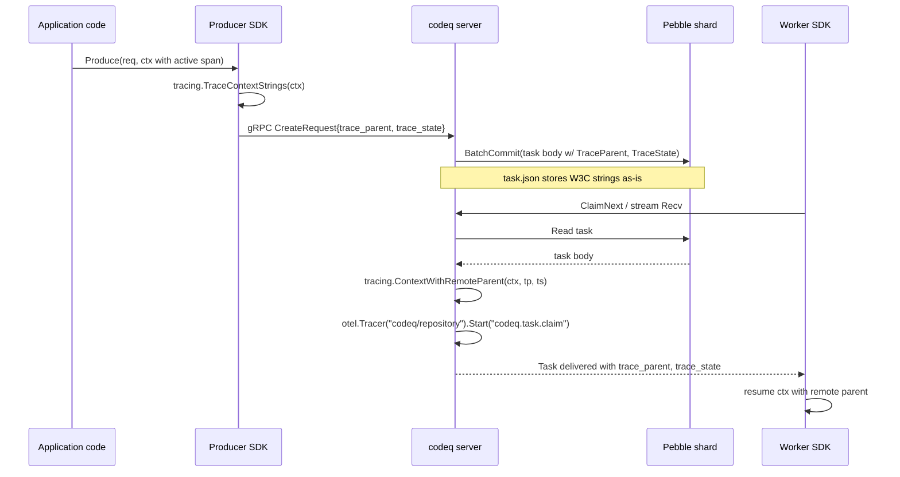
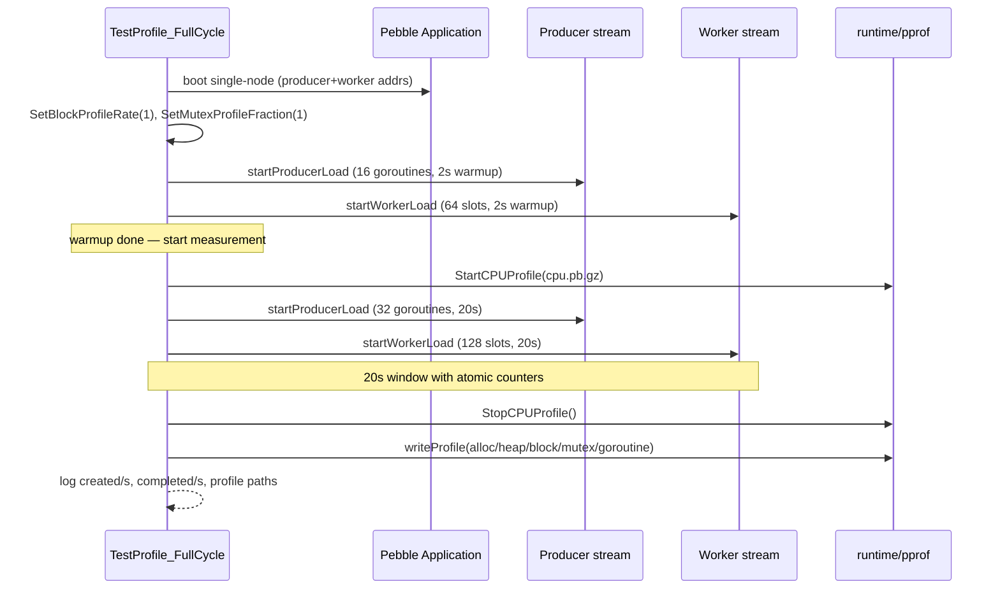

# Observability

codeq ships three observability surfaces in the box:

1. **OpenTelemetry tracing** — W3C trace context is honored on the
   producer side, persisted on the task body, and resumed on the worker
   side. The OTLP gRPC exporter is built in
   ([`internal/tracing/tracing.go`](../internal/tracing/tracing.go)).
2. **Prometheus metrics** — counters, histograms, and process metrics
   are exposed at `GET /metrics` on the same port as the HTTP API
   ([`internal/metrics/metrics.go`](../internal/metrics/metrics.go),
   [`pkg/app/url_mappings.go`](../pkg/app/url_mappings.go)).
3. **Go pprof harness** — `TestProfile_FullCycle` drives the full
   single-node cycle at saturation and writes cpu/alloc/heap/block/mutex
   profiles to `/tmp/codeq-profiles/`
   ([`internal/bench/profile_full_cycle_test.go`](../internal/bench/profile_full_cycle_test.go)).

This doc is not a tutorial on OTel or Prometheus. It is the contract:
which trace context propagates, which metric names exist, and how to
get a CPU profile.

## 1. OpenTelemetry tracing

### Propagation contract

codeq honors W3C trace context (`traceparent`, `tracestate`) end to end.
The producer SDK injects the active span's context into each
`CreateRequest`; the server persists those strings on the task body;
when a worker claims the task, the server reconstructs a remote parent
span and the worker handler sees a continuous trace.



Mechanics, file by file:

- `tracing.TraceContextStrings` — pulls `traceparent` and `tracestate`
  from the active span via the global text-map propagator
  ([`internal/tracing/tracing.go`](../internal/tracing/tracing.go) line
  135).
- `tracing.ContextWithRemoteParent` — re-injects the W3C strings into a
  carrier and extracts a remote parent into the new context
  ([`internal/tracing/tracing.go`](../internal/tracing/tracing.go) line
  142).
- `pkg/domain/task.go` — the `Task` struct carries `TraceParent` and
  `TraceState` as JSON fields (`traceParent`, `traceState`,
  `omitempty`).
- `producerpb` / `clusterpb` — `trace_parent` and `trace_state` are
  fields 10/11 on the producer wire and 18/19 on the cluster RPC.
- `tracing.InjectHeaders` — used by outbound webhooks
  (`internal/services/notifier_service.go`,
  `internal/services/result_callback_service.go`) so the callback URL
  receives the same trace.

> **Note**: codeq does not add a propagator if `tracingEnabled` is
> false — but it still installs the default W3C propagator, so a span
> created upstream still rides on the task body. The trace just is not
> sampled by codeq itself.

### Sampling

`tracingSampleRatio` is fed into
`sdktrace.ParentBased(sdktrace.TraceIDRatioBased(r))`. ParentBased means
the decision is inherited from the upstream span when present, so an
upstream producer that already sampled at 1.0 will always be sampled by
codeq. The ratio only applies when codeq is the root of the trace.

Allowed range: `(0, 1]`. Values `<= 0` or `> 1` are coerced to `1.0` at
config load
([`pkg/config/config.go`](../pkg/config/config.go) line 342).

### Failure modes

`tracing.Setup` is fail-open by design — if the OTLP exporter cannot
initialize (no collector reachable, TLS handshake failure), the server
logs a warning and continues without tracing. This is intentional: a
collector outage must not take the queue offline. The propagator is
still installed so traces from upstream are not dropped on task bodies.

## 2. Configuration

All keys read in
[`pkg/config/config.go`](../pkg/config/config.go) (lines 22-26, 213-234,
336-343). Env vars override YAML.

| YAML key | Env var | Default | Notes |
|---|---|---|---|
| `tracingEnabled` | `TRACING_ENABLED` | `false` | Master switch. When false, propagator is still installed; no spans are exported. |
| `tracingServiceName` | `TRACING_SERVICE_NAME`, then `OTEL_SERVICE_NAME` | `codeq` | Sets `service.name` resource attribute. |
| `tracingOtlpEndpoint` | `TRACING_OTLP_ENDPOINT`, then `OTEL_EXPORTER_OTLP_ENDPOINT` | `localhost:4317` | OTLP/gRPC `host:port`. URL form (`http://...`) is auto-sanitized to host:port. |
| `tracingOtlpInsecure` | `TRACING_OTLP_INSECURE`, then `OTEL_EXPORTER_OTLP_INSECURE` | `false` | Plaintext gRPC. Set `true` for local collectors. |
| `tracingSampleRatio` | `TRACING_SAMPLE_RATIO` | `1.0` | Parent-based; only applied when codeq is trace root. |

Example for a local Jaeger-all-in-one collector:

```yaml
tracingEnabled: true
tracingServiceName: codeq-prod
tracingOtlpEndpoint: localhost:4317
tracingOtlpInsecure: true
tracingSampleRatio: 0.1
```

> **Warning**: do not set `tracingSampleRatio: 1.0` in production
> without a collector that can keep up. The hot path at 83k tasks/s
> creates roughly 250k spans/s (produce + claim + complete per task)
> before downstream worker spans — most collectors will drop or
> backpressure long before that.

## 3. Prometheus metrics

### Endpoint

```text
GET /metrics
```

Same port and host as the HTTP API. Wired in
[`pkg/app/url_mappings.go`](../pkg/app/url_mappings.go) line 12:

```go
app.Engine.GET("/metrics", gin.WrapH(promhttp.Handler()))
```

No auth — `/metrics` is intentionally unauthenticated so a sidecar
scraper does not need credentials. Restrict via network policy or
reverse-proxy ACL if exposed outside the host.

### Catalog

All counters and the histogram are defined in
[`internal/metrics/metrics.go`](../internal/metrics/metrics.go) under
the `codeq` namespace.

| Name | Type | Labels | Source |
|---|---|---|---|
| `codeq_task_created_total` | Counter | `command` | Producer-side, every accepted enqueue. |
| `codeq_task_claimed_total` | Counter | `command` | Worker-side, every successful claim. |
| `codeq_task_completed_total` | Counter | `command`, `status` | Worker-side, on SubmitResult terminal. `status` is `COMPLETED` / `FAILED` / `DLQ`. |
| `codeq_task_processing_latency_seconds` | Histogram | `command`, `status` | End-to-end from `task.CreatedAt` to terminal transition. Buckets: `0.1, 0.25, 0.5, 1, 2.5, 5, 10, 30, 60, 120, 300, 600, 1800, 3600`. |
| `codeq_lease_expired_total` | Counter | `command` | Pebble reaper, every lease that expired before SubmitResult ([`internal/repository/pebble/reaper.go`](../internal/repository/pebble/reaper.go)). |
| `codeq_webhook_deliveries_total` | Counter | `kind`, `command`, `outcome` | `kind` is `subscription` or `result`; `outcome` is `success` / `failure` / `retry`. |
| `codeq_rate_limit_hits_total` | Counter | `scope`, `operation` | Rejections from `internal/middleware/rate_limit.go`. `scope` is `tenant` or `global`; `operation` is the HTTP route name. |

Plus the standard collectors from `prometheus/client_golang` (always
on, no opt-in):

- `go_goroutines` — current goroutine count.
- `go_threads` — current OS thread count.
- `go_memstats_alloc_bytes`, `go_memstats_heap_inuse_bytes`,
  `go_memstats_gc_pause_seconds_*`.
- `process_resident_memory_bytes`, `process_cpu_seconds_total`,
  `process_open_fds`.

### Useful PromQL

End-to-end p95 latency per command (5-minute window):

```promql
histogram_quantile(0.95,
  sum by (command, le) (
    rate(codeq_task_processing_latency_seconds_bucket[5m])
  )
)
```

Claim-to-completion ratio (an "are workers keeping up" gauge):

```promql
sum(rate(codeq_task_completed_total[5m]))
/
sum(rate(codeq_task_claimed_total[5m]))
```

Lease expiry rate per command (a non-zero value here means workers are
crashing, hung, or under-leased):

```promql
sum by (command) (rate(codeq_lease_expired_total[5m]))
```

Webhook failure rate:

```promql
sum by (kind, command) (
  rate(codeq_webhook_deliveries_total{outcome="failure"}[5m])
)
```

Rate-limit pressure:

```promql
sum by (scope, operation) (rate(codeq_rate_limit_hits_total[5m]))
```

## 4. Grafana

A starter dashboard JSON lives in
[`docs/grafana/`](./grafana/codeq-dashboard.json). It expects a
Prometheus datasource named `${datasource}` (templated) and a
`$command` template variable matching `codeq_task_created_total`.

Panels (panel titles, in order):

1. **Task Rates (5m)** — created / claimed / completed by command.
2. **End-to-End Latency p95 (COMPLETED)** — histogram quantile per
   command.
3. **Queue Depth (Global, use max)** — scraped from
   `codeq_queue_depth` (if you wire the optional Redis collector).
4. **DLQ Depth (Global, use max)** — same source.
5. **Lease Expiry Rate (5m)** — `codeq_lease_expired_total` rate.
6. **Webhook Failure Rate (5m)** — failures only.
7. **Active Subscriptions (Global, use max)**.

To import:

```bash
# Grafana UI: + → Import → Upload JSON file → docs/grafana/codeq-dashboard.json
# Or via API:
curl -s -X POST \
  -H "Authorization: Bearer $GRAFANA_TOKEN" \
  -H "Content-Type: application/json" \
  --data @docs/grafana/codeq-dashboard.json \
  "$GRAFANA_URL/api/dashboards/db"
```

> **Note**: queue-depth and active-subscriptions panels depend on
> `internal/metrics/redis_collector.go`, which is only registered when
> the Redis backend is active. With Pebble, those panels stay empty —
> use `codeq_task_created_total - codeq_task_completed_total` over a
> window as a rough proxy.

## 5. Profiling

codeq ships a built-in profile harness:
[`internal/bench/profile_full_cycle_test.go`](../internal/bench/profile_full_cycle_test.go).
It boots a single-node Pebble Application in-process, runs producer and
worker streams at saturation for a 20-second measurement window (after
a 2-second warm-up), and writes five pprof profiles to
`/tmp/codeq-profiles/`.

### Run it

```bash
go test -v -run='^TestProfile_FullCycle$' \
  -count=1 -timeout=180s \
  ./internal/bench/...
```

Use the same env knobs as the reference benchmarks (see
[_STYLE.md § Numbers must come from measurement](./_STYLE.md#7-numbers-must-come-from-measurement)):

```bash
PHASE8_SHARDS=4 PHASE6_BATCH=32 PHASE6_PROD_BATCH=8 \
  go test -v -run='^TestProfile_FullCycle$' \
  -count=1 -timeout=180s ./internal/bench/...
```

Output layout:

```text
/tmp/codeq-profiles/
  cpu.pb.gz        # 20s CPU profile
  alloc.pb.gz      # cumulative allocations during the window
  heap.pb.gz       # heap snapshot at end of window
  block.pb.gz      # blocking events (channel/lock waits)
  mutex.pb.gz      # contended mutexes
  goroutine.pb.gz  # goroutine stacks at end of window
```

### Harness flow



### Analyzing the profiles

CPU hotspots, cumulative:

```bash
go tool pprof -top -cum /tmp/codeq-profiles/cpu.pb.gz
```

Allocation hotspots (where bytes are allocated, not retained):

```bash
go tool pprof -alloc_space -top -cum /tmp/codeq-profiles/alloc.pb.gz
```

Blocking events (channels, sync primitives waiting):

```bash
go tool pprof -top -cum /tmp/codeq-profiles/block.pb.gz
```

Mutex contention (sampled at fraction=1 inside the test, so every
contended Unlock is recorded):

```bash
go tool pprof -top -cum /tmp/codeq-profiles/mutex.pb.gz
```

Interactive flame graph in the browser:

```bash
go tool pprof -http=:6060 /tmp/codeq-profiles/cpu.pb.gz
# open http://localhost:6060/ui/flamegraph
```

### What to look for

Patterns we have seen in this harness (cite when filing perf issues):

- **`pebble.(*Batch).Commit` cumulative** — expected to dominate CPU.
  If it disappears, the batch coalescer regressed.
- **`runtime.chanrecv` in `block.pb.gz`** — high values point at the
  worker stream's claim channel; usually means producer rate < worker
  capacity, not a bug.
- **`sync.(*Mutex).Lock` in `mutex.pb.gz`** — if a single mutex shows
  up above 5%, profile per-shard contention. The lease table is the
  usual suspect.
- **`encoding/json.Marshal` in `alloc.pb.gz`** — task body JSON
  marshalling per enqueue. Cost is linear in payload size.

### Optional: live pprof endpoints

The HTTP API does not expose `/debug/pprof/*` by default. If you need
live profiles in a running server, the standard approach is to enable
the `net/http/pprof` side effects in a debug build and bind to a
loopback-only port. Do not enable in production without an ACL — the
endpoints are unauthenticated and CPU-expensive.

## 6. Operational quick-reference

| Symptom | Where to look |
|---|---|
| Worker latency creeping up | `codeq_task_processing_latency_seconds` p95 by command + `codeq_lease_expired_total` rate. |
| Tasks claimed but never completed | `rate(claimed) - rate(completed)` > 0 sustained; check `codeq_lease_expired_total` and worker logs. |
| Producers seeing 429 | `codeq_rate_limit_hits_total{scope="tenant"}` — tenant quota; `scope="global"` — server-wide. |
| Webhook backlog | `codeq_webhook_deliveries_total{outcome="failure"}` rate vs `outcome="success"`. |
| RAM creep | `process_resident_memory_bytes` and `go_memstats_heap_inuse_bytes`; capture `heap.pb.gz` via the harness. |
| GC pauses | `go_memstats_gc_pause_seconds_*`; for the hot path, the bench harness reports `alloc/s` indirectly. |

## See also

- [Security](./09-security.md)
- [Operations](./10-operations.md)
- [Troubleshooting](./28-troubleshooting.md)
- [Performance tuning](./17-performance-tuning.md)
