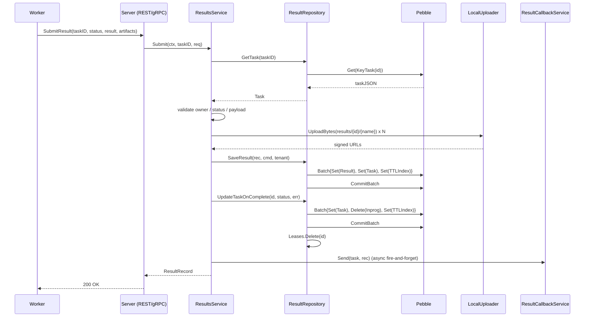
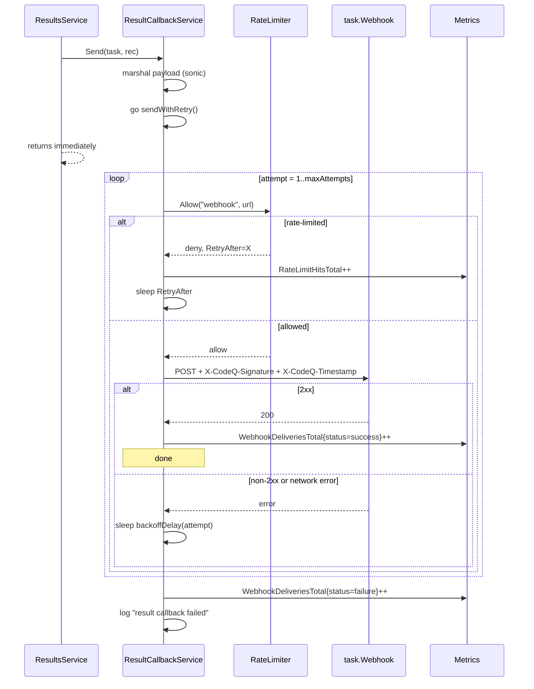

# Result storage and webhook callbacks

When a worker submits a result, codeq does two things back-to-back:

1. **Persists** a `ResultRecord` in Pebble and finalizes the parent `Task`
   in the **same atomic batch** (one commit, four writes).
2. **Optionally** delivers a webhook to the URL declared on
   `task.Webhook`, with an HMAC-SHA256 signature, in an async retry loop.

This doc describes both halves of the lifecycle, the BatchSubmit fast
path that ships in Phase 6/Q2, the artifact uploader, and — honestly —
the webhook coverage gaps that exist today.

See [_STYLE.md § Value proposition](./_STYLE.md#1-value-proposition) for
the canonical statement of what codeq is.

## 1. The Submit path

The single-task `Submit` flow lives in
[`internal/services/results_service.go`](../internal/services/results_service.go).
The repository it talks to is
[`internal/repository/pebble/result_repository.go`](../internal/repository/pebble/result_repository.go).

`Submit` does, in order:

1. `GetTask(taskID)` — load the current task. Fail with `not-found` if
   absent.
2. Verify ownership: if `task.WorkerID` is set and the caller's
   `WorkerID` differs, fail with `not-owner`.
3. Verify status: the task must be `IN_PROGRESS`. Otherwise fail with
   `not-in-progress`.
4. Validate result shape: `COMPLETED` requires `Result != nil`; `FAILED`
   requires a non-empty `Error`.
5. Upload artifacts (concurrent, fan-out 5; see §5).
6. `SaveResult(rec, cmd, tenantID)` — write the `ResultRecord` and stamp
   `task.ResultKey` in **one Pebble batch**.
7. `UpdateTaskOnComplete(taskID, ...)` — finalize task status, drop the
   `inprog` index entry, clear the in-memory lease, write the TTL index
   entry. **One more Pebble batch.**
8. Record Prometheus metrics: `codeq_task_completed_total` and
   `codeq_task_processing_latency_seconds`.
9. If `task.Webhook != ""`, fire the callback (§3).

> **Note**: steps 6 and 7 are **two separate batches** in the current
> code, not one. Each is internally atomic; together they are not. A
> crash between them leaves the result persisted but the task still
> `IN_PROGRESS` — the lease will expire and the task will be re-claimed,
> at which point the worker will see the new state on retry. This is
> covered by the at-least-once contract; see
> [Consistency model](./08-consistency.md).

### Sequence: single Submit



The `Inprog` delete is what removes the task from the per-command
pending index built by claim. Together with the in-memory lease drop,
this is what prevents the reaper from resurrecting the task.

## 2. The BatchSubmit fast path (Phase 6/Q2)

`BatchSubmit` is the hot path used by `/tasks/batch/results` (REST) and
the streaming `ResultBatch` envelope. It collapses the round-trip cost
of N independent submissions to **two Pebble commits**:

- `GetTasksBatch(ids)` — one pass over Pebble, N point reads.
- A per-result `SaveResult` loop (still one batch per result today; see
  the perf note below).
- `BatchUpdateTasksOnComplete(updates)` — **one** Pebble batch that
  packs N×3 writes (`Set(Task)`, `Delete(Inprog)`, `Set(TTLIndex)` per
  task) into a single `CommitBatch`.
- Result callback fan-out: after task finalization, invoke
  `s.callback.Send` once per task where `task.Webhook` is non-empty
  (see §3).

Net effect: a 32-result batch goes from ~32 commits to ~33 (one per
SaveResult, plus one shared commit for the task finalization). The
shared commit is the dominant win — `BatchUpdateTasksOnComplete` is what
group-commit and the Pebble fast-path land on.

> **Performance**: see
> [`internal/bench/profile_full_cycle_test.go::TestProfile_FullCycle`](../internal/bench/profile_full_cycle_test.go)
> at `PHASE8_SHARDS=4 PHASE6_BATCH=32 PHASE6_PROD_BATCH=8` — 83,420
> tasks/s on a 12-core Linux box. The batch path is what unlocks this
> number; the single Submit path runs ~5x slower at the same
> concurrency.

## 3. Webhook callback delivery

`ResultCallbackService.Send` lives in
[`internal/services/result_callback_service.go`](../internal/services/result_callback_service.go).

The synchronous path is trivially cheap:

1. If `task.Webhook` is empty, return immediately.
2. Build the payload (`taskId`, `eventType`, `status`, `result`,
   `error`, `artifacts`, `completedAt`) and `sonic.Marshal` it.
3. Spawn `go sendWithRetry(...)` and return. The caller never blocks.

The async loop is where the real work happens.

### Sequence: webhook delivery with retry



### HMAC signature

`addSignature` builds `HMAC-SHA256(secret, timestamp + "." + body)` and
attaches:

- `X-CodeQ-Timestamp` — Unix epoch seconds.
- `X-CodeQ-Signature` — hex-encoded MAC.

The secret comes from `webhookHmacSecret` (env `WEBHOOK_HMAC_SECRET`).
The validation contract is shared with worker-availability webhooks; see
[Webhooks](./12-webhooks.md#headers) for the receiver-side template.

### Backoff

`backoffDelay(attempt) = min(baseDelay << (attempt-1), maxDelay)`.

| Config key | Env | Default |
|---|---|---|
| `resultWebhookMaxAttempts` | `RESULT_WEBHOOK_MAX_ATTEMPTS` | 5 |
| `resultWebhookBaseBackoffSeconds` | `RESULT_WEBHOOK_BASE_BACKOFF_SECONDS` | 2 |
| `resultWebhookMaxBackoffSeconds` | `RESULT_WEBHOOK_MAX_BACKOFF_SECONDS` | 60 |

Worked example with defaults: attempts at 0s, 2s, 4s, 8s, 16s (capped
at 60s for attempt 6+). Five attempts span ~30s of real time before the
loop gives up and increments `codeq_webhook_deliveries_total{status="failure"}`.

Rate-limit hits via `internal/ratelimit` consume real time but do **not**
consume an attempt. A burst against a slow consumer can extend total
delivery wall-clock well beyond 30s while still respecting `maxAttempts`.

## 4. Webhook coverage — current state

This table documents which task terminal transitions fire result callbacks:

| Path | Webhook fires |
|---|---|
| Submit single (REST `/tasks/{id}/result`, Stream `Result` single) | Yes |
| BatchSubmit (REST `/tasks/batch/results`, Stream `ResultBatch`) | Yes |
| Worker Nack until `MAX_ATTEMPTS` → DLQ | Yes |
| Reaper lease-expired → DLQ | Yes |
| TTL cleanup (24h `taskRetention`) | No |

All major callback paths are now covered except TTL cleanup (which
runs asynchronously in a background reaper and does not currently
deliver callbacks). Producers can rely on webhooks to drive downstream
workflows for the vast majority of terminal transitions.

## 5. Artifact storage

When a worker submits artifacts with inline base64 payloads, the result
service uploads them through a pluggable
[`providers.Uploader`](../internal/providers/uploader.go) interface.

The default implementation is `LocalUploader`:

```go
func (u *localUploader) UploadBytes(ctx context.Context, objectPath string, contentType string, data []byte) (string, error) {
    dst := filepath.Join(u.rootDir, objectPath)
    // mkdir -p, create, copy, return file:// URL
}
```

- Root directory is `localArtifactsDir` (env `LOCAL_ARTIFACTS_DIR`,
  default `/tmp/codeq-artifacts`).
- Object path is `results/{taskID}/{artifactName}`.
- Return value is a `file://` URL placed directly into
  `ResultRecord.Artifacts[i].URL`.
- Uploads run with bounded concurrency: max 5 in flight per Submit, via
  a semaphore in `results_service.go`. The first upload error short-
  circuits the rest.

The `file://` scheme is intentional: it works for the default
single-node deployment where producer, server, and worker share the
filesystem. For multi-node setups, replace `LocalUploader` with a real
object-store implementation (S3, GCS) that returns presigned HTTPS URLs.
The interface is one method; see
[Persistence plugin system](./27-persistence-plugin-system.md) for the
plugin extension points.

Artifacts referenced by URL (no inline base64) skip the uploader
entirely and pass straight through into the result record.

## 6. Configuration reference

The relevant knobs from `pkg/config/config.go`:

| Key | Default | Purpose |
|---|---|---|
| `webhookHmacSecret` | (empty, required in non-dev) | HMAC key for `X-CodeQ-Signature` |
| `resultWebhookMaxAttempts` | 5 | Max delivery attempts before giving up |
| `resultWebhookBaseBackoffSeconds` | 2 | Initial backoff delay |
| `resultWebhookMaxBackoffSeconds` | 60 | Backoff cap |
| `localArtifactsDir` | `/tmp/codeq-artifacts` | Filesystem root for `LocalUploader` |
| `rateLimit.webhook.requestsPerMinute` | 0 (disabled) | Per-host webhook rate cap |
| `rateLimit.webhook.burstSize` | 0 | Token bucket burst |

`webhookHmacSecret` is **required** when webhooks are enabled and the
server is not in `dev` mode. Startup validation in `Config.Validate`
emits the error explicitly:

> `webhookHmacSecret is required when webhooks are enabled`

## 7. Code paths

- [`internal/services/results_service.go`](../internal/services/results_service.go)
  — `Submit`, `BatchSubmit`, the `IN_PROGRESS` precondition checks.
- [`internal/services/result_callback_service.go`](../internal/services/result_callback_service.go)
  — `Send`, `sendWithRetry`, `addSignature`, `backoffDelay`.
- [`internal/repository/pebble/result_repository.go`](../internal/repository/pebble/result_repository.go)
  — `SaveResult`, `UpdateTaskOnComplete`, `BatchUpdateTasksOnComplete`,
  `GetTasksBatch`.
- [`internal/providers/uploader.go`](../internal/providers/uploader.go)
  — `Uploader` interface and `LocalUploader`.
- [`pkg/config/config.go`](../pkg/config/config.go) — config keys and
  validation.

## See also

- [HTTP API](./04-http-api.md) — `/tasks/{id}/result` and
  `/tasks/batch/results` endpoints.
- [Webhooks](./12-webhooks.md) — worker-availability webhook semantics,
  signature verification template, rate limiting.
- [Producer streaming SDK](./35-producer-streaming-sdk.md) — submitting
  results from a producer that owns its tasks.
- [Worker streaming SDK](./36-worker-streaming-sdk.md) — the streaming
  `Result` and `ResultBatch` envelopes that flow through this service.
