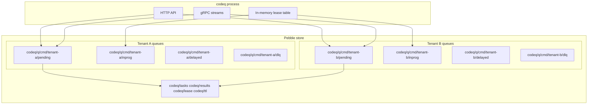
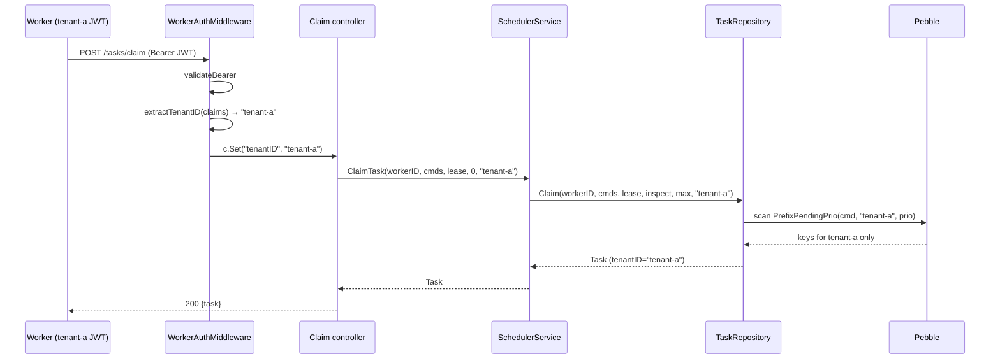

# Multi-tenancy

codeq supports multi-tenant deployments natively. Many tenants share the
same Go process and the same Pebble store, but no tenant can see, claim,
or complete another tenant's tasks. Isolation is enforced at three
points: JWT claim extraction (the request boundary), the queue key
layout (the storage boundary), and the worker claim path (the
scheduling boundary).

This is one of the items the comparison table in
[_STYLE.md § Comparativos](./_STYLE.md#comparativos-use-verbatim-or-as-a-base)
calls out as a differentiator. Asynq, BullMQ, Celery, Sidekiq, and Kafka
all leave tenant isolation to the application — you either build
namespaces yourself or run a separate broker per tenant. In codeq the
tenant ID is part of every queue key and every claim predicate.

## 1. What multi-tenant means here

A "tenant" in codeq is whatever string the JWT carries in a tenant-shaped
claim. Two tenants on the same codeq process:

- **Share** the binary, the gRPC server, the Pebble store, the lease
  table, the reaper goroutines, the cluster ring (if enabled), the
  metrics registry, and the rate-limit buckets.
- **Do not share** queue contents. Each tenant has its own set of
  `pending`, `inprog`, `delayed`, and `dlq` queues per command.

The model is namespacing, not sandboxing. A buggy tenant cannot read or
modify another tenant's tasks via the public API, but a process-level
compromise (someone running arbitrary Go inside the server) trivially
crosses tenant boundaries. Treat codeq as a multi-tenant queue, not as
a security boundary against untrusted code.

## 2. Tenant ID extraction

Every request lands in one of two middlewares — producer or worker —
both of which call `extractTenantID` on the validated JWT claims:

```go
// internal/middleware/tenant.go
func extractTenantID(claims *auth.Claims) string {
    if claims == nil || claims.Raw == nil {
        return ""
    }
    tenantID := ""
    if v, ok := claims.Raw["tenantId"].(string); ok {
        tenantID = strings.TrimSpace(v)
    } else if v, ok := claims.Raw["tenant_id"].(string); ok {
        tenantID = strings.TrimSpace(v)
    } else if v, ok := claims.Raw["organizationId"].(string); ok {
        tenantID = strings.TrimSpace(v)
    } else if v, ok := claims.Raw["organization_id"].(string); ok {
        tenantID = strings.TrimSpace(v)
    }
    if tenantID == "" {
        tenantID = strings.TrimSpace(claims.Subject)
    }
    return tenantID
}
```

The resolution order is fixed:

1. `claims.Raw["tenantId"]` — preferred camelCase form.
2. `claims.Raw["tenant_id"]` — snake_case alternative.
3. `claims.Raw["organizationId"]` — common in B2B identity providers.
4. `claims.Raw["organization_id"]` — snake_case alternative.
5. `claims.Subject` — single-tenant fallback. The JWT subject becomes
   the tenant ID, which is the right behaviour for setups where every
   token represents exactly one customer.

The result is stored in the Gin context under `tenantID` and read out by
controllers via `middleware.GetTenantID(c)`. The producer gRPC server
duplicates the same logic in `internal/producer/server.go` —
`tenantIDFromClaims` — to keep the gRPC binary free of the Gin import.

> **Note**: there is no separate "tenant claim is required" config.
> If your tokens carry no tenant-shaped claim, every request falls
> through to the subject; codeq then behaves as a single-tenant queue
> where each subject is its own logical tenant.

## 3. Storage isolation

The Pebble keyspace folds the tenant ID into every queue key. From
`internal/repository/pebble/keys.go`:

```
codeq/q/<cmd>/<tenant>/pending/<prio_be1>/<seq_be8>/<id>
codeq/q/<cmd>/<tenant>/inprog/<id>
codeq/q/<cmd>/<tenant>/delayed/<score_be8>/<id>
codeq/q/<cmd>/<tenant>/dlq/<id>
```

Helpers like `KeyPending`, `KeyInprog`, `KeyDelayed`, and `KeyDLQ`
all take `tenantID` as a parameter and call `queueBase`, which is:

```go
func queueBase(cmd domain.Command, tenantID string) string {
    return pQueue + cmdSeg(cmd) + "/" + tenantSeg(tenantID)
}
```

`tenantSeg` substitutes `""` with the literal `"_"` so the key parser
can split on `/` without losing the empty position — useful when an
operator wants a single-tenant deployment without setting a JWT claim.

The `tasks/<id>`, `results/<id>`, `idempo/<key>`, `lease/<id>`, and
`ttl/<expire_unix_be8>/<id>` keys are **not** tenant-prefixed. They are
indexed by task ID or idempotency key, both of which are globally
unique within the Pebble store. The Task and ResultRecord payloads
themselves carry `TenantID` as a JSON field; callers that fetch by ID
get the tenant back from the value.

Trade-off: this layout means a tenant-scoped range scan (e.g. "list
pending for tenant X command Y") is a single Pebble prefix iteration —
no cross-tenant work. A cross-tenant admin scan (e.g. "DLQ depth across
all tenants for command Y") has to scan the whole `codeq/q/<cmd>/`
prefix, which is fine for ops but should not be on the hot path.



## 4. Worker claim isolation

A worker is bound to its JWT-declared tenant. The claim path in
`pkg/persistence/interface.go` carries the tenant explicitly:

```go
ClaimTask(ctx, workerID, commands, leaseSeconds, inspectLimit, tenantID) (*Task, bool, error)
```

The controller wires it together:

```go
// internal/controllers/batch_claim_task_controller.go
tenantID := ""
if v, ok := c.Get("tenantID"); ok {
    if tid, ok := v.(string); ok {
        tenantID = tid
    }
}
task, ok, err := h.svc.ClaimTask(ctx, claims.Subject, req.Commands,
    req.LeaseSeconds, 0, tenantID)
```

This resolves to a `PrefixPendingPrio(cmd, tenantID, prio)` scan over
the local Pebble store — the worker literally cannot iterate another
tenant's pending queue because the prefix doesn't include it.



### Why the tenantID parameter, not the JWT, is the source of truth

The persistence interface takes `tenantID` as a plain string — it does
not inspect claims. The middleware pulls the tenant from the JWT and
hands it to the controller; the controller hands it to the service;
the service hands it to the repository. This avoids two failure modes:

1. **Forging a tenant via request body.** Producers cannot set a
   `tenantId` field on a task and have it routed to another tenant's
   queue — the value is overwritten from the JWT-derived context at
   the controller boundary.
2. **Cross-tenant claim by mistake.** Even a worker that supplies
   `tenantID: "other"` in a (hypothetical) request body cannot pull
   another tenant's task, because the controller ignores the body and
   uses the middleware-set value.

### The Phase 6 race fix

Before the Phase 6 finalization fix, `UpdateTaskOnComplete` took only
`(taskID, cmd, status, errorMsg)` — no tenant. Without the tenant in
the signature, the inprog key used at finalization could land on a
different tenant prefix than the one the claim path wrote, causing a
rare resurrection race for completed tasks. The fix added `tenantID`
to the signature so the finalize path and the claim path target the
exact same inprog key. Details and the measured `-43%` DLQ depth
improvement are in
[Performance tuning § Result Submission Race](./17-performance-tuning.md#15-result-submission-race-condition-atomic-finalization).

## 5. Multi-tenant + cluster routing

> Note: this section describes Phase 5 cluster mode
> ([`docs/05-cluster-architecture.md`](./05-cluster-architecture.md)).
> RAFT mode ([`docs/40-raft-replication.md`](./40-raft-replication.md))
> is the recommended HA path; cluster mode is preserved for existing
> deployments and is mutually exclusive with `raft.enabled`.

Cluster mode uses a consistent-hash ring keyed by **task ID**, not by
tenant. The ring layout, virtual nodes, and `Owner(key)` lookup are
documented in [Cluster architecture](./05-cluster-architecture.md). The
relevant fact for tenancy is:

- `Ring.Owner(taskID)` returns the node that owns a given task.
- The tenant ID is **not** part of the hash input.

This is intentional. A tenant's tasks are spread across every cluster
node proportionally to the ring's virtual-node distribution. Two
implications:

- **No tenant pinning.** You cannot say "tenant-a lives on node 1, tenant-b
  on node 2" with the default ring. Every node holds a slice of every
  tenant's queue.
- **Tenant isolation still holds.** The task ID hashes to a node; that
  node stores the task in `codeq/q/<cmd>/<tenant>/...` exactly as a
  single-node deployment would. A worker authenticated as tenant-a
  claiming on node 1 only sees tenant-a's pending queue on node 1.
  Cross-node claim spillover is also tenant-scoped — the gRPC
  `ClaimRPC` carries `tenant_id` (see
  `internal/cluster/proto/clusterpb.proto`).

If you need to route an entire tenant to a specific node (data
residency, noisy-neighbour quarantine), that requires a custom router
on top of the ring. It is not built in.

## 6. Multi-tenant + intra-process sharding

Inside a single process, `numShards > 1` spins up N independent Pebble
instances. The shard selector is `shardOf(taskID)` — again, a hash of
the task ID, not the tenant.

| Property | Behaviour |
|---|---|
| Shard input | Task ID |
| Tenant input to shard hash | None |
| Tenant in key layout per shard | Yes — every shard's keyspace still uses `codeq/q/<cmd>/<tenant>/...` |
| Cross-tenant amplification | A scan across all tenants for one command requires N (shards) × T (tenants) range bounds |

The net effect: sharding is tenant-agnostic. A single tenant's tasks
spread across all shards just like every other tenant's; a single
tenant cannot pin itself to one shard.

> **Note**: cluster mode and `numShards > 1` are mutually exclusive —
> startup panics if both are set. See
> [Performance tuning](./17-performance-tuning.md) and
> [Sharding](./06-sharding.md).

## 7. Rate limiting per tenant — current state and gap

Rate limiting today is **per bucket type**, not per tenant. The
configured buckets in `middleware/rate_limit.go` are:

- `producer` — applied to producer `Enqueue` calls.
- `worker` — applied to worker `Claim` calls.
- `admin` — applied to admin cleanup endpoints.

The bucket key is `(scope, bearerToken)` — the JWT string is the
identity used by the limiter. Practically this means:

- Two distinct JWTs belonging to the same tenant get two independent
  buckets. Per-tenant aggregate throughput is unbounded.
- A single JWT shared across many callers shares one bucket.

This is a known gap. A correct multi-tenant rate limiter would key by
`(scope, tenantID, operation)` and let an operator configure
per-tenant overrides. The plumbing is small — `extractTenantID` is
already called before the rate limit middleware runs, so the tenant ID
is in the Gin context by the time we reach the limiter.

**Roadmap**: a future change should switch `rateLimitBearer` to use
`tenantID` (with the bearer token as fallback for unauthenticated
edges) and expose per-tenant overrides in `config.RateLimit`. No ETA.

## 8. Quota and fair scheduling — not implemented

codeq has no per-tenant quota and no fair scheduler. All tenants share
the same priority-FIFO claim path. A tenant that floods the queue with
low-latency work can saturate the worker pool and starve other tenants
of claim slots.

The current mitigations are operational, not architectural:

- **Separate command names per workload class.** Workers subscribed
  only to `cmd=critical` won't see `cmd=batch` traffic regardless of
  tenant. This trades isolation for fleet split.
- **Separate codeq deployments per high-volume tenant.** Pebble's
  exclusive file lock prevents two codeq processes on the same data
  dir, so the natural pattern is one process per data-residency or
  noisy-neighbour boundary.
- **Rate limit at the SDK / ingress.** The producer SDKs respect
  `Retry-After`; you can pre-throttle a tenant client-side.

**Roadmap**: weighted-fair-queue claim path that gives each active
tenant a guaranteed share of worker slots. The change requires a
tenant-aware ready queue (today the pending priority bucket is keyed
by `(cmd, tenant)` but the worker iterates one bucket at a time, not
fair-share across tenants). Filed but not scheduled.

## 9. Operational checklist

When you turn on multi-tenancy for the first time:

- [ ] Confirm your IdP issues a `tenantId` / `tenant_id` /
      `organizationId` / `organization_id` claim. If not, every
      subject becomes its own tenant — that is fine for single-tenant
      per JWT.
- [ ] Verify with a smoke test: produce a task as tenant-a, attempt to
      claim it as tenant-b, expect 0 results. The test
      `internal/repository/tenant_isolation_test.go::TestTenantIsolation`
      exercises this end-to-end.
- [ ] Decide your scaling axis. Single process + shards (one customer
      base, share infra) or cluster mode across nodes (HA, larger
      fleet). Cluster is tenant-aware but not tenant-pinned.
- [ ] Confirm metrics carry tenant labels where you care. Today most
      counters are global; cardinality is the reason.
- [ ] Document the rate-limit and quota gap to your tenants before
      onboarding the first noisy one.

## See also

- [Security](./09-security.md)
- [HTTP API](./04-http-api.md)
- [Authentication plugins](./20-authentication-plugins.md)
- [Queueing model](./05-queueing-model.md)
