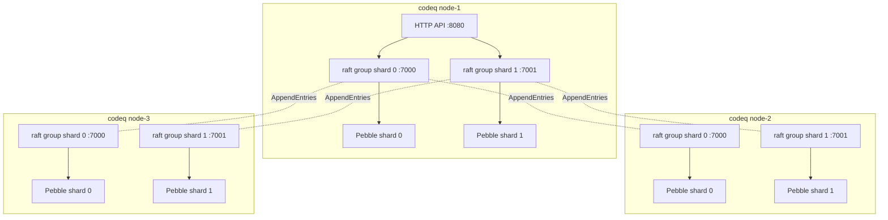

# Raft replication

codeq's opt-in HA path: every Pebble write flows through
[hashicorp/raft](https://github.com/hashicorp/raft) before landing
locally. Followers receive the same write through the consensus log
and apply it via the FSM, so all replicas converge on identical state.
Leader fails over automatically when a node dies.

Status: M1 (single-shard, single-raft per node) and M2 (multi-shard,
one raft group per shard) are in main. Server-side leader forwarding
and a multiplexed gRPC transport are tracked follow-ups.

## When to enable

| Scenario | Use raft? |
|---|---|
| Single-node dev / lab | No. Default Pebble path is fine. |
| One box, durability tolerant of host loss via disk replication | No. Use storage-layer replication beneath Pebble (ZFS / EBS-style). |
| Multi-node, automatic failover required, dataset fits one box | **Yes**. M1 single-raft. |
| Multi-node, horizontal scale required | **Yes**. M2 multi-shard raft (one group per Pebble shard). |

Raft is **mutually exclusive** with `cluster.enabled` (the legacy
static-ring mode) and with `sharding.enabled` (the legacy
multi-backend `ShardSupplier`). The startup path enforces this at
config validation.

## Architecture



In M2 multi-shard mode, each Pebble shard becomes an independent raft
group spanning all cluster nodes. A given node may lead some shards
and follow others; leadership is decided per group.

## Configuration

`cfg.Raft` enables and tunes the raft path. Minimal 3-node config:

```yaml
persistenceProvider: pebble
persistenceConfig:
  path: /var/lib/codeq/pebble
  numShards: 4            # optional — multi-shard raft (M2)

raft:
  enabled: true
  selfId: node-1          # must be unique per node
  bindAddr: 127.0.0.1:7000  # base port; multi-shard uses bindAddr+shardIdx
  bootstrap: true         # ONLY on the first node during initial cluster formation
  peers:
    node-1: 127.0.0.1:7000
    node-2: 127.0.0.2:7000
    node-3: 127.0.0.3:7000
  heartbeatMS: 1000
  electionMS: 1000
  leaderLeaseMS: 500
  commitMS: 50
  applyTimeoutSeconds: 10
```

**Multi-shard port convention**: with `numShards: 4`, shard 0 listens
on `bindAddr`, shard 1 on `bindAddr+1`, etc. The `peers` map contains
each peer's BASE address; per-shard addresses derive automatically.
Reserve 4 consecutive ports per node.

**Bootstrap**: `bootstrap: true` on exactly ONE node when forming a
fresh cluster. After the first successful bootstrap raft writes its
state to the local Pebble and ignores the flag on subsequent restarts
— the leader replicates the cluster configuration to the other peers
automatically. Set `bootstrap: false` on the other nodes.

**Startup ordering**: followers (`bootstrap: false`) must be listening
before the bootstrapper (`bootstrap: true`) starts — otherwise its
initial dial attempts hit `connection refused` and election takes
longer. Production deployments use systemd `After=` or k8s readiness
gates; tests start followers first explicitly.

## Operational model

### Leadership

- Each shard's raft group has one leader at a time.
- Leadership migrates on node loss; election completes in
  `heartbeatTimeout + electionTimeout` (default 2 s, ~100 ms with the
  tightened test config).
- Reads are local on every node, with no consensus round; followers
  may serve stale data. Strong reads must hit the leader.
- Writes only succeed on the leader. Hitting a follower returns
  `pebble: not leader`; clients retry against another node (or in
  M3 follow-up work, the server forwards internally).

### Observing leadership

`GET /v1/codeq/raft/status` returns per-shard state:

```json
{
  "enabled": true,
  "numGroups": 4,
  "groups": [
    {"shardIdx": 0, "isLeader": true,  "selfId": "node-1",
     "selfAddr": "127.0.0.1:7000",
     "leaderId": "node-1", "leaderAddr": "127.0.0.1:7000", "hasLeader": true},
    {"shardIdx": 1, "isLeader": false, "selfId": "node-1",
     "selfAddr": "127.0.0.1:7001",
     "leaderId": "node-2", "leaderAddr": "127.0.0.2:7001", "hasLeader": true}
  ]
}
```

Use this for ops monitoring (alert when `hasLeader=false` for more
than a few seconds), Prometheus scraping, or to drive future
client-side smart routing.

### Reaper coordination

In raft mode only the leader sweeps expired leases and TTL entries.
Each raft group's reaper checks its own
`raft.DB.IsLeader()` and skips ticks otherwise. Failover catches up
on the next tick after election — no manual intervention.

## What's NOT covered yet

- **Server-side leader forwarding**: when a write hits a follower it
  returns an error and the client retries. The realistic deployment
  needs either smart-routing clients or server-side forwarding to
  realize the multi-shard throughput speedup.
- **gRPC multiplexed transport** (M2.T3): today each shard binds its
  own TCP port for raft RPCs. With 4 shards × 3 nodes that's 12
  listeners across the cluster. A multiplexed gRPC transport would
  reduce that to 3 (one per node) but doesn't change semantics.
- **Operational tooling**: no `codeq install --target docker` flag for
  raft clusters yet. Compose templates are single-node.

## See also

- [05-cluster-architecture.md](./05-cluster-architecture.md) — the
  legacy consistent-hash mode (mutually exclusive with raft)
- [07b-storage-pebble.md](./07b-storage-pebble.md) — Pebble layout
- [14-configuration.md](./14-configuration.md) — full config reference
  including `cfg.Raft`
- [29-operational-runbooks.md](./29-operational-runbooks.md) — ops
  procedures including raft failover
- [hashicorp/raft](https://github.com/hashicorp/raft) — the consensus
  library codeq builds on
