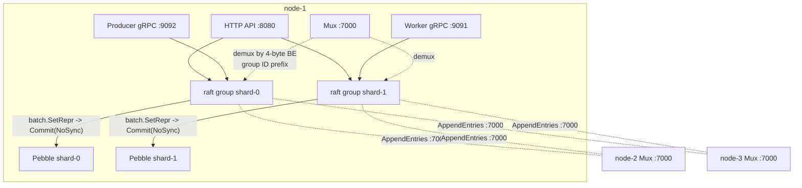

# Raft replication

codeq's opt-in HA path. Writes flow through
[hashicorp/raft](https://github.com/hashicorp/raft) before they land in
the local Pebble store: the leader serialises the batch into a raft log
entry, replicates it via AppendEntries to a majority of peers, and only
after the entry is committed does every replica (leader and followers)
turn it back into a `pebble.Batch` inside the FSM. Reads stay local;
writes that hit a follower return `ErrNotLeader` and the controller
layer either redirects (HTTP 307) or surfaces the error (gRPC). Leader
election is automatic on node loss.

Status: M1 (single-shard, single raft group per node) and M2
(multi-shard, one raft group per Pebble shard) are in main. Server-side
leader forwarding for gRPC streams is a tracked follow-up.

## 1. When to enable

| Scenario | Use raft? |
|---|---|
| Single-node dev / lab | No. The default Pebble path is fine. |
| One box, durability tolerant of host loss via disk replication | No. Use storage-layer replication beneath Pebble (ZFS / EBS-style block replication). |
| Multi-node, automatic failover required, dataset fits one box | Yes. M1 single-raft. |
| Multi-node, horizontal write throughput required | Yes. M2 multi-shard raft (one group per Pebble shard). |

### Mutual exclusions

Raft conflicts with the older horizontal-scaling modes; the startup path
rejects mixed configs at validation time. From
`pkg/config/config.go:662-683`:

- `raft.enabled` + `cluster.enabled` -> rejected. `cluster` is the
  legacy static-ring mode (consistent hash over remote codeq nodes); it
  pre-dates raft and has no consensus.
- `raft.enabled` + `sharding.enabled` -> rejected. `sharding.enabled`
  refers to the legacy multi-backend `ShardSupplier` that fans out to
  external backends per tenant; the supported multi-shard mode under
  raft is `persistenceConfig.numShards` against the embedded Pebble.
- `raft.enabled` + `persistenceProvider != "pebble"` -> rejected. Raft
  only wires onto the Pebble persistence layer.

The supported multi-shard topology is therefore exactly one combination:
`raft.enabled: true` + `persistenceProvider: pebble` +
`persistenceConfig.numShards: N`. That gives N raft groups per node,
each owning one Pebble shard, each electing a leader independently.
This is what we call M2.

## 2. Architecture



Port labels:

- `:8080` HTTP API (incl. `/v1/codeq/raft/status`)
- `:9091` worker-stream gRPC
- `:9092` producer-stream gRPC
- `:7000` raft transport (mux). All shards share this port and are
  demultiplexed by a 4-byte big-endian group ID written on each
  connection. See section 6.

In M2 multi-shard mode every Pebble shard becomes an independent raft
group spanning all cluster nodes. A given node may lead some shards and
follow others; leadership is decided per group. Read traffic stays
local on every node; write traffic gets routed to the per-shard leader
either by the HTTP 307 redirect (controllers) or by the smart-routing
producer/worker clients (gRPC).

## 3. The write path

End-to-end for a `CreateTask` over HTTP, with file:line citations:

1. HTTP request lands on the `tasks` controller and is dispatched to
   `SchedulerService.CreateTask`.
2. `SchedulerService` calls `ShardedTaskRepository`, which hashes the
   tenant/task ID to a shard index and forwards to the per-shard
   `TaskRepository`
   (`internal/repository/pebble/sharded_task_repository.go:28`).
3. `TaskRepository` builds a `pebble.Batch` with the task payload,
   pending-queue key, and any index keys, then calls
   `db.CommitBatch(batch)`.
4. `pebble.DB.CommitBatch` branches on whether a replicator is attached
   (`internal/repository/pebble/db.go:285`):
   - No replicator -> the local group-commit coalescer collapses
     concurrent batches into one Pebble `Commit` (see
     `docs/07b-storage-pebble.md`).
   - Replicator attached -> the batch's `Repr()` is handed to
     `repl.Replicate(repr)` instead, bypassing the local coalescer.
5. `raft.DB.Replicate` (`internal/raft/db.go:558`) checks leadership and
   either:
   - returns `ErrNotLeader` if this node is a follower, which the
     repository wraps in `NotLeaderError{LeaderURL: ...}` so the
     controller can issue HTTP 307, or
   - enqueues an `applyReq` on the per-shard `applyCh` channel.
6. A single goroutine drains `applyCh`, opportunistically pulls up to
   `raftMergeBatch=128` concurrent requests off the channel, builds one
   merged `pebble.Batch` by replaying each submitter's `Repr()` via
   `SetRepr` + `Apply`, and submits a single `raft.Apply(mergedRepr,
   ApplyTimeout)`.
7. hashicorp/raft assigns the entry an index + term, appends it to the
   local `logStore` (Pebble prefix `raft/log/`), and ships it via
   AppendEntries over the mux transport (`:7000`) to the other peers.
8. Each follower writes the entry to its own `logStore`, acks, and once
   the leader sees a majority quorum the entry is "committed".
9. raft on every replica (leader included) feeds the committed entry to
   the FSM. `fsm.Apply` (`internal/raft/fsm.go:43-62`) copies the
   payload (raft reuses its log buffers), calls
   `batch.SetRepr(payload)`, and runs `batch.Commit(pebble.NoSync)`.
10. The leader's `raft.Apply` future returns. The coalescer fans the
    success/error response back to every submitter that contributed to
    the merged batch; each caller's `CommitBatch` returns; the
    controller writes the HTTP 201.

For a gRPC producer stream the path is the same from step 3 onward; the
only difference is steps 1-2 are replaced by the producer-stream
handler ingesting a `TaskBatch` message.

## 4. The FSM

The full FSM body, distilled from `internal/raft/fsm.go:43-62`:

```go
func (f *fsm) Apply(log *hraft.Log) any {
    if log == nil || log.Type != hraft.LogCommand || len(log.Data) == 0 {
        return nil
    }
    repr := make([]byte, len(log.Data))
    copy(repr, log.Data) // raft reuses log buffers; copy is mandatory
    batch := f.pebble.NewBatch()
    defer batch.Close()
    if err := batch.SetRepr(repr); err != nil {
        return fmt.Errorf("fsm apply: SetRepr: %w", err)
    }
    if err := batch.Commit(pebbledb.NoSync); err != nil {
        return fmt.Errorf("fsm apply: commit: %w", err)
    }
    return nil
}
```

The invariant: every replica runs the same `Apply` on the same input,
so all Pebble stores converge. raft guarantees `Apply` is serialized
within a group (the FSM runner is single-threaded), so we never see two
overlapping batches racing on Pebble. `NoSync` here is deliberate: the
durability promise is provided by raft's own log fsync on a majority of
peers, not by every FSM commit also fsyncing - that would double the
write amplification with no extra guarantee. Crash recovery walks the
raft log and re-applies any entries past `lastApplied` into the FSM.

Non-`LogCommand` entries (`LogNoop`, `LogBarrier`, `LogConfiguration`)
short-circuit at the top of `Apply`; raft's runFSM dispatcher already
filters most of them but the defensive check costs nothing.

## 5. The Apply coalescer

Every call to `raft.Apply` pays a roughly fixed roundtrip cost:
serialise the entry, write it to the local log, AppendEntries to every
follower, wait for majority ack, dispatch to FSM, fsync the FSM commit.
Most of that cost is per-entry, not per-byte. When a producer stream
opens 64 concurrent goroutines each calling `Replicate` with a small
batch, naively that is 64 separate raft entries — 64 fsyncs on the
leader's log, 64 AppendEntries flights, 64 FSM applies on every
replica.

The coalescer mirrors what Pebble's own group commit already does one
layer down. From `internal/raft/db.go`:

- `Replicate` enqueues an `applyReq{repr, done}` on `applyCh` (buffered
  channel) instead of calling `raft.Apply` directly.
- A single apply-loop goroutine pops the first request, then drains the
  channel non-blockingly to pick up any siblings already in flight, up
  to `raftMergeBatch = 128`.
- It builds one merged `pebble.Batch` via `SetRepr` on the first repr
  and `batch.Apply` to fold in the rest, calls `raft.Apply(merged.Repr(),
  ApplyTimeout)` once, and fans the result back to every contributing
  `done` channel.

Each submitter still gets its own `error` and its own completion signal;
nothing about the per-caller semantics changes. Cross-call ordering is
still serialised through raft's log (the merged entry has one index, so
all batches inside it commit atomically), and within the merged entry
the batches operate on disjoint keys in practice (producer tasks have
independent UUIDs; result writes key by task ID).

Measured impact, on a 3-node × 4-shard cluster driven through the gRPC
producer stream (see `pkg/app/raft_grpc_bench_test.go`):

| Path | cycles/s |
|---|---|
| HTTP smart-routing baseline (`pkg/app/raft_smart_routing_bench_test.go`) | 3,883 |
| gRPC stream, no coalescer | 15,370 |
| gRPC stream, raft Apply coalescer | 19,784 |

Roughly +28% over the gRPC baseline and +5.1x over the HTTP path. At
that throughput a single 4-shard cluster and a 1-shard cluster reach
roughly the same number, confirming the per-shard pipeline is no longer
the bottleneck — the apply loop now saturates the FSM commit ceiling
inside one raft group.

## 6. Mux transport

Every shard in M2 has its own raft group, and each raft group wants a
TCP transport. The naive option is one TCP listener per shard
(`:7000`, `:7001`, ...) — clear but wasteful: it forces the operator to
reserve N consecutive ports per node, complicates firewall rules, and
makes auto-scaling shards a port-management exercise.

`internal/raft/mux_transport.go:15-52` collapses all shards onto one
TCP listener:

- `NewMuxAcceptor(bindAddr, logOut)` opens a single `net.Listen("tcp",
  bindAddr)` (`:7000` by default) and starts an accept loop.
- `RegisterGroup(groupID uint32)` returns an `hraft.StreamLayer` keyed
  by `groupID`. One layer per Pebble shard; the shard index is the
  group ID.
- Every dial writes the 4-byte big-endian group ID as the first 4 bytes
  on the new connection
  (`muxStreamLayer.Dial`, `mux_transport.go:217-230`).
- The accept loop's `routeConn` reads those 4 bytes, looks up the
  matching `muxStreamLayer`, and pushes the bare connection onto that
  layer's queue. From there, `hraft.NewNetworkTransport` drives its
  usual wire protocol unchanged — no new RPCs, no protobuf, nothing
  hashicorp/raft can object to.

A 1-second read deadline on the prefix prevents a half-open connection
from blocking the route goroutine forever
(`mux_transport.go:124`). Unknown group IDs are logged and the
connection dropped.

The mux transport is enabled with `raft.muxEnabled: true` (or
`RAFT_MUX_ENABLED=true`). The `deploy/docker-compose/raft-cluster/`
template defaults to mux. Flipping mux on a live cluster requires
re-bootstrap because the wire format is not compatible with stock
hashicorp/raft TCP transport — the 4-byte prefix would be interpreted
as part of the raft handshake.

## 7. Log, stable, and snapshot stores

All four pieces of raft persistence live on the same `pebble.DB` that
backs the FSM — separated only by key prefix:

| Component | Prefix / path | File |
|---|---|---|
| FSM data | `codeq/*` | `internal/repository/pebble/*` |
| Log store | `raft/log/*` | `internal/raft/log_store.go` |
| Stable store | `raft/stable/*` | `internal/raft/stable_store.go` |
| Snapshot store | `<path>/snapshots/` (file) | `internal/raft/snapshot.go` |

- **Log store**: entries keyed `raft/log/<be8 index>`, values
  msgpack-encoded `hraft.Log` (same encoding raft-boltdb uses, so the
  wire shape is unsurprising). `StoreLogs` writes a single
  `pebble.Batch` for atomic append; `DeleteRange` handles compaction
  after a snapshot. Single pebble instance means appending a raft log
  entry and updating the FSM both go through one fsync queue, so a
  single commit gives us both raft durability and FSM persistence.
- **Stable store**: term, vote, last-applied index. Tiny, frequently
  updated. `raft/stable/*` prefix, no msgpack — the values are short
  byte slices and uint64s.
- **Snapshot store**: `hraft.NewFileSnapshotStore(<path>/snapshots, 3,
  ...)`. retain=3. The snapshot body itself is produced inside the FSM
  (`fsm.Snapshot`) by opening a `pebble.NewSnapshot` for a point-in-time
  view and streaming the `codeq/*` range with a tiny framed format
  (magic `CDQS`, version, TLV entries — `snapshot.go:43-50`).
  `SnapshotEntries=8192` is the default trigger: every 8192 committed
  log entries, raft asks the FSM for a fresh snapshot and then
  `DeleteRange`s the now-redundant log entries.

Putting all four on one Pebble DB keeps the on-disk footprint to a
single LSM tree, reuses the same block cache, and makes backups a
matter of cloning one directory. Recovery after disk loss is `rm -rf
data/<shard>` + restart: raft sees an empty store, asks the leader for
an InstallSnapshot, rebuilds.

## 8. Timing parameters

Defaults are set in `internal/raft/db.go:53-97`. Override in YAML under
`raft:` or via `RAFT_*_MS` environment variables.

| Field | Default | What it controls | Tuning notes |
|---|---|---|---|
| `heartbeatMS` | 1000 | Interval at which the leader sends AppendEntries (empty if no new entries) to assert leadership. | Lower = faster failover detection, more network chatter. Tests run at ~50ms. |
| `electionMS` | 1000 | How long a follower waits without a heartbeat before starting an election. | Should be a few multiples of heartbeat. Failover takes `heartbeat + election` worst case (~2s default, ~100ms tests). |
| `leaderLeaseMS` | 500 | How long a leader trusts its lease before stepping down on unreachable quorum. | Tighter than heartbeat to prevent split-brain on slow followers. |
| `commitMS` | 50 | Max time a follower batches AppendEntries acks before sending. | Trade between commit latency and the per-RPC cost. |
| `applyTimeoutSeconds` | 10 | Per-write `raft.Apply` timeout. | Set higher only if your FSM is genuinely slow (we're not — FSM commit is `NoSync`). Used as the soft ceiling on a single coalesced apply. |
| `snapshotEntries` | 8192 | Log entries between snapshot triggers. | Higher = bigger logs, faster startup of new followers via log replay; lower = more frequent snapshots, smaller log footprint. |

The combination `heartbeat=1000ms` + `election=1000ms` gives a roughly
2-second failover window. That's a default chosen for stability over a
loaded WAN; LAN deployments routinely tighten both to 100-250ms with no
ill effect, and the test config goes lower still.

## 9. Observing leadership

`GET /v1/codeq/raft/status` (served by
`internal/controllers/raft_status_controller.go`) returns per-shard
state in JSON:

```json
{
  "enabled": true,
  "numGroups": 4,
  "groups": [
    {
      "shardIdx": 0,
      "isLeader": true,
      "selfId": "node-1",
      "selfAddr": "127.0.0.1:7000",
      "leaderId": "node-1",
      "leaderAddr": "127.0.0.1:7000",
      "leaderHTTPAddr": "http://127.0.0.1:8080",
      "hasLeader": true
    },
    {
      "shardIdx": 1,
      "isLeader": false,
      "selfId": "node-1",
      "selfAddr": "127.0.0.1:7000",
      "leaderId": "node-2",
      "leaderAddr": "127.0.0.2:7000",
      "leaderHTTPAddr": "http://127.0.0.2:8080",
      "hasLeader": true
    }
  ]
}
```

When raft is disabled the endpoint still returns 200 with
`{"enabled": false, "numGroups": 0}` — the payload is the source of
truth.

Useful alerts:

- `hasLeader == false` for any group sustained more than a few seconds.
  Either ongoing election (briefly normal during failover) or split
  quorum (real problem).
- Leader churn: count transitions of `leaderId` per group over a window.
  Steady-state should be zero; non-zero means flapping nodes or
  too-tight election timeouts.
- Per-shard leader distribution: if all `isLeader: true` shards land on
  one node, write throughput stops scaling. Multi-shard's whole point
  is parallel leaders.

The reaper (lease + TTL sweep) checks `raft.DB.IsLeader()` per group
each tick and skips work when not leader, so the leader of each shard
owns its expiry sweep. No external coordination needed.

## 10. Failure modes

Three-node cluster, f=1 (majority = 2 of 3):

- **Single node down**: cluster keeps writing. The remaining two form a
  quorum, the dead node's followed shards fail over within
  `heartbeat + election`. The down node's led shards elect new
  leaders on the surviving pair.
- **Two of three down (majority loss)**: cluster cannot commit new
  entries. Reads still succeed from the surviving node (stale). Bring a
  second node back and writes resume automatically — the recovered
  node catches up via log replay or InstallSnapshot.
- **Disk loss on one node**: stop the process, `rm -rf data/<node>`,
  restart. The empty store causes raft to request InstallSnapshot from
  the leader; once received the node re-joins as a follower. No manual
  reseeding.
- **Split brain**: impossible. A leader requires majority quorum to
  commit, and a leader that loses contact with the majority steps down
  inside `leaderLeaseMS`. A minority partition simply stops writing.
- **Slow follower**: the leader keeps shipping AppendEntries with the
  follower's actual `nextIndex`; eventually the gap grows past the
  snapshot threshold and the leader installs a fresh snapshot. No write
  stalls on the leader side as long as a majority is healthy.

Five-node clusters get f=2 (survive any two failures) at the cost of
slower commit (4-of-5 ack instead of 2-of-3). Even-sized clusters give
no extra fault tolerance over the next-lower odd size — don't bother.

## 11. What is NOT covered

These belong on the roadmap, not in this doc, but the boundary matters
for ops planning:

- **Server-side gRPC forwarding**: HTTP controllers turn `NotLeaderError`
  into a 307 + Location header pointing at `LeaderHTTPAddr`. gRPC stream
  handlers do not forward today — a producer that connects to a
  follower receives `ErrNotLeader` on the first batch and must reconnect
  to the leader. The producer / worker clients in `pkg/producerclient`
  and `pkg/workerclient` already implement smart-routing on top of the
  `/v1/codeq/raft/status` endpoint, so the common case is handled
  client-side; the server-side fix is tracked separately.
- **Linearizable reads**: every read is local, including reads on a
  follower. A reader may see a value the leader committed N
  milliseconds ago but that has not yet been applied on this follower.
  If your workload needs read-after-write across nodes, route reads to
  the leader. A `ReadIndex`-style strong-read path is not implemented.
- **Cross-shard transactions**: each Pebble shard is an independent raft
  group. There is no two-phase commit across shards. The repository
  layer routes a given task to exactly one shard (hash on tenant /
  task ID), so single-task operations are naturally single-shard;
  multi-task batches that span shards are not atomic across the group
  boundary.
- **Online membership change tooling**: hashicorp/raft supports adding
  and removing voters at runtime via `AddVoter` / `RemoveServer`, but
  codeq does not expose a CLI or API for it yet. Cluster size today is
  configured statically via `raft.peers` and changed by rolling restart.

## See also

- [05-cluster-architecture.md](./05-cluster-architecture.md) — the
  legacy consistent-hash mode (mutually exclusive with raft).
- [07b-storage-pebble.md](./07b-storage-pebble.md) — Pebble layout and
  the group-commit coalescer one layer below this one.
- [08b-pebble-sharding-internals.md](./08b-pebble-sharding-internals.md)
  — per-shard pipeline details that M2 raft sits on top of.
- [14-configuration.md](./14-configuration.md) — full config reference
  including every `raft.*` field and `RAFT_*` env var.
- [29-operational-runbooks.md](./29-operational-runbooks.md) — ops
  procedures including raft failover.
- [hashicorp/raft](https://github.com/hashicorp/raft) — the consensus
  library codeq builds on.
