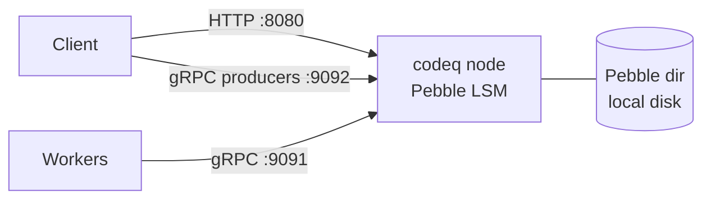
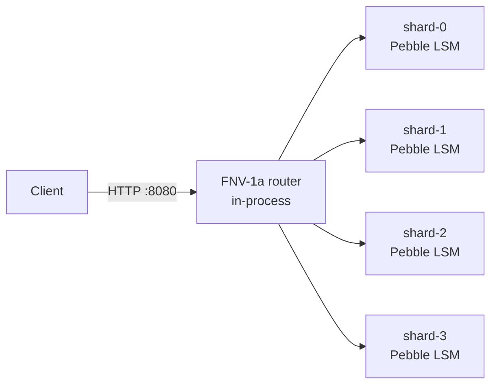
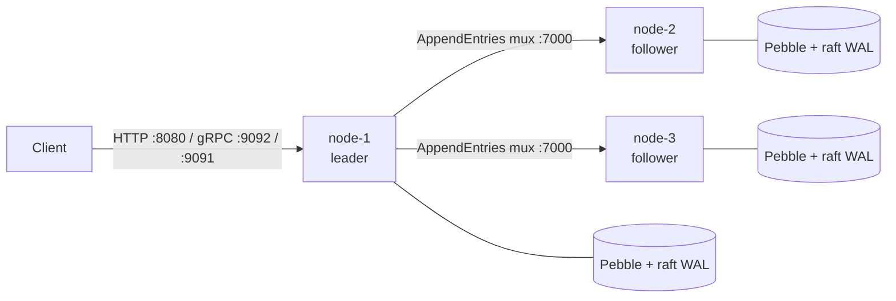
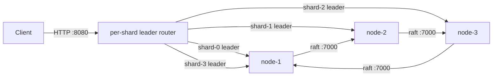
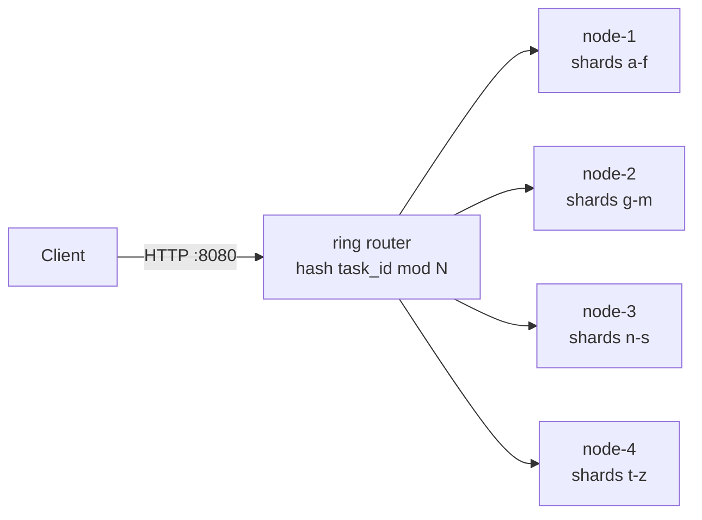

# Deployment modes

Decision guide for choosing among codeQ's four deployment modes, ranked by complexity.

Pick the cheapest mode that meets your durability and availability requirements. The axes are fault tolerance, throughput, and operational cost.

---

## 1. The four modes at a glance

| Mode | What it is | Storage | Fault tolerance | Throughput |
|---|---|---|---|---:|
| Single-node Pebble (1 shard) | One process, one Pebble LSM tree | Local disk | None (process or disk loss = data loss) | ~76,639 tasks/s [^1] |
| Single-node multi-shard | One process, N Pebble LSMs with independent group-commit pipelines | Local disk | None | scales with N up to per-host I/O ceiling |
| 3-node RAFT (1 shard) | Three processes, one replicated FSM, majority quorum (2 of 3) | Pebble + raft WAL on every node | f=1 (one node may fail) | ~3,949 cycles/s HTTP smart-routing; ~9-10k cycles/s gRPC with Apply coalescer [^2][^3] |
| 3-node RAFT + multi-shard | Three processes, N raft groups, one per Pebble shard, leadership spread across nodes | Pebble × N + raft WAL × N | f=1 per shard | ~3,883 cycles/s 4-shard HTTP on WSL2 loopback [^2]; higher on real hardware |
| Cluster (consistent-hash, legacy) | N independent nodes, FNV-1a ring routing, no consensus | Pebble × N (no replication) | None (router-level only) | scales linearly with node count |

[^1]: `internal/bench/profile_full_cycle_test.go` — single-node Pebble + gRPC streams, full enqueue → claim → complete cycle.
[^2]: `pkg/app/raft_smart_routing_bench_test.go` — 3-node RAFT + HTTP with leader-aware client routing.
[^3]: `pkg/app/raft_grpc_bench_test.go` — 3-node RAFT + gRPC with the Apply-level coalescer (`raftMergeBatch=128`, `internal/raft/db.go`).

WSL2 loopback numbers exhibit 9-20k cycles/s peak under cache-warm conditions; treat steady-state figures as the lower bound.

---

## 2. When to use each — explicit signals

### 2.1 Single-node Pebble (1 shard)

**Workload signal**: "I want a durable task queue embedded in a single Go service, or running on one managed VM. Process crashes are rare; disk loss I will handle out-of-band with storage-level replication (ZFS send, EBS snapshots, GCE PD snapshots). I do not need automatic failover."

**Trade vs. multi-shard**: a single Pebble `commitPipeline` mutex serializes commits. The group-commit coalescer (`internal/repository/pebble/db.go:71-82`, `maxMergeBatch=64`, `commitChanBuf=1024`) amortizes that mutex, but at high write concurrency a single LSM tree caps throughput.

**Failure mode**: process death loses in-flight requests not yet committed to the WAL. Disk loss loses everything. No replica.

**Operational cost**: one host, one binary, one Pebble directory. No quorum to monitor, no leader to elect.

**Best for**: development, lab, single-tenant low-volume production on a managed VM with snapshotted storage.

**Knob**: set `fsyncOnCommit=true` if pre-fsync writes must survive a kernel panic. Default is `false`; the group-commit coalescer batches fsyncs across merged writes.

### 2.2 Single-node multi-shard

**Workload signal**: "I am pinned to one box, I have spare cores, and one Pebble LSM tree is my bottleneck. I want N parallel commit pipelines on the same host."

**Trade vs. 3-node RAFT**: still no fault tolerance. You gain throughput, not availability.

**Failure mode**: identical to single-node. All shards live on the same disk; one disk failure loses all of them.

**Operational cost**: one host, N Pebble directories. Routing is in-process by FNV-1a hash of task ID (`internal/repository/pebble/sharded_task_repository.go:61-65`). No additional network ports.

**Best for**: high single-host throughput with the no-HA tradeoff. Typical sweet spot is 2-4 shards on a 12-core box; each shard has its own `commitPipeline` mutex (`internal/repository/pebble/db.go:71`), so contention drops with shard count until NVMe saturates. Beyond ~4 shards on one host, see `docs/17-performance-tuning.md` for diminishing-returns measurements.

### 2.3 3-node RAFT (1 shard)

**Workload signal**: "I need automatic failover. A node may die and I want writes to keep working through the survivors. I am willing to pay one network round-trip per write to get this."

**Trade vs. single-node multi-shard**: every write pays one `AppendEntries` round-trip to majority quorum (2 of 3). The Apply coalescer (`internal/raft/db.go`, `raftMergeBatch=128`) and the mux transport (`internal/raft/mux_transport.go:15-52`) reduce per-write overhead but do not eliminate the hop. Loopback throughput is an order of magnitude below single-node; real-network numbers depend on the link.

**Failure mode**: f=1. One node down keeps writes flowing; two nodes down blocks writes until quorum returns. Leader election is bounded by `ElectionMS=1000` (default in `internal/raft/db.go:53-79`), so failover takes roughly one to two seconds. The leader lease (`LeaderLeaseMS=500`) prevents stale-leader reads.

**Operational cost**: three hosts, 3-fold storage, monitoring for leader churn (a flapping leader is a network or disk symptom — raft prevents split-brain by construction). Heartbeats run at `HeartbeatMS=1000`, commit ticks at `CommitMS=50`.

**Best for**: production where availability matters more than peak throughput.

### 2.4 3-node RAFT + multi-shard

**Workload signal**: "I need HA *and* single-host parallelism. One raft group is not exploiting my cores."

Each Pebble shard runs its own raft group; leadership is distributed across the three nodes — a node may lead some shards and follow others. Writes for shard `k` go to whichever node currently leads raft-group `k`.

**Trade vs. 3-node RAFT 1-shard**: more moving parts. N raft groups means N leader elections, N WALs, N AppendEntries flows. The benefit is parallel commit pipelines per node. On loopback (WSL2) the 4-shard variant measured `~3,883 cycles/s` vs `~3,949 cycles/s` for 1-shard [^2] — flat because loopback hides per-shard parallelism. On real hardware with independent disks per shard, multi-shard pulls ahead.

**Failure mode**: f=1 *per shard*. If a node dies, every shard it led re-elects on the surviving two. The per-shard unavailability window is the election timeout.

**Operational cost**: same three hosts, N times the per-process state. Watch leader-distribution skew — all leaders on one node defeats the parallelism.

Multi-shard with raft is supported because each shard runs an independent raft group; this is distinct from the legacy `sharding.enabled` ShardSupplier path, which is rejected (`pkg/config/config.go:662-683`).

### 2.5 Cluster (consistent-hash, legacy)

**Workload signal**: "I have an existing horizontally-scaled deployment using ring routing and I accept no failover."

The Phase-5 cluster mode routes by `hash(task_id) % N` across N independent nodes with no consensus between them. If a node dies, its shards are unavailable until you reroute or restart pointing at the same Pebble directory.

**Trade vs. RAFT**: zero fault tolerance — the router knows the topology but does not replicate state. Write throughput scales linearly with N; any single node loss is a partial outage.

**New deployments should not start here.** Use RAFT for HA, or single-node multi-shard for single-host parallelism. Cluster mode is documented for continuity in `docs/05-cluster-architecture.md` and `docs/19b-cluster-grpc-protocol.md`.

---

## 3. What NOT to choose

- **Do not run 2 nodes with raft.** Majority quorum requires `floor(N/2) + 1`. At N=2 the quorum is 2, so one node down breaks the cluster. RAFT is interesting at N=3, 5, 7; even-numbered counts cost the extra node without the fault-tolerance benefit.
- **Do not enable `raft.enabled` and `cluster.enabled` together.** Config validation rejects it (`pkg/config/config.go:662-683`). Raft is a replicated FSM; cluster is a stateless router. Mutually exclusive.
- **Do not enable `raft.enabled` with the legacy `sharding.enabled` ShardSupplier.** Same config check. Multi-shard with raft uses the Pebble `numShards` knob, which spawns per-shard raft groups; the legacy ShardSupplier is a different code path.
- **Do not multi-shard a workload that does not parallelize.** Single-shard with the group-commit coalescer often beats multi-shard at low submitter concurrency: each shard's coalescer needs concurrent in-flight writes to amortize its mutex. Two shards each handling one writer is strictly worse than one shard handling two writers.
- **Do not pick `fsyncOnCommit=true` without measuring.** It costs roughly an order of magnitude on write latency. The coalescer amortizes fsyncs across merged batches, but the floor is set by storage hardware.

---

## 4. Topology diagrams

### 4.1 Single-node Pebble (1 shard)

### 4.2 Single-node multi-shard

### 4.3 3-node RAFT (1 shard)

### 4.4 3-node RAFT + multi-shard

### 4.5 Cluster (consistent-hash, legacy)

---

## 5. Migration between modes

These are pointers, not procedures. The procedures live in dedicated runbooks.

- **Single-node Pebble → multi-shard**: change `pebble.numShards` and rebuild the routing layer. Migration involves re-keying existing tasks. See `docs/32-shard-migration-guide.md`.
- **Multi-shard → 3-node RAFT (1 shard)**: this is a storage-topology change, not just a config flip. See `docs/31-persistence-migration-guide.md`.
- **3-node RAFT (1 shard) → 3-node RAFT + multi-shard**: bring up new raft groups for the additional shards and re-key. See `docs/32-shard-migration-guide.md`.
- **Cluster (legacy) → 3-node RAFT**: this is a one-way migration. The cluster's per-node Pebble directories are not directly replayable into a raft log; you replay from an external source of truth or drain the queue first. See `docs/05-cluster-architecture.md` for the legacy topology and `docs/40-raft-replication.md` for the raft path.

For a worked failover scenario on a live raft cluster, see `docs/42-raft-failover-walkthrough.md`.
