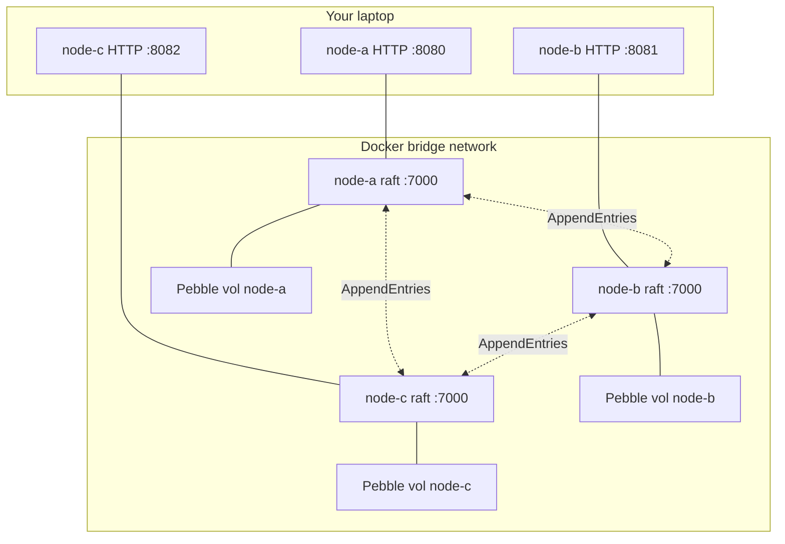

# Tutorial: 3-node raft cluster

A hands-on walkthrough of a 3-node codeQ cluster with raft replication.
By the end, you will have:

- Three codeQ processes running in Docker, joined into a single raft
  quorum.
- A task produced on the leader and read back from a follower.
- A demonstration that a write to a follower comes back as
  `307 Temporary Redirect` to the current leader.
- A leader killed, a new leader elected by the surviving quorum, and
  writes continuing to succeed.

This builds on [Getting started](./00-getting-started.md). You should
already understand how to run a single-node codeQ and call its HTTP
API.

## 1. What you'll build



Every write goes through
[hashicorp/raft](https://github.com/hashicorp/raft). The leader appends
to its log, replicates via `AppendEntries` to the followers, and commits
once a quorum (2 of 3) has persisted the entry. Each replica then
applies the committed entry to its local Pebble via the FSM — so every
node's Pebble converges to the same state.

The transport uses the **mux layer**
(`RAFT_MUX_ENABLED=true`): every Pebble shard's raft group shares one
TCP listener per container (port 7000), demuxed by group ID. Even with
multi-shard configs you only expose port 7000 plus HTTP on 8080.

## 2. Prerequisites

- Docker + Docker Compose v2.
- The `codeq` repo cloned locally.
- `curl` and `jq`.
- A pre-built cluster image. Build it once:

```bash
git clone https://github.com/osvaldoandrade/codeq
cd codeq
docker build -f deploy/docker-compose/cluster/Dockerfile -t codeq-service:cluster .
```

## 3. Bring up the cluster

```bash
docker compose -f deploy/docker-compose/raft-cluster/compose.yaml up -d
docker compose -f deploy/docker-compose/raft-cluster/compose.yaml ps
```

Three containers:

| Container | HTTP (host → container) | Raft (container-internal) |
|---|---|---|
| `codeq-raft-node-a` | `:8080 → :8080` | `:7000` |
| `codeq-raft-node-b` | `:8081 → :8080` | `:7000` |
| `codeq-raft-node-c` | `:8082 → :8080` | `:7000` |

Only node-a has `RAFT_BOOTSTRAP=true` — it creates the initial raft
configuration with all three peers. Once the first commit lands, raft's
on-disk state ignores the flag on subsequent restarts. node-b and
node-c receive the cluster membership via the first `AppendEntries`
they accept. See [`compose.yaml`](../deploy/docker-compose/raft-cluster/compose.yaml)
for the exact environment.

Wait a couple seconds for the initial election:

```bash
sleep 3
docker compose -f deploy/docker-compose/raft-cluster/compose.yaml logs node-a | grep -i 'state.*leader\|elected' | tail -3
```

## 4. Verify the leader

`GET /v1/codeq/raft/status` reports per-shard raft state. With the
default single-shard config there is exactly one group.

```bash
curl -s http://localhost:8080/v1/codeq/raft/status | jq
```

Sample response:

```json
{
  "enabled": true,
  "numGroups": 1,
  "groups": [
    {
      "shardIdx": 0,
      "isLeader": true,
      "selfId": "node-a",
      "selfAddr": ":7000",
      "leaderId": "node-a",
      "leaderAddr": "node-a:7000",
      "leaderHTTPAddr": "http://node-a:8080",
      "hasLeader": true
    }
  ]
}
```

The same query against `:8081` or `:8082` returns `isLeader: false`
with `leaderId` pointing at node-a. The schema is defined in
[`internal/controllers/raft_status_controller.go`](../internal/controllers/raft_status_controller.go).

## 5. Submit a task to the leader

```bash
curl -s -X POST http://localhost:8080/v1/codeq/tasks \
  -H 'Authorization: Bearer dev-token' \
  -H 'Content-Type: application/json' \
  -d '{"command":"PROCESS_ORDER","payload":{"orderId":"42"}}' | jq
```

Response:

```json
{"id":"<uuid>","command":"PROCESS_ORDER","status":"PENDING",...}
```

Save the ID:

```bash
TASK_ID=$(curl -s -X POST http://localhost:8080/v1/codeq/tasks \
  -H 'Authorization: Bearer dev-token' \
  -d '{"command":"PROCESS_ORDER","payload":{"orderId":"43"}}' | jq -r .id)
```

The write went through raft: the leader appended an entry, both
followers acked (quorum reached at 2/3), and all three nodes applied
the task to their local Pebble.

## 6. Read from a follower

```bash
curl -s "http://localhost:8081/v1/codeq/tasks/${TASK_ID}" \
  -H 'Authorization: Bearer dev-token' | jq '.id, .status'
```

Same task body. Followers serve reads locally — they do **not** route
to the leader. This is fast but means a read may be stale by the
current replication lag (typically < 5 ms on a quiet localhost cluster,
but with no upper bound guarantee). For strong reads, only query the
leader (use `/v1/codeq/raft/status` to find it).

## 7. Write to a follower → 307 redirect

```bash
curl -i -X POST http://localhost:8081/v1/codeq/tasks \
  -H 'Authorization: Bearer dev-token' \
  -d '{"command":"PROCESS_ORDER","payload":{"orderId":"44"}}'
```

The follower replies:

```http
HTTP/1.1 307 Temporary Redirect
Location: http://node-a:8080/v1/codeq/tasks
Content-Type: application/json

{"error":"not leader","leader":"http://node-a:8080"}
```

`307` (not `302`) preserves the POST method and body across the
redirect — required by RFC 7231 for non-idempotent verbs. Most HTTP
clients follow automatically when invoked with `-L`:

```bash
curl -sL -X POST http://localhost:8081/v1/codeq/tasks \
  -H 'Authorization: Bearer dev-token' \
  -d '{"command":"PROCESS_ORDER","payload":{"orderId":"45"}}' | jq .id
```

The `Location` header uses the container DNS name (`node-a`) because
the cluster's `RAFT_PEER_HTTP_ADDRS` is configured for the Docker
internal network. Inside the Docker network this is reachable; from
your host laptop, the redirect target is not directly resolvable.
Production deployments set `RAFT_PEER_HTTP_ADDRS` to externally
reachable URLs (load balancer or per-node hostnames). The redirect
logic lives in
[`internal/controllers/respond.go`](../internal/controllers/respond.go).

## 8. Kill the leader

Find the current leader:

```bash
LEADER=$(curl -s http://localhost:8080/v1/codeq/raft/status \
  | jq -r '.groups[0].leaderId')
echo "current leader: $LEADER"
```

Stop the container running that node:

```bash
docker compose -f deploy/docker-compose/raft-cluster/compose.yaml stop "$LEADER"
```

The remaining two nodes detect the missing heartbeat after one
`heartbeatMS` plus a randomized election timeout. Defaults are
`HeartbeatMS=1000` and `ElectionMS=1000` (see
[`internal/raft/db.go:53-97`](../internal/raft/db.go)), so a new leader
is typically elected in 1-3 seconds end-to-end.

```bash
sleep 3
# Query a survivor.
curl -s http://localhost:8081/v1/codeq/raft/status | jq '.groups[0]'
```

You should see `isLeader: true` on `:8081` or `:8082` (whichever won
the election), and `leaderId` pointing at the new leader.

## 9. Submit a task during failover

```bash
NEW_LEADER_PORT=8081
# Try :8081; if it's a follower you'll get a 307 to the real leader.
curl -sL -X POST "http://localhost:${NEW_LEADER_PORT}/v1/codeq/tasks" \
  -H 'Authorization: Bearer dev-token' \
  -d '{"command":"AFTER_FAILOVER","payload":{}}' | jq .id
```

The write succeeds. Quorum is now 2 of 2 surviving nodes — one
remaining failure would lose availability for writes (no quorum
possible with 1 of 3), but reads continue from the local Pebble.

## 10. Restart the dead node

```bash
docker compose -f deploy/docker-compose/raft-cluster/compose.yaml start "$LEADER"
sleep 3
curl -s http://localhost:8080/v1/codeq/raft/status | jq '.groups[0]'
```

The restarted node rejoins as a follower. raft's `AppendEntries` ships
the entries it missed (or installs a snapshot if it fell too far
behind — controlled by `SnapshotEntries`, default 8192 entries). Once
caught up, the cluster is back to a 3-node quorum: it can survive one
more failure.

## Cleanup

```bash
docker compose -f deploy/docker-compose/raft-cluster/compose.yaml down -v
```

The `-v` flag also drops the Pebble volumes — without it, the cluster
state persists across `up`/`down` cycles.

## Caveats

- **Bootstrap exactly once.** `RAFT_BOOTSTRAP=true` is only valid on
  the very first run of a fresh cluster, and only on one node. Setting
  it on a node that already has raft state is harmless (the flag is
  ignored), but setting it on a second fresh node creates a split-brain
  cluster that requires manual recovery.
- **Mutually exclusive with legacy cluster mode.** Raft mode and
  `CLUSTER_ENABLED=true` (the static-ring consistent-hash cluster) are
  rejected together at config validation.
- **Multi-shard adds groups, not ports.** With mux enabled,
  `numShards: 4` creates 4 raft groups per node sharing port 7000 — no
  port-range changes needed.
- **Leader hint addresses must be reachable by clients.** The redirect
  in step 7 used Docker DNS; in production set `RAFT_PEER_HTTP_ADDRS`
  to externally reachable URLs (your load balancer or per-node DNS).

## See also

- [Raft replication](./40-raft-replication.md) — architecture, FSM,
  snapshots, current limitations.
- [Deployment modes](./41-deployment-modes.md) — when to pick raft over
  single-node or sharded.
- [Raft failover walkthrough](./42-raft-failover-walkthrough.md) —
  failure scenarios beyond a clean stop (disk loss, network partition,
  split-brain).
- [Docker compose template](../deploy/docker-compose/raft-cluster/README.md) —
  the source for this tutorial's commands.
- [Style guide](./_STYLE.md)
