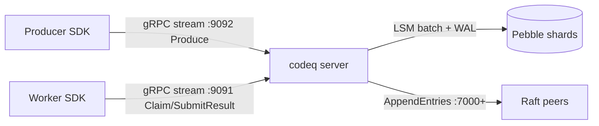
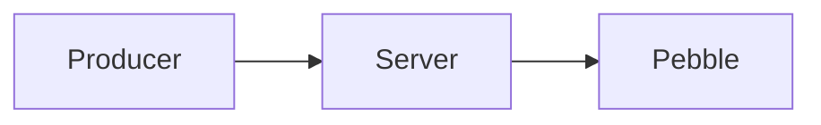
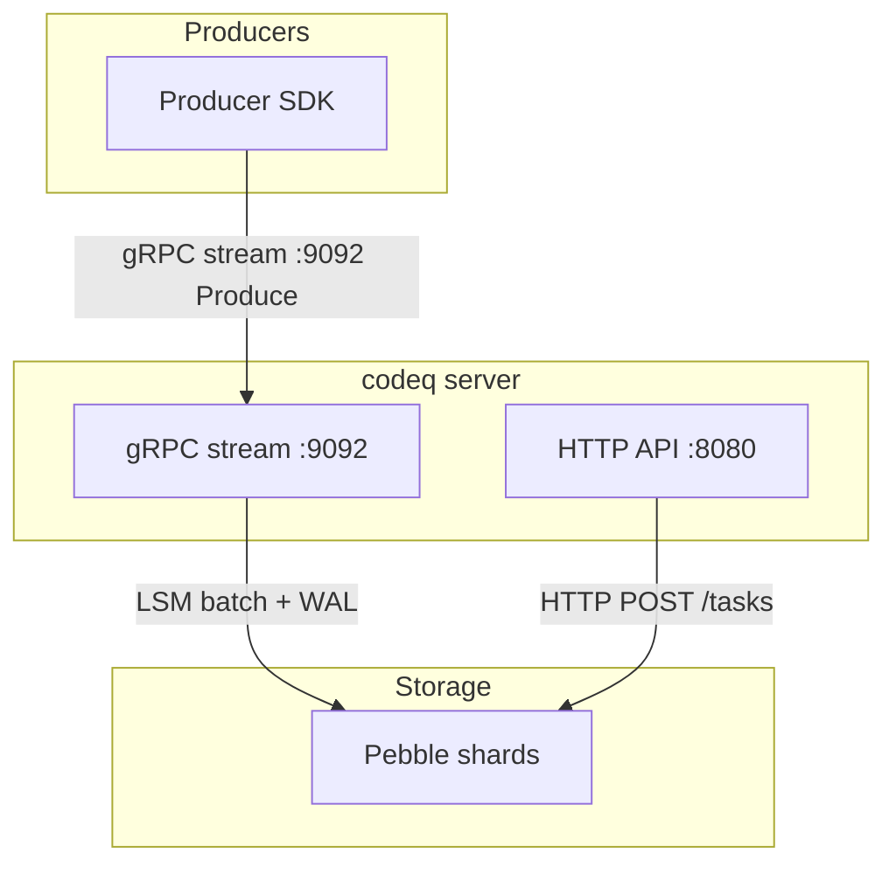
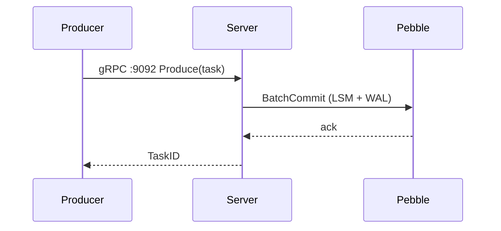
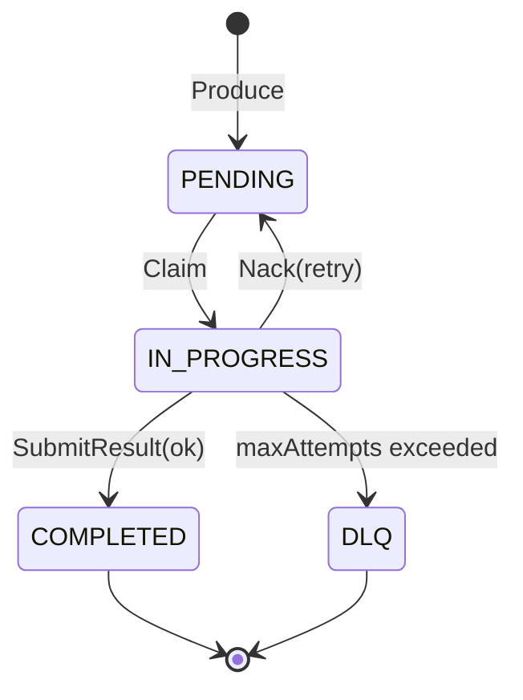

# codeq documentation style guide

This is the canonical style guide for codeq documentation. Every doc in
`docs/` and the root `README.md` must follow it. Subsequent waves of doc
revisions cite this file verbatim where relevant (especially the value
proposition and comparativos). If you change the value proposition here,
you must update the docs that quote it.

## 1. Value proposition

### One-line

> codeq is an embedded high-performance task queue: a single Go binary,
> Pebble for persistence, gRPC streaming for the wire — 83k tasks/s on
> one machine with zero external dependencies.

### One-paragraph

> codeq is a task queue written in Go that runs as a single process and
> stores everything in an embedded LSM (Pebble, the RocksDB-style engine
> from CockroachDB). The hot path is bidirectional gRPC streams from
> producers and workers; under the streams sits an intra-process shard
> table (up to N independent Pebble instances) and an in-memory lease
> table. The result on a 12-core Linux box is 83,420 tasks/s for the
> full create → claim → complete cycle, or 136,392 creates/s producer-
> only. No Redis, no broker, no coordinator required in the default
> mode. RAFT replication (leader lease + AppendEntries log replication)
> is opt-in for HA and multi-node deployments.

### Comparativos (use verbatim or as a base)

| Dimension | codeq | Asynq | BullMQ | Celery | Kafka |
|---|---|---|---|---|---|
| External dependency | None (embedded Pebble) | Redis | Redis | Redis or RabbitMQ | ZooKeeper or KRaft cluster |
| Throughput (single node, full cycle) | 83k tasks/s | ~10k tasks/s | ~5k tasks/s | ~3k tasks/s | 100k+ msgs/s, but no task semantics |
| Language affinity | Go server; HTTP `:8080` + gRPC `:9091`/`:9092` for any client | Go | Node only | Python only | Polyglot |
| Durability | Pebble batch + group-commit; optional fsync | Redis AOF / RDB | Redis AOF / RDB | Broker-dependent | Replicated log |
| Multi-tenant native | Yes (JWT tenantId namespacing built in) | No | No | No | No |
| Learning curve | One binary, HTTP + curl in minutes | Moderate (Redis ops) | Moderate (Node + Redis) | High (broker + result backend) | High (broker, consumer groups, schema registry) |

When citing this table in a doc, link back here:

> See [_STYLE.md § Comparativos](./_STYLE.md#comparativos-use-verbatim-or-as-a-base).

## 2. Audience profile

Primary reader: **backend engineer evaluating alternatives to Redis-backed
task queues**. They are typically deciding between Asynq (Go + Redis),
BullMQ (Node + Redis), Celery (Python + broker), Sidekiq (Ruby + Redis),
Temporal (workflow engine), and Kafka (event log used as a queue).

What they care about, ranked:

1. **Throughput** — concrete numbers, harness names, and the box they
   were measured on. No "blazing fast", no "10x". Cite the benchmark.
2. **Operational cost** — how many processes, how many config knobs, how
   long until they can `curl` a task.
3. **Language affinity** — Go server, with HTTP `:8080` and gRPC
   (`:9091` worker, `:9092` producer) wire protocols any language can
   speak directly. There are no language SDKs as of 2026-05-18 (see
   § 8).
4. **Durability and at-least-once** — what survives a crash, and how
   they prove it.
5. **Multi-tenant** — whether they can run one queue server for many
   customers without writing isolation themselves.
6. **HA and scaling story** — single-node first, but with a credible
   path to multi-node.

Write for someone who already understands queues. Skip onboarding to
basic concepts like "what is a task". Do define codeq-specific terms
(shard, lease table, ring, scatter-gather) the first time they appear.

## 3. Voice and tone

The voice rules below are non-negotiable. They override every other
preference: if a sentence reads well but violates a rule, rewrite it.

### Rule 1 — No buzzwords, no marketing

Forbidden words and phrases (case-insensitive): `blazingly fast`,
`production-ready`, `enterprise-grade`, `modern`, `next-generation`,
`cutting-edge`, `seamless`, `robust`, `powerful`, `amazing`,
`world-class`, `revolutionary`, `lightning`, `massive`, `blazing`,
`10x`.

- BAD: "codeq is a blazingly fast task queue."
- GOOD: "codeq sustains 76,639 tasks/s single-node via gRPC streaming
  (`internal/bench/profile_full_cycle_test.go`)."

If you cannot measure it, do not claim it. Replace adjectives with
numbers. Replace value judgements with citations.

### Rule 2 — CS concepts by textbook name

Use the canonical computer-science term, not a paraphrase. Recommended
vocabulary (use these by name; link to a definition the first time):

`LSM tree`, `memtable`, `SSTable`, `WAL`, `group commit`,
`commitPipeline`, `fsync`, `Raft consensus`, `leader lease`,
`AppendEntries`, `log replication`, `FSM`, `log compaction`,
`majority quorum`, `backpressure`, `consistent hash`, `bloom filter`,
`token bucket`, `lease table`, `scatter-gather`, `bidirectional gRPC
stream`.

- BAD: "the storage engine writes things to disk in a smart way."
- GOOD: "writes go through Pebble's `commitPipeline` (LSM memtable +
  WAL); fsync is configurable via `fsyncOnCommit` (default false; see
  `internal/repository/pebble/db.go:140`)."

### Rule 3 — Measured numbers with citation

Every throughput, latency, or memory claim cites a file path. The
format is:

> N tasks/s (`internal/bench/<file>.go::<TestName>`, env: `KEY=VAL`,
> hardware: 12-core Linux).

- BAD: "the system can handle a lot of writes."
- GOOD: "the producer-only stream path sustains 136,392 creates/s on a
  12-core Linux box
  (`internal/bench/producer_stream_vs_rest_test.go::TestProducerThroughput_StreamBatchPath`)."

See § 9 for the full benchmark catalog.

### Rule 4 — Diagrams with port labels

Every architectural diagram MUST label ports and protocols. See § 5.1
for the canonical port table and rendering rules.

- BAD: "Producer → Server → Pebble"
- GOOD: "Producer SDK --(`gRPC stream :9092`)--> Server --(`Pebble
  batch`)--> Pebble shards"

### Rule 5 — Code citations

When you document behavior, cite the source: `path/to/file.go:line` or
`path/to/file.go:start-end`. The reader must be able to jump to the
implementation in one click. See § 7 for the canonical citation
catalog.

- BAD: "the coalescer batches commits."
- GOOD: "the group-commit coalescer accumulates concurrent writers into
  a single Pebble batch (`internal/repository/pebble/db.go:71-82`)."

### Rule 6 — Honest tradeoffs

Always name the trade-off. Examples to use as templates:

- "HA is only available via RAFT replication or by running a multi-node
  Pebble cluster. A single Pebble process loses availability while it
  restarts; recovery is fast (in-memory lease table rebuilt from the
  `KeyInprog` scan at Open) but not instantaneous."
- "Cluster mode and intra-process sharding (`numShards > 1`) are
  mutually exclusive — startup panics if both are enabled. Pick one:
  multi-node across machines, or multi-shard inside one process."
- "Delivery is at-least-once, not exactly-once. A worker that crashes
  between completion and ACK will see its task re-delivered after the
  lease expires."
- "`fsyncOnCommit=true` costs ~20% throughput in our harness. Default
  is false."

### Throughput claims: required fields

Rule 3 covers the general format. In addition, every throughput claim
must cite:

- The exact test name in `internal/bench/`.
- The env vars used to parameterize it.
- The hardware class (cores, OS).
- The measurement window.

Reference example:

> codeq sustains 83,420 tasks/s for a full create → claim → complete
> cycle on a 12-core Linux box, 4 Pebble shards, 32 producer slots at
> batch=8, 128 worker slots, 20s measurement window
> (`internal/bench/profile_full_cycle_test.go::TestProfile_FullCycle`,
> `PHASE8_SHARDS=4 PHASE6_BATCH=32 PHASE6_PROD_BATCH=8`).

### Opinionated

Tell the reader what to pick:

- "For single-node deployments use Pebble with `numShards: 4`."
- "Do not enable `fsyncOnCommit` unless you have measured the latency
  impact in your workload — it costs ~20% throughput in our harness."
- "Use RAFT replication only if you need multi-node HA today; otherwise
  run a single Pebble node with `numShards: 4`."

## 4. Markdown conventions

- **Headings**: ATX style (`#`), single `#` per file (the title), then
  `##` for top-level sections, `###` for subsections. Do not skip
  levels.
- **Code blocks**: always tag the language.
  - `bash` for shell, `go` for Go, `yaml` for config, `json` for JSON,
    `protobuf` for `.proto`, `mermaid` for diagrams.
  - Untagged blocks are forbidden — they break syntax highlighting on
    GitHub.
- **Admonitions** (GitHub-flavored):

  ```markdown
  > **Note**: a normal aside.
  > **Warning**: a footgun. Always for irreversible operations or
  > silent data loss.
  > **Performance**: a tuning hint with a number.
  ```

- **Tables**: pipe-aligned, header row separator `---`. Always have a
  header row. Cells with multi-word values stay on one line.
- **Inline code**: backticks for file paths, env vars, config keys,
  function names, and protocol constants.
- **Lists**: `-` for unordered, `1.` for ordered. Two spaces of
  indentation for nested items.
- **Links**: prefer descriptive text over "click here". Relative links
  for in-repo references (see §6).

## 5. Diagrams (mermaid)

All diagrams must render on the GitHub default theme in both light and
dark mode. **Never set inline colors or styles** — let the renderer
pick. Prefer mermaid over ASCII: mermaid renders inline on GitHub and
supports edge labels for protocols and ports.

### 5.1 Port and protocol labels (mandatory)

Every architectural diagram MUST label ports and protocols on the
edges that carry traffic. Use the canonical port assignments:

| Service | Port | Protocol | Source |
|---|---|---|---|
| HTTP REST API | `:8080` | HTTP/1.1 + JSON | `pkg/app/application.go` |
| Producer gRPC | `:9092` | gRPC bidirectional stream | `pkg/app/application.go` |
| Worker gRPC | `:9091` | gRPC bidirectional stream | `pkg/app/application.go` |
| RAFT transport mux | `:7000+` | TCP (Raft AppendEntries / RequestVote) | `internal/raft/transport.go` |

Edge label conventions:

- Always quote the protocol verb: `AppendEntries`, `RequestVote`,
  `Produce`, `Claim`, `SubmitResult`, `HTTP POST`, `gRPC stream`.
- Always show the port when an external boundary is crossed.
- Always show the direction with an arrowhead (`-->`, `-->>`,
  `..>`).

Example (correct):



Example (BAD — no ports, no protocols):



### 5.2 Flow diagrams

Use `graph TB` for top-to-bottom layered architecture, `graph LR` for
left-to-right pipelines. Always use `subgraph` to delimit logical
layers.



Aim for 8 to 12 nodes max in a single diagram. If it grows past that,
split it.

### 5.3 Sequence diagrams

Use `sequenceDiagram` for flows over time. Participant names start
capitalized.



### 5.4 State machines

Use `stateDiagram-v2` for task lifecycle. Transition labels describe
the **trigger action**, not the resulting state.



### 5.5 No inline colors

Bad:

```text
style P1 fill:#f9f,stroke:#333
```

Good: nothing — let the theme decide.

## 6. Cross-link policy

Every doc ends with a `## See also` section enumerating related docs.
Example:

```markdown
## See also

- [Architecture](./03-architecture.md)
- [Storage layout (Pebble)](./07b-storage-pebble.md)
- [Performance tuning](./17-performance-tuning.md)
```

Path conventions:

- **Inside `docs/`** (doc-to-doc): use relative paths starting with
  `./`, e.g. `[Overview](./01-overview.md)`.
- **From root `README.md`** (or other root-level files): use paths
  rooted at `docs/`, e.g. `[Overview](docs/01-overview.md)`.
- **To source files**: use repo-rooted paths, e.g.
  `[application.go](../pkg/app/application.go)` from inside `docs/`, or
  `pkg/app/application.go` from `README.md`.
- **Anchors**: lowercase, hyphen-separated, match GitHub's slug
  algorithm.

When you cite the value prop, link to this file:

```markdown
See [_STYLE.md § Value proposition](./_STYLE.md#1-value-proposition).
```

## 7. Code citations

Documenting behavior without pointing at the implementation is a style
violation. Every claim about how codeq behaves cites a source file and
line range. Format:

```text
`path/to/file.go:line`
`path/to/file.go:start-end`
```

Use repo-rooted paths (no leading `./`, no leading `/`). Cite the
narrowest range that contains the behavior — function signatures or
multi-line blocks are preferred over whole files.

Canonical citations to keep in your mental cache:

| Behavior | Citation |
|---|---|
| Group commit coalescer (write path) | `internal/repository/pebble/db.go:71-82` |
| Pebble `commitPipeline` + WAL fsync flag | `internal/repository/pebble/db.go:140` |
| Shard routing via FNV-1a over `taskID` | `internal/repository/pebble/sharded_task_repository.go:61-65` |
| FSM Apply path (Raft log → Pebble write) | `internal/raft/fsm.go:43-62` |
| Application bootstrap (HTTP `:8080`, gRPC `:9091`/`:9092`) | `pkg/app/application.go` |
| Worker stream loop | `pkg/app/worker_stream.go` |
| MoveDueDelayed fast-path | `internal/repository/pebble/db.go` |

Rule: when you change one of these line numbers in a PR, you also grep
the docs and update every citation. Stale `:line` references are worse
than no citation.

## 8. Removed tech (forbidden mentions)

The technologies listed below are NOT part of codeq as of 2026-05-18.
Documentation must not mention them outside of historical changelogs.
If you find a mention while writing or editing a doc, delete it or
restate the behavior using the current stack.

| Removed | Replacement / status | Removed in |
|---|---|---|
| Java SDK | Use HTTP `:8080` or gRPC `:9092` directly | PRs #596-604 |
| Python SDK | Use HTTP `:8080` or gRPC `:9092` directly | PRs #596-604 |
| JavaScript / Node SDK | Use HTTP `:8080` or gRPC `:9092` directly | PRs #596-604 |
| `sdks/go/` REST client | Use HTTP `:8080` directly or generated gRPC client | PR #600 |
| KVRocks backend | Pebble is the only persistence engine | 2026-05-17 |
| "legacy Redis backend" | Pebble is the only persistence engine | 2026-05-17 |
| "Redis primary / HA mode" | RAFT replication is the only HA path | 2026-05-17 |
| Cluster mode (Phase 5 consistent-hash) | Preserved for reference only; not a recommended deployment | — |

Phrasing rules:

- Do not write "codeq supports Pebble, KVRocks, or Redis". codeq is
  100% Pebble. Period.
- Do not write "the Java SDK". There is no Java SDK. Cite the HTTP or
  gRPC API instead.
- Cluster mode (the Phase 5 consistent-hash + gRPC scatter-gather
  prototype) may be mentioned ONLY with the qualifier "preserved for
  reference" and a link to the relevant ADR. It is not recommended for
  new deployments; RAFT replication is.

## 9. Numbers must come from measurement

Every throughput, latency, or memory claim in any doc must be traceable
to a test in `internal/bench/`. The format is:

> N tasks/s (`internal/bench/<file>.go::<TestName>`, env: `KEY=VAL`,
> hardware: 12-core Linux).

Catalog of canonical benchmarks (use these names, do not invent new
ones):

| Workload | Harness | Result on reference box |
|---|---|---|
| Full cycle, 4 shards, batched | `internal/bench/profile_full_cycle_test.go::TestProfile_FullCycle` (`PHASE8_SHARDS=4 PHASE6_BATCH=32 PHASE6_PROD_BATCH=8`) | 83,420 tasks/s |
| Producer-only, batched stream | `internal/bench/producer_stream_vs_rest_test.go::TestProducerThroughput_StreamBatchPath` | 136,392 creates/s |
| Worker-only, batched stream | `internal/bench/worker_stream_saturation_test.go::TestSaturation_StreamPath` (c=4, `PHASE6_BATCH=32`) | 23,518 tasks/s |
| Shard sweep | `internal/bench/profile_full_cycle_test.go::TestProfile_FullCycle` (`PHASE8_SHARDS=1,2,4,6,8`) | 42k / 65k / 83k / 68k / 67k |

Reference box: 12-core Linux (kernel 5.15, WSL2-compatible), Go 1.25.0,
local Pebble, loopback gRPC, no fsync.

If you need a number that is not in this table, run the bench, add the
row here, then cite it in your doc. Do not estimate.

## See also

- [README](../README.md) — applies this style guide at the entry point.
- [Overview](./01-overview.md) — the canonical statement of what codeq
  is.
- [Architecture](./03-architecture.md) — package-level breakdown.
- [Performance baselines](./30-performance-baselines.md) — raw bench
  output and historical numbers.
