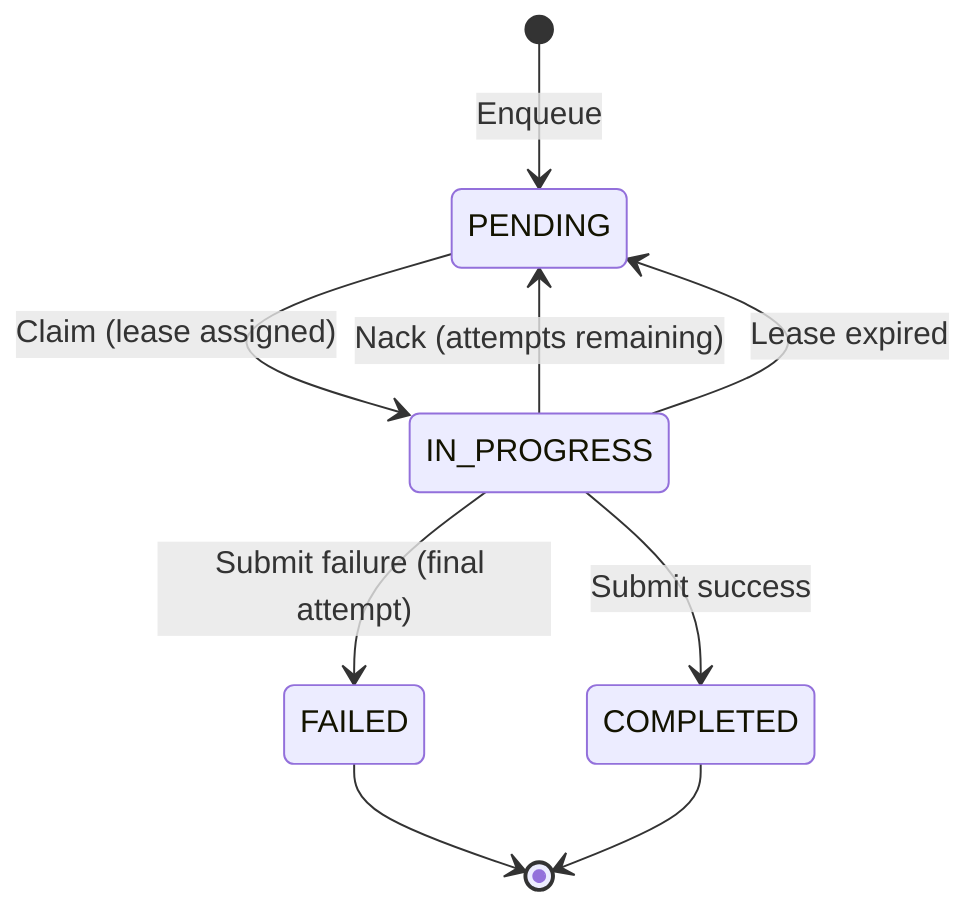

codeQ is a task queue server. It accepts opaque work items over HTTP or gRPC, persists them in an embedded Pebble LSM tree on the receiving node, and hands them out to long-lived worker processes that lease, execute, and acknowledge each task. Durability comes from Pebble's write-ahead log; high availability is optional and comes from replicating the same persistence layer across three nodes through a raft consensus group. Every external interface speaks one of three protocols on three ports: a control-plane HTTP API on `:8080`, a producer-facing bidirectional gRPC stream on `:9092`, and a worker-facing bidirectional gRPC stream on `:9091`. When raft is enabled, a fourth port, `:7000`, carries the multiplexed raft transport between peers.

It helps to separate "task queue" from "message broker" before reading further. A message broker fans the same message out to many subscribers and reasons about offsets; a task queue hands each task to exactly one worker, tracks who owns it, and records the outcome as a result record keyed by task ID. codeQ does the second thing. There is no subscription topic, no consumer group offset, and no replay cursor. The unit of state is the Task, the unit of ownership is the lease, and the unit of completion is the Result. This chapter walks through the domain model, queue semantics, sharding, leases, multi-tenancy, and the deployment modes that change the operational profile.

## Tasks and results

A Task is the central record. codeQ stores it as a JSON blob under the key `codeq/tasks/<id>` and indexes it under one of four queue prefixes that reflect its current state. The struct lives at `pkg/domain/task.go` and carries the fields a queue server actually needs to drive a state machine: an `ID` (a UUID v4 string), a `Command` (the routing label workers subscribe to), an opaque `Payload` (a JSON string codeQ does not interpret), a `Priority`, a `Status`, a `WorkerID`, a `LeaseUntil` timestamp, an `Attempts` counter, a `TenantID`, and the usual `CreatedAt` / `UpdatedAt` audit fields. Optional fields cover delayed visibility, idempotency keys, webhooks, and W3C trace context for cross-service correlation.

The status field follows a small, deterministic state machine. A task starts in `PENDING` after Enqueue, transitions to `IN_PROGRESS` when a worker claims it, and ends in either `COMPLETED` or `FAILED`. A failed task whose attempts are below `MaxAttempts` returns to `PENDING` (or to delayed visibility if the backoff policy says so), and the cycle repeats; a failed task whose attempts have exhausted lands in the dead-letter queue. The transitions are not advisory — they are enforced by the repository methods (`Claim`, `Heartbeat`, `Submit`, `Nack`, `Abandon`) which all run inside a single Pebble batch and so are atomic against concurrent writers.



A Result is the second persisted record. When a worker reports completion, codeQ writes a result JSON under `codeq/results/<id>` containing the outcome, the worker that produced it, the attempt count, and either the success payload or the error. The result outlives the task body — clients that issued a fire-and-poll request fetch it through the HTTP API long after the task itself has been garbage-collected. The full schema, including the optional fields and the on-disk encoding, lives in [`docs/02-domain-model.md`](../02-domain-model.md).

## The queue model

codeQ is a priority FIFO queue with visibility timeout. Inside a single `(command, tenant)` pair, tasks are drained in descending priority order, and within a priority bucket they are drained in the order they were enqueued. The ordering is realized by the key layout, not by a separate index: pending entries are stored at `codeq/q/<cmd>/<tenant>/pending/<prio_be1>/<seq_be8>/<id>` (see `internal/repository/pebble/keys.go:25-59`), where `prio_be1` is a one-byte big-endian priority and `seq_be8` is a monotonic sequence assigned at Enqueue time. A Pebble range scan over this prefix returns the next task in correct order with no extra sorting work; the LSM does the sorting structurally.

Visibility is controlled by the lease. When a worker calls Claim, codeQ moves the task's index entry from the pending prefix to the in-progress prefix and stamps a `LeaseUntil` timestamp into the task body. From that moment the task is invisible to other claims until the worker either Submits, Nacks, or lets the lease expire. An expired lease is not silently dropped — the reaper detects it, increments `Attempts`, and either puts the task back in pending (or in the delayed prefix, if the backoff schedule says it should wait) or pushes it to the dead-letter queue if attempts are exhausted. The guarantee is at-least-once delivery: a task is handed out at least once, possibly more if a worker dies mid-execution, and the application is expected to tolerate duplicate work via idempotency keys.

Delayed visibility uses a fourth queue prefix, `codeq/q/<cmd>/<tenant>/delayed/<score_be8>/<id>`, where the score is the Unix-second timestamp at which the task becomes visible. A background mover (MoveDueDelayed) periodically scans for entries whose score has passed and promotes them into the pending prefix in the same batch that removes them from delayed. The same prefix carries retry backoffs, scheduled tasks, and any future-visible enqueue. For the full semantics, including the priority encoding rationale and the dead-letter handling, see [`docs/05-queueing-model.md`](../05-queueing-model.md).

## Sharding by hash

A single Pebble instance has a single commit pipeline; under high write concurrency that pipeline serializes all writers behind one mutex. codeQ side-steps this by optionally running N Pebble instances inside the same process and routing each task to exactly one of them. The routing function is FNV-1a 64-bit applied to the task ID, modulo the shard count — a cheap, uniform hash that turns UUID v4 strings into a near-balanced shard distribution. The implementation is at `internal/repository/pebble/sharded_task_repository.go:61-65`:

```go
func (s *ShardedTaskRepository) shardOf(key string) int {
    h := fnv.New64a()
    _, _ = h.Write([]byte(key))
    return int(h.Sum64() % uint64(len(s.shards)))
}
```

This hash carries the atomic invariant that makes the sharded layout safe. Every key derived from a single task ID — `KeyTask`, `KeyPending`, `KeyInprog`, `KeyTTLIndex`, `KeyDelayed`, `KeyDLQ` — is built by appending suffixes to the same ID, so every one of them hashes to the same shard. The implication is that the entire transition of a task between queue states is a single Pebble batch on a single shard, with one commit and one fsync. There is no two-phase commit between shards because there cannot be one task that lives on two shards. The `ShardedTaskRepository` wrapper at `sharded_task_repository.go:25-71` is therefore not a transaction coordinator; it is a router that knows where to send each task-keyed operation and a fan-out aggregator for the few operations that span every shard.

Cross-shard operations are the exception, not the rule. `Claim` and `ClaimMany` round-robin across shards on each call (using the `nextStart` counter at `sharded_task_repository.go:69-71`) because the next claimable task may live on any shard; `MoveDueDelayed`, `AdminQueues`, `PendingLength`, and `QueueStats` fan out to every shard and aggregate the results scatter-gather. Idempotency lookups go to the shard determined by hashing the idempotency key itself, not the task ID, because at idempotency-check time the task ID is not yet known. The original Enqueue wrote the idempo map into the same shard, so replays land on the correct entry on the first try. For the long-form treatment, including the migration path from one shard to many, read [`docs/06-sharding.md`](../06-sharding.md) and [`docs/08b-pebble-sharding-internals.md`](../08b-pebble-sharding-internals.md).

## Leases and ownership

When a worker claims a task, codeQ records two facts: a durable one on disk (the in-progress index entry and the `LeaseUntil` timestamp in the task body) and a volatile one in memory (an entry in the per-shard lease table at `internal/repository/pebble/lease_table.go:39-80`). The on-disk record is the source of truth — it is what survives a crash. The in-memory table is a cache that lets the reaper find expired leases without scanning the in-progress index on every tick. The lease table holds one tiny record per active task (about 32 bytes), keyed by task ID, carrying the owning worker ID, the command, the tenant, and the Unix-second expiry.

The table is volatile by design. There is no separate on-disk lease index, so there is no second key to update on every heartbeat — a heartbeat just calls `Extend(taskID, workerID, untilU)` against the in-memory table and is done in tens of nanoseconds. On Open, the repository rebuilds the table by walking `KeyInprog` and reading each task body to recover `WorkerID` and `LeaseUntil`. The recovery is best-effort, runs once, and is invoked from the constructor at `task_repository.go:167-171`. A task whose lease has already expired at recovery time lands in the table with an expired entry; the reaper's first sweep picks it up and requeues it through the normal Nack path. A task whose lease is still in the future at recovery time keeps running on the original worker until that worker heartbeats again or the lease genuinely expires — indistinguishable to the worker from a clean uptime.

The ownership check is what makes the at-least-once contract tolerable. Every Submit, Heartbeat, Nack, and Abandon takes a `workerID` parameter and rejects the call unless the in-memory entry still names that worker. If a slow worker is preempted by the reaper, its task is re-claimed by another worker before the original returns; when the original eventually calls Submit, the lease table no longer names it, the call fails, and the duplicate work is contained at the codeQ boundary. The race between the reaper's snapshot and a concurrent heartbeat is resolved at requeue time: the reaper re-reads the entry under the lock and only requeues if it is still expired, so a heartbeat that arrived after the snapshot but before the requeue wins. For the full protocol — heartbeat schedule, reaper interval, and the dead-letter edge cases — see [`docs/06b-lease-management.md`](../06b-lease-management.md).

## Multi-tenancy

Tenancy in codeQ is a key-prefix discipline. Every authenticated request carries a JWT, the JWT carries a `tenantId` claim, and every queue key embeds the tenant ID as a path segment between the command and the queue-type prefix: `codeq/q/<cmd>/<tenant>/pending/...` and the matching `/inprog/`, `/delayed/`, `/dlq/` siblings. Tasks themselves carry the `TenantID` in their JSON body. A pending scan for tenant A iterates a Pebble range that does not contain a single key belonging to tenant B; the isolation is structural, not enforced by a runtime check.

Worker authentication matches the same model. A worker's JWT subject must match the tenant on the tasks it claims; the claim path filters at the prefix level so a worker subscribed to one tenant cannot accidentally drain another's queue even if they share a command name. The empty tenant is encoded as the literal `_` segment so the key parser can still split on `/` without losing the empty position. The full handling of tenant headers, default tenant fallback, and the per-tenant rate limiter wiring lives in [`docs/39-multi-tenancy.md`](../39-multi-tenancy.md).

## Deployment modes

codeQ runs in one of four shapes, and the choice is the first deployment decision an operator makes. Each mode trades availability, throughput, and operational cost differently; the wireup root that composes them all is `pkg/app/application_pebble.go:100-440`. The mutual-exclusion check at `pkg/config/config.go:662-683` enforces that raft, the consistent-hash cluster, and sharding are not enabled in incompatible combinations.

### Single-node Pebble (1 shard)

One process, one Pebble directory, no replication. The HTTP controller on `:8080` and the gRPC controllers on `:9091` and `:9092` all talk to the same `TaskRepository`, which writes through a single commit pipeline backed by a single LSM tree. Durability is the WAL; availability is the host. A process crash loses only un-fsynced commits; a disk loss loses everything. The full enqueue-claim-complete cycle benchmarks at **76,639 tasks/s** on the gRPC streaming path (`internal/bench/profile_full_cycle_test.go`), which is the upper bound for any deployment that does not add a network hop. This is the right mode for development, for single-host production with snapshotted storage, and for the embedded-queue use case where codeQ ships inside another service.

### Single-node multi-shard

Same process, N Pebble directories, one commit pipeline per shard. Writes that hash to different shards run in parallel; writes that hash to the same shard serialize the same as in single-node. Compaction, the commit coalescer, and the lease reaper all run independently per shard, so a long compaction on shard 3 does not stall writes on shard 0. There is still no fault tolerance — all shards live on one disk and one process — so the win is CPU and I/O parallelism, not availability. This is the mode for a single beefy host whose ceiling is the LSM, not the network.

### 3-node RAFT (1 shard)

Three processes, each running a full Pebble instance, replicating one finite-state machine through a hashicorp/raft consensus group on `:7000`. Every write is committed only after a majority quorum (two of three) has appended it to its raft log, so the cluster tolerates the loss of one node without losing acknowledged data. Reads on followers are routed to the leader so clients see linearizable history; clients that hit a follower receive a redirect to the current leader. The cost is two extra network round-trips per write and the higher tail latency of waiting on the slowest of the two follower fsyncs. End-to-end throughput lands around **10k cycles/s** with the Apply-level coalescer enabled (`pkg/app/raft_grpc_bench_test.go`), roughly an order of magnitude below the single-node Pebble ceiling but with automatic failover and a leader lease that recovers in seconds.

### 3-node RAFT + multi-shard

Three processes, N Pebble shards per process, one raft group per shard. Leadership is spread across the nodes so each node leads roughly N/3 of the shards. This combines the parallel commit pipelines of single-node multi-shard with the durability and failover of 3-node raft. It is the most complex mode operationally: there are now N independent consensus groups to monitor, leader balancing matters, and a partition that isolates one node loses leadership of every shard it led but not data. The throughput ceiling lifts because writes on different shards no longer share a single raft log. For the decision matrix that walks an operator through choosing among these four shapes — including the failure-mode comparison and the migration paths — see [`docs/41-deployment-modes.md`](../41-deployment-modes.md).

## Architecture in one picture

Below is the end-to-end data flow for a single Enqueue → Claim → Submit cycle on a 3-node raft + multi-shard deployment. A client request lands on the HTTP controller, is authenticated and rate-limited, is handed to the SchedulerService for command-level routing, and is then dispatched through the `ShardedTaskRepository` to the correct per-shard Pebble instance. If raft is enabled, the per-shard repository's writes go through a raft.Replicate call that proposes the batch to the shard's consensus group; the FSM Apply on every node turns the proposal into the same Pebble batch, the leader commits when the majority of followers have appended it, and the response unwinds back to the client.

```mermaid
flowchart LR
    Client[Client]
    subgraph Node["codeQ node :8080 / :9091 / :9092"]
        HTTP["HTTP controller :8080"]
        ProdGRPC["Producer gRPC :9092"]
        WorkerGRPC["Worker gRPC :9091"]
        Sched["SchedulerService"]
        Sharded["ShardedTaskRepository (FNV-1a)"]
        subgraph Shards["Per-shard Pebble"]
            S0["Shard 0 — Pebble LSM + WAL"]
            S1["Shard 1 — Pebble LSM + WAL"]
            SN["Shard N-1 — Pebble LSM + WAL"]
        end
        Raft["Raft transport :7000"]
    end
    Peers[Raft peers :7000]
    Client -->|HTTP / gRPC| HTTP
    Client -->|stream| ProdGRPC
    Client -->|stream| WorkerGRPC
    HTTP --> Sched
    ProdGRPC --> Sched
    WorkerGRPC --> Sched
    Sched --> Sharded
    Sharded -->|hash(id) % N| S0
    Sharded -->|hash(id) % N| S1
    Sharded -->|hash(id) % N| SN
    S0 -.optional.-> Raft
    S1 -.optional.-> Raft
    SN -.optional.-> Raft
    Raft <-->|replicate, majority quorum| Peers
```

Two boundaries deserve a closer look. The first is between the controllers and the SchedulerService: this is where the wire protocol stops mattering and the domain protocol takes over. An HTTP POST, a producer stream frame, and a worker stream claim all become the same `EnqueueWithReady` or `Claim` call on the repository, so the throughput difference between HTTP and gRPC is purely the wire — the storage path is shared. The second is between the SchedulerService and the `ShardedTaskRepository`: this is where routing happens. Every task-keyed operation is routed by `hash(task_id) % N`, every cross-shard operation fans out scatter-gather, and every shard owns its own commit pipeline. When raft is enabled, the routing layer is the same; the per-shard repository inserts a raft.Replicate before the local Pebble batch, and the cluster degrades to a single-shard, single-raft-group topology if `numShards=1`. The wireup that stitches these pieces together — controllers, scheduler, sharded repository, raft, reapers, webhook dispatcher, rate limiter — lives in `pkg/app/application_pebble.go:100-440`, which is the file to read first when tracing a request from socket to disk.

For deeper background on each of the components named above, see [`docs/01-overview.md`](../01-overview.md) for the system tour, [`docs/03-architecture.md`](../03-architecture.md) for the package layout and dependency graph, and [`docs/08-consistency.md`](../08-consistency.md) for the precise consistency model that the raft path provides.
