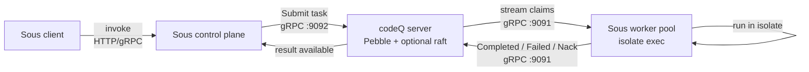

Sous is a sibling project that turns codeQ from a generic task queue into a
substrate for running user-supplied functions. The Sous repository describes
itself as follows: "SOUS is a serverless execution layer for agent automation,
deploying functions without compilation. The platform ensures runtime parity
between local and cluster, executing functions in secure isolates." That
sentence captures the shape of the integration. Sous accepts a function, runs
it inside an isolate, and does so the same way on a developer laptop as on a
production node. What it does not do is reinvent a scheduler, a persistence
layer, or a retry machinery — those come from codeQ.

This chapter sits in the codeQ documentation because the integration shape
matters even if Sous itself lives in a separate repository. codeQ does not
depend on Sous; it has no knowledge of functions, isolates, or any Sous-side
concept. Sous depends on codeQ, and it depends on it through the same gRPC
surface that any other producer or worker would use. The chapter explains how
the two systems fit together, what each side owns, and where to go for the
parts that live outside this repository. The Sous source, installation, and
function authoring guide live at
[github.com/osvaldoandrade/sous](https://github.com/osvaldoandrade/sous); this
chapter assumes you may want to know what Sous is before you click through.

## Functions as tasks

A function invocation in Sous starts as a request to the Sous control plane.
The control plane exposes its own HTTP and gRPC surface for clients — that
surface is a Sous concern and is documented in the Sous repository — but the
moment a request is accepted and validated, Sous translates it into a codeQ
task. The function name is written into the task's `command` field; the
serialized argument list is written into `payload`. Anything Sous wants to
carry alongside the invocation — tracing context, tenant identity, deadlines
— rides in task metadata, the same metadata channel that any other codeQ
producer would use.

From that point on the task is an ordinary codeQ task. It sits in a queue, it
is subject to priority ordering, it inherits the queue's retry policy, and it
participates in the lease lifecycle described in chapter 2. The Sous worker
pool connects to codeQ as a normal worker over the gRPC stream on `:9091` and
issues claims. When a Sous worker claims a task, it does not yet know that it
is running a function — it sees a `command` string and a `payload`, looks the
command up in its function registry, hydrates the function into a fresh
isolate, executes it, and then reports back via the standard result calls.
Successful runs become `Completed`; runtime errors that the function can
declare as terminal become `Failed`; transient failures that should be
retried become `Nack`; cancellations that the function declines to honor
become `Abandon`. None of those verbs are special to Sous; they are the same
verbs every worker uses, and they are described in chapter 2.

The lease semantics matter most when an isolate dies. Isolates are processes,
and processes can be killed by the kernel, by a hardware fault, or by a
self-imposed resource cap. When a Sous worker loses an isolate mid-run, the
codeQ lease attached to the task simply expires, the task returns to the
queue, and another worker is free to claim it. The function does not have to
implement its own retry; it inherits the queue's. See chapter 2's section on
leases for the timing rules and what happens to tasks whose owner has gone
silent.

## Secure isolates and runtime parity

The phrase "secure isolates" describes the unit in which Sous runs a function.
An isolate is a process boundary with restricted syscalls and a resource cap
on CPU, memory, and wall-clock time. The function cannot escape it without
the kernel and the host saying so, and the host can tear it down at any time
without affecting other work on the same worker. codeQ has no opinion on what
an isolate looks like, but the boundary is what makes "deploy without
compilation" safe — a function from a third party can run on a Sous worker
without compromising the rest of the pool, because what it can touch is
bounded by the isolate rather than by the host process.

"Runtime parity between local and cluster" is the second half of the same
idea. The isolate semantics on a developer laptop are the same as the isolate
semantics on a production node: the same syscall filter, the same resource
ceiling, the same input and output contract. A function that runs to
completion locally will run to completion on the cluster, and a function that
trips the resource ceiling locally will trip it on the cluster. That is a
Sous guarantee, not a codeQ one — codeQ sees only tasks — but it is the
reason Sous workers can be deployed against any codeQ instance, embedded or
clustered, without changing how a function behaves.

## Why functions belong as tasks

The case for layering Sous on codeQ rather than on a dedicated function
scheduler is the case for not building a scheduler twice. Tasks already carry
lease ownership; tasks already have a retry policy with backoff; tasks
already participate in priority ordering and in queue-level rate limits;
tasks already persist through restarts in Pebble. A function invocation
needs every one of those properties. If Sous owned its own scheduler it would
end up writing them again, on top of a storage layer it would also have to
write. By mapping invocations onto tasks, Sous inherits the whole machinery
and is free to spend its complexity budget on isolates, on the function
runtime, and on the control plane it exposes to its own users.

The trade is latency. Sous adds isolate startup to whatever claim latency
codeQ already imposes, which means an end-to-end function call is bounded
below by claim latency plus isolate startup time. That is a fit for
medium-grained work — anything from tens of milliseconds upward, where the
isolate setup amortizes — and it is not a fit for sub-millisecond RPC. If a
Sous user needs single-digit-millisecond round trips, they are using the
wrong layer, and the Sous documentation says so. For everything heavier than
that, the inherited durability and retry behavior usually justifies the
fixed overhead.

## Architecture at a glance

Two boundaries are worth naming. The first is the boundary between the Sous
control plane and codeQ: it is a producer connection on `:9092`, identical in
shape to what an application would use if it spoke to codeQ directly. The
control plane is, from codeQ's point of view, just another producer. The
second is the boundary between the Sous worker pool and codeQ: it is a worker
connection on `:9091`, opening a bidirectional stream, claiming tasks,
returning results. From codeQ's point of view the worker pool is just another
worker. Inside Sous each side does much more — argument validation on the
control plane, isolate management on the workers — but the wire surface is
the plain codeQ gRPC surface documented in chapter 4.

## Getting started with Sous

The setup steps for Sous itself — building the binary, registering functions,
running the control plane, deploying the worker pool — live in the Sous
repository at
[github.com/osvaldoandrade/sous](https://github.com/osvaldoandrade/sous).
That repository is the canonical reference for function authoring, the CLI,
and the runtime contract an isolate exposes to a function. The codeQ docs
will not duplicate any of it; the integration is what is documented here,
and Sous's own quickstart is one click away.

## Where to go next

If you are evaluating whether the task model is a good fit for the functions
you intend to ship, chapter 2 walks through the task lifecycle, the lease
rules that govern ownership, and the result verbs that Sous workers use to
report function outcomes. If you want to see the exact gRPC surface that the
Sous control plane and worker pool talk to, chapter 4 documents the codeQ IO
streams, including the producer port on `:9092` and the worker port on
`:9091`. Everything past those two chapters is shared with any other use of
codeQ — operations, storage, security — and applies to a Sous deployment
without modification.
