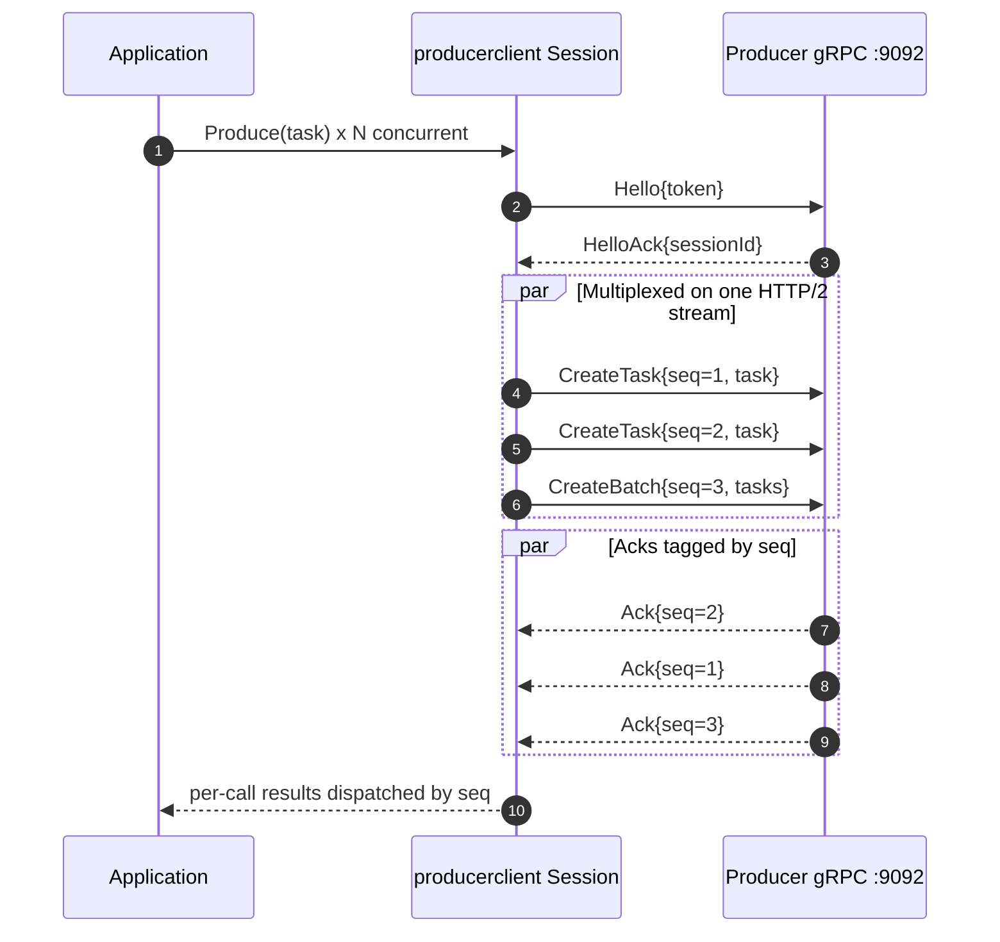
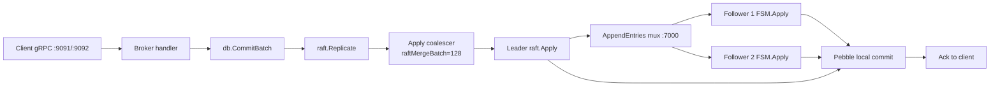
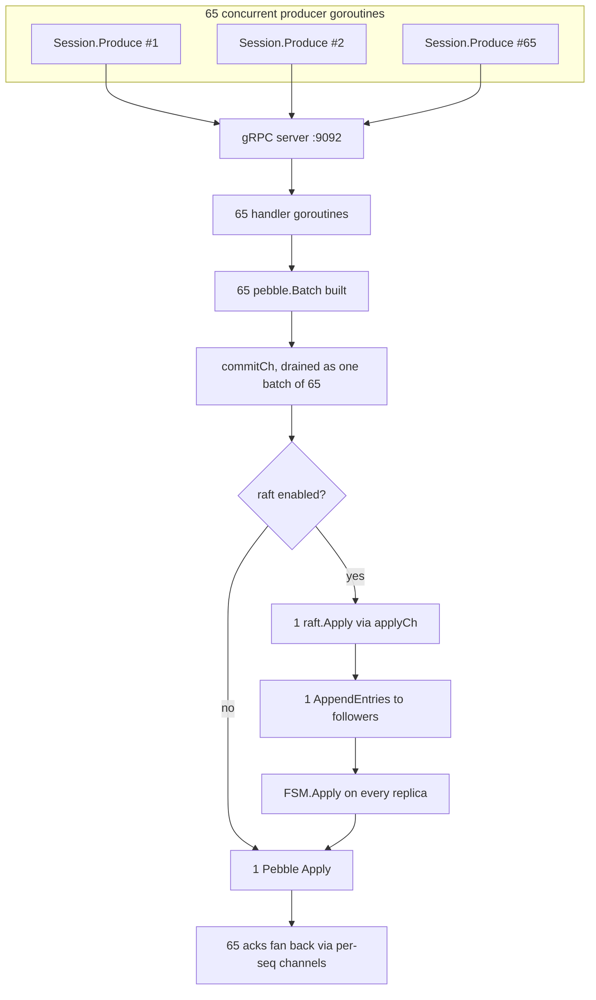

# 4. CodeQ I/O

Every task that enters codeQ travels through three I/O layers before it is durably accepted, and through the same three layers in reverse before a result is handed back to the application. The first layer is the network — a bidirectional gRPC stream in the common case, plain HTTP/1.1 REST when a caller cannot speak gRPC. The second is the persistence engine — a group-commit coalescer sitting on top of a log-structured merge tree, where concurrent batches collapse into a single underlying write. The third is replication — an optional raft layer that copies every accepted batch to a quorum of nodes before it is acknowledged. The three layers are decoupled at the call boundary but coupled in their cost model: a single Produce call walks all three on the way in and pays for all three on the way out.

This is the longest chapter in the book because it is where most of codeQ's measurable behaviour lives. The previous chapter described the domain model — tasks, sessions, leases, results — without committing to any wire format or storage substrate. This chapter pins those abstractions to bytes on the wire and bytes on disk. The chapter walks the three layers in order, then closes with a section on how they compose when traffic arrives at a node faster than any single layer would handle on its own. Where the reference manuals already say enough, the chapter links rather than duplicates; where the algorithm is the interesting part, it is described in prose first and code citations second.

## 4.1 The gRPC streaming surface

The recommended client path into codeQ is a bidirectional gRPC stream. A producer or worker opens exactly one stream to the broker and multiplexes every subsequent operation over it, identifying each in-flight request by an integer sequence number. The server replies with acks tagged by the same sequence number, and the client demultiplexes them against a small in-memory map of pending requests. The connection is long-lived; the per-call overhead is one HTTP/2 frame, not one TCP handshake and one HTTP/1.1 transaction.

The main strength of the streaming surface is that it removes the dominant cost of an HTTP REST client at high concurrency. On the same single-node configuration, REST tops out around three to four thousand tasks per second per client because `http.Transport.tryPutIdleConn` becomes a mutex bottleneck on connection-pool churn — every request acquires, parks, and returns a connection. A gRPC stream sustains 76,639 tasks per second on the same hardware (`internal/bench/profile_full_cycle_test.go`), because the same persistent HTTP/2 connection carries every frame and the mutex disappears from the hot path. The benefit is not gRPC-the-RPC-framework, it is HTTP/2 multiplexing applied to a workload that is dominated by small, frequent requests.

The wire shape is small. Each session begins with a `Hello` frame carrying a bearer token; the server replies with a `HelloAck` containing the assigned session identity and any negotiated limits. From that point the client interleaves event frames — `CreateTask` and `CreateBatch` for producers (`internal/producer/server.go`), `Ready` and `Result` for workers (`internal/worker/server.go`) — each tagged with a monotonically increasing sequence number. The server processes each event on a per-event goroutine for `CreateTask`, which is what lets a single session present 64 concurrent in-flight creates without head-of-line blocking. Backpressure is enforced by a bounded send channel of 256 entries per session; once the channel is full the server stops reading further frames from that stream, which causes HTTP/2 flow control to push back on the client and eventually surface as a blocked send.

The client SDKs hide the multiplexing. `pkg/producerclient/client.go` exposes a `Session` whose `Produce` call is safe to invoke from many goroutines concurrently — internally each call allocates a sequence number, parks a per-seq ack channel in a `sync.Map`, writes one frame, and waits for the matching ack. `pkg/workerclient/client.go` exposes `Run(ctx, Handler)` which opens a stream, sends `Ready(count, leaseSeconds)` to advertise capacity, and fans incoming `Task` frames out across `Concurrency` worker slots; each handler returns one of four `Result` constructors — `Completed(any)`, `Failed(string)`, `Nack(int, string)`, `Abandon()` — defined in `pkg/workerclient/result.go`. The four cases map one-to-one to the four terminal lease outcomes described in the previous chapter.

The worker stream at `:9091` is structurally identical: `Hello → HelloAck → Ready(count, leaseSeconds) → Task | TaskBatch → Result | ResultBatch → close`. The worker SDK closes the stream cleanly on context cancellation; the broker releases any in-flight leases attributable to that session through the abandon path described in the chapter on leases. For full SDK semantics, see `docs/35-producer-streaming-sdk.md` and `docs/36-worker-streaming-sdk.md`. The protocol-level guide lives in `docs/34-streaming-api-guide.md`.

## 4.2 The REST API

REST exists for the cases where streaming is not available — shell scripts driving the broker from `curl`, language ecosystems without first-class gRPC, operators reaching for `httpie` to debug a live cluster. The endpoints mirror the gRPC operations one-to-one: `POST /v1/codeq/tasks` to enqueue, `POST /v1/codeq/tasks/claim` to acquire work, `POST /v1/codeq/tasks/<id>/result` to complete or fail, and the corresponding batch variants. The HTTP server runs on port `:8080` behind a Gin engine; the full endpoint catalog is in `docs/04-http-api.md` and is not duplicated here.

The choice between REST and gRPC is a throughput choice, not a feature choice. Anything that can be done over the stream can be done over REST and vice versa, but REST pays a per-request connection-pool cost that becomes the dominant term above a few thousand requests per second per client. The rule of thumb is: if the caller will sustain more than a few hundred requests per second, use the streaming SDK; otherwise REST is the simpler integration and the difference will not be visible in production.

## 4.3 The persistence engine

Every accepted task lands in a Pebble database through a group-commit coalescer. The algorithm is the interesting part — Pebble is the library underneath, but what determines codeQ's write throughput is the shape of the commit path layered on top of it.

The flow is straightforward in prose. A request handler that needs to write builds a `pebble.Batch` containing every key the operation must mutate — the task record, its queue-pending index, its TTL index entry — and calls `db.CommitBatch(batch)` (`internal/repository/pebble/db.go:312`). `CommitBatch` does not call the underlying database directly; instead it sends a `commitReq` over a bounded channel and waits on a per-request done channel. A single coalescer goroutine drains that channel. On each iteration it accepts the head request, then non-blockingly pulls up to `maxMergeBatch=64` further requests from the same channel, merges all of their batches into the head via `batch.Apply(other)`, issues one `db.db.Apply(merged, NoSync)`, and signals every parked submitter at once (`internal/repository/pebble/db.go:71-82`, `internal/repository/pebble/db.go:341-401`). Sixty-five concurrent writers thus pay the cost of one underlying commit between them.

The reason the coalescer exists is measurable. Before it was introduced, Pebble's `commitPipeline` mutex accounted for 96% of total mutex time at 26,000 requests per second on a single node — every concurrent caller was queueing behind a lock that was already serializing everyone. The coalescer collapses that contention by serializing the work outside Pebble: by the time the merged batch reaches `commitPipeline`, there is exactly one caller, and the mutex is uncontended. The constants are sized for the worst measured load: `commitChanBuf=1024` is several commit cycles' worth of headroom at 30,000 requests per second times three commits per task (`internal/repository/pebble/db.go:118-128`), so producers do not block on the channel under normal conditions; `maxMergeBatch=64` is the point at which further merging stops yielding latency improvements because the underlying batch.Apply cost catches up with the mutex savings.

Underneath the coalescer is an ordinary log-structured merge tree. New writes land in an in-memory memtable backed by a write-ahead log; the memtable flushes to a level-zero sorted-string table when it fills; background compaction merges level-zero files down through L1..L6, removing tombstones and overwrites along the way. Reads consult the memtable first, then the level-zero files newest-first, then descend the levels. The default fsync mode is `pebbledb.NoSync` — codeQ relies on Pebble's WAL replay on `Open` to recover writes that were acknowledged but not yet flushed when a process crash happened. For host-level durability against power loss or kernel panic, `fsyncOnCommit=true` makes every commit synchronous at the cost of significant latency. The trade is described in detail in `docs/07b-storage-pebble.md`; the relevant point here is that the default is durable against process crashes but not against simultaneous host loss without replication.

Batch atomicity is the other reason the engine looks the way it does. Every operation that mutates more than one key — and almost every operation does — uses a single `pebble.Batch` and commits it through the coalescer. Either every key in the batch lands or none of them does; there is no half-applied state visible to readers. The key layout in `internal/repository/pebble/keys.go:25-59` is structured so that the indexes needed to find a task (the queue pending list, the TTL index, the in-progress index) are siblings of the task record under predictable prefixes, which lets one batch update the record and its indexes atomically.

| Prefix | Shape | Purpose |
|---|---|---|
| `codeq/tasks/<id>` | flat record | Canonical task envelope |
| `codeq/q/<cmd>/<tenant>/pending/<prio_be1>/<seq_be8>/<id>` | sorted index | Priority+FIFO ordering for claim |
| `codeq/q/<cmd>/<tenant>/inprog/<id>` | flat index | In-flight lease tracking |
| `codeq/q/<cmd>/<tenant>/delayed/<score_be8>/<id>` | sorted index | Scheduled tasks keyed by due time |
| `codeq/q/<cmd>/<tenant>/dlq/<id>` | flat index | Dead-letter terminal state |
| `codeq/ttl/<expire_unix_be8>/<id>` | sorted index | TTL sweeper scan range |
| `codeq/idempo/<key>` | flat record | Idempotency dedup window |
| `raft/log/*`, `raft/stable/*` | hraft stores | Replication metadata (when enabled) |

Big-endian fixed-width encoding of priority (`prio_be1`) and sequence (`seq_be8`) is the trick that makes `claim` an `O(log n)` iterator seek: Pebble's natural byte order is the queue order, so the worker stream reads the next-due task by scanning the prefix and stopping after one key. The TTL sweeper does the same with `expire_unix_be8`. Sharding internals — multiple Pebble instances per node with consistent hashing on `<cmd>/<tenant>` — are covered in `docs/08b-pebble-sharding-internals.md`.

## 4.4 Replication and high availability

When replication is enabled, the persistence engine described above stops being the last hop. `AttachReplicator` swaps the local coalescer off the write path, and `db.CommitBatch` becomes a call to `repl.Replicate(batch.Repr())` (`internal/repository/pebble/db.go:103-108`). The serialized batch representation crosses into the raft layer, which has its own coalescer, its own quorum round-trip, and its own commit. The single-node fast path and the replicated path are the same code on the call side; only the implementation behind the `Replicator` interface differs.

The raft layer's coalescer is structurally identical to the one in the persistence engine but tuned for a different cost model. `Replicate` parks the caller, the apply loop drains up to `raftMergeBatch=128` concurrent requests, merges them into one batch, and submits one `raft.Apply` (`internal/raft/db.go:143-149`, `internal/raft/db.go:597`). The reason `raftMergeBatch` is twice `maxMergeBatch` is that the unit of cost is different: at the persistence layer each commit pays a mutex acquisition; at the raft layer each Apply pays a network round-trip to followers, which is one to two orders of magnitude more expensive. Merging twice as aggressively amortizes that fixed cost over twice as many tasks.

The wire layer underneath is a small mux. Each node runs one TCP listener at `:7000` (`internal/raft/mux_transport.go:15-25`); incoming connections emit a four-byte big-endian group identifier as their first frame, and the acceptor dispatches the remainder of the connection to the raft group that registered that identifier (`internal/raft/mux_transport.go:80-92`). The multiplexing matters because a node may host several raft groups concurrently — one per Pebble shard in the supported M2 layout — and they share a single port. AppendEntries from the leader of any group reaches the right follower instance through the same listener.

The replication protocol itself is unmodified hraft. The leader takes the merged batch, writes it to its local raft log, broadcasts it to followers as an AppendEntries RPC, waits for a majority (two of three nodes in the default deployment) to ack, then commits the entry. On commit, every replica's FSM runs `Apply` on the same bytes: `internal/raft/fsm.go:43-62` calls `batch.SetRepr(repr)` followed by `batch.Commit(pebbledb.NoSync)` on the local Pebble store. Because every replica runs the same Apply on the same input, every replica's state machine converges to the same key-value state. This is textbook state-machine replication; codeQ adds no novelty on top of the raft contract.

Failover is the operational reason for paying the replication cost. When a leader dies, followers stop receiving heartbeats. After `HeartbeatMS=1000` milliseconds without a heartbeat (`internal/raft/db.go:39-56`), a follower transitions to candidate, increments the term, and solicits votes from the rest of the cluster; a node that wins a majority becomes leader and resumes serving AppendEntries. End-to-end the gap from failure to first acknowledged write on the new leader is one to three seconds on a healthy network — most of it spent waiting for the heartbeat timeout, a small fraction in the vote round-trip itself.

What the client sees during failover depends on protocol. An HTTP REST request to a follower receives a `307 Temporary Redirect` pointing at the current leader; the client follows the redirect and the operation completes. A gRPC streaming caller receives `ErrNotLeader` on the next event after the leader changes; the SDK closes that stream and dials the new leader through service discovery, then replays any in-flight unacknowledged events from its pending map. Operationally there is a one-to-three-second tail-latency bubble during failover, then steady state resumes. The walkthrough in `docs/42-raft-failover-walkthrough.md` traces a single failure end-to-end with timestamps.

The honest cost is worth stating outright. A single node serves 76,639 tasks per second over gRPC. A three-node raft cluster with gRPC and the Apply coalescer enabled serves nine to ten thousand cycles per second steady-state (`pkg/app/raft_grpc_bench_test.go`); the same cluster over HTTP smart-routing serves around 3,949 cycles per second with one shard and 3,883 with four (`pkg/app/raft_smart_routing_bench_test.go`). The ratio is roughly eight to one. The dominant cost is the AppendEntries round-trip, which on a loopback WSL2 development host is a worst-case latency floor; production deployments on real networks with dedicated NICs run closer to the upper end of that gap, but they never recover the single-node number — that is the price of durability against host loss. Configuration rules in `pkg/config/config.go:662-683` prevent combining raft with the cluster-shards or sharding features that would otherwise overlap its responsibilities; enabling raft enables exactly one supported topology, which is multiple Pebble shards under a single raft group per shard. The full raft chapter is `docs/40-raft-replication.md`.

## 4.5 How the layers compose under load

The three layers are independent in their code paths but they all run on the same handler goroutine. To see what that costs under contention, follow one Produce call when 64 other Produce calls land on the same node within the same millisecond.

The gRPC server reads 65 event frames from the stream — possibly from 65 different sessions, possibly from one session sending 65 in-flight — and dispatches each onto its own goroutine. Each goroutine runs the scheduler's CreateTask logic, builds a `pebble.Batch` containing the task record and its indexes, and calls `CommitBatch`. All 65 land in the commit channel within microseconds of each other; the coalescer goroutine pulls the head, then non-blockingly drains the remaining 64 from the channel, and merges everything into one batch. One `db.Apply(merged, NoSync)` runs; the underlying mutex is uncontended because there is exactly one caller. 65 done channels are signalled, 65 handler goroutines wake, 65 acks are written back to the streams. The per-task cost on the commit hot path is `1/65` of one mutex acquisition plus the marginal merge work, which is dominated by the marshalled-batch byte copy.

With raft enabled the same picture extends one layer. The 65 `CommitBatch` calls each become `Replicate` calls. The raft apply loop drains all 65 into one merged batch and issues one `raft.Apply`. One AppendEntries flight reaches the followers carrying every task. Two of three nodes ack, the entry commits, FSM.Apply runs once on each replica, and the local commit on each replica goes through the same coalescer path (now degenerate, with one caller). The 65 producers see a single network round-trip's worth of latency, not 65.

This is why the coalescer is the largest architectural decision in the persistence path. Per-Apply cost is fixed-ish — the AppendEntries round-trip dominates and is constant in batch size, and the underlying Pebble commit pays a fixed mutex cost regardless of batch payload size up to a generous limit. Coalescing 65 calls into one keeps that fixed cost constant per batch, so the per-task cost drops linearly with the batch size up to the cap. The benchmark numbers cited above are the empirical confirmation: ten thousand cycles per second on three nodes is what you get when the average coalesced batch is a few dozen tasks deep, and the AppendEntries round-trip stops being the per-task bottleneck and becomes the per-batch bottleneck instead.

The next chapter moves from I/O to scheduling — how a task that is now durably stored gets handed to the right worker at the right time, and what the scheduler does to keep the queue invariants from the domain-model chapter intact under the load patterns described here.
