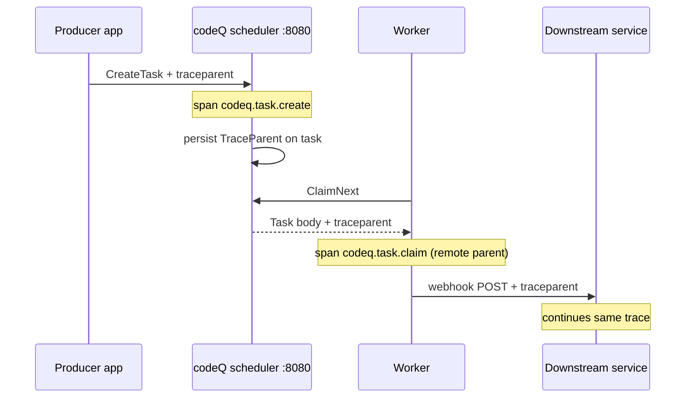

# Observability

A queue that hides its internal state is a queue you cannot operate. codeQ takes the opposite stance and produces four classes of signal that, taken together, let an operator answer the only question that matters in an incident: *where did the time go?* Those four pillars are distributed tracing, Prometheus metrics, runtime profiling, and structured logs. Each of them is on by default, each is wired to a well-known endpoint or output, and each speaks a protocol that the rest of the cloud-native ecosystem already understands.

This chapter is not about dashboards. Dashboards are an operator concern and live in the operator's Grafana, Tempo, or Jaeger instance. This chapter is about the *production* of the signals that those dashboards consume — what codeQ emits, where it emits it, and how the four pillars compose so that a complaint of the form "task 9f3b is slow" can be traced from a user-visible HTTP latency, through the producer's span, into the codeQ scheduler, across the Raft commit, into the worker, and out to the downstream service that actually did the work. The remainder of the chapter walks each pillar in turn and closes with a worked example showing how the four are used together.

## Distributed tracing

codeQ propagates W3C Trace Context end to end. The two headers that matter — `traceparent` and `tracestate` — are accepted on every producer call, persisted on the task body itself, and resumed when a worker claims the task. Producers that already participate in an OpenTelemetry trace get that trace continued for free: a single span tree spans the producer service, the codeQ scheduler, the worker, and any webhook callback that the worker triggers. The trace identifier never changes hands; codeQ is not a black hole in the middle of your trace.

The producer-side instrumentation lives in `internal/services/scheduler_service.go:95-104`. When `SchedulerService.CreateTask` runs, it opens a span named `codeq.task.create` and attaches a small, deliberately curated set of attributes: `codeq.command`, `codeq.priority`, `codeq.has_webhook`, `codeq.has_idempotency_key`, and `codeq.tenant_id`. Notice what is *not* there. The payload is not attached. The webhook URL is not attached. Idempotency keys are reduced to a boolean. A span is a public record — it will be exported to a backend the application code does not control — and codeQ treats it as such. Attributes are facts about the request, not the request itself.

The W3C strings then travel with the task. The `Task` struct in `pkg/domain/task.go` carries `TraceParent` and `TraceState` fields; the cluster RPC encodes them on the wire; Pebble persists them in the task body. When a worker claims the task, `tracing.ContextWithRemoteParent` rebuilds a remote parent from those strings and the claim path opens a child span under it. The same context is then injected into outbound webhook headers by `tracing.InjectHeaders`, so a downstream service that respects W3C Trace Context joins the same trace without any coordination with codeQ. Configuration is five fields in `pkg/config/config.go`: `tracingEnabled`, `tracingServiceName`, `tracingOtlpEndpoint`, `tracingOtlpInsecure`, and `tracingSampleRatio` for head sampling. The OTLP exporter targets any OTLP/gRPC receiver — Jaeger, Tempo, the OpenTelemetry Collector — and codeQ does not care which. The propagation contract and full file-by-file mechanics live in [`docs/37-observability.md`](../37-observability.md).

A practical consequence: if a single trace ID in Tempo shows the `codeq.task.create` span finishing in 4 ms, a 2 s gap, and then a `codeq.task.claim` span starting, the latency is queue depth, not codeQ. If instead the create span itself is 800 ms wide, the latency is on the write path. The trace tells you which question to ask next.

## Metrics

codeQ exposes Prometheus metrics on the same port as the HTTP API, at `GET /metrics`, in the standard text exposition format. There is nothing to configure on the codeQ side — point a Prometheus scrape job at `:8080/metrics` and the metrics appear. The naming convention is `codeq_<subsystem>_<unit>`, and the metric set is split between counters that track lifecycle events and histograms that track operation latency.

The counters answer "how many" questions: `codeq_task_created_total`, `codeq_task_claimed_total`, `codeq_task_completed_total` (labeled by final status), `codeq_lease_expired_total`, `codeq_webhook_deliveries_total` (labeled by outcome). The histograms answer the harder question of "how long": `codeq_task_processing_latency_seconds` records the end-to-end interval from creation to completion, with buckets that span 100 ms to one hour because real task latencies span six orders of magnitude. There are companion histograms for claim and submit latency on the hot path.

Histograms exist because averages lie. At scale, the mean of a latency distribution is dominated by the bulk of fast cases and tells you almost nothing about the tail. The percentile that hurts your users — usually p99 or p99.9 — is invisible in an average and visible in a histogram. Prometheus's `histogram_quantile` aggregation over a bucketed histogram is the cheapest way to recover that percentile in a multi-replica deployment, which is why codeQ pays the cost of histogram buckets on every latency-bearing operation rather than recording only a counter and a sum. For the full catalog of metric names, labels, and intended dashboards, see [`docs/37-observability.md`](../37-observability.md); duplicating the catalog here would only invite drift.

## Profiling

codeQ ships pprof endpoints in development builds at `/debug/pprof/*` and the bench harness wraps Go's `runtime/pprof` to capture CPU, mutex, block, and allocation profiles for offline analysis. The endpoints are the standard Go pprof handlers; `go tool pprof http://host:8080/debug/pprof/profile?seconds=30` works without modification. The bench-side harness is more interesting because it pins the runtime sample rates that production code leaves at their defaults — `runtime.SetMutexProfileFraction(1)` and `runtime.SetBlockProfileRate(1)` — and captures all four profile classes for the same workload window. `pkg/app/raft_profile_bench_test.go` shows the multi-node setup; `internal/bench/profile_full_cycle_test.go` shows the single-node version.

Mutex profiling deserves a special call-out because two of the biggest performance wins in codeQ were found that way and not by any other technique. The Pebble group-commit coalescer was introduced after a mutex profile showed more than half of worker time blocked inside `pebble.commitPipeline` — many small writes contending for one WAL fsync. The Raft Apply coalescer was introduced after a separate profile showed contention in `http.Transport.tryPutIdleConn` on the gRPC client used between replicas. In both cases, no CPU profile or top-level metric would have surfaced the bottleneck: the system was doing the right work, just serializing on the wrong lock. Mutex profiling — combined with the discipline of running it under a load that resembles production — is how that kind of contention becomes visible.

## Structured logging

Logs are JSON by default, emitted through `log/slog`, and every event carries the `traceparent` of the operation that produced it. Per-event keys are stable and short (`task_id`, `command`, `status`, `tenant`), and stack traces are reserved for `error`-level events; info-level logs are sized for `grep | jq` pipelines, not for human eyes scrolling a terminal. The `logLevel` and `logFormat` fields in `pkg/config/config.go` control verbosity and encoding; `logFormat: text` is available for local development where reading a JSON line per event is painful.

The four levels have specific jobs. *Debug* records per-operation traces — the kind of "I saw key X at sequence Y" detail that is essential when reproducing a bug locally and ruinous in production. *Info* records lifecycle events: a task was created, a worker claimed it, a webhook fired. *Warn* records recoverable issues that the system handled — a transient claim conflict, a backoff scheduled, a retry exhausted on one attempt but with more attempts left. *Error* is reserved for the unrecoverable: a Pebble write that failed after retries, a Raft step that returned an unexpected status, a webhook that exhausted its full retry budget. Because every event carries the traceparent, a single log line is enough to pivot into the full trace in Jaeger or Tempo — which is the whole point of structuring the logs in the first place.

## Putting it together

The pillars are designed to be used as a sequence, not in isolation. A worked example: an operator gets paged because the p99 of `codeq_task_processing_latency_seconds` crossed the SLO. They open the Prometheus dashboard and see a clean spike at 14:32 that subsides by 14:35 — a three-minute event. They pivot to the structured logs and search the same window for `status=completed` events with high `duration_ms`, find a representative `task_id`, and copy its `traceparent`. They paste the trace ID into Jaeger and see the trace: the `codeq.task.create` span is fast, but the `codeq.task.claim` span is 800 ms wide. The latency is on the claim path. They open the mutex profile captured by their continuous profiler at 14:32 and find contention on the lease table. They lower worker `Concurrency` to relieve the contention, redeploy, and watch the p99 return to baseline.

That sequence — metric anomaly to log sample to trace pivot to profile cross-reference to configuration change — is the operational loop codeQ is built to support. Each pillar contributes one piece of evidence the next pillar cannot supply on its own. The metric tells you *that* something is slow. The log tells you *which* task. The trace tells you *which span*. The profile tells you *which lock*. None of the four is sufficient alone, and none is redundant. That is what observability means in this codebase.
