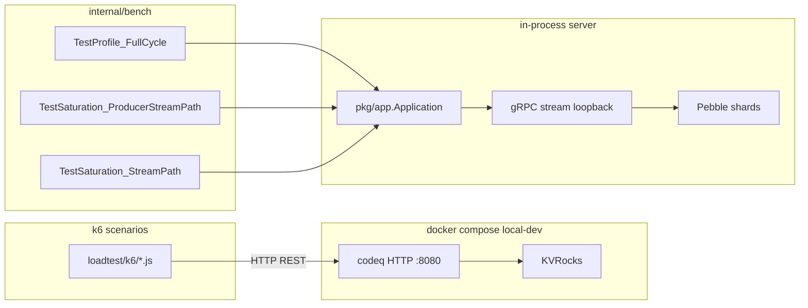

# Load testing

codeq ships two complementary perf harnesses:

- **k6 HTTP scenarios** in [`loadtest/k6/`](./k6/) — exercise the public
  HTTP API end-to-end (TCP, JSON, Gin router). These match the
  scenarios defined in Issue #30 and are the closest analogue to a
  production smoke test.
- **In-process Go benchmarks** in [`internal/bench/`](../internal/bench/)
  — drive the producer + worker streams directly against an embedded
  `pkg/app.Application` (loopback gRPC, no Docker). These are the
  canonical numbers cited throughout the docs.

Use k6 to check API-shaped regressions (request latency, error budget,
JSON encoding cost). Use the Go benchmarks to check raw queue
throughput and to compare branches before a release.

## Layout



## k6 scenarios

The scripts live in [`loadtest/k6/`](./k6/) and share a small helper
library under [`loadtest/k6/lib/`](./k6/lib/):

| Script | Workload | Key env vars |
|---|---|---|
| `01_sustained_throughput.js` | 1000 tasks/s for 1h (default) | `RATE`, `DURATION`, `WORKER_VUS`, `CLAIM_P99_MS` |
| `02_burst_10k_10s.js` | 10k tasks in 10s, then drain | `RATE`, `BURST_DURATION`, `DRAIN_DURATION`, `WORKER_VUS` |
| `03_many_workers.js` | 100+ concurrent claimers | `WORKER_VUS`, `DURATION`, `PRODUCER_RATE` |
| `04_prefill_queue.js` | Fills the queue with 100k+ pending, no workers | `TASKS`, `VUS` |
| `05_mixed_priorities.js` | 50% high, 30% medium, 20% low | `RATE`, `DURATION`, `WORKER_VUS` |
| `06_delayed_tasks.js` | 50% with `delaySeconds` | `RATE`, `DURATION`, `DELAY_PCT`, `MIN_DELAY_SECONDS`, `MAX_DELAY_SECONDS` |

### Running k6 against the Compose stack

Start a local stack:

```bash
COMPOSE="docker compose -f deploy/docker-compose/local-dev/compose.yaml -f deploy/docker-compose/local-dev/compose.override.yaml"
$COMPOSE up -d
```

Optional observability stack (Prometheus + Grafana on the `obs`
profile):

```bash
$COMPOSE --profile obs up -d
```

Run a scenario:

```bash
$COMPOSE --profile loadtest run --rm k6 run /scripts/01_sustained_throughput.js
```

Scale knobs via env:

```bash
RATE=1000 DURATION=1h WORKER_VUS=300 \
  $COMPOSE --profile loadtest run --rm k6 run /scripts/01_sustained_throughput.js
```

### Common environment variables

| Var | Default | Notes |
|---|---|---|
| `CODEQ_BASE_URL` | `http://localhost:8080` (script), `http://codeq:8080` (Compose) | Override with `-e` to `docker compose run` |
| `CODEQ_PRODUCER_TOKEN` | `dev-token` | Matches `deploy/docker-compose/local-dev/compose.yaml` |
| `CODEQ_WORKER_TOKEN` | `dev-token` | Same |
| `CODEQ_COMMANDS` | `GENERATE_MASTER` | Comma-separated; targets these commands |
| `CLAIM_P99_MS` | `100` | Threshold for `01_sustained_throughput.js` |

### Success criteria

- P99 claim latency below `CLAIM_P99_MS` (default 100ms) in
  `01_sustained_throughput.js`.
- Queue depth visible via `/v1/codeq/admin/queues/:command` and the
  `codeq_queue_depth{command,queue}` Prometheus metric.

## In-process Go benchmarks

These benchmarks boot a real `pkg/app.Application` with Pebble in a
`t.TempDir()`, wire producer + worker gRPC clients on loopback, and
report tasks/s for a fixed window. They run without Docker, k6, or any
external broker. This is where the throughput numbers cited in
[_STYLE.md § Comparativos](../docs/_STYLE.md#comparativos-use-verbatim-or-as-a-base)
come from.

### Canonical harnesses

| File | Test | What it measures |
|---|---|---|
| [`profile_full_cycle_test.go`](../internal/bench/profile_full_cycle_test.go) | `TestProfile_FullCycle` | Full create → claim → complete cycle, writes pprof to `/tmp/codeq-profiles/` |
| [`producer_stream_vs_rest_test.go`](../internal/bench/producer_stream_vs_rest_test.go) | `TestProducerThroughput_StreamBatchPath` | Producer-only batched stream creates/s |
| [`producer_stream_vs_rest_test.go`](../internal/bench/producer_stream_vs_rest_test.go) | `TestProducerThroughput_RESTPath` | Producer-only REST baseline for comparison |
| [`worker_stream_saturation_test.go`](../internal/bench/worker_stream_saturation_test.go) | `TestSaturation_StreamPath` | Worker concurrency sweep (1 → 512) |
| [`producer_stream_saturation_test.go`](../internal/bench/producer_stream_saturation_test.go) | `TestSaturation_ProducerStreamPath` | Producer concurrency sweep |
| [`worker_stream_vs_rest_bench_test.go`](../internal/bench/worker_stream_vs_rest_bench_test.go) | `TestThroughput_StreamPath` / `_RESTPath` | Side-by-side worker stream vs REST |
| [`cluster_throughput_test.go`](../internal/bench/cluster_throughput_test.go) | `TestClusterThroughput_StairStep` / `_VsSingleNode` | Multi-node consistent-hash cluster |
| [`http_bench_test.go`](../internal/bench/http_bench_test.go) | `BenchmarkHTTP_CreateClaimComplete` | Legacy miniredis baseline (`go test -bench`) |

### Tuning env vars

The Pebble-backed harnesses read three env vars at boot. Combine them
to reproduce the numbers in
[docs/30-performance-baselines.md](../docs/30-performance-baselines.md):

- `PHASE8_SHARDS` — number of intra-process Pebble shards (default `0`,
  meaning single shard). Set to `1`, `2`, `4`, `6`, or `8` to reproduce
  the shard sweep. `4` is the recommended single-node default.
- `PHASE6_BATCH` — worker `BatchSize` (default `0`, single-task claim).
  `32` batches claims and ACKs, which is where the 83k full-cycle and
  23k worker-saturation numbers come from.
- `PHASE6_PROD_BATCH` — producer-side batch size (default `0`). `8` is
  the configuration used for the 83k full-cycle baseline.

### Reproducing the 83k tasks/s baseline

```bash
PHASE8_SHARDS=4 PHASE6_BATCH=32 PHASE6_PROD_BATCH=8 \
  go test -v -run='^TestProfile_FullCycle$' -count=1 -timeout=180s ./internal/bench/...
```

This is the harness cited in
[_STYLE.md § Voice and tone](../docs/_STYLE.md#numbers-first-narrative-second).
The same command writes CPU, alloc, block, and mutex profiles to
`/tmp/codeq-profiles/`:

```bash
go tool pprof -top -cum /tmp/codeq-profiles/cpu.pb.gz
go tool pprof -alloc_space -top -cum /tmp/codeq-profiles/alloc.pb.gz
```

### Other useful invocations

Worker saturation sweep (1 → 512 concurrency, batched):

```bash
PHASE6_BATCH=32 \
  go test -v -run='^TestSaturation_StreamPath$' -count=1 -timeout=300s ./internal/bench/...
```

Producer-only batched stream:

```bash
PHASE8_SHARDS=4 PHASE6_PROD_BATCH=8 \
  go test -v -run='^TestProducerThroughput_StreamBatchPath$' -count=1 -timeout=120s ./internal/bench/...
```

Legacy in-process HTTP cycle (miniredis-backed, fast regression check):

```bash
go test ./internal/bench -bench BenchmarkHTTP_CreateClaimComplete -benchtime=30s
```

> **Note**: most `Test*` benchmarks skip under `-short`. Always omit
> `-short` and use `-count=1` so the Go test cache does not serve a
> stale run.

## Interpreting results

Compare runs against the canonical table in
[docs/30-performance-baselines.md](../docs/30-performance-baselines.md)
and the catalog at
[_STYLE.md § Numbers must come from measurement](../docs/_STYLE.md#7-numbers-must-come-from-measurement).
The reference box used in those tables is a 12-core Linux host
(kernel 5.15, WSL2-compatible), Go 1.25.0, local Pebble, loopback gRPC,
no fsync.

What to look for:

- **k6**: `http_req_duration` p95/p99, `checks` rate, custom thresholds
  in each script. Cross-check with `/metrics` counters
  (`codeq_task_created_total`, `codeq_task_claimed_total`,
  `codeq_task_completed_total`).
- **Go bench**: each saturation step logs `rate=<N> tasks/s` — plot the
  curve, look for the plateau. If the plateau is below baseline by more
  than 5%, capture the pprof and bisect.
- **Memory and GC**: `BenchmarkGCPressure_*` in
  [`gc_pressure_bench_test.go`](../internal/bench/gc_pressure_bench_test.go)
  reports allocs/op. A regression there usually shows up as a
  throughput drop in `TestProfile_FullCycle` under sustained load.

> **Warning**: Pebble harnesses write to `t.TempDir()` and clean up on
> success. A `kill -9` mid-run leaves a directory under `/tmp` —
> reclaim with `rm -rf /tmp/TestProfile_FullCycle*` if your CI runner
> is disk-bound.

## See also

- [Load testing guide](../docs/26-load-testing.md) — narrative version of this page with screenshots.
- [Performance baselines](../docs/30-performance-baselines.md) — historical numbers and CI thresholds.
- [Performance tuning](../docs/17-performance-tuning.md) — knobs that move the bench numbers.
- [_STYLE.md § Numbers must come from measurement](../docs/_STYLE.md#7-numbers-must-come-from-measurement) — citation format for any new throughput claim.
