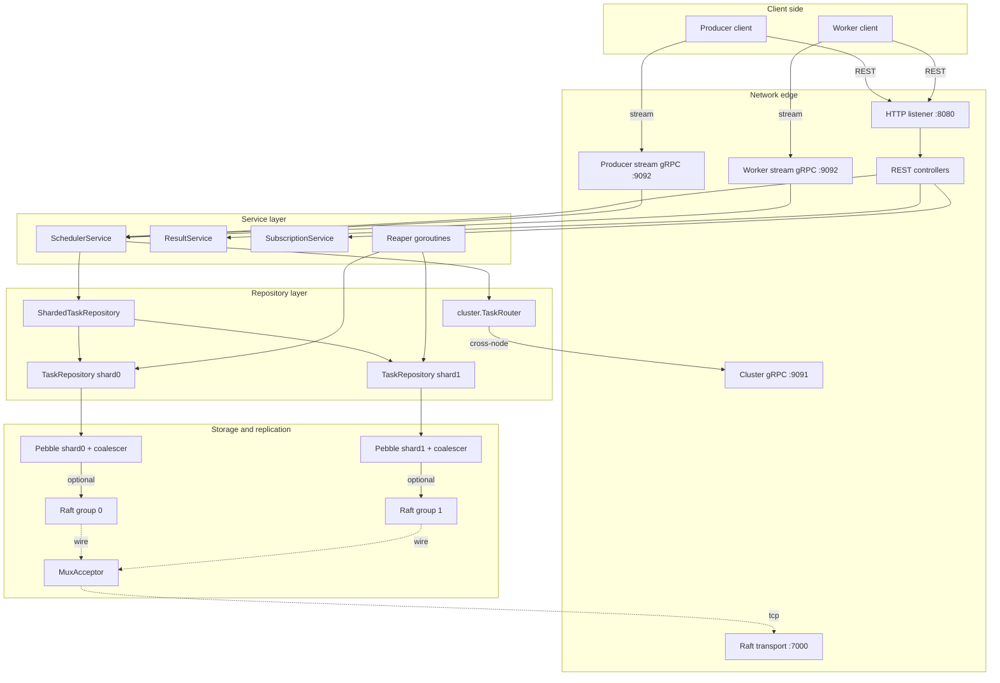

# Architecture Overview

This page is the full picture. It traces a write end to end from the client through the HTTP edge, through the service layer, through the repository routing, into the storage engine, optionally through raft replication, and back. It names the ports, the package boundaries, and the wireup root. Every other Concepts page narrows in on one slice of this picture; the Architecture Overview is the slice that lets you see all of them at once.

The codebase is laid out in three top-level Go module directories. `pkg/` holds the public, embeddable surface — the application bootstrap, the domain types, the producer and worker client SDKs, the configuration loader, the auth package. `internal/` holds everything the binary uses but does not export — the controllers, the middleware, the Pebble repositories, the raft wrapper, the cluster router, the bench harness. `cmd/` holds the binary entrypoints — the `codeq` server, the `codeq-cli` operator tool, and a few smaller helpers. The wireup root, the single function that constructs the whole running application, is `pkg/app/application_pebble.go`, specifically `newPebbleApplication` starting at line 100.

## The big picture



The four numbered ports above correspond to one specific deployment. `:8080` is the HTTP listener for REST and long-poll endpoints. `:9091` is the gRPC port for the cross-node cluster router (the no-replication, hash-routed multi-node mode). `:9092` is the gRPC port for producer-stream and worker-stream bidirectional channels. `:7000` is the raft transport port, shared across all shards via the mux acceptor. Single-node deployments use only `:8080` and optionally `:9092`. Three-node raft deployments add `:7000`. Cluster-router deployments add `:9091`. The ports are individually configurable; the numbers above are the defaults in `deploy/config/codeq.example.yml`.

## The write path end to end

Walk through a single task submission. A producer holds a token, builds a task payload, and sends `POST /v1/codeq/tasks` to `:8080`. The HTTP listener is Gin; the router matches the route to a controller registered during `application.SetupRouter`. Before the controller runs, three middleware chains have already executed: tracing (`internal/middleware/tracing.go`) has attached an OTel span; producer auth (`internal/middleware/auth.go`) has validated the bearer token and stamped `*auth.Claims` on the context; tenant resolution (`internal/middleware/tenant.go`) has extracted the tenant ID from the claims and stamped it on the context. The controller runs with identity, tenancy, and trace context already decided.

The controller for task creation, in `internal/controllers/create_task_controller.go`, deserialises the JSON body into a `domain.Task` and calls `schedulerService.Create(ctx, task)`. The service layer's job is composition — it adds the server-assigned UUID, the server-assigned creation timestamp, the server-assigned tenant ID from the context — and then delegates to the repository. The repository it holds is one of three things depending on configuration. In single-shard mode it is a `*pebble.TaskRepository` directly. In multi-shard mode it is a `*pebble.ShardedTaskRepository` that hash-routes by task UUID across N task repos. In cluster mode it is a `*cluster.TaskRouter` that hash-routes across nodes via the gRPC cluster RPC.

In the single-node multi-shard case the sharded repository computes a stable hash of the task UUID, picks shard k = hash mod numShards, and forwards the call to `taskShards[k]`. The forwarded call lands on a per-shard `TaskRepository.Create` (`internal/repository/pebble/task_repository.go`) which constructs a Pebble batch: one Set on the task row (`codeq/q/<priority>/<id>`), one Set on the pending index (`codeq/q/.../pending/<priority_byte>/<seq_be8>/<id>`), one optional Set on the ghost index if an idempotency key was provided. The batch is handed to `db.CommitBatch(b)`.

`CommitBatch` checks for a replicator. If none is attached (single-node modes), it enqueues the batch on the engine's `commitCh` and blocks on the `done` channel. The single `commitLoop` goroutine pops the request, opens a fresh merge batch, applies the request's ops, opportunistically drains additional requests up to `maxMergeBatch=64`, applies their ops into the merge, calls `merged.Commit(NoSync)`, and fans the result back to every joined submitter. The submitter's `done` channel resolves, `CommitBatch` returns, the repository returns success up the stack, the service returns the assigned UUID, the controller writes a 201 Created response. The whole path runs in tens to hundreds of microseconds end to end on a single-node single-shard configuration.

If raft replication is attached (three-node modes), `CommitBatch` takes a different path. Before committing it checks `repl.IsLeader()`. On a follower it returns a `*pebble.NotLeaderError` carrying the leader's HTTP URL; the controller catches this via `maybeRedirectLeader` (`internal/controllers/respond.go:34-50`) and writes a 307 Temporary Redirect to the client. On the leader it calls `repl.Replicate(batch.Repr())`. The replicator (`*raft.DB`) enqueues an `applyReq` onto its `applyCh`. The single `applyLoop` goroutine pops the request, opens a fresh merge batch, sets the first request's repr into it, opportunistically drains additional requests up to `raftMergeBatch=128`, merges them in, and calls `raft.Apply` with the merged repr. The Apply ships the entry through AppendEntries to both followers, waits for a quorum ack, and on success the FSM applies the merged batch to the local Pebble on every node. The submitter's `done` channel resolves, `Replicate` returns, the controller writes the 201.

The same path runs for every state-changing operation: task claim writes the lease, sets the inprog row, updates the pending index. Heartbeat extends the lease. Result submit writes the result row, clears the lease, removes the inprog entry. Each one is a Pebble batch through the same coalescer (or the same raft.Apply in raft mode). The repository layer is the only place that knows the key schema; everything above it talks `domain.Task` and `domain.Result`.

## The package layout

`pkg/app` holds the bootstrap. `NewApplication` in `pkg/app/application.go` is the top-level constructor; it switches on `cfg.PersistenceProvider` and dispatches to `newPebbleApplication` for the Pebble path. The Pebble bootstrap is `application_pebble.go`, weighing in around 600 lines and orchestrating everything: it parses the persistence config, opens the Pebble shards, optionally wires raft on top, constructs the repositories, conditionally wraps them in the cluster router, constructs the services, attaches the reapers, registers the controllers on the Gin router, registers the gRPC services on the listeners, and returns the `*Application`. The wireup is linear and explicit; there is no dependency injection framework, no service locator.

`pkg/domain` holds the types every other package talks: `Task`, `Result`, `Lease`, `Subscription`, and the small interfaces like `LeaderHint`. The types are plain Go structs with JSON tags and minimal behaviour; they are the contract between the storage layer and the service layer.

`pkg/config` holds the configuration loader. The YAML schema is documented in `deploy/config/codeq.example.yml` and `docs/14-configuration.md`; the Go struct is `config.Config`. Environment variables override YAML keys via uppercase name. The validator at the bottom of `config.go` enforces cross-key consistency rules — `raft.enabled` and `cluster.enabled` are mutually exclusive (`config.go:662-683`), and so on.

`pkg/auth` is the validator interface and registry. The two shipped providers (`jwks` and `static`) register from their own `init()` functions. Custom providers follow the same pattern.

`pkg/producerclient` and `pkg/workerclient` are the Go SDKs for the two client roles. They wrap the REST and gRPC stream surfaces and handle the retry-on-307 logic for HTTP and the reconnect-on-ErrNotLeader logic for gRPC. They are optional — clients in any language can hit the HTTP surface directly — but they are what the bench harness and the internal services use.

`internal/controllers` is one file per HTTP route, roughly. The pattern is consistent: deserialise the request, call the service, format the response, handle the leader-redirect for write routes via `maybeRedirectLeader`.

`internal/middleware` is the auth, tenant, scope, rate-limit, request-id, and tracing chain.

`internal/services` is the service layer. `SchedulerService` owns task lifecycle (create, claim, heartbeat, abandon, nack, complete). `ResultService` owns result submission and read. `SubscriptionService` owns webhook subscriptions for result fanout. `NotifierService` runs the result-callback webhook loop.

`internal/repository/pebble` is the Pebble-backed storage layer. `db.go` is the engine wrapper with the group commit coalescer. `task_repository.go`, `result_repository.go`, `subscription_repository.go` are the per-domain repositories. `sharded_task_repository.go` and `sharded_result_repository.go` are the hash-routed fan-out wrappers. `reaper.go` is the background sweep goroutine. `keys.go` documents the key schema. `lease_table.go` is the in-memory lease index that backs the claim/heartbeat hot path.

`internal/raft` is the raft wrapper around hashicorp/raft. `db.go` is the leader/follower management and the Apply coalescer. `fsm.go` is the one-function shim that turns committed log entries into Pebble batches. `log_store.go`, `stable_store.go`, `snapshot.go` are the hashicorp/raft storage interfaces backed by Pebble. `mux_transport.go` is the per-node TCP demultiplexer that lets all raft groups share one port.

`internal/cluster` is the gRPC cluster router for the no-replication multi-node mode. `ring.go` is the hash ring. `client_pool.go` is the connection pool. `task_router.go` and `result_router.go` are the request routers. `server.go` is the gRPC server that handles routed RPCs.

`internal/bench` is the benchmark harness. `profile_full_cycle_test.go` is where the 76k tasks/s number comes from.

The boundaries are enforced by Go's `internal/` rule: anything under `internal/` cannot be imported by code outside `github.com/osvaldoandrade/codeq/`. Only `pkg/` and `cmd/` are accessible from external embedders. The split keeps the public surface small and explicit; the internal surface can change between versions without breaking anyone.

## The roles inside one process

A running `codeq` server is a single Go process hosting multiple long-lived goroutines, each with a defined role.

The HTTP listener goroutine accepts connections on `:8080` and dispatches to the Gin router. Each request runs on a per-request goroutine that walks the middleware chain and the controller.

The gRPC server goroutine (when producer or worker streams are enabled) accepts streams on `:9092`. Each stream is a long-lived bidirectional channel where the client and the server exchange protobuf frames; the server-side goroutine for a worker stream lives for the duration of the worker's session.

The cluster gRPC server (when cluster mode is enabled) listens on `:9091` and serves the internal `TaskNode` RPC defined in `pkg/cluster/proto`.

The raft transport goroutines (when raft is enabled) live inside `hashicorp/raft` — one accept goroutine per mux-listened port (`:7000`), one connection goroutine per active raft peer, plus the internal main loop that drives the AppendEntries and election state machines.

The engine's `commitLoop` goroutine (one per Pebble shard) is the single owner of the Pebble write side. Every `CommitBatch` call funnels through it.

The raft's `applyLoop` goroutine (one per raft group) is the single owner of `raft.Apply`. Every `Replicate` call funnels through it.

The reaper goroutine (one per Pebble shard) sweeps expired leases and TTL'd rows on a configurable cadence (default every few seconds). In raft mode the reaper is gated by `LeaderGate` so only the current leader actually writes — followers run the sweep loop but skip the writes.

The subscription cleanup goroutine garbage-collects expired webhook subscriptions on a longer cadence.

The metrics endpoint at `:9091/metrics` (or whichever port is configured) serves Prometheus scrapes from a separate listener; the exporter runs on the same engine but is read-only.

Background tracing flushers, log writers, and rate-limit bucket refill timers round out the goroutine inventory. The total count scales with `numShards` (per-shard commit and reaper loops add up) plus the number of active streams plus the number of in-flight requests.

## How a worker claim flows

The other side of the queue is the worker. A worker session opens a gRPC stream on `:9092` (using `pkg/workerclient`) or sends a `POST /v1/codeq/tasks/claim` on `:8080`. The middleware chain runs: worker auth validates the bearer, requires `codeq:claim` scope, stamps the tenant. The controller calls `schedulerService.Claim(ctx, eventTypes, leaseDuration)`. The service delegates to the task repository.

In multi-shard mode the claim must visit every shard, because tasks for the requested event types could live in any of them. The `ShardedTaskRepository.Claim` does a scatter-gather: it issues a per-shard claim against every shard, takes the first successful claim (or returns nothing if all shards came up empty). Each per-shard claim consults the pending priority index, picks the highest-priority oldest entry, atomically writes the lease and the inprog row, and removes the entry from the pending index — all in one Pebble batch. The atomic write through the coalescer (or raft.Apply) guarantees no other claimer can grab the same task.

In cluster mode (cross-node hash routing) the claim scatter-gathers across nodes via the gRPC cluster RPC. Each remote node runs its own per-shard claim and returns the result; the local router picks the first successful claim.

The lease is also stamped into an in-memory `leaseTable` on the owning shard for fast heartbeat. Heartbeats update the lease expiry both in-memory and on-disk; the in-memory copy backs the hot path, the on-disk copy backs recovery after a restart.

When the worker completes the task, it sends `POST /v1/codeq/tasks/:id/result`. The service writes the result row, clears the lease, deletes the inprog and pending entries. All in one Pebble batch. All through the same coalescer or raft.Apply.

The result row sticks around for the configured TTL; the reaper sweeps it eventually. Subscribers (configured via `POST /v1/codeq/subscriptions`) get notified via webhook callbacks driven by `NotifierService`.

## Optional surfaces

A few surfaces are off-by-default and the operator opts in.

The producer stream and worker stream gRPC services are enabled when `ProducerStreamEnabled` or `WorkerStreamEnabled` is true in config. They give a lower-overhead path than REST for high-throughput clients — protobuf framing instead of JSON, persistent connections instead of per-request TCP, and server-pushed notifications for the worker stream. The bench harness uses them for the 76k tasks/s number; production deployments use them when the throughput target justifies the slightly more complex client.

The cluster router is enabled when `cluster.enabled` is true. This is the no-replication multi-node mode — hash routing across nodes with no replication, intended for very large keyspaces where the dataset does not fit on one box. It is mutually exclusive with raft.

The OTel tracing exporter is enabled when `TracingEndpoint` is configured. Without it, traces are computed (the middleware always runs) but not exported.

The Prometheus endpoint and Pyroscope profiling endpoint each have their own port and enable flags.

## The contract between layers

Every layer talks the layer below through a small Go interface. The service layer talks `repository.TaskRepository` and `repository.ResultRepository`. The repository layer talks `*pebble.DB` (or, indirectly through the replicator interface, raft). The engine layer talks the raw `*pebble.DB` plus optionally a `Replicator` delegate.

The replicator interface (`internal/repository/pebble/db.go:21-29`) is the seam where raft attaches:

```go
type Replicator interface {
    IsLeader() bool
    Replicate(repr []byte) error
    LeaderHTTPAddr() string
}
```

Three methods. The engine asks the replicator whether to short-circuit to a not-leader error, asks it to replicate a serialised batch, and asks it to surface the leader's HTTP URL for the 307. Everything raft-specific lives behind those three methods. The same engine code path runs whether raft is attached or not; the only difference is which code runs inside `CommitBatch`.

This decoupling is what makes the modes in [Deployment Modes](Concepts-Deployment-Modes) interchangeable from the application's perspective. The repositories do not know they are replicating. The services do not know there are multiple shards. The controllers do not know about leaders and followers (except for the one place that knows how to format a 307). Each layer's surface stays focused; the operational decisions live in `application_pebble.go` and the configuration.

## What you do not see in the picture

Several things in real deployments live outside the process and outside this page's diagram. Disk volumes hold the Pebble data; backups capture filesystem snapshots of those volumes. Load balancers in front of the HTTP edge handle TLS termination and route requests to nodes. Service meshes apply zero-trust auth and mutual TLS to the inter-node raft and cluster traffic. Container orchestrators (Kubernetes, Nomad, ECS) handle process lifecycle, rolling restarts, and the IP allocation for the raft peer addresses. None of these are part of codeQ; they are the substrate codeQ runs on. The deployment guides in `Get-Started-Run-In-Docker`, `Get-Started-Run-With-Docker-Compose`, and `Get-Started-Run-In-Kubernetes` cover the typical patterns for each.

The process itself is small. Single binary, no external runtime dependencies, embedded storage. Operators who have run Kafka, Redis, or Cassandra clusters will find the operational surface markedly smaller — there is one thing to deploy, one thing to back up, one thing to upgrade. The compactness is part of the design intent; the system is a queue server, not a distributed database, and the operational footprint should match the role.

## See also

- [Authentication And Authorization](Concepts-Authentication-And-Authorization) for the middleware chain
- [Tasks And Results](Concepts-Tasks-And-Results) for the domain model and the key schema
- [Sharding](Concepts-Sharding) for the routing layer in multi-shard mode
- [Persistence Engine](Concepts-Persistence-Engine) for the engine layer and the coalescer
- [Consensus And Replication](Concepts-Consensus-And-Replication) for the raft layer
- [Deployment Modes](Concepts-Deployment-Modes) for the topologies
- [REST API](IO-REST-API) for the controller surface
- [Worker Stream](IO-Worker-Stream) and [Producer Stream](IO-Producer-Stream) for the gRPC surface
