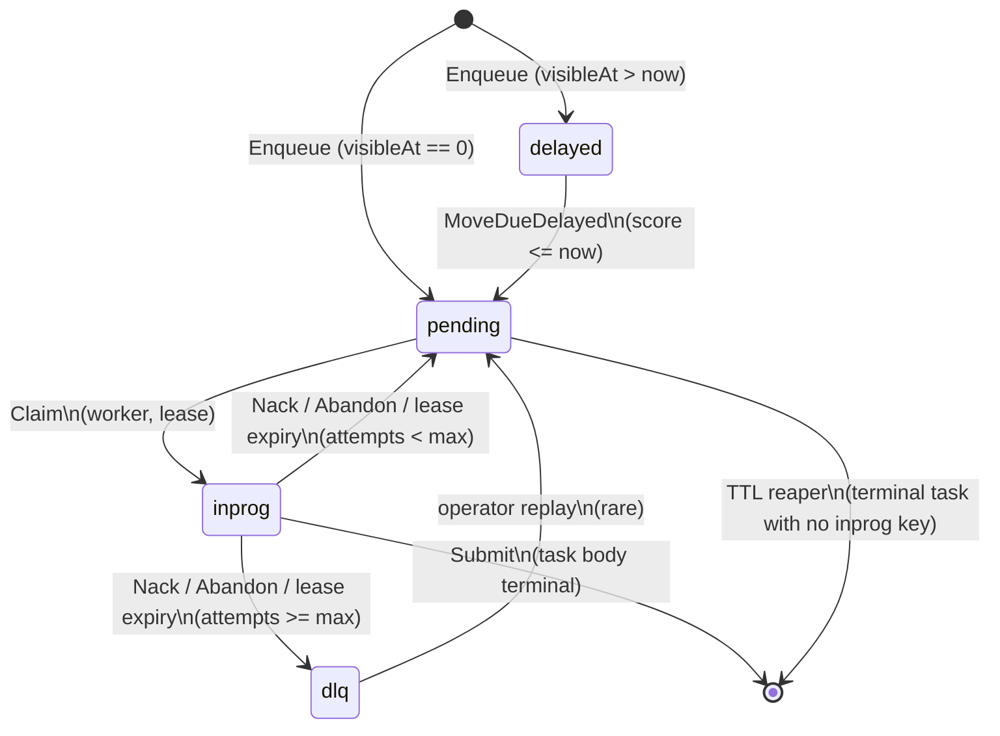

# Queue Model

codeQ presents a per-(command, tenant) FIFO queue with priority preemption, delayed visibility, and a dead-letter side-channel. The implementation is not a list and not a sorted set; it is a set of carefully laid out keys in a single LSM-tree, designed so the natural lexicographic ordering of byte strings produces exactly the queue semantics codeQ advertises. This page explains the layout, the invariants it preserves, and the operations layered on top.

## The keyspace

All keys live under the `codeq/` namespace prefix so the Pebble DB can be shared with unrelated state without collisions. Inside the namespace, four families of keys participate in the queue protocol. The layout is documented in `internal/repository/pebble/keys.go:25-59`:

```
codeq/tasks/<id>                                              → JSON task body
codeq/results/<id>                                            → JSON result record
codeq/idempo/<key>                                            → task id
codeq/lease/<id>                                              → worker id | until-unix  (recovery; see Leases page)
codeq/ttl/<expire_unix_be8>/<id>                              → ""

codeq/q/<cmd>/<tenant>/pending/<prio_be1>/<seq_be8>/<id>      → ""
codeq/q/<cmd>/<tenant>/inprog/<id>                            → ""
codeq/q/<cmd>/<tenant>/delayed/<score_be8>/<id>               → ""
codeq/q/<cmd>/<tenant>/dlq/<id>                               → ""
```

The first thing to notice is that values are almost always empty. The keys themselves encode every piece of routing information. The task body lives in exactly one place (`codeq/tasks/<id>`), and every queue index is a pointer to that body via the embedded task ID. This is deliberate: it means a queue scan never deserialises the task body unless and until the scanner has decided to claim it, which keeps Claim's cost roughly proportional to the number of skipped tasks rather than to their payload size.

The second thing is the use of big-endian fixed-width integer encodings. Priority is one byte (`prio_be1`); enqueue sequence and delayed score are eight bytes each (`be8`). Big-endian is what makes them sort the same way they compare numerically — `0x00 0x00 0x00 0x00 0x00 0x00 0x00 0x05` is lexicographically less than `0x00 0x00 0x00 0x00 0x00 0x00 0x00 0x10`, which matches the integer ordering 5 < 16. If we encoded these as decimal ASCII, `"5"` would sort after `"16"` and the FIFO invariant would break. The helpers `be8` and `prefixUpper` in `keys.go` are how the queue avoids that class of bug.

The third thing is the `<tenant>` segment. An empty tenant is encoded as the literal `_` so the key parser can split on `/` without losing the position. Every queue scan is scoped to a specific tenant; there is no global queue. See [Multi-Tenancy](Concepts-Multi-Tenancy) for what this isolation buys.

## FIFO inside a priority bucket

The pending key for a task is `codeq/q/<cmd>/<tenant>/pending/<prio_be1>/<seq_be8>/<id>`. The two ordering components are priority and sequence. Priority is one byte; codeQ treats higher priority as "earlier", which is achieved by iterating in descending order from priority 9 down to priority 0 on the Claim path. Within a priority bucket, the sequence number is a monotonically increasing counter assigned by the database on Enqueue. The counter is a single per-DB atomic; the [Sharding](Concepts-Sharding) page covers why each shard has its own and what that means for cross-shard ordering.

A Pebble iterator scanning the prefix `codeq/q/<cmd>/<tenant>/pending/<prio_be1>/` returns keys in sorted order, which by construction is sorted-by-sequence, which is the order tasks were enqueued. The Claim path reads the first key, deletes it, writes the inprog key, and the FIFO promise is kept. There is no other data structure involved — no linked list, no separate index, no in-memory queue (well, almost; the fast-path channel is a hint that lets workers skip the iterator when they can, but it is purely an optimisation; the durable ordering is in the keys).

The reason this works in the presence of concurrent Claims is the per-shard commit pipeline. Every Claim is a Pebble batch that combines the pending-key delete, the inprog-key write, the lease entry, and the task-body update with the new status. Pebble's batch commit is atomic and serialised: two concurrent Claims that pick the same key will see the second batch fail (the pending key no longer exists at apply time) and the second worker moves on to the next key. The check is grounded in Pebble's seqnum ordering, not in optimistic concurrency at the application layer.

The pending key contains the task ID as its trailing segment specifically so the value can be empty. Once the iterator has the key, it has everything it needs to locate the task body. `ParsePendingKey` in `keys.go:210-219` does the reverse: given the raw key, it returns the ID. The cost of a Claim that ends up scanning N keys before finding a claimable one is N pointer comparisons plus one final task-body Get — not N JSON decodes.

## Visibility timeout via lease

The IN_PROGRESS state is represented by the inprog key `codeq/q/<cmd>/<tenant>/inprog/<id>`. When a worker claims a task, the pending key is deleted and the inprog key is written in the same batch. As long as the inprog key exists, no other worker can claim this task — both because the task body's `Status == IN_PROGRESS` makes the state diagram block the transition, and because no pending key exists to be claimed in the first place.

The lease is the mechanism that decides how long the inprog state is allowed to persist before the server gives up on the worker and returns the task to PENDING. The lease itself lives in memory (the `leaseTable` covered on the [Leases and Ownership](Concepts-Leases-And-Ownership) page); the durable copy of the expiry time is the `LeaseUntil` field in the task body. The reaper goroutine sweeps the in-memory table every second, finds entries whose `untilU` is in the past, and requeues each one via `requeueExpiredOne`. The requeue is itself a single Pebble batch: delete the inprog key, write a new pending key with a fresh sequence, increment the attempts counter in the task body, clear the worker ID and lease fields.

This is the FIFO promise's chief subtlety. A task that times out and is requeued re-enters the FIFO at the back, not at the front. The new pending key has a new sequence number, so the iterator sees it after every task that was enqueued during the time it spent IN_PROGRESS. Some queue designs would re-insert at the front to preserve priority; codeQ does not, because doing so would let a slow worker monopolise the head of the queue. If the operator wants strict head-priority on retry they can use a higher `Priority` value, which is honoured.

## Delayed visibility

The delayed index is `codeq/q/<cmd>/<tenant>/delayed/<score_be8>/<id>`, with `score_be8` being the Unix-seconds visibility time. Enqueue places a task here instead of in the pending index when the caller supplies a non-zero `runAt` or a positive `delaySeconds`. A task in the delayed index is not claimable by any worker; it is invisible to the queue.

The mover goroutine, `MoveDueDelayed`, runs on a periodic tick (the default is 500 ms) and shifts tasks whose visibility time has passed from delayed to pending. The implementation uses `PrefixDelayedUpTo` in `keys.go:154-163`, which builds an iterator bound that covers every delayed entry with `score <= maxScoreUnix`. Pebble walks them in score order (because `be8` makes scores sort numerically), and each one is moved via the standard batch: delete the delayed key, write a new pending key with a fresh sequence, leave the task body untouched except for `LastKnownLocation`.

A move from delayed to pending is identical, from the worker's point of view, to a fresh Enqueue: the task gets a new sequence, sits at the back of its priority bucket, and is claimable by any subscriber to the command. The producer who specified the delay does not need to do anything else — the next Claim that runs after the mover commits the batch sees the task. The mover is a per-shard operation, fanned out by the [Sharding](Concepts-Sharding) wrapper, so a slow shard does not stall the others.

The cost of `MoveDueDelayed` is proportional to the number of due tasks, not to the total size of the delayed index. The iterator stops as soon as it walks past `maxScoreUnix + 1`. A queue with a hundred thousand future-dated tasks but only ten due now pays for ten moves. This is an explicit design choice; an index sorted by anything other than score (insertion order, for example) would force the mover to scan more than it acts on.

## The dead-letter index

The DLQ index is `codeq/q/<cmd>/<tenant>/dlq/<id>`. A task ends up here when its attempt counter reaches the configured `MaxAttempts` after a Nack, Abandon, or lease-expiry-driven requeue would have happened. Instead of writing a new pending key, the requeue path writes the DLQ key and leaves the task body in its current `FAILED` (or terminal) status. The error string is preserved in `Task.Error`.

A DLQ entry is a tombstone in the sense that codeQ will never claim from it. It is not deleted automatically; the TTL reaper that handles COMPLETED and FAILED tasks treats DLQ entries with the same retention, but operators typically want to inspect or replay them before they expire. The admin API exposes DLQ contents via the queue stats path (see `AdminQueues` in `sharded_task_repository.go:189-203`), and a manual replay path can move an entry back to pending if the operator decides to give it another try.

There is no separate "poison message" detection beyond the attempt counter. codeQ does not inspect payloads for "bad" patterns, does not categorise errors as retryable or terminal, and does not deduplicate DLQ entries by error class. The protocol is: try N times, then give up. The worker is in charge of distinguishing transient from permanent failures and the producer is in charge of choosing N.

## Invariants the queue model preserves

The data layout makes a small set of properties true by construction. The most important is the atomic transition invariant: every move between indexes (pending → inprog, inprog → pending, delayed → pending, inprog → dlq) is a single Pebble batch with one commit. Either every key changes or none do, and the batch is durable on disk before the RPC returns. There is no window in which a task could be observed in two indexes simultaneously.

The second is the at-least-once delivery guarantee. A task that has been Enqueue-acknowledged is durably committed to Pebble before the RPC returns. If the server crashes between Enqueue and Claim, the task survives. If the server crashes between Claim and Submit, the lease expires after a restart and the reaper requeues the task; the worker that originally claimed it sees `not-owner` on a late Submit. If the server crashes between Submit and the response, the result record is durable but the worker may retry the Submit — the result repository is idempotent on `(task_id, status)` so a duplicate write is harmless.

The third is the per-priority FIFO invariant inside a single shard. Within `(cmd, tenant, priority)` on one shard, the order of Claims matches the order of Enqueues, modulo the sequence counter being assigned at commit time rather than at request arrival. Two concurrent Enqueues on the same shard race for sequence numbers but both will get monotonic ones; whichever commits first gets the lower one and will be claimed first. Across shards there is no global FIFO; see [Sharding](Concepts-Sharding) for the trade-off.

The fourth is the visibility invariant for delayed tasks. A task in the delayed index is invisible to Claim until its score time arrives, regardless of priority. A high-priority task scheduled for 30 seconds from now does not preempt a low-priority task scheduled for now; the mover has to land it in pending before priority comparison even applies.

## State diagram of the indexes



The diagram shows the index a task is "in" at any moment, which is distinct from its status. A task transitions to the terminal `COMPLETED` or `FAILED` status by leaving the inprog index entirely — there is no `completed` index. The task body in `codeq/tasks/<id>` is what carries the status; the absence from any of the four queue indexes is what means "this task is not in the queue anymore".

## Operations summary

The complete set of queue operations and their key impact is:

- Enqueue writes the task body, the TTL index, either the pending or delayed key, and optionally the idempotency map — one batch, one commit, one fast-path channel publish.
- Claim deletes a pending key, writes the inprog key, sets the lease, and updates the task body to IN_PROGRESS — one batch, one commit. The choice of which pending key to take comes from a fast-path channel hint when available, otherwise from a scan bounded by `inspectLimit` (default 200).
- Heartbeat extends the lease in the in-memory table. No Pebble write; the persistent `LeaseUntil` field is rewritten only on the next state transition. This is the heartbeat's whole purpose — to be cheap.
- Submit writes the result record, deletes the inprog key, updates the task body to its terminal status — one batch per task; batched Submit groups N tasks per commit per shard.
- Nack and Abandon delete the inprog key, write a new pending or DLQ key, update the task body — one batch.
- MoveDueDelayed loops over due delayed keys, moving each one in its own batch — N batches per call, each independent so a Pebble apply error on one doesn't roll back the others.

The Claim and Submit batches are what dominate the write throughput on the data path. The [Performance Single-Node Throughput](Performance-Single-Node-Throughput) page covers the measurements; the [I/O Group Commit Coalescer](IO-Group-Commit-Coalescer) page covers how concurrent batches share an fsync.
