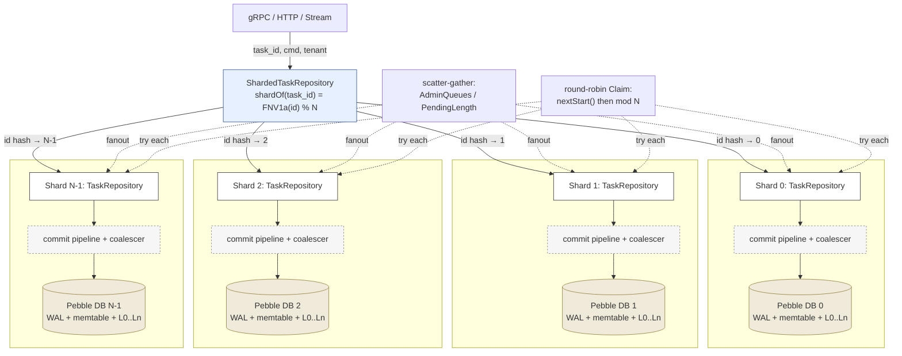

# Sharding

A single codeQ node runs N independent Pebble shards. Every task-keyed operation hashes the task ID with FNV-1a and dispatches to one shard, where it commits in isolation from the others. This is the system's primary mechanism for extracting parallelism from a single machine: writes that land on different shards do not contend for Pebble's commit pipeline, do not share an fsync, and do not block each other on iterator locks.

This is single-node parallelism — distinct from the cluster-mode sharding covered in [Cluster-Level Failover](Concepts-Cluster-Level-Failover), which spreads shards across nodes for fault tolerance. In single-node mode, all shards live in one process, sharing CPU and disk but not Pebble state. The wrapper that ties them together is `ShardedTaskRepository` in `internal/repository/pebble/sharded_task_repository.go:25-119`.

## The hash router

The routing function is in `sharded_task_repository.go:61-65`:

```go
func (s *ShardedTaskRepository) shardOf(key string) int {
    h := fnv.New64a()
    _, _ = h.Write([]byte(key))
    return int(h.Sum64() % uint64(len(s.shards)))
}
```

The hash is FNV-1a 64-bit. It is not cryptographic, but it does not need to be — codeQ does not defend against adversarial task IDs, and the inputs are uuid v4 strings which already have 122 bits of entropy. FNV-1a is cheap (a multiply and an XOR per byte; 36 byte-ops for a 36-character uuid string) and uniform enough that the modulo into N shards produces close to a 1/N share per shard for any realistic shard count.

The choice not to use SHA-256 or the runtime's built-in `hash/maphash` is deliberate. SHA-256 is 10-100× more expensive per byte and gives no quality benefit at this input distribution. `maphash` is randomised per process, which would mean restart-time shard ownership would change — every restart would shuffle every task to a different shard, breaking the recovery-on-Open path that depends on each task being readable from its enqueue-time shard. FNV-1a is deterministic, fast, and uniform enough; that is what the routing needs.

## The atomic invariant

The crucial property is that all keys derived from a single task ID hash to the same shard. The `KeyTask(id)`, `KeyPending(cmd, tenant, prio, seq, id)`, `KeyInprog(cmd, tenant, id)`, `KeyDelayed(cmd, tenant, score, id)`, `KeyDLQ(cmd, tenant, id)`, `KeyTTLIndex(expire, id)`, and any lease entry all share the same task ID as their routing input, so they all live on the same shard. The header comment in `sharded_task_repository.go:31-34` calls this out:

> Atomic invariant: all keys derived from a single task ID hash to the same shard because the routing key IS the task ID. Each individual task operation still gets a single Pebble batch with one commit.

This is what makes the multi-shard design correct rather than just fast. A single-task operation (Enqueue, Claim, Heartbeat, Submit, Nack, Abandon) writes only keys derived from that task ID, so the entire batch is local to one shard. There is no two-phase commit across shards, no distributed transaction, no need for any cross-shard locking. A Submit on shard 2 cannot lose data because shard 0 crashed — they share nothing relevant.

The idempotency mapping is the one exception worth flagging. The idempotency key is a producer-chosen string, hashed independently into a shard. The originating Enqueue writes the idempotency map (`KeyIdempo(key) → task_id`) into the shard owning the idempotency key, then writes the task body into the shard owning the task ID. The replay-detection path on a subsequent Enqueue with the same idempotency key reads the map from the first shard to recover the task ID, then reads the task body from the second. Both reads are durable Gets; there is no atomic guarantee that the two writes commit together (they are two separate batches), but the failure mode is benign: a crash between the two writes leaves an idempotency map pointing at a nonexistent task, which the lookup path explicitly handles by treating it as "no prior task, enqueue fresh".

## Cross-shard operations

Three families of operations need to cross shards: claim (the worker wants any task, not a specific one), admin queries (the operator wants totals), and the delayed-list mover (the mover sweeps each shard's delayed index independently).

The Claim path is the most interesting. Workers do not know which shard holds claimable work; they just want a task of one of the commands they support. The wrapper handles this by fanning out across shards in round-robin order:

```go
func (s *ShardedTaskRepository) Claim(...) (*domain.Task, bool, error) {
    start := s.nextStart()
    n := len(s.shards)
    for i := range n {
        idx := (start + i) % n
        t, ok, err := s.shards[idx].Claim(...)
        ...
        if ok && t != nil {
            return t, true, nil
        }
    }
    return nil, false, nil
}
```

The starting shard is chosen by `nextStart()` (`sharded_task_repository.go:69-71`), which atomically increments a wrap-around counter. This is what gives round-robin its name: shard 0 is tried first on one Claim, shard 1 next time, and so on. A naive design that always started at shard 0 would starve later shards under low load — only requests that found shards 0, 1, ..., N-1 all empty would reach shard N. Round-robin makes the load distribution even at low load, and at high load it doesn't matter because every shard has work.

The ClaimMany fast-path applies the same fan-out logic but allows up to `max` tasks to be drained from each shard before moving on. The implementation walks shards in round-robin order, requesting `remain = max - len(out)` from each, and stops when the cap is hit. A worker batch of 32 against four shards typically takes work from two or three shards rather than all four, which is intentional: it concentrates the per-shard commit pipeline's batch size and gets a better fsync amortisation.

Admin queries (AdminQueues, PendingLength, QueueStats) use scatter-gather: call the same method on every shard, sum the results. This is correct because the per-shard state is disjoint by hash partition; the totals are simply additive. The implementations in `sharded_task_repository.go:173-218` are straightforward loops with addition.

`MoveDueDelayed` runs per shard sequentially. Each shard owns its own delayed entries, so a sweep can run independently. The wrapper loop in `sharded_task_repository.go:158-171` is serial today; parallelising it is a possible future change but the move cost is small enough that serial is fine in practice.

The Get path (`sharded_task_repository.go:185-187`) is the simplest of all: route by `shardOf(taskID)` and call Get on that shard.

## Per-shard commit pipeline

Each Pebble shard has its own commit pipeline. Pebble's pipeline is the chain of stages a batch moves through on its way to the WAL: prepare, allocate seqnums, write to WAL, sync, apply to memtable. The pipeline is concurrent within Pebble itself — many batches can be in flight simultaneously — but they share an fsync with everything in the same group. By running N independent Pebble instances, codeQ gets N independent fsync groups, which is the practical mechanism by which a sharded write throughput exceeds an unsharded one on the same disk.

The group-commit coalescer that batches concurrent writes into a single fsync also runs per-shard. See [I/O Group Commit Coalescer](IO-Group-Commit-Coalescer) for the implementation. The effect at the sharding layer is that a write storm spread across shards by hash gets coalesced N times in parallel, which is empirically faster than coalescing once into a single larger group on one shard.

A consequence worth noting: each shard maintains its own monotonic sequence counter for the pending key's seq position. Two tasks enqueued at the same wall clock time on different shards can have any relative ordering of seqs — shard 0's seq 100 and shard 1's seq 100 are unrelated. This is why "FIFO" in codeQ is qualified as "per (cmd, tenant, priority) within a single shard". The cross-shard ordering is not specified. Within a shard, FIFO holds. Across shards, the Claim fan-out interleaves work in round-robin order, which approximates fairness without enforcing strict global FIFO. Strict global FIFO would require a single counter, which would re-introduce the contention sharding exists to avoid.

## Why four shards

The default shard count is four. The choice comes from measurement, not theory. The `internal/bench/profile_full_cycle_test.go` benchmark drives the full Enqueue→Claim→Submit cycle through the sharded repository with varying N and shows that one shard runs roughly half the throughput of four shards on a typical four-core machine, while increasing to eight shards adds marginal additional throughput and starts to hurt at sixteen.

The shape of the curve reflects what is actually contended. With one shard, the bottleneck is the Pebble commit pipeline — a single fsync group at the bottom of one WAL. With two shards, half the writes go to each, each with its own fsync; throughput roughly doubles. With four shards on a four-core machine, every shard gets its own core for the apply step, every shard has its own fsync, and the disk's queue depth fills up. Beyond that, the disk saturates: adding more shards just splits the same fsync budget into smaller pieces, each costing the same per-call overhead but carrying less work per call. Sixteen shards on a four-core machine adds context-switch overhead and cache pressure without unlocking any additional disk parallelism.

For operators running on different hardware the calculus may shift. NVMe SSDs with deep queues and many CPU cores can profitably run eight or twelve shards. Spinning disks or constrained VMs may run better with two. The full single-cycle benchmark on a Ryzen-class workstation reports 76,639 tasks/s for the four-shard configuration; the same harness with different shard counts is the way to find the optimum for a specific deployment. See [Performance Multi-Shard Scaling](Performance-Multi-Shard-Scaling) for the measurement details.

## Diagram: N shards on one node



The diagram emphasises that each shard owns a complete Pebble instance with its own WAL, memtable, and SSTs. The router is a stateless hash function; the only shared state at the wrapper level is the round-robin counter, which is an atomic uint64 with no false-sharing concerns. The scatter-gather and round-robin paths are explicit because they are the cross-shard operations; everything else is a direct dispatch.

## Operational consequences

Two practical points fall out of this design.

First, scaling shard count up or down requires a data migration. Pebble does not move keys between shards on a configuration change; if you start with four shards, you must keep four shards for the life of the on-disk data. Changing the shard count effectively makes the existing data invisible (because every task ID would hash to a different shard), so an operator that wants to change the count must drain the queue, stop the server, and start fresh on the new count. There is no online resharding today. The [Deployment Modes](Concepts-Deployment-Modes) page covers what scaling strategies are available without resharding.

Second, the shard count fixes the parallelism ceiling for write-heavy workloads. If your workload is bottlenecked on Submit throughput and your node has four shards, splitting the workers into eight pools does not give you eight-fold throughput; you cap at roughly four-fold over the single-shard baseline because that is the number of independent fsync groups. The way to push past that ceiling on a single node is to use more shards (if disk and CPU allow); the way to push past it across nodes is to use the cluster mode covered in [Cluster-Level Failover](Concepts-Cluster-Level-Failover), where shards are distributed across hosts.
