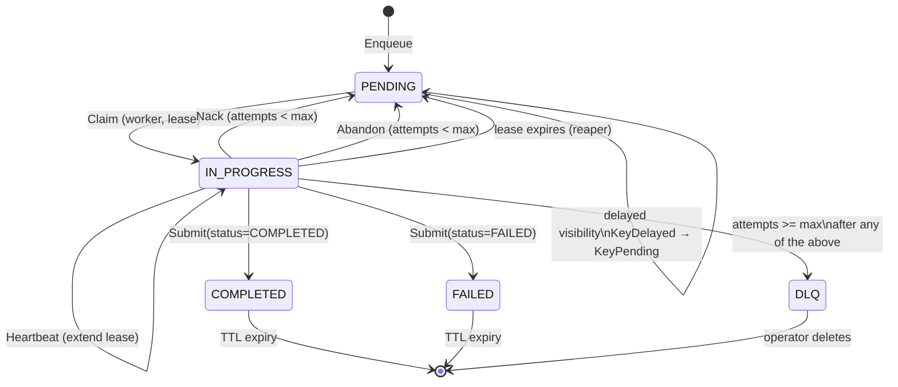

# Tasks and Results

Every entity that lives inside codeQ for longer than a single RPC is either a task or a result record. The task is the work to be done and the bookkeeping around it; the result is the outcome of running the task to completion or failure. The two records are written and read together for the entire lifecycle, but they are distinct data structures with different ownership and retention rules. This page walks through both, field by field, and traces the two code paths that change them: scheduler `CreateTask` for new work and results `Submit` for terminal updates.

## The Task struct

The on-disk representation of a task is the `domain.Task` struct in `pkg/domain/task.go`. The same struct travels over the wire on every RPC that returns a task and over Pebble as the value stored under `codeq/tasks/<id>`. The serialization is JSON, encoded with bytedance/sonic on the hot path. There is no schema versioning; the struct grows by appending fields with `omitempty` so old records remain readable.

The fields are these, in declaration order:

`ID` is a uuid v4 string. It is the routing key for the sharded repository — `shardOf(id)` in `internal/repository/pebble/sharded_task_repository.go:61-65` runs FNV-1a 64-bit and modulos by shard count to pick which Pebble instance owns this task. Once the ID is chosen, every key derived from it (task body, pending index, inprog index, delayed score, dead-letter tombstone, TTL index) hashes to the same shard. That is the atomic invariant the [Sharding](Concepts-Sharding) page explains in detail.

`Command` is a string-typed enum that names the kind of work this task represents. The codebase ships with two example commands, `GENERATE_MASTER` and `GENERATE_CREATIVE`, but the command is otherwise opaque to codeQ. It exists for one reason: it segments the queue. Two tasks with different commands sit in different FIFO buckets and are claimed independently. A worker that subscribes only to `GENERATE_CREATIVE` never sees `GENERATE_MASTER`, because the Claim path scans only the prefix `codeq/q/generate_creative/...`. This is how codeQ supports multiple kinds of work in one cluster without giving any single command's volume control over latency for the others.

`Payload` is an opaque JSON string. codeQ does not parse it, validate it, or enforce a schema; the worker is responsible for interpreting it. The reason it is a string rather than a `map[string]any` is to avoid double-marshalling — the producer encodes once, the server stores the bytes, the worker decodes once on the consumer side. The producer and worker share knowledge of the payload schema; codeQ does not.

`Priority` is an integer between 0 and 9 inclusive, normalized via `normalizePriority` on the enqueue path. Higher values are claimed first. The priority is encoded as a single big-endian byte in the pending key, so the Pebble iterator returns higher priority before lower priority by simple key ordering. Tasks within the same priority are FIFO by enqueue sequence — see the [Queue Model](Concepts-Queue-Model) page for the key layout.

`Webhook` is an optional URL that codeQ will POST to on terminal status, if non-empty. It is validated at enqueue time to be a syntactically valid HTTP or HTTPS URL with a non-empty host. The webhook is a convenience for producers that prefer push over poll; the result is durable in either case, so missed webhooks are not data loss.

`TraceParent` and `TraceState` carry W3C trace context. When tracing is enabled in the server config, codeQ captures the producer's trace context on Enqueue and re-emits it on every span that touches the task — claim, heartbeat, submit, webhook fire. This is how a request that originated in the producer can be followed end-to-end into the worker. See [Observability Tracing](Observability-Tracing) for the propagation rules.

`Status` is the lifecycle state: `PENDING`, `IN_PROGRESS`, `COMPLETED`, or `FAILED`. There is no `ABANDONED` status value at the domain level; abandonment is a transition (worker calls `Abandon`) that returns the task to PENDING with an incremented attempt counter, eventually crossing the `MaxAttempts` threshold and becoming a dead-letter entry. The dead-letter set is a location, not a status — see the next section on the state diagram.

`LastKnownLocation` is a hint that records the index a task was last known to sit in: `PENDING_LIST`, `DELAYED_ZSET`, `INPROG_SET`, `DLQ_SET`, or `NONE`. It is not authoritative — the truth is in the keys present in Pebble — but it lets admin cleanup paths target a single index instead of scanning everything. The field name carries over from the original Redis backend where the analogous fields had identical semantics.

`WorkerID` is the identity of the worker that currently holds the lease. Empty when the task is PENDING. Set during Claim, cleared on Submit and Abandon, replaced on lease theft. The ownership check on Submit (`task.WorkerID != "" && req.WorkerID != "" && task.WorkerID != req.WorkerID`) is what prevents a slow worker from clobbering a result submitted by a worker that legitimately re-claimed the task after the lease expired.

`LeaseUntil` is an RFC3339 timestamp recording when the lease expires. The in-memory `leaseTable` (see [Leases and Ownership](Concepts-Leases-And-Ownership)) is the operational source of truth; `LeaseUntil` in the task body is the recovery copy. On `Open()`, the repository scans `KeyInprog` (`internal/repository/pebble/task_repository.go:167-171`) and rebuilds the in-memory table from each task's `LeaseUntil`.

`Attempts` and `MaxAttempts` together drive the retry-to-DLQ decision. Attempts is incremented every time the task transitions from IN_PROGRESS back to PENDING because of a Nack, an Abandon, or a lease expiry. When the incremented value would equal or exceed `MaxAttempts`, the task is moved to the dead-letter set instead of being requeued. `MaxAttempts` defaults from the scheduler's `maxAttemptsDefault` config and can be overridden per-task on Enqueue.

`Error` is the last failure message, set when a worker submits with `Status=FAILED` or when codeQ moves a task to the DLQ. It is not cleared on retry — successive failures overwrite it.

`ResultKey` is the key under which the corresponding `ResultRecord` lives in Pebble. It is `codeq/results/<id>` in practice and is set when the result is saved. Producers do not need this field; `GetResult(taskID)` resolves the result by task ID directly.

`TenantID` is the JWT-derived tenant claim, used to namespace every queue index. Empty string maps to the literal `_` segment in keys (so the key parser can split cleanly on `/`). The [Multi-Tenancy](Concepts-Multi-Tenancy) page explains how this field interacts with auth and rate limiting.

`CreatedAt` and `UpdatedAt` are server-side timestamps in the configured timezone. `CreatedAt` is immutable after Enqueue; `UpdatedAt` is rewritten on every state transition. Both are used by latency metrics (`TaskProcessingLatencySeconds = CompletedAt - CreatedAt`).

## Result vs ResultRecord

There are two result-shaped types and the distinction matters. `SubmitResultRequest` is what the worker sends on the Submit RPC. `ResultRecord` is what codeQ stores and what the producer reads back via GetResult. Both are defined in `pkg/domain/result.go`.

`SubmitResultRequest` carries the worker's identity (`WorkerID`), the terminal status (`COMPLETED` or `FAILED`), a result map for the success case, an error string for the failure case, and an artifacts list. Artifacts are an upload-on-submit convenience: the worker can either pass `URL` (already uploaded) or `ContentBase64`+`ContentType` (let codeQ upload via the configured provider). The server validates the request — for COMPLETED, `result` must be non-nil; for FAILED, `error` must be non-empty — and rejects anything else.

`ResultRecord` is the durable form: task ID, status, result map, error string, list of `ArtifactOut` records (each with a name and a URL — codeQ doesn't store artifact bytes inline), and a completion timestamp. It is written once and never updated. When a producer reads a result, they get the entire record; there is no partial-update semantics.

The artifact split between `ArtifactIn` (upload-on-submit) and `ArtifactOut` (stored URL) keeps the durable record small. Even if a worker submits 50 MB of artifact bytes, the `ResultRecord` in Pebble contains only the URLs that the uploader returned. The artifact bytes live in object storage, not in the KV.

## The lifecycle state diagram

The diagram shows what the implementation actually does. PENDING is the entry state. A successful Claim transitions to IN_PROGRESS atomically — the same Pebble batch that deletes the pending key writes the inprog key, the lease entry, and the updated task body. Heartbeats extend the lease without changing the status. The three paths out of IN_PROGRESS that are not terminal — Nack, Abandon, lease expiry — all converge on "requeue or DLQ", with the choice driven by the attempt counter.

The two terminal statuses, COMPLETED and FAILED, sit in the task table until the TTL reaper deletes them. The default retention is 24 hours, after which the task body, the result record, and any indexes pointing at the task are removed from Pebble. Producers should read results before then or persist them externally.

The DLQ tombstone is a third "rest" state, but it isn't a status — it's a separate index (`codeq/q/<cmd>/<tenant>/dlq/<id>`). The task status remains whatever it was when DLQ-ing happened (typically FAILED). Operators see DLQ entries via the admin queue stats and can choose to replay them via a manual admin call.

## Trace: CreateTask path

The producer-facing entry point is the scheduler service. Following `internal/services/scheduler_service.go:94-143`, the flow is:

1. Open an OTel span `codeq.task.create` and attach attributes for command, priority, webhook presence, idempotency key presence, and tenant ID. The span lives for the duration of the call; any error sets its status accordingly.
2. Validate the command is non-empty after trimming. Empty commands are rejected because they would map to an empty queue prefix, which is the bucket reserved for legacy data.
3. Validate the webhook URL if one is set. The check is structural — scheme must be http or https, host must be non-empty. codeQ does not probe the webhook at enqueue time; broken URLs surface on first delivery attempt.
4. Default `maxAttempts` from the service-level setting if the caller passed zero.
5. Resolve visibility. If `runAt` is non-zero, use it. Otherwise, if `delaySeconds > 0`, compute `now + delaySeconds`. A zero `visibleAt` means "available immediately", which is the common case.
6. Call `repo.EnqueueWithReady`, which returns the persisted task and a `ready` boolean. The boolean is true when the insert transitioned the pending bucket from empty to non-empty, which is the signal the notifier uses to wake a sleeping worker.
7. Annotate the span with the resolved task ID. Fire the queue-ready notification if a notifier is registered and `ready` is true. Return the task to the caller.

Inside `EnqueueWithReady`, the sharded repository picks the shard via `shardOf(id)` and delegates to that shard's `EnqueueWithID`. The shard repository builds a single Pebble batch with up to four writes: the task body under `KeyTask(id)`, the TTL index entry under `KeyTTLIndex(expireUnix, id)`, either the pending key `KeyPending(cmd, tenant, prio, seq, id)` or the delayed key `KeyDelayed(cmd, tenant, scoreUnix, id)`, and optionally the idempotency map `KeyIdempo(idempotencyKey) → id`. The batch is committed in one call to the group-commit coalescer; on success, a non-blocking publish on the per-queue fast-path channel wakes any worker spinning in Claim. The whole transaction is one Pebble write barrier; either every key lands or none do.

## Trace: Submit path

The worker-facing entry point for results is `internal/services/results_service.go:200-300` for batches and lines 43-187 for the single-task variant. The single-task path:

1. Fetch the task via `repo.GetTask(taskID)`. If not found, return `task not found` to the worker. There is no other state-recovery here; if the task isn't in Pebble, it has been DLQ-deleted or TTL-reaped and the worker is too late.
2. Compose the trace context. The task's stored `TraceParent` and `TraceState` are used to start a `codeq.task.submit_result` span as a remote child of the producer's trace. This is what links worker-side spans back to the original request.
3. Run the ownership check at line 60: `if task.WorkerID != "" && req.WorkerID != "" && task.WorkerID != req.WorkerID { return not-owner }`. The guard rejects late submissions from workers whose lease has been stolen. Note the conjunction: if either side's WorkerID is empty (e.g. a worker that doesn't bother passing its ID, which is permitted), the check is skipped. The same check appears in the batch path at `internal/services/results_service.go:248`.
4. Verify the task status is `IN_PROGRESS`. Any other status means the task has already reached a terminal state (a parallel Submit won the race, or it was DLQ-d) and this Submit should not overwrite it.
5. Handle artifacts. Already-uploaded artifacts (`URL` set) pass through unchanged. New artifacts (`ContentBase64` set) are decoded, uploaded via the configured provider with bounded concurrency (semaphore of 5), and their returned URLs are collected into the outbound list. Any upload error fails the entire submit.
6. Validate the status-specific fields. COMPLETED requires a non-nil result map; FAILED requires a non-empty error string. Anything else returns `invalid status`.
7. Build the `ResultRecord` and persist it via `repo.SaveResult(rec, cmd, tenantID)`. The save lives in the result repository, which is the sharded wrapper over `ResultRepository` implementations.
8. Call `repo.UpdateTaskOnComplete(taskID, cmd, tenantID, status, errorMsg)`. This is the durable side of the lifecycle transition — it writes the new task body, removes the inprog key, clears the lease, and updates the location hint, all in one Pebble batch.
9. Record metrics. `TaskCompletedTotal` increments with labels for command and status; `TaskProcessingLatencySeconds` observes `CompletedAt - CreatedAt` if the duration is non-negative.
10. Fire the result-callback service if one is wired. The callback is the webhook dispatcher; it runs in a context that survives the original request cancellation so a producer disconnect doesn't drop the notification.

The batch variant in `BatchSubmit` runs the same validation per item but groups the SaveResult and the UpdateTaskOnComplete calls so the Pebble pipeline can issue one commit per shard rather than one per task. The ownership check happens individually because workers can submit results for different tasks they own in one batch; the failure of one item is recorded in the response but does not abort the others. See [I/O Group Commit Coalescer](IO-Group-Commit-Coalescer) for how the per-shard commit pipeline turns N independent batch items into one fsync.

## Reading results back

Producers call `GetResult(taskID)` and receive either a `(ResultRecord, Task)` pair or one of two errors: `task not found` or `result not found`. The first means the task ID is unknown — either the producer fabricated it, or it has been TTL-reaped. The second means the task exists but is still PENDING or IN_PROGRESS; the producer should retry. There is no streaming-result API in the current data model; results are written once at terminal status and read by polling.

The `Task` returned alongside the `ResultRecord` is the same struct that the producer received on Enqueue, but updated. In particular, `Status`, `Attempts`, `Error`, and `UpdatedAt` reflect the terminal state. This is enough information for the producer to distinguish a result that came through cleanly from one that took five retries before succeeding.
