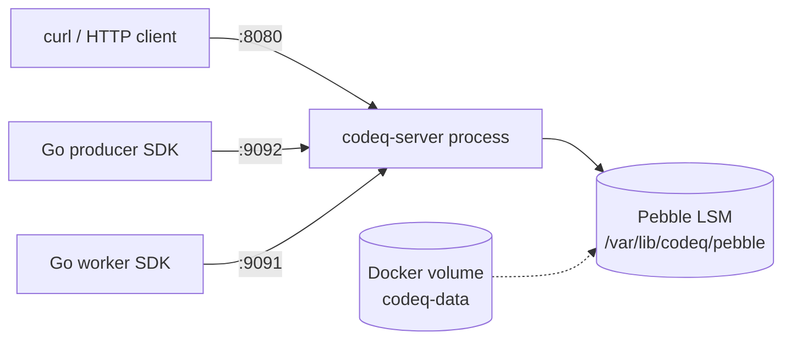

# Get Started: Run In Docker

A single Docker container is the smallest deployment that survives a host restart cleanly. The image carries the server binary and nothing else; persistence lives in a volume you mount; configuration is plain environment variables. This page walks through pulling the image, running the container, exposing the relevant ports, and submitting a task end to end.

This is the deployment to pick when you want codeQ on a single VM, in a CI environment, or as part of a docker-compose stack that is not the three-node raft cluster (covered in [Run With Docker Compose](Get-Started-Run-With-Docker-Compose)). The container does not include any external dependency. Pebble is embedded, auth is configured inline, and there is no second process to keep running.

## 1. Pull the image

The image is published to GitHub Container Registry under the codeQ organization. The `latest` tag points at the most recent main-branch build; pinning to a version tag is recommended for production.

```bash
docker pull ghcr.io/osvaldoandrade/codeq-service:latest
```

The image is built from the repository's top-level `Dockerfile`. The build is a multi-stage Go build with the binary copied into a `gcr.io/distroless/static-debian12:nonroot` final stage — no shell, no package manager, no init system. The entrypoint is `/app/codeq-server`, which is the binary produced from `./cmd/server`. The published artifact is approximately 20 MB.

The Dockerfile exposes only `:8080` by default. The gRPC stream ports (`:9091` worker, `:9092` producer) and the cluster control plane port (`:9090`) are opened by the binary based on configuration; if you want them externally reachable you publish them at `docker run` time.

## 2. Run it

The smallest useful command opens HTTP on `:8080`, configures static dev tokens for producers and workers, and mounts a named volume at `/var/lib/codeq/pebble` for persistence. Without the volume, Pebble writes into the container's writable layer, which evaporates when the container is removed. The environment is large enough that it is cleaner to keep it in a file:

```bash
cat > codeq.env <<'EOF'
PORT=8080
LOG_LEVEL=info
LOG_FORMAT=json
PERSISTENCE_PROVIDER=pebble
PERSISTENCE_CONFIG={"path":"/var/lib/codeq/pebble"}
PRODUCER_AUTH_PROVIDER=static
PRODUCER_AUTH_CONFIG={"token":"dev-token","subject":"producer-dev","raw":{"role":"ADMIN","tenantId":"dev-tenant"}}
WORKER_AUTH_PROVIDER=static
WORKER_AUTH_CONFIG={"token":"dev-token","subject":"worker-dev","scopes":["codeq:claim","codeq:heartbeat","codeq:abandon","codeq:nack","codeq:result","codeq:subscribe"],"eventTypes":["*"],"raw":{"tenantId":"dev-tenant"}}
EOF
```

Then start the container against that env file with a single bind volume for Pebble:

```bash
docker run -d --name codeq -p 8080:8080 --env-file codeq.env -v codeq-data:/var/lib/codeq/pebble ghcr.io/osvaldoandrade/codeq-service:latest
```

The container starts in roughly one second. Confirm with `docker logs codeq`: you should see an HTTP listener on `:8080` and Pebble opened at `/var/lib/codeq/pebble`. Hit the metrics endpoint to confirm the server is alive:

```bash
curl -sSf http://localhost:8080/metrics | head -5
```

The `/metrics` route is exposed by `pkg/app/url_mappings.go:12` and is unauthenticated; it returns the Prometheus-format counters, histograms, and gauges documented in [Metrics](Observability-Metrics).

## 3. Open the stream ports

Most production traffic moves over the gRPC streams, not HTTP. Two environment variables control whether those listeners come up: `WORKER_STREAM_ADDR` (defaults to empty, no listener) and `PRODUCER_STREAM_ADDR` (also defaults to empty). Set them to `:9091` and `:9092` respectively and publish those ports.

Add the two stream addresses to `codeq.env` (`WORKER_STREAM_ADDR=:9091` and `PRODUCER_STREAM_ADDR=:9092`), publish the matching host ports, and restart the container:

```bash
echo 'WORKER_STREAM_ADDR=:9091' >> codeq.env
echo 'PRODUCER_STREAM_ADDR=:9092' >> codeq.env
docker stop codeq && docker rm codeq
docker run -d --name codeq -p 8080:8080 -p 9091:9091 -p 9092:9092 --env-file codeq.env -v codeq-data:/var/lib/codeq/pebble ghcr.io/osvaldoandrade/codeq-service:latest
```

The three published ports are the public surface. Everything else — pprof, internal metrics scrapes, raft TCP — stays inside the container in this single-node topology.

## 4. End-to-end smoke test

The same three-call dance as [Run Locally](Get-Started-Run-Locally), pointed at the container.

```bash
AUTH='Authorization: Bearer dev-token'
JSON='Content-Type: application/json'
TASK_ID=$(curl -s -X POST http://localhost:8080/v1/codeq/tasks -H "$AUTH" -H "$JSON" -d '{"command":"PROCESS_ORDER","payload":{"orderId":"42"},"priority":5}' | jq -r '.id')
echo "$TASK_ID"
curl -s -X POST http://localhost:8080/v1/codeq/tasks/claim -H "$AUTH" -H "$JSON" -d '{"commands":["PROCESS_ORDER"],"leaseSeconds":60,"waitSeconds":5}' | jq
curl -s -X POST "http://localhost:8080/v1/codeq/tasks/${TASK_ID}/result" -H "$AUTH" -H "$JSON" -d '{"status":"COMPLETED","result":{"ok":true}}'
curl -s "http://localhost:8080/v1/codeq/tasks/${TASK_ID}" -H "$AUTH" | jq '.status'
```

The last line should print `"COMPLETED"`. Restart the container with `docker restart codeq` and re-run the GET — the task is still there because the Pebble store is on the named volume, not the writable layer. That is the durability story in one line.

## 5. What runs in the container



One process. Three TCP listeners. One on-disk store. The diagram is the topology — there is no second container, no sidecar, no companion database. Anything you can do with codeQ on this single container, you can do across a three-node raft cluster (see [Run With Docker Compose](Get-Started-Run-With-Docker-Compose)), with the only difference being that the cluster fanouts a single write across three FSMs.

## 6. Environment variables

The server reads its configuration first from a YAML file referenced by `CODEQ_CONFIG_PATH` (optional), then applies environment variable overrides. The full list lives in `pkg/config/config.go:200` (`applyEnvAndDefaults`). For a single container the variables you care about are operational rather than tuning.

The table below covers the ones used in the run commands on this page; the full set is in [Tuning Knobs](Performance-Tuning-Knobs).

| Variable | Purpose | Example |
| --- | --- | --- |
| `PORT` | HTTP listen port | `8080` |
| `PERSISTENCE_PROVIDER` | Storage engine | `pebble` |
| `PERSISTENCE_CONFIG` | Engine-specific JSON config | `{"path":"/var/lib/codeq/pebble"}` |
| `WORKER_STREAM_ADDR` | Worker gRPC stream listen address | `:9091` |
| `PRODUCER_STREAM_ADDR` | Producer gRPC stream listen address | `:9092` |

`PRODUCER_AUTH_PROVIDER` and `WORKER_AUTH_PROVIDER` switch between the `static` token validator (single inline token, for development) and the `jwks` validator (JWT verified against a JWKS URL, for real environments). The static auth configuration is a JSON blob with a token, a subject, and optionally a `raw` map that ends up in the request's tenant context. The JWKS case is documented in [Authentication and Authorization](Concepts-Authentication-And-Authorization).

`LOG_LEVEL` accepts the standard levels (`debug`, `info`, `warn`, `error`). `LOG_FORMAT` is `text` or `json`; `json` is what the cluster compose template defaults to and what you want for any log shipper.

## 7. Persistence and durability

Pebble is an LSM tree. Writes go to a write-ahead log (WAL), then into the memtable; compaction periodically merges memtables into sorted-string tables on disk. The store is durable up to whatever `fsync` discipline you configure. The default codeQ binary commits without an `fsync` per write (`fsyncOnCommit: false`) because the group-commit coalescer batches WAL flushes — see [Group-Commit Coalescer](IO-Group-Commit-Coalescer) for the details, and [Performance Tuning Knobs](Performance-Tuning-Knobs) for the tradeoff between durability and throughput.

Concretely: with `fsyncOnCommit: false`, a host crash can lose the last few hundred milliseconds of writes. With `fsyncOnCommit: true`, a crash loses nothing — but per-write latency grows by however long an `fsync` to the underlying disk takes. For a single Docker container backing a single application, the default is usually fine. For a single Docker container holding state for a critical workflow, flip it to true.

The volume mount in the run command is `-v codeq-data:/var/lib/codeq/pebble`. Docker creates the volume on first use. Bind-mounting a host path works too — `-v /srv/codeq:/var/lib/codeq/pebble` — and is friendlier when you want to inspect the on-disk layout. The image's `Dockerfile` also creates `/var/lib/codeq/artifacts/` for the local artifacts directory (`LOCAL_ARTIFACTS_DIR`); mount that too if you submit large result bodies.

```bash
docker run ... -v codeq-data:/var/lib/codeq/pebble -v codeq-artifacts:/var/lib/codeq/artifacts ...
```

## 8. Resource sizing

A single codeQ container with one worker stream and one producer stream runs comfortably in 256 MB of RAM at moderate throughput. Pebble's memtable size, block cache size, and write-amplification overhead grow with task size and rate; the defaults are tuned for a 4 GB memory budget. A typical small VM with 2 vCPUs and 2 GB of RAM can sustain tens of thousands of tasks per second on a single instance, as shown in [Single-Node Throughput](Performance-Single-Node-Throughput).

If you are running CI or development workloads, set `--memory 512m` and forget about it. If you are running a real workload, observe `process_resident_memory_bytes` and `go_goroutines` from `/metrics` and size from there.

## 9. Restart, upgrade, and downtime

`docker restart codeq` produces a few-hundred-millisecond pause. The server replays the Pebble WAL, scans `KeyInprog` to reconstruct lease state, and starts serving. In-flight requests fail with connection reset; a client that retries idempotently (the Go SDK does) sees a hiccup at worst.

Upgrades follow the same pattern. `docker pull`, `docker stop`, `docker rm`, `docker run` with the new image — the named volume is preserved, the new binary opens the existing Pebble store, and the queue resumes from where the previous version stopped. Cross-version Pebble compatibility is part of codeQ's release contract; the on-disk format does not break across minor versions.

The single-container deployment has no leader election, no peer transport, and no automatic failover. If the host dies, the queue stops until you bring the container up somewhere else with the volume re-attached. That is the tradeoff for the smallest footprint. For high availability, the three-node raft cluster covered in [Run With Docker Compose](Get-Started-Run-With-Docker-Compose) replicates every write across three FSMs and survives one node failure with no operator intervention.

## 10. What this does not give you

A single Docker container is a complete codeQ deployment but not a complete production environment. Three things this page does not cover:

The first is logs. The container writes JSON to stdout when `LOG_FORMAT=json`; in a real environment you ship that to your log aggregator. Docker's `--log-driver` flag handles the most common cases.

The second is metrics. `/metrics` is unauthenticated and ready to scrape. A Prometheus running on the same network points at `http://codeq:8080/metrics` and ingests everything. The dashboard is in [Metrics](Observability-Metrics).

The third is TLS. The container speaks plain HTTP and plain gRPC. In production you front it with a reverse proxy (Envoy, Caddy, nginx) that terminates TLS and forwards. The codeQ binary does not handle certificates itself; that responsibility is delegated by design.

## 11. Where to go next

If a single container is enough, you are done. Open [Observability Overview](Observability-Overview) and wire up the dashboards.

If you want HA, [Run With Docker Compose](Get-Started-Run-With-Docker-Compose) walks through the three-node raft template at `deploy/docker-compose/raft-cluster/compose.yaml`. Same image, three replicas, raft consensus on every write.

If you want a Kubernetes deployment, [Run In Kubernetes](Get-Started-Run-In-Kubernetes) covers the Helm chart at `helm/codeq/`. The chart wraps the same image with a Service, a PVC, and a ConfigMap.

If you want to know what the container actually does on each request, [Concepts Overview](Concepts-Overview) is the entry into the architecture chapter.
