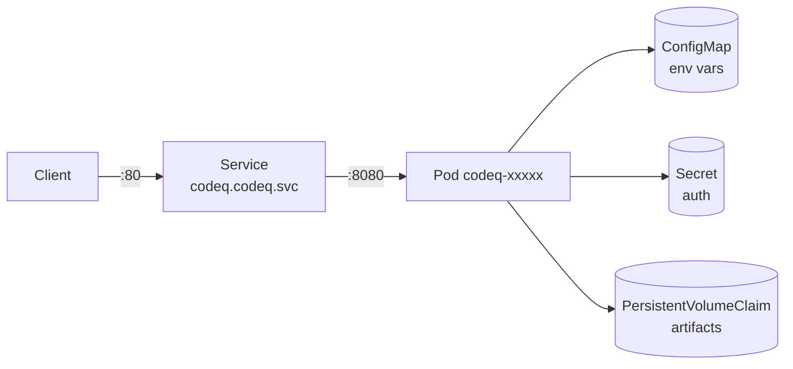

# Get Started: Run In Kubernetes

A Kubernetes Deployment running the codeQ image is the same shape as the Docker container in [Run In Docker](Get-Started-Run-In-Docker), wrapped in a Service, a ConfigMap, and a PersistentVolumeClaim. The repository ships a Helm chart at `helm/codeq/` that does the wiring. This page walks through installing it, verifying the Pod is healthy, port-forwarding to test, and the values that matter for a real environment.

The chart targets two topologies. A single-replica Deployment with a PVC is the Kubernetes-native equivalent of one Docker container; that is what `helm install` gives you out of the box. A multi-replica cluster — with three Pods participating in raft — requires `replicaCount: 3` plus the same `RAFT_*` environment variables that drive the compose template, surfaced through `extraEnv`. This page covers the single-replica install in detail and points at the values you need to flip for the cluster path.

## 1. The chart at a glance

The chart files live at `helm/codeq/` and have the following structure:

```
helm/codeq/
  Chart.yaml          # apiVersion, version, appVersion
  values.yaml         # default values
  README.md           # the chart's own short docs
  templates/
    deployment.yaml
    service.yaml
    configmap.yaml
    secret.yaml
    pvc.yaml
    hpa.yaml
    ingress.yaml
    serviceaccount.yaml
    _helpers.tpl
    NOTES.txt
```

The `Chart.yaml` declares the chart name `codeq`, version `0.2.0`, app version `0.1.0`. The image defaults to `ghcr.io/osvaldoandrade/codeq-service:0.1.0` — the same image you pulled in the Docker walkthrough, pinned to a release tag rather than `latest`. Override `image.tag` in your values to follow a different release.

The Deployment runs the codeQ container with the ConfigMap mounted as environment variables and the optional Secret mounted likewise. The Service exposes port 80 (`service.port`) on top of the container's `:8080` (`service.targetPort`). The PVC is conditional on `persistence.artifacts.enabled` for the artifacts directory; the Pebble store path is set via `config` keys that flow into env vars.

Read `helm/codeq/values.yaml` once before installing — the inline keys are the API the chart exposes to you, and they document themselves with a default.

## 2. Install

If you do not have a Kubernetes cluster handy, `kind` or `minikube` gives you one in two commands:

```bash
kind create cluster --name codeq
kubectl cluster-info
```

Clone the repo and install the chart from the local path:

```bash
git clone https://github.com/osvaldoandrade/codeq
cd codeq
helm install codeq ./helm/codeq \
  --namespace codeq --create-namespace
```

That is the smallest viable install: default image, single replica, ClusterIP service, no ingress, no autoscaling. Verify the Pod is running:

```bash
kubectl -n codeq get pods
kubectl -n codeq get svc
```

You should see one Pod with two ready containers transitioning to `Running` and one Service of type `ClusterIP` exposing port 80. The Pod takes a couple of seconds to start; the image pull dominates first-time latency.

## 3. Port-forward and smoke test

The default Service is `ClusterIP` — not externally reachable. Port-forward to talk to it from your laptop:

```bash
kubectl -n codeq port-forward svc/codeq 8080:80
```

In another terminal, the same three calls as every other Get Started page:

```bash
AUTH='Authorization: Bearer dev-token'
JSON='Content-Type: application/json'
TASK_ID=$(curl -s -X POST http://localhost:8080/v1/codeq/tasks -H "$AUTH" -H "$JSON" -d '{"command":"PROCESS_ORDER","payload":{"orderId":"42"},"priority":5}' | jq -r '.id')
echo "$TASK_ID"
curl -s -X POST http://localhost:8080/v1/codeq/tasks/claim -H "$AUTH" -H "$JSON" -d '{"commands":["PROCESS_ORDER"],"leaseSeconds":60,"waitSeconds":5}' | jq
curl -s -X POST "http://localhost:8080/v1/codeq/tasks/${TASK_ID}/result" -H "$AUTH" -H "$JSON" -d '{"status":"COMPLETED","result":{"ok":true}}'
curl -s "http://localhost:8080/v1/codeq/tasks/${TASK_ID}" -H "$AUTH" | jq '.status'
```

If the last line prints `"COMPLETED"`, the install is working. The auth token here is `dev-token` because the default chart values do not configure real authentication; for a real install you must override the auth provider (see "Production values" below).

## 4. What the chart wires



One Pod with the codeQ container. One Service routing traffic on port 80 to the container's `:8080`. A ConfigMap holding the non-secret configuration. An optional Secret carrying `webhookHmacSecret` and any auth secrets. An optional PersistentVolumeClaim for the local artifacts directory.

The Pebble store path is set via the `config` values in `values.yaml`. By default the chart's `values.yaml` does not enable a PVC for the Pebble store itself — for a single-replica development install that is acceptable because the Pod uses the node's local disk. For a real install you must add a PVC for Pebble; see the "Production values" section.

## 5. Values you should know about

The `values.yaml` schema is large because the chart wraps many knobs. The values that matter for any install are below; the rest are documented inline in `helm/codeq/values.yaml`.

The `image` block sets the container image. Override `image.tag` to follow a specific release.

```yaml
image:
  repository: ghcr.io/osvaldoandrade/codeq-service
  tag: "0.1.0"
  pullPolicy: IfNotPresent
```

`replicaCount` controls how many Pods the Deployment runs. `1` for a single-instance install; `3` for the raft-cluster path with the right environment overrides.

`service` controls the Service shape. `type: ClusterIP` is the default; switch to `LoadBalancer` or front it with an Ingress (`ingress.enabled: true`) for external traffic.

`config` controls the application configuration that flows into the Pod as environment variables via the ConfigMap. Keys mirror the YAML config schema in `pkg/config/config.go`. The two you almost certainly want to set explicitly are the auth provider URLs:

```yaml
config:
  port: 8080
  logLevel: info
  logFormat: json
  workerJwksUrl: "https://issuer.example.com/.well-known/jwks.json"
  workerAudience: "codeq-worker"
  workerIssuer: "https://issuer.example.com"
```

`secrets.enabled: true` provisions a Kubernetes Secret with the named fields. `secrets.webhookHmacSecret` is the HMAC secret used to sign result webhooks; if you use the webhook delivery feature, set this.

```yaml
secrets:
  enabled: true
  webhookHmacSecret: "redacted-secret-here"
```

`autoscaling.enabled` flips on a HorizontalPodAutoscaler. Useful when the workload is unevenly distributed across the day. The default targets 80% CPU.

`ingress.enabled` switches on an Ingress object. Configure `ingress.className` for your controller (`nginx`, `traefik`, etc.) and `ingress.hosts` for the hostnames.

The chart's `values.yaml` carries legacy keys from earlier versions of codeQ that referenced an external store. Recent codeQ releases position Pebble as the sole storage engine — every other path is deprecated. The chart will be refactored to surface Pebble as a first-class top-level block in an upcoming release. Until then, configure Pebble through the `extraEnv` escape hatch and disable any legacy substructure:

```yaml
extraEnv:
  - name: PERSISTENCE_PROVIDER
    value: pebble
  - name: PERSISTENCE_CONFIG
    value: '{"path":"/var/lib/codeq/pebble"}'
```

## 6. Production values

A reasonable production install pins the image, enables Pebble persistence with a PVC, configures real auth, and turns on TLS via an Ingress.

```yaml
# values-prod.yaml
image:
  repository: ghcr.io/osvaldoandrade/codeq-service
  tag: "0.1.0"
  pullPolicy: IfNotPresent

replicaCount: 1

resources:
  requests:
    cpu: 500m
    memory: 1Gi
  limits:
    cpu: 2000m
    memory: 4Gi

service:
  type: ClusterIP
  port: 80
  targetPort: 8080

config:
  port: 8080
  logLevel: info
  logFormat: json
  defaultLeaseSeconds: 300
  workerJwksUrl: "https://issuer.example.com/.well-known/jwks.json"
  workerAudience: "codeq-worker"
  workerIssuer: "https://issuer.example.com"
  identityServiceUrl: "https://issuer.example.com"

secrets:
  enabled: true
  webhookHmacSecret: "..."

extraEnv:
  - name: PERSISTENCE_PROVIDER
    value: pebble
  - name: PERSISTENCE_CONFIG
    value: '{"path":"/var/lib/codeq/pebble"}'
  - name: PRODUCER_AUTH_PROVIDER
    value: jwks
  - name: WORKER_AUTH_PROVIDER
    value: jwks

extraVolumes:
  - name: pebble
    persistentVolumeClaim:
      claimName: codeq-pebble

extraVolumeMounts:
  - name: pebble
    mountPath: /var/lib/codeq/pebble

ingress:
  enabled: true
  className: nginx
  annotations:
    cert-manager.io/cluster-issuer: letsencrypt-prod
  hosts:
    - host: codeq.example.com
      paths:
        - path: /v1/codeq
          pathType: Prefix
  tls:
    - secretName: codeq-tls
      hosts:
        - codeq.example.com
```

The PVC `codeq-pebble` is provisioned separately (`kubectl apply -f pvc.yaml`) — the chart's built-in PVC template covers the artifacts directory; the Pebble directory uses `extraVolumes` so you keep control over the StorageClass, access mode, and size.

Install with the values file:

```bash
helm upgrade --install codeq ./helm/codeq \
  -f values-prod.yaml \
  --namespace codeq --create-namespace
```

`upgrade --install` is idempotent — same command for first install and subsequent upgrades.

## 7. A clustered install

The single-replica install gives durability against Pod restarts but not against node loss. For high availability you want raft. The chart does not (yet) ship a first-class raft block; you assemble it via `extraEnv`. Set `replicaCount: 3`, give each Pod a stable identity, and surface the `RAFT_*` variables.

For a stable identity you generally migrate from a `Deployment` to a `StatefulSet` so each Pod has a predictable hostname (`codeq-0`, `codeq-1`, `codeq-2`) and a per-Pod PVC. The codeQ chart currently ships a Deployment; a StatefulSet-shaped chart is on the roadmap. For the moment, the supported path to a clustered Kubernetes install is to write a small companion chart (or raw manifests) that uses the same image with the raft envs from the [Run With Docker Compose](Get-Started-Run-With-Docker-Compose) page. The compose file is the canonical reference for the environment variables.

In a Kubernetes raft cluster the per-Pod stable hostnames go into `RAFT_PEERS` and `RAFT_PEER_HTTP_ADDRS`:

```
RAFT_PEERS=codeq-0=codeq-0.codeq:7000,codeq-1=codeq-1.codeq:7000,codeq-2=codeq-2.codeq:7000
RAFT_PEER_HTTP_ADDRS=codeq-0=http://codeq-0.codeq:8080,codeq-1=http://codeq-1.codeq:8080,codeq-2=http://codeq-2.codeq:8080
RAFT_SELF_ID=$(hostname)
RAFT_BIND_ADDR=:7000
RAFT_ENABLED=true
RAFT_MUX_ENABLED=true
RAFT_BOOTSTRAP=true # only on codeq-0
```

The headless Service (`clusterIP: None`) backing the StatefulSet gives the `*.codeq` DNS that the peer list relies on.

## 8. Health checks

The Deployment in the chart wires both a readiness probe and a liveness probe against `/metrics` (or a dedicated `/healthz` if your version of the chart includes one — check `helm/codeq/templates/deployment.yaml`). The metrics endpoint is unauthenticated and returns 200 once the application has booted, which is a sufficient liveness signal.

For richer health, expose the Prometheus dashboard documented in [Metrics](Observability-Metrics) and alert on the application-specific signals (queue depth, lease-reap rate, raft commit latency).

## 9. Verify everything

The chart ships a short verification block in `templates/NOTES.txt` that prints after `helm install`. The relevant manual commands:

```bash
helm -n codeq status codeq
kubectl -n codeq get all
kubectl -n codeq logs deploy/codeq --tail=50
kubectl -n codeq port-forward svc/codeq 8080:80 &
curl -sSf http://localhost:8080/metrics | head
```

The Pod logs should show an HTTP listener on `:8080`, a Pebble open, and (in dev mode) static auth providers registered. The metrics endpoint should return Prometheus output.

## 10. Upgrade and rollback

`helm upgrade` re-renders the templates with your new values and updates the Deployment. Because the Pod has a single Pebble volume, an upgrade is effectively a serial restart: the new Pod starts, the old Pod terminates, and the volume re-attaches to the new one. Expect a few seconds of downtime per restart in the single-replica topology. In the clustered topology, raft handles the leader rotation transparently.

```bash
helm upgrade codeq ./helm/codeq -f values-prod.yaml -n codeq
helm rollback codeq 1 -n codeq      # roll back to revision 1
helm history codeq -n codeq         # see all revisions
```

Pebble's on-disk format is stable across minor codeQ versions — a chart upgrade that bumps the image tag does not require a state migration. Major version upgrades follow the release notes, which call out any migration step.

## 11. Where to go next

If the chart suits you, the next reading is operational. [Observability Overview](Observability-Overview) wires up Prometheus and the dashboards. [Tuning Knobs](Performance-Tuning-Knobs) covers the `config` values that affect throughput (lease seconds, backoff policy, requeue inspect limit). [Cost of HA](Performance-Cost-Of-HA) tells you what to budget if you move to the three-replica raft topology.

If you want a deeper view into what the application is doing inside the Pod, [Concepts Overview](Concepts-Overview) opens the architecture chapter. The path from `POST /v1/codeq/tasks` through the route handler, through the scheduler, through the persistence engine, through (optionally) raft, and back is documented page by page.

If you want a Go service that produces and consumes against this install, [Sous Functions Get Started](Sous-Functions-Get-Started) walks through the typed SDK — one stream per process, multiplexed sequence numbers, typed handlers.
