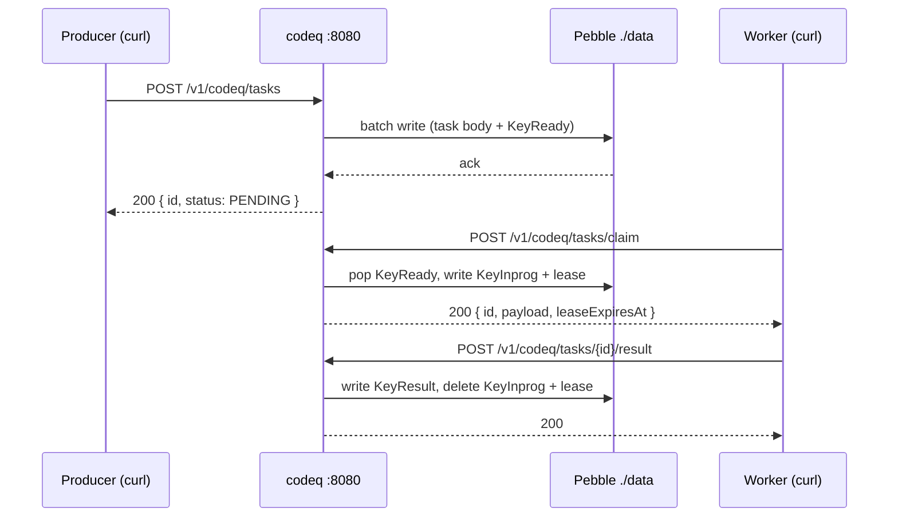

# Get Started: Run Locally

The fastest way to know whether codeQ does what you want is to run it on the machine you are reading this on. The goal of this page is the smallest possible loop: install, start a server, create a task, claim it, complete it, and read the result back. Ten minutes if you already have Go installed; fifteen if you do not.

codeQ on a laptop is a single binary listening on TCP `:8080` for HTTP, optionally `:9091` for the worker gRPC stream, and optionally `:9092` for the producer gRPC stream. There is no database to provision. The store is an embedded LSM tree (Pebble) that lives in a directory on disk, configured by `persistenceConfig.path`. Auth is a static bearer token configured inline. Everything below is one process; if you `kill` it, the queue stops; when you start it again, every task that was on disk is still there.

## 1. Install

There are three ways to put `codeq` on your `$PATH`. They all install the same binary; pick the one that fits your machine.

The first is the install script. It reads `CODEQ_INSTALL_MODE`, defaulting to `auto`, which downloads a pre-built binary from the latest GitHub Release matching your OS and architecture. If the download fails (or you set `CODEQ_INSTALL_MODE=source`), it falls back to cloning the repo and running `go build`. The full rule set is in `install.sh`.

```bash
curl -fsSL https://raw.githubusercontent.com/osvaldoandrade/codeq/main/install.sh | sh
```

The second is npm. The package `@osvaldoandrade/codeq` is a thin wrapper that downloads the same release binary via a `postinstall` script. The advantage is that it slots into a Node-centric toolchain; the binary is identical.

```bash
npm install -g @osvaldoandrade/codeq
```

The third is Go. `go install` builds the CLI from source against your local Go toolchain. It produces the `codeq` client binary at `$(go env GOBIN)/codeq` (or `$HOME/go/bin/codeq` if `GOBIN` is unset). Note that this path installs the CLI only — the server binary lives at `./cmd/server` and is what the Docker image runs. For a local server you can either clone the repo and `go run ./cmd/server`, or use one of the binary install paths above which also include the server.

```bash
go install github.com/osvaldoandrade/codeq/cmd/codeq@latest
```

After any of the three, confirm the binary is on `$PATH`.

```bash
codeq --help
```

## 2. Start the server

The server binary is at `cmd/server/main.go`. It reads its configuration from `CODEQ_CONFIG_PATH` (a YAML file) and falls back to environment variables and defaults when keys are missing. For a local run you want Pebble persistence and a static auth token — both are one-liners in the YAML.

Write the minimal config to a temp file. The block below configures the HTTP listener on `:8080`, opens a Pebble store under `./data/`, and registers a static dev token for both producers and workers. The auth blocks include the scopes a worker needs to claim, heartbeat, abandon, nack, submit results, and subscribe.

```bash
cat > /tmp/codeq.yml <<'EOF'
port: 8080
persistenceProvider: pebble
persistenceConfig:
  path: ./data
  fsyncOnCommit: false
producerAuthProvider: static
producerAuthConfig:
  token: dev-token
  subject: producer-dev
  raw:
    role: ADMIN
    tenantId: dev-tenant
workerAuthProvider: static
workerAuthConfig:
  token: dev-token
  subject: worker-dev
  scopes:
    - codeq:claim
    - codeq:heartbeat
    - codeq:abandon
    - codeq:nack
    - codeq:result
    - codeq:subscribe
  eventTypes: ["*"]
  raw:
    tenantId: dev-tenant
EOF
```

Start the server from a repo clone if you have one (`go run ./cmd/server`), or from the installed binary path:

```bash
git clone https://github.com/osvaldoandrade/codeq
cd codeq
CODEQ_CONFIG_PATH=/tmp/codeq.yml go run ./cmd/server
```

You should see log lines indicating an HTTP listener on `:8080`, a Pebble open at `./data/`, raft disabled (because `RAFT_ENABLED` is unset), and one shard (the single-shard default). Leave the process running; open a second terminal for the next steps.

If you want the producer and worker gRPC streams as well — and you will, eventually, because the streams are how the Go SDK talks to the server — add two lines to the config:

```yaml
workerStreamAddr: ":9091"
producerStreamAddr: ":9092"
```

The streams are an escape hatch around the HTTP middleware tax. Every claim, every heartbeat, every produce goes over one persistent stream per client, multiplexed by sequence number. See [Producer Stream](IO-Producer-Stream) and [Worker Stream](IO-Worker-Stream) for the wire protocol. For this page, the HTTP listener is enough.

## 3. Create a task

A task is a server-assigned UUID, a `command` string that decides which queue it lands in, an opaque JSON payload, an optional `priority`, and an optional `delaySeconds`. The producer does not pick the UUID; the server does, atomically with the write that puts the task in the queue.

```bash
AUTH='Authorization: Bearer dev-token'
JSON='Content-Type: application/json'
curl -s -X POST http://localhost:8080/v1/codeq/tasks -H "$AUTH" -H "$JSON" -d '{"command":"PROCESS_ORDER","payload":{"orderId":"42"},"priority":5}' | jq
```

The response carries the assigned id, the command name, the queue status (`PENDING`, meaning ready for claim), the priority, and a `createdAt` timestamp. Capture the id for the next steps.

```bash
TASK_ID=$(curl -s -X POST http://localhost:8080/v1/codeq/tasks -H "$AUTH" -H "$JSON" -d '{"command":"PROCESS_ORDER","payload":{"orderId":"42"},"priority":5}' | jq -r '.id')
echo "$TASK_ID"
```

Under the hood, the server wrote two keys to Pebble: one keyed by task id holding the task body, and one keyed by priority + arrival time pointing back to the body. The route through the handler is `controllers.NewCreateTaskController(...).Handle` from `pkg/app/url_mappings.go:19`.

## 4. Claim and complete

A worker claim is a single HTTP call that says "give me the next task whose `command` is one of these names, and grant me a lease for N seconds". The server moves the task from the ready set into the in-progress set, records the lease expiry, and returns the task body. If no task is ready and `waitSeconds > 0`, the server long-polls — it parks the request until a matching task arrives or the deadline passes.

```bash
CLAIMED=$(curl -s -X POST http://localhost:8080/v1/codeq/tasks/claim -H "$AUTH" -H "$JSON" -d '{"commands":["PROCESS_ORDER"],"leaseSeconds":60,"waitSeconds":5}')
echo "$CLAIMED" | jq
```

The response carries the task id, command, payload, the `IN_PROGRESS` status, and a `leaseExpiresAt` timestamp 60 seconds in the future. The lease is the deal: if the worker submits a result or heartbeats before it expires, the task stays in-progress; if the worker dies, the lease times out, the reaper returns the task to the queue, and the attempt counter increments by one. That is at-least-once delivery — codeQ never drops a claimed task, but it also makes no promise that a task runs exactly once.

Submit a result. The `status` field is one of `COMPLETED`, `FAILED`, `ABANDONED`, or `NACK`. `COMPLETED` is the happy path; the worker passes a JSON result body that the server stores under `KeyResult`.

```bash
curl -s -X POST "http://localhost:8080/v1/codeq/tasks/${TASK_ID}/result" -H "$AUTH" -H "$JSON" -d '{"status":"COMPLETED","result":{"ok":true,"processedAt":"now"}}'
```

Fetch the result back. The `GET /v1/codeq/tasks/{id}/result` endpoint supports a `waitSeconds` query parameter for long-polling — useful when the producer wants to block until the task is done.

```bash
curl -s "http://localhost:8080/v1/codeq/tasks/${TASK_ID}/result" -H "$AUTH" | jq
```

The status is `COMPLETED` and the body is the JSON the worker submitted. The task itself is still queryable via `GET /v1/codeq/tasks/{id}` and reports `status: COMPLETED` along with the original command and payload.

## 5. What just happened



Three HTTP calls, three Pebble write batches, one in-memory lease tracker, one process. The lease is reconstructed from a `KeyInprog` scan on restart so a crash in the middle does not strand in-progress tasks. The full on-disk layout — every key prefix, every encoding — is documented in [Persistence Engine](Concepts-Persistence-Engine).

## 6. A Go SDK example

The HTTP API is the lowest common denominator. For Go services, the typed SDK is faster (one persistent gRPC stream, multiplexed sequence numbers, no per-call middleware tax) and easier to read. The two packages are `pkg/producerclient` for creating tasks and `pkg/workerclient` for consuming them.

The producer below opens one stream to `localhost:9092` and produces one task. The connect-once / call-many shape is intentional: the stream is the unit of authentication and backpressure, and one stream serves many goroutines. See `pkg/producerclient/client.go` for the full surface.

```go
package main

import (
    "context"
    "encoding/json"
    "log"
    "os"

    "github.com/osvaldoandrade/codeq/pkg/producerclient"
)

func main() {
    cli, err := producerclient.New(producerclient.Config{
        Addr:  os.Getenv("CODEQ_PRODUCER_ADDR"), // "localhost:9092"
        Token: os.Getenv("CODEQ_PRODUCER_TOKEN"), // "dev-token"
    })
    if err != nil {
        log.Fatalf("producerclient.New: %v", err)
    }
    defer cli.Close()

    ctx := context.Background()
    sess, err := cli.Connect(ctx)
    if err != nil {
        log.Fatalf("Connect: %v", err)
    }
    defer sess.Close()

    payload, _ := json.Marshal(map[string]any{"orderId": "42"})
    id, err := sess.Produce(ctx, producerclient.CreateRequest{
        Command:  "PROCESS_ORDER",
        Payload:  payload,
        Priority: 5,
    })
    if err != nil {
        log.Fatalf("Produce: %v", err)
    }
    log.Printf("created task %s", id)
}
```

Run it against the same server. Add the two `*StreamAddr` lines to `/tmp/codeq.yml` first, restart the server, then:

```bash
CODEQ_PRODUCER_ADDR=localhost:9092 \
CODEQ_PRODUCER_TOKEN=dev-token \
go run ./producer
```

The matching worker uses `workerclient.New` and `Run` from `pkg/workerclient`. The full worker example, plus the result-handling patterns (`Completed`, `Failed`, `Abandon`, `Nack`), is at [Sous Functions Get Started](Sous-Functions-Get-Started).

## 7. Where to go next

You now have a single-node codeQ running, and you have seen a task pass through it both via curl and via the typed SDK. The next moves depend on intent.

If you want to understand what the server actually did, read [Tasks and Results](Concepts-Tasks-And-Results) and [Queue Model](Concepts-Queue-Model). They explain the state machine that took your task from `PENDING` to `IN_PROGRESS` to `COMPLETED`, and the key layout that backs it.

If you want to make the same server survive a power loss, read [Run In Docker](Get-Started-Run-In-Docker) for the volume-mounted single-container deployment.

If you want high availability, read [Run With Docker Compose](Get-Started-Run-With-Docker-Compose). That walks through the three-node raft cluster template and lets you kill a node and watch the other two carry on.

If you want a Kubernetes deployment, read [Run In Kubernetes](Get-Started-Run-In-Kubernetes). The Helm chart at `helm/codeq/` is documented there.

## 8. Troubleshooting

Three problems account for almost every local-run failure.

The first is `401 unauthorized`. The auth token in the YAML must match the `Authorization: Bearer ...` header in the curl. The default config sample on this page uses `dev-token` everywhere; if you changed it in one place, change it in the other.

The second is `404` on claim. The worker's `eventTypes` allowlist must include the task's `command`. The sample config uses `eventTypes: ["*"]` which matches anything; if you restricted it, only matching commands will be returned by `POST /v1/codeq/tasks/claim`.

The third is the server exiting at startup with a Redis connection error. That happens when `persistenceProvider` is not set explicitly. The default in `pkg/config/config.go` falls back to a non-Pebble path for backward compatibility; set `persistenceProvider: pebble` in the YAML and the server starts cleanly. The error is loud and the fix is one line.

Beyond these, the [Observability Overview](Observability-Overview) section covers metrics, profiling, and how to chase a stuck task in production.
