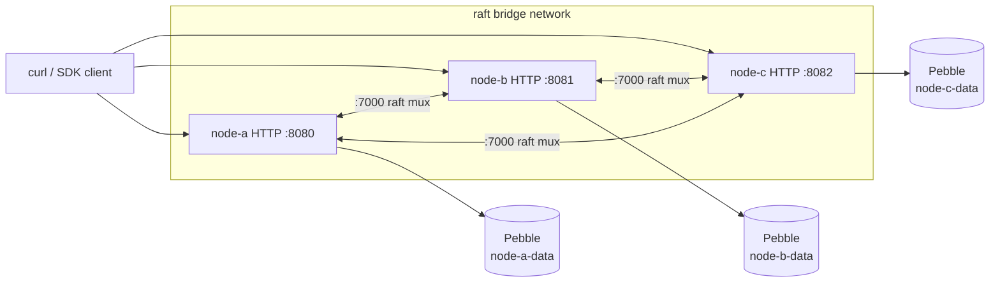

# Get Started: Run With Docker Compose

A three-node raft cluster is the smallest deployment that survives a node failure with no operator intervention. Three codeQ containers run identical binaries, share a static peer list, and replicate every write through `hashicorp/raft`. One node is the leader; the other two are followers. If the leader dies, the remaining two elect a new one in under a second and the cluster keeps accepting writes.

The repository ships a `docker compose` template at `deploy/docker-compose/raft-cluster/compose.yaml` that wires this up correctly. This page walks through bringing it up, observing leadership, submitting tasks, killing a node, and watching the cluster survive.

## 1. The topology

Three services — `node-a`, `node-b`, `node-c` — sharing the same image and almost the same environment. Each node publishes HTTP on a different host port (8080, 8081, 8082) so curl can target any of them; internally they all listen on `:8080`. The raft TCP transport is on `:7000` inside each container, demuxed by the multiplexer transport (see [Mux Transport](IO-Mux-Transport)). Peers find each other by Docker DNS — the hostnames `node-a`, `node-b`, `node-c` resolve inside the `raft` bridge network.



Only `node-a` has `RAFT_BOOTSTRAP=true`. That flag tells raft to initialize cluster membership the first time the process starts. After raft has persisted its state, the flag is ignored on subsequent restarts — bootstrap is idempotent but only meaningful at first boot.

The compose file lives at `deploy/docker-compose/raft-cluster/compose.yaml` and is the source of truth for everything below. Read it once before bringing up the stack; the inline comments explain the wire-shape decisions (mux, peer list format, HTTP-addr surface for the leader-redirect).

## 2. Bring it up

From the repository root:

```bash
cd deploy/docker-compose/raft-cluster
docker compose up -d
```

The first `up` pulls the image, creates three named volumes (`node-a-data`, `node-b-data`, `node-c-data`) plus three artifact volumes, builds the bridge network, and starts the containers in order: `node-a` first (because it carries the bootstrap flag), then `node-b` and `node-c` (which have `depends_on: node-a` so the raft transport on the leader is listening before they try to join).

Watch the logs to see the initial election:

```bash
docker compose logs -f
```

Within roughly one second `node-a` logs "elected leader" and the other two log "received append entries". After that the cluster is in steady state. There is no separate "ready" check beyond watching for the first successful append.

## 3. Observe cluster state

The HTTP endpoint `GET /v1/codeq/raft/status` returns the local node's view of cluster membership: the current leader id, the peer list, every peer's bind address, and (when configured) every peer's HTTP base URL. The route is at `pkg/app/url_mappings.go:39` and is exposed under the `anyAuth` group, meaning any valid bearer token works — no admin privilege required.

```bash
AUTH='Authorization: Bearer dev-token'
JSON='Content-Type: application/json'
curl -s http://localhost:8080/v1/codeq/raft/status -H "$AUTH" | jq
```

The response carries a `leaderID`, a `peers` array with `{id, bindAddr, httpAddr}` per node, and a `groups` array describing each raft group's state. With multi-shard raft disabled (the default in this template) there is one group; with `numShards > 1` you get one entry per shard, each with its own leader.

Hit each node's HTTP port in turn:

```bash
for p in 8080 8081 8082; do echo "node on :$p"; curl -s "http://localhost:$p/v1/codeq/raft/status" -H "$AUTH" | jq '.leaderID'; done
```

All three return the same `leaderID`. That is the majority-quorum invariant: every node agrees on who the leader is, because raft only commits a leadership change after a majority of nodes acknowledge it.

## 4. Submit a task to any node

The point of cluster routing is that you do not have to know which node is the leader. Every node accepts every request. Writes that need consensus (create, claim, result submit) get forwarded or replicated as needed; reads return local state.

```bash
TASK_ID=$(curl -s -X POST http://localhost:8081/v1/codeq/tasks -H "$AUTH" -H "$JSON" -d '{"command":"PROCESS_ORDER","payload":{"orderId":"42"},"priority":5}' | jq -r '.id')
echo "$TASK_ID"
```

Notice the request went to `:8081` (node-b). If node-b is a follower, two things can happen depending on the configuration: the follower can transparently forward the write to the leader over the cluster control plane, or it can respond `307 Temporary Redirect` with the leader's HTTP URL in the `Location` header. The template enables the latter via `RAFT_PEER_HTTP_ADDRS` — when a follower sees a write, it looks up the leader's HTTP base URL from that map and sends back a redirect. The Go SDK and any well-behaved HTTP client follows the redirect automatically.

Verify the task landed on the leader's Pebble (and on the others, via raft replication):

```bash
for p in 8080 8081 8082; do echo "node :$p"; curl -s "http://localhost:$p/v1/codeq/tasks/${TASK_ID}" -H "$AUTH" | jq '.status'; done
```

All three should print `"PENDING"`. The write went through raft.Apply on the leader, was replicated to the followers' FSMs, and committed once the majority quorum (2 of 3) ack'd. That is what consensus buys you: the same task body is on all three disks before the producer's `200 OK` came back.

## 5. Claim and complete

A worker hits any node. The claim is a write — it moves the task from the ready set to the in-progress set and records a lease. With raft enabled, that state transition flows through `raft.Apply` exactly like the create.

```bash
curl -s -X POST http://localhost:8082/v1/codeq/tasks/claim -H "$AUTH" -H "$JSON" -d '{"commands":["PROCESS_ORDER"],"leaseSeconds":60,"waitSeconds":5}' | jq
curl -s -X POST "http://localhost:8080/v1/codeq/tasks/${TASK_ID}/result" -H "$AUTH" -H "$JSON" -d '{"status":"COMPLETED","result":{"ok":true}}'
curl -s "http://localhost:8080/v1/codeq/tasks/${TASK_ID}" -H "$AUTH" | jq '.status'
```

Three nodes, three different host ports, one task, one result, one final `"COMPLETED"`. The replication is invisible from the client's perspective. That is the point.

## 6. Kill the leader

The interesting part. Find the current leader, stop its container, and watch the other two elect a replacement.

```bash
LEADER=$(curl -s http://localhost:8080/v1/codeq/raft/status -H "$AUTH" | jq -r '.leaderID')
echo "current leader: $LEADER"
docker compose stop "$LEADER"
```

Within a second or two, the remaining nodes elect a new leader. Confirm:

```bash
sleep 3
curl -s http://localhost:8081/v1/codeq/raft/status -H "$AUTH" | jq '.leaderID'
```

The reported leader id is one of the two surviving nodes. Submit a task:

```bash
curl -s -X POST http://localhost:8081/v1/codeq/tasks -H "$AUTH" -H "$JSON" -d '{"command":"PROCESS_ORDER","payload":{"orderId":"43"},"priority":5}' | jq
```

It works. Bring the failed node back:

```bash
docker compose start "$LEADER"
```

It rejoins as a follower, catches up via raft's AppendEntries, and the cluster is back to three healthy nodes. The election is documented in detail in [Cluster-Level Failover](Concepts-Cluster-Level-Failover); the protocol-level mechanics are in [Raft Replication](IO-Raft-Replication).

## 7. The template, annotated

A reading guide to `deploy/docker-compose/raft-cluster/compose.yaml`. The full file is in the repo; this is what the noteworthy lines do.

`PERSISTENCE_PROVIDER=pebble` and `PERSISTENCE_CONFIG={"path":"/var/lib/codeq/pebble"}` open an embedded Pebble store inside each container. The named volume on `/var/lib/codeq/pebble` keeps the store across restarts.

`RAFT_ENABLED=true` switches the application into the raft topology. The application uses a different write path that wraps every Pebble batch in a `raft.Apply` (see [Raft Replication](IO-Raft-Replication)).

`RAFT_MUX_ENABLED=true` puts every raft group's transport on a single TCP listener at `:7000`, demuxed by a group-ID prefix. Without the mux, each shard's raft group binds its own port at `bindAddr + shardIdx`. The mux is the recommended topology for new clusters; existing clusters need a re-bootstrap to switch because the wire shape changes.

`RAFT_PEERS=node-a=node-a:7000,node-b=node-b:7000,node-c=node-c:7000` is the static peer list. Every node knows the full set up front. Docker bridge DNS resolves the hostnames inside the network.

`RAFT_PEER_HTTP_ADDRS=node-a=http://node-a:8080,...` is the optional HTTP-base-URL map used for the leader-redirect. When a follower receives a write, it looks up the current leader's HTTP URL here and responds `307` so the client retries against the leader directly.

`RAFT_SELF_ID` is per-node; it identifies which entry in `RAFT_PEERS` this container is.

`RAFT_BOOTSTRAP=true` (only on node-a) initializes cluster membership on first boot. Setting it on more than one node is a configuration error — they would each try to start a separate cluster.

`PRODUCER_AUTH_PROVIDER=static` and `WORKER_AUTH_PROVIDER=static` register inline dev tokens for both surfaces. For production, set them to `jwks` and provide a JWKS URL; see [Authentication and Authorization](Concepts-Authentication-And-Authorization).

The `CODEQ_IMAGE` variable lets you override the image — useful when you want to compose against a locally-built image. Default is `ghcr.io/osvaldoandrade/codeq-service:latest`.

```bash
CODEQ_IMAGE=codeq:dev docker compose up -d
```

## 8. Multi-shard raft

A single raft group per cluster is the simplest configuration and what the default template provides. For higher write throughput you can shard the keyspace into N independent raft groups; each shard has its own leader, its own log, and its own commit pipeline. The configuration knob is `numShards` inside `PERSISTENCE_CONFIG`:

```yaml
PERSISTENCE_CONFIG: '{"path":"/var/lib/codeq/pebble","numShards":4}'
```

Reserve consecutive raft ports per node when not using mux; with `RAFT_MUX_ENABLED=true` they share `:7000`. The cluster `GET /v1/codeq/raft/status` now reports four groups, each with its own leader (possibly on different physical nodes). Routing decides which group each task belongs to based on a stable hash of the task id. The full design is in [Sharding](Concepts-Sharding).

The throughput benefit and the operational cost are quantified in [Multi-Shard Scaling](Performance-Multi-Shard-Scaling). For a first deployment, leave `numShards` at 1; switch when single-shard throughput is the bottleneck.

## 9. Persistence and durability

Each node has its own Pebble store on its own volume. Every committed write is on every node's disk — that is the durability story. A single disk failure on one node does not lose data; raft replicates from the other two on the next read. A two-disk failure across the cluster (two of three nodes both lose their volumes simultaneously) does lose committed data because the majority quorum collapses.

Pebble's `fsync` discipline is the same as the single-container case. The default `fsyncOnCommit: false` defers to the group-commit coalescer; raft's own log carries its own fsync. For very strict durability (no loss on a coordinated power failure across all three nodes) flip `fsyncOnCommit: true` and accept the latency hit.

## 10. Tear it down

```bash
docker compose down              # stop containers, keep volumes
docker compose down --volumes    # also remove the named volumes
```

The second form is destructive — every committed task is gone with the volumes.

## 11. Where to go next

If the three-node compose is the deployment you want long term, you are done. The compose template runs unchanged in production on a single docker host; for multi-host raft you move to Kubernetes (see [Run In Kubernetes](Get-Started-Run-In-Kubernetes)) or hand-roll the topology against your orchestrator.

If you want to understand why a write needs three FSMs and what raft does between `POST /v1/codeq/tasks` and the `200 OK`, read [Consensus and Replication](Concepts-Consensus-And-Replication). The raft state machine, the leader lease, the log compaction, the snapshot mechanism — all there.

If you want to know what the failover looks like under load — how long the new-leader election takes, how the in-flight tasks survive — read [Cluster-Level Failover](Concepts-Cluster-Level-Failover).

If you want the cost of HA in throughput terms, [Cost of HA](Performance-Cost-Of-HA) compares single-node Pebble against three-node raft on the same hardware.
