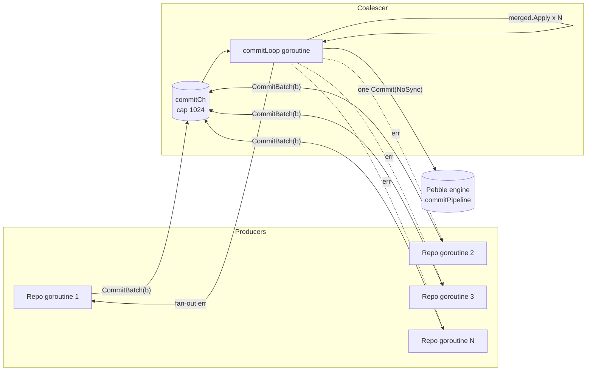

# IO Group Commit Coalescer

Every write that crosses codeQ's persistence boundary passes through a single goroutine that batches concurrent submissions into one engine commit. The mechanism is small — about sixty lines of Go — but it is the single largest throughput lever in the broker. This page explains what the coalescer does, why it exists, and what its existence costs.

The pattern is not new. MySQL's InnoDB has group commit. PostgreSQL has it. Every database that wants to combine "durable" with "fast" implements some version of it. The reason is the same in every case: durability is paid one fsync at a time, but a single fsync can cover many transactions if you let them queue up first. codeQ's coalescer is the same shape, adapted to the LSM commit pipeline rather than a redo log, and adapted to the Go runtime's channels rather than a condition variable.

## The Mutex Profile That Demanded It

The coalescer did not exist in the first cut of the persistence engine. Every repository call ended with `batch.Commit(pebbledb.NoSync)` and the engine took it from there. At low load this worked fine. At sustained load it did not.

Phase-zero profiling at 26,000 requests per second on the standard task-cycle benchmark produced a mutex profile dominated by one symbol: `pebble.commitPipeline`. Ninety-six percent of mutex contention time was waiting on the commit pipeline mutex. Forty-four percent of block-profile time was waiting on the same lock. The CPU was idle; the disk was idle; the engine was healthy. The brokers were simply queueing for a single lock inside the LSM library.

The reason is structural. Pebble — like every LSM library worth using — serialises the commit step. A commit has to do three things atomically with respect to other commits: append the batch to the WAL, advance the global sequence number, and link the batch into the active memtable. Doing these out of order or under concurrent racy access would break either crash recovery or read-after-write visibility. So the library guards them with one mutex per database, and every concurrent `Commit` call from every goroutine in the process queues for that mutex. Two hundred goroutines committing twelve-byte batches and the lock becomes the system.

There is no way to remove the lock; it is the engine's correctness primitive. There are two ways to reduce its cost. The first is to commit less often by doing more work per commit. The second is to bypass the engine entirely, which is not an option. The first is the lever the coalescer pulls.

## What The Coalescer Does

The coalescer is a single goroutine that owns the engine's write side. Every repository call funnels into it through a buffered channel; the goroutine reads requests off the channel, merges them into one large engine batch, and issues a single commit. The submitters block on per-request `done` channels and receive the merged commit's error verbatim.

The constants that shape the coalescer's behaviour live at `internal/repository/pebble/db.go:117-129`:

- `maxMergeBatch = 64` caps how many submissions can be merged into one commit. Higher values amortise the mutex over more operations but raise the tail latency for late joiners and the merged batch's memory footprint.
- `commitChanBuf = 1024` is the depth of the buffered channel between producers and the coalescer. Sized to absorb several commit cycles' worth of in-flight batches under burst — at the saturation point of around 26,000 requests per second with roughly three commits per task cycle, this is about ten milliseconds of headroom.

The submission entry point is the public `CommitBatch` method at `internal/repository/pebble/db.go:322-339`. In direct-engine mode (no replicator attached) it constructs a `commitReq`, sends it on `commitCh`, and waits on `req.done`. In replication mode it bypasses the coalescer entirely and hands the batch's serialised representation to `repl.Replicate` instead — the raft layer does its own coalescing one level up the stack, and stacking two coalescers would add latency without adding throughput.

The coalescer's algorithm is best read as pseudo-code. The real implementation is at `internal/repository/pebble/db.go:351-401`:

```
loop:
  // 1. Block until at least one submission arrives, or the DB is closing.
  first := <-commitCh

  // 2. Start a fresh merged batch and Apply the first submitter's ops into it.
  merged := db.NewBatch()
  merged.Apply(first.batch, nil)
  reqs := [first]

  // 3. Drain everything else that has already queued, up to maxMergeBatch total.
  drain:
    while len(reqs) < maxMergeBatch:
      select:
        case more := <-commitCh:
          merged.Apply(more.batch, nil)
          reqs = append(reqs, more)
        default:
          break drain  // channel empty — stop merging, commit now

  // 4. One engine commit covers the merged ops.
  err := merged.Commit(NoSync)
  merged.Close()

  // 5. Fan the result out to every submitter.
  for r := range reqs:
    r.done <- err
```

The key property is that the drain step is non-blocking. Once the coalescer has picked up at least one submission, it will not wait for more — it merges whatever has already arrived and commits. This is the bound on tail latency: a late-arriving submitter pays at most one merge cycle of wait, not an arbitrary timeout. The trade is throughput-for-tail-latency, but the latency band is tight because the merge cycle itself is microseconds, not milliseconds.

The shape of the win can be calculated directly. With sixty-four submitters arriving roughly simultaneously, the pre-coalescer cost is sixty-four lock acquisitions plus sixty-four memtable inserts plus sixty-four WAL appends. The post-coalescer cost is one lock acquisition plus sixty-four memtable inserts plus sixty-four WAL appends folded into a single batch write. The memtable inserts and the WAL appends scale linearly with operations either way — those are not the bottleneck. The lock contention scales with the number of `Commit` calls, and the coalescer turns sixty-four into one. That is why the win is large and that is why it is bounded by `maxMergeBatch`.

## The Diagram



The diagram is the algorithm. Every submitter is independent; the coalescer is the only piece that ever calls `Commit`; the engine sees one commit per merge cycle no matter how many submitters were involved.

## Why It Is The Same Shape As MySQL And PostgreSQL

Both InnoDB and PostgreSQL have spent decades on this problem and converged on the same pattern: serialise the commit step, amortise its fixed cost across as many transactions as can queue during one round. The terminology varies — MySQL calls it group commit, PostgreSQL calls it commit_delay plus the commit groups in the WAL writer, others call it batched commit — but the algorithm is one goroutine (or one thread, or one async callback) that owns the durability boundary and pulls work off a queue in clumps.

What is interesting about reaching the same design here is that the constraint is identical even though the underlying durability primitive is different. MySQL and PostgreSQL are fsync-bound: the cost they amortise is the disk write itself. codeQ in NoSync mode is mutex-bound: the cost it amortises is a lock acquisition on the commit pipeline. The mechanism that solves both is the same because the structure of the problem is the same — a fixed per-commit cost that doesn't scale with the number of operations inside the commit. Once you accept that and put one writer in front of the boundary, the merge ceiling and the channel depth and the tail-latency bound fall out the same way every time.

The difference worth noting is that codeQ's coalescer is a runtime feature of the broker, not a configurable behaviour. The constants are compile-time and there is no toggle to disable it — the reasoning sits at the end of this page, in the section on why this is not optional.

## What Goes Wrong, And What Doesn't

The first failure mode worth ruling out is starvation. Because the coalescer only commits when it has at least one submission, an idle broker pays no work; under steady load the coalescer is in the merge cycle continuously. There is no scheduled commit interval, no periodic flush, no minimum batch size — the coalescer is purely demand-driven. A burst arrives, the coalescer drains it, commits, and waits for the next one.

The second failure mode is the `Apply` step itself. If one submitter's batch is corrupt — and Pebble batches are validated cheaply on `Apply` — the merge would fail mid-way. The coalescer handles this at `internal/repository/pebble/db.go:381-393`: the failing submitter is sent the error directly, the drain loop breaks, and whatever merged successfully before the failure is committed. The submitters whose batches were already merged get the merged commit's error (which is nil if the commit succeeded). This is the only place in the merge cycle where one submitter's error path is different from the others.

The third failure mode is shutdown. The engine's `Close` method closes `stopCh` and then waits on `stopped` for the coalescer to drain (`internal/repository/pebble/db.go:175-185`). The coalescer's main loop has a `case <-d.stopCh` branch that drains any remaining queue entries with a "db closed" error so callers don't block forever (`internal/repository/pebble/db.go:355-368`). This is the contract: after `Close` returns, every in-flight `CommitBatch` caller has received either a commit error or a db-closed error. None is left hanging.

The non-failure mode is contention on the coalescer channel itself. At 1024 slots and a coalescer that drains at engine speed (microseconds per merge), the channel does not fill under the workloads codeQ is benchmarked at. If a future workload saturates it, the symptom would be `CommitBatch` callers blocking on `commitCh <- req` — which is fine, because they would block on the commit pipeline mutex without the coalescer anyway. The coalescer never makes a workload worse than the pre-coalescer baseline.

## Tail Latency Under The Coalescer

The pre-coalescer baseline was a long, uneven tail caused by the mutex queue: under 26k req/s the p99 commit time was dominated by lock wait, not by the engine. The post-coalescer tail is bounded by the merge cycle plus the commit cost. With `maxMergeBatch=64` and a commit cost on the order of five microseconds, the tail addition from the coalescer itself is well under a millisecond at the ninety-ninth percentile. The numbers reported on the single-node bench at [Benchmarks Single Node](Benchmarks-Single-Node) — 76,639 tasks per second on a full cycle through the broker — are the coalescer doing its job.

A submitter arriving just after the coalescer kicked off a merge pays one merge cycle of wait. The pre-coalescer arithmetic is brutal: with sixty-four concurrent submitters and a microsecond per lock acquisition plus the actual commit work, the lock-wait tail under contention was milliseconds, not microseconds. The coalescer's worst case is better than the pre-coalescer's average case.

## What Bypasses It

Three paths skip the coalescer entirely. The first is replication mode: when `AttachReplicator` has been called on the engine wrapper, every write — `Set`, `Delete`, `CommitBatch` — flows through the replicator's `Replicate` method instead of the coalescer (`internal/repository/pebble/db.go:103-108` and the dispatch in `CommitBatch` at lines 322-331). The raft layer has its own apply coalescer with batch ceiling 128; running both would just add latency. The full handoff is documented on [IO Raft Replication](IO-Raft-Replication).

The second is raw access for tests and migrations. The `Raw()` method exposes the underlying `*pebble.DB` directly (`internal/repository/pebble/db.go:189`). Anything written through `Raw()` does not go through the coalescer. Production repository code never calls `Raw()`; it is reserved for the benchmark harness and the offline migration tools.

The third is reads. `Get`, `Has`, and `Iter` are not write paths and the coalescer is purely a write-side construct. Reads go directly to the engine without any synchronisation beyond the engine's own internal MVCC. This is true under replication too — followers read locally and may see slightly stale data relative to the leader, but the read path is always lock-free at the broker level.

## Where The Numbers Come From

The 96-percent mutex profile and the 26,000-requests-per-second saturation point both came from the standard task-cycle benchmark — enqueue, claim, complete — run with go's built-in mutex profiler attached. The bench harness lives under `internal/bench/`; the specific run that produced the pre-coalescer profile is documented in the commit message of the change that introduced the coalescer (`perf(pebble): MoveDueDelayed fast-path + group-commit coalescer`).

The post-coalescer steady-state numbers come from the same harness. `internal/bench/profile_full_cycle_test.go` reports 76,639 tasks per second on a single-node configuration with the engine, the coalescer, and the gRPC ingress all in play. That is a full broker cycle, so the engine itself sees roughly triple that in commits per second once the result-save and lease-clear paths are accounted for.

The thirty-to-fifty percent throughput lift from the analogous coalescer on the raft side is measured against a raft-no-coalescer baseline on the three-node bench (`pkg/app/raft_grpc_bench_test.go`). The base raft path lands at six-or-seven thousand cycles per second; the coalesced raft path lands at nine-or-ten thousand cycles per second. The replication-side coalescer is the subject of its own page at [IO Raft Replication](IO-Raft-Replication).

## A Note On Why This Is Not Optional

Operational systems often grow toggles for performance features. The coalescer does not have one. The reasoning is straightforward: there is no workload under which the coalescer is a loss. Single-submitter traffic still passes through it, but with no merge candidates the drain step exits immediately and the coalescer issues a one-batch commit — identical in cost to the pre-coalescer direct commit. Multi-submitter traffic always benefits because the mutex amortisation is positive-sum.

The only reason an operator would want to disable it is for diagnostics — "is the coalescer causing this latency?" — and even there the answer is almost always no, because the pre-coalescer baseline is worse on every metric. The right knobs to expose are the constants (`maxMergeBatch` and `commitChanBuf`) for operators with measured workloads that benefit from a different ceiling. Those are compile-time today. If a real workload demands runtime tuning, the natural next step is to plumb them through the config file, but the empirical evidence has not yet required it.

The cross-references that flesh out the surrounding picture are [IO Persistence Engine](IO-Persistence-Engine) for what sits below the coalescer, [IO Raft Replication](IO-Raft-Replication) for what bypasses it under clustering, [Concepts Persistence Architecture](Concepts-Persistence-Architecture) for the system view, and [Benchmarks Single Node](Benchmarks-Single-Node) plus [Benchmarks Cluster](Benchmarks-Cluster) for the measured numbers in context.
