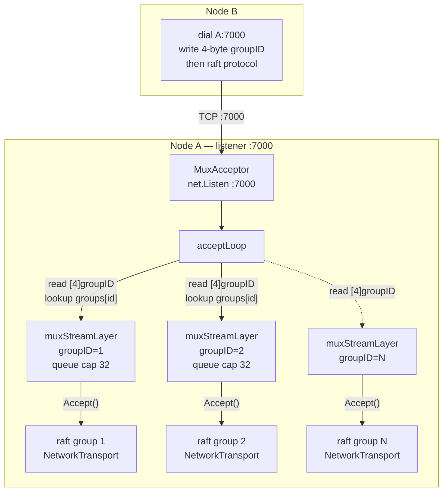

# IO Mux Transport

A raft cluster needs a network transport. Every node has to dial every other node, accept incoming connections, and route AppendEntries and RequestVote and InstallSnapshot RPCs to the raft library underneath. The transport in hashicorp/raft is normally a thin wrapper over a TCP listener: one library instance owns one listener, one port, one connection pool. That model works fine for a single raft group per node. It breaks operationally when a node hosts many raft groups at once — one per shard, in a sharded codeQ deployment — because every group wants its own port. Five shards times five nodes is twenty-five ports to reserve, document, expose through the firewall, and watch.

The mux transport solves this. One TCP listener per node handles raft traffic for every group on that node. Connections demultiplex onto per-group stream layers by a four-byte big-endian group ID written on the connection right after dial. The wire protocol that follows the prefix is unchanged hashicorp/raft. No new RPCs, no protobuf, no fork of the raft library — just a tiny prefix and a small in-process router. The code is `internal/raft/mux_transport.go:15-52` for the constructor and accept loop and lives in fewer than two hundred and forty lines total.

## Why Multiplex

The motivating constraint is operational, not theoretical. A node running a single raft group needs one listener. A node running ten raft groups for ten shards needs ten listeners on the naive design. Each one consumes a port, a `netfilter` rule, a service-mesh entry, and a row in every operator's mental model of the cluster. Multiplied across a multi-tenant deployment, the ergonomics get bad quickly.

There is also a port-allocation question. If shards come and go dynamically — a new shard for a new tenant, an old shard reaped after retention — the broker has to coordinate port assignment with whatever entity manages the network. Static port maps in the config file mean the broker has to be restarted to add a shard. Dynamic port allocation means service discovery has to track per-shard ports as well as per-node addresses. Neither is appealing.

The mux fixes both. One port per node, configured statically. Adding a shard means registering a new group with the existing acceptor and returning a stream layer the raft library can use. No ports change, no operator documents move, no service-mesh entry needs updating. The shard ID becomes the routing key inside the connection, not outside it.

The cost is a four-byte read per connection. Every accepted TCP connection starts with `io.ReadFull(conn, idBuf[:])` on a four-byte buffer (`internal/raft/mux_transport.go:121-142`). The result is parsed as a big-endian uint32 and looked up in a `map[uint32]*muxStreamLayer`. Found groups receive the connection on their queue; unknown groups close the connection and log. A one-second read deadline protects against a half-open connection that never sends the prefix. This is the entire demultiplexing protocol — four bytes, one map lookup, one channel send.

## The Wire Shape

```
client                                                     server
  |  TCP connect (e.g. peer-b:7000)                          |
  |--------------------------------------------------------> |
  |                                                           |
  |  [4]  groupID (big-endian uint32)                         |
  |--------------------------------------------------------> |  acceptLoop reads 4 bytes
  |                                                           |  lookup groups[groupID]
  |                                                           |  push conn onto layer.queue
  |                                                           |
  |  raw hashicorp/raft NetworkTransport bytes                |
  |  (Length-prefixed RPC frames: AppendEntries,              |
  |   RequestVote, InstallSnapshot, etc.)                     |
  | <======================================================> |
  |                                                           |
  |  ... (connection persists for many RPCs)                  |
```

The four-byte prefix is the only addition over plain hashicorp/raft. Once the prefix has been read, the mux is out of the way; raft's `NetworkTransport` has the raw `net.Conn` and runs its protocol on top. There is no framing, no length, no checksum — raft's own framing handles all of that. The mux is just a router.

The choice of four bytes is deliberate. Two bytes would have been enough for the shard counts codeQ targets (single digits to low hundreds), but `uint32` is the standard alignment in Go and the wire protocol cost is negligible. Eight bytes would have wasted space without buying anything. Four bytes lets the same value space cover any plausible group taxonomy — shard IDs, tenant-derived hashes, future routing keys — without ever revisiting the on-wire shape.

## The Diagram



Every shard on Node A has a registered stream layer. Every incoming connection from Node B (or C, or any peer) carries a group ID; the acceptor routes to the matching layer; the raft transport for that group calls `Accept()` and gets a connection. The reverse is identical — when raft on Node A wants to talk to Node B, the stream layer's `Dial` opens a TCP connection to Node B's `:7000`, writes the group ID prefix, and hands the raw connection to the raft transport.

## Per-Group Registration

Each shard registers exactly once per acceptor with `MuxAcceptor.RegisterGroup(groupID uint32)` (`internal/raft/mux_transport.go:86-98`). The call returns an `hraft.StreamLayer` that the raft `Config` then uses through `cfg.StreamLayer` (`internal/raft/db.go:46-51`). Duplicate registration is an error — the same group ID cannot be registered twice on the same acceptor. The acceptor itself does not assign IDs; the broker's shard allocator does, and the broker hands the ID to both the local acceptor (for registration) and the peer table (for outbound dials). The peer table is unchanged from the single-group case: it maps raft `ServerID` to a `host:port` address, where the port is now always the mux port.

The internal type that implements `hraft.StreamLayer` is `muxStreamLayer` (`internal/raft/mux_transport.go:148-163`). It carries a back-reference to the acceptor, the group ID, a buffered queue of routed connections (capacity 32), and a closed channel for shutdown coordination. `Accept()` pops from the queue; `Close()` drains it; `Addr()` returns the acceptor's actual listener address (useful when binding to `:0` for an ephemeral port in tests).

`Dial` opens a fresh TCP connection to the peer address, writes the four-byte group ID, and returns the raw connection. The hashicorp/raft `NetworkTransport` then runs its full protocol on top — handshake, version negotiation, RPC framing — without knowing anything about the mux. The dial path is at `internal/raft/mux_transport.go:217-230`. Note that the mux does not pool connections itself; raft does, one pool per `NetworkTransport`, so the mux sees every new pool entry as a fresh accept.

## Connection Lifecycle

The accept loop is a simple `for { conn := listener.Accept(); go routeConn(conn) }` (`internal/raft/mux_transport.go:104-119`). Per-connection routing is a goroutine because the four-byte read can block on a slow or hostile peer; one-second read deadline before the prefix bounds the worst case (`internal/raft/mux_transport.go:122-130`). After the prefix has been read, the deadline is cleared and raft owns the timing.

Connections that come in with an unknown group ID are closed and logged. This is the failure mode for misconfiguration — a peer that thinks it should talk to group 7 on a node where group 7 has not been registered. The log line is the diagnostic. The mux does not retry, does not buffer, does not reconfigure dynamically; the operator fixes the configuration and the peer reconnects.

The shutdown path is at `internal/raft/mux_transport.go:61-77`. `Close` on the acceptor closes the listener, marks every stream layer as closed, drains every per-layer queue, and returns. After `Close`, every registered stream layer's `Accept()` returns an error rather than hanging forever. The raft library handles this gracefully — a stream layer that returns errors from `Accept()` is signalled to the upper layers as a transport failure, which the raft state machine treats the same as any other transient network problem.

There is no graceful drain. If a node restart is in flight, the mux is closed as part of process shutdown and any in-flight raft traffic falls back to the consensus protocol's own retry. This is the right contract: raft is designed to tolerate transient transport loss, and the mux is the transport, so the mux defers to raft's resilience model rather than implementing its own.

## Per-Shard Registration Pattern

The integration with the broker's shard allocator follows a standard pattern. At startup the broker opens the mux acceptor once per node and binds it to the configured raft port. For each shard the broker hosts a raft group for, it calls `RegisterGroup` with the shard's group ID and feeds the returned stream layer into the raft `Config.StreamLayer`. The raft `Open` path then constructs a `NetworkTransport` on top of the stream layer instead of opening its own TCP listener (`internal/raft/db.go:231-244`).

In code, the wire-up looks like:

```
acc, err := raft.NewMuxAcceptor(":7000", logOut)
// ... for each shard ...
sl, err := acc.RegisterGroup(shard.GroupID)
cfg := raft.Config{ /* ... */ StreamLayer: sl }
db, err := raft.OpenWithPebble(ctx, cfg, pdb)
```

The acceptor's lifetime exceeds the lifetime of any individual raft group; new shards register with an already-running acceptor and reaped shards have their stream layers closed without disturbing siblings. This is the operational story that single-port multiplexing buys: the network surface is stable across shard topology changes.

## Why Not gRPC

A reasonable alternative would be to run raft RPCs over gRPC streams — the broker already speaks gRPC on `:9092` for its task-API control plane, so adding raft RPCs to the same listener would multiplex similarly. The reason codeQ does not is that hashicorp/raft's `NetworkTransport` is the supported transport, has its own framing and version negotiation, and works over any byte-stream connection. Wrapping it in gRPC adds two layers of framing (raft's plus gRPC's), introduces a dependency on grpc-go's flow control inside the consensus path, and complicates the wire shape for no observable benefit.

The mux approach keeps the raft path on raw TCP, where every microsecond of overhead is visible, and uses gRPC only where its features (deadlines, metadata, code-generated stubs) actually buy something — the task-API control plane and the cross-node task forwarding documented on [Concepts Cluster Shards](Concepts-Cluster-Shards). The two listeners coexist on the same node: `:7000` for raft traffic, `:9092` for gRPC task RPCs, `:9091` for Prometheus metrics, `:8080` for HTTP control plane and task ingestion. None of them overlap in port space, and none of them carry traffic from the others.

## Operational Considerations

The mux port (`:7000` by default) is internal-only. It carries raft consensus traffic between nodes in the same cluster, never client traffic. Firewall rules should expose it only to peer nodes. The HTTP control plane on `:8080` is where client traffic lands; the gRPC task plane on `:9092` is where worker traffic lands; raft on `:7000` is private. Operators who run codeQ behind a service mesh typically expose `:8080` and `:9092` through the mesh and keep `:7000` on the cluster's internal network.

The bind address is configurable. Tests bind to `127.0.0.1:0` to get an ephemeral port; `MuxAcceptor.Addr()` returns the actual address chosen so the peer table can be filled in dynamically (`internal/raft/mux_transport.go:54-56`). Production deployments bind to a stable interface address with a stable port — typically the cluster's internal interface on `:7000`.

There are no broker-level metrics for the mux today. The relevant signals — connection accept rate, unknown-group drops, per-group queue depth — are all observable from the surrounding pieces. The raft library exports its own transport metrics through the standard hashicorp/raft stats output, and pathologies at the mux layer surface as raft-level transport errors rather than as separate alerts. If a future workload makes mux-level visibility valuable, the natural additions are an unknown-group counter, a per-group accept rate gauge, and a queue-depth gauge per stream layer. The hooks are obvious from the code.

## Mux And The Rest Of The Cluster Stack

Replication is on [IO Raft Replication](IO-Raft-Replication); that page describes what the bytes on the mux connections actually carry. Sharding is on [Concepts Cluster Shards](Concepts-Cluster-Shards); that page covers the policy layer that decides which keys belong to which raft group, which then translates into which group ID flows through the mux. The cross-node task plane on `:9092` — separate from the raft mux — is on [Concepts Cluster Shards Grpc](Concepts-Cluster-Shards-Grpc). The benchmark numbers that depend on the mux transport for the three-node case are on [Benchmarks Cluster](Benchmarks-Cluster).

The deliberate minimalism of the mux is the right shape for this layer. It does one job — route TCP connections to the right raft group by a stable identifier — and it does it in fewer lines of code than the test file that exercises it. The broker's whole multi-shard story rests on this routing being trustworthy, and trustworthy here means small enough that every operator can read the code, run the test, and convince themselves it does what the page says.
