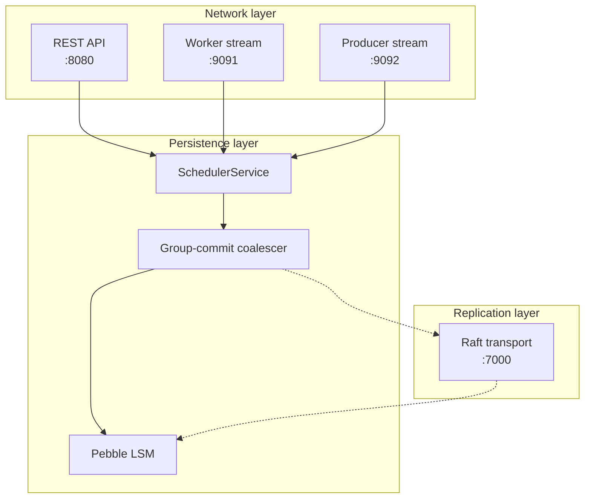

# IO Overview

CodeQ's input/output surface is a deliberate composition of three concentric layers. The outermost layer is the network: the bytes that arrive from producers and workers, framed by gRPC over HTTP/2 or by Gin's HTTP/1.1 router. Below it sits the persistence layer, where every accepted task lands in a Pebble LSM tree through a group-commit coalescer that turns many concurrent writes into a single fsync. Innermost is the replication layer, which, when raft is enabled, copies committed log entries to followers before the leader acknowledges the producer. Each layer has a distinct failure mode, a distinct backpressure signal, and a distinct port. This page frames the section; the four siblings linked below describe each surface in depth.

This sectioning matches the way the codebase is structured. The producer stream server is a self-contained package (`internal/producer/server.go`), the worker stream server is another (`internal/worker/server.go`), the HTTP controllers live in `internal/controllers/`, and the persistence engine lives behind `services.SchedulerService`. None of these layers know about the others' internals — they communicate through Go interfaces and protobuf messages. The network layer parses bytes into domain types; the persistence layer turns domain types into key-value pairs; the replication layer turns key-value pairs into raft log entries. Understanding the IO subsystem means understanding where the boundaries sit and what each one guarantees.

## The three layers

The first layer is the network. CodeQ exposes four ports in a default single-node deployment. Port `:8080` carries the REST API on HTTP/1.1, served by Gin. Port `:9091` carries the worker stream, a bidirectional gRPC service on HTTP/2. Port `:9092` carries the producer stream, the symmetric gRPC service for task creation. Port `:7000` carries raft replication traffic between codeq nodes when clustering is enabled. The REST surface is open to language-agnostic clients; the gRPC surfaces are reserved for the Go SDKs in `pkg/producerclient` and `pkg/workerclient`. Operators who run codeq behind a load balancer must publish all four ports if they want clustering and high-throughput SDKs; a debug-only deployment can get away with `:8080` alone.

The second layer is persistence. Every CreateTask request, whether it arrives over REST or gRPC, ends up calling `SchedulerService.CreateTask`, which writes a task record to Pebble. Pebble is an LSM key-value store; codeq uses it because it gives durable writes at memtable rates and supports range scans for the worker queue. The throughput cliff in any LSM store is the fsync that follows each commit, and codeq mitigates that cliff with a group-commit coalescer: many concurrent CreateTask goroutines hand their batches to a single committer goroutine, which merges them into one Pebble batch and pays one fsync. See [IO-Persistence-Engine](IO-Persistence-Engine) and [IO-Group-Commit-Coalescer](IO-Group-Commit-Coalescer) for the mechanics.

The third layer is replication. In a single-node deployment this layer is a passthrough: the local Pebble commit is the final word. In a clustered deployment, the SchedulerService delegates writes to a raft group, which appends the entry to its log, replicates it to followers, and only then applies it to the local Pebble state. Replication adds latency (one round trip to the slowest follower in the quorum) in exchange for survivability across single-node failures. The raft transport binds to `:7000` by default; see [IO-Raft-Replication](IO-Raft-Replication) for the consistency model.

## Port map

The four ports are independent listeners; nothing prevents an operator from binding them to different interfaces or wrapping them in different TLS configurations. The default `codeq.example.yml` exposes them as follows.

The dotted edges from coalescer to raft and from raft back to Pebble are only active when clustering is enabled. In single-node mode the coalescer writes directly to the local Pebble database and returns.

## Why three layers instead of one

The temptation in a small queue system is to collapse all of this into one layer: a single HTTP handler that parses, writes, and replicates inline. CodeQ used to look closer to that shape, and the profile showed the cost. The HTTP transport in Go's standard library serializes writes to the response body through a mutex, which becomes the bottleneck at roughly 3,000 to 4,000 requests per second on a single client connection. The gRPC stream layer was added precisely to bypass that mutex: a bidirectional stream multiplexes thousands of in-flight requests over one HTTP/2 connection, with sequence numbers correlating each ack back to its request. The measured single-node throughput jumped from the low thousands on REST to 76,639 tasks per second on gRPC streams under the full-cycle benchmark in `internal/bench/profile_full_cycle_test.go`. The HTTP layer remains for debugging, scripting, and language-agnostic clients; the gRPC layer carries production traffic.

The same logic applies one layer deeper. Without the group-commit coalescer, a thousand concurrent producers each issuing one Pebble commit would each pay an fsync, capping throughput at the disk's IOPS. With the coalescer, those thousand commits collapse into a handful of batches per second and the bottleneck moves from disk to CPU. The coalescer is invisible to the producer — it sees the same CreateAck either way — but it is what lets the persistence layer keep up with the network layer. See [IO-Group-Commit-Coalescer](IO-Group-Commit-Coalescer) for the implementation.

And replication is split from persistence because replication semantics are not free. Forcing every CreateTask through raft would double the median write latency even in a single-node deployment, where the raft "round trip" is just a function call. By making replication an optional layer that wraps the persistence layer, codeq lets operators choose: durability across one node's failure, or lower latency in single-node mode.

## Backpressure and bounded queues

Each of the three layers has its own backpressure mechanism, and each one is deliberately bounded.

At the network layer, the gRPC streams use a per-session writer goroutine fed by a bounded channel. The channel buffer is 256 events on both the producer side (`internal/producer/server.go:70`) and the worker side (`internal/worker/server.go:98`). When a producer pipelines more than 256 CreateTask events ahead of the server's writer, the next `send` call blocks on the channel until the writer drains. If the client's context fires before the channel has space, the send falls through with `ctx.Err()` rather than waiting forever. This bounded-channel design is what keeps a slow Pebble commit from accumulating an unbounded backlog of pending acks in memory.

At the persistence layer, the coalescer admits new requests through a similar bounded channel. The Pebble engine writes in batches; the coalescer assembles those batches by reading from its input channel until either the channel drains or a maximum batch size is hit. If producers outrun the disk, the channel fills, and the next write into the coalescer blocks. The producer then sees a slower CreateAck — not a failure, just a longer round trip — which propagates back to the client as flow control without any explicit signal.

At the replication layer, raft itself bounds the number of in-flight entries by the configured `MaxInflightMsgs`. When followers fall behind, the leader's append queue saturates and CreateAck latency rises until followers catch up. This is the slowest of the three backpressure paths because it involves a network round trip per quorum write; in clustered deployments it usually dominates median latency.

## How to read the rest of the IO section

The sibling pages of this section drill into each surface in turn. The network layer is covered by three pages.

- [IO-Producer-Stream](IO-Producer-Stream) covers the gRPC stream on `:9092`, the Hello/CreateTask/CreateAck wire shape, and the sequence-number correlation that lets one stream pipeline thousands of in-flight requests.
- [IO-Worker-Stream](IO-Worker-Stream) covers the symmetric stream on `:9091`, the per-slot Ready/Task/Result loop, and the four Result constructors that map onto the four ways a handler can dispose of a task.
- [IO-REST-API](IO-REST-API) lists the HTTP endpoints, documents the Bearer token format, and explains when REST is the right choice over gRPC.

The persistence layer is covered by two pages. [IO-Persistence-Engine](IO-Persistence-Engine) describes the Pebble schema, the queue indexes, and the read paths used by GetTask and ClaimTask. [IO-Group-Commit-Coalescer](IO-Group-Commit-Coalescer) covers the batching mechanism that amortises fsync cost across concurrent writes. The replication layer is covered by [IO-Raft-Replication](IO-Raft-Replication), which describes the per-shard raft groups, the leader-redirect protocol, and the consistency guarantees offered when clustering is enabled, and by [IO-Mux-Transport](IO-Mux-Transport), which covers the single-port multiplexing option that lets gRPC and raft share a listener.

The recommended reading order matches the three layers: start with the network pages, work down through persistence, finish with replication. Each page assumes you have read the ones above it but does not assume you have read the ones below.

## Choosing the right surface

The decision between REST and gRPC is almost always made on throughput. A producer that creates fewer than a thousand tasks per second can use REST and never notice the difference; a producer that needs to sustain tens of thousands of tasks per second should use the gRPC stream. The same applies to workers: a worker pool that processes a few tasks per minute can poll over REST, but a pool that processes tens of thousands per second must use the worker stream. The gRPC stream's win comes from amortising the per-call HTTP middleware cost (authentication, rate limiting, JSON parsing) across a long-lived connection that does the handshake exactly once.

The decision between single-node and clustered is made on durability. Single-node codeq survives process restarts (Pebble is durable on disk) but not the disk's failure. Clustered codeq with three nodes survives the loss of any one node. The cost is the replication round trip, which adds a few hundred microseconds of median latency on a healthy LAN and considerably more on a saturated one. See [Concepts-Replication](Concepts-Replication) for the durability model and [IO-Raft-Replication](IO-Raft-Replication) for the wire details.

## A note on terminology

Throughout the IO section, the word "stream" refers specifically to a gRPC bidirectional stream — one open `Stream` rpc carrying many logical events in both directions. The producer stream and worker stream are two distinct services, defined in two distinct protobuf packages, hosted by two distinct gRPC servers on two distinct ports. They share design vocabulary and implementation patterns (per-session writer goroutine, 256-slot bounded send channel, atomic-pointer error poisoning) but they are not the same code path. When this documentation says "the stream" without a qualifier, it refers to whichever stream the surrounding context is about. The fully qualified names — producer stream, worker stream — appear whenever ambiguity is possible.

The word "task" refers to one unit of work the system tracks end-to-end: a record with an ID, a command, a payload, a status, and a lifecycle that runs from PENDING through CLAIMED to COMPLETED, FAILED, or DLQ. The same word is used in the gRPC protobuf (`workerpb.Task`), in the Go domain model (`domain.Task`), and in the REST JSON. They carry slightly different fields — the gRPC wire form omits some of the bookkeeping fields the domain model uses internally — but they refer to the same logical entity. The persistence layer stores one canonical row per task; the network layer just projects different views of it.

## Closing

The sibling pages do not repeat this overview. They assume you understand that the network, persistence, and replication layers are distinct, that each one is bounded by an explicit backpressure mechanism, and that the four ports above carry independent traffic with independent failure modes. Read them in any order once you have that mental model.
