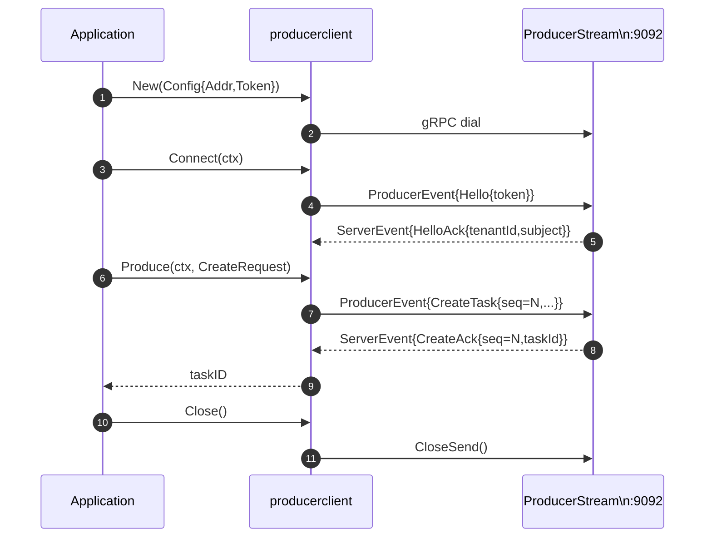

# IO Producer Stream

The producer stream is codeq's high-throughput entry point for creating tasks. It is a bidirectional gRPC service on port `:9092`, defined by the `ProducerStream.Stream` rpc in `internal/producer/producerpb`. A producer opens one long-lived stream per process, authenticates once with a Hello message, and then pipelines CreateTask events down the same stream for the lifetime of the connection. The server pushes a CreateAck back for each event, correlated by sequence number. One stream serves an arbitrary number of concurrent producer goroutines because Produce is safe to call from many goroutines at once; the SDK demultiplexes acks back to the right caller via a `sync.Map` of sequence-to-channel pairs.

The point of this stream is to bypass the HTTP middleware cost that dominated CPU under load on the REST path. Every REST POST to `/v1/codeq/tasks` runs through Gin's router, the authentication middleware, the rate-limiter, JSON parsing, and the response writer's mutex. None of that work is cheap and most of it is paid per request. On the producer stream, authentication happens exactly once (on Hello), the rate limiter sees one logical connection rather than thousands of requests, and the wire format is a protobuf message that one party encodes and another decodes without the JSON detour. The bench in `internal/bench/producer_stream_vs_rest_test.go` measures the gap directly: REST tops out near 3,000 to 4,000 tasks per second on a single client, while the stream sustains tens of thousands.

## Wire shape

A producer stream session has a strict opening handshake and an open-ended event loop. The first message a client sends must be a `ProducerEvent` containing `Hello{token: "..."}`. The server validates the bearer token against its `auth.Validator`, looks up the tenant from the claims, and replies with `ServerEvent` containing `HelloAck{tenantId, subject}`. Any other first message earns a `FailedPrecondition` error and a closed stream. The handshake fixes the tenant identity for the rest of the session; subsequent CreateTask events do not carry tenant identifiers because the server already knows who the client is.

After HelloAck, the client may pipeline CreateTask events in any quantity. Each event carries a 64-bit `seq` that the SDK assigns from a monotonic atomic counter. The server processes events concurrently and sends one CreateAck per event with the matching `seq`, an `ok` flag, and either a `taskId` (on success) or an `errorMessage` (on rejection). The client demuxes acks back to the originating Produce call by looking the seq up in its pending map. There is no ordering guarantee between acks for distinct seqs — a slow Pebble commit for seq 7 can land after a fast commit for seq 8 — which is what lets one stream support pipelined concurrency.

The wire also supports a batch form. A producer can send `CreateTaskBatch{tasks: [...]}` carrying N CreateTask payloads, and the server replies with one `CreateAckBatch{acks: [...]}` carrying N acks in input order. The batch form is a pure throughput optimization: instead of N gRPC sends and N writer-goroutine wakeups on the server, the batch path uses one send, one wakeup, and one CreateAckBatch on the wire. The server processes the N tasks serially inside the batch handler (`internal/producer/server.go:258` documents why: per-task goroutines were showing up under `runtime.newstack` in the profile). See `pkg/producerclient/client.go:355` for the SDK entry point.

## Session lifecycle



The diagram shows the canonical single-Produce path. In practice many Produce calls overlap: the client's writer goroutine drains a 256-entry channel of outbound events while the reader goroutine drains incoming acks and posts them to the matching pending channel. Each Produce call blocks on its own per-seq channel, not on the stream itself, so a stalled ack for one seq does not stall any other.

## Server-side fanout

The server handles one stream in three cooperating goroutines. The caller's goroutine runs the read loop: `stream.Recv()` in a loop, dispatching each event to a handler. The writer goroutine drains a 256-entry buffered channel (`sendChanBuffer` in `internal/producer/server.go:70`) and calls `stream.Send()` for each enqueued ServerEvent. Per-event handler goroutines do the actual work — calling `Scheduler.CreateTask`, building the CreateAck, and pushing it into the writer's channel.

The fanout matters because a slow Pebble commit must not head-of-line the read loop. If event handling happened inline on the read goroutine, one slow CreateTask would freeze the entire session, blocking all subsequent reads and starving the writer. Spawning a goroutine per event decouples them: the read loop keeps draining the wire, the writer keeps draining acks, and slow commits add latency to one ack without stalling the others. The cost is N goroutine spawns per stream-second; the profile showed this is well below the gain from the parallelism.

The writer goroutine instead of a sendMu mutex is a phase-6 finding. Earlier code held a mutex around `stream.Send`, which produced about 74% of the entire mutex profile under high pipelining load. Multiple per-event handler goroutines were contending for that mutex on every ack. Replacing the mutex with a single-writer channel eliminates the contention: only one goroutine ever touches `stream.Send`, and the producers push into a lock-free channel. The pattern is symmetric across the producer server, the worker server, the producer client, and the worker client.

The first send failure poisons the session via `sendErr atomic.Pointer[error]`. Subsequent senders read the pointer on every send and short-circuit if it is set; the writer goroutine drains its channel without sending after a failure, so producers do not block forever pushing into a dead stream. This is the only path through which a transport-level failure surfaces to the per-event handlers without explicit coordination.

## Backpressure

The `sendChanBuffer` constant is the explicit knob that bounds backpressure on the server side. With 256 slots, a producer pipelining 256 CreateTask events ahead of the server's writer will see its 257th send block on the channel rather than allocate memory unbounded. The block path falls through if the stream context fires, so a producer that disconnects mid-pipeline does not strand handler goroutines on a full channel. The number 256 is not magic: it is large enough to absorb the burst of acks a real workload produces between writer-goroutine scheduling events, small enough that pathological backpressure surfaces as `ctx.Err()` within a bounded window.

On the client side the same number gates the SDK's outbound queue. `sendChanBufferClient` (`pkg/producerclient/client.go:136`) sets the same 256-slot buffer in front of `stream.Send`. A producer that calls Produce from 1,000 goroutines concurrently will see 256 events queued, and the next 744 callers will block in the channel send until the writer goroutine flushes capacity. The block falls through on `streamCtx.Done()`, so a closed session unblocks pending senders with the context error.

## Why streams beat REST

The naive question is "why not just POST faster?" The Go standard library answers it. `net/http` serializes writes to the response body through `transport.persistConn.writeLoopOnce`, which acquires a mutex shared by all in-flight requests on the same TCP connection. Pipelining N concurrent POSTs against a single HTTP/1.1 connection runs them through that mutex one at a time, capping throughput at about 3,000 to 4,000 per second on a single connection. The standard escape is to open many connections, but each one repeats the TLS handshake (if enabled), the bearer-token validation, the rate-limiter consultation, and the JSON decode. The fixed cost per request stays high.

A gRPC bidirectional stream uses HTTP/2 multiplexing: many logical messages flow over one TCP connection without per-message HEAD-of-line blocking. The codeq stream goes further and pipelines logical operations over a single gRPC stream — there is no per-CreateTask gRPC call, just events on one open stream. The HTTP/2 frame layer carries one Hello → many CreateTask → many CreateAck, all multiplexed by the protocol. The server side processes each event with a small goroutine spawn, and the client side correlates acks back to callers with a `sync.Map` lookup. The result, measured in `internal/bench/profile_full_cycle_test.go`, is 76,639 tasks per second end-to-end on a single node — produce, claim, complete — versus the REST baseline an order of magnitude lower.

The other axis is the amortisation of the auth check. On REST, every POST runs through `middleware.AuthMiddleware`, which decodes and verifies the JWT. JWT verification involves base64 decoding, JSON parsing, and a cryptographic check; under load it dominates CPU. On the stream, the JWT is verified exactly once at Hello, and the resulting claims live in the session struct (`internal/producer/server.go:194`). Every subsequent CreateTask reads tenant identity from memory, not from a re-parsed token.

## Code example

The high-level entry points are `producerclient.New` to build a Client, `Connect` to open a session, and `Session.Produce` to send one CreateTask and block on its ack.

```go
package main

import (
    "context"
    "log"
    "time"

    "github.com/osvaldoandrade/codeq/pkg/producerclient"
)

func main() {
    cli, err := producerclient.New(producerclient.Config{
        Addr:  "localhost:9092",
        Token: producerToken,
    })
    if err != nil {
        log.Fatal(err)
    }
    defer cli.Close()

    ctx := context.Background()
    sess, err := cli.Connect(ctx)
    if err != nil {
        log.Fatal(err)
    }
    defer sess.Close()

    taskID, err := sess.Produce(ctx, producerclient.CreateRequest{
        Command:      "send-email",
        Payload:      []byte(`{"to":"a@b.com"}`),
        Priority:     10,
        MaxAttempts:  3,
        DelaySeconds: 0,
        RunAt:        time.Time{}, // immediate
    })
    if err != nil {
        log.Fatalf("produce: %v", err)
    }
    log.Printf("created task %s for tenant %s", taskID, sess.TenantID())
}
```

`Produce` blocks the calling goroutine until the matching CreateAck arrives or the context fires. It is safe to call from many goroutines on one Session — the SDK's writer goroutine serializes their sends and the reader goroutine demultiplexes acks back. A producer that wants to pipeline many tasks should launch many goroutines, each calling Produce; the SDK handles the rest.

For higher-throughput cases the SDK offers `Session.ProduceBatch`, which packs N CreateTasks into one CreateTaskBatch on the wire. The function returns a slice of BatchResult in input order, each carrying either a TaskID or an error.

```go
results, err := sess.ProduceBatch(ctx, []producerclient.CreateRequest{
    {Command: "send-email", Payload: []byte(`{"to":"a@b.com"}`)},
    {Command: "send-email", Payload: []byte(`{"to":"c@d.com"}`)},
    {Command: "render-pdf", Payload: []byte(`{"doc":"42"}`)},
})
if err != nil {
    log.Fatal(err)
}
for i, r := range results {
    if r.Err != nil {
        log.Printf("[%d] rejected: %v", i, r.Err)
        continue
    }
    log.Printf("[%d] created %s", i, r.TaskID)
}
```

ProduceBatch is best for cases where the application already has a batch of work in hand (a webhook fan-out, a bulk import, a cron job sweep). The latency win comes from collapsing N gRPC sends into one and N writer-goroutine wakeups into one. The throughput win comes from the matching server-side optimization in `handleCreateBatch` which processes the batch in a single goroutine rather than spawning N per-task goroutines.

## Field reference

The CreateRequest type mirrors the REST POST body. Command and Payload are required; everything else defaults to zero.

| Field            | Purpose                                                                 |
|------------------|-------------------------------------------------------------------------|
| `Command`        | Routing key; the worker's `Commands` claim must include this           |
| `Payload`        | Opaque bytes delivered to the worker; codeq does not parse it          |
| `Priority`       | Higher number claimed first within the same command                    |
| `Webhook`        | Optional URL that codeq POSTs to when the task completes               |
| `MaxAttempts`    | Cap on retries; 0 means "use server default"                           |
| `IdempotencyKey` | If set, a duplicate CreateTask returns the existing task ID            |
| `DelaySeconds`   | Defers the task by this many seconds before it becomes claimable        |

The `RunAt` field is an alternative to `DelaySeconds`; if both are set, `RunAt` wins. The two fields exist because some applications find absolute timestamps more natural and others prefer relative delays.

## Failure modes

A producer stream session can fail in three places, and each one surfaces a distinct error to the caller. The first is the dial: `producerclient.New` returns an error if the gRPC dial fails (DNS resolution, TCP refused, TLS handshake). The dial is lazy by default in modern gRPC, so the actual connect attempt may not happen until the first RPC; either way the error surfaces on the first Produce. The second is the Hello: an invalid token, an expired token, or a token from the wrong audience produces an Unauthenticated status that Connect returns to the caller. The third is the stream itself: a network partition, a server restart, or a context cancellation closes the stream, which the SDK detects via Recv returning an error.

When the stream dies mid-session, the SDK does not auto-reconnect. The reader goroutine sets `readErr`, fans the error out to all pending Produce callers (so they unblock with the stream error rather than waiting forever), and exits. Subsequent Produce calls see the dead-stream error via `peekReadErr` and return immediately. The application is responsible for closing the session, building a new Client, and reconnecting if it wants to recover. This design keeps the SDK simple — there are no reconnect timers, no exponential backoff, no in-memory queues — at the cost of forcing the application to handle the reconnect explicitly. Most production deployments wrap the SDK in a thin reconnect loop that retries Connect with a bounded backoff.

The "lost ack" failure mode deserves special attention. A producer that sends CreateTask and never receives CreateAck has no built-in way to know whether the server committed the task. The server may have crashed between the Pebble commit and the writer-goroutine Send; in that case the task exists but the ack never arrived. The producer's safe move is to retry with the same `IdempotencyKey`, in which case the second CreateTask returns the original task's ID rather than creating a duplicate. Without IdempotencyKey, a network-partition retry can produce two tasks for the same logical work. Production deployments should always set IdempotencyKey on creates that may be retried.

## Observability

Every Produce call surfaces three signals to the application's observability stack. The first is the returned error: nil on success, a typed error on rejection. The Go SDK does not wrap errors in custom types beyond the basics; the application can inspect them with `errors.Is` and `errors.As` to distinguish context cancellation from server rejection from transport failure. The second is the configurable `Logger` on Config, which receives structured warn-and-error events from the reader and writer goroutines. By default it inherits `slog.Default()`. The third is OpenTelemetry trace context: every CreateRequest carries `TraceParent` and `TraceState` fields that the server records on the task. A worker that processes the task can read those fields back and continue the trace, joining the producer's span to the worker's. See [Observability-Tracing](Observability-Tracing) for the trace model.

The producer server also emits Prometheus metrics for stream sessions: active sessions, total CreateTasks accepted, total CreateAcks sent, queue depth on the writer channel. Operators can dashboard these to spot stuck streams (acks accumulating without sending), saturated streams (queue depth at the channel buffer max), and dead streams (active sessions falling without graceful close). See [Observability-Metrics](Observability-Metrics) for the metric names.

## When to choose the stream

The stream is the right choice whenever the producer creates more than a few hundred tasks per second, or whenever median CreateTask latency matters at the 99th percentile. It is also the right choice for long-running producer processes, because the one-time Hello cost amortises across the session's lifetime. The REST endpoint at `/v1/codeq/tasks` is the right choice for short-lived scripts, for language-agnostic clients (the Go SDK is the only first-party SDK now that the JavaScript and Python SDKs have been retired), and for debugging because every HTTP request is independently inspectable. See [IO-REST-API](IO-REST-API) for the HTTP surface and [Get-Started-Go-SDK](Get-Started-Go-SDK) for end-to-end examples.

The throughput numbers in the bench should be read as ceilings on a single machine. Real producers usually max out somewhere lower because their CreateTask handler does work — generating payloads, querying upstream data sources, writing application logs. The stream's value is removing the codeq side of the equation from the critical path, so the producer's own work becomes the limit.
